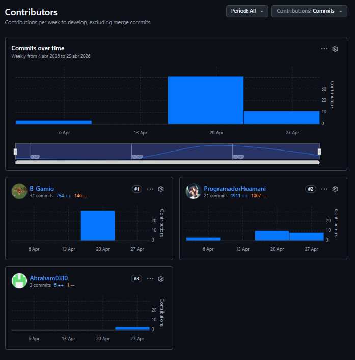
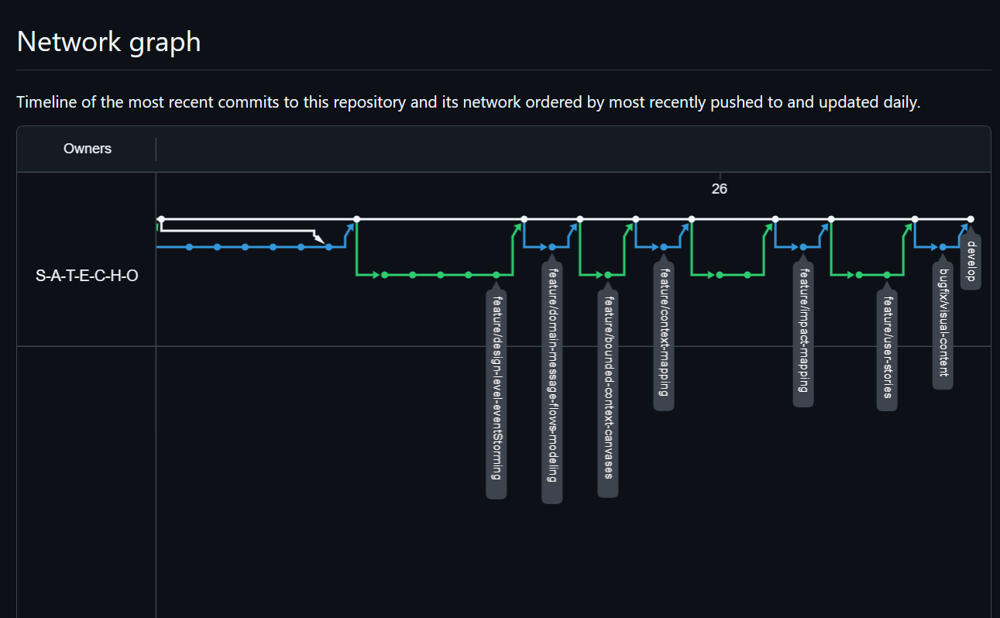
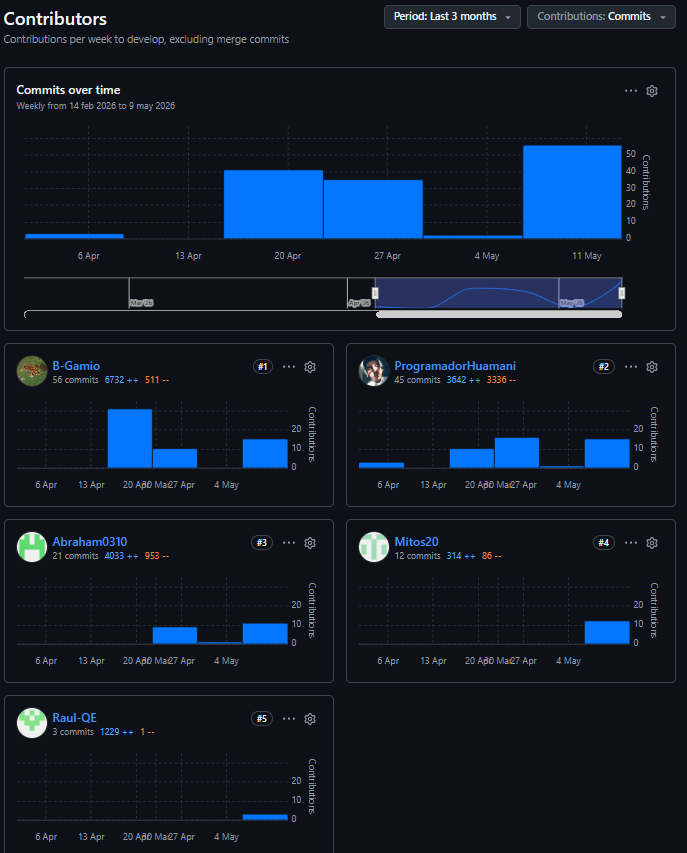
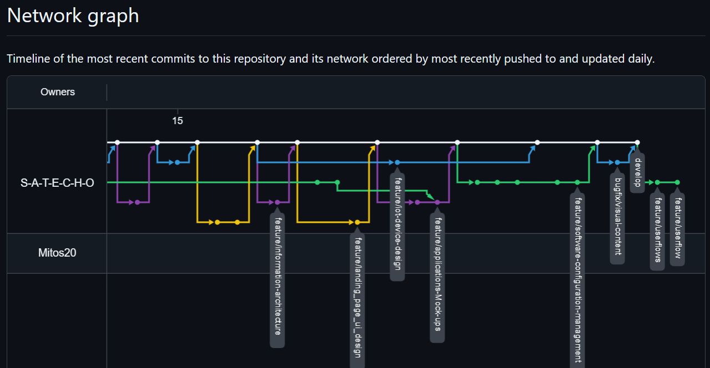
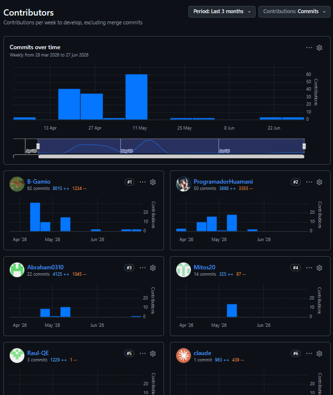
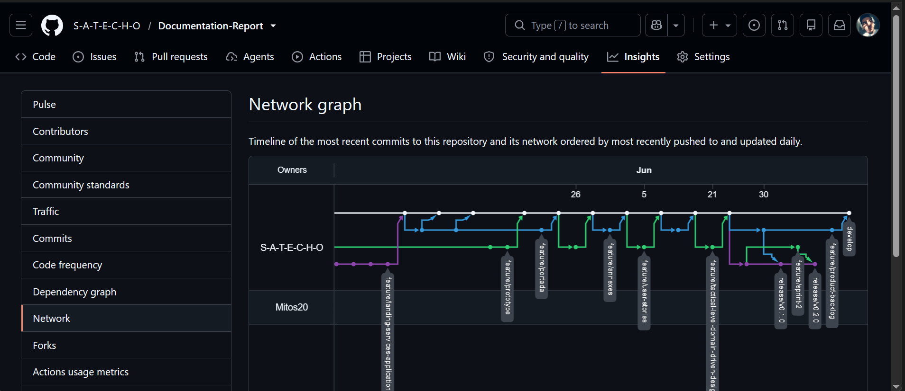

# Registro de versiones del informe

<table border="1">
  <tr>
    <th>Versión</th>
    <th>Fecha</th>
    <th>Autor</th>
    <th>Descripción de Modificación</th>
  </tr>
  <tr><td>1.0.0</td><td>05/04/2026</td><td>Huamani Sánchez, José Diego</td><td>Creación del repositorio de la documentación SATECHO.</td></tr>
  <tr><td>1.1.0</td><td>08/04/2026</td><td>Huamani Sánchez, José Diego</td><td>Redacción de la portada adjuntando los detalles acerca del código y nombre del curso, nombres de los integrantes del equipo y nombre del docente que dicta el curso.</td></tr>
  <tr><td>1.2.0</td><td>19/04/2025</td><td>Huamani Sánchez, José Diego</td><td>Implementación de la nueva arquitectura de directorios para alojar cada aspecto de la documentación por capítulo y contenidos estáticos siguiendo la guía <strong>Docs-as-code-repositories-guide-presentation</strong>.</td></tr>
  <tr><td>2.0.0</td><td>19/04/2025</td><td>Huamani Sánchez, José Diego</td><td>Descripción del <strong>Startup Profile</strong> relacionado a la <em>startup</em> SATECHO; adicional, se redactó la sección de los perfiles de los integrantes del grupo.</td></tr>
  <tr><td>2.1.0</td><td>19/04/2025</td><td>Huamani Sánchez, José Diego</td><td>Descripción del <strong>Solution Profile</strong> detallando cada uno de los antecedentes y problemáticas mediante la técnica <strong>5W's y 2H's</strong>.</td></tr>
  <tr><td>2.2.0</td><td>19/04/2025</td><td>Huamani Sánchez, José Diego</td><td>Desarrollo del <strong>Lean UX Problem Statements</strong> y <strong>Lean UX Assumptions</strong>; se adicionó el texto introductorio sobre cada uno de los procesos llevado a cabo mediante el enfoque <strong>Lean UX Process</strong>.</td></tr>
  <tr><td>2.3.0</td><td>19/04/2025</td><td>Huamani Sánchez, José Diego</td><td>Desarrollo del <strong>Lean UX Hypothesis Statements</strong>.</td></tr>
  <tr><td>2.4.0</td><td>19/04/2025</td><td>Huamani Sánchez, José Diego</td><td>Desarrollo del párrafo introductorio de lo que observaremos en el proceso del <strong>Lean UX Canvas</strong>.</td></tr>
  <tr><td>2.5.0</td><td>19/04/2025</td><td>Huamani Sánchez, José Diego</td><td>Agregación de la imagen del <strong>Lean UX Canvas</strong> del <em>startup</em> SATECHO así como la descripción de la sección de <strong>Segmentos Objetivos</strong>.</td></tr>
  <tr><td>2.7.0</td><td>19/04/2025</td><td>Gamio Upiachihua, Brenda Lucía</td><td>Agregación a la carpeta <em>assets</em> los logotipos de nuestros principales competidores.</td></tr>
  <tr><td>2.8.0</td><td>19/04/2025</td><td>Gamio Upiachihua, Brenda Lucía y Quispe Erasmo, Raul Ronaldo</td><td>Redacción del párrafo introductorio para la sección de <strong>Competidores</strong> así como el desarrollo del <strong>Análisis Competitivo</strong>.</td></tr>
  <tr><td>2.9.0</td><td>19/04/2025</td><td>Gamio Upiachihua, Brenda Lucía</td><td>Desarrollo de las <strong>Estrategias y tácticas frente a competidores</strong>.</td></tr>
  <tr><td>3.0.1</td><td>19/04/2025</td><td>Huamani Sánchez, José Diego</td><td>Resolución de fallos e incompatibilidad de versiones entre la rama <em>develop</em> con la rama <em>feature/competitors</em>.</td></tr>
  <tr><td>3.1.1</td><td>20/04/2025</td><td>Gamio Upiachihua, Brenda Lucía</td><td>Desarrollo de la formulación de las preguntas para nuestros segmentos objetivos de agricultor e ingeniero agrónomo — sección de <strong>Entrevistas</strong>.</td></tr>
  <tr><td>3.2.1</td><td>20/04/2025</td><td>Gamio Upiachihua, Brenda Lucía y Estrada Cajamune, Abraham Andrés</td><td>Elaboración de los <strong>User Personas</strong> centrados en los posibles usuarios interesados en adquirir nuestro servicio.</td></tr>
  <tr><td>3.3.1</td><td>20/04/2025</td><td>Gamio Upiachihua, Brenda Lucía</td><td>Elaboración del <strong>User Task Matrix</strong>.</td></tr>
  <tr><td>3.4.1</td><td>20/04/2025</td><td>Gamio Upiachihua, Brenda Lucía y Estrada Cajamune, Abraham Andrés</td><td>Elaboración de los <strong>User Journey Mapping</strong> orientados a cada uno de nuestros <em>User Personas</em>.</td></tr>
  <tr><td>3.5.1</td><td>20/04/2025</td><td>Gamio Upiachihua, Brenda Lucía y Estrada Cajamune, Abraham Andrés</td><td>Elaboración de los <strong>Empathy Mapping</strong>.</td></tr>
  <tr><td>3.6.1</td><td>20/04/2025</td><td>Gamio Upiachihua, Brenda Lucía</td><td>Elaboración del <strong>Big Picture Event Storming</strong> enfocándose en el análisis de los agricultores e ingenieros agrónomos.</td></tr>
  <tr><td>4.0.0</td><td>21/04/2025</td><td>Gamio Upiachihua, Brenda Lucía</td><td>Desarrollo del <strong>Ubiquitous Language</strong> para la definición de los términos que se utilizarán dentro del negocio y facilitar su trazabilidad y comprensión.</td></tr>
  <tr><td>4.1.0</td><td>21/04/2025</td><td>Huamani Sánchez, José Diego y Gamio Upiachihua, Brenda Lucía</td><td>Desarrollo de los <strong>User Stories</strong> relacionados a la funcionalidad esperada de nuestra solución orientada a las perspectivas de nuestros segmentos objetivos.</td></tr>
  <tr><td>4.2.0</td><td>21/04/2025</td><td>Estrada Cajamune, Abraham Andrés</td><td>Elaboración del <strong>Impact Mapping</strong>.</td></tr>
  <tr><td>4.3.0</td><td>21/04/2025</td><td>Huamani Sánchez, José Diego y Gamio Upiachihua, Brenda Lucía</td><td>Elaboración del <strong>Product Backlog</strong> donde priorizamos cada <em>User Story</em> mediante un sistema de calificación <strong>Fibonacci</strong>.</td></tr>
  <tr><td>5.0.0</td><td>24/04/2026</td><td>Gamio Upiachihua, Brenda Lucía</td><td>Desarrollo del <strong>Strategic-Level Domain-Driven Design</strong> y <strong>Context Mapping</strong>.</td></tr>
  <tr><td>5.1.0</td><td>24/04/2026</td><td>Renteria Palacios, Yasser</td><td>Desarrollo del <strong>Software Architecture</strong>.</td></tr>
  <tr><td>5.2.0</td><td>26/04/2026</td><td>Gamio Upiachihua, Brenda Lucía</td><td>Desarrollo del <strong>Tactical Level Domain-Driven Design</strong>.</td></tr>
  <tr><td>5.3.0</td><td>14/05/2026</td><td>Quispe Erasmo, Raul Ronaldo</td><td>Desarrollo de la sección <strong>Style Guidelines</strong> (5.1), estableciendo los lineamientos visuales generales de la solución.</td></tr>
  <tr><td>5.4.0</td><td>14/05/2026</td><td>Quispe Erasmo, Raul Ronaldo</td><td>Desarrollo de las <strong>General Style Guidelines</strong> (5.1.1): paleta de colores, tipografía, espaciado e iconografía.</td></tr>
  <tr><td>5.5.0</td><td>14/05/2026</td><td>Renteria Palacios, Yasser</td><td>Desarrollo de las <strong>Web, Mobile and IoT Style Guidelines</strong> (5.1.2).</td></tr>
  <tr><td>5.6.0</td><td>14/05/2026</td><td>Quispe Erasmo, Raul Ronaldo y Huamani Sánchez, José Diego</td><td>Desarrollo de la sección <strong>Information Architecture</strong> (5.2).</td></tr>
  <tr><td>5.7.0</td><td>14/05/2026</td><td>Quispe Erasmo, Raul Ronaldo y Huamani Sánchez, José Diego</td><td>Desarrollo de los <strong>Organization Systems</strong> (5.2.1).</td></tr>
  <tr><td>5.8.0</td><td>14/05/2026</td><td>Renteria Palacios, Yasser</td><td>Desarrollo de los <strong>Labeling Systems</strong> (5.2.2).</td></tr>
  <tr><td>5.9.0</td><td>14/05/2026</td><td>Estrada Cajamune, Abraham Andrés</td><td>Desarrollo de los <strong>SEO Tags and Meta Tags</strong> (5.2.3).</td></tr>
  <tr><td>5.10.0</td><td>14/05/2026</td><td>Estrada Cajamune, Abraham Andrés</td><td>Desarrollo de los <strong>Searching Systems</strong> (5.2.4).</td></tr>
  <tr><td>5.11.0</td><td>14/05/2026</td><td>Estrada Cajamune, Abraham Andrés</td><td>Desarrollo de los <strong>Navigation Systems</strong> (5.2.5).</td></tr>
  <tr><td>5.12.0</td><td>14/05/2026</td><td>Renteria Palacios, Yasser</td><td>Desarrollo de la sección <strong>Landing Page UI Design</strong> (5.3).</td></tr>
  <tr><td>5.13.0</td><td>14/05/2026</td><td>Renteria Palacios, Yasser</td><td>Elaboración del <strong>Landing Page Wireframe</strong> (5.3.1).</td></tr>
  <tr><td>5.14.0</td><td>14/05/2026</td><td>Huamani Sánchez, José Diego</td><td>Elaboración del <strong>Landing Page Mock-up</strong> (5.3.2).</td></tr>
  <tr><td>5.15.0</td><td>14/05/2026</td><td>Huamani Sánchez, José Diego</td><td>Desarrollo de la sección <strong>Applications UX/UI Design</strong> (5.4).</td></tr>
  <tr><td>5.16.0</td><td>14/05/2026</td><td>Renteria Palacios, Yasser</td><td>Elaboración de los <strong>Applications Wireframes</strong> (5.4.1).</td></tr>
  <tr><td>5.17.0</td><td>14/05/2026</td><td>Estrada Cajamune, Abraham Andrés</td><td>Elaboración de los <strong>Applications Wireflow Diagrams</strong> (5.4.2).</td></tr>
  <tr><td>5.18.0</td><td>14/05/2026</td><td>Quispe Erasmo, Raul Ronaldo</td><td>Elaboración de los <strong>Applications Mock-ups</strong> (5.4.3).</td></tr>
  <tr><td>5.19.0</td><td>14/05/2026</td><td>Estrada Cajamune, Abraham Andrés</td><td>Elaboración de los <strong>Applications User Flow Diagrams</strong> (5.4.4).</td></tr>
  <tr><td>5.20.0</td><td>14/05/2026</td><td>Huamani Sánchez, José Diego, Gamio Upiachihua, Brenda Lucía y Estrada Cajamune, Abraham Andrés</td><td>Desarrollo de <strong>Applications Prototyping</strong> (5.5): prototipos interactivos para web, móvil e IoT.</td></tr>
  <tr><td>5.21.0</td><td>14/05/2026</td><td>Quispe Erasmo, Raul Ronaldo</td><td>Desarrollo del <strong>IoT Device Design</strong> (5.6).</td></tr>
  <tr><td>6.0.0</td><td>14/05/2026</td><td>Huamani Sánchez, José Diego</td><td>Desarrollo de la sección <strong>Software Configuration Management</strong> (6.1).</td></tr>
  <tr><td>6.1.0</td><td>14/05/2026</td><td>Renteria Palacios, Yasser</td><td>Desarrollo del <strong>Software Development Environment Configuration</strong> (6.1.1).</td></tr>
  <tr><td>6.2.0</td><td>14/05/2026</td><td>Renteria Palacios, Yasser</td><td>Desarrollo del <strong>Source Code Management</strong> (6.1.2).</td></tr>
  <tr><td>6.3.0</td><td>14/05/2026</td><td>Huamani Sánchez, José Diego</td><td>Desarrollo del <strong>Source Code Style Guide &amp; Conventions</strong> (6.1.3).</td></tr>
  <tr><td>6.4.0</td><td>14/05/2026</td><td>Estrada Cajamune, Abraham Andrés</td><td>Desarrollo del <strong>Software Deployment Configuration</strong> (6.1.4).</td></tr>
  <tr><td>6.5.0</td><td>14/05/2026</td><td>Gamio Upiachihua, Brenda Lucía</td><td>Desarrollo de la sección introductoria de <strong>Landing Page, Services &amp; Applications Implementation</strong> (6.2).</td></tr>
  <tr><td>6.6.0</td><td>14/05/2026</td><td>Huamani Sánchez, José Diego</td><td>Desarrollo de la sección <strong>Sprint 1</strong> (6.2.1) — objetivos y alcance del sprint.</td></tr>
  <tr><td>6.7.0</td><td>14/05/2026</td><td>Huamani Sánchez, José Diego</td><td>Desarrollo del <strong>Sprint Planning 1</strong> (6.2.1.1): objetivo, velocidad del equipo e ítems seleccionados del Product Backlog.</td></tr>
  <tr><td>6.8.0</td><td>14/05/2026</td><td>Huamani Sánchez, José Diego</td><td>Desarrollo de <strong>Aspect Leaders and Collaborators</strong> (6.2.1.2).</td></tr>
  <tr><td>6.9.0</td><td>14/05/2026</td><td>Huamani Sánchez, José Diego</td><td>Elaboración del <strong>Sprint Backlog 1</strong> (6.2.1.3): User Stories y tareas comprometidas con estimaciones.</td></tr>
  <tr><td>6.10.0</td><td>14/05/2026</td><td>Estrada Cajamune, Abraham Andrés</td><td>Registro del <strong>Development Evidence for Sprint Review</strong> (6.2.1.4): commits y avances del Sprint 1.</td></tr>
  <tr><td>6.11.0</td><td>14/05/2026</td><td>Estrada Cajamune, Abraham Andrés</td><td>Registro del <strong>Testing Suite Evidence for Sprint Review</strong> (6.2.1.5).</td></tr>
  <tr><td>6.12.0</td><td>14/05/2026</td><td>Huamani Sánchez, José Diego</td><td>Registro del <strong>Execution Evidence for Sprint Review</strong> (6.2.1.6): capturas de ejecución del Sprint 1.</td></tr>
  <tr><td>6.13.0</td><td>14/05/2026</td><td>Gamio Upiachihua, Brenda Lucía y Quispe Erasmo, Raul Ronaldo</td><td>Registro del <strong>Services Documentation Evidence for Sprint Review</strong> (6.2.1.7).</td></tr>
  <tr><td>6.14.0</td><td>14/05/2026</td><td>Renteria Palacios, Yasser</td><td>Registro del <strong>Software Deployment Evidence for Sprint Review</strong> (6.2.1.8).</td></tr>
  <tr><td>6.15.0</td><td>14/05/2026</td><td>Huamani Sánchez, José Diego</td><td>Registro de los <strong>Team Collaboration Insights during Sprint</strong> (6.2.1.9).</td></tr>
  <tr><td>7.0.0</td><td>25/05/2026</td><td>Huamani Sánchez, José Diego</td><td>Desarrollo de la sección <strong>Sprint 2</strong> abarcando los puntos 6.2.2. Sprint 2 y 6.2.2.1. Sprint Planning 2</td></tr>
  <tr><td>7.1.0</td><td>25/05/2026</td><td>Gamio Upiachihua, Brenda Lucía</td><td>Elaboración y designación del punto <strong>6.2.2.2. Aspect Leaders and Collaborators</strong></td></tr>
  <tr><td>7.2.0</td><td>26/05/2026</td><td>Gamio Upiachihua, Brenda Lucía</td><td>Selección y redacción de los <em>User Stories</em> el cual el equipo SATECHO estará desarrollando para el presente Sprint (punto 6.2.2.3. Sprint Backlog)</td></tr>
  <tr><td>7.3.0</td><td>09/06/2026</td><td>Quispe Erasmo, Raul Ronaldo</td><td>Elaboración de los puntos 6.2.2.4. Development Evidence for Sprint Review y 6.2.2.5. Testing Suite Evidence for Sprint Review</td></tr>
  <tr><td>7.4.0</td><td>12/06/2026</td><td>Quispe Erasmo, Raul Ronaldo</td><td>Redacción de la sección 6.2.2.6. Execution Evidence for Sprint Review</td></tr>
  <tr><td>7.5.0</td><td>13/06/2026</td><td>Palacios, Yasser Renteria</td><td>Elaboración de los puntos 6.2.2.7. Services Documentation Evidence for Sprint Review y 6.2.2.8. Software Deployment Evidence for Sprint Review</td></tr>
  <tr><td>7.6.0</td><td>16/06/2026</td><td>Huamani Sánchez, José Diego</td><td>Redacción del punto 6.2.2.8. Team Collaboration Insights during Sprint -detallando los avances alcanzados por cada uno de los integrantes.</td></tr>
  <tr><td>7.7.0</td><td>19/06/2026</td><td>Estrada Cajamune, Abraham Andrés</td><td>Elaboracion de la sección <strong>6.3. Validation Interviews</strong>, especificamente los puntos 6.3..1. Diseño de Entrevistas y 6.3.2. Registro de Entrevistas</td></tr>
  <tr><td>7.8.0</td><td>19/06/2026</td><td>Quispe Erasmo, Raul Ronaldo</td><td>Redacción de punto 6.3.3. Evaluaciones según Heurísticas basados en la recopilación de opiniones recividas en las entrevistas de Validación registradas.</td></tr>
  <tr><td>7.8.0</td><td>20/06/2026</td><td>Huamani Sánchez, José Diego</td><td>Redacción del wording introductorio del punto 6.4. Video About-the-Product asi como la integración del video explicativo sobre la funcionalidad y trazabilidad de uso de las aplicaciones.</td></tr>
  <tr><td>7.9.0</td><td>21/06/2026</td><td>Palacios, Yasser Renteria</td><td>Actualizació de las Conclusiones, Bibliografía y Anexos acorde a la información y contexto utilizada para el desarrollo de este Sprint 2.</td></tr>
  <tr><td>8.0.0</td><td>23/05/2026</td><td>Huamani Sánchez, José Diego</td><td>Redacción del 6.2.3.1. Sprint Planning 3.</td></tr>
  <tr><td>8.1.0</td><td>23/05/2026</td><td>Quispe Erasmo, Raul Ronaldo</td><td>Elaboración de la tabla y póstuma redacción del punto 6.2.3.2. Aspect Leaders and Collaborators.</strong></td></tr>
  <tr><td>8.2.0</td><td>25/05/2026</td><td>Palacios, Yasser Renteria</td><td>Segmentación de tareas y redacción del 6.2.3.3. Sprint Backlog 3</td></tr>
  <tr><td>8.3.0</td><td>25/06/2026</td><td>Estrada Cajamune, Abraham Andrés</td><td>Elaboración del 6.2.3.4. Development Evidence for Sprint Review</td></tr>
  <tr><td>8.4.0</td><td>29/06/2026</td><td>Estrada Cajamune, Abraham Andrés</td><td>Elaboración del punto 6.2.3.5. Testing Suite Evidence for Sprint Review</td></tr>
  <tr><td>8.5.0</td><td>29/06/2026</td><td>Gamio Upiachihua, Brenda Lucía</td><td>Elaboración del wording introductorio del 6.3. Validation Interviews</td></tr>
  <tr><td>8.6.0</td><td>30/06/2026</td><td>Huamani Sánchez, José Diego</td><td>Formulación y redacción de las preguntas para el punto 6.3.1. Diseño de Entrevistas</td></tr>
  <tr><td>8.7.0</td><td>03/05/2026</td><td>Estrada Cajamune, Abraham Andrés</td><td>Desarrollo del punto de 6.3.2. Registro de Entrevistas.</td></tr>
  <tr><td>8.8.0</td><td>03/05/2026</td><td>Estrada Cajamune, Abraham Andrés</td><td>Elaboración del punto 6.3.3. Evaluaciones según heurísticas.</td></tr>
  <tr><td>8.8.0</td><td>04/05/2026</td><td>Quispe Erasmo, Raul Ronaldo</td><td>Elaboración del 6.2.3.6. Execution Evidence for Sprint Review</td></tr>
  <tr><td>8.9.0</td><td>04/05/2026</td><td>Palacios, Yasser Renteria</td><td>Elaboración del 6.4. Video About-the-Product.</td></tr>
  <tr><td>8.10.0</td><td>05/05/2026</td><td>Palacios, Yasser Renteria</td><td>Redacción del 6.2.3.7 Services Documentation Evidence for Sprint Review.</td></tr>
  <tr><td>8.11.0</td><td>05/05/2026</td><td>Palacios, Yasser Renteria</td><td>Redacción del 6.2.3.8 Software Deployment Evidence for Sprint Review.</td></tr>
  <tr><td>8.12.0</td><td>06/05/2026</td><td>Palacios, Yasser Renteria</td><td>Elaboración del 6.2.3.9. Team Collaboration Insights during Sprint.</td></tr>
</table>

# Project Report Collaboration Insights

Para el presente desarrollo de la documentación de la idea del proyecto, se utilizó la herramienta **Github** para registrar minuciosamente los cambios aplicados por cada uno de los miembros del equipo y mantener versiones consistentes en el transcurso del ciclo de vida del proyecto.

- **Link del repositorio del Informe:** [https://github.com/S-A-T-E-C-H-O/Documentation-Report](https://github.com/S-A-T-E-C-H-O/Documentation-Report)

- **Link del repositorio de la organización:** [https://github.com/S-A-T-E-C-H-O](https://github.com/S-A-T-E-C-H-O)

**Contribuyentes**:

| Integrantes | Usuario de Github |
| :--- | :--- |
| José Diego Huamani Sánchez | `ProgramadorHuamani` |
| Brenda Lucía Gamio Upiachihua | `B-Gamio` |
| Raul Ronaldo Quispe Erasmo | `Raul-QE` |
| Abraham Andrés Estrada Cajamune | `Abraham0310` |
| Yasser Renteria Palacios | `Mitos20` |

---

**AV1 - Semana 4**

En el transcurso de dicha actividad, el equipo centro sus esfuerzos en desarrollar los siguientes puntos comprometidos para esta entrega, los cuales se mencionarán a continuación:

  - **Informe del proyecto:** (Carátula, Registro de versiones, Project Report Collaboration Insights, _Student Outcomes_ y Tabla de Contenidos)
  - **Capítulos I - Introducción** 
  - **Capítulo II - Requirements Elicitation & Analysis**
  - **Capítulo III - Requirements Specification**
  - **Capítulo IV - Solution Software Design**
  - **Conclusiones y Recomendaciones** (Bibliografía, Anexos)
  - **Keynote y Video de sustentación del avance**

Cada capítulo ha sido desarrollado siguiendo las buenas práticas de *conventional commits* como los podemos apreciar en el siguiente ejemplo:

```bash
feat(user-stories): add the wording description and details about the impact mapping associate with ours users
docs(user-stories): apply correction about the Epic ID associated with the User Stories
```

**Resumenes de colaboración - Github Analytics Insights:**



_Figura #1: Contribuciones por integrante realizados - AV1_



_Figura #2: Historial de commits del repositorio - AV1_

---

**TB1 - Semana 7**

Este ciclo ha marcado la transición crítica entre la conceptualización abstracta y el despliegue técnico del ecosistema SATECHO. El esfuerzo del equipo se ha balanceado bidireccionalmente: por un lado, se robustecieron los pilares estratégicos preexistentes; por el otro, se cristalizó la primera fase de desarrollo de nuestra solución IoT y sus plataformas de interacción.

Los entregables clave que consolidan esta entrega comprenden:

- **Optimización del Núcleo (Capítulos I - IV):** Refinamiento analítico del Lean UX Canvas, los modelos de EventStorming y el diseño de Domain-Driven Design (DDD) Táctico, garantizando una base arquitectónica sin fisuras.

- **Gobernanza y Control Técnico:** Actualización rigurosa del Registro de Versiones, los Collaboration Insights y la sección de Student Outcome (corrigiendo iteraciones pasadas).

- **Diseño de Experiencia e Identidad (Capítulo V):** Modelado integral de la UI/UX de la solución, abarcando desde las guías de estilo y arquitectura de información hasta el diseño visual de la Landing Page, las aplicaciones y la anatomía de los dispositivos IoT.

- **Materialización del Software (Capítulo VI):** Implementación, validación y despliegue exitoso en producción de la primera versión funcional de la Landing Page y el frontend de la Aplicación Web, respaldados por la evidencia analítica del Sprint 1.

- **Cierre Institucional:** Expansión y alineación formal de las conclusiones, referencias bibliográficas y anexos técnicos del proyecto.

**Resumenes de colaboración - Github Analytics Insights:**



_Figura #1: Contribuciones por integrante realizados - TB1_



_Figura #2: Historial de commits del repositorio - TB1_

---

**AV2 - Semana 12**

Para esta versión de la documentación, el equipo SATECHO documento las correciones en base a la funcionalidades de los primeros artefactos presentados en el *Sprint 1*; por consiguiente, se evidencian las nuevas tareas designadas en relación a los nuevas funcionalidades y primeras versiones de las aplicaciones como lo vienen a ser el aspecto tanto **Mobile**, **Edge API** y **Embedded**. En el presente detalle segmentando a continuación se caracteriza en resumen lo elaborado en cada sección: 

* **Planificación y Gestión del Sprint 2:** Se documentó el *Sprint Planning 2* junto con las actividades a desarrollar en la presente entrega, **Sprint Goals**, **Sprint Review Sprint 1** y **Restrospective** del pasado Sprint. Por otras parte, se realizó la asignación de los líderes y colaboradores por cada *Bounded Context* para luego priorizar cada una de las tareas definidas en el **Sprint Backlog 2**. Dicha base metodológica sirvió para alinear los esfuerzos comprometidos por cada integrante del equipo de SATECHO antes de la ejecución técnica.  

* **Evidencias de Desarrollo y despliegue:** Cada miembro del equipo responsable integró al informe el sustento tanto visual como técnico de los hitos alcanzados para este Sprint, incluyendo las evidencias de codificación *(Development Evidence)*, el estado de las pruebas unitarias e integrales *(Testing Suite Evidence)*, las pruebas de ejecución del sistema *(Execution Evidence)*, la documentación de la API y contratos de servicios *(Services Documentation Evidence)*, y los artefactos de puesta en producción *(Software Deployment Evidence)*. 

* **Métricas de Sincronización del Equipo:** Se consolidó el análisis del trabajo interno y la dinámica del equipo - el cual se ve reflejado en la sección *Team Collaboration Insights during Sprint*, cruzando los datos de avance con los tableros de gestión para medir el rendimiento colectivo.

* **Validación con Usuarios y Heurísticas:** El equipo redactó el enfoque de validación del producto mediante el diseñi y registro estructurado de las entrevistas *(Validation Interviews)*, así como el análisis crítico de la interfaz apoyado en las evluaciones según heurísticas, asegurando el feedback temprano del usuario final.

* **Cierre del Entregable y Material Audiovisual:** Se integró el enlace y estructura del *Video About-the-Product*, junto con la redacción colaborativa de las Conclusiones, la actualización de la Bibliografía bajo estándares formales y la anexión de documentación complementaria necesaria para el reporte.

**Resumenes de colaboración - Github Analytics Insights:**



_Figura #1: Contribuciones por integrante realizados - AV2_



_Figura #2: Historial de commits del repositorio - AV2_

# Contenido

## Capítulo I: Introducción  
- [1.1. Startup Profile](/upc-pre-1ASI0572-2610-17757-SATECHO/report/11-Introduction.md/#11-startup-profile)
  - [1.1.1. Descripción de la Startup](/upc-pre-1ASI0572-2610-17757-SATECHO/report/11-Introduction.md/#111-descripción-de-la-startup)
  - [1.1.2. Perfiles de Integrantes del equipo](/upc-pre-1ASI0572-2610-17757-SATECHO/report/11-Introduction.md/#112-perfiles-de-integrantes-del-equipo)
- [1.2. Solution Profile](/upc-pre-1ASI0572-2610-17757-SATECHO/report/11-Introduction.md/#12-solution-profile)
  - [1.2.1. Antecedentes y problemática](/upc-pre-1ASI0572-2610-17757-SATECHO/report/11-Introduction.md/#121-antecedentes-y-problemáticas)
  - [1.2.2. Lean UX Process](/upc-pre-1ASI0572-2610-17757-SATECHO/report/11-Introduction.md/#122-lean-ux-process)
    - [1.2.2.1. Lean UX Problem Statements](/upc-pre-1ASI0572-2610-17757-SATECHO/report/11-Introduction.md/#1221-lean-ux-problem-statements)
    - [1.2.2.2. Lean UX Assumptions](/upc-pre-1ASI0572-2610-17757-SATECHO/report/11-Introduction.md/#1222-lean-ux-assumptions)
    - [1.2.2.3. Lean UX Hypothesis Statements](/upc-pre-1ASI0572-2610-17757-SATECHO/report/11-Introduction.md/#1223-lean-ux-hypothesis-statements)
    - [1.2.2.4. Lean UX Canvas](/upc-pre-1ASI0572-2610-17757-SATECHO/report/11-Introduction.md/#1224-lean-ux-canvas)
- [1.3. Segmentos Objetivos](/upc-pre-1ASI0572-2610-17757-SATECHO/report/11-Introduction.md/#13-segmentos-objetivos)

## Capítulo II: Requirements Elicitation & Analysis  
- [2.1. Competidores](/upc-pre-1ASI0572-2610-17757-SATECHO/report/12-Requirements_Elicitation_&_Analysis.md/#21-competidores)
  - [2.1.1. Análisis Competitivo](/upc-pre-1ASI0572-2610-17757-SATECHO/report/12-Requirements_Elicitation_&_Analysis.md/#211-análisis-competitivo)
  - [2.1.2. Estrategias y tácticas frente a competidores](/upc-pre-1ASI0572-2610-17757-SATECHO/report/12-Requirements_Elicitation_&_Analysis.md/#212-estrategias-y-tácticas-frente-a-competidores)
- [2.2. Entrevistas](/upc-pre-1ASI0572-2610-17757-SATECHO/report/12-Requirements_Elicitation_&_Analysis.md/#22-entrevistas)
  - [2.2.1. Diseño de entrevistas](/upc-pre-1ASI0572-2610-17757-SATECHO/report/12-Requirements_Elicitation_&_Analysis.md/#221-diseño-de-entrevistas)
  - [2.2.2. Registro de entrevistas](/upc-pre-1ASI0572-2610-17757-SATECHO/report/12-Requirements_Elicitation_&_Analysis.md/#222-registro-de-entrevistas)
  - [2.2.3. Análisis de entrevistas](/upc-pre-1ASI0572-2610-17757-SATECHO/report/12-Requirements_Elicitation_&_Analysis.md/#223-análisis-de-entrevistas)
- [2.3. Needfinding](/upc-pre-1ASI0572-2610-17757-SATECHO/report/12-Requirements_Elicitation_&_Analysis.md/#23-needfinding)
  - [2.3.1. User Personas](/upc-pre-1ASI0572-2610-17757-SATECHO/report/12-Requirements_Elicitation_&_Analysis.md/#231-user-personas)
  - [2.3.2. User Task Matrix]()
  - [2.3.3. User Journey Mapping](/upc-pre-1ASI0572-2610-17757-SATECHO/report/12-Requirements_Elicitation_&_Analysis.md/#233-user-journey-mapping)
  - [2.3.4. Empathy Mapping](/upc-pre-1ASI0572-2610-17757-SATECHO/report/12-Requirements_Elicitation_&_Analysis.md/#234-empathy-mapping)
- [2.4. Big Picture EventStorming](/upc-pre-1ASI0572-2610-17757-SATECHO/report/12-Requirements_Elicitation_&_Analysis.md/#24-big-picture-eventstorming)
- [2.5. Ubiquitous Language](/upc-pre-1ASI0572-2610-17757-SATECHO/report/12-Requirements_Elicitation_&_Analysis.md/#25-ubiquitous-language)

## Capítulo III: Requirements Specification  
- [3.1. User Stories](/upc-pre-1ASI0572-2610-17757-SATECHO/report/13-Requirements_Specification.md/#31-user-stories)
- [3.2. Impact Mapping](/upc-pre-1ASI0572-2610-17757-SATECHO/report/13-Requirements_Specification.md/#32-impact-mapping)
- [3.3. Product Backlog](/upc-pre-1ASI0572-2610-17757-SATECHO/report/13-Requirements_Specification.md/#33-product-backlog)  

## Capítulo IV: Solution Software Design  
- [4.1. Strategic-Level Domain-Driven Design](/upc-pre-1ASI0572-2610-17757-SATECHO/report/14-Solution_Software_Design.md/#41-strategic-level-domain-driven-design)  
  - [4.1.1. EventStorming](/upc-pre-1ASI0572-2610-17757-SATECHO/report/14-Solution_Software_Design.md/#411-eventstorming)  
    - [4.1.1.1. Candidate Context Discovery](/upc-pre-1ASI0572-2610-17757-SATECHO/report/14-Solution_Software_Design.md/#4111-candidate-context-discovery)  
    - [4.1.1.2. Domain Message Flows Modeling](/upc-pre-1ASI0572-2610-17757-SATECHO/report/14-Solution_Software_Design.md/#4112-domain-message-flows-modeling)  
    - [4.1.1.3. Bounded Context Canvases](/upc-pre-1ASI0572-2610-17757-SATECHO/report/14-Solution_Software_Design.md/#4113-bounded-context-canvases)  
  - [4.1.2. Context Mapping](/upc-pre-1ASI0572-2610-17757-SATECHO/report/14-Solution_Software_Design.md/#412-context-mapping)  
  - [4.1.3. Software Architecture](/upc-pre-1ASI0572-2610-17757-SATECHO/report/14-Solution_Software_Design.md/#413-software-architecture)  
    - [4.1.3.1. Software Architecture System Landscape Diagram](/upc-pre-1ASI0572-2610-17757-SATECHO/report/14-Solution_Software_Design.md/#4131-software-architecture-system-landscape-diagram)  
    - [4.1.3.2. Software Architecture Context Level Diagrams](/upc-pre-1ASI0572-2610-17757-SATECHO/report/14-Solution_Software_Design.md/#4132-software-architecture-context-level-diagrams)  
    - [4.1.3.3. Software Architecture Container Level Diagrams](/upc-pre-1ASI0572-2610-17757-SATECHO/report/14-Solution_Software_Design.md/#4133-software-architecture-container-level-diagrams)  
    - [4.1.3.4. Software Architecture Deployment Diagrams](/upc-pre-1ASI0572-2610-17757-SATECHO/report/14-Solution_Software_Design.md/#4134-software-architecture-deployment-diagrams)  
- [4.2. Tactical-Level Domain-Driven Design](/upc-pre-1ASI0572-2610-17757-SATECHO/report/14-Solution_Software_Design.md/#42-tactical-level-domain-driven-design)    
  - [4.2.1. Bounded Account & Subscription Management Context](/upc-pre-1ASI0572-2610-17757-SATECHO/report/14-Solution_Software_Design.md/#421-bounded-account-subscription-management-context)  
    - [4.2.1.1. Domain Layer](/upc-pre-1ASI0572-2610-17757-SATECHO/report/14-Solution_Software_Design.md/#4211-domain-layer)  
    - [4.2.1.2. Interface Layer](/upc-pre-1ASI0572-2610-17757-SATECHO/report/14-Solution_Software_Design.md/#4212-interface-layer)  
    - [4.2.1.3. Application Layer](/upc-pre-1ASI0572-2610-17757-SATECHO/report/14-Solution_Software_Design.md/#4213-application-layer)  
    - [4.2.1.4. Infrastructure Layer](/upc-pre-1ASI0572-2610-17757-SATECHO/report/14-Solution_Software_Design.md/#4214-infrastructure-layer)  
    - [4.2.1.5. Bounded Context Software Architecture Component Level Diagrams](/upc-pre-1ASI0572-2610-17757-SATECHO/report/14-Solution_Software_Design.md/#4215-bounded-context-software-architecture-component-level-diagrams)  
    - [4.2.1.6. Bounded Context Software Architecture Code Level Diagrams](/upc-pre-1ASI0572-2610-17757-SATECHO/report/14-Solution_Software_Design.md/#4216-bounded-context-software-architecture-code-level-diagrams)  
      - [4.2.1.6.1. Bounded Context Domain Layer Class Diagrams](/upc-pre-1ASI0572-2610-17757-SATECHO/report/14-Solution_Software_Design.md/#42161-bounded-context-domain-layer-class-diagrams)  
      - [4.2.1.6.2. Bounded Context Database Design Diagram](/upc-pre-1ASI0572-2610-17757-SATECHO/report/14-Solution_Software_Design.md/#42162-bounded-context-database-design-diagram)  
  - [4.2.2. Bounded User & Profile Management Context](/upc-pre-1ASI0572-2610-17757-SATECHO/report/14-Solution_Software_Design.md/#422-bounded-user-profile-management-context)  
    - [4.2.2.1. Domain Layer](/upc-pre-1ASI0572-2610-17757-SATECHO/report/14-Solution_Software_Design.md/#4221-domain-layer)  
    - [4.2.2.2. Interface Layer](/upc-pre-1ASI0572-2610-17757-SATECHO/report/14-Solution_Software_Design.md/#4222-interface-layer)  
    - [4.2.2.3. Application Layer](/upc-pre-1ASI0572-2610-17757-SATECHO/report/14-Solution_Software_Design.md/#4223-application-layer)  
    - [4.2.2.4. Infrastructure Layer](/upc-pre-1ASI0572-2610-17757-SATECHO/report/14-Solution_Software_Design.md/#4224-infrastructure-layer)  
    - [4.2.2.5. Bounded Context Software Architecture Component Level Diagrams](/upc-pre-1ASI0572-2610-17757-SATECHO/report/14-Solution_Software_Design.md/#4225-bounded-context-software-architecture-component-level-diagrams)  
    - [4.2.2.6. Bounded Context Software Architecture Code Level Diagrams](/upc-pre-1ASI0572-2610-17757-SATECHO/report/14-Solution_Software_Design.md/#4226-bounded-context-software-architecture-code-level-diagrams)  
      - [4.2.2.6.1. Bounded Context Domain Layer Class Diagrams](/upc-pre-1ASI0572-2610-17757-SATECHO/report/14-Solution_Software_Design.md/#42261-bounded-context-domain-layer-class-diagrams)  
      - [4.2.2.6.2. Bounded Context Database Design Diagram](/upc-pre-1ASI0572-2610-17757-SATECHO/report/14-Solution_Software_Design.md/#42262-bounded-context-database-design-diagram)  
  - [4.2.3. Bounded Container Management Context](/upc-pre-1ASI0572-2610-17757-SATECHO/report/14-Solution_Software_Design.md/#423-bounded-container-management-context)  
    - [4.2.3.1. Domain Layer](/upc-pre-1ASI0572-2610-17757-SATECHO/report/14-Solution_Software_Design.md/#4231-domain-layer)  
    - [4.2.3.2. Interface Layer](/upc-pre-1ASI0572-2610-17757-SATECHO/report/14-Solution_Software_Design.md/#4232-interface-layer)  
    - [4.2.3.3. Application Layer](/upc-pre-1ASI0572-2610-17757-SATECHO/report/14-Solution_Software_Design.md/#4233-application-layer)  
    - [4.2.3.4. Infrastructure Layer](/upc-pre-1ASI0572-2610-17757-SATECHO/report/14-Solution_Software_Design.md/#4234-infrastructure-layer)  
    - [4.2.3.5. Bounded Context Software Architecture Component Level Diagrams](/upc-pre-1ASI0572-2610-17757-SATECHO/report/14-Solution_Software_Design.md/#4235-bounded-context-software-architecture-component-level-diagrams)  
    - [4.2.3.6. Bounded Context Software Architecture Code Level Diagrams](/upc-pre-1ASI0572-2610-17757-SATECHO/report/14-Solution_Software_Design.md/#4236-bounded-context-software-architecture-code-level-diagrams)  
      - [4.2.3.6.1. Bounded Context Domain Layer Class Diagrams](/upc-pre-1ASI0572-2610-17757-SATECHO/report/14-Solution_Software_Design.md/#42361-bounded-context-domain-layer-class-diagrams)  
      - [4.2.3.6.2. Bounded Context Database Design Diagram](/upc-pre-1ASI0572-2610-17757-SATECHO/report/14-Solution_Software_Design.md/#42362-bounded-context-database-design-diagram)  
  - [4.2.4. Bounded Groups Management Context](/upc-pre-1ASI0572-2610-17757-SATECHO/report/14-Solution_Software_Design.md/#424-bounded-groups-management-context)  
    - [4.2.4.1. Domain Layer](/upc-pre-1ASI0572-2610-17757-SATECHO/report/14-Solution_Software_Design.md/#4241-domain-layer)  
    - [4.2.4.2. Interface Layer](/upc-pre-1ASI0572-2610-17757-SATECHO/report/14-Solution_Software_Design.md/#4242-interface-layer)  
    - [4.2.4.3. Application Layer](/upc-pre-1ASI0572-2610-17757-SATECHO/report/14-Solution_Software_Design.md/#4243-application-layer)  
    - [4.2.4.4. Infrastructure Layer](/upc-pre-1ASI0572-2610-17757-SATECHO/report/14-Solution_Software_Design.md/#4244-infrastructure-layer)  
    - [4.2.4.5. Bounded Context Software Architecture Component Level Diagrams](/upc-pre-1ASI0572-2610-17757-SATECHO/report/14-Solution_Software_Design.md/#4245-bounded-context-software-architecture-component-level-diagrams)  
    - [4.2.4.6. Bounded Context Software Architecture Code Level Diagrams](/upc-pre-1ASI0572-2610-17757-SATECHO/report/14-Solution_Software_Design.md/#4246-bounded-context-software-architecture-code-level-diagrams)  
      - [4.2.4.6.1. Bounded Context Domain Layer Class Diagrams](/upc-pre-1ASI0572-2610-17757-SATECHO/report/14-Solution_Software_Design.md/#42461-bounded-context-domain-layer-class-diagrams)  
      - [4.2.4.6.2. Bounded Context Database Design Diagram](/upc-pre-1ASI0572-2610-17757-SATECHO/report/14-Solution_Software_Design.md/#42462-bounded-context-database-design-diagram)  

## Capítulo V: Solution UI/UX Design  
- [5.1. Style Guidelines](/upc-pre-1ASI0572-2610-17757-SATECHO/report/15-Solution_Design.md/#51-style-guidelines)  
  - [5.1.1. General Style Guidelines](/upc-pre-1ASI0572-2610-17757-SATECHO/report/15-Solution_Design.md/#511-general-style-guidelines)  
  - [5.1.2. Web, Mobile and IoT Style Guidelines](/upc-pre-1ASI0572-2610-17757-SATECHO/report/15-Solution_Design.md/#512-web-mobile-and-iot-style-guidelines)  
- [5.2. Information Architecture](/upc-pre-1ASI0572-2610-17757-SATECHO/report/15-Solution_Design.md/#52-information-architecture)  
  - [5.2.1. Organization Systems](/upc-pre-1ASI0572-2610-17757-SATECHO/report/15-Solution_Design.md/#521-organization-systems)  
  - [5.2.2. Labeling Systems](/upc-pre-1ASI0572-2610-17757-SATECHO/report/15-Solution_Design.md/#522-labeling-systems)  
  - [5.2.3. SEO Tags and Meta Tags](/upc-pre-1ASI0572-2610-17757-SATECHO/report/15-Solution_Design.md/#523-seo-tags-and-meta-tags)  
  - [5.2.4. Searching Systems](/upc-pre-1ASI0572-2610-17757-SATECHO/report/15-Solution_Design.md/#524-searching-systems)  
  - [5.2.5. Navigation Systems](/upc-pre-1ASI0572-2610-17757-SATECHO/report/15-Solution_Design.md/#525-navigation-systems)  
- [5.3. Landing Page UI Design](/upc-pre-1ASI0572-2610-17757-SATECHO/report/15-Solution_Design.md/#53-landing-page-ui-design)  
  - [5.3.1. Landing Page Wireframe](/upc-pre-1ASI0572-2610-17757-SATECHO/report/15-Solution_Design.md/#531-landing-page-wireframe)  
  - [5.3.2. Landing Page Mock-up](/upc-pre-1ASI0572-2610-17757-SATECHO/report/15-Solution_Design.md/#532-landing-page-mock-up)  
- [5.4. Applications UX/UI Design](/upc-pre-1ASI0572-2610-17757-SATECHO/report/15-Solution_Design.md/#54-applications-uxui-design)  
  - [5.4.1. Applications Wireframes](/upc-pre-1ASI0572-2610-17757-SATECHO/report/15-Solution_Design.md/#541-applications-wireframes)  
  - [5.4.2. Applications Wireflow Diagrams](/upc-pre-1ASI0572-2610-17757-SATECHO/report/15-Solution_Design.md/#542-applications-wireflow-diagrams)  
  - [5.4.3. Applications Mock-ups](/upc-pre-1ASI0572-2610-17757-SATECHO/report/15-Solution_Design.md/#543-applications-mock-ups)  
  - [5.4.4. Applications User Flow Diagrams](/upc-pre-1ASI0572-2610-17757-SATECHO/report/15-Solution_Design.md/#544-applications-user-flow-diagrams)  
- [5.5. Applications Prototyping](/upc-pre-1ASI0572-2610-17757-SATECHO/report/15-Solution_Design.md/#55-applications-prototyping)  

## Capítulo VI: Product Implementation, Validation & Deployment  
- [6.1. Software Configuration Management](/upc-pre-1ASI0572-2610-17757-SATECHO/report/16-Product_Implementation_Validation_Deployment.md/#61-software-configuration-management)  
  - [6.1.1. Software Development Environment Configuration](/upc-pre-1ASI0572-2610-17757-SATECHO/report/16-Product_Implementation_Validation_Deployment.md/#611-software-development-environment-configuration)  
  - [6.1.2. Source Code Management](/upc-pre-1ASI0572-2610-17757-SATECHO/report/16-Product_Implementation_Validation_Deployment.md/#612-source-code-management)  
  - [6.1.3. Source Code Style Guide & Conventions](/upc-pre-1ASI0572-2610-17757-SATECHO/report/16-Product_Implementation_Validation_Deployment.md/#613-source-code-style-guide--conventions)  
  - [6.1.4. Software Deployment Configuration](/upc-pre-1ASI0572-2610-17757-SATECHO/report/16-Product_Implementation_Validation_Deployment.md/#614-software-deployment-configuration)  
- [6.2. Landing Page, Services & Applications Implementation](/upc-pre-1ASI0572-2610-17757-SATECHO/report/16-Product_Implementation_Validation_Deployment.md/#62-landing-page-services--applications-implementation)  
  - [6.2.1. Sprint 1](/upc-pre-1ASI0572-2610-17757-SATECHO/report/16-Product_Implementation_Validation_Deployment.md/#621-sprint-1)  
    - [6.2.1.1. Sprint Planning 1](/upc-pre-1ASI0572-2610-17757-SATECHO/report/16-Product_Implementation_Validation_Deployment.md/#6211-sprint-planning-1)  
    - [6.2.1.2. Sprint Backlog 1](/upc-pre-1ASI0572-2610-17757-SATECHO/report/16-Product_Implementation_Validation_Deployment.md/#6212-sprint-backlog-1)  
    - [6.2.1.3. Development Evidence for Sprint Review](/upc-pre-1ASI0572-2610-17757-SATECHO/report/16-Product_Implementation_Validation_Deployment.md/#6213-development-evidence-for-sprint-review)  
    - [6.2.1.4. Testing Suite Evidence for Sprint Review](/upc-pre-1ASI0572-2610-17757-SATECHO/report/16-Product_Implementation_Validation_Deployment.md/#6214-testing-suite-evidence-for-sprint-review)  
    - [6.2.1.5. Execution Evidence for Sprint Review](/upc-pre-1ASI0572-2610-17757-SATECHO/report/16-Product_Implementation_Validation_Deployment.md/#6215-execution-evidence-for-sprint-review)  
    - [6.2.1.6. Services Documentation Evidence for Sprint Review](/upc-pre-1ASI0572-2610-17757-SATECHO/report/16-Product_Implementation_Validation_Deployment.md/#6216-services-documentation-evidence-for-sprint-review)  
    - [6.2.1.7. Software Deployment Evidence for Sprint Review](/upc-pre-1ASI0572-2610-17757-SATECHO/report/16-Product_Implementation_Validation_Deployment.md/#6217-software-deployment-evidence-for-sprint-review)  
    - [6.2.1.8. Team Collaboration Insights during Sprint](/upc-pre-1ASI0572-2610-17757-SATECHO/report/16-Product_Implementation_Validation_Deployment.md/#6218-team-collaboration-insights-during-sprint)  
  - [6.2.2. Sprint 2](/upc-pre-1ASI0572-2610-17757-SATECHO/report/16-Product_Implementation_Validation_Deployment.md/#622-sprint-2)  
    - [6.2.2.1. Sprint Planning 2](/upc-pre-1ASI0572-2610-17757-SATECHO/report/16-Product_Implementation_Validation_Deployment.md/#6221-sprint-planning-2)  
    - [6.2.2.2. Sprint Backlog 2](/upc-pre-1ASI0572-2610-17757-SATECHO/report/16-Product_Implementation_Validation_Deployment.md/#6222-sprint-backlog-2)  
    - [6.2.2.3. Development Evidence for Sprint Review](/upc-pre-1ASI0572-2610-17757-SATECHO/report/16-Product_Implementation_Validation_Deployment.md/#6223-development-evidence-for-sprint-review)  
    - [6.2.2.4. Testing Suite Evidence for Sprint Review](/upc-pre-1ASI0572-2610-17757-SATECHO/report/16-Product_Implementation_Validation_Deployment.md/#6224-testing-suite-evidence-for-sprint-review)  
    - [6.2.2.5. Execution Evidence for Sprint Review](/upc-pre-1ASI0572-2610-17757-SATECHO/report/16-Product_Implementation_Validation_Deployment.md/#6225-execution-evidence-for-sprint-review)  
    - [6.2.2.6. Services Documentation Evidence for Sprint Review](/upc-pre-1ASI0572-2610-17757-SATECHO/report/16-Product_Implementation_Validation_Deployment.md/#6226-services-documentation-evidence-for-sprint-review)  
    - [6.2.2.7. Software Deployment Evidence for Sprint Review](/upc-pre-1ASI0572-2610-17757-SATECHO/report/16-Product_Implementation_Validation_Deployment.md/#6227-software-deployment-evidence-for-sprint-review)  
    - [6.2.2.8. Team Collaboration Insights during Sprint](/upc-pre-1ASI0572-2610-17757-SATECHO/report/16-Product_Implementation_Validation_Deployment.md/#6228-team-collaboration-insights-during-sprint)  
  - [6.2.3. Sprint 3](/upc-pre-1ASI0572-2610-17757-SATECHO/report/16-Product_Implementation_Validation_Deployment.md/#623-sprint-3)  
    - [6.2.3.1. Sprint Planning 3](/upc-pre-1ASI0572-2610-17757-SATECHO/report/16-Product_Implementation_Validation_Deployment.md/#6231-sprint-planning-3)  
    - [6.2.3.2. Sprint Backlog 3](/upc-pre-1ASI0572-2610-17757-SATECHO/report/16-Product_Implementation_Validation_Deployment.md/#6232-sprint-backlog-3)  
    - [6.2.3.3. Development Evidence for Sprint Review](/upc-pre-1ASI0572-2610-17757-SATECHO/report/16-Product_Implementation_Validation_Deployment.md/#6233-development-evidence-for-sprint-review)  
    - [6.2.3.4. Testing Suite Evidence for Sprint Review](/upc-pre-1ASI0572-2610-17757-SATECHO/report/16-Product_Implementation_Validation_Deployment.md/#6234-testing-suite-evidence-for-sprint-review)  
    - [6.2.3.5. Execution Evidence for Sprint Review](/upc-pre-1ASI0572-2610-17757-SATECHO/report/16-Product_Implementation_Validation_Deployment.md/#6235-execution-evidence-for-sprint-review)  
    - [6.2.3.6. Services Documentation Evidence for Sprint Review](/upc-pre-1ASI0572-2610-17757-SATECHO/report/16-Product_Implementation_Validation_Deployment.md/#6236-services-documentation-evidence-for-sprint-review)  
    - [6.2.3.7. Software Deployment Evidence for Sprint Review](/upc-pre-1ASI0572-2610-17757-SATECHO/report/16-Product_Implementation_Validation_Deployment.md/#6237-software-deployment-evidence-for-sprint-review)  
    - [6.2.3.8. Team Collaboration Insights during Sprint](/upc-pre-1ASI0572-2610-17757-SATECHO/report/16-Product_Implementation_Validation_Deployment.md/#6238-team-collaboration-insights-during-sprint)  
- [6.3. Validation Interviews](/upc-pre-1ASI0572-2610-17757-SATECHO/report/16-Product_Implementation_Validation_Deployment.md/#63-validation-interviews)  
  - [6.3.1. Diseño de Entrevistas](/upc-pre-1ASI0572-2610-17757-SATECHO/report/16-Product_Implementation_Validation_Deployment.md/#631-diseño-de-entrevistas)  
  - [6.3.2. Registro de Entrevistas](/upc-pre-1ASI0572-2610-17757-SATECHO/report/16-Product_Implementation_Validation_Deployment.md/#632-registro-de-entrevistas)  
  - [6.3.3. Evaluaciones según Heurísticas](/upc-pre-1ASI0572-2610-17757-SATECHO/report/16-Product_Implementation_Validation_Deployment.md/#633-evaluaciones-según-heurísticas)  
- [6.4. Video About-The-Product](/upc-pre-1ASI0572-2610-17757-SATECHO/report/16-Product_Implementation_Validation_Deployment.md/#64-video-about-the-product)

# Conclusiones
- [Conclusiones y recomendaciones](/upc-pre-1ASI0572-2610-17757-SATECHO/report/annexes/99-annexes.md)
- [Video About-the-Team](/upc-pre-1ASI0572-2610-17757-SATECHO/report/annexes/99-annexes.md)

# Bibliografía
- [Bibliografía](/upc-pre-1ASI0572-2610-17757-SATECHO/report/annexes/99-annexes.md)

# Anexos
- [Anexos](/upc-pre-1ASI0572-2610-17757-SATECHO/report/annexes/99-annexes.md)

# Student Outcome

**ABET – EAC - Student Outcome 5**

**Criterio:** La capacidad de funcionar efectivamente en un equipo cuyos miembros
juntos proporcionan liderazgo, crean un entorno de colaboración e inclusivo,
establecen objetivos, planifican tareas y cumplen objetivos

| Criterios Específico | Acciones realizadas | Conclusiones |
| :--- | :--- | :--- |
| Trabaja en equipo para proporcionar liderazgo en forma conjunta | AV1 <br> **Yasser Renteria Palacios:** Participó activamente en la mayoría de reuniones del equipo, contribuyendo en la definición del tema del proyecto y en la toma de decisiones iniciales. Asimismo, colaboró en la elaboración del informe, incluyendo el desarrollo y apoyo en los diagramas C4 para representar la arquitectura del sistema. También participó en la construcción del guion de entrevista y en el análisis de la información obtenida, manteniendo comunicación constante con el equipo y aportando ideas para mejorar la organización y claridad del trabajo. <br> **Raul Ronaldo Quispe Erasmo:** Participó en la parte de Event Storming para identificar los procesos principales del sistema. También ayudó a ordenar algunos bounded contexts, aportando a que la estructura del proyecto sea más clara. Se encargó de completar el canvas y revisó el trabajo parte por parte para detectar errores y hacer ajustes. Además, mantuvo comunicación con el equipo para coordinar mejora. <br> **Huamani Sánchez, José Diego:** Asumió el rol de *Team Leader*, coordinando la organización inicial del equipo, la planificación de actividades y el seguimiento del avance de la entrega. Desarrolló el **Capítulo I: Introducción**, incluyendo el perfil de la startup, el perfil de solución, los antecedentes, la problemática, el enfoque Lean UX y la definición de los segmentos objetivo. Asimismo, articuló la relación entre el problema identificado, la propuesta de valor de SATECHO y el alcance inicial del producto. <br> **Gamio Upiachihua, Brenda Lucía:** Asumió el rol de *Software Architect*, liderando el desarrollo del **Capítulo IV: Solution Software Design**. Definió la arquitectura estratégica y táctica de SATECHO, incluyendo el diseño con *Domain-Driven Design*, la identificación de *Bounded Contexts*, el *Context Mapping*, los diagramas C4, la arquitectura de contenedores, el despliegue, los componentes, el diseño de clases del dominio y el diseño de base de datos del bounded context trabajado. <br> **Estrada Cajamune, Abraham Andrés:** Asumió el rol de *Device Maker* y desarrolló el *Capítulo II: Requirements Elicitation & Analysis, orientado a la investigación del dominio, análisis de competidores, entrevistas, needfinding, user personas, user task matrix, journey maps, empathy maps, big picture eventstorming y lenguaje ubicuo. Su trabajo aportó la base de comprensión del problema y de los usuarios para sustentar las decisiones posteriores de requisitos, arquitectura y diseño del dispositivo IoT. <br> TB1 <br> **Yasser Renteria Palacios:** Participó activamente en la mayoría de reuniones del equipo, contribuyendo en la definición del tema del proyecto y en la toma de decisiones iniciales. Asimismo, colaboró en la elaboración del informe, incluyendo el desarrollo y apoyo en los diagramas C4 para representar la arquitectura del sistema. También participó en la construcción del guion de entrevista y en el análisis de la información obtenida, manteniendo comunicación constante con el equipo y aportando ideas para mejorar la organización y claridad del trabajo. <br> **Raul Ronaldo Quispe Erasmo:** Participó en las actividades de Event Storming para identificar los procesos principales del sistema. También ayudó a ordenar algunos bounded contexts, aportando a que la estructura del proyecto sea más clara. Se encargó de completar el canvas y revisó el trabajo por partes para detectar errores y realizar ajustes. Además, mantuvo comunicación con el equipo para coordinar mejoras. <br> **Huamani Sánchez, José Diego:** Asumió el rol de Team Leader, coordinando la organización inicial del equipo, la planificación de actividades y el seguimiento del avance de la entrega. Desarrolló el Capítulo I: Introducción, incluyendo el perfil de la startup, el perfil de solución, los antecedentes, la problemática, el enfoque Lean UX y la definición de los segmentos objetivo. Asimismo, articuló la relación entre el problema identificado, la propuesta de valor de SATECHO y el alcance inicial del producto. <br> **Gamio Upiachihua, Brenda Lucía:** Asumió el rol de Software Architect, liderando el desarrollo del Capítulo IV: Solution Software Design. Definió la arquitectura estratégica y táctica de SATECHO, incluyendo el diseño con Domain-Driven Design, la identificación de bounded contexts, el context mapping, los diagramas C4, la arquitectura de contenedores, el despliegue, los componentes, el diseño de clases del dominio y el diseño de base de datos del bounded context trabajado. <br> **Estrada Cajamune, Abraham Andrés:** Asumió el rol de Device Maker y desarrolló el Capítulo II: Requirements Elicitation &amp; Analysis, orientado a la investigación del dominio, análisis de competidores, entrevistas, needfinding, user personas, user task matrix, journey maps, empathy maps, Big Picture Event Storming y lenguaje ubicuo. Su trabajo aportó la base de comprensión del problema y de los usuarios para sustentar las decisiones posteriores de requisitos, arquitectura y diseño del dispositivo IoT.** <br> AV2 <br> **Yasser Renteria Palacios:** Aportó liderazgo colaborativo en la definición técnica del alcance del MVP y el modelamiento de los diagramas de arquitectura C4. Coordinó de manera proactiva con los roles de arquitectura y QA la estandarización del entorno de desarrollo y la configuración de los despliegues de software en la nube. Adicionalmente, asumió un rol directivo conjunto en las sesiones de análisis crítico de los resultados arrojados por las evaluaciones según heurísticas de la plataforma web. <br> **Raul Ronaldo Quispe Erasmo:** Ejerció el liderazgo en el ámbito del aseguramiento de la calidad (Quality Assurance), estableciendo de manera conjunta con los miembros los parámetros mínimos de aceptación bajo el enfoque conductual BDD (Behavior-Driven Development). Lideró de forma rigurosa la auditoría cruzada del Registro de Versiones frente al historial real de commits de GitHub, asegurando que las evidencias técnicas documentadas mantuvieran total coherencia metodológica y semántica con el estándar de Conventional Commits acordado por el equipo. <br> **Huamani Sánchez, José Diego:** Ejerció de manera proactiva el liderazgo metodológico del proyecto Agrosafe, coordinando el despliegue del Sprint 2 y supervisando la correcta transición entre el Sprint 1 y el presente ciclo de la documentación. Se encargó de estructurar las secciones introductorias y metodológicas del reporte, realizando un seguimiento exhaustivo al cumplimiento de los criterios estipulados en la rúbrica institucional. Asimismo, lideró la integración del repositorio oficial de la organización en GitHub, arbitrando de manera exitosa los conflictos de integración y fusiones (merges) surgidos durante el desarrollo colaborativo en la rama develop.. <br> **Gamio Upiachihua, Brenda Lucía:** Proporcionó liderazgo técnico arquitectónico de alto nivel al coordinar las bases de diseño de componentes de software con el equipo de desarrollo, garantizando la trazabilidad con los lineamientos de la rúbrica. Codirigió la integración de los analíticos de colaboración en el informe final y lideró de manera conjunta con el Team Leader las sesiones de revisión de código (Code Review) para asegurar la consistencia del Ubiquitous Language en los servicios y base de datos de la solución de software. <br> **Estrada Cajamune, Abraham Andrés:** Lideró y coordinó de forma conjunta el diseño metodológico de la validación del producto con usuarios reales en campo, estructurando el Bloque 1 y el Bloque 2 de las guías correspondientes a las Validation Interviews. Asumió la dirección técnica en las dinámicas de validación con el sector agronómico, ejecutando y registrando minuciosamente la entrevista cualitativa dirigida a los asesores técnicos de la región de La Libertad. Aportó liderazgo crítico al alinear la recopilación de requerimientos prácticos del campo con la toma de decisiones para el hardware embebido. | **AV1:** La participación continua en reuniones y actividades permitió una adecuada coordinación del equipo y una toma de decisiones más clara respecto al enfoque del proyecto. El trabajo conjunto facilitó la integración de ideas tanto en la parte conceptual como en la representación del sistema, evidenciando un liderazgo compartido y una contribución activa en el desarrollo del informe. La participación conjunta permitió distribuir responsabilidades de forma organizada entre diseño UI/UX, configuración de software, evidencias de implementación, documentación del Sprint 1 y diseño del dispositivo IoT. <br> **TB1:** El equipo evidenció liderazgo compartido al coordinar capítulos, revisar avances, consolidar entregables y mantener trazabilidad mediante GitHub, logrando que el informe refleje una construcción colaborativa y alineada con el alcance de SATECHO para la TB1. <br> **AV2:** El equipo SATECHO evidenció la consolidación de un modelo de liderazgo distribuido y bidireccional. La interacción técnica horizontal permitió que cada integrante comandara un aspecto crucial del entregable final (arquitectura, hardware, desarrollo, QA e investigación de campo) sin desvincularse del objetivo macro del negocio. El uso riguroso del repositorio organizacional de GitHub y la gobernanza de ramas mediante Gitflow actuaron como la evidencia cuantitativa de una toma de decisiones democrática, transparente y debidamente auditada, garantizando que el 100% de los miembros tuviera una participación de alto valor arquitectónico y técnico dentro del informe final. |
| Crea un entorno colaborativo e inclusivo, establece metas, planifica tareas y cumple objetivos | AV1 <br> **Yasser Renteria Palacios:** Contribuyó en la planificación del trabajo del equipo, participando en la definición de objetivos y en la organización de tareas relacionadas al informe. Apoyó en la estructuración del contenido, incluyendo el análisis del problema, la propuesta de solución y el desarrollo de diagramas C4. Además, cumplió con los entregables asignados y trabajó de manera colaborativa, considerando los aportes de sus compañeros y manteniendo una comunicación constante durante el desarrollo del proyecto. <br> **Raul Ronaldo Quispe Erasmo:** Contribuyó a la organización del trabajo del equipo, ayudando a definir tareas y mantener un orden en el desarrollo del proyecto. Promovió la participación de todos durante las actividades como el Event Storming, facilitando un ambiente colaborativo. Además, apoyó en el seguimiento de avances y en la revisión del cumplimiento de los objetivos, asegurando que el equipo mantuviera una línea de trabajo clara. <br> **Huamani Sánchez, José Diego:** Como *Team Leader*, promovió la planificación del trabajo para la entrega, organizó el avance por capítulos y consolidó los aportes del equipo dentro del informe. Además, realizó seguimiento de las tareas asignadas, verificó la coherencia general del documento y propuso ajustes para mantener alineados los objetivos del proyecto con el alcance solicitado por la rúbrica. <br> **Gamio Upiachihua, Brenda Lucía:** Colaboró con el equipo definiendo una estructura técnica clara para el diseño de la solución, estableciendo criterios arquitectónicos para representar SATECHO mediante DDD y C4 Model. Su aporte permitió ordenar las decisiones técnicas, diferenciar responsabilidades entre contextos y asegurar que el diseño de software mantuviera consistencia con el dominio del problema y con las tecnologías requeridas por el curso. <br> **Estrada Cajamune, Abraham Andrés:** Contribuyó al entorno colaborativo mediante el levantamiento y análisis de información de usuarios y del mercado, permitiendo que el equipo tome decisiones basadas en evidencia. Desde su rol de *Device Maker*, aportó una visión práctica sobre las necesidades del prototipo físico IoT y su relación con los hallazgos del Capítulo II, favoreciendo que la solución no se limite al software, sino que considere también el contexto real de uso del dispositivo. <br> TB1 <br> **Yasser Renteria Palacios:** Contribuyó en la planificación y revisión de actividades vinculadas al avance técnico del Sprint 1, apoyando en la documentación de evidencias de desarrollo, ejecución, servicios y despliegue. Además, colaboró con el equipo para asegurar que las evidencias registradas en GitHub fueran comprensibles, ordenadas y coherentes con los entregables establecidos para la TB1. <br> **Raul Ronaldo Quispe Erasmo:** Apoyó en la organización del trabajo del equipo mediante la revisión de tareas asignadas, la estructuración del Sprint Backlog 1 y el seguimiento de avances durante el Sprint 1. Su participación permitió fortalecer la relación entre planificación, ejecución y documentación, asegurando que el equipo mantuviera una línea de trabajo clara para cumplir con los objetivos de la entrega. <br> **Huamani Sánchez, José Diego:** Como Team Leader, promovió un entorno de trabajo colaborativo mediante la coordinación de responsabilidades, la revisión del avance por capítulos y la consolidación de aportes en el repositorio de GitHub. Además, verificó que el Capítulo V y el Capítulo VI respondieran al alcance de la TB1, incluyendo guías de estilo, arquitectura de información, diseño de interfaces, prototipado, configuración del entorno, gestión de código fuente, convenciones, despliegue y evidencias del Sprint 1. <br> **Gamio Upiachihua, Brenda Lucía:** Colaboró con el equipo en la definición y revisión de criterios visuales y de navegación para la solución, favoreciendo la consistencia entre la landing page, las aplicaciones web, mobile y el componente IoT. Su aporte permitió mantener una visión común sobre la experiencia de usuario de SATECHO, considerando la organización de contenidos, los flujos de navegación y la representación visual del producto. <br> **Estrada Cajamune, Abraham Andrés:** Contribuyó al entorno colaborativo desde la perspectiva del componente físico del sistema, relacionando el diseño del dispositivo IoT con la propuesta funcional de SATECHO. Su participación permitió que el equipo considerara no solo el avance de software, sino también la integración conceptual del dispositivo, su representación en el prototipo y su relevancia dentro del monitoreo planteado para la solución. <br> AV2 <br> **Yasser Renteria Palacios:** Colaboró activamente en la estructuración técnica de las guías visuales de interfaz del sistema y la arquitectura de información. Planificó y documentó de manera ordenada el progreso de codificación para la sección de Development Evidence for Sprint Review, integrando las evidencias analíticas y capturas de pantalla de los despliegues automatizados en Azure de la solución. Cumplió de manera rigurosa con los hitos asignados en el tablero ágil, adaptando la lógica del software frontend a los descubrimientos refinados en las evaluaciones heurísticas. <br> **Raul Ronaldo Quispe Erasmo:** Promovió una cultura inclusiva y colaborativa enfocada en la mitigación de errores mediante la técnica del Big Picture EventStorming, validando de forma conjunta las causales del dominio de negocio. Estructuró y documentó de forma exhaustiva las evidencias de la suite de pruebas (Testing Suite Evidence) correspondientes al sprint actual, validando los criterios de aceptación en formato Gherkin e interactuando de forma cruzada con los desarrolladores para asegurar el cumplimiento del 100% de las metas funcionales del sistema. <br> **Huamani Sánchez, José Diego:** Fomentó de manera activa un ecosistema de trabajo inclusivo apoyado en marcos de agilidad, definiendo y priorizando las 82 actividades globales integradas en el Product Backlog de Jira. Facilitó y planificó el desarrollo del Sprint Planning 2 y el Sprint Backlog 2, asignando de manera equitativa las tareas técnicas asociadas a las evidencias de ejecución, documentación de servicios y despliegue de software. Aseguró que las opiniones cualitativas de todos los integrantes respecto a la viabilidad comercial y el modelo Freemium de Agrosafe se vieran fielmente reflejadas en las conclusiones del entregable. <br> **Gamio Upiachihua, Brenda Lucía:** Contribuyó al entorno de colaboración técnica al proveer una arquitectura de software limpia y desacoplada basada en DDD estratégico, facilitando que el resto de los integrantes comprendieran las fronteras de los Bounded Contexts sin ambigüedades cognitivas. Planificó e integró la documentación de evidencias de los servicios para la Sprint Review, estructurando de forma organizada las respuestas de la API del núcleo agronómico y verificando el cumplimiento de las metas técnicas de diseño arquitectónico web, móvil e IoT. <br> **Estrada Cajamune, Abraham Andrés:** Enriqueció el entorno inclusivo al introducir e integrar las perspectivas humanas latentes y las necesidades de los perfiles vulnerables de la agricultura rural peruana obtenidos en el Needfinding y en los mapas de empatía (Empathy Mapping). Planificó y ejecutó de forma estricta las tareas asociadas al bloque de Validation Interviews, recopilando de forma remota y presencial los registros analíticos de campo para contrastar las lecturas digitales de humedad y conductividad eléctrica frente al criterio artesanal de los usuarios. | **AV1:** Se logró estructurar un informe sólido que abarca desde la identificación del problema hasta la propuesta de solución, integrando herramientas como los diagramas C4 para una mejor comprensión del sistema. El equipo cumplió con los objetivos planteados en esta etapa, evidenciando una adecuada planificación, colaboración e inclusión en la toma de decisiones. <br> **TB1:** El equipo estableció metas claras para la entrega, organizó actividades por responsables y cumplió progresivamente con los contenidos requeridos en el Capítulo V y Capítulo VI. La colaboración permitió integrar diseño UI/UX, configuración técnica, evidencias de desarrollo, prototipado e IoT Device Design en un informe coherente. Además, el uso de GitHub facilitó la trazabilidad de contribuciones, la revisión cruzada y la consolidación ordenada de los entregables del Sprint 1. <br> **AV2** La sincronización metodológica y el compromiso colectivo permitieron al equipo consolidar exitosamente los objetivos planteados para el cierre del informe final del proyecto Agrosafe. El uso de un entorno colaborativo cimentado en la filosofía Docs-as-code e instrumentado a través de Jira y GitHub garantizó una trazabilidad cristalina de las metas semanales. Al contrastar el Registro de Versiones contra las evidencias finales de implementación, pruebas y despliegue del Sprint 2, se demuestra el éxito del equipo en transformar el feedback temprano de las entrevistas de validación y las pautas de las evaluaciones heurísticas en incrementos tangibles de software, mitigando los riesgos de estrés hídrico y salino bajo un enfoque científico de ingeniería de software. |