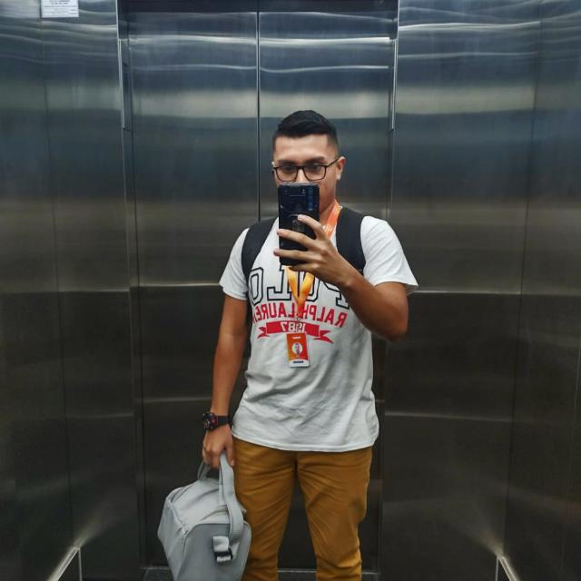
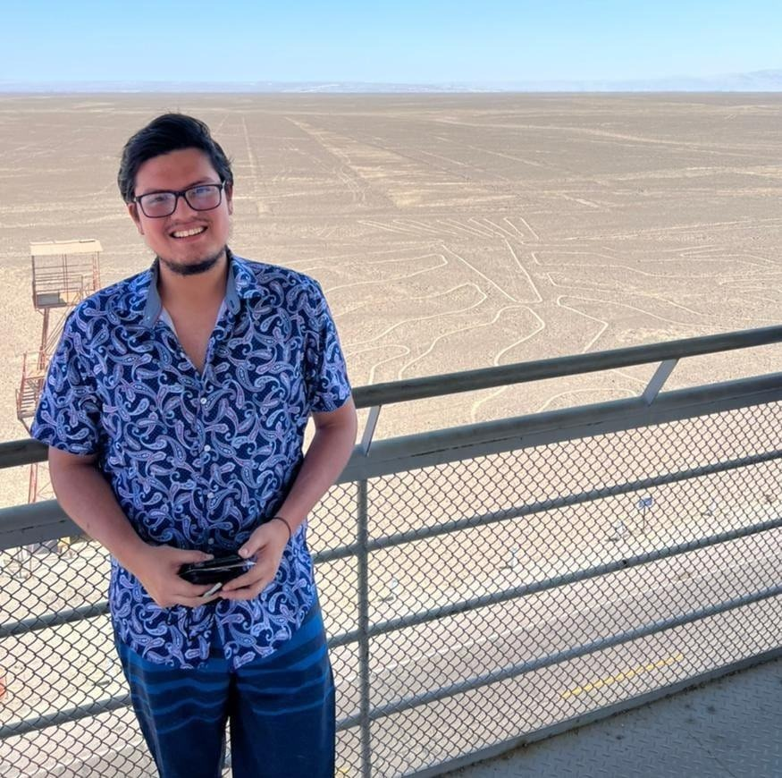
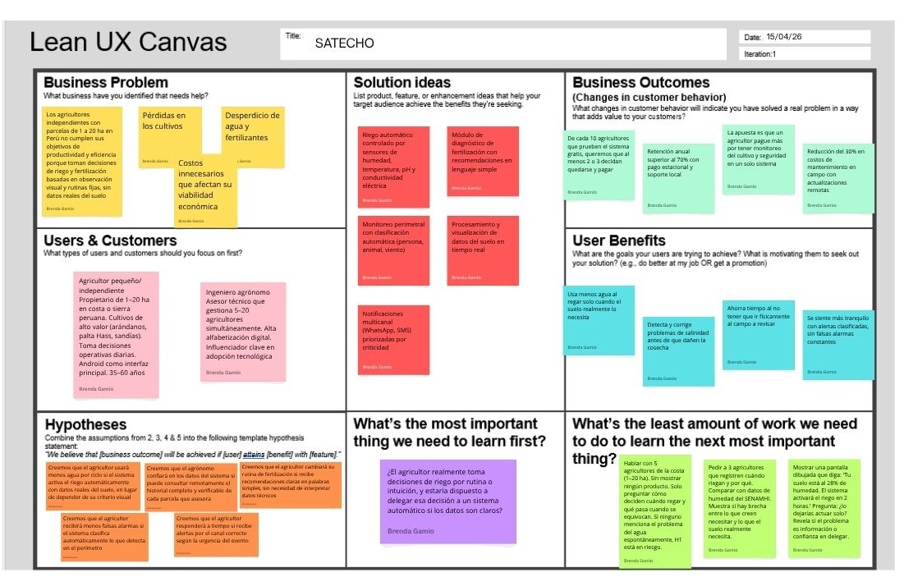

# Capítulo I - Introducción

## 1.1. Startup Profile

En esta sección, se presenta el overview general sobre cómo surge la startup SATECHO considerando los principales indicios que contribuyeron en su fundación. Adicional a ello, comprenderán la misión y visión que SATECHO espera lograr y ofrecer como valor a sus clientes y, conocerán más de cerca el perfil profesional del equipo que forma parte de esta expedición tecnológica.

### 1.1.1. Descripción de la Startup

SATECHO es una startup tecnológica fundada el 4 de abril de 2026 por un equipo de ingenieros universitarios decididos a resolver una problemática crítica: **la vulnerabilidad del agricultor frente a climas impredecibles y la inseguridad en sus tierras**. Observamos que la falta de datos exactos y la dependencia de procesos manuales generan pérdidas masivas de cultivos y recursos hídricos. Ante esto, nacemos para transformar el esfuerzo físico en una gestión estratégica mediante el uso de tecnologías IoT.

Nos especializamos en el desarrollo de sistemas de monitoreo en tiempo real que mitigan los riesgos de la variabilidad climática y las brechas de seguridad. Para ello, implementamos nodos sensores que miden con precisión la humedad del suelo y el ambiente, utilizando microcontroladores ESP32, conocidos en la industria por su robusta capacidad de procesamiento y conectividad inalámbrica integrada. Esto nos permite garantizar que cada gota de agua se utilice solo cuando el cultivo realmente lo necesita, activando sistemas de riego de forma automática y precisa.

En SATECHO, democratizamos la agricultura con precisión: hacemos que la tecnología sea tan fácil de usar como revisar un mensaje de texto, permitiendo que cualquier persona proteja su inversión y optimice su producción desde la palma de su mano.

**Misión:**

Nuestra misión es poner la tecnología al servicio de las personas que trabajan la tierra y de los profesionales que la gestionan. En SATECHO, creamos sistemas de monitoreo amigables que ayudan al agricultor a cuidar sus insumos y brindar al ingeniero agrónomo datos precisos para proteger los cultivos de manera automática. Buscamos que el equipo del campo pueda tomar mejores decisiones basadas en evidencias, evitando pérdidas y trabajando con la tranquilidad de un cultivo siempre vigilado e hidratado.

**Visión:**

Aspirar para el año 2030, ser el aliado tecnológico principal de los pequeños y medianos agricultores en las regiones rurales del Perú y la zona andina, liderando la transición hacia una agricultura de precisión inclusiva, donde agricultores e ingenieros colaboren mediante soluciones de hardware y software que respetan la realidad del campo, manteniendo la excelencia en la arquitectura de nuestros sistemas embebidos y la calidez en nuestro servicio.

### 1.1.2. Perfiles de integrantes del equipo

| Foto de Perfil | Nombre Completo | Descripción |
| :---: | :---: | :--- |
|  | José Diego Huamani Sánchez (U202110458) | Soy estudiante de la carrera de Ingeniería de software con 22 años de edad el cual tiene una enorme pasión por la ingeniería de datos, dirección de equipos y la toma de decisiones estratégicas que se pueden profundizar mediante el uso de la tecnología. Primordialmente estaré asumiendo el rol de **Team Leader** para planificar y monitorear cada uno de los avances estipulados durante cada sprint así como medir la madurez y el progreso alcanzado a nivel individual como organizacional para permitir elaborar estrategias competitivas y feedbacks. Dentro de mis conocimientos radican la gestión de proyectos agiles con el framework SCRUM, la analítica de datos y big data usando herramientas como Pandas, Numpy y PySpark, desarrollo de aplicaciones web mediante frameworks como Angular y Astro, servicios backend con tecnologías como .NET y Fast API, y entornos Cloud como el Microsoft Azure. |
|  | Brenda Lucía Gamioo Upiachihua (U202120344) | Soy estudiante de Ingeniería de Software con enfoque en diseño de sistemas y comprensión del dominio del negocio. Me desempeño como Software Architect, estructurando soluciones de forma integral y alineando requerimientos con decisiones técnicas sólidas. Tengo experiencia en modelado de dominios con Domain-Driven Design (DDD). A nivel de desarrollo, trabajo con frontend en Angular y Vue, desarrollo móvil con Flutter y backend con .NET. Manejo lenguajes como Java, Python y C++, además de herramientas como Docker para gestión de entornos y despliegue. Esto me permite definir arquitecturas coherentes y validar su implementación técnica dentro del equipo. |
|  | Abraham Andres Estrada Cajamune (U202112164) | Estudiante de ingeniería de Software de 9no ciclo en la Universidad Peruana de Ciencias Aplicadas, cuento con un perfil interesado hacia el desarrollo de soluciones digitales con solidos conocimientos en lenguajes de programación como Java, C++, Python, como tambien en Frameworks como Angular y Vue, además de un aprendizaje y dominio en manejo de base de datos y la implementación de API’s dentro del backend para su correcta identificación de la lógicas de negocio. En esta oportunidad, mi rol será como Device Maker, para la integración de los prototipos adaptandolas a las soluciones digitales que se generen en el presente proyecto. |
|  | Yasser Rentería Palacios (U202214130) | Soy estudiante de Ingeniería de Software en la UPC, con enfoque en el desarrollo de aplicaciones web y la construcción de soluciones tecnológicas eficientes. Me interesa el aprendizaje continuo de lenguajes de programación, frameworks modernos y buenas prácticas de desarrollo. Asumo el rol de **Software Developer**, enfocado en transformar diseños y arquitecturas en soluciones funcionales, mediante la implementación de APIs, lógica de negocio y aplicaciones web o multiplataforma. Busco desarrollar software limpio, escalable y mantenible, siguiendo estándares de codificación que garanticen un trabajo colaborativo eficiente. Cuento con conocimientos en lenguajes como Python, Java y C#, así como en desarrollo frontend con Angular y Vue.js, y fundamentos de backend para la creación de APIs y lógica de negocio. También tengo experiencia trabajando con bases de datos como MongoDB, aplicando conceptos de modelado de datos y validación. |
|  | Raúl Ronaldo Quispe Erasmo (u20211b682) | Soy estudiante de ing. Software en la UPC, orientado al desarrollo de aplicaciones web y a la creación de soluciones tecnológicas funcionales y eficientes. Tengo un fuerte interés por seguir aprendiendo nuevos lenguajes de programación, frameworks actuales y buenas prácticas dentro del desarrollo. Poseo conocimientos en lenguajes como Python, Java y C#, además de experiencia en desarrollo frontend utilizando Angular, Vue.js y React. También manejo fundamentos de backend para la construcción de APIs y la implementación de lógica de negocio. En cuanto a bases de datos, he trabajado con MongoDB y MySQL, aplicando conceptos de modelado, consultas y validación de datos. En este curso mi rol será como **QA Engineer**. Asimismo, cuento con bases sólidas en principios de desarrollo de software, estructuras de datos y metodologías ágiles como SCRUM, lo que me permite adaptarme y colaborar eficazmente en equipos de trabajo enfocados en resultados. |

## 1.2. Solution Profile

Conoceremos los detalles acerca de los antecedentes y problemáticas que son las principales claves para asentar las bases de la investigación sobre la propuesta de solución hacia el sector agrícola.

### 1.2.1. Antecedentes y problemáticas

**Técnica de las 5W's y 2H's**

* Who (Quién):

    **- Usuarios principales:**
    
    - **Agricultor:** Aporta la experiencia empírica y la intuición. Su problema es la dependencia de la presencia física humana y la falta de datos exactos para validar sus decisiones.
    
    - **El Ingeniero Agrónomo:** Busca optimizar el rendimiento y evitar la pérdida del cultivo mediante evidencia científica. Su problema es la dificultad de recolectar datos en tiempo real de múltiples puntos del terreno simultáneamente.

    **- Clientes Objetivo:** Pequeñas y medianas empresas (PYMES) del sector agrícola en Latinoamérica que buscan transitar de operaciones manuales a una gestión basada en datos para reducir pérdidas.

    **- Equipo del Proyecto (SATECHO Core Team):**
    
    - **Project Leader:** Responsable de la visión estratégica y el cumplimiento de hitos.
    
    - **Ingenieros de IoT:** Encargados del diseño de hardware, selección de sensores y arquitectura de nodos.
    
    - **Ingenieros de Software:** Desarrolladores de la infraestructura web/móvil y la lógica de comunicación HTTP.

    - **Especialista en UX/Agro:** Encargado de que la interfaz sea comprensible para el agricultor, simplificando datos complejos.

* What (Qué):

    **El Desafío:** La falta de un sistema integrado que unifique la seguridad perimetral con el control y supervisión automatizada de cultivos. Actualmente, estos problemas se tratan por separado, aumentando los costos.

    - **Modelo de Servicio:** Implementaremos un modelo **Freemium**.
        - **Básico:** Monitoreo de datos históricos.
        - **Premium:** Alertas en tiempo real, automatización avanzada de válvulas y reportes analíticos de salud del cultivo.
    
* Where (Dónde):

    - **Entorno Físico:** Parcelas y terrenos agrícolas de escala media donde la conectividad suele ser un reto y la supervisión humana es insuficiente por la extensión del área.

    - **Mercado Objetivo:** Iniciando en regiones agrícolas emergentes de Perú, con proyección de escalabilidad a toda la región andina y América Latina.
    
* When (Cuando)
    - **Ciclo de Uso:** El cliente interactúa con el producto diariamente. El evento crítico ocurre cuando las variables ambientales (humedad/humo) se desvían de los rangos de seguridad proyectados por el ingeniero agrónomo y/o especialistas del área.

    - **Tiempo de Respuesta:** La problemática actual es que el agricultor se entera del daño "horas o días después". SATECHO busca reducir ese tiempo a "segundos" tras la detección.
    
* Why (Por qué):
    - **Causa Raíz:** El cambio climático ha vuelto obsoleta la intuición pura del agricultor. Las sequías repentinas, lluvias intensas u otro factor climatológico se pueden pronosticar pero no avisan.

    - **Desencadenante:** El aumento en los costos de insumos (agua y fertilizantes) por el aumento de plagas y el incremento de la inseguridad en zonas rurales obligan a las empresas a buscar eficiencia operativa para sobrevivir económicamente.
    
* How (Cómo):
    - **Condiciones Actuales:** Las decisiones se toman bajo incertidumbre. El riego se hace "por calendario" y no "por necesidad", lo que genera desperdicio.

    - **Preferencias del Usuario:** El usuario prefiere no tener que configurar códigos complejos; busca una solución "Plug & Play" que se adapte a su rutina diaria sin interrumpirla.
    
* How Much (Cuánto):
    - **Cuantificación del Daño:** Pérdidas estimadas de entre el **15% y 30%** de la producción total por mala gestión de riego o intrusiones no detectadas.

    - **Inversión y Lanzamiento:** El objetivo es lanzar un Producto Mínimo Viable (MVP) con un costo de implementación por hectárea significativamente menor a las soluciones industriales de grandes corporaciones, permitiendo un retorno de inversión (ROI) acelerado para el pequeño productor.

Después de un análisis profundo, estructurado bajo la técnica de las 5 ‘W’s y 2 ‘H’s, nos permitió identificar una brecha crítica en el sector agrícola: el distanciamiento entre la experiencia empírica del agricultor y la realidad de un entorno cada vez más hostil e impredecible. A través de este diagnóstico inicial, se determinó que los productores de pequeñas y medianas parcelas en Latinoamérica no solo enfrentan desafíos técnicos, sino una crisis de sostenibilidad económica y seguridad personal. Este mapeo preliminar reveló que la toma de decisiones basada exclusivamente en la intuición ha quedado obsoleta frente a factores que el ser humano no puede controlar a simple vista, como la variabilidad climática extrema y el aumento exponencial de la criminalidad rural.

Esta percepción diagnóstica se ve respaldada por datos locales alarmantes que sitúan al agro peruano en una de sus crisis más profundas de las últimas décadas. Según investigaciones de **Ojo Público (2023)**, el PBI del sector agropecuario sufrió una caída del 3.4% en el primer semestre de ese año, la cifra más crítica desde 1997, descapitalizando a los productores y limitando su capacidad de respuesta ante emergencias. Este escenario económico se entrelaza con un desafío global; **Pascoal et al. (2024)** señalan que el cambio climático ha vuelto imperativo el monitoreo en tiempo real de los ecosistemas mediante el Internet de las Cosas (IoT) para garantizar la seguridad alimentaria. Asimismo, especialistas como **Mishra et al. (2023)** subrayan que la gestión de la salud del suelo y el riego preciso son ya cuestiones de supervivencia operativa, mientras que revisiones de **Miller et al. (2025)** confirman que la integración de sensores inteligentes es el único camino para transitar de una agricultura reactiva a una de precisión.

Sin embargo, el problema identificado trasciende lo agronómico para convertirse en una crisis de seguridad patrimonial y humana. Al aplicar nuestra técnica de análisis, se detectó que el agricultor se encuentra en un estado de desprotección total frente a la delincuencia organizada. Datos de **Infobae (2026)** indican que la extorsión ya alcanza al 25% de los peruanos, expandiéndose agresivamente hacia las zonas rurales. La frecuencia de estos delitos es sobrecogedora: se registra una denuncia por extorsión cada 19 minutos en el país (**El Comercio, 2025**), y las proyecciones de víctimas mortales por sicariato y extorsión superan las 1,900 personas anualmente (**PQS, 2024**). Esta realidad convierte a los campos de cultivo en escenarios vulnerables donde el robo de insumos y la coacción criminal ocurren en la oscuridad, lejos de cualquier sistema de alerta inmediata.

Es por ello que dichos hallazgos revelan que la problemática de SATECHO quiere solventar va arraigado a la ineficiencia hídrica y la falta de datos técnicos que generan pérdidas de entre el 15% y 30% de la producción total. Por otro lado, la inseguridad ciudadana amenaza la continuidad misma de la actividad agrícola.

### 1.2.2. Lean UX Process

En esta sección, detallamos nuestra metodología de trabajo para SATECHO. A través de un enfoque ágil y colaborativo, transformamos nuestras ideas y suposiciones en soluciones reales para el sector agrícola. Este proceso nos permite alinear los objetivos del negocio con las necesidades del agricultor y el ingeniero agrónomo, garantizando que nuestra tecnología de riego inteligente y seguridad sea, ante todo, útil, intuitiva y capaz de generar un valor real en la protección y optimización de cada cultivo.

#### 1.2.2.1. Lean UX Problem Statements

Nuestro servicio ofrece a los agricultores independientes y pequeños una plataforma de monitoreo agronómico que les permite gestionar el estado de sus cultivos y tomar decisiones oportunas sobre riego y fertilización para maximizar el rendimiento y reducir pérdidas. 

Hemos observado que los agricultores no están cumpliendo sus objetivos de productividad y eficiencia en el uso de recursos, dado que las decisiones sobre cuándo y cuánto regar o fertilizar se toman en base a observación visual y rutinas fijas, sin datos objetivos sobre el estado real del suelo. Esto genera pérdidas en los cultivos, desperdicio de agua y fertilizantes, y costos innecesarios que afectan la viabilidad económica de los agricultores independientes y pequeños en Perú.

**¿Cómo podríamos mejorar el acceso a información objetiva y oportuna sobre el estado del suelo para que los agricultores puedan tomar decisiones de riego y fertilización basadas en datos reales, reduciendo pérdidas y optimizando el uso de sus recursos?**

#### 1.2.2.2. Lean UX Assumptions

1. **User Assumptions**

    - Creemos que el agricultor toma decisiones de riego y fertilización basadas en observación visual o rutina fija, sin datos objetivos del suelo.

    - Creemos que el agricultor percibe el desperdicio de agua y fertilizantes como un problema económico real y está dispuesto a cambiar sus rutinas si recibe datos claros y accionables.

    - Creemos que el agricultor tiene conocimientos básicos de tecnología móvil y puede usar la app sin formación técnica previa.

    - Creemos que el ingeniero agrónomo desconfía de los datos IoT cuando no puede verificar su origen, lo que frena su recomendación de herramientas digitales a sus clientes.

2. **Business Assumptions**

    - Creemos que existe un segmento de agricultores independientes en Perú (1-20 ha) con cultivos de alto valor que tienen capacidad de pago para soluciones tecnológicas.

    - Creemos que un modelo híbrido (hardware + suscripción mensual) es aceptado cultural y financieramente por el agricultor peruano.

    - Creemos que la combinación de monitoreo agronómico con seguridad perimetral inteligente no está siendo ofrecida por competidores locales en Perú.

    - Creemos que los agricultores confían más en soluciones con soporte local en español que en plataformas globales sin representación local.

3. **Business Outcomes**

    - Creemos que alcanzaremos una tasa de conversión del 25-35% tras el piloto gratuito de 30 días.

    - Creemos que la retención anual superará el 70% gracias al modelo de pago estacional y soporte técnico local.

    - Creemos que la integración de seguridad como valor agregado incrementará el ticket promedio en un 15-20% frente a soluciones puramente agronómicas.

    - Creemos que las actualizaciones OTA reducirán los costos de mantenimiento en campo en al menos un 30%.
    
4. **User Outcomes & Benefits**

    - Creemos que el agricultor reducirá su consumo de agua al regar únicamente cuando los sensores indiquen estrés hídrico real.

    - Creemos que el agricultor detectará y corregirá problemas de salinidad antes de que afecten el rendimiento del cultivo.

    - Creemos que el agricultor ahorrará tiempo al automatizar decisiones de riego que antes requerían inspección visual en campo.

    - Creemos que el agricultor experimentará menor ansiedad por seguridad al recibir alertas clasificadas y priorizadas.
    
5. **Feature Assumptions**

    - Creemos que el sistema de riego automático activará la electroválvula de forma fiable cuando los sensores indiquen estrés hídrico, con latencia menor a 2 segundos.

    - Creemos que el sistema de fertilización automática generará recomendaciones de pH y conductividad eléctrica en lenguaje no técnico comprensible para el agricultor.

    - Creemos que el procesamiento de datos del suelo (humedad, EC, temperatura, pH) producirá un diagnóstico agronómico preciso y accionable en tiempo real.

    - Creemos que el monitoreo del cultivo con sensor de movimiento clasificará eventos perimetrales (persona, animal, viento) con precisión suficiente para reducir falsas alarmas.

    - Creemos que las notificaciones vía WhatsApp y push priorizarán los canales según la criticidad del evento, garantizando que el agricultor reciba la alerta correcta en el momento correcto.

#### 1.2.2.3. Lean UX Hypothesis Statements

*Hypothesis 1 — Riego automático*

* Creemos que la reducción del consumo de agua por ciclo de cultivo será alcanzada si el agricultor con parcelas de 1-20 ha en la costa peruana obtiene activación automática del riego basada en datos reales del suelo con el sistema de riego automático controlado por sensores de humedad y conductividad eléctrica.

*Hypothesis 2 — Fertilización automática*

* Creemos que el cambio en las rutinas de fertilización basadas en intuición será alcanzado si el agricultor con baja alfabetización técnica obtiene recomendaciones claras de ajuste de pH y salinidad en lenguaje simple con el módulo de diagnóstico de fertilización del sistema.

*Hypothesis 3 — Procesamiento de datos del suelo*

* Creemos que la confianza del ingeniero agrónomo en los datos IoT será alcanzada si el agrónomo que asesora múltiples parcelas obtiene acceso remoto a historial verificable de lecturas del suelo con el módulo de procesamiento y visualización de datos agronómicos.

*Hypothesis 4 — Monitoreo del cultivo y seguridad perimetral*

* Creemos que la reducción de falsas alarmas de seguridad será alcanzada si el agricultor con terrenos en zonas de riesgo obtiene clasificación automática de eventos perimetrales (persona, animal, viento) con el sensor de movimiento y el algoritmo de clasificación térmica.

*Hypothesis 5 — Notificaciones*

* Creemos que la respuesta oportuna ante eventos críticos del cultivo y del perímetro será alcanzada si el agricultor que no puede estar físicamente en el campo obtiene alertas priorizadas por canal según criticidad con el sistema de notificaciones multicanal (WhatsApp, push, SMS).

#### 1.2.2.4. Lean UX Canvas

A continuación, mostraremos el análisis de los procesos iterativos y descubrimientos realizados por los miembros del equipo SATECHO para asentar las bases de valor propuesta dentro de la solución; centrándonos en solventar las problemáticas críticas y sobre todo maximizar el beneficio percibido por el cliente.

## 1.3. Segmentos objetivos

En esta última sección, conoceremos los criterios que SATECHO consideró en la selección de nuestros segmentos objetivos de acuerdo a su relevancia en el dominio sobre la hidratación y protección del ciclo de vida de la planta. A continuación, se describirá cada uno de los segmentos junto con sus características tales como descripción, características demográficas e información estadística que justifiquen su inclusión en el mercado objetivo.

1. **Agricultor independiente / pequeño productor**

    * **Descripción:** Este segmento está conformado por propietarios o administradores directos de parcelas de 1 a 20 hectáreas ubicadas en la costa o sierra peruana, dedicados principalmente a cultivos de alto valor como arándanos, paltas Hass y sandías. Son tomadores de decisiones operativas diarias en riego, fertilización y vigilancia, con un enfoque práctico orientado a la rentabilidad más que a la tecnicidad.
 
    * **Características demográficas:** Este perfil corresponde mayoritariamente a personas entre 35 y 60 años, con nivel educativo de secundaria completa o estudios técnicos, y una alfabetización digital funcional para tareas cotidianas. Aunque el liderazgo de unidades agropecuarias sigue siendo predominantemente masculino, la participación femenina ha venido creciendo. Manejan parcelas pequeñas (1-20 ha), toman decisiones de forma autónoma o con apoyo de 1-2 trabajadores de confianza, y utilizan dispositivos Android como principal interfaz tecnológica.
 
    * **Información estadística:** En Perú, el 81.1% de las unidades agropecuarias tiene menos de 5 hectáreas, lo que representa más de 1.8 millones de productores, confirmando que la pequeña escala es estructural en el sector (Instituto Nacional de Estadística e Informática [INEI], 2012). La agricultura familiar constituye el 97.6% del total de unidades agropecuarias del país y es responsable del 70% del consumo interno de alimentos (INEI, 2022). En cuanto a conectividad, el 84.8% de los hogares rurales posee al menos un smartphone, un incremento significativo frente al 44.1% registrado en 2019 (Organismo Supervisor de Inversión Privada en Telecomunicaciones [OSIPTEL], 2024). Respecto a los cultivos objetivo, Perú cuenta con 23,344 hectáreas certificadas de arándanos para exportación, con proyección de alcanzar 26,786 ha en la campaña 2025-2026 (Ministerio de Desarrollo Agrario y Riego [MIDAGRI], 2025), y el 97% de la producción de palta Hass proviene de agricultores con menos de 5 hectáreas (ProHass, 2023), lo que valida el enfoque en pequeños productores de alto valor.

2. **Ingeniero agrónomo / asesor técnico independiente**

    * **Descripción:** Este segmento incluye a profesionales con formación en agronomía, entre 28 y 45 años, que asesoran a múltiples agricultores de forma independiente o mediante cooperativas y empresas agropecuarias. Actúan como influenciadores técnicos: validan, configuran y recomiendan soluciones tecnológicas a sus clientes, amplificando el impacto de cualquier herramienta que adopten.

    * **Características demográficas:** Este perfil profesional suele contar con formación universitaria o de posgrado en agronomía, ciencias agrícolas o afines, y se encuentra en una etapa de consolidación laboral. Trabajan en modalidad independiente o vinculados a instituciones, gestionando entre 5 y 20 clientes simultáneamente. Poseen alta alfabetización digital: utilizan herramientas de análisis, hojas de cálculo y plataformas especializadas como parte de su rutina.

    * **Información estadística:** Solo el 1% de los productores de agricultura familiar en Perú recibe asistencia técnica formal, lo que evidencia una brecha crítica en la transferencia de conocimiento y validación tecnológica (INEI, 2022). Esta baja cobertura genera una oportunidad estratégica para herramientas que permitan a los asesores escalar su impacto sin incrementar la carga de visitas presenciales. Asimismo, el acceso a información agraria oportuna y confiable sigue siendo un cuello de botella para la toma de decisiones técnicas en el sector (MIDAGRI, 2023), lo que refuerza la necesidad de plataformas que centralicen y contextualicen datos de suelo, clima y cultivo. Considerando que un ingeniero agrónomo puede influir en la adopción tecnológica de 10 a 20 agricultores, este segmento actúa como multiplicador clave para la expansión de soluciones IoT en la agricultura familiar peruana.
