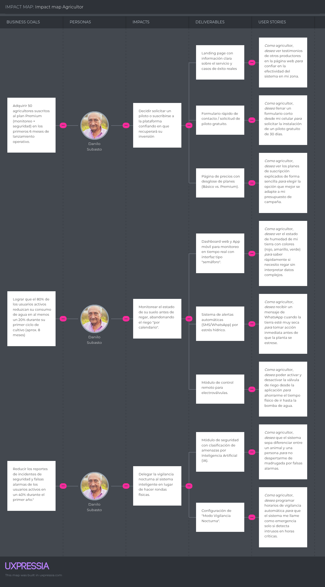
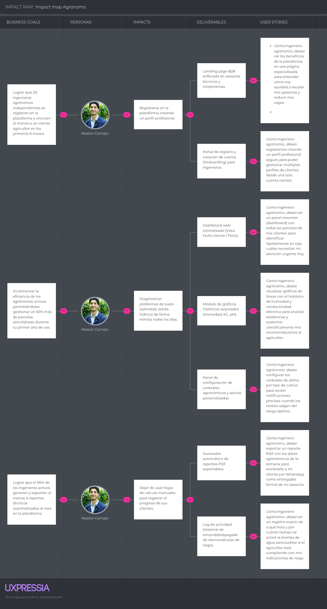
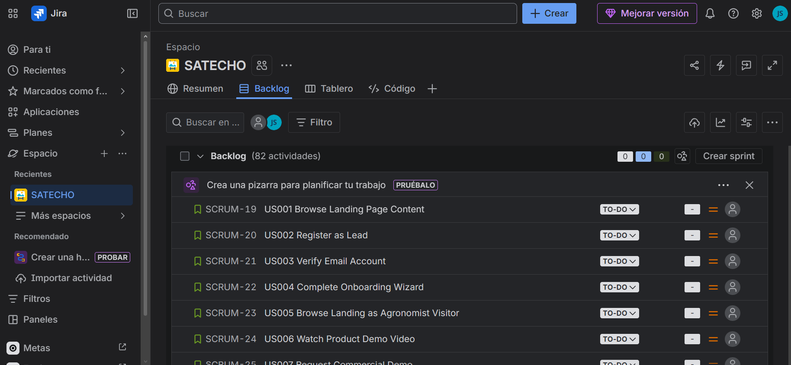

# Capítulo III - Requirements Specification

En esta sección, se presenta la especificación de requisitos de AgroSafe a partir de los hallazgos obtenidos en las etapas previas de análisis del problema, entrevistas, needfinding, Big Picture EventStorming y definición del Ubiquitous Language. Su propósito es traducir el entendimiento del dominio en un conjunto estructurado de requisitos que orienten de manera clara el desarrollo del producto dentro del alcance del proyecto.

A partir de ello, este capítulo organiza los requerimientos funcionales y técnicos de la solución en artefactos que permiten vincular necesidades de los usuarios, objetivos del producto y decisiones de implementación a nivel de MVP académico. En particular, se detallan las **User Stories**, el **Impact Mapping** y el **Product Backlog**, con el fin de asegurar trazabilidad entre el problema identificado, el valor esperado para los segmentos objetivo y el trabajo que deberá ejecutar el equipo durante el desarrollo del sistema.

## 3.1. User Stories

En esta sección se presentan los requisitos funcionales y técnicos del sistema AgroSafe IoT mediante la definición de Epics, User Stories y Technical Stories. Las historias han sido elaboradas considerando los distintos roles que interactúan con el ecosistema (visitantes, agricultores, agrónomos, personal interno y desarrolladores) y las capas arquitectónicas del sistema (Landing Page, Cloud API, Edge API, Embedded, Web App, Mobile App). Cada historia incluye criterios de aceptación redactados en tercera persona y bajo la estructura Gherkin (Given-When-Then), garantizando que los requisitos sean claros, comprobables y agnósticos a la interfaz gráfica. Adicionalmente, se incluyen *Technical Stories* orientadas a la implementación de componentes internos del sistema como RESTful APIs, procesamiento en la nube, Edge computing e integración con dispositivos IoT.

| Epic / Story ID | Título | Descripción | Criterios de Aceptación | Relacionado con (Epic ID) |
|---|---|---|---|---|
| **EP-001-US001** | Farmer Registration | As a new farmer, I want to register on the platform with my personal data so that I can access the monitoring features. | **Scenario 1:** Successful registration — Given a visitor provides a valid name, email, and password, When the registration request is submitted, Then the system creates an account with the FARMER role and sends a verification email.   **Scenario 2:** Duplicate email — Given the email address is already registered, When the registration request is submitted, Then the system returns 409 with the message "The email is already in use".   **Scenario 3:** Weak password — Given the password is fewer than 8 characters or contains no numeric character, When the registration request is submitted, Then the system returns 400 indicating the password does not meet security requirements. | EP-001 |
| **EP-001-US002** | Account Email Verification | As a newly registered farmer, I want to verify my account via email so that I can activate it and access the system. | **Scenario 1:** Successful verification — Given a valid verification token is received, When the verification request is processed, Then the token is validated, the account is activated, and a confirmation response is returned.   **Scenario 2:** Expired token — Given the verification token has expired (>24h), When the verification request is processed, Then the system returns 400 indicating the token has expired and instructs the user to request a new one.   **Scenario 3:** Invalid token — Given a tampered or invalid token, When the verification request is processed, Then the system returns 400 with a generic error message. | EP-001 |
| **EP-001-US003** | Login | As a registered and verified user, I want to log in with my credentials so that I can access my dashboard. | **Scenario 1:** Successful login — Given a registered user provides correct email and password, When the login request is submitted, Then the system issues a JWT and returns the authenticated session with the user role.   **Scenario 2:** Invalid credentials — Given an incorrect password is provided, When the login request is submitted, Then the system returns 401 with the message "Invalid credentials" without revealing whether the email exists.   **Scenario 3:** Unverified account — Given an unverified account attempts to log in, When the login request is submitted, Then the system returns 403 with the message "Please verify your email before logging in". | EP-001 |
| **EP-001-US004** | Edit User Profile | As an authenticated user, I want to edit my profile data so that I can keep my information up to date. | **Scenario 1:** Successful edit — Given the user provides updated name or phone number, When the profile update request is submitted, Then the system persists the changes and returns a success confirmation.   **Scenario 2:** Password change — Given the user provides the correct current password and a new valid password, When the password change request is submitted, Then the system updates the password and invalidates sessions on other devices. | EP-001 |
| **EP-001-US005** | Register Farm and First Parcel | As a farmer, I want to register my farm and first parcel during onboarding so that I can start monitoring my crops. | **Scenario 1:** Farm created — Given the farmer provides farm name, location, and crop type, When the onboarding setup is submitted, Then the system creates the farm and first parcel and confirms the setup.   **Scenario 2:** Incomplete onboarding — Given the farmer started onboarding but did not complete it, When the farmer accesses the system again, Then the system resumes the onboarding process from the last incomplete step. | EP-001 |
| **EP-001-US006** | Password Recovery | As a user who forgot their password, I want to recover it via email so that I can regain access to my account. | **Scenario 1:** Request sent — Given the user provides a registered email address, When the password reset request is submitted, Then the system sends an email with a reset link.   **Scenario 2:** Email not registered — Given the email is not registered, When the password reset request is submitted, Then the system returns 200 without revealing whether the email exists (anti-enumeration).   **Scenario 3:** Reset password — Given the user uses a valid reset link and provides a new password, When the reset request is submitted, Then the system updates the password and invalidates the reset link.   **Scenario 4:** Expired link — Given the reset link has expired (>1h), When the user attempts to use it, Then the system returns an error indicating the link has expired and prompts for a new request. | EP-001 |
| **EP-001-US007** | Agronomist-Specific Onboarding | As an agronomist, I want an onboarding flow adapted to my professional profile so that I can register my credentials and specialty. | **Scenario 1:** Agronomist onboarding — Given the user selects the "Agronomist" role during registration, When the onboarding request is submitted, Then the system collects professional registration number, specialty, and years of experience.   **Scenario 2:** Duplicate registration number — Given a registration number that is already in use, When the agronomist onboarding request is submitted, Then the system returns 409 with a specific error message.   **Scenario 3:** Account created — Given all required fields are valid, When the agronomist registration is submitted, Then an AGRONOMIST account is created and a verification email is sent. | EP-001 |
| **EP-001-TS001** | IAM Module — Auth & JWT (Backend) | As a Developer, I want to implement the identity and access management module with JWT authentication so that all endpoints are protected. | **Scenario 1:** JWT issued — Given a POST to `/api/v1/iam/auth/login` with valid credentials, When the request is processed, Then the system returns 200 with `{token, refresh_token, expires_in}`.   **Scenario 2:** Expired token — Given a request is made with an expired JWT, When the request is processed, Then the system returns 401 with `{"error":"token_expired"}`.   **Scenario 3:** Token refresh — Given a POST to `/api/v1/iam/auth/refresh` with a valid refresh token, When the request is processed, Then a new access token is issued. **Impl:** `iam` bounded context; `JwtAuthFilter` as Spring Security filter; RS256-signed tokens; refresh tokens in DB with 7-day TTL. | EP-001 |
| **EP-001-TS002** | Onboarding Module (Backend) | As a Developer, I want to implement the registration, email verification, and farm/parcel creation endpoints so that the onboarding flow is fully supported. | **Scenario 1:** Farmer registration — Given a POST to `/api/v1/onboarding/register` with `{name, email, password, role:"FARMER"}`, When the request is processed, Then the system returns 201, creates the user, and sends a verification email.   **Scenario 2:** Email verification — Given a GET to `/api/v1/onboarding/verify?token=XYZ`, When the request is processed, Then the system returns 200 and activates the account.   **Scenario 3:** Create farm — Given a POST to `/api/v1/onboarding/farms` with a valid farmer JWT, When the request is processed, Then the farm and default zone are created and associated with the farmer. **Impl:** `onboarding` bounded context; `RegisterUseCase`, `VerifyEmailUseCase`, `CreateFarmUseCase`. | EP-001 |
| **EP-001-TS010** | Password Recovery API (Backend) | As a Developer, I want to implement secure password recovery endpoints with single-use expiring tokens so that account recovery is safe. | **Scenario 1:** Request reset — Given a POST to `/api/v1/iam/auth/forgot-password` with `{email}`, When the request is processed, Then a UUID token is generated, stored with a 1h TTL, and an email is sent; the response is always 200.   **Scenario 2:** Validate token — Given a GET to `/api/v1/iam/auth/reset-password/validate?token=X`, When the request is processed, Then the system returns 200 if valid or 400 if expired/invalid.   **Scenario 3:** Apply reset — Given a POST to `/api/v1/iam/auth/reset-password` with `{token, new_password}`, When the request is processed, Then the password is updated with bcrypt, the token is invalidated, and all sessions are revoked. **Impl:** `iam` bounded context; `PasswordResetToken` entity with `used_at`; email via JavaMailSender. | EP-001 |
| **EP-001-MS001** | Configure SMTP Server for Emails | As a Developer, I want to configure the SMTP server for sending verification and recovery emails so that email delivery is reliable in all environments. | **Scenario 1:** Email delivered — Given a user registers, When the registration is completed, Then the verification email is delivered within 60 seconds with the correct link for the target environment (staging/prod).   **Scenario 2:** SMTP unavailable — Given the SMTP server is unavailable, When an email is triggered, Then the error is logged, the registration returns 201, and the email is queued for retry. **Impl:** Spring Mail with SendGrid or AWS SES; `MAIL_HOST`, `MAIL_PORT`, `MAIL_USER`, `MAIL_PASSWORD` environment variables. | EP-001 |
| **EP-002-US001** | View Soil Monitoring Dashboard | As a farmer, I want to view the current state of my soil sensors on the dashboard so that I can monitor my crops in real time. | **Scenario 1:** Real-time data — Given the farmer is authenticated and has connected devices, When the dashboard data is loaded, Then the system displays sensor cards for Moisture (%), Electrical Conductivity (dS/m), Soil Temperature (°C), and Ambient Temperature (°C), updated every 30 seconds.   **Scenario 2:** Visual alert — Given soil moisture is below 20%, When the dashboard data is refreshed, Then the moisture indicator is marked as critical.   **Scenario 3:** No device connected — Given no sensor readings have been received in the last 2 hours, When the dashboard is loaded, Then the sensor card displays "No recent data" with the timestamp of the last reading. | EP-002 |
| **EP-002-US002** | View Telemetry History | As a farmer, I want to view the reading history of my sensors so that I can analyze trends in my crops. | **Scenario 1:** History loaded — Given the farmer accesses the telemetry section, When the data is loaded, Then the system displays line graphs with range selectors for 24h, 7d, 30d, and 90d.   **Scenario 2:** Range selection — Given the farmer selects a specific time period, When the range is applied, Then the time axis adjusts and data is displayed with higher granularity.   **Scenario 3:** No data in range — Given the selected range has no sensor readings, When the graph is rendered, Then the system displays "No data available for this period". | EP-002 |
| **EP-002-US003** | Receive Water Stress Alerts | As a farmer, I want to receive alerts when soil moisture drops below the critical threshold so that I can irrigate in time. | **Scenario 1:** Alert generated — Given the FC28 sensor reports moisture below the configured threshold (default 20%), When a new reading is processed, Then the system creates an alert in the database and sends a push notification within 30 seconds.   **Scenario 2:** Alert resolved — Given soil moisture returns to ≥25% after irrigation, When the next reading is processed, Then the alert is marked as RESOLVED with a timestamp.   **Scenario 3:** No duplicate alert — Given an active moisture alert exists, When a new reading still reports moisture below the threshold, Then no duplicate alert is created. | EP-002 |
| **EP-002-US004** | Control Irrigation Remotely | As a farmer, I want to activate and deactivate irrigation from the app so that I can water my crops without going to the field. | **Scenario 1:** Activate irrigation — Given an irrigation activation request is received, When the system processes it, Then the `IRRIGATE_ON` command is published to the MQTT topic `agrosafe/{farmId}/devices/{deviceId}/actuator/command` and the status `{"irrigation":"ON"}` is visible within 5 seconds.   **Scenario 2:** Deactivate irrigation — Given an irrigation deactivation request is received, When the system processes it, Then the `IRRIGATE_OFF` command is sent and the relay is deactivated.   **Scenario 3:** Safety auto-close — Given irrigation has been active for more than 60 seconds without a deactivation command, When the safety timer expires, Then the ESP32 deactivates the relay and publishes status `{"irrigation":"OFF","reason":"autoclose"}`.   **Scenario 4:** Device offline — Given the device has not sent a heartbeat in the last 60 seconds, When an irrigation command is issued, Then the Edge buffers the command and delivers it when the ESP32 reconnects. | EP-002 |
| **EP-002-US005** | Receive Critical Salinity Alerts | As a farmer, I want to receive alerts when the electrical conductivity of the soil exceeds the critical threshold so that I can prevent crop damage. | **Scenario 1:** Critical EC alert — Given the HR202L sensor reports EC above 5 dS/m, When the reading is processed, Then a CRITICAL alert is generated and a push notification is sent with the message "Critical salinity in parcel [name]".   **Scenario 2:** EC within range — Given EC is below 3 dS/m, When the reading is processed, Then no alert is generated. | EP-002 |
| **EP-002-US006** | Receive Critical Temperature Alerts | As a farmer, I want to be alerted if soil temperature exceeds dangerous levels so that I can protect my crops. | **Scenario 1:** Temperature alert — Given the DS18B20 sensor reports soil temperature above 40°C, When the reading is processed, Then a CRITICAL alert is generated and a push notification is sent.   **Scenario 2:** Normal temperature — Given soil temperature is at or below 35°C, When the reading is processed, Then no alert is generated. | EP-002 |
| **EP-002-US007** | View Irrigation Status in Real Time | As a farmer, I want to see whether the irrigation system is active or inactive at all times so that I can avoid accidental irrigation. | **Scenario 1:** Status visible — Given the farmer accesses the dashboard, When the irrigation status data is loaded, Then the system displays ON or OFF along with the timestamp of the last state change.   **Scenario 2:** Automatic update — Given an irrigation state change is received via MQTT, When the message is processed, Then the status is updated within 3 seconds without requiring a page reload. | EP-002 |
| **EP-002-TS003** | Soil Telemetry API (Backend Cloud) | As a Developer, I want to implement the REST endpoint for receiving and storing telemetry readings from the Edge so that sensor data is persisted in the cloud. | **Scenario 1:** Reading received — Given a POST to `/api/v1/iot/telemetry` with a valid device JWT and payload `{device_id, farm_id, moisture, ec, temperature, ph, recorded_at}`, When the request is processed, Then the system returns 201, persists the reading, and publishes a `SoilReadingCreated` event to RabbitMQ.   **Scenario 2:** Invalid payload — Given the moisture value exceeds 100, When the request is processed, Then the system returns 400 with `{"error":"moisture must be in [0,100]"}`.   **Scenario 3:** Batch sync — Given a POST to `/api/v1/iot/telemetry/batch` with an array of up to 50 readings, When the request is processed, Then the system returns 207 with an array of individual results. **Impl:** `iot` bounded context; `TelemetryController`; Bean Validation constraints. | EP-002 |
| **EP-002-TS004** | Soil Alert Engine (Backend) | As a Developer, I want to implement an engine that evaluates each reading against thresholds and generates alerts automatically so that critical conditions trigger timely notifications. | **Scenario 1:** Threshold exceeded — Given a `SoilReadingCreated` event with moisture=15, When the alert engine processes it, Then the system creates an alert `{type:MOISTURE_LOW, severity:CRITICAL}` in the database and publishes `AlertCreated`.   **Scenario 2:** Hysteresis — Given an active MOISTURE_LOW alert and a new reading with moisture=22 (above the resolution threshold of 20%), When the reading is processed, Then the alert is automatically closed.   **Scenario 3:** Configurable thresholds — Given an agronomist has updated the moisture threshold to 25% for a specific parcel, When the engine processes readings for that parcel, Then the updated threshold is applied. **Impl:** `advisory` bounded context; `AlertEngineService` consumes `SoilReadingCreated` via `@RabbitListener`; thresholds in `ThresholdRepository`. | EP-002 |
| **EP-002-TS005** | Actuator Command API (Backend Cloud) | As a Developer, I want to implement an endpoint that receives irrigation commands and forwards them to the device via MQTT so that remote control is reliable. | **Scenario 1:** Command published — Given a POST to `/api/v1/iot/actuator/command` with `{device_id, zone_id, action:"IRRIGATE_ON", source:"manual"}` and a valid farmer JWT, When the request is processed, Then the system returns 202 and publishes the command to the MQTT topic `agrosafe/{farmId}/devices/{deviceId}/actuator/command`.   **Scenario 2:** Actuator log — Given a command is sent, When the request is processed, Then a record is created in the `actuator_log` table with `{device_id, action, source, sent_at}`. **Impl:** `iot` bounded context; `ActuatorCommandController`; publishes via `MqttClient`. | EP-002 |
| **EP-002-TS008** | Biometric Authentication (Mobile App) | As a Developer, I want to integrate biometric authentication (fingerprint/Face ID) in the Flutter app so that critical actions require secure identity confirmation. | **Scenario 1:** Biometrics enabled — Given the user enables biometric authentication in settings, When a biometric-protected action is triggered, Then the `local_auth` package requests fingerprint verification and, if successful, retrieves the stored JWT from FlutterSecureStorage.   **Scenario 2:** Biometrics unavailable — Given the device has no biometric sensor, When the biometrics setting is accessed, Then the option is disabled and only password login is available.   **Scenario 3:** Biometric failure — Given three consecutive failed biometric attempts, When the third attempt fails, Then the system falls back to password login. **Impl:** `local_auth` Flutter package; JWT stored in `flutter_secure_storage`. | EP-002 |
| **EP-002-MS002** | Integrate FC28 Sensor (Moisture) | As a Developer, I want to integrate the FC28 sensor to the ESP32 so that soil moisture can be measured. | **Scenario 1:** Valid reading — Given the FC28 is connected to GPIO33 (ADC), When `readFC28()` is called, Then the function returns a value in [0.0, 100.0] as the average of 5 samples.   **Scenario 2:** Sensor disconnected — Given GPIO33 reads 0 or 4095 (saturation), When `readFC28()` is called, Then the function returns -1.0 as an out-of-bounds indicator. **Impl:** `readFC28()` in `satecho_sensors.h`; 12-bit ADC; linear mapping [0,4095]→[100,0]%. | EP-002 |
| **EP-002-MS003** | Integrate HR202L Sensor (Conductivity) | As a Developer, I want to integrate the HR202L sensor with power-gating so that soil electrical conductivity can be measured efficiently. | **Scenario 1:** Reading with power-gating — Given `readHR202L()` is invoked, When the function executes, Then GPIO14 is set HIGH (power on), a 50ms warmup delay is applied, ADC on GPIO32 reads, GPIO14 is set LOW (power off), and the EC value in dS/m is returned.   **Scenario 2:** Value in range — Given normal soil conditions, When `readHR202L()` is called, Then the returned EC value is within [0, 10] dS/m. **Impl:** `readHR202L()` in `satecho_sensors.h`; power-gating conserves current; 5 samples via `accumulateADC()`. | EP-002 |
| **EP-002-MS004** | Integrate DS18B20 (Soil Temperature) | As a Developer, I want to integrate the DS18B20 sensor so that soil temperature can be measured. | **Scenario 1:** Valid temperature — Given the DS18B20 is connected to GPIO25 (OneWire), When `readDS18B20()` is called, Then the function returns a temperature value in [-10, 80] °C.   **Scenario 2:** Sensor not found — Given the sensor is not connected, When `readDS18B20()` is called, Then the function returns -999.0 as an error indicator. | EP-002 |
| **EP-002-MS005** | Integrate DHT11 (Ambient Temperature) | As a Developer, I want to integrate the DHT11 sensor so that ambient temperature and humidity can be measured. | **Scenario 1:** Valid reading — Given the DHT11 is connected to GPIO26, When `readDHT11()` is called, Then the function returns a struct `{temp, humidity}` within the valid DHT11 range (temp: 0–50°C, humidity: 20–90%).   **Scenario 2:** Read error — Given a noisy signal, When `readDHT11()` is called, Then the function retries up to 3 times; if all attempts fail, it returns NaN. **Impl:** `satecho_sensors.h`; Adafruit `DHT` library. | EP-002 |
| **EP-002-MS006** | FreeRTOS — Sensor Ingestion Task | As a Developer, I want to implement the FreeRTOS sensor ingestion task using tail-call recursion so that sensors are read periodically with zero busy-wait. | **Scenario 1:** Periodic ingestion — Given `vSensorIngestionTask` is running on Core 1, When the task executes, Then every `PERIOD_SENSOR` ms the four sensors are read, data is written to `sensorQueue` via `xQueueOverwrite`, and `EVENT_SENSORS_READY` is signaled.   **Scenario 2:** No busy-wait — Given the task is active, When the sleep interval is reached, Then `vTaskDelay(PERIOD_SENSOR)` is called before the tail-call recursion, freeing the CPU for other tasks. **Impl:** `ESP32.ino`; `xQueueOverwrite` (non-blocking if queue full); `xEventGroupSetBits` for synchronization. | EP-002 |
| **EP-002-MS007** | FreeRTOS — Telemetry and Safety Timers | As a Developer, I want to implement FreeRTOS timers for periodic telemetry publication and automatic valve closure so that data flow and system safety are guaranteed. | **Scenario 1:** Telemetry timer — Given the `telemetryTimer` fires every `PERIOD_TELEMETRY` ms, When the callback is triggered, Then `telemetryTimerCallback` publishes a JSON payload to the soil MQTT topic with the latest sensor values from the queue.   **Scenario 2:** Safety timer — Given irrigation is active and the `safetyTimer` (`VALVE_AUTOCLOSE_MS=60000`) expires, When the timer fires, Then `desactivarRiego()` is called and status `{"irrigation":"OFF","reason":"autoclose"}` is published.   **Scenario 3:** Heartbeat timer — Given the `heartbeatTimer` fires every `PERIOD_HEARTBEAT` ms, When the timer fires, Then the ESP32 sends a POST to `/api/v1/devices/{id}/heartbeat` on the cloud. **Impl:** `xTimerCreate` in `setup()`; `loop()` = `vTaskDelete(NULL)` (kernel controls all). | EP-002 |
| **EP-003-US001** | Receive Intrusion Alerts | As a farmer, I want to receive an alert when the PIR sensor detects a person on my parcel so that I can protect my crops. | **Scenario 1:** Person detected — Given a PIR classification of PERSON (pulse ≥2000ms and frequency ≤3/min) is processed, When the event is stored, Then a security alert is created and a push notification is sent with "Person detected in [parcel name]".   **Scenario 2:** Wind event — Given a PIR classification of WIND is processed, When the event is stored, Then no alert is generated and the event is logged without notification.   **Scenario 3:** Animal event — Given a PIR classification of ANIMAL is processed, When the event is stored, Then a low-priority record is created without a push notification. | EP-003 |
| **EP-003-US002** | View Security Event History | As a farmer, I want to view the history of classified PIR events so that I can understand the activity on my parcels. | **Scenario 1:** Event list — Given the farmer accesses the Security section, When the history is loaded, Then the system displays a table with: timestamp, classification (PERSON/ANIMAL/WIND), pulse duration (ms), frequency per minute, and zone.   **Scenario 2:** Filter by classification — Given the farmer applies a PERSON filter, When the filter is applied, Then only PERSON events are displayed.   **Scenario 3:** Export history — Given the farmer requests a history export, When the export is processed, Then a CSV file is generated with all events in the selected period. | EP-003 |
| **EP-003-US003** | Configure Security Zones | As a farmer, I want to configure which zones of my farm have active PIR monitoring so that I can customize surveillance. | **Scenario 1:** Zone enabled — Given the farmer enables PIR for zone_id=2, When the configuration is saved, Then PIR events from that zone are classified and generate alerts.   **Scenario 2:** Zone disabled — Given PIR is disabled for zone_id=3, When a PIR event is received for that zone, Then the event is recorded but no alert or notification is generated. | EP-003 |
| **EP-003-TS006** | PIR Classification Engine (Edge) | As a Developer, I want to implement the PIR classification algorithm on the Edge so that events are categorized before being persisted. | **Scenario 1:** WIND — Given `pulse_duration_ms < 300` OR (`triggers_per_minute >= 5` AND `pulse_duration_ms < 800`), When the classifier is invoked, Then the result is WIND.   **Scenario 2:** PERSON — Given `pulse_duration_ms >= 2000` AND `triggers_per_minute <= 3`, When the classifier is invoked, Then the result is PERSON.   **Scenario 3:** ANIMAL — Given all other input combinations, When the classifier is invoked, Then the result is ANIMAL. **Impl:** `PirClassifier.classify()` in `pir/domain/services.py`; stateless pure function. | EP-003 |
| **EP-003-TS007** | Edge PIR API + Cloud Sync | As a Developer, I want to implement the Edge endpoint for receiving PIR events from the ESP32 and synchronizing them with the cloud so that security data is reliably propagated. | **Scenario 1:** Event received — Given a POST to `/api/v1/pir-monitoring/events` with `{device_id, farm_id, pulse_duration_ms, triggers_per_minute}` and a valid `X-API-Key` header, When the request is processed, Then the event is classified, persisted in SQLite (synced=False), and the system returns 201 with the classification.   **Scenario 2:** Periodic sync — Given `_sync_pir_once()` executes every 60 seconds, When the sync runs, Then events with `synced=False` are sent to POST `/api/v1/iot/security-events` on the cloud.   **Scenario 3:** Sync failure — Given the cloud is unavailable during sync, When the sync attempt fails, Then events remain with `synced=False` for the next cycle. **Impl:** `pir/interfaces/services.py` + `sync_service._sync_pir_once()`. | EP-003 |
| **EP-003-TS008** | PIR Debounce and Filtering (Embedded) | As a Developer, I want to implement debounce logic on the ESP32 so that multiple PIR triggers from a single physical event are filtered out. | **Scenario 1:** Debounce active — Given the PIR activates twice within 3000ms, When the second trigger is evaluated, Then the second event is discarded and only the first is sent to the Edge.   **Scenario 2:** Valid trigger — Given the second PIR trigger occurs more than 3000ms after the first, When the trigger is evaluated, Then it is processed normally. **Impl:** `PIR_DEBOUNCE_MS = 3000` in `satecho_config.h`; `mqttCommandTask` verifies `millis() - lastPirTrigger > PIR_DEBOUNCE_MS`. | EP-003 |
| **EP-003-MS001** | Integrate PIR Sensor (HC-SR501) | As a Developer, I want to integrate the PIR sensor to the ESP32 so that motion can be detected in the parcel. | **Scenario 1:** Motion detected — Given an object is in motion within 5m of the sensor, When motion is detected, Then GPIO27 goes HIGH and the event is triggered.   **Scenario 2:** No motion — Given no activity for more than 5 seconds, When the sensor is checked, Then GPIO27 is LOW and the system remains in standby.   **Scenario 3:** Trigger count — Given 3 PIR activations occur in 60 seconds, When the payload is assembled, Then `triggers_per_minute = 3` is included. **Impl:** GPIO27 as `INPUT`; ISR with `attachInterrupt(GPIO27, pirISR, RISING)`; `pulse_duration_ms` measured with `millis()`. | EP-003 |
| **EP-004-US001** | View Dashboard in Mobile App | As a farmer, I want to view the current state of my sensors in the mobile app so that I can monitor my farm from anywhere. | **Scenario 1:** Dashboard loaded — Given the farmer is authenticated, When the dashboard is loaded, Then the system displays sensor cards for moisture, EC, temperature, irrigation status, and last update time.   **Scenario 2:** No connection — Given the device has no internet connection, When the dashboard is accessed, Then the last cached data is displayed with an "Offline mode" indicator.   **Scenario 3:** Manual refresh — Given the farmer initiates a manual refresh, When the refresh is triggered, Then the system fetches updated data from the server. | EP-004 |
| **EP-004-US002** | Control Irrigation from Mobile App | As a farmer, I want to activate and deactivate irrigation from my phone so that I can water my crops without going to the field. | **Scenario 1:** Activate irrigation — Given the farmer submits an irrigation activation request, When the request is sent, Then a POST is made to `/api/v1/iot/actuator/command` with `action:"IRRIGATE_ON"` and a visual confirmation is received within 5 seconds.   **Scenario 2:** Confirmation required — Given the farmer initiates an irrigation command, When the command is about to be sent, Then a confirmation dialog is shown before the request is dispatched.   **Scenario 3:** Network error — Given the device has no internet connection, When an irrigation command is attempted, Then the system queues the command and notifies the farmer that the action will be retried when connectivity is restored. | EP-004 |
| **EP-004-US003** | View Active Alerts in Mobile App | As a farmer, I want to view the active alerts for my parcels in the app so that I can act quickly on problems. | **Scenario 1:** Alert list — Given the farmer accesses the alerts section, When the list is loaded, Then the system displays alerts with severity icon, type, parcel, and elapsed time.   **Scenario 2:** Alert badge — Given 3 active alerts exist, When the navigation bar is rendered, Then the alerts icon displays a badge showing "3". | EP-004 |
| **EP-004-US004** | Login in Mobile App | As a farmer, I want to log in to the mobile app with my credentials or biometrics so that I can access my account quickly. | **Scenario 1:** Email/password login — Given the user provides correct email and password, When the login request is submitted, Then the JWT is stored in FlutterSecureStorage and the farmer session is initialized.   **Scenario 2:** Biometric login — Given biometric authentication is configured, When biometric login is triggered, Then the local_auth package validates the fingerprint and retrieves the stored JWT for direct access.   **Scenario 3:** Role-based shell — Given the authenticated user has the FARMER role, When the session is initialized, Then the FARMER shell is loaded; given the AGRONOMIST role, the AGRONOMIST shell is loaded instead. **Impl:** `mock_dependencies.dart` for DI; `AuthBloc` manages states. | EP-004 |
| **EP-004-US005** | View Telemetry History in Mobile App | As a farmer, I want to view historical telemetry charts in the app so that I can analyze trends from my phone. | **Scenario 1:** Charts available — Given the farmer accesses the telemetry section, When the charts are loaded, Then line graphs for moisture, EC, and temperature are displayed with range selectors for 24h, 7d, and 30d.   **Scenario 2:** Data point selection — Given the farmer selects a data point on a chart, When the point is selected, Then a tooltip with the exact value and timestamp is displayed. | EP-004 |
| **EP-004-US006** | View Profile and Settings in Mobile App | As a farmer, I want to access my profile and configure preferences in the app so that I can personalize my experience. | **Scenario 1:** Profile visible — Given the farmer accesses the profile section, When the profile is loaded, Then the system displays name, email, and subscription plan with an edit option.   **Scenario 2:** Notification toggle — Given the farmer disables temperature push notifications, When the preference is saved, Then temperature-related push notifications are no longer delivered. | EP-004 |
| **EP-004-US007** | View Security Events in Mobile App | As a farmer, I want to review PIR events from the app so that I can monitor the security of my farm remotely. | **Scenario 1:** Event history — Given the farmer accesses the security section, When the history is loaded, Then the system displays events with classification, timestamp, and pulse duration.   **Scenario 2:** Intrusion notification — Given a PERSON event is detected, When the event is processed, Then a push notification is delivered even if the app is closed. | EP-004 |
| **EP-004-US020** | Recent Activity Log (Mobile App) | As a farmer, I want to view a log of the latest system actions and events in the app so that I have an activity history. | **Scenario 1:** Activity log visible — Given the farmer accesses the activity log, When the log is loaded, Then the system displays a chronological list of: activated/deactivated irrigations, generated alerts, PIR events, and threshold changes.   **Scenario 2:** Filter by type — Given the farmer applies an "Irrigation" filter, When the filter is applied, Then only irrigation events are displayed.   **Scenario 3:** Maximum 100 records — Given more than 100 events exist, When the list is loaded, Then incremental loading is triggered on scroll. **Impl:** `ActivityLogScreen` in Flutter; endpoint `GET /api/v1/activity-log?farm_id=X&page=N`. | EP-004 |
| **EP-004-TS009** | Flutter DDD Architecture (Mobile App) | As a Developer, I want to implement a DDD architecture in Flutter with role-based routing and dependency injection so that multiple user profiles are fully supported. | **Scenario 1:** Farmer routing — Given a JWT decoded with the FARMER role, When the app initializes, Then the system navigates to `FarmerShell` with bottom navigation: Dashboard, Telemetry, Alerts, Security, Profile.   **Scenario 2:** Agronomist routing — Given a JWT decoded with the AGRONOMIST role, When the app initializes, Then the system navigates to `AgronomistShell` with: Dashboard, Parcels, Priority Cases, Analysis.   **Scenario 3:** DI functional — Given `mock_dependencies.dart` is active in the dev environment, When the app starts, Then all repositories use mock implementations without real API calls. **Impl:** `go_router` for declarative routing; `get_it` for DI; bounded contexts: auth, dashboard, onboarding, security. | EP-004 |
| **EP-004-TS010** | MQTT Mobile Integration (Real Time) | As a Developer, I want to integrate MQTT in the Flutter app so that real-time state updates are received without polling. | **Scenario 1:** MQTT connection — Given the app is in the foreground, When an MQTT message is received on `agrosafe/{farmId}/devices/{deviceId}/status`, Then the UI is updated with the new sensor state.   **Scenario 2:** Reconnection — Given the MQTT connection is lost, When the disconnection is detected, Then the client retries with exponential backoff, up to 5 attempts. **Impl:** `mqtt_client` Flutter package; `MqttService` singleton; updates `SensorBloc` via event. | EP-004 |
| **EP-005-US001** | Edge Receives ESP32 Telemetry | As a farmer, I want the Edge to receive sensor data and process it automatically so that telemetry reaches the cloud without manual intervention. | **Scenario 1:** Telemetry processed — Given the ESP32 publishes JSON to `agrosafe/raw/{farmId}/{deviceId}/soil/reading`, When the Edge receives the message, Then it validates, persists in SQLite, and retransmits to the cloud.   **Scenario 2:** Cloud unavailable — Given the cloud returns an error or timeout, When the sync attempt fails, Then the reading is stored with `synced=False` in SQLite for the next sync cycle.   **Scenario 3:** Unknown field — Given the payload contains an unknown field, When the message is parsed, Then the unknown field is silently ignored without error. | EP-005 |
| **EP-005-US002** | Edge Automatic Cloud Synchronization | As a farmer, I want the Edge to automatically synchronize accumulated data when the cloud is available so that no data is lost during outages. | **Scenario 1:** Periodic sync — Given 60 seconds have elapsed, When `_sync_once()` runs, Then up to 50 readings with `synced=False` are retrieved, sent in batch to the cloud, and marked `synced=True`.   **Scenario 2:** Retry with backoff — Given a sync failure occurs, When the retry queue processes it, Then it retries with exponential backoff: 5s, 10s, 20s, 40s, 80s (max 300s); up to 5 retries.   **Scenario 3:** Dead letter — Given 5 consecutive retry failures, When the maximum retry count is reached, Then the batch is logged as dead-letter and local data is preserved in SQLite. | EP-005 |
| **EP-005-TS011** | Edge Flask API — Bootstrap and Blueprints | As a Developer, I want to implement the full Flask Edge service bootstrap with all blueprints registered and background services started so that the Edge is operational on startup. | **Scenario 1:** App starts — Given `python main.py` is executed, When the startup sequence completes, Then SQLite DB is initialized, MQTT client is connected, actuator subscriber is started, heartbeat is registered, sync is started, and Flask listens on `0.0.0.0:5000`.   **Scenario 2:** Blueprints registered — Given the app is running, When a POST is made to `/api/v1/soil-monitoring/readings` or `/api/v1/pir-monitoring/events` without authentication, Then the system returns 401.   **Scenario 3:** Startup order — Given the startup dependencies exist, When the app starts, Then the order is: `init_db() → mqtt_connect() → start_device_ingest() → start_actuator_subscriber() → start_heartbeat() → start_sync() → app.run()`. **Impl:** `edge_zip_extracted/edge/main.py`; all services as daemon threads via `_AsyncBgRunner`. | EP-005 |
| **EP-005-TS012** | Edge IAM — Device Authentication via API Key | As a Developer, I want to implement device authentication on the Edge using device_id and MAC address as an API key so that only authorized devices can communicate. | **Scenario 1:** Valid auth — Given a POST with `device_id` in the body and `X-API-Key: <MAC>` in the header, When `authenticate_request()` is called, Then it validates against the local database and, if valid, proceeds to the controller.   **Scenario 2:** Invalid auth — Given an incorrect MAC for the provided device_id, When authentication is attempted, Then the system returns 401 with `{"error":"Invalid device_id or API key"}`.   **Scenario 3:** Zero-touch provisioning — Given the device_id does not exist in the local database, When the request is received, Then `find_or_create_by_mac()` creates a record with the MAC as api_key. **Impl:** `iam/interfaces/services.py:authenticate_request()`; `iam/infrastructure/repositories.py:find_or_create_by_mac()`. | EP-005 |
| **EP-005-TS013** | Edge Soil — Sensor Ingestion with Field Mapping | As a Developer, I want to implement the Edge soil endpoint that supports both native ESP32 field names and legacy field names so that firmware versions are interoperable. | **Scenario 1:** Native ESP32 fields — Given a payload with `{moisture, ec, temperature}`, When the payload is resolved, Then fields are correctly mapped to internal names.   **Scenario 2:** Legacy fields — Given a payload with `{humidity_fc28, salinity_hr202l, soil_temp_ds18b20}`, When `_resolve_payload()` is called, Then legacy fields are mapped to internal names correctly.   **Scenario 3:** Mixed fields — Given a payload with both an ESP32 and a legacy field for the same sensor, When the payload is resolved, Then the ESP32 field takes priority. **Impl:** `soil/interfaces/services.py:_resolve_payload()` with MAPPED table; `_extract_value()` with priority by order. | EP-005 |
| **EP-005-TS014** | Edge Shared — Retry Queue with Exponential Backoff | As a Developer, I want to implement a retry queue with exponential backoff so that eventual delivery to the cloud is guaranteed after transient failures. | **Scenario 1:** Enqueued after failure — Given `cloud_client.post_batch_telemetry()` returns False, When the failure is detected, Then `rq.enqueue(_sync_batch, reading_ids)` is called.   **Scenario 2:** Exponential backoff — Given the first retry fails after 5s, When subsequent retries are scheduled, Then delays follow: 10s, 20s, 40s, 80s (capped at 300s).   **Scenario 3:** Max retries — Given 5 consecutive failures, When the maximum retry count is reached, Then the task is removed from the queue and logged as dead-letter with `logger.error()`. **Impl:** `shared/infrastructure/retry_queue.py`; `RetryQueue` with `threading.Thread` worker; `max_retries=5`, `base_delay=5`, `max_delay=300`. | EP-005 |
| **EP-005-TS015** | Edge — PIR Cloud Sync | As a Developer, I want to synchronize PIR events from SQLite Edge to the cloud individually so that security events are reliably propagated without batching. | **Scenario 1:** Individual sync — Given a PIR event with `synced=False`, When `_sync_pir_once()` is called, Then `cloud_client.post_security_event(device_id, zone_id, classification, triggers_per_minute, pulse_duration_ms, ts)` is called for each event.   **Scenario 2:** Success — Given the cloud returns a 2xx response, When the sync succeeds, Then the event is marked `synced=True` in SQLite.   **Scenario 3:** Failure — Given the cloud is unavailable, When the sync fails, Then the event remains `synced=False` and is retried in the next cycle. **Impl:** `sync_service._sync_pir_once()`; `_run_loop()` with `asyncio.gather()`. | EP-005 |
| **EP-005-TS018** | Edge Full Bootstrap (main.py) | As a Developer, I want to implement the main.py bootstrap that orchestrates all Edge services in the correct order so that startup is reliable and observable. | **Scenario 1:** Clean startup — Given `main.py` is executed, When the startup completes, Then logs appear in order: "DB initialized", "MQTT connected", "Device ingest started", "Actuator subscriber started", "Heartbeat registered", "Sync service registered", "Flask app running on :5000".   **Scenario 2:** MQTT broker unavailable — Given the MQTT broker is unavailable at startup, When the connection attempt fails, Then the MQTT client retries with backoff and Flask still starts to accept local ESP32 requests.   **Scenario 3:** Graceful shutdown — Given SIGTERM is received, When shutdown is triggered, Then the MQTT client disconnects cleanly, background threads stop, and Flask shuts down gracefully. **Impl:** `edge_zip_extracted/edge/main.py`; current `edge/main.py` contains only `pass` — requires implementation. | EP-005 |
| **EP-005-TS019** | Edge — Actuator Command Subscriber with Offline Buffer | As a Developer, I want to implement the MQTT subscriber that forwards actuator commands to the ESP32 with an offline buffer so that commands are not lost when devices are temporarily disconnected. | **Scenario 1:** Device online — Given `is_online(device_id)` returns True (heartbeat within last 60s), When the Edge receives `IRRIGATE_ON` on `agrosafe/+/devices/+/actuator/command`, Then the payload is forwarded to the device and `cloud_client.post_actuator_log()` is called.   **Scenario 2:** Device offline — Given `is_online(device_id)` returns False, When the command is received, Then it is buffered in `_pending_commands[device_id]`.   **Scenario 3:** Drain on reconnect — Given the device comes back online (`mark_seen()` is called), When the reconnection is detected, Then buffered commands are drained and sent to the device. **Impl:** `actuator_command_subscriber.py` + `device_tracker.py`; `ONLINE_WINDOW_SECONDS = 60`. | EP-005 |
| **EP-005-MS001** | Configure Raspberry Pi / Edge Hardware | As a Developer, I want to configure the Edge hardware (Raspberry Pi or equivalent) with Python, dependencies, and network settings so that the Flask service runs reliably. | **Scenario 1:** Dependencies installed — Given `pip install -r requirements.txt` is run on the Edge environment, When installation completes, Then Flask, Peewee, Paho-MQTT, and all dependencies are installed without conflicts.   **Scenario 2:** MQTT connection — Given the Edge is configured with `MQTT_BROKER=agrosafe-mqtt.eastus2.azurecontainer.io`, When the service starts, Then `paho.mqtt.client` connects and subscribes to the required topics within 5 seconds.   **Scenario 3:** Data persistence — Given the Edge is restarted, When the service starts, Then unsynced data in SQLite is intact and available for the next sync cycle. | EP-005 |
| **EP-006-US011** | Select Subscription Plan | As a new farmer, I want to choose a subscription plan during onboarding so that I can access the features I need. | **Scenario 1:** Plans available — Given the farmer completes onboarding, When the plan selection step is loaded, Then the system displays available plans: Free (1 device), Basic (3 devices), Pro (unlimited) with prices and features.   **Scenario 2:** Free plan selected — Given the farmer selects the Free plan, When the selection is confirmed, Then the account is created without requiring payment information.   **Scenario 3:** Paid plan selected — Given the farmer selects a paid plan, When the selection is confirmed, Then the system initiates the payment flow. | EP-006 |
| **EP-006-US012** | Enter Payment Details | As a farmer, I want to enter my payment details securely so that I can activate my subscription. | **Scenario 1:** Successful payment — Given valid card details are submitted, When the payment is processed, Then the payment provider completes the transaction, the subscription is activated, and a confirmation email is sent.   **Scenario 2:** Card declined — Given an invalid card or insufficient funds, When the payment is processed, Then the system returns the gateway error message without automatically retrying.   **Scenario 3:** Secure storage — Given the farmer submits a card, When payment is processed, Then the card number is never stored in the platform's own database; only the payment provider token is retained. | EP-006 |
| **EP-006-US013** | View Subscription Renewal Date | As a farmer, I want to view when my subscription will renew so that I can plan my expenses. | **Scenario 1:** Date visible — Given the farmer accesses the billing section, When the page is loaded, Then the system displays the exact next renewal date and the amount to be charged.   **Scenario 2:** Cancel renewal — Given the farmer cancels their subscription, When the cancellation is confirmed, Then the current plan remains active until the end of the paid period, after which the account is downgraded to Free. | EP-006 |
| **EP-006-US014** | View and Manage Subscription Plan | As a farmer, I want to view my current subscription plan and change it if I need more features. | **Scenario 1:** Active plan visible — Given the farmer accesses the billing section, When the plan information is loaded, Then the system displays plan name, price, renewal date, and device limit.   **Scenario 2:** Upgrade plan — Given the farmer selects an upgrade and confirms, When the payment is processed, Then the system updates the plan limits and returns a confirmation with the new renewal date.   **Scenario 3:** Downgrade blocked by devices — Given the farmer has 3 active devices and attempts to downgrade to a plan with a limit of 1, When the downgrade is requested, Then the system returns an error showing the active device count and suggests deactivating devices first. | EP-006 |
| **EP-006-US015** | Invoice History | As a farmer, I want to view my invoice history so that I can track my subscription expenses. | **Scenario 1:** Invoice list — Given the farmer accesses the billing invoices section, When the list is loaded, Then the system displays a list with: date, amount, status (paid/pending), and a PDF download link.   **Scenario 2:** No history — Given a new account with no payments, When the invoices section is loaded, Then the system displays "You have no invoices yet". | EP-006 |
| **EP-006-US016** | Subscription Expiration Alert | As a farmer, I want to receive alerts when my subscription is about to expire so that I can avoid service interruptions. | **Scenario 1:** Alert 7 days before — Given the subscription expires in 7 days, When the daily check runs, Then the system sends a push notification and email with a renewal link.   **Scenario 2:** Subscription expired — Given the subscription has expired, When the farmer accesses the system, Then the system returns a blocking message until the subscription is renewed or downgraded to Free. | EP-006 |
| **EP-006-TS017** | Plan Limits Engine (Backend) | As a Developer, I want to implement an engine that enforces plan limits (devices, zones, users) on each provisioning operation so that subscription tiers are respected. | **Scenario 1:** Device limit reached — Given a Basic plan with a device limit of 1 and 1 device already registered, When a POST to `/api/v1/devices` is received, Then the system returns 402 with `{"error":"device_limit_reached","limit":1,"current":1}`.   **Scenario 2:** Pro plan — Given a Pro plan with no device limit, When a POST to `/api/v1/devices` is received, Then the system returns 201 without restriction. **Impl:** `SubscriptionLimitService` in `subscriptions` bounded context; AOP `@Before` on provisioning use cases. | EP-006 |
| **EP-007-TS021** | Unit Test Suite (Backend) | As a Developer, I want to achieve ≥80% line coverage across all backend bounded contexts so that system stability is guaranteed. | **Scenario 1:** Coverage achieved — Given the test suite is run with `./gradlew test jacocoTestReport`, When the report is generated, Then it shows ≥80% line coverage in `advisory`, `iot`, `soil`, `iam`, and `irrigation`.   **Scenario 2:** CI failure — Given a PR with coverage below 80%, When the CI pipeline runs, Then the pipeline fails and blocks the merge. **Impl:** JUnit 5 + Mockito; Jacoco with threshold in `build.gradle`. | EP-007 |
| **EP-007-TS022** | Integration Test Suite (Backend) | As a Developer, I want to implement integration tests against real endpoints so that API regressions are detected before merging. | **Scenario 1:** Telemetry endpoint — Given a POST to `/api/v1/iot/telemetry` with a valid payload and farmer JWT, When the test runs, Then the system returns 201 and the reading is persisted in the test database (H2/Testcontainers).   **Scenario 2:** Auth required — Given the same endpoint is called without a JWT, When the test runs, Then the system returns 401. **Impl:** Spring Boot Test + MockMvc; H2 in `test` profile. | EP-007 |
| **EP-007-TS027** | Component Tests (Web Frontend) | As a Developer, I want to implement Vitest component tests for critical Vue.js components so that UI rendering correctness is verified. | **Scenario 1:** DashboardCard — Given a DashboardCard component with props `{label:"Moisture", value:42, unit:"%"}`, When the component is rendered, Then it displays "42%" without console errors.   **Scenario 2:** Pinia store mocked — Given a Pinia alerts store mocked with 2 active alerts, When the AlertBadge component is rendered, Then it displays badge "2". **Impl:** Vitest + Vue Test Utils; coverage with istanbul. | EP-007 |
| **EP-007-TS028** | Widget Tests (Flutter Mobile App) | As a Developer, I want to implement widget tests for critical Flutter screens so that rendering and state management are verified. | **Scenario 1:** LoginScreen — Given the LoginScreen widget is mounted and credentials are entered, When the login action is triggered, Then the `AuthBloc` receives the `LoginSubmitted` event.   **Scenario 2:** SensorCard — Given a `SensorReading(moisture:35)` is provided, When the SensorCard widget is rendered, Then it displays "35%" with a green color indicator. **Impl:** `flutter test`; Dart `mockito` package. | EP-007 |
| **EP-007-TS037** | Backend Shared Infrastructure (OpenAPI / ExceptionHandler / MQTT / JWT) | As a Developer, I want to implement the cross-cutting backend infrastructure (OpenAPI, global exception handler, MQTT client, RabbitMQ, JWT filter) so that all bounded contexts share a consistent foundation. | **Scenario 1:** OpenAPI — Given the application is running, When a GET to `/swagger-ui.html` is made, Then the system returns 200 with all endpoints documented.   **Scenario 2:** Domain exception — Given a `DomainException` is thrown, When the exception propagates, Then the `GlobalExceptionHandler` returns 422 with `{"error":"...", "code":"..."}` without a stack trace.   **Scenario 3:** JWT filter — Given a request without an Authorization header is sent to a protected endpoint, When the request is received, Then the JWT filter returns 401 before reaching the controller. **Impl:** `shared` bounded context — `OpenApiConfig`, `GlobalExceptionHandler`, `MqttClientConfig`, `RabbitMqConfig`, `JwtAuthFilter`; consumed as Spring beans by all bounded contexts. | EP-007 |
| **EP-007-MS002** | Configure CI/CD Pipeline (GitHub Actions) | As a Developer, I want to set up a CI/CD pipeline to automate build, test, and deployment so that every code change is validated and deployed reliably. | **Scenario 1:** Push to develop — Given a push to the develop branch, When the Actions workflow runs, Then the pipeline executes: build → test → docker build → push to ACR.   **Scenario 2:** Deploy to Azure — Given a merge to main, When the workflow runs, Then the system automatically deploys to Azure Container Instance `agrosafe-back.eastus2.azurecontainer.io`. **Impl:** `.github/workflows/ci.yml`; secrets: `AZURE_CREDENTIALS`, `ACR_PASSWORD`. | EP-007 |
| **EP-007-MS003** | Configure Staging Environment | As a Developer, I want a staging environment that mirrors production so that QA is performed before releases. | **Scenario 1:** Staging deployed — Given the develop branch is updated, When the pipeline runs, Then the system deploys to a separate Azure Container Instance with a staging database.   **Scenario 2:** Environment variables — Given the staging environment is running, When the configuration is verified, Then `SPRING_PROFILES_ACTIVE=staging` is set with a database different from production. | EP-007 |
| **EP-007-MS004** | Dockerize All Services | As a Developer, I want to create Dockerfiles for the backend, Edge, and web frontend so that deployments are reproducible across environments. | **Scenario 1:** Backend image — Given `docker build -t agrosafe-back ./back` is run, When the build completes, Then the image is built without errors in under 5 minutes.   **Scenario 2:** Edge image — Given `docker build -t agrosafe-edge ./edge` is run, When the build completes, Then a Python Flask image is ready.   **Scenario 3:** Compose — Given `docker-compose up` is run, When all services start, Then backend, Edge, Mosquitto, and Postgres containers run and communicate correctly. | EP-007 |
| **EP-007-MS014** | Infrastructure Monitoring and Alerts | As a Developer, I want to set up service health monitoring with automatic alerts on failures so that operational issues are detected immediately. | **Scenario 1:** Service down — Given a service does not respond for 2 minutes, When the health check fails, Then Azure Monitor triggers an alert to the designated Slack/email channel.   **Scenario 2:** Dashboard — Given the monitoring dashboard is configured, When the dashboard is accessed, Then CPU, memory, and p95 latency metrics are visible in real time. | EP-007 |
| **EP-008-US020** | Critical Alert Push Notifications | As a farmer, I want to receive push notifications when critical alerts are detected so that I can act quickly. | **Scenario 1:** Water stress alert — Given soil moisture drops below 20%, When the alert is processed, Then a push notification with "Water stress in parcel [name]" is delivered within 30 seconds.   **Scenario 2:** App closed — Given the app is in the background or closed, When the alert is triggered, Then the notification is delivered via FCM.   **Scenario 3:** Preferences — Given the farmer has disabled a specific notification type, When an alert of that type is triggered, Then no push notification is sent. | EP-008 |
| **EP-008-US021** | In-App Notification Center | As a farmer, I want to view a history of all received alerts so that I can review them at my convenience. | **Scenario 1:** Notification list — Given the farmer opens the notifications section, When the list is loaded, Then the system displays a chronological list with icon, description, and timestamp.   **Scenario 2:** Mark as read — Given an unread notification exists, When the farmer opens it, Then it is marked as read and the badge count decrements.   **Scenario 3:** Empty state — Given no notifications exist, When the section is loaded, Then the system displays "All quiet on your parcels". | EP-008 |
| **EP-008-TS018** | Push Notification Service (Backend) | As a Developer, I want to implement a service that processes alert events and sends push notifications via FCM so that farmers are notified in real time. | **Scenario 1:** Alert processed — Given a `SoilAlertCreated` event in RabbitMQ with `{device_id, alert_type:"MOISTURE_LOW", value:15}`, When the service processes it, Then the FCM API is called and a push notification is sent to the farmer's registered FCM tokens.   **Scenario 2:** Invalid token — Given an expired FCM token, When the notification is attempted, Then the service removes the token from the database and continues. **Impl:** `communication` bounded context; `NotificationApplicationService` with `@RabbitListener`; FCM via Firebase Admin SDK. | EP-008 |
| **EP-009-US001** | Register as Agronomist | As an agronomist, I want to register with my professional credentials so that I can access the advisory features. | **Scenario 1:** Successful registration — Given the agronomist provides valid name, email, registration number, and specialty, When the registration request is submitted, Then an AGRONOMIST account is created and a verification email is sent.   **Scenario 2:** Duplicate registration number — Given a registration number that is already in use, When the request is submitted, Then the system returns 409 with "Registration number already in use". | EP-009 |
| **EP-009-US002** | View List of Assigned Farmers | As an agronomist, I want to view the list of my assigned farmers so that I can manage their farms. | **Scenario 1:** List loaded — Given the agronomist accesses the client list, When the list is loaded, Then the system displays cards with farmer name, number of parcels, and last access time.   **Scenario 2:** No assignments — Given the agronomist has no assigned farmers, When the list is loaded, Then the system displays "You have no assigned farmers yet". | EP-009 |
| **EP-009-US003** | View Client Parcel Sensor Data | As an agronomist, I want to view real-time telemetry from my clients' parcels so that I can provide accurate recommendations. | **Scenario 1:** Data visible — Given the agronomist selects a parcel belonging to an assigned client, When the data is loaded, Then the system displays moisture, EC, temperature, and irrigation status in real time.   **Scenario 2:** Access denied — Given the agronomist attempts to access a parcel of an unassigned farmer, When the request is made, Then the system returns 403. | EP-009 |
| **EP-009-US004** | Send Recommendations to Farmer | As an agronomist, I want to send written recommendations to my clients so that I can guide them in crop management. | **Scenario 1:** Recommendation sent — Given the agronomist submits a recommendation addressed to a farmer, When the recommendation is processed, Then the farmer receives a push notification and the recommendation is visible in the farmer's app.   **Scenario 2:** With attachment — Given an image is attached to the recommendation, When the recommendation is submitted, Then the image is visible in the recommendation detail on the farmer's side. | EP-009 |
| **EP-009-US005** | View Priority Cases | As an agronomist, I want to view a priority cases panel so that I can attend to the most critical situations among my clients first. | **Scenario 1:** Critical cases — Given a client's parcel has an active CRITICAL alert, When the priority cases panel is loaded, Then the system displays a card with the parcel name, alert type, and elapsed time.   **Scenario 2:** No critical cases — Given no critical alerts exist among clients, When the panel is loaded, Then the system displays "All parcels are in normal condition". | EP-009 |
| **EP-009-US006** | Configure Custom Thresholds per Parcel | As an agronomist, I want to adjust alert thresholds per parcel according to the crop type so that monitoring is personalized. | **Scenario 1:** Threshold saved — Given the agronomist updates the minimum moisture to 25% for a maize parcel, When the configuration is saved, Then the new threshold is applied to future alerts for that parcel.   **Scenario 2:** Value out of range — Given a moisture threshold value greater than 100 is entered, When the configuration is submitted, Then the system returns 400 indicating the value is out of range. | EP-009 |
| **EP-009-US007** | Crop Trend Analysis | As an agronomist, I want to view historical trend charts for client parcels so that I can detect patterns and make proactive recommendations. | **Scenario 1:** 30-day chart — Given the agronomist selects a parcel and the "30 days" range, When the data is loaded, Then the system displays a line chart with daily average moisture and a superimposed threshold line.   **Scenario 2:** Export — Given the agronomist requests a CSV export, When the export is processed, Then a file is generated with columns: date, moisture, EC, temperature, irrigation_status. | EP-009 |
| **EP-009-US008** | Log Field Visits (Mobile App) | As an agronomist, I want to log my field visits in the app so that I can maintain a history of on-site inspections. | **Scenario 1:** New visit — Given the agronomist completes a field visit form (date, parcel, observations, photos), When the form is submitted, Then the visit is saved and visible in the history.   **Scenario 2:** With location — Given GPS is active when the visit is created, When the visit is saved, Then the coordinates are stored with the record. **Impl:** `AgronomistFieldVisitsScreen` in Flutter; endpoint `POST /api/v1/agronomist/field-visits` (EP-009-TS036). | EP-009 |
| **EP-009-TS016** | Client Management API (Agronomist Backend) | As a Developer, I want to implement endpoints for agronomists to manage their assigned farmer relationships so that client management is fully supported. | **Scenario 1:** List clients — Given a GET to `/api/v1/agronomist/clients` with a valid agronomist JWT, When the request is processed, Then the system returns 200 with assigned farmers and parcel statistics.   **Scenario 2:** Assign client — Given a POST to `/api/v1/agronomist/clients` with `{farmer_id}`, When the request is processed, Then the relationship is created and the farmer is notified.   **Scenario 3:** Unauthorized access — Given a FARMER JWT is used on this endpoint, When the request is made, Then the system returns 403. **Impl:** `advisory` bounded context; `ClientManagementController` + `AssignClientUseCase`. | EP-009 |
| **EP-009-TS036** | Recommendations and Field Visits API | As a Developer, I want to implement endpoints for agronomist recommendations and field visits so that the advisory workflow is fully supported. | **Scenario 1:** Create recommendation — Given a POST to `/api/v1/agronomist/recommendations` with `{farmer_id, parcel_id, content, attachment_url}` and a valid agronomist JWT, When the request is processed, Then the system returns 201 and publishes a `RecommendationCreated` event to RabbitMQ.   **Scenario 2:** Register visit — Given a POST to `/api/v1/agronomist/field-visits` with `{parcel_id, visited_at, notes, lat, lon}`, When the request is processed, Then the system returns 201 with a `visit_id`.   **Scenario 3:** List visits — Given a GET to `/api/v1/agronomist/field-visits?parcel_id=X`, When the request is processed, Then the system returns a chronological list of visits. **Impl:** `advisory` bounded context; `RecommendationController` + `FieldVisitController`. | EP-009 |
| **EP-009-MS012** | Configure Mosquitto MQTT Broker on Azure | As a Developer, I want to configure Mosquitto on Azure so that the complete telemetry pipeline is operational. | **Scenario 1:** Broker accessible — Given the broker is running at `agrosafe-mqtt.eastus2.azurecontainer.io:1883`, When an MQTT client connects, Then the connection is established and messages can be published without error.   **Scenario 2:** Topic schema functional — Given the ESP32 publishes to `agrosafe/raw/{farmId}/{deviceId}/soil/reading`, When the Edge subscribes to the same topic, Then the payload is received correctly. **Impl:** Azure Container Instance with `eclipse-mosquitto` image; `mosquitto.conf`: listener 1883, `allow_anonymous false`, `password_file`. | EP-009 |
| **EP-010-US001** | View Device Inventory | As a fleet administrator, I want to view all registered devices and their real-time status so that I can manage the hardware fleet. | **Scenario 1:** Device list — Given the administrator accesses the fleet panel, When the inventory is loaded, Then the system displays a table with: device_id, farm_id, MAC (api_key), status (ONLINE/OFFLINE), last activity, and firmware version.   **Scenario 2:** Filter by status — Given the administrator applies an OFFLINE filter, When the filter is applied, Then only devices without a heartbeat in the last 60 seconds are shown.   **Scenario 3:** Auto-registration — Given the Edge receives an MQTT message from an ESP32 with a new MAC, When the event is processed, Then the device appears in the inventory within 30 seconds. | EP-010 |
| **EP-010-TS029** | Device Registration REST API (Backend Cloud) | As a Developer, I want to implement CRUD endpoints for managing IoT devices in the cloud backend so that the full device lifecycle is supported. | **Scenario 1:** Register device — Given a POST to `/api/v1/devices` with `{device_id, farm_id, mac, zone_id}` and a valid admin JWT, When the request is processed, Then the system returns 201 with the created device.   **Scenario 2:** Device status — Given a GET to `/api/v1/devices/{id}/status`, When the request is processed, Then the system returns `{online: bool, last_seen: ISO, firmware_version: str}`.   **Scenario 3:** Update firmware version — Given a PATCH to `/api/v1/devices/{id}` with `{firmware_version:"1.2.0"}`, When the request is processed, Then the system returns 200. **Impl:** `iot` bounded context; `DeviceController`; online = `last_heartbeat > now - 60s`. | EP-010 |
| **EP-010-MS007** | Configure ESP32 Hardware + Sensors + Valve | As a Developer, I want to assemble and wire the ESP32 with all sensors, PIR, and valve so that the field device is fully operational. | **Scenario 1:** Sensors read valid — Given all sensors are connected and powered, When sensor readings are taken, Then the system reports: moisture∈[0,100]%, EC∈[0,10]dS/m, soil_temp∈[-10,80]°C, ambient_temp∈[0,50]°C.   **Scenario 2:** PIR detects person — Given a person is within 3m of the sensor, When motion is detected, Then GPIO27 goes HIGH and the ESP32 publishes to MQTT within 3 seconds.   **Scenario 3:** Valve responds — Given the Edge publishes "IRRIGATE_ON" to the actuator topic, When the command is received by the ESP32, Then the relay activates and the ESP32 publishes `{"irrigation":"ON"}`. **GPIO:** PIR=27, FC28=33, DHT11=26, DS18B20=25, HR202L_VCC=14, HR202L_DATA=32, LED=2, VALVE_RELAY=12. | EP-010 |
| **EP-011-US001** | User Administration Panel | As a system administrator, I want to view and manage all users so that I can maintain platform integrity. | **Scenario 1:** List users — Given the administrator is authenticated, When the user list is loaded, Then the system displays a table with: email, role, status (active/blocked), registration date, and last login.   **Scenario 2:** Block user — Given the administrator blocks a user, When the action is confirmed, Then the blocked user cannot authenticate.   **Scenario 3:** Filter by role — Given the administrator applies an AGRONOMIST role filter, When the filter is applied, Then only agronomists are displayed. | EP-011 |
| **EP-011-US002** | Farm and Organization Management | As an administrator, I want to view and manage registered farms so that I can oversee platform usage. | **Scenario 1:** List farms — Given a GET to `/api/v1/admin/farms`, When the request is processed, Then the system returns a table with: farm_id, name, owner, plan, and active devices.   **Scenario 2:** Deactivate farm — Given the administrator deactivates a farm, When the action is confirmed, Then all associated devices stop accepting telemetry and the Edge sync returns 401. | EP-011 |
| **EP-011-US003** | View Global Platform Metrics | As an administrator, I want to view global usage metrics so that I can monitor platform health and growth. | **Scenario 1:** Real-time metrics — Given the administrator accesses the admin panel, When the metrics are loaded, Then the system displays: active users, devices online, readings/min (last 5 min), and sync error rate (%).   **Scenario 2:** 30-day trend — Given the trend chart is loaded, When the chart renders, Then it displays new registrations segmented by farmer vs. agronomist. | EP-011 |
| **EP-011-TS030** | Administration Endpoints (Backend) | As a Developer, I want to implement admin-only endpoints protected by the ADMIN role so that user and farm management is secure. | **Scenario 1:** Role enforcement — Given a FARMER or AGRONOMIST JWT is used to access GET `/api/v1/admin/users`, When the request is made, Then the system returns 403.   **Scenario 2:** Paginated list — Given a GET to `/api/v1/admin/users?page=0&size=20`, When the request is processed, Then the system returns `{content:[...], totalElements, totalPages}`.   **Scenario 3:** Audit log — Given an admin modifies a user, When the action is completed, Then an event is recorded in the `audit_log` table with `{actor_id, action, target_id, timestamp}`. **Impl:** `iam` bounded context; `AdminController`; `@PreAuthorize("hasRole('ADMIN')")`. | EP-011 |
| **EP-012-US022** | Soil Analysis Dashboard | As a farmer, I want to view a dashboard with historical soil analysis so that I can make data-driven decisions. | **Scenario 1:** Charts loaded — Given the farmer accesses the telemetry section, When the dashboard is loaded, Then the system displays 4 line charts: moisture, EC, soil temperature, and ambient temperature, with range selectors for 24h, 7d, 30d, and 90d.   **Scenario 2:** Custom range — Given the farmer selects a custom date range, When the range is applied, Then the charts update with data from the specified period. | EP-012 |
| **EP-012-US023** | Crop Health KPIs | As a farmer, I want to view summarized crop health KPIs so that I can quickly evaluate the overall condition of my crops. | **Scenario 1:** KPIs visible — Given the farmer accesses the dashboard, When the KPI cards are loaded, Then the system displays: 7-day average moisture, 7-day average EC, weekly irrigation hours, and active alerts count.   **Scenario 2:** Critical KPI — Given the 7-day average moisture is below 25%, When the KPI is rendered, Then the moisture card is displayed with a critical warning indicator. | EP-012 |
| **EP-012-US024** | Water Consumption Reports | As a farmer, I want to view irrigation reports so that I can optimize water usage on my farm. | **Scenario 1:** Weekly report — Given the farmer accesses the reports section, When the weekly report is loaded, Then the system displays a table with: date, start time, duration (min), zone, and source (manual/automatic).   **Scenario 2:** PDF export — Given the farmer requests a PDF export, When the export is generated, Then a PDF report is produced with the AgroSafe logo. | EP-012 |
| **EP-012-US025** | Security Event History | As a farmer, I want to view the history of classified PIR events so that I know what happened on my parcels. | **Scenario 1:** Event list — Given the farmer accesses the Security history section, When the list is loaded, Then the system displays a table with: timestamp, classification (PERSON/ANIMAL/WIND), pulse duration (ms), and frequency (/min).   **Scenario 2:** Filter by classification — Given the farmer applies a PERSON filter, When the filter is applied, Then only PERSON events are displayed. | EP-012 |
| **EP-012-US026** | Active and Resolved Alerts | As a farmer, I want to view all active alerts and the history of resolved ones so that I can track issues over time. | **Scenario 1:** Active alert — Given moisture is below 20%, When an alert is created, Then it appears with ACTIVE status, the measured value, and elapsed time.   **Scenario 2:** Resolve alert — Given moisture rises to ≥25% after irrigation, When the next reading is processed, Then the alert transitions to RESOLVED with a timestamp.   **Scenario 3:** 30-day history — Given the farmer accesses the history tab, When the list is loaded, Then the system displays resolved alerts from the last 30 days with average resolution time. | EP-012 |
| **EP-012-US027** | Parcel Comparison | As an agronomist, I want to compare metrics between parcels of the same client so that I can identify which ones need the most attention. | **Scenario 1:** Comparison loaded — Given the agronomist selects 2 to 4 parcels from the same client, When the comparison is loaded, Then the system displays a chart comparing: average moisture, average EC, and alert frequency.   **Scenario 2:** Maximum 4 parcels — Given the agronomist attempts to select more than 4 parcels, When the fifth selection is made, Then the system returns the message "Maximum 4 parcels for comparison". | EP-012 |

## 3.2. Impact Mapping

En esta sección, presentamos el **Impact Mapping** cuya finalidad es alinear los objetivos de negocio que tiene SATECHO, bajo el criterio **SMART** (Specific, Measurable, Attainable, Relevant y Timely), con las necesidades y comportamientos esperados de cada uno de nuestros **User Personas**. A través de esta actividad, identificamos cómo los actores clave (Agricultor e Ingeniero Agrónomo) deben cambiar su comportamiento (Impacts) para ayudarnos a alcanzar las metas, qué funcionalidades o artefactos construiremos (Deliverables) para provocar esos cambios, y cómo se traducen estos en historias de usuario (User Stories) concretas para el equipo de desarrollo.

### Agricultor

El Impact Mapping asociado a Danilo Subasto representa la alineación estratégica entre los objetivos de negocio planteados para la solución digital orientada al sector agrícola, las necesidades reales del usuario final y los entregables funcionales del producto de software que permitirán generar valor medible. Este mapa de impacto permite visualizar cómo cada iniciativa tecnológica responde directamente a los retos operativos del agricultor, asegurando que el desarrollo de la plataforma no se enfoque únicamente en funcionalidades aisladas, sino en resultados concretos que impulsen la adopción, eficiencia operativa y seguridad del usuario.

En primer lugar, se establece como objetivo comercial la adquisición de 50 agricultores suscritos al plan Premium durante los primeros seis meses de operación. Para alcanzar esta meta, se identifica que Danilo Subasto necesita confiar en la solución antes de realizar una inversión económica, por lo que debe percibir beneficios claros, casos reales de éxito y una propuesta de valor transparente. En respuesta a ello, el producto contempla entregables clave como una landing page informativa, donde se explique el servicio de manera clara y se presenten testimonios verificables de otros productores; un formulario rápido para solicitar pilotos gratuitos, que reduzca barreras de entrada y facilite la prueba del sistema; y una página de precios estructurada, donde se comparen los planes Básico y Premium de forma sencilla. Estas funcionalidades buscan convertir el interés inicial en registros efectivos y futuras suscripciones pagadas.

Como segundo eje estratégico, se plantea lograr que el 80% de los usuarios activos reduzcan su consumo de agua en al menos un 20% durante su primer ciclo de cultivo, promoviendo eficiencia hídrica y sostenibilidad productiva. Desde la perspectiva del usuario, Danilo necesita conocer con precisión el estado de humedad de su terreno para dejar de regar por intuición o por costumbre. Para ello, la solución propone un dashboard web y móvil en tiempo real, con una interfaz visual tipo semáforo (verde, amarillo y rojo) que permita interpretar rápidamente la condición del suelo sin requerir conocimientos técnicos avanzados. Complementariamente, se integra un sistema de alertas automáticas por SMS o WhatsApp que notifique episodios de estrés hídrico y un módulo de control remoto para electroválvulas, permitiendo activar o detener el riego desde la aplicación. Estas capacidades tecnológicas facilitan decisiones oportunas, ahorro de recursos y automatización operativa.

Finalmente, el tercer objetivo de negocio consiste en reducir en un 40% los reportes de incidentes de seguridad y falsas alarmas durante el primer año. En este contexto, Danilo requiere disminuir la necesidad de vigilancia nocturna presencial y contar con mecanismos inteligentes que filtren eventos irrelevantes. Para responder a esta necesidad, se plantea un módulo de seguridad con clasificación de amenazas mediante Inteligencia Artificial, capaz de diferenciar entre personas, animales u otros movimientos no críticos, reduciendo alertas innecesarias. Asimismo, se incorpora una configuración de Modo Vigilancia Nocturna, mediante la cual el usuario puede programar horarios específicos para activar monitoreo reforzado únicamente en franjas horarias sensibles. Estas funcionalidades incrementan la tranquilidad del agricultor, optimizan tiempos de supervisión y fortalecen la protección de la infraestructura agrícola.

### Ingeniero Agrónomo

El Impact Mapping asociado a Nestor Campo representa la alineación estratégica entre nuestros objetivos de negocio y las necesidades reales de los ingenieros agrónomos independientes que interactuarán con el sistema. Este mapa visualiza de manera estructurada cómo el comportamiento de nuestro usuario clave impacta directamente en el éxito de la plataforma, y detalla qué entregables de software son necesarios para facilitar dicho comportamiento, garantizando que todo el esfuerzo de desarrollo esté justificado por el valor que aporta.

En cuanto al primer eje estratégico, el cual se titula **Adquisición y Adopción Inicial de la Plataforma**, la estrategia se centra en la transición del agrónomo desde métodos tradicionales hacia un ecosistema digital centralizado. Para alcanzar la meta de 20 profesionales registrados y la vinculación efectiva de clientes en el primer semestre, el producto despliega una Landing Page B2B diseñada específicamente para asesores técnicos y cooperativas, actuando como el primer punto de contacto donde se comunica el valor de la escalabilidad operativa. Este proceso se consolida mediante un portal de Onboarding seguro que no solo gestiona la identidad del usuario, sino que le otorga la capacidad técnica de administrar múltiples perfiles de clientes desde una única cuenta centralizada, reduciendo significativamente la fricción de entrada y los costos de desplazamiento físico desde el primer día.

Respecto al segundo eje llamado **Eficiencia Operativa y Diagnóstico Remoto**, la plataforma busca escalar la capacidad de gestión del ingeniero en un 50% mediante la implementación de herramientas de monitoreo de alta precisión. El núcleo técnico de esta solución reside en un Dashboard web centralizado con vista multi-cliente, el cual permite la supervisión simultánea de diversas parcelas e identifica anomalías críticas mediante un sistema de alertas visuales. Este diagnóstico se sustenta en un módulo de gráficos históricos avanzados que procesan variables críticas como humedad, conductividad eléctrica (EC) y pH, permitiendo un análisis científico de tendencias. Al integrar paneles de configuración de umbrales personalizados, el sistema automatiza la detección de estrés hídrico o salinidad, notificando al usuario en tiempo real cuando los niveles se desvían del rango óptimo, lo que transforma la consultoría presencial en una gestión basada en datos y respuesta inmediata.

Finalmente, como úlimo eje asociado al ámbito de la **Automatización de Tareas y Profesionalización del Servicio**; el enfoque se dirige a la sustitución de registros manuales y hojas de cálculo por flujos de trabajo automatizados que aseguren un cumplimiento del 90% en la entrega de informes técnicos. La plataforma integra un generador automático de reportes PDF que sintetiza los datos agronómicos recolectados durante la semana en un entregable profesional listo para ser distribuido a través de canales de mensajería instantánea. Como complemento crítico para la gobernanza del riego, se incluye un registro de actividad (log) que monitorea el estado de las electroválvulas. Esta funcionalidad permite al agrónomo realizar una auditoría técnica sobre la ejecución de sus recomendaciones en el campo, verificando tiempos exactos de activación de bombas de agua y garantizando que el agricultor cumpla rigurosamente con las instrucciones de riego proporcionadas, elevando así el estándar de calidad del servicio de asesoría.

## 3.3. Product Backlog

En esta sección presentamos el motor estratégico de Satecho: nuestro **Product Backlog**. Más que un inventario de requerimientos gestionado a través de Jira, concebimos este espacio como una hoja de ruta viva y enfocada en la entrega de valor continuo. Para asegurar una planificación transparente y realista, hemos dimensionado cada historia de usuario utilizando la escala de Fibonacci (1, 2, 3, 5, 8). Esta técnica ágil nos permite estimar el esfuerzo y la complejidad de forma relativa, facilitando que tanto el equipo de desarrollo como los tomadores de decisiones compartan una misma perspectiva sobre lo que implica cada reto. En consecuencia, la estructura de nuestro backlog no es aleatoria; está rigurosamente priorizada de forma descendente.

En la cúspide se posicionan las iniciativas de mayor impacto y criticidad para los objetivos del negocio, garantizando que nuestros recursos se dirijan siempre a construir primero lo que Satecho necesita con mayor urgencia.

Podrá observar el *Product Backlog*, desarrollado en Jira en el enlace que se presenta a continuación: [Product Backlog-Satecho](https://satecho.atlassian.net/issues?jql=)

El _Product Backlog_ detallado lo puede observa en la siguiente tabla:

| # Orden | User Story Id | Título | Descripción | Story Points (1 / 2 / 3 / 5 / 8) |
| :--- | :--- | :--- | :--- | :--- |
| **1** | EP-001-US001 | Browse Landing Page Content | As a visitor, I want to browse the landing page content so that I can understand the product's value proposition and available plans before deciding to register. | 2 |
| **2** | EP-001-US005 | Browse Landing Page as Agronomist Visitor | As an agronomist visitor, I want to browse the landing page content tailored to agronomists so that I can understand the specific benefits for my consulting practice. | 1 |
| **3** | EP-001-US002 | Register as Lead | As a visitor, I want to register as a lead so that I can create an account and begin the onboarding process to use the platform. | 3 |
| **4** | EP-001-US003 | Verify Email Account | As a newly registered user, I want to verify my email account so that I can confirm my identity and activate access to the platform. | 3 |
| **5** | EP-001-US004 | Complete Onboarding Wizard | As a new farmer user, I want to complete the onboarding wizard so that I can configure my farm data, irrigation zones, link IoT devices, and become operational from the first day. | 5 |
| **6** | EP-001-US004-FARM | Cloud RESTful API — Farm and Zone Management Endpoints | As a Frontend Developer, I want the Cloud API to implement CRUD endpoints for farms, irrigation zones, and device-zone linking so that the Web and Mobile applications can build the onboarding wizard and farm management views. | 5 |
| **7** | EP-002-US001 | View Real-Time Soil Dashboard | As a farmer, I want to view the real-time soil dashboard so that I can monitor moisture, EC, pH, and temperature of my parcels at any time and make informed irrigation decisions. | 8 |
| **8** | EP-002-TS005 | Cloud RESTful API — Telemetry Ingestion | As a Cloud Developer, I want the Cloud API to implement a telemetry ingestion endpoint so that sensor data from IoT devices is securely received, validated, and stored for consumption by dashboard and analytics features. | 5 |
| **9** | EP-005-TS004 | Edge API Receives and Validates Sensor Telemetry | As a Cloud Developer, I want the Edge API to receive sensor telemetry from IoT devices and store it locally so that data persistence is guaranteed even during intermittent internet connectivity. | 8 |
| **10** | EP-002-TS007 | Embedded ESP32 Reads Soil Sensors | As an Edge Developer, I want the ESP32 firmware to periodically read soil sensors and transmit data to the Edge so that a continuous and reliable flow of soil data is guaranteed from the field. | 5 |
| **11** | EP-002-TS013 | Cloud RESTful API — Parcels and Irrigation Zones CRUD | As a Frontend Developer, I want the Cloud API to implement CRUD endpoints for parcels and irrigation zones so that the Web and Mobile applications can manage zone configuration and crop-specific settings. | 5 |
| **12** | EP-002-US002 | Receive Irrigation Alert | As a farmer, I want to receive irrigation alerts so that I am notified immediately when the soil reaches critical conditions and I can take timely action. | 5 |
| **13** | EP-002-US003 | Activate Irrigation Remotely | As a farmer, I want to activate irrigation remotely so that I can start watering my field from anywhere without being physically present on the farm. | 8 |
| **14** | EP-002-TS015 | Cloud RESTful API — Irrigation Command Endpoints | As a Frontend Developer, I want the Cloud API to implement irrigation command endpoints so that the Web and Mobile applications can send valve orders, schedule irrigation, and retrieve session history with full traceability. | 5 |
| **15** | EP-002-TS006 | Edge API Processes Irrigation Valve Commands | As a Cloud Developer, I want the Edge API to receive valve commands from the Cloud and execute them reliably so that irrigation is executed accurately on the physical hardware. | 5 |
| **16** | EP-002-TS009 | Embedded ESP32 Controls Irrigation Valve | As an Edge Developer, I want the ESP32 firmware to receive valve commands from the Edge and execute them reliably so that irrigation is activated and stopped correctly on the physical hardware. | 8 |
| **17** | EP-002-US004 | Stop Irrigation Manually | As a farmer, I want to stop irrigation manually so that I can interrupt watering early and avoid water waste when conditions change. | 3 |
| **18** | EP-002-US028 | Activate Fertigation Remotely | As a farmer, I want to activate fertigation (the injection of liquid fertilizer into the irrigation line through a dedicated electrovalve) remotely so that I can deliver nutrients to my crops precisely and on time without being physically present on the farm. | 3 |
| **19** | EP-002-US029 | Configure Fertigation Recipe and Schedule | As a farmer, I want to configure fertigation recipes and schedules per crop type so that nutrient delivery is automated and adjusted to each crop's growth stage and target soil chemistry. | 2 |
| **20** | EP-002-TS032 | Cloud RESTful API — Fertigation Command Endpoints | As a Frontend Developer, I want the Cloud API to implement fertigation command endpoints so that the Web and Mobile applications can start and stop nutrient injection, configure recipes, and retrieve fertigation history with full traceability. | 5 |
| **21** | EP-002-TS033 | Edge API Processes Fertigation Valve Commands | As a Cloud Developer, I want the Edge API to receive fertigation commands from the Cloud and execute them reliably so that nutrient injection is executed accurately on the physical hardware through the microcontroller. | 3 |
| **22** | EP-002-TS034 | Embedded ESP32 Controls Fertigation Electrovalve and Dosing Pump | As an Edge Developer, I want the ESP32 firmware to receive fertigation open and close commands from the Edge and drive the fertigation electrovalve and dosing pump reliably so that fertilizer injection is activated and stopped correctly on the physical hardware. | 3 |
| **23** | EP-002-TS020 | Cloud RESTful API — Latest Telemetry Polling Endpoint | As a Frontend Developer, I want the Cloud API to expose a REST endpoint for the latest zone telemetry so that the Web and Mobile applications can retrieve current sensor readings by polling. | 5 |
| **24** | EP-002-US012 | View EC and pH Trends | As a farmer, I want to view the EC and pH trends over time so that I can analyze soil chemistry evolution and detect salinity problems before they affect my crops. | 5 |
| **25** | EP-002-US013 | Receive High EC Alert | As a farmer, I want to receive a high EC alert so that I can act on soil salinity problems before they cause irreversible damage to my crops. | 3 |
| **26** | EP-002-US018 | Calibrate Sensor Thresholds per Crop Type | As a farmer, I want to calibrate sensor thresholds per crop type so that alerts and recommendations are adjusted to the specific needs of each crop I grow. | 3 |
| **27** | EP-001-TS008 | Cloud RESTful API — Authentication and Registration Endpoints | As a Frontend Developer, I want the Cloud API to implement authentication and registration endpoints so that the Web and Mobile applications can integrate sign-up, sign-in, and email verification flows. | 5 |
| **28** | EP-003-SS001 | Research Thermal PIR vs RGB Camera | As a Device Maker, I want to research and compare the detection accuracy and energy consumption of a thermal PIR sensor versus an RGB camera module so that the optimal hardware selection can be made for the perimeter security MVP. | 5 |
| **29** | EP-003-SS002 | Research ML Classification Model Size on ESP32 | As a Device Maker, I want to research the maximum ML model size executable on the ESP32 so that the AI architecture can be defined as on-device or Edge-based classification. | 5 |
| **30** | EP-003-TS010 | Embedded ESP32 Processes PIR Motion Detection | As an Edge Developer, I want the ESP32 firmware to detect motion via the PIR sensor and capture raw temporal data so that the Edge can reliably classify the threat. | 5 |
| **31** | EP-003-TS006 | Edge API Processes PIR Motion Classification Locally | As a Cloud Developer, I want the Edge API to run the motion classification algorithm locally so that latency is reduced, offline operation is guaranteed, and only critical detections are forwarded to the Cloud. | 8 |
| **32** | EP-003-TS011 | Cloud RESTful API — Perimeter Security Endpoints | As a Frontend Developer, I want the Cloud API to implement RESTful endpoints for perimeter security so that the Web and Mobile applications can query and manage intrusion events. | 3 |
| **33** | EP-003-US005 | View Perimeter Security Events | As a farmer, I want to view the perimeter security events for my farm so that I can review a classified and chronological log of all intrusion attempts. | 5 |
| **34** | EP-003-US006 | Receive Perimeter Intrusion Alert | As a farmer, I want to receive perimeter intrusion alerts so that I can respond immediately when a human presence is detected on my farm. | 3 |
| **35** | EP-003-US007 | Configure Perimeter Security Settings | As a farmer, I want to configure the perimeter security settings for my farm so that I can adjust detection sensitivity and define active monitoring schedules. | 5 |
| **36** | EP-004-US008 | Use Mobile App in Offline Mode | As a farmer, I want to use the mobile application in offline mode so that I can view the most recently synchronized sensor data even when I have no internet connection in the field. | 5 |
| **37** | EP-004-TS025 | Implement Offline Command Queue in Mobile App | As a Mobile Developer, I want the mobile application to manage an offline command queue so that irrigation commands requested while offline are automatically dispatched when connectivity is restored. | 8 |
| **38** | EP-004-TS023 | Configure Firebase Cloud Messaging for Push Notifications | As a Mobile Developer, I want to integrate Firebase Cloud Messaging in the Android and iOS applications so that farmers receive reliable push notifications even when the app is closed. | 5 |
| **39** | EP-004-US009 | Receive and Interact with Push Notifications Natively | As a farmer, I want to receive and interact with push notifications natively on my mobile device so that I can be alerted of critical conditions and take action directly from the notification. | 3 |
| **40** | EP-004-TS024 | Implement Deep Linking from Notification to Target Screen | As a Mobile Developer, I want to implement deep linking from push notifications to the specific target screen so that the farmer can navigate directly to the affected zone with a single tap. | 5 |
| **41** | EP-004-US010 | Open Irrigation Valve from Push Alert | As a farmer, I want to activate the irrigation valve directly from a push notification alert so that I can respond to water stress immediately without navigating through the application. | 3 |
| **42** | EP-004-US011 | View Live Valve and Irrigation Status from Mobile | As a farmer, I want to view the live valve status and current irrigation state from the mobile application so that I can know the operational state of my field at any moment. | 3 |
| **43** | EP-004-US017 | Register and Activate IoT Device | As a farmer, I want to register and activate a new IoT device so that I can link physical sensors to my digital account and begin receiving telemetry data. | 5 |
| **44** | EP-004-US019 | View Device Connectivity Status | As a farmer, I want to view the connectivity status of all my IoT devices so that I can proactively identify sensors that are offline and take corrective action. | 3 |
| **45** | EP-004-MS005 | Implement Zero-Touch Device Provisioning | As a Cloud Developer, I want the Cloud API to support zero-touch device provisioning so that IoT hardware activation via QR code scanning is secure and automated without manual configuration. | 8 |
| **46** | EP-002-TS008 | Implement Biometric Authentication for Critical Valve Actions | As a Mobile Developer, I want the mobile application to require biometric authentication for irrigation valve control actions so that accidental activations and unauthorized operations are prevented. | 5 |
| **47** | EP-005-TS008 | Edge-to-Cloud Synchronization Protocol | As a Cloud Developer, I want the Edge to implement a synchronization protocol with delivery guarantee so that no telemetry data is lost during intermittent network connectivity. | 8 |
| **48** | EP-005-TS011 | Edge Heartbeat and Health Reporting | As a Cloud Developer, I want the Edge to transmit periodic heartbeats so that the Cloud monitoring service can detect offline nodes automatically. | 5 |
| **49** | EP-005-TS013 | IoT Gateway Auto-Reconnection Protocol | As a Cloud Developer, I want the Edge to implement an automatic reconnection protocol with a command queue so that solenoid valve commands are guaranteed to execute even with network intermittency. | 8 |
| **50** | EP-005-TS010 | Local Rule Engine on Edge | As a Cloud Developer, I want the Edge to evaluate threshold rules locally so that critical actions are guaranteed even when the Edge has no cloud connectivity. | 8 |
| **51** | EP-005-TS009 | Edge API Authentication for IoT Devices (mTLS) | As a Cloud Developer, I want the Edge API to implement mutual TLS authentication between IoT devices and the Edge so that only authorized devices can communicate. | 8 |
| **52** | EP-005-TS007 | Edge Database Manages Local Storage | As a Cloud Developer, I want the Edge database to manage local storage with a defined retention policy so that memory overflow is avoided during extended offline periods. | 5 |
| **53** | EP-005-MS001 | Implement Async Event Processing Queue for IoT Telemetry | As a Cloud Developer, I want the Cloud API to implement an asynchronous message queue for incoming telemetry so that ingestion is decoupled from rule processing and data loss is avoided during bursts. | 8 |
| **54** | EP-006-TS017 | Cloud RESTful API — Subscriptions and Billing Endpoints | As a Frontend Developer, I want the Cloud API to implement subscription and billing endpoints integrated with an external payment provider so that the Web Application can manage plans, payments, and billing history. | 8 |
| **55** | EP-006-US014 | View and Manage Subscription Plan | As a farmer, I want to view and manage my subscription plan so that I can evaluate my current tier, included features, and available upgrade options. | 3 |
| **56** | EP-006-US015 | Manage Billing and Payment Methods | As a farmer, I want to manage my billing information and payment methods so that I can access my payment history and update payment details as needed. | 3 |
| **57** | EP-006-US016 | Cancel Subscription and Request Hardware Return | As a farmer, I want to cancel my subscription and request the return of IoT hardware so that the offboarding process is handled securely and transparently. | 3 |
| **58** | EP-008-TS018 | Cloud RESTful API — Multi-Channel Notification Dispatch Service | As a Frontend Developer, I want the Cloud API to implement a multi-channel notification dispatch service so that internal modules can queue alerts for delivery through Push, WhatsApp, email, and SMS. | 8 |
| **59** | EP-008-US020 | Manage Advanced Notification Preferences | As a farmer, I want to manage advanced notification preferences so that I can route different types of alerts only to the communication channels I choose and avoid notification fatigue. | 3 |
| **60** | EP-008-US021 | Receive WhatsApp Alert with Direct Action Link | As a farmer, I want to receive WhatsApp alerts with direct action links so that I can address critical field conditions immediately from my messaging application. | 5 |
| **61** | EP-009-US001 | View Multi-Parcel Dashboard (Agronomist) | As an agronomist, I want to view a consolidated multi-parcel dashboard so that I can monitor all my clients' parcels from a single view and quickly identify which ones require my immediate attention. | 8 |
| **62** | EP-009-TS016 | Cloud RESTful API — Agronomic Diagnosis Engine | As a Frontend Developer, I want the Cloud API to implement an agronomic diagnosis endpoint combining soil telemetry with external weather context so that the Web Application can display automatic recommendations and water stress indices. | 8 |
| **63** | EP-009-MS012 | Integrate External Weather API to Enrich Diagnosis | As a Cloud Developer, I want the Cloud API to integrate an external weather API so that the diagnosis engine can consider forecasted precipitation when calculating water stress. | 5 |
| **64** | EP-009-US006 | Link Farmer Client to Agronomist | As an agronomist, I want to link a farmer as a client to my account so that I can access their farm data and manage their agronomic configuration. | 3 |
| **65** | EP-009-US004 | Monitor Remote Parcels Between Visits | As an agronomist, I want to monitor my clients' remote parcels between scheduled visits so that I can dispatch proactive recommendations when critical environmental changes are detected. | 3 |
| **66** | EP-009-US002 | Adjust Client Irrigation Thresholds Remotely | As an agronomist, I want to adjust my clients' irrigation thresholds remotely so that I can update crop-specific recommendations without a physical field visit. | 5 |
| **67** | EP-009-US003 | Generate Technical Report for Client | As an agronomist, I want to generate a technical report for a client so that I can share monthly soil health summaries, historical trends, and agronomic recommendations in a professional format. | 5 |
| **68** | EP-009-US005 | Configure Crop-Specific Thresholds as Agronomist Templates | As an agronomist, I want to configure and save crop-specific threshold templates so that I can quickly apply standardized agronomic settings to new client parcels. | 3 |
| **69** | EP-009-US007 | View and Manage Client Recommendations | As an agronomist, I want to view and manage the recommendations I have created for a client so that I can track which advice has been acknowledged and follow up on pending items. | 2 |
| **70** | EP-010-TS029 | Cloud RESTful API — Fleet Health Endpoints | As a Frontend Developer, I want the Cloud API to implement fleet health monitoring endpoints so that the support Web Application can retrieve and aggregate device health metrics across the IoT fleet. | 5 |
| **71** | EP-010-US001 | Monitor IoT Device Health Fleet-Wide | As a support staff member, I want to monitor the health of the entire IoT device fleet so that I can proactively manage deployed devices, schedule maintenance, and resolve issues without physical field visits. | 5 |
| **72** | EP-010-MS007 | Implement Remote Hardware Diagnostics | As a Cloud Developer, I want the Cloud API to support remote hardware diagnostics so that the support team can execute diagnostic tests on embedded sensors and valves directly from the cloud. | 8 |
| **73** | EP-011-TS030 | Cloud RESTful API — Administrative Operations Endpoints | As a Frontend Developer, I want the Cloud API to implement administrative endpoints so that the back-office Web Application can securely manage customer accounts, device registries, and account suspensions. | 5 |
| **74** | EP-011-US001 | Manage Customer Accounts from Admin Panel | As an operations specialist, I want to manage customer accounts from the admin panel so that I can control the customer lifecycle, handle account suspensions, and reactivate accounts. | 5 |
| **75** | EP-011-US002 | Manage and Activate IoT Devices from Admin Panel | As an operations specialist, I want to manage and activate IoT devices from the admin panel so that new hardware batches can be registered efficiently and compromised devices can be deactivated. | 5 |
| **76** | EP-011-US003 | List and Manage Platform Users (Admin) | As an operations specialist, I want to list and search all platform users so that I can manage user accounts and their assigned roles from the admin panel. | 3 |
| **77** | EP-012-TS031 | Cloud RESTful API — Business Intelligence Endpoints | As a Frontend Developer, I want the Cloud API to implement business intelligence and analytical endpoints so that the BI Web Application can retrieve aggregated usage metrics and financial KPIs. | 8 |
| **78** | EP-012-US022 | View Business Strategic Analytics | As a product owner, I want to review growth, retention, and churn metrics segmented by customer type so that I can adjust the quarterly product roadmap based on data-driven insights. | 5 |
| **79** | EP-012-US023 | View Feature Adoption and Usage Heatmap | As a product owner, I want to visualize which features are used most and least frequently by each user segment so that I can prioritize roadmap improvements based on real usage data. | 5 |
| **80** | EP-005-MS006 | Implement Over-The-Air Firmware Update (OTA) | As a Cloud Developer, I want the Cloud API to support Over-The-Air firmware updates for IoT devices so that software improvements and security patches can be distributed remotely without field visits. | 8 |
| **81** | EP-007-TS021 | Implement Lazy Loading and Code Splitting for Dashboard Modules | As a Frontend Developer, I want the Web Application to implement lazy loading and code splitting for dashboard modules so that the initial page load time is minimized. | 5 |
| **82** | EP-007-TS022 | Implement Global State Management for the Dashboard | As a Frontend Developer, I want the Web Application to implement a global state manager so that sensor data, alerts, and configuration are synchronized across components without redundant API calls. | 5 |
| **83** | EP-007-TS027 | Internationalization Support (i18n) | As a Frontend Developer, I want the Landing Page and Web Application to support internationalization so that the platform can be used comfortably in the user's preferred language. | 3 |
| **84** | EP-007-TS028 | Accessibility Compliance (a11y) | As a Frontend Developer, I want the Web Application and Landing Page to comply with accessibility standards so that users with disabilities can access all platform features without barriers. | 3 |
| **85** | EP-007-MS002 | Implement Auto-Scaling for Backend Services | As a Cloud Developer, I want the cloud infrastructure to configure horizontal auto-scaling for backend services so that performance is maintained during peak loads without unnecessary costs. | 8 |
| **86** | EP-007-MS003 | Implement Data Retention and Archiving Policy | As a Cloud Developer, I want the Cloud API to implement a historical data retention and archiving policy so that storage costs are balanced with data availability for long-term agronomic analysis. | 5 |
| **87** | EP-007-MS004 | Implement Automated Backup and Recovery | As a Cloud Developer, I want the cloud infrastructure to configure automatic backups of the main database so that data can be recovered after a catastrophic failure with minimal data loss. | 8 |
| **88** | EP-007-MS014 | Setup CI/CD Pipeline for Modular Backend | As a Cloud Developer, I want the repository to configure a CI/CD pipeline so that compilation, automated testing, and deployment of backend modules are executed safely on every code change. | 8 |
| **89** | EP-012-US024 | Get Farmer Dashboard Summary | As a Frontend Developer, I want the Cloud API to provide an endpoint that aggregates the farmer's key metrics across all farms so that I can render the main farmer dashboard. | 3 |
| **90** | EP-012-US025 | Get Agronomist Dashboard Summary | As a Frontend Developer, I want the Cloud API to provide an endpoint that aggregates the agronomist's key metrics across all clients so that I can render the main agronomist dashboard. | 3 |
| **91** | EP-012-US026 | Get Priority Cases and Alerts | As a Frontend Developer, I want the Cloud API to provide an endpoint that compiles and prioritizes the most critical cases for the authenticated user so that the dashboard can display actionable issues ordered by severity. | 3 |
| **92** | EP-012-US027 | Get Authenticated User Profile | As a Frontend Developer, I want the Cloud API to provide an endpoint to retrieve the currently authenticated user's profile so that I can display user information in the application header and settings. | 2 |
