# Capítulo IV - Solution Software Design

## 4.1. Strategic-Level Domain-Driven Design

El diseño estratégico de la plataforma AgroSafe se abordó mediante un proceso estructurado de Diseño Orientado al Dominio (DDD). El equipo empleó EventStorming como técnica fundamental para explorar, modelar y comprender el dominio del negocio, seguido de pasos de refinamiento progresivo para identificar contextos delimitados, visualizar flujos de mensajes, definir lienzos de contexto y establecer relaciones de mapeo de contexto.

### 4.1.1. Design-Level EventStorming
El proceso de Event Storming se realizó utilizando la herramienta MIRO como lienzo colaborativo infinito, siguiendo la metodología estandarizada de Domain-Driven Design para descubrir, validar y estructurar el comportamiento del dominio de AgroSafe. Este enfoque permitió al equipo trascender la visión técnica inicial y centrarse en el lenguaje ubicuo, la causalidad entre eventos y las fronteras naturales del negocio. El flujo de trabajo se estructuró en **10 pasos secuenciales**, cada uno con un objetivo específico y un artefacto de salida:

_Evidencia del desarrollo del primer paso del DDD._

1. **Exploración No Estructurada (Eventos de Dominio):** Lluvia de ideas divergente donde se plasman todos los hechos relevantes del dominio en notas naranjas (`EventName`), redactados en tiempo pasado y validados por relevancia, frecuencia e impacto.
2. **Ordenamiento Temporal (Timelines):** Organización cronológica de los eventos para construir narrativas causa-efecto. Se trazan flechas de dependencia y se agrupan en flujos de valor independientes.
3. **Identificación de Pain Points (Puntos Críticos):** Marcado con notas rosas de áreas de fricción, riesgo operativo o pérdida de valor que requieren mitigación técnica o de negocio.
4. **Detección de Pivotal Points (Puntos de Inflexión):** Identificación de eventos que marcan cambios irreversibles de estado o fronteras naturales entre contextos, usando notas lilas.
5. **Definición de Comandos:** Notas azules que representan intenciones de acción (`CommandName`) emitidas por usuarios o sistemas para detonar eventos de dominio.
6. **Formulación de Políticas:** Notas violetas que capturan reglas de negocio automatizadas o semiautomatizadas (`Si X entonces Y`), traduciendo lógica empresarial a comportamiento del sistema.
7. **Modelos de Lectura (Read Models):** Notas verdes que representan proyecciones optimizadas de datos para consultas, dashboards o reportes, desacopladas del modelo transaccional.
8. **Integración de Sistemas Externos:** Notas amarillas que delimitan servicios de terceros, hardware o APIs fuera del control del equipo, estableciendo límites de integración.
9. **Identificación de Agregados:** Agrupación de entidades y value objects que comparten ciclo de vida y consistencia transaccional, marcando raíces de agregado (`Aggregate Root`).
10. **Descubrimiento de Bounded Contexts:** Delimitación de fronteras funcionales basadas en lenguaje ubicuo, cohesión de responsabilidades y pivotal points, resultando en los módulos estratégicos del sistema.

---

#### Construcción y Explicación de los Timelines
Una vez capturados los eventos de dominio, el equipo procedió a la fase de **Timelines**, donde se organizó cronológicamente la narrativa del dominio para visualizar flujos de valor completos. Cada timeline representa un proceso de negocio autosuficiente, con un inicio claro, estados intermedios y un resultado observable.

A continuación, se describen los **Timelines** críticos identificados para AgroSafe, los cuales definen la lógica de operación del sistema:

#### Timeline 1: Onboarding y Registro de Usuarios

**Propósito:** Transformar a un visitante anónimo en un usuario autenticado y completamente configurado dentro de la plataforma AgroSafe, guiándolo a través de un proceso estructurado que incluye selección de plan, registro de identidad, verificación de credenciales y configuración inicial del entorno de trabajo.

**Narrativa del Flujo:** El proceso inicia cuando un `Visitante llega a la landing page` y explora la propuesta de valor del sistema. Tras identificar el beneficio, el `Visitante selecciona un plan` (Básico, Premium o Empresa), lo que genera el evento `Selected plan` y activa la lógica comercial correspondiente. Inmediatamente, se dispara el evento `Subscription activated`, reservando el plan y estableciendo las bases para la facturación recurrente.

Con el plan seleccionado, el `Visitor completes the registration form`, proporcionando información crítica de identidad: nombre, email, teléfono y credenciales de acceso. En este punto crítico, el flujo se bifurca según el rol del usuario:

**Rama A - Agricultor:** Si el usuario se registra como agricultor, se genera el evento `Registered Farmer`, creando su perfil con permisos operativos para gestionar parcelas, dispositivos y configuraciones de riego. Posteriormente, si decide trabajar con un asesor, se produce el evento `Agronomist linked`, estableciendo un vínculo profesional que permite al agrónomo acceder remotamente a los datos.

**Rama B - Agrónomo:** Si el usuario se registra como ingeniero agrónomo, se genera el evento `Registered Agronomist`, creando su perfil profesional con capacidades de asesoría y gestión multi-cliente. Este flujo no requiere vinculación inmediata, pero habilita la estructura para invitar agricultores posteriormente.

Ambas ramas convergen en el evento `Verification email sent`, donde el sistema dispara un correo electrónico con un enlace de verificación único y temporal. Cuando el usuario hace clic en el enlace, se produce el evento `Email verified by user`, marcando irreversiblemente la cuenta como "activa" y "verificada". Este es el punto de inflexión que separa la adquisición del acceso operativo.

Inmediatamente después, el sistema presenta el `Starter guide complete` (Wizard de configuración inicial), un asistente interactivo que guía al usuario en la delimitación de parcelas, registro de dispositivos IoT y configuración de preferencias. Finalmente, tras completar el wizard, se produce el evento `Access the dashboard`, redirigiendo al usuario al panel de control principal donde puede comenzar a operar.

**Eventos Clave del Timeline:**

1. `Visitor arrives at landing page` → Primer punto de contacto
2. `Visitor selects a plan` → Decisión comercial inicial
3. `Subscription activated` → Activación del modelo de negocio
4. `Visitor completes registration form` → Captura de identidad
5. `Registered Farmer` / `Registered Agronomist` → Bifurcación por rol (Rama A / Rama B)
6. `Agronomist linked` → Vinculación profesional (opcional, Rama A)
7. `Verification email sent` → Validación de identidad
8. `Email verified by user` → Transición irreversible de visitante a usuario activo
9. `Starter guide complete` → Configuración operativa finalizada
10. `Access the dashboard` → Usuario listo para generar valor

---

#### Timeline 2: Gestión de Suspensión y Reactivación de Cuenta por Impago

**Propósito:** Administrar el ciclo de vida de una cuenta cuando se detecta un fallo de pago recurrente, transitando desde la suspensión automática del acceso y la notificación al cliente, pasando por la intervención del personal de soporte que investiga el caso, hasta la reactivación completa tras la regularización del pago, garantizando en todo momento la retención segura de los datos y la restauración íntegra de la conectividad con los dispositivos IoT.

**Narrativa del Flujo:** El proceso se dispara internamente cuando el sistema de facturación, tras varios intentos fallidos de cobro, emite el evento `Customer account suspended due to non-payment`. Inmediatamente, de forma atómica, se produce el evento `Client access disabled, data retained`: el usuario pierde la capacidad de autenticarse en el dashboard y se detiene la ingesta de telemetría en tiempo real, pero todos los datos históricos, configuración de parcelas y registros de dispositivos permanecen inalterados dentro de su tenant.

En paralelo, el motor de comunicación se activa y se lanza el evento `Notify the customer`, que envía un correo electrónico transaccional y una notificación push al dispositivo móvil informando del bloqueo, el motivo exacto y las vías de regularización disponibles (portal de pagos o contacto con soporte). Toda esta actividad queda registrada de forma inmutable con el evento `It is recorded in a log`, poblando la pista de auditoría para trazabilidad financiera y futuras disputas.

El flujo puede bifurcarse a partir de aquí:

**Rama A – Autogestión:** Si el cliente efectúa el pago pendiente a través del portal de autoservicio, el sistema valida instantáneamente la transacción y procede directamente a la reactivación automática.

**Rama B – Intervención manual:** Si el cliente requiere asistencia o el pago se realiza por fuera de la plataforma, un miembro del staff de AgroSafe ejecuta el evento `Staff searches and views customer account` desde el backoffice. Allí verifica el historial de pagos, confirma el ingreso bancario y fuerza manualmente la reactivación.

Ambas ramas convergen en el evento `Account reactivated after payment was processed`, que desencadena la restauración de los privilegios del cliente. Justo a continuación se dispara el evento `Access restored and devices synchronized`: el usuario vuelve a tener acceso al dashboard y los dispositivos IoT que habían quedado inactivos sincronizan su buffer de datos atrasados con la plataforma, poniendo al día las series históricas sin pérdida de información.

**Eventos Clave del Timeline:**

1. `Customer account suspended due to non-payment` → Disparador por fallo de cobro recurrente.
2. `Client access disabled, data retained` → Bloqueo de acceso con preservación de datos.
3. `Notify the customer` → Comunicación proactiva del incidente.
4. `It is recorded in a log` → Registro inmutable para auditoría.
5. `Staff searches and views customer account` → Investigación por parte de soporte (Rama B).
6. `Account reactivated after payment was processed` → Transición a estado activo.
7. `Access restored and devices synchronized` → Restauración total del servicio y sincronización de dispositivos IoT.

---

#### Timeline 3: Gestión de Pérdida y Reaprovisionamiento de Dispositivos IoT

**Propósito:** Administrar de manera segura y controlada el ciclo de baja de un dispositivo IoT reportado como perdido o sustraído, asegurando la invalidación irreversible de sus credenciales, la detención inmediata del flujo de telemetría, y la posterior reposición de la capacidad operativa mediante el registro de un nuevo lote de dispositivos disponibles para ser reasignados a las parcelas activas.

**Narrativa del Flujo:** El detonante del proceso es la notificación de un incidente de seguridad física sobre un sensor. Cuando un agricultor informa la desaparición de un dispositivo, o el sistema de monitoreo detecta una desconexión anómala prolongada, se dispara el evento `Device deactivated due to loss report`. Este evento bloquea el dispositivo en primera instancia, pero requiere validación humana para evitar falsos positivos.

Acto seguido, un operador del equipo de soporte de AgroSafe accede a la consola de administración y confirma la baja definitiva mediante el evento `Staff deactivates account`. Esta acción administrativa inicia un proceso irreversible que desvincula el identificador único del dispositivo de la parcela y del agricultor. Como consecuencia inmediata, se producen dos eventos atómicos e inmutables: `Device credentials invalidated` (los certificados digitales y tokens de autenticación son revocados, haciendo imposible que el hardware se reconecte incluso si reapareciera) y `Telemetry stopped` (el stream de datos de humedad, temperatura y otros parámetros se cierra definitivamente, aunque todo el histórico se conserva intacto). A partir de este punto, el dispositivo queda marcado como “dado de baja por pérdida” en la pista de auditoría.

Para que la explotación agrícola no pierda capacidad de monitoreo, el sistema inicia automáticamente un proceso de reaprovisionamiento cuando las políticas de inventario lo permiten. Se origina así el evento `Batch of IoT devices registered as available`, donde un lote de sensores precertificados y preconfigurados se incorpora al pool de dispositivos listos para desplegar.

- Si el cliente posee un plan con reposición ágil, el sistema puede asignar directamente uno de estos dispositivos a la misma parcela, encadenándose con el timeline de “Configuración de parcela y vinculación de dispositivos”.
- De lo contrario, el agricultor recibe una notificación en su dashboard indicando que tiene nuevos dispositivos disponibles para instalar, y será él quien complete la vinculación manualmente.

De esta manera, el incidente de pérdida se transforma en una oportunidad para demostrar resiliencia operativa, minimizando el tiempo sin datos y manteniendo la integridad del ecosistema.

**Eventos Clave del Timeline:**

1. `Device deactivated due to loss report` → Disparador a partir de reporte o detección de anomalía.
2. `Staff deactivates account` → Confirmación manual de la baja por parte del equipo de operaciones.
3. `Device credentials invalidated, telemetry stopped` → Revocación de acceso y cese definitivo de ingesta de datos.
4. `Batch of IoT devices registered as available` → Reposición planificada de sensores listos para asignar.

---

#### Timeline 4: Gestión de Alertas de Seguridad en Tiempo Real

**Propósito:** Proporcionar un canal de comunicación inmediato y de alta confianza ante incidentes de seguridad que afecten a la cuenta de un usuario o a sus dispositivos IoT, permitiendo que el cliente reciba la alerta vía WhatsApp, confirme su recepción para detener automatismos de bloqueo preventivo y, tras verificar la situación, descarte la alerta si el incidente está bajo control, manteniendo la transparencia y la capacidad de reacción del usuario sobre su propia operación.

**Narrativa del Flujo:** El disparador del proceso es una detección anómala por parte del motor de seguridad de AgroSafe: puede tratarse de múltiples intentos fallidos de inicio de sesión desde una ubicación inusual, un acceso a datos de telemetría desde una IP sospechosa, o una señal de manipulación física reportada por un dispositivo IoT. En cuanto la anomalía supera el umbral de riesgo, el sistema lanza el evento `Alert sent via WhatsApp`, que entrega al agricultor o agrónomo titular un mensaje enriquecido con detalles del incidente (tipo, hora, dispositivo o cuenta afectada) y un botón de confirmación de lectura.

El flujo se divide inmediatamente en dos ramas temporales:

- **Rama A – Confirmación rápida:** Si el usuario pulsa el botón en los primeros minutos, se produce el evento `Alert confirmed as received`. Esta acción es crucial: detiene cualquier temporizador de escalado automático (como el bloqueo preventivo de cuenta), informa al centro de operaciones que el legítimo dueño está al tanto y desbloquea la opción de gestionar la alerta.
- **Rama B – Escalamiento por ausencia:** Si el usuario no confirma en el tiempo estipulado, el sistema inicia automáticamente una secuencia de protección más agresiva (bloqueo parcial de cuenta, notificación a soporte) que queda registrada en una pista de auditoría independiente.

Siguiendo la rama principal, el usuario revisa la actividad sospechosa desde su aplicación móvil o dashboard, tal vez consulta con su agrónomo vinculado o verifica físicamente el dispositivo. Si determina que es un falso positivo (por ejemplo, él mismo intentó acceder desde una red distinta) o que ya ha tomado medidas para contener la situación, decide descartar la alerta. Se dispara entonces el evento `Security alert dismissed`, que cierra irreversiblemente el incidente, devuelve la cuenta o el dispositivo a su estado operativo normal y genera un registro inmutable en el libro de seguridad.

Tras el descarte, el sistema puede opcionalmente reforzar la confianza con un mensaje de WhatsApp de cierre (“La alerta ha sido gestionada con éxito”), y todos los eventos involucrados quedan disponibles para futuras auditorías de cumplimiento.

**Eventos Clave del Timeline:**

1. `Alert sent via WhatsApp` → Notificación proactiva a través de un canal de alta disponibilidad.
2. `Alert confirmed as received` → Acuse de recibo que detiene contramedidas automáticas.
3. `Security alert dismissed` → Cierre explícito del incidente por parte del usuario, restaurando la normalidad.

---

#### Timeline 5: Activación y Puesta en Marcha de un Dispositivo IoT

**Propósito:** Transformar un sensor IoT recién registrado en el inventario de AgroSafe en un dispositivo plenamente operativo, listo para transmitir telemetría desde campo. El proceso abarca la generación de credenciales criptográficas únicas, la activación en primer encendido, la aplicación de la configuración específica de la parcela y la confirmación final de que el dispositivo ha alcanzado el estado `Ready for Operation`, integrándose de forma segura y fiable al gemelo digital de la explotación.

**Narrativa del Flujo:** El punto de partida es el evento `Device Registered`, que puede originarse desde dos fuentes: la recepción de un lote de dispositivos precertificados en el inventario (como vimos en el timeline de pérdida) o el registro manual de un nuevo sensor por parte del agricultor desde su dashboard. En este momento el dispositivo aparece en el sistema con su identificador de fábrica, pero no tiene aún los permisos para conectarse.

Inmediatamente, el motor de seguridad de AgroSafe dispara el evento `Credentials Generated`. El sistema crea un par de credenciales asimétricas (certificados X.509 o tokens JWT de largo plazo) y los asocia de forma exclusiva al dispositivo y al tenant del agricultor. Este paso garantiza que, cuando el hardware encienda, solo pueda autenticarse contra el endpoint de AgroSafe y que la comunicación esté cifrada de extremo a extremo.

Con las credenciales preinyectadas o descargadas, el dispositivo se enciende en campo. Al establecer su primer handshake exitoso con la plataforma, se produce el evento `Device Activated`. Este es un punto de no retorno: el backend registra la primera conexión, valida la identidad, crea los tópicos MQTT correspondientes y declara el dispositivo “vivo”. A partir de aquí ya puede recibir órdenes y empezar a transmitir datos crudos bajo una configuración por defecto.

Para optimizar el comportamiento del sensor según el cultivo, la zona o la estrategia de riego, el usuario (agricultor o agrónomo vinculado) aplica ajustes mediante el evento `Configuration Changed`: modifica la frecuencia de muestreo, los umbrales de alerta de humedad, la resolución de envío de datos o activa modos de ahorro de batería. El sistema valida y envía la nueva configuración al dispositivo, que la confirma con un ACK.

Finalmente, cuando la configuración ha sido aplicada y verificada, el dispositivo transita al estado `Ready for Operation`. Este evento consolida el alta operativa: la plataforma empieza a considerar sus datos como fiables para alimentar dashboards, disparar alertas y nutrir los modelos de recomendación agronómica. El sensor queda plenamente integrado en el mapa de la parcela y su telemetría se visualiza en tiempo real.

**Eventos Clave del Timeline:**

1. `Device Registered` → Ingreso del dispositivo al inventario o a la cuenta del agricultor.
2. `Credentials Generated` → Vinculación criptográfica irreversible entre el hardware y el tenant.
3. `Device Activated` → Primer handshake exitoso y validación de identidad del dispositivo.
4. `Configuration Changed` → Ajuste de parámetros operativos por parte del usuario autorizado.
5. `Ready for Operation` → Estado final que habilita el uso de la telemetría como fuente confiable.

---

#### Timeline 6: Ciclo de Telemetría, Comando y Sincronización de Dispositivos IoT

**Propósito:** Mantener la comunicación bidireccional, segura y confiable entre la plataforma AgroSafe y los dispositivos IoT desplegados en campo, garantizando que los latidos de salud y los datos de telemetría se reciban en tiempo real, que las órdenes enviadas desde el dashboard o los automatismos se encolen y ejecuten correctamente, y que el estado del dispositivo se sincronice de forma consistente tras cada operación, preservando la integridad del gemelo digital de la parcela.

**Narrativa del Flujo:** versión de firmware. La plataforma registra la marca de tiempo y actualiza el indicador de conectividad en el dashboard; si el heartbeat no se recibe dentro del umbral, el sistema puede disparar una alerta por desconexión.

En la misma ráfaga de comunicación, o inmediatamente después, el dispositivo transmite las lecturas acumuladas de los sensores, produciéndose el evento `Telemetry Received`. Humedad del suelo, temperatura, conductividad eléctrica y cualquier otra métrica configurada se ingieren en las series históricas, alimentando gráficos, reportes y motores de alerta.

El flujo puede continuar en dos direcciones en función de si existen instrucciones pendientes para el dispositivo:

- **Rama A – Operación pasiva:** Si no hay comandos en cola, el ciclo finaliza temporalmente hasta la próxima ventana de heartbeat, dejando el estado sincronizado por defecto.
- **Rama B – Intervención activa:** Cuando un agricultor, un agrónomo o una regla automatizada decide modificar el comportamiento del dispositivo (por ejemplo, cambiar la frecuencia de muestreo, abrir una electroválvula o iniciar una actualización de firmware OTA), se dispara el evento `Command Queued`. En este momento la instrucción se almacena en el buzón del dispositivo dentro de la plataforma, a la espera de ser consumida.

Durante el siguiente check-in del dispositivo, este recibe el comando pendiente y lo ejecuta sobre el hardware. El evento `Command Executed` registra la confirmación del sensor de que la acción fue llevada a cabo, incluyendo el resultado (éxito o fallo de ejecución). Inmediatamente después, para cerrar el ciclo de forma segura, el dispositivo envía su estado completo actualizado y la plataforma lo refleja en el gemelo digital a través del evento `Sync Completed`. Este evento reconcilia cualquier posible divergencia: consolida la nueva configuración aplicada, limpia el buzón de comandos pendientes y deja tanto al dispositivo como al dashboard exactamente con la misma foto operativa.

Este ciclo continuo de `Heartbeat → Telemetry → (opcional) Command Queued → Command Executed → Sync Completed` es el latido operativo que permite a AgroSafe reaccionar en tiempo real y mantener la confianza en los datos que soportan la toma de decisiones agronómicas.

**Eventos Clave del Timeline:**

1. `Heartbeat Received` → Señal periódica que confirma la conectividad y salud del dispositivo.
2. `Telemetry Received` → Ingesta de datos de sensores que nutren las series históricas.
3. `Command Queued` → Encapsulamiento de una instrucción para el dispositivo, originada por usuario o regla automatizada.
4. `Command Executed` → Confirmación de que el hardware realizó la acción solicitada.
5. `Sync Completed` → Cierre del ciclo con la reconciliación total del estado entre el dispositivo físico y su gemelo digital en la plataforma.

---

#### Timeline 7: Ciclo de Actualización de Firmware y Ajuste de Configuración de Dispositivos IoT

**Propósito:** Gestionar de forma segura y monitorizada el despliegue de nuevas versiones de firmware en los dispositivos IoT de campo, garantizando que la actualización se inicie bajo políticas controladas, se complete sin pérdida de integridad, y que cualquier cambio de configuración necesario tras el reinicio del firmware quede aplicado. El proceso incorpora la observabilidad del estado de salud del dispositivo, permitiendo detectar y registrar cualquier degradación temporal o persistente que surja como consecuencia de la intervención, activando los flujos de recuperación oportunos.

**Narrativa del Flujo:** El disparador del proceso puede ser una política automática de actualización masiva, una recomendación de seguridad del equipo de AgroSafe o la aceptación por parte del agricultor de una notificación de nuevo firmware. En cualquier caso, el primer evento que se registra es `Firmware Update Started`. En este momento la plataforma envía el paquete binario firmado al dispositivo, se marcan los streams de telemetría como “ventana de mantenimiento” y se suspende temporalmente la ejecución de comandos asíncronos.

Durante la transferencia o el reinicio del dispositivo, es esperable que los heartbeats se interrumpan y que los indicadores vitales fluctúen. Si la interrupción supera un umbral predefinido o se detectan reinicios no planificados, el sistema puede emitir el evento `Device Health Degraded`. Aunque se trate de una degradación transitoria asociada a la propia actualización, el evento queda registrado en el libro de salud del dispositivo y se refleja en el dashboard, activando alertas informativas para el usuario y, si la situación se prolonga, una escalación al equipo de soporte.

Una vez que el dispositivo completa la instalación y arranca con la nueva versión, se registra el evento `Firmware Update Completed`. El nuevo firmware ya está operativo, pero es posible que ciertos parámetros hayan cambiado o que los valores por defecto no sean los adecuados para la parcela.

Para alinear el comportamiento del sensor con la estrategia agronómica, el sistema (o el usuario) aplica el evento `Configuration Changed` justo después de la actualización. Esto puede implicar restaurar una configuración previa que era compatible, ajustar las frecuencias de muestreo activadas por nuevas funcionalidades o activar sensores recién expuestos. El dispositivo confirma la recepción y aplicación de la nueva configuración.

La aparición del evento `Device Health Degraded` en esta fase post-actualización puede responder a dos escenarios:

- **Rama A – Degradación transitoria** que se autocorrige tras unos minutos de estabilización: el sistema lo registra, pero la salud vuelve a verde por sí sola.
- **Rama B – Degradación persistente** que no se resuelve espontáneamente: puede deberse a una incompatibilidad entre la configuración aplicada y el nuevo firmware, un bug latente o un fallo de hardware. En este caso, el evento alimenta un flujo de diagnóstico que incluye la revisión por parte del equipo de operaciones, con posibilidad de revertir el firmware o restaurar la configuración anterior.

En ambos casos, el cierre completo del timeline ocurre cuando la salud se normaliza (o se determina la necesidad de una intervención correctiva). La trazabilidad completa (firmware anterior, nueva versión, configuración aplicada, ventana de degradación) queda inmutable para análisis posteriores y auditorías de cumplimiento.

**Eventos Clave del Timeline:**

1. `Firmware Update Started` → Inicio controlado del despliegue del nuevo firmware.
2. `Device Health Degraded` → Detección de pérdida temporal o persistente de indicadores de salud durante o tras la intervención.
3. `Firmware Update Completed` → Confirmación de que el dispositivo ya opera con la nueva versión de firmware.
4. `Configuration Changed` → Ajuste de parámetros post-actualización para mantener la compatibilidad operativa.

---

#### Timeline 8: Baja Definitiva y Desmantelamiento de un Dispositivo IoT

**Propósito:** Ejecutar de forma controlada e irreversible la eliminación operativa de un dispositivo IoT del ecosistema AgroSafe, asegurando que sus credenciales criptográficas sean revocadas primero para cortar cualquier posibilidad de reconexión, que el dispositivo pase a estado inactivo y que finalmente sea desmantelado del inventario digital, preservando la trazabilidad completa y liberando los recursos del tenant. Ejecutar de forma controlada e irreversible la eliminación operativa de un dispositivo IoT del ecosistema AgroSafe, asegurando que sus credenciales criptográficas sean revocadas primero para cortar cualquier posibilidad de reconexión, que el dispositivo pase a estado inactivo y que finalmente sea desmantelado del inventario digital, preservando la trazabilidad completa y liberando los recursos del tenant.

**Narrativa del Flujo:** El disparador de este proceso puede provenir de varias fuentes: una decisión administrativa por fin de vida útil del hardware, el reemplazo planificado tras una pérdida ya registrada, o la desvinculación definitiva de un agricultor de una parcela. En todos los casos, el primer evento contundente es `Credentials Revoked`, que invalida inmediatamente los certificados y tokens de autenticación del dispositivo, impidiendo cualquier nuevo intento de handshake con los brokers MQTT o las APIs de ingesta. Desde este instante, el dispositivo queda mudo para la plataforma.

Acto seguido, se registra el evento `Device Deactivated`. El estado del dispositivo cambia a "inactivo" en el gemelo digital: se detiene la escucha de su tópico, se archivan sus series de telemetría como históricos congelados y se elimina del panel de control del agricultor, aunque sus datos permanecen accesibles en modo consulta. Si el dispositivo intenta enviar un heartbeat, será rechazado con un código de autenticación inválida.

Finalmente, se produce el cierre administrativo con `Device Decommissioned`. Este evento implica la eliminación lógica del dispositivo del inventario activo, liberando su identificador único, desvinculándolo del tenant y dejándolo fuera de cualquier política de monitoreo o mantenimiento. Si el plan de reaprovisionamiento lo contempla, este paso puede enlazar con el registro de un nuevo lote de dispositivos disponibles (`Batch of IoT devices registered as available`), cerrando el ciclo de vida y abriendo la puerta a un reemplazo.

**Eventos Clave del Timeline:**

1. `Credentials Revoked` → Corte definitivo de la capacidad de autenticación del dispositivo.
2. `Device Deactivated` → Transición a estado inactivo con datos históricos preservados.
3. `Device Decommissioned` → Baja administrativa completa y liberación del activo digital.

---

#### Timeline 9: Gestión de Conectividad Intermitente y Sincronización de Dispositivos IoT

**Propósito:** Garantizar la resiliencia operativa de los dispositivos IoT desplegados en campo frente a interrupciones de conectividad inevitables (zonas de baja cobertura, condiciones climáticas adversas, interferencias), permitiendo que el sensor continúe recolectando datos de forma autónoma durante los períodos offline y que, al restaurarse la conexión, toda la telemetría acumulada se sincronice sin pérdidas con la plataforma AgroSafe, reconstruyendo la continuidad del gemelo digital y normalizando el ciclo de heartbeats.

**Narrativa del Flujo:** El proceso describe un ciclo que puede repetirse indefinidamente a lo largo de la vida útil del dispositivo. Comienza con el dispositivo en estado operativo normal: el evento `Device Online` refleja su presencia activa en la red, y acto seguido se recibe un `Heartbeat Received` que confirma conectividad y salud.

De forma repentina o progresiva, el sistema de monitoreo detecta que el dispositivo ha dejado de responder dentro de la ventana esperada. Se dispara entonces el evento `Device Offline Detected`, que puede aparecer duplicado en los registros cuando múltiples chequeos consecutivos fallan (la repetición del evento en la secuencia refleja precisamente esa insistencia del motor de monitoreo). La plataforma marca el dispositivo como "fuera de línea" en el dashboard y detiene la espera activa de telemetría en tiempo real.

Durante este período de desconexión, la inteligencia de borde del dispositivo toma el control. Se produce el evento `Device buffers data locally`: todas las lecturas de los sensores se almacenan en la memoria no volátil del hardware, con marcas de tiempo precisas, evitando cualquier pérdida de información. El agricultor puede visualizar un indicador de "datos pendientes de sincronización" aunque los gráficos muestren una interrupción momentánea.

Cuando las condiciones de red mejoran, el dispositivo logra reconectarse y se dispara el evento `Device online restored`. Inmediatamente, el firmware embebido inicia el volcado del buffer local hacia la plataforma, produciéndose `Device Sync Completed`. Este evento es crítico: la plataforma ingiere ordenadamente todas las lecturas atrasadas, las inserta en las series históricas en las posiciones temporales correctas, y reconcilia cualquier posible divergencia entre el estado físico y el gemelo digital.

Acto seguido, se retoma el flujo normal con `Telemetry Received` (los datos frescos ahora fluyen en tiempo real) y un nuevo `Heartbeat Received` que confirma la plena restauración del ciclo operativo. A partir de aquí, el sistema queda preparado para una eventual nueva iteración: `Device Offline Detected`, nuevo buffering, nueva restauración y sincronización, en un patrón resiliente que asegura que la información agronómica nunca se pierde.

**Eventos Clave del Timeline:**

1. `Device Online` → Estado de conectividad activa.
2. `Heartbeat Received` → Confirmación periódica de salud y enlace.
3. `Device Offline Detected` → Detección de pérdida de conectividad (puede repetirse en ráfagas de monitoreo).
4. `Device buffers data locally` → Almacenamiento autónomo de telemetría en el borde.
5. `Device online restored` → Restablecimiento de la conexión de red.
6. `Device Sync Completed` → Volcado y reconciliación de todos los datos acumulados durante la desconexión.
7. `Telemetry Received` → Reanudación del flujo normal de datos en tiempo real.

---

#### Timeline 10: Ejecución de Comandos con Fallo y Recuperación

**Propósito:** Garantizar que los comandos enviados desde la plataforma AgroSafe a los dispositivos IoT se gestionen con tolerancia a fallos, confiabilidad de entrega y recuperación automática. El flujo abarca el encolado, el envío al borde, la posible falla que provoca una degradación de salud, y el reintento que finalmente sincroniza el estado y reactiva el flujo de telemetría, manteniendo la coherencia entre el gemelo digital y el dispositivo físico.

**Narrativa del Flujo:** El proceso se inicia con la intención de modificar el comportamiento del dispositivo: un agrónomo, un agricultor o una regla automatizada dispara el evento `Command Queued`. La instrucción se almacena en el buzón digital del dispositivo, a la espera de la siguiente ventana de check‑in. Durante esa ventana, el sistema despacha el comando hacia el hardware mediante el evento `Command Sent to Edge`, estableciendo la comunicación y quedando a la espera de la confirmación de ejecución.

Sin embargo, en este caso la ejecución no llega a buen término. Puede suceder por múltiples razones: un error de checksum en el payload, una condición de hardware no cumplida (por ejemplo, intentar abrir una válvula ya abierta), o un reinicio inesperado durante la aplicación. Se registra entonces `Command Failed`, un evento que marca el fracaso de la operación puntual pero que no abandona el intento.

Como consecuencia directa de la falla, el sistema emite `Device Health Degraded`. Este evento refleja que la confiabilidad del canal de comandos ha disminuido temporalmente; el dashboard muestra una alerta amarilla, el dispositivo entra en una lista de vigilancia y se activa un temporizador de recuperación.

La resiliencia entra en juego inmediatamente: el motor de orquestación reintenta la operación. Se produce un nuevo `Command Queued` (idéntico en contenido, pero con un identificador de reintento) y nuevamente se ejecuta `Command Sent to Edge`. Esta vez el dispositivo recibe correctamente la instrucción, la procesa sin novedad y envía la confirmación de vuelta. El evento `Sync Completed` sella la operación: el estado se reconcilia, el buzón del dispositivo se limpia y la plataforma recupera la confianza en el canal.

Para confirmar la normalización, el flujo concluye con `Telemetry Received`, indicando que el dispositivo ha retomado su ciclo normal de reporte de datos y que la salud del sistema ha vuelto a verde. De esta manera, AgroSafe demuestra un comportamiento tolerante a fallos que minimiza la intervención manual y preserva la integridad operativa.

**Eventos Clave del Timeline:**

1. `Command Queued` → Instrucción almacenada a la espera de envío (primer intento).
2. `Command Sent to Edge` → Transmisión del comando hacia el dispositivo físico.
3. `Command Failed` → Fallo en la entrega o ejecución en el borde.
4. `Device Health Degraded` → Degradación de salud como efecto colateral del fallo.
5. `Command Queued` → Reintento automático, misma instrucción re-encolada.
6. `Command Sent to Edge` → Segundo envío al dispositivo.
7. `Sync Completed` → Confirmación de ejecución exitosa y reconciliación de estado.
8. `Telemetry Received` → Reactivación del flujo normal de datos y restauración de la salud operativa.

---

#### Timeline 11: Gestión Predictiva y Reemplazo de Batería de Dispositivos IoT

**Propósito:** Garantizar la continuidad operativa de los dispositivos IoT desplegados en campo mediante la detección temprana de niveles críticos de batería, la activación de una alerta que dispara una orden de mantenimiento programado, la ejecución del reemplazo físico y la restauración completa de la salud del dispositivo, minimizando las ventanas de indisponibilidad y evitando la pérdida de telemetría por agotamiento total.

**Narrativa del Flujo:** El ciclo se inicia dentro de un heartbeat de rutina. Junto con la señal de vida, el evento `Heartbeat Received` transporta las métricas de estado, entre ellas el voltaje actual de la batería. Cuando el nivel desciende por debajo del umbral de advertencia configurado (por ejemplo, 20 %), se dispara el evento `Low battery level`. En este momento el dispositivo sigue operando normalmente, pero se enciende un indicador amarillo en el dashboard y el sistema de monitoreo comienza a muestrear con mayor frecuencia.

Si la batería continúa su descenso y alcanza el umbral crítico (por ejemplo, 5-10 %), el evento `Battery Critical Alert` se emite de inmediato. Esta alerta abandona el canal meramente informativo: escala al agricultor mediante notificación push y WhatsApp, y se registra con prioridad alta en la consola de operaciones de AgroSafe. El dispositivo, aunque todavía activo, reduce su frecuencia de muestreo para preservar la carga restante.

La plataforma no espera a que la batería muera. Automáticamente, o con intervención del equipo de soporte, se genera el evento `Maintenance Scheduled`: se agenda una visita de un técnico de campo o se envía un kit de reemplazo al agricultor con instrucciones. La fecha queda visible en el dashboard y se congela cualquier actualización no esencial hasta la intervención.

El día programado, el técnico (o el propio agricultor capacitado) realiza el cambio físico del componente. Desde la aplicación móvil de AgroSafe se confirma la operación, produciendo el evento `Battery Replaced`. El dispositivo recibe alimentación renovada, rearranca y transmite su primer heartbeat con voltaje nominal.

El sistema evalúa entonces los indicadores de salud del dispositivo: voltaje estable, conectividad normal, telemetría fluyendo sin interrupciones. Se emite el evento `Device Health Restored`, que cierra el incidente. El dispositivo vuelve a su estado operativo pleno, se archiva el registro de mantenimiento para análisis de vida útil y el agricultor recibe una notificación reconfortante: “Tu sensor ha recuperado su salud y está operando al 100 %”.

**Eventos Clave del Timeline:**

1. `Heartbeat Received` → Señal de vida que incluye el nivel de batería.
2. `Low battery level` → Detección temprana de desgaste energético.
3. `Battery Critical Alert` → Escalamiento ante umbral mínimo de operación segura.
4. `Maintenance Scheduled` → Planificación de la visita o del envío de reemplazo.
5. `Battery Replaced` → Confirmación del cambio físico del componente.
6. `Device Health Restored` → Validación final y retorno a estado operativo normal.

---

#### Timeline 12: Suspensión Administrativa de Cuenta y Desactivación de Dispositivos Asociados

**Propósito:** Ejecutar de forma atómica y segura el bloqueo completo de un tenant cuando se detecta una falta grave que obliga a suspender la cuenta (impago prolongado, violación de términos de servicio, orden legal), asegurando que todas las credenciales de los dispositivos IoT vinculados sean revocadas, que se rechace cualquier ingesta de telemetría entrante y que los dispositivos pasen a estado inactivo, preservando los datos históricos pero cortando toda capacidad operativa del ecosistema.

**Narrativa del Flujo:** El disparador es una decisión administrativa o automática de alto nivel. El evento `Account Suspended` sella irreversiblemente la cuenta del agricultor o agrónomo: se bloquea el acceso al dashboard, se pausan las suscripciones activas y se congela la facturación. Pero la suspensión no se limita al usuario: el sistema debe asegurar que los dispositivos en campo también queden inertes.

Inmediatamente, se propaga en cascada el evento `Credentials Revoked` para cada dispositivo asociado al tenant. Los certificados X.509, tokens JWT y claves de sesión MQTT son invalidados, impidiendo que cualquier sensor se autentique de nuevo. Acto seguido, `Telemetry Rejected` sella el canal de ingesta: cualquier dato que intente llegar desde campo (incluso heartbeats residuales) es rechazado con código de autorización denegado, garantizando que la plataforma no procese información de una cuenta suspendida.

Como consecuencia final en la capa de inventario, se emite `Device Deactivated`. Cada dispositivo pasa al estado "inactivo", se congela su indicador de conectividad y se archivan sus series históricas como consultables pero no actualizables. El silencio operativo es total.

**Eventos Clave del Timeline:**

1. `Account Suspended` → Bloqueo administrativo de la cuenta y su ecosistema.
2. `Credentials Revoked` → Invalidación en lote de todas las credenciales de dispositivos vinculados.
3. `Telemetry Rejected` → Corte definitivo del canal de ingesta de datos.
4. `Device Deactivated` → Transición de los dispositivos a estado inactivo con datos preservados.

---

#### Timeline 13: Reporte de Pérdida, Desmantelamiento y Reemplazo de Dispositivo

**Propósito:** Gestionar el ciclo completo de baja de un dispositivo reportado como perdido o sustraído, desde la notificación del incidente hasta el reemplazo operativo, pasando por la revocación de credenciales como primera barrera de seguridad, la desactivación funcional, el desmantelamiento administrativo definitivo y el registro de un nuevo dispositivo que restaurará la capacidad de monitoreo en la parcela.

**Narrativa del Flujo:** Todo inicia con la notificación del agricultor o la detección de una anomalía grave de localización. Se dispara `Reported Lost`, marcando el dispositivo con un flag de seguridad y activando una alerta en la consola de operaciones. Este evento es el pistoletazo de salida para una secuencia de cierre controlada.

La primera acción es proteger la integridad del ecosistema: se emite `Credentials Revoked`. Los certificados y tokens son anulados incluso antes de que el dispositivo intente reconectarse, haciendo imposible que un tercero no autorizado envíe datos falsos o tome control del sensor. Inmediatamente después, `Device Deactivated` cambia el estado del dispositivo a inactivo en el gemelo digital, deteniendo su escucha y retirándolo del panel de control.

Sin posibilidad de recuperación y sin valor operativo, se procede al cierre administrativo con `Device Decommissioned`. El identificador único se libera, el activo se da de baja del inventario y se archiva su historial completo con la etiqueta "Desmantelado por pérdida".

Para cerrar el ciclo y minimizar la ventana sin datos en campo, el sistema o el equipo de operaciones) inicia el reaprovisionamiento con `Replacement Device Registered`. Un nuevo dispositivo, precertificado y listo para desplegar, queda vinculado a la misma parcela o al inventario del agricultor, reiniciando el ciclo de vida desde el evento `Device Registered` y restaurando la capacidad de monitoreo.

**Eventos Clave del Timeline:**

1. `Reported Lost` → Notificación del incidente de pérdida o sustracción.
2. `Credentials Revoked` → Invalidación inmediata de acceso para prevenir usos no autorizados.
3. `Device Deactivated` → Transición a estado inactivo con datos históricos preservados.
4. `Device Decommissioned` → Baja administrativa definitiva y liberación del activo.
5. `Replacement Device Registered` → Registro de un nuevo dispositivo que restaura la cobertura en campo.

---

#### Timeline 14: Configuración Colaborativa de Umbrales de Cultivo y Monitoreo Compartido

**Propósito:** Permitir que un agricultor configure de forma asistida las zonas de cultivo y los umbrales agronómicos para sus parcelas, aprovechando un catálogo precargado de valores seguros por tipo de cultivo. Cuando un agrónomo vinculado como asesor modifica dichos umbrales, especialmente si los ajusta fuera del rango recomendado, el sistema registra la excepción con confirmación explícita del usuario, audita el cambio y notifica al agricultor, garantizando transparencia y control. El timeline también abarca la consolidación de la vista del agrónomo sobre todas las parcelas de sus clientes.

**Narrativa del Flujo:** El proceso inicia cuando el agricultor accede al módulo de configuración de cultivos y ejecuta `Select zone` para delimitar la subparcela sobre la cual aplicará la estrategia. Una vez definida la zona, elige el tipo de cultivo: se dispara `Type of crop selected by farmer`. Esta selección activa una consulta al catálogo agronómico interno de AgroSafe, que contiene umbrales seguros validados para cada especie y estadio fenológico.

De forma automática, el sistema emite `Thresholds automatically loaded from catalog`: humedad, temperatura, conductividad y demás parámetros quedan precargados con los valores recomendados. El agricultor puede operar inmediatamente con esos umbrales, pero también puede decidir modificarlos. Si realiza un ajuste puntual, todo transcurre dentro de la normalidad. Sin embargo, si el agricultor o su agrónomo vinculado introducen un valor fuera del rango seguro (por ejemplo, una humedad mínima demasiado baja para el cultivo), se produce el evento `Threshold manually modified with a value outside the safe range`.

En ese instante, la plataforma no aplica el cambio sin más: lanza `Threshold exception logged with user confirmation`, mostrando un diálogo de advertencia que explica el riesgo agronómico y solicita confirmación explícita del usuario responsable. Tras la confirmación, el sistema registra el evento `Threshold recorded in audit`, dejando trazabilidad inmutable con el valor anterior, el nuevo, el usuario que lo cambió y la marca de tiempo. Esta pista de auditoría queda disponible para futuras revisiones de cumplimiento o análisis de decisiones.

El flujo incorpora la dimensión colaborativa. Previamente, o en cualquier momento, un `Agronomist linked to a farmer as an advisor` establece la relación profesional. A partir de ese vínculo, el agrónomo puede modificar los umbrales de sus clientes desde su propio acceso. Cuando lo hace, el agricultor recibe el evento `Farmer notified of the change made by their agronomist` a través de notificación push y en el dashboard, indicando qué parámetro cambió, cuál era el valor anterior y quién lo modificó. Esta transparencia evita sorpresas y fomenta la confianza.

Finalmente, para cerrar el flujo de supervisión profesional, el evento `Agronomist accesses the consolidated dashboard of his client plots` muestra cómo el asesor dispone de una vista unificada de todos los agricultores vinculados, pudiendo monitorizar el estado de cada parcela, sus umbrales y las alertas activas en un solo lugar.

**Eventos Clave del Timeline:**

1. `Select zone` → Delimitación de la subparcela de trabajo.
2. `Type of crop selected by farmer` → Elección del cultivo que activa el catálogo de umbrales.
3. `Thresholds automatically loaded from catalog` → Carga de valores seguros por defecto.
4. `Threshold manually modified with a value outside the safe range` → Ajuste de umbral fuera del rango recomendado.
5. `Threshold exception logged with user confirmation` → Validación explícita del cambio riesgoso.
6. `Threshold recorded in audit` → Registro inmutable de la modificación.
7. `Agronomist linked to a farmer as an advisor` → Establecimiento del vínculo colaborativo.
8. `Farmer notified of the change made by their agronomist` → Transparencia ante modificaciones del asesor.
9. `Agronomist accesses the consolidated dashboard of his client plots` → Vista unificada de la cartera de clientes.

---

#### Timeline 15: Creación y Aplicación Masiva de Plantillas de Umbrales por el Agrónomo

**Propósito:** Permitir que un ingeniero agrónomo con rol de asesor multiplique su conocimiento experto creando plantillas de umbrales reutilizables (valores seguros de humedad, temperatura, conductividad y demás parámetros adaptados a un cultivo o estrategia específica) y las despliegue de forma controlada sobre múltiples parcelas de sus clientes. El sistema procesa cada parcela individualmente, aplica la configuración, registra los cambios y notifica de forma transparente a cada agricultor afectado, manteniendo la confianza y la trazabilidad en la gestión colaborativa.

**Narrativa del Flujo:** El disparador es la intención del agrónomo de estandarizar o actualizar la estrategia agronómica de varios de sus clientes. Desde su dashboard consolidado, el asesor accede al módulo de plantillas y crea una nueva configuración maestra: define cultivo, estadio fenológico y los valores objetivo para cada sensor. Esta acción genera el evento `Threshold template created by agronomist`, que persiste la plantilla en el catálogo personal del profesional, lista para ser reutilizada.

Inmediatamente, el agrónomo necesita definir el alcance de la aplicación. Mediante el evento `Select plots`, elige del listado de sus clientes vinculados aquellas parcelas concretas en las que desea desplegar la plantilla. Puede seleccionar múltiples parcelas de diferentes agricultores, una sola, o incluso todas las que comparten el mismo cultivo.

Una vez confirmada la selección, el sistema inicia la operación masiva con `Template applied to client plot`. Aunque el comando es único, la aplicación real es atómica e individualizada: el evento siguiente, `System processes each parcel`, refleja que la plataforma itera sobre cada parcela seleccionada, validando compatibilidad (cultivo, zona, sensores disponibles), reemplazando los umbrales anteriores por los de la plantilla y registrando cada cambio en la pista de auditoría correspondiente.

Para cerrar el ciclo con transparencia, por cada parcela procesada se emite `Farmer notified of the change made by their agronomist`. Cada agricultor recibe una notificación push y un resumen en su dashboard: qué umbrales cambiaron, quién realizó el cambio (el agrónomo vinculado) y a qué valor se ajustaron. El agricultor puede aceptar los nuevos umbrales, revisarlos o, si lo considera necesario, ajustarlos manualmente (lo que enlazaría con eventos de excepción y auditoría del timeline anterior).

Este flujo permite al agrónomo gobernar buenas prácticas agronómicas a escala, reduciendo el tiempo de configuración manual parcela por parcela, mientras mantiene a cada agricultor informado y en control último de sus decisiones de cultivo.

**Eventos Clave del Timeline:**

1. `Threshold template created by agronomist` → Creación de la plantilla maestra de umbrales.
2. `Select plots` → Selección de las parcelas cliente donde aplicar la plantilla.
3. `Template applied to client plot` → Aplicación confirmada sobre el conjunto de parcelas.
4. `System processes each parcel` → Iteración atómica que actualiza cada parcela individualmente.
5. `Farmer notified of the change made by their agronomist` → Notificación transparente a cada agricultor afectado.

---

#### Timeline 16: Monitoreo de Suelo, Diagnóstico de Estrés Hídrico y Riego Correctivo Automatizado

**Propósito:** Permitir que la plataforma AgroSafe supervise en tiempo real las condiciones del suelo (humedad, pH y temperatura) mediante sensores IoT, detecte de forma temprana situaciones de estrés hídrico o desequilibrios de pH que amenacen el cultivo, genere un diagnóstico agronómico automatizado y ejecute un riego correctivo de precisión que restablezca los valores óptimos, normalizando los parámetros y sincronizando todos los datos en el gemelo digital de la parcela para trazabilidad y análisis posteriores.

**Narrativa del Flujo:** El ciclo de monitoreo arranca con la puesta en marcha de los sensores instalados en la zona de cultivo. Se disparan tres eventos en paralelo o secuencia cercana: `Humidity sensor activated`, `pH sensor activated` y `Temperature sensor activated`. A partir de este instante, la zona queda bajo vigilancia continua y los sensores comienzan a transmitir lecturas.

Los primeros datos útiles llegan con `Recorded humidity reading` y `pH reading recorded`, que alimentan las series históricas y refrescan los indicadores del dashboard. La plataforma evalúa cada lectura contra los umbrales configurados (ya sea los del catálogo por defecto o los definidos colaborativamente por agricultor y agrónomo). Si los valores se mantienen dentro de rango, el ciclo de monitoreo prosigue sin novedad; pero en este caso, las condiciones del suelo se deterioran.

Se dispara `Humidity threshold exceeded`, indicando que la humedad ha caído por debajo del mínimo seguro. Casi simultáneamente, `pH out of range detected` alerta de un desbalance en la acidez del suelo que puede afectar la absorción de nutrientes. Con dos variables fuera de rango, el motor de diagnóstico se activa.

La plataforma emite `Water stress detected`, confirmando que la combinación de baja humedad y condiciones ambientales está sometiendo al cultivo a un estrés que puede comprometer el rendimiento. Para cuantificar la severidad, se calcula y registra el evento `Calculated water stress index`, un valor sintético que incorpora humedad actual, temperatura, tipo de cultivo y estadio fenológico.

Con el índice en mano, el sistema genera `Agronomic diagnosis generated`, un informe breve que identifica la causa raíz (déficit hídrico y desviación de pH), recomienda la acción correctiva (riego con ajuste de pH) y la somete a validación si las reglas lo requieren. Aprobado el diagnóstico, se origina `Irrigation command`, la orden que inicia la cadena de actuación.

El comando viaja al borde: se producen los eventos `Glued valve open` y `Solenoid valve open`, abriendo las electroválvulas que controlan el flujo de agua hacia la zona afectada. Inmediatamente, `Irrigation started` confirma que el agua está fluyendo. Durante el riego, los sensores continúan monitoreando: `Normalized pH` indica que la corrección de acidez ha surtido efecto, y `Standardized humidity` señala que la humedad del suelo ha regresado al rango objetivo.

Cuando el índice de estrés hídrico se disipa y los umbrales vuelven a verde, el sistema emite `Solenoid valve closed`, cerrando el paso de agua. Con la válvula cerrada, `Irrigation completed` sella el evento de riego como finalizado, registrando el volumen aplicado y la duración.

Para cerrar el ciclo con integridad, el evento `Synchronized data` reconcilia todos los registros generados durante el proceso: lecturas anómalas, diagnóstico, comandos ejecutados y valores normalizados quedan alineados entre el gemelo digital y el histórico del dispositivo, disponibles para análisis agronómico y auditoría de decisiones automatizadas.

**Eventos Clave del Timeline:**

1. `Humidity sensor activated` / `pH sensor activated` / `Temperature sensor activated` → Activación de la capa de monitoreo.
2. `Recorded humidity reading` / `pH reading recorded` → Primeras lecturas del suelo.
3. `Humidity threshold exceeded` / `pH out of range detected` → Detección de anomalías.
4. `Water stress detected` → Confirmación de condición de estrés en el cultivo.
5. `Calculated water stress index` → Cuantificación de la severidad.
6. `Agronomic diagnosis generated` → Generación automatizada del diagnóstico y recomendación.
7. `Irrigation command` → Orden de actuación correctiva.
8. `Glued valve open` / `Solenoid valve open` → Apertura del sistema hidráulico.
9. `Irrigation started` → Confirmación de flujo de agua.
10. `Normalized pH` / `Standardized humidity` → Restauración de parámetros óptimos.
11. `Solenoid valve closed` → Cierre controlado de la electroválvula.
12. `Irrigation completed` → Cierre del evento de riego correctivo.
13. `Synchronized data` → Reconciliación total entre el gemelo digital y la realidad del campo.

---

#### Timeline 17: Supervisión Colaborativa, Recomendaciones Técnicas e Informes Periódicos

**Propósito:** Dotar al ingeniero agrónomo de un panel de control unificado desde el cual pueda monitorizar de forma proactiva el estado de todas las parcelas de sus clientes, identificar visualmente aquellas en condición crítica, profundizar en su historial, elaborar recomendaciones técnicas enriquecidas con datos de sensores y enviarlas directamente al agricultor. Asimismo, habilitar la generación, tanto a petición como programada, de informes técnicos mensuales que compilan y analizan los datos agronómicos consolidados, fomentando una relación de asesoría transparente, basada en evidencia y orientada a la acción.

**Narrativa del Flujo:** El proceso comienza cuando el `Agronomist accesses the consolidated dashboard of his client plots`, una vista de alto nivel donde cada parcela vinculada se presenta con indicadores de salud, estado de riego y alertas activas. Entre todas ellas, el sistema aplica una lógica de priorización basada en umbrales y tendencias, y genera el evento `Customer plot in critical condition visually highlighted`, que resalta de forma inequívoca aquella parcela que requiere atención inmediata (por ejemplo, un índice de estrés hídrico severo o una alerta de pH no resuelta).

Ante el resalte, el agrónomo decide investigar: hace clic y se dispara `Access the plot history`. Se despliega un timeline completo con las series de humedad, temperatura, pH, alertas previas, diagnósticos y riegos ejecutados. Con ese contexto, el profesional redacta su orientación experta en el evento `Write a recommendation`, donde puede explicar la situación, sugerir ajustes en la configuración o recomendar una intervención en campo.

Al confirmar el envío, el sistema adjunta automáticamente los datos de sensores relevantes que respaldan su análisis y se produce `Technical recommendation sent to the farmer with attached sensor data`. Este evento dispara una notificación push y un mensaje en el dashboard del agricultor, garantizando que la recomendación no solo sea un texto, sino un argumento fundamentado con evidencia.

Paralelamente, el sistema ofrece una funcionalidad periódica. Un agricultor, o el propio agrónomo, puede ejecutar `Request monthly report` para obtener un compendio analítico de un mes de operación. Al recibir la solicitud, se dispara `System compiles data`, donde la plataforma recolecta todas las lecturas, alertas, diagnósticos, riegos y recomendaciones aplicadas durante el período. Con los datos consolidados, se genera el evento `Monthly technical report generated for a client`, un documento estructurado (accesible en PDF o dashboard) con gráficos de evolución, estadísticas de estrés hídrico, eficiencia de riego y recomendaciones generales, que queda disponible tanto para el agricultor como para el agrónomo, y puede ser utilizado para auditoría, cumplimiento o simple mejora continua.

**Eventos Clave del Timeline:**

1. `Agronomist accesses the consolidated dashboard of his client plots` → Punto de partida de la supervisión experta.
2. `Customer plot in critical condition visually highlighted` → Priorización visual de la parcela en estado de alerta.
3. `Access the plot history` → Exploración detallada del historial de telemetría y eventos de la parcela.
4. `Write a recommendation` → Elaboración de la orientación técnica por parte del agrónomo.
5. `Technical recommendation sent to the farmer with attached sensor data` → Entrega de la recomendación con datos de respaldo.
6. `Request monthly report` → Solicitud explícita de un informe agronómico mensual.
7. `System compiles data` → Recolección y procesamiento de todas las fuentes de datos del período.
8. `Monthly technical report generated for a client` → Emisión del informe estructurado, listo para consulta y descarga.

---

#### Timeline 18: Vinculación Inicial Agricultor-Agrónomo y Acceso al Panel de Supervisión

**Propósito:** Establecer, desde el mismo momento del registro del agricultor en AgroSafe, una relación formal de asesoría con un ingeniero agrónomo asignado (por política de la plataforma, por cobertura zonal o por un plan específico que incluye asesoría). Esta vinculación temprana garantiza que el agricultor cuente con acompañamiento experto desde el arranque, y que el agrónomo disponga inmediatamente del perfil del nuevo cliente en su dashboard consolidado para iniciar la supervisión y la configuración colaborativa.

**Narrativa del Flujo:** El punto de partida es el registro exitoso de un agricultor. El evento `Farmer registers` marca la creación de su cuenta, perfil y parcela inicial (aún vacía o en fase básica de delimitación). En este instante, el agricultor ya ha completado la verificación de correo y ha accedido al dashboard, según lo establecido en el Timeline de Onboarding.

De forma automática (o tras una aceptación por parte del pool de agrónomos disponibles), el sistema ejecuta `Agronomist linked to farmer as assigned advisor`. Este evento crea el vínculo profesional entre ambos perfiles, estableciendo los permisos de visualización de datos del agricultor por parte del agrónomo y viceversa. A diferencia del Timeline 1, donde el agricultor debía buscar manualmente a un asesor, aquí la vinculación es proactiva: el agrónomo aparece inmediatamente en el espacio de trabajo del agricultor como "Asesor asignado".

El flujo se cierra con la perspectiva del agrónomo. Cuando este inicia sesión o refresca su vista principal, se dispara el evento `Agronomist accesses the consolidated dashboard of his client plots`. En este panel, el nuevo agricultor aparece listado junto con los demás clientes, con indicadores iniciales a cero y la posibilidad de comenzar a configurar umbrales, crear plantillas o enviar la primera recomendación. Esta visibilidad inmediata permite al agrónomo preparar la estrategia agronómica incluso antes de que el agricultor termine de desplegar sus dispositivos.

**Eventos Clave del Timeline:**

1. `Farmer registers` → Alta del agricultor y creación de su espacio de trabajo.
2. `Agronomist linked to farmer as assigned advisor` → Establecimiento automático del vínculo de asesoría.
3. `Agronomist accesses the consolidated dashboard of his client plots` → Toma de control del agrónomo sobre su cartera ampliada.

---

#### **Timeline 19: Ajuste y Ejecución de Fertirrigación Automatizada

**Propósito:** Permitir que la plataforma AgroSafe, tras un diagnóstico agronómico que identifica una deficiencia nutricional o la necesidad de una fertilización programada, ejecute un ciclo de fertirrigación de forma automatizada y segura. El proceso incluye la apertura y cierre controlado de la válvula solenoide, el ajuste registrado de la dosificación de fertilizante, la confirmación del evento de fertirrigación y el cierre definitivo del flujo, dejando trazabilidad completa del suministro de nutrientes.

**Narrativa del Flujo:** El punto de partida suele ser una transición desde un estado de reposo o desde un riego previo ya finalizado. Por ello, el evento inicial es `Solenoid valve closed`, que garantiza que el sistema hidráulico está en posición segura, sin flujo de agua hacia la parcela, antes de iniciar la inyección de fertilizante.

Inmediatamente, la plataforma activa el suministro de agua que servirá como vehículo para los nutrientes: se produce `Solenoid valve open`. El agua comienza a fluir por las líneas de riego presurizadas. Con el flujo estable, el dosificador de fertilizante recibe la instrucción de modificar la concentración o la proporción de nutrientes, disparando el evento `Fertilization adjustment recorded`. Este paso documenta el nuevo valor de dosificación (por ejemplo, cambio de NPK, hierro o microelementos) y registra quién o qué regla (agrónomo, diagnóstico automático, plan de cultivo) originó el cambio.

Con la mezcla ajustada, se ejecuta el evento central: `Event occurred`. En este contexto, este evento representa la confirmación del ciclo de fertirrigación completado exitosamente, registrando el volumen total aplicado, la duración y la concentración media de nutrientes. El sistema puede enviar una notificación al agricultor y al agrónomo vinculado informando que la fertilización programada ha sido ejecutada.

Finalmente, para cerrar el ciclo hidráulico, se emite nuevamente `Solenoid valve closed`. La válvula se cierra, cortando el suministro de agua y fertilizante. Los datos de la fertirrigación (volumen, dosis, tiempo) quedan sincronizados en el histórico de la parcela, listos para ser consultados en el panel de control, incorporados en futuros diagnósticos o reflejados en los informes mensuales.

**Eventos Clave del Timeline:**

1. `Solenoid valve closed` → Punto de partida: estado seguro del sistema hidráulico.
2. `Solenoid valve open` → Apertura del flujo de agua para la fertirrigación.
3. `Fertilization adjustment recorded` → Documentación del cambio de dosificación de nutrientes.
4. `Event occurred` → Confirmación del ciclo de fertirrigación ejecutado.
5. `Solenoid valve closed` → Cierre definitivo y retorno al estado de reposo.

---

#### **Timeline 20: Detección y Clasificación de Intrusión Perimetral con Respuesta Contextual

**Propósito:** Dotar a AgroSafe de una capa de seguridad perimetral inteligente que detecta movimiento en los límites de la parcela, mide la intensidad de calor para filtrar falsos positivos, clasifica en el borde los eventos como intrusión humana con un nivel de confianza, y envía esa clasificación al backend. Allí, una evaluación contextual determina la criticidad real del evento, permitiendo registrar intrusiones humanas confirmadas con baja prioridad cuando no representan una amenaza inminente, sin saturar al agricultor con notificaciones urgentes pero manteniendo la trazabilidad completa de cada incidente.

**Narrativa del Flujo:** El ciclo de vigilancia se activa cuando un sensor PIR instalado en el perímetro de la parcela capta una variación de infrarrojos. Se dispara el evento `PIR sensor detects movement at the perimeter`, indicando una posible presencia no autorizada. Para reducir falsos positivos (como animales pequeños o ráfagas de calor), un sensor de temperatura acoplado al ESP32 entra en acción inmediatamente: se registra `Heat intensity measured by the ESP32 ADC`, cuantificando la firma térmica del objeto en movimiento.

En el firmware del dispositivo de borde, el módulo de analítica embebida ejecuta `Edge compares with thresholds`, contrastando la intensidad de calor y el patrón temporal contra modelos preentrenados. Si la coincidencia supera el umbral para una presencia humana, se emite `Event classified as HUMAN`. La clasificación lleva asociado un nivel de confianza; en este caso es alto, produciéndose `High trust rating sent to the backend immediately`. Este envío ocurre en tiempo real, incluso si el dispositivo estuviera en modo de bajo consumo, garantizando que la información de seguridad llegue sin demora.

Una vez que el backend recibe la notificación con alta confianza, entra en juego la inteligencia contextual de AgroSafe. El sistema evalúa las condiciones de la parcela: ¿es horario laboral habitual? ¿La zona está cerca de un camino público? ¿Hay trabajadores con acceso autorizado registrados? Si el análisis determina que la intrusión, aunque confirmada como humana, no representa un riesgo inminente (por ejemplo, un operario que olvidó su identificación), el sistema decide no alarmar innecesariamente. Se genera entonces `Low priority event logged in history without urgent notification`, almacenando el incidente en el libro de seguridad con visibilidad en el dashboard pero sin push al móvil ni WhatsApp.

A pesar de la baja prioridad en la notificación, el protocolo de seguridad exige que toda intrusión humana confirmada quede registrada formalmente. Por ello, se dispara el evento `Human intrusion alert triggered`, que crea un registro imborrable en la bitácora de intrusiones con los metadatos completos: timestamp, ubicación, duración del evento y nivel de confianza. Este registro queda disponible para auditorías, informes de seguridad y, si en el futuro se repite un patrón, puede escalar automáticamente a un nivel superior de alerta.

Este diseño permite a AgroSafe equilibrar la sensibilidad de la detección perimetral con la tranquilidad del agricultor, evitando la fatiga por falsas alarmas sin sacrificar la trazabilidad de eventos reales de seguridad.

**Eventos Clave del Timeline:**

1. `PIR sensor detects movement at the perimeter` → Disparo inicial por detección infrarroja pasiva.
2. `Heat intensity measured by the ESP32 ADC` → Cuantificación de la firma térmica del objeto en movimiento.
3. `Edge compares with thresholds` → Clasificación embebida en el dispositivo de borde.
4. `Event classified as HUMAN` → Confirmación de que el movimiento corresponde a una persona.
5. `High trust rating sent to the backend immediately` → Notificación en tiempo real de la clasificación con alta confianza.
6. `Low priority event logged in history without urgent notification` → Registro histórico no intrusivo tras evaluación contextual.
7. `Human intrusion alert triggered` → Registro formal imborrable de la intrusión humana en la bitácora de seguridad.

---

#### **Timeline 21: Análisis Ejecutivo de Métricas y Priorización de Roadmap de Producto

**Propósito:** Permitir que los roles de Product Owner y Product Manager de AgroSafe consulten de forma periódica el rendimiento del negocio mediante un dashboard ejecutivo trimestral, segmenten los datos por tipo de cliente y período, monitoreen KPIs clave (MAU, MRR, churn, conversión trial‑a‑pago), analicen el churn por segmento, visualicen mapas de calor de adopción de funcionalidades, comparen métricas respecto al período anterior y detecten embudos de abandono. El objetivo final es que cada decisión de roadmap esté respaldada por datos de uso reales, alineando la evolución del producto con la salud del negocio y la retención de clientes.

**Narrativa del Flujo:** El proceso se desencadena cuando el `Product Owner consults the quarterly executive dashboard`, accediendo a una vista de alto nivel que condensa la salud del producto para el trimestre. Para enfocar el análisis, el dashboard ofrece controles de segmentación: se ejecuta `Filter by segment and period`, permitiendo seleccionar, por ejemplo, agricultores vs. agrónomos, o clientes de plan Básico vs. Premium, en una ventana de tiempo específica.

Con los filtros aplicados, el sistema despliega un panel de métricas calculadas bajo demanda. Se emite `Calculated KPIs: MAU, MRR, churn, trial—paid conversion`, que refleja los usuarios activos mensuales, los ingresos recurrentes, la tasa de cancelación y la conversión de pruebas gratuitas a suscripciones de pago. Esta foto cuantitativa enciende las primeras preguntas estratégicas, particularmente alrededor del churn.

Para profundizar, se dispara `Churn analysis filtered by customer segment`. El Product Manager aísla, por ejemplo, el segmento de agrónomos con plan Premium y examina las tasas de abandono específicas, buscando correlaciones con el uso de funcionalidades. A continuación, accede a una vista complementaria: `Feature adoption heatmap consulted by Product Manager`. Este mapa de calor muestra qué módulos (telemetría, riego automático, informes, alertas) concentran la actividad y cuáles permanecen infrautilizados.

Con los datos del trimestre actual en pantalla, el sistema genera automáticamente `Comparison of metrics with previous period generated`, mostrando variaciones porcentuales en adopción, churn y conversión frente al trimestre anterior. Esta comparación revela tendencias y confirma o descarta hipótesis.

El análisis en profundidad conduce a un descubrimiento: `Abandonment funnel identified in a specific feature`. El embudo revela que una funcionalidad reciente, por ejemplo la de generación de informes mensuales, presenta una alta tasa de abandono en los primeros pasos del flujo. El Product Manager documenta el hallazgo.

Finalmente, con todo el contexto reunido, el equipo de producto lleva a cabo el evento `Roadmap decision made based on actual usage data`. La decisión puede ser incrementar la inversión en una funcionalidad de alta adopción, rediseñar la experiencia de la funcionalidad con abandono crítico, o priorizar acciones para mitigar el churn en el segmento afectado. El ciclo cierra con la seguridad de que la dirección del producto está guiada por evidencia cuantitativa y cualitativa, y no por suposiciones.El proceso se desencadena cuando el `Product Owner consults the quarterly executive dashboard`, accediendo a una vista de alto nivel que condensa la salud del producto para el trimestre. Para enfocar el análisis, el dashboard ofrece controles de segmentación: se ejecuta `Filter by segment and period`, permitiendo seleccionar, por ejemplo, agricultores vs. agrónomos, o clientes de plan Básico vs. Premium, en una ventana de tiempo específica.

Con los filtros aplicados, el sistema despliega un panel de métricas calculadas bajo demanda. Se emite `Calculated KPIs: MAU, MRR, churn, trial—paid conversion`, que refleja los usuarios activos mensuales, los ingresos recurrentes, la tasa de cancelación y la conversión de pruebas gratuitas a suscripciones de pago. Esta foto cuantitativa enciende las primeras preguntas estratégicas, particularmente alrededor del churn.

Para profundizar, se dispara `Churn analysis filtered by customer segment`. El Product Manager aísla, por ejemplo, el segmento de agrónomos con plan Premium y examina las tasas de abandono específicas, buscando correlaciones con el uso de funcionalidades. A continuación, accede a una vista complementaria: `Feature adoption heatmap consulted by Product Manager`. Este mapa de calor muestra qué módulos (telemetría, riego automático, informes, alertas) concentran la actividad y cuáles permanecen infrautilizados.

Con los datos del trimestre actual en pantalla, el sistema genera automáticamente `Comparison of metrics with previous period generated`, mostrando variaciones porcentuales en adopción, churn y conversión frente al trimestre anterior. Esta comparación revela tendencias y confirma o descarta hipótesis.

El análisis en profundidad conduce a un descubrimiento: `Abandonment funnel identified in a specific feature`. El embudo revela que una funcionalidad reciente, por ejemplo la de generación de informes mensuales, presenta una alta tasa de abandono en los primeros pasos del flujo. El Product Manager documenta el hallazgo.

Finalmente, con todo el contexto reunido, el equipo de producto lleva a cabo el evento `Roadmap decision made based on actual usage data`. La decisión puede ser incrementar la inversión en una funcionalidad de alta adopción, rediseñar la experiencia de la funcionalidad con abandono crítico, o priorizar acciones para mitigar el churn en el segmento afectado. El ciclo cierra con la seguridad de que la dirección del producto está guiada por evidencia cuantitativa y cualitativa, y no por suposiciones.

**Eventos Clave del Timeline:**

1. `Product Owner consults the quarterly executive dashboard` → Punto de entrada al análisis de salud del producto.
2. `Filter by segment and period` → Segmentación del análisis por tipo de cliente y ventana temporal.
3. `Calculated KPIs: MAU, MRR, churn, trial—paid conversion` → Cálculo y visualización de métricas de negocio fundamentales.
4. `Churn analysis filtered by customer segment` → Profundización en la tasa de cancelación por segmento.
5. `Feature adoption heatmap consulted by Product Manager` → Visualización de patrones de uso de funcionalidades.
6. `Comparison of metrics with previous period generated` → Generación de comparativa interperíodo.
7. `Abandonment funnel identified in a specific feature` → Detección de un embudo de abandono en una funcionalidad concreta.
8. `Roadmap decision made based on actual usage data` → Toma de decisión de evolución del producto fundamentada en datos reales.

---

### 4.1.1.1 Candidate Context Discovery

La fase de Candidate Context Discovery tiene como objetivo transformar el modelo visual del Event Storming en fronteras arquitectónicas concretas. A continuación, se detalla cada paso aplicado, explicando su propósito metodológico, cómo se ejecutó en el taller colaborativo y qué evidencia aporta cada imagen del proceso.

### Paso 3: Pain Points (Puntos Críticos)
**¿Qué es y cómo se hace?**  
Los *Pain Points* representan fricciones operativas, riesgos técnicos o pasos manuales que degradan la experiencia del usuario o la integridad del dominio. Se identifican marcando con notas rosas los eventos o transiciones donde existe alta probabilidad de fallo, latencia inaceptable, pérdida de datos o conflicto de estados. El equipo los valida preguntando: *"¿Qué pasa si este paso falla?"* o *"¿Dónde se pierde valor si no se automatiza?"*.

#### Pain Point 1: Pérdida de datos del formulario por error de validación tardía

**Timeline asociado:** *Onboarding y Registro de Usuarios*

**Propósito del análisis:** Identificar que la validación de los campos del formulario de registro no ocurre en tiempo real durante el llenado, sino únicamente en el momento del envío (`Visitor completes the registration form`). Esto convierte al proceso en un cuello de botella de experiencia de usuario, porque si se produce un error de validación (correo duplicado, formato de contraseña incorrecto, campos obligatorios vacíos), el sistema descarta todos los datos ingresados y obliga al visitante a recomenzar desde cero.

**Narrativa del pain point:**  
El flujo inicia de manera fluida: `Visitor arrives at the landing page`, `Visitor selects a plan`, se genera el evento `Selected plan` y se activa la suscripción (`Subscription activated`). Hasta aquí la experiencia es ágil y sin fricción. Sin embargo, el punto crítico aparece cuando el `Visitor completes the registration form`.

Actualmente, toda la validación (unicidad de correo electrónico, fortaleza de contraseña, formato de teléfono, etc.) ocurre *después* de que el visitante pulsa el botón de envío. Si el servidor detecta un error (por ejemplo, un email ya registrado), se rechaza la petición y el formulario recarga completamente limpio. No existe persistencia local ni rellenado automático de los campos correctos. El evento esperado `Registered Farmer` (o `Registered Agronomist`) no se produce, y el flujo se rompe en un punto donde el usuario ya ha demostrado alta intención de conversión (plan seleccionado, suscripción activada).

La consecuencia directa es que el visitante debe reingresar toda su información, incluyendo campos largos como dirección, nombre de la parcela o datos de contacto. Esta fricción incrementa drásticamente la probabilidad de abandono antes de que ocurran los eventos críticos `Verified email sent` y `Email verified by user`. Además, si el error es ambiguo o el mensaje no es claro, el usuario puede interpretar que la plataforma es inestable y abandonar definitivamente, perdiéndose la conversión completa.

**Eventos involucrados:**
- `Visitor completes the registration form` (punto de quiebre)
- `Registered Farmer` / `Registered Agronomist` (no se alcanza si falla la validación)
- `Verified email sent` (nunca se dispara si el formulario no se procesa)

**Riesgo de negocio:**
- Aumento de la tasa de abandono en el paso de registro.
- Mala percepción de calidad del producto desde el primer contacto.
- Dispositivos IoT no vinculados, parcelas no creadas, retraso en la activación de suscripciones de pago.

---

#### Pain Point 2: Suspensión de cuenta sin revisión completa del historial de pagos

**Timeline asociado:** *Gestión de Suspensión y Reactivación de Cuenta por Impago*

**Propósito del análisis:** Evidenciar que el flujo actual permite que un miembro del staff suspenda una cuenta por impago (`Staff needs to suspend due to non-payment`) sin haber revisado previamente el historial completo de pagos del cliente. Esto introduce un riesgo operacional grave: una suspensión errónea sobre un cliente que ya regularizó su deuda por un canal alternativo, o que tiene un acuerdo de pago vigente, generando una interrupción innecesaria del servicio, la revocación masiva de credenciales de dispositivos IoT y una experiencia traumática para el agricultor.

**Narrativa del pain point:**  
El flujo de suspensión se dispara originalmente por un evento automático (`Customer account suspended due to non-payment`), pero en muchos casos reales la decisión final recae en un operador humano. El evento `Staff searches and views customer account` representa la consulta que el personal de soporte realiza desde el backoffice antes de tomar cualquier acción.

El pain point emerge aquí: la interfaz actual muestra un resumen limitado de la cuenta (último pago, saldo pendiente), pero no despliega de manera proactiva el historial completo de pagos, notas de acuerdos previos, promesas de pago registradas por otro operador, o tickets de soporte relacionados. Si el miembro del staff no navega manualmente a una sección separada para ver ese historial (o si esa información ni siquiera está unificada en una vista), procede directamente al evento `Staff needs to suspend due to non-payment` con una imagen incompleta del caso.

La consecuencia es que se ejecuta `Customer account suspended`, lo que desencadena en cascada `Client access disabled, data retained`, revocación de credenciales, detención de telemetría y notificación al cliente (`Notify the customer`). Si la suspensión fue errónea, el agricultor recibe un aviso de bloqueo que considera injusto, contacta a soporte indignado, y el staff debe revertir manualmente con `Account reactivated after payment was processed` y `Access restored and devices synchronized`, quedando el incidente registrado en el log (`It is recorded in a log`) como un error operativo.

**Causa raíz del dolor:**
- No hay una validación sistémica que obligue al staff a revisar el historial completo de pagos antes de habilitar el botón de suspensión.
- La vista de cuenta no consolida en un solo lugar los pagos, acuerdos y comunicaciones relevantes.

**Eventos involucrados:**
- `Staff searches and views customer account` (consulta sin historial completo)
- `Staff needs to suspend due to non-payment` (decisión tomada con datos incompletos)
- `Customer account suspended` (posible error operativo)
- `Client access disabled, data retained` (impacto directo sobre el agricultor)
- `Notify the customer` (notificación de una suspensión potencialmente injusta)
- `Account reactivated after payment was processed` (corrección reactiva)
- `Access restored and devices synchronized` (normalización tras el error)
- `It is recorded in a log` (registro del incidente)

**Riesgo de negocio:**
- Suspensiones erróneas que generan insatisfacción, llamadas a soporte y posible churn.
- Interrupción del monitoreo IoT en parcelas activas sin causa real.
- Desgaste del equipo de soporte corrigiendo decisiones apresuradas.
- Registro de auditoría manchado con eventos de suspensión injustificada.

---

#### Pain Point 3: Ventana de riesgo entre reporte de pérdida y revocación de credenciales

**Timeline asociado:** *Gestión de Pérdida y Reaprovisionamiento de Dispositivos IoT*

**Propósito del análisis:** Poner en evidencia que la existencia de un paso manual (`Staff deactivates account`) entre el reporte de pérdida y la invalidación efectiva de credenciales genera una ventana temporal de vulnerabilidad. Durante ese intervalo, un dispositivo reportado como perdido pero con credenciales aún activas representa un riesgo de seguridad crítica: un tercero no autorizado podría manipularlo para inyectar telemetría falsa, comprometiendo la integridad de los datos agronómicos y las decisiones de riego, fertilización o alertas.

**Narrativa del pain point:**  
El flujo se inicia correctamente con `Device deactivated due to loss report`, que congela el dispositivo a nivel lógico en el gemelo digital. Sin embargo, este evento no revoca por sí mismo los certificados y tokens que el hardware utilizaría para autenticarse. La seguridad de la plataforma depende del siguiente paso: un operador humano debe ejecutar `Staff deactivates account` desde el backoffice para disparar la cadena de invalidación real.

Aquí se abre el pain point. Si el staff tarda en actuar (por carga de trabajo, por falta de notificación inmediata del reporte, o porque simplemente no existe un SLA de respuesta), el dispositivo permanece con sus credenciales intactas en algún lugar desconocido. El propio dominio lo explicita: *"A lost device with active credentials is a security risk: it can send fake telemetry"*. Un atacante con acceso físico al sensor podría conectarlo a una red, autenticarse exitosamente contra los brokers de AgroSafe y empezar a publicar lecturas falsas de humedad, pH o temperatura.

La inyección de telemetría maliciosa no es un riesgo teórico. Podría provocar:
- Un falso diagnóstico de estrés hídrico que dispare un riego innecesario.
- Una lectura de pH falsa que active una fertirrigación que dañe el cultivo real.
- La contaminación de las series históricas, afectando la confianza del agricultor y del agrónomo en los datos de AgroSafe.

Solo cuando el staff completa la acción, se alcanza el evento `Device credentials invalidated, telemetry stopped`, cerrando la ventana de vulnerabilidad y deteniendo la ingesta. Pero el daño a la integridad de los datos ya podría haberse consumado. El flujo culmina con `Batch of IoT devices registered as available`, que repone el sensor, pero sin una política de respuesta inmediata, la plataforma queda expuesta en cada incidente de pérdida.

**Eventos involucrados:**
- `Device deactivated due to loss report` → Disparador, sin revocación inmediata.
- `Staff deactivates account` → Paso manual que introduce latencia.
- `Device credentials invalidated, telemetry stopped` → Cierre de la ventana de riesgo (tardío si hay demora).
- `Batch of IoT devices registered as available` → Reaprovisionamiento, sin relación directa con la vulnerabilidad.

**Riesgo de negocio:**
- Inyección de datos falsos que corrompen los históricos y los diagnósticos agronómicos.
- Decisiones de riego o fertilización incorrectas basadas en telemetría maliciosa, con posible pérdida de cultivo.
- Pérdida de confianza de los agricultores y agrónomos en la fiabilidad de AgroSafe.
- Daño reputacional si un incidente de seguridad se hace público.
- Responsabilidad legal si un ataque afecta la producción agrícola de un cliente.

---

#### Pain Point 4: Exposición de credenciales activas durante la ventana de configuración

**Timeline asociado:** *Activación y Puesta en Marcha de un Dispositivo IoT*

**Propósito del análisis:** Señalar que la generación de credenciales criptográficas para un dispositivo IoT nuevo ocurre de manera temprana en el flujo de alta (`Credentials Generated` y `Device Activated`), y que esas credenciales permanecen activas durante toda la fase de configuración (`Configuration Changed`) antes de que el dispositivo esté realmente listo para operar con seguridad (`Ready for Operation`). Si en esa ventana intermedia las credenciales quedan expuestas en tránsito sin cifrar, se almacenan en logs, se transfieren al firmware del dispositivo sin protección o son accesibles desde una interfaz web de configuración temporal sin autenticación, se abre un vector de ataque crítico.

**Narrativa del pain point:**  
El flujo normal de alta es rápido y funcional: `Device Registered`, `Credentials Generated`, `Device Activated` y `Configuration Changed`. Parece una secuencia inocua y sin fricción. Sin embargo, la superposición entre la creación temprana de credenciales y la configuración posterior introduce una ventana de riesgo que no se está gestionando explícitamente.

Tras `Credentials Generated`, el dispositivo ya posee un par de claves o un token que le permitiría autenticarse contra la plataforma AgroSafe. Tras `Device Activated`, esa autenticación se ha validado con un primer handshake exitoso. Para entonces, el dispositivo está técnicamente "vivo" desde la perspectiva del broker MQTT o de las APIs, aunque el usuario aún no lo haya configurado completamente para su parcela.

Durante el evento `Configuration Changed`, el agricultor o el agrónomo puede estar ajustando la frecuencia de muestreo, las sondas activas y las reglas de alerta. Si esa configuración se envía sin cifrar, si las credenciales se incluyen accidentalmente en los payloads de configuración, o si el dispositivo expone un portal web temporal para el emparejamiento, un atacante que esté escuchando el tráfico de la red local (o de la conexión inicial a internet) podría capturar las credenciales activas.

Las consecuencias son directas: el atacante podría hacerse pasar por el dispositivo legítimo incluso antes de que esté en `Ready for Operation`, enviar telemetría falsa desde ese momento, y comprometer la serie histórica desde su mismo origen. Además, la intrusión no sería evidente porque el dispositivo aún no aparece en los dashboards del agricultor, y las alertas de comportamiento anómalo no suelen activarse hasta que la configuración está completa.

**Eventos involucrados:**
- `Device Registered` → Punto de partida.
- `Credentials Generated` → Creación de los secretos de autenticación (inicio de la ventana de riesgo).
- `Device Activated` → Handshake exitoso (credenciales ya operativas).
- `Configuration Changed` → Fase de ajustes donde puede producirse la exposición.
- `Ready for Operation` → Estado final seguro, pero la exposición ya podría haberse consumado.

**Riesgo de negocio:**
- Suplantación de dispositivos IoT legítimos desde el instante mismo del alta.
- Inyección de datos falsos desde el primer ciclo de telemetría, contaminando las series históricas sin que se detecte a tiempo.
- Robo de credenciales que podría escalar a un acceso más amplio a la infraestructura IoT de AgroSafe.
- Necesidad de revocación masiva de credenciales si se descubre un patrón de ataque, impactando a múltiples agricultores.
- Responsabilidad legal y reputacional por no garantizar un entorno de activación de dispositivos seguro por diseño.

----

#### Pain Point 5: Ciclos repetitivos de desconexión que degradan la integridad de los datos sincronizados

**Timeline asociado:** *Gestión de Conectividad Intermitente y Sincronización de Dispositivos IoT*

**Propósito del análisis:** Visibilizar que la ocurrencia cíclica de eventos de pérdida y restauración de conectividad (`Device Offline Detected` → `Device Online Restored`), especialmente cuando se repite con alta frecuencia en una misma ventana de tiempo, puede provocar la degradación de la integridad de los datos recolectados y sincronizados. En cada ciclo, el dispositivo acumula telemetría en su buffer local y la vuelca al reconectarse, pero si las desconexiones son muy frecuentes o los períodos offline muy prolongados, el buffer puede saturarse, las marcas de tiempo pueden desalinearse y la reconciliación mediante `Device Sync Completed` puede volverse inconsistente o incompleta.

**Narrativa del pain point:**  
El flujo de conectividad intermitente está diseñado para un patrón eventual: un dispositivo se desconecta, almacena datos localmente y, al reconectarse, los sincroniza sin pérdida. Sin embargo, la secuencia revela un escenario más agresivo:

`Heartbeat Received` → `Device Offline Detected` → `Device Online Restored` → `Device Offline Detected` → `Device Online Restored` → `Device Sync Completed`

El dispositivo entra y sale de línea varias veces en un intervalo corto. Esto puede deberse a cobertura celular débil en zonas rurales, interferencias, batería degradada que reduce la potencia de transmisión, o firmware inestable. Cada transición `Device Offline Detected` fuerza al dispositivo a activar su buffer local, y cada `Device Online Restored` dispara un nuevo intento de sincronización. Si el ciclo es demasiado rápido, puede ocurrir que una sincronización no termine antes de que llegue la siguiente desconexión, generando colas parciales, duplicación de datos o incluso omisión de lecturas.

El evento `Device Sync Completed` debería cerrar el ciclo de forma limpia, pero en entornos de alta intermitencia es posible que llegue a procesarse con datos incompletos o con lecturas cuyo orden temporal ya no coincide con la realidad de campo. La plataforma confía en ese evento para dar por buenos los datos, sin una validación secundaria de integridad.

**Eventos involucrados:**
- `Heartbeat Received` → Señal de vida inicial.
- `Device Offline Detected` → Caída de conexión que activa el buffer local (se repite cíclicamente).
- `Device Online Restored` → Reconexión que dispara volcado (se repite cíclicamente).
- `Device Sync Completed` → Reconciliación final que puede ejecutarse sobre datos comprometidos.

**Riesgo de negocio:**
- Pérdida silenciosa de lecturas si el buffer local se sobrescribe o no alcanza a sincronizar completamente entre ciclos.
- Series históricas con huecos o con datos desordenados temporalmente, lo que afecta la precisión de diagnósticos agronómicos y modelos predictivos.
- Decisiones de riego o fertilización basadas en datos incompletos o desactualizados.
- Aumento de carga en la plataforma por sincronizaciones frecuentes y redundantes.
- Desconfianza del agricultor y del agrónomo al ver indicadores de conectividad erráticos en el dashboard.

---

#### Pain Point 6: Conflictos de comandos concurrentes que provocan degradación y reintentos

**Timeline asociado:** *Ejecución de Comandos con Fallo y Recuperación* (Timeline 10)

**Propósito del análisis:** Poner de manifiesto que la plataforma carece de un mecanismo robusto de resolución de conflictos cuando múltiples comandos (originados por el agricultor, el agrónomo, reglas automáticas o el sistema) se encolan para un mismo dispositivo en un intervalo muy corto. Estos conflictos pueden provocar fallos en la ejecución en el borde, forzar una degradación de la salud del dispositivo (`Device Health Degraded`) y desencadenar reintentos completos (`Command Queued` → `Command Sent to Edge` → `Sync Completed`) que añaden latencia operativa y exponen al cultivo a una ventana sin la acción correcta aplicada.

**Narrativa del pain point:**  
El proceso de envío de comandos está pensado para un flujo secuencial y ordenado: se encola un comando, se envía al borde, se ejecuta, se sincroniza y se retoma la telemetría. Sin embargo, en la realidad de una explotación agrícola conectada, pueden solaparse múltiples intenciones de actuación sobre el mismo actuador. Por ejemplo, un diagnóstico automático ordena abrir una válvula de riego mientras el agrónomo, desde su dashboard, solicita una fertirrigación que requiere un ajuste previo del mismo circuito hidráulico.

Cuando ambos comandos llegan al borde casi simultáneamente, se produce un conflicto no resuelto: el firmware del dispositivo no sabe cuál ejecutar primero si las precondiciones de uno invalidan al otro, o intenta una ejecución concurrente no soportada. El resultado es un fallo que dispara inmediatamente `Device Health Degraded`, indicando que el dispositivo ha entrado en un estado inconsistente.

A partir de ahí, la plataforma reacciona con un reintento ciego: `Command Queued` para reencolar la instrucción que falló, `Command Sent to Edge` para reenviarla, y eventualmente `Sync Completed` cuando se logra ejecutar de nuevo. Durante ese ciclo de degradación-reintento, el dispositivo ha dejado de ejecutar la acción original en el momento en que era necesaria. La telemetría se reanuda con `Telemetry Received`, pero el daño agronómico (un riego tardío, una válvula que no se abrió a tiempo) puede estar hecho.

**Causa raíz del dolor:**
- Inexistencia de un resolutor de conflictos de comandos en el borde o en el backend que serialice, priorice o rechace instrucciones incompatibles antes de enviarlas al dispositivo.
- El reintento automático no evalúa si la ventana de oportunidad para la acción sigue abierta; simplemente reintenta.

**Eventos involucrados:**
- `Device Health Degraded` → Consecuencia directa de un conflicto de comandos.
- `Command Queued` → Reintento del comando que falló.
- `Command Sent to Edge` → Reenvío al hardware.
- `Sync Completed` → Cierre del reintento, que puede ocultar la pérdida de la ventana de actuación.
- `Telemetry Received` → Vuelta a la normalidad, pero con la acción correctiva posiblemente tardía.

**Riesgo de negocio:**
- Retrasos en la ejecución de riegos, fertilizaciones o aperturas de válvulas, impactando la salud del cultivo.
- Desgaste innecesario de los actuadores por ciclos de apertura/cierre provocados por comandos conflictivos.
- Degradación frecuente de la salud del dispositivo, que puede enmascarar problemas reales de hardware.
- Experiencia del usuario (agricultor/agrónomo) inconsistente: ven que sus órdenes no se ejecutan a tiempo o reciben notificaciones de fallo sin explicación clara del conflicto.

---

#### Pain Point 7: Degradación silenciosa de batería y falta de trazabilidad en el mantenimiento

**Timeline asociado:** *Gestión Predictiva y Reemplazo de Batería de Dispositivos IoT* (Timeline 11)

**Propósito del análisis:** Evidenciar que el proceso actual de monitoreo de batería depende exclusivamente de los heartbeats periódicos para detectar niveles bajos, lo que abre la puerta a una **degradación silenciosa de batería** que no se manifiesta gradualmente en las lecturas sino como un desplome súbito. Además, una vez ejecutado el reemplazo (`Maintenance Replaced`), el sistema carece de un registro estructurado que capture quién hizo el cambio, qué batería se instaló, cuál era su voltaje inicial y si se siguieron los procedimientos de verificación post-intervención. Esta **falta de trazabilidad en el mantenimiento** impide correlacionar fallos posteriores con una intervención defectuosa y debilita la capacidad de auditoría del ecosistema.

**Narrativa del pain point:**  
El flujo de gestión de batería arranca de manera esperada con `Heartbeat Received`, que transporta entre sus métricas el voltaje actual del dispositivo. Sin embargo, no todas las baterías se degradan de forma lineal y predecible. El evento `Silent battery degradation` representa ese fenómeno donde la batería mantiene lecturas aparentemente normales durante semanas (incluso en el rango de "bajo") pero sufre un colapso interno que reduce la capacidad real a casi cero sin que el voltaje de superficie lo refleje con suficiente antelación.

Este comportamiento traicionero provoca que la transición de `Low battery level` a `Battery Critical Alert` sea abrupta y con poco margen de reacción. El agricultor y el equipo de soporte reciben la alerta crítica cuando el dispositivo está a minutos de apagarse, no cuando aún hay tiempo para programar una visita de mantenimiento sin urgencia. El evento `Maintenance Scheduled` se dispara bajo presión, lo que puede traducirse en desplazamientos no planificados del técnico, mayor costo operativo y, si la agenda está llena, una ventana de indisponibilidad del dispositivo que afecta el monitoreo de la parcela.

Cuando finalmente se ejecuta `Maintenance Replaced`, el alivio es momentáneo, pero emerge el segundo problema: la **falta de trazabilidad en el mantenimiento**. El sistema registra que la batería fue reemplazada, pero no captura metadatos esenciales como el identificador del técnico, el modelo y lote de la batería nueva, su voltaje inicial post-instalación, ni una confirmación de que el dispositivo pasó por una verificación funcional. Sin esta trazabilidad, si el dispositivo vuelve a degradarse prematuramente (`Device Health Degraded` en el futuro), el equipo de operaciones no puede determinar si la causa fue una batería defectuosa, una mala instalación o un problema de hardware preexistente.

El cierre con `Device Health Restored` sella la intervención como exitosa a nivel operativo, pero la laguna en el registro de mantenimiento permanece, impidiendo análisis de vida útil, gestión de garantías y mejora continua del proceso.

**Eventos involucrados:**
- `Heartbeat Received` → Fuente de datos de voltaje, insuficiente para detectar degradación silenciosa.
- `Silent battery degradation` → Colapso no lineal que escapa al monitoreo por voltaje superficial.
- `Low battery level` → Advertencia temprana que puede llegar demasiado tarde en casos de degradación silenciosa.
- `Battery Critical Alert` → Escalamiento urgente con margen de reacción mínimo.
- `Maintenance Scheduled` → Programación bajo presión, con posibles sobrecostos.
- `Maintenance Replaced` → Ejecución del cambio sin trazabilidad suficiente.
- `Lack of traceability in maintenance` → Carencia de registro estructurado de la intervención.
- `Device Health Restored` → Cierre operativo sin datos para análisis posteriores.

**Riesgo de negocio:**
- Apagones súbitos de dispositivos en campo por degradación de batería no anticipada, con pérdida de telemetría en momentos críticos del cultivo.
- Aumento de costos operativos por desplazamientos urgentes de técnicos.
- Imposibilidad de realizar análisis de vida útil real de baterías y de anticipar compras de repuestos.
- Falta de evidencias para reclamar garantías a proveedores de baterías por fallos prematuros.
- Dificultad para auditar procedimientos de mantenimiento en certificaciones de calidad o cumplimiento normativo.
- Riesgo de repetir errores de instalación si no se registra quién y cómo realizó el reemplazo.

---

#### Pain Point 8: Fallos recurrentes en actualizaciones de firmware sin diagnóstico de causa raíz

**Timeline asociado:** *Ciclo de Actualización de Firmware y Ajuste de Configuración de Dispositivos IoT* (Timeline 7) y *Ciclo de Vida Integral del Dispositivo IoT* (Timeline 2 consolidado)

**Propósito del análisis:** Visibilizar que cuando una actualización de firmware falla (`Firmware Update Failed`), el sistema ejecuta mecánicamente un protocolo de recuperación: restaurar la versión anterior (`Previous Version Restored`), registrar una degradación de salud (`Device Health Degraded`), notificar al staff (`Staff Notified`) y eventualmente reintentar, sin realizar un diagnóstico automatizado de la causa del fallo. Esta carencia provoca que el mismo firmware pueda reintentarse sin cambios y volver a fallar cíclicamente, sometiendo al dispositivo a reinicios repetidos (`Device Rebooted`), cambios de configuración forzados (`Configuration Changed`) y períodos prolongados con la salud degradada, mientras el staff recibe notificaciones sin herramientas para resolver de raíz.

**Narrativa del pain point:**  
El proceso inicia de manera controlada: `Firmware Update Available` aparece en el dashboard, y la plataforma o el usuario autorizan `Firmware Update Started`. Hasta aquí, todo sigue el flujo esperado. Sin embargo, durante la transferencia del binario o la instalación en el dispositivo, se produce `Firmware Update Failed`. Las causas pueden ser múltiples: espacio insuficiente en memoria flash, checksum corrupto, interrupción de conectividad durante la descarga, incompatibilidad con el hardware específico de ese lote de sensores, o un bug en el propio firmware.

Ante el fallo, el sistema activa automáticamente el protocolo de reversión: `Previous Version Restored` para devolver al dispositivo a un estado operativo conocido, y se emite `Device Health Degraded` porque la intervención no ha sido exitosa. El evento `Staff Notified` escala el problema al equipo de operaciones. Hasta este punto, la reacción es correcta y esperada.

El pain point emerge porque **el ciclo puede repetirse sin que nada cambie**. Si el firmware fallido sigue marcado como disponible en el catálogo, una nueva ventana de actualización automática volverá a disparar `Firmware Update Started`, y el dispositivo volverá a fallar, a reiniciarse (`Device Rebooted`), a requerir una reversión y a notificar al staff. Mientras tanto, el dispositivo (que debería estar generando telemetría) se encuentra atrapado en un bucle de actualización fallida, con `Heartbeat Received` intermitentes o ausentes. El evento `Configuration Changed` puede llegar a dispararse incluso sin necesidad real, si la reversión de firmware deja parámetros inconsistentes.

El staff, que recibe múltiples notificaciones (`Staff Notified`) del mismo dispositivo, carece de un panel de diagnóstico que correlacione los fallos por versión de firmware, modelo de hardware o patrón temporal. Sin esa información, la decisión puede ser pausar las actualizaciones manualmente, retrasando la adopción de mejoras de seguridad y funcionalidad en toda la flota.

**Eventos involucrados:**
- `Firmware Update Available` → Disponibilidad de nueva versión.
- `Firmware Update Started` → Inicio de la instalación.
- `Firmware Update Failed` → Fallo que detona el ciclo de recuperación.
- `Previous Version Restored` → Reversión segura, pero sin diagnóstico.
- `Device Health Degraded` → Degradación por intervención fallida.
- `Staff Notified` → Escalamiento sin herramientas de análisis de causa.
- `Device Rebooted` → Reinicio forzado como parte del ciclo fallido.
- `Heartbeat Received` → Retorno intermitente a conectividad.
- `Configuration Changed` → Ajuste de parámetros post-fallo, posiblemente innecesario.
- `Firmware Update Completed` → Estado que no se alcanza, rompiendo la expectativa del flujo.

**Riesgo de negocio:**
- Dispositivos atrapados en ciclos de fallo de firmware que los dejan indisponibles para monitoreo agronómico durante horas o días.
- Desgaste prematuro del hardware por reinicios repetidos y escrituras en memoria flash.
- Incapacidad de desplegar parches de seguridad críticos en dispositivos afectados, ampliando la superficie de ataque.
- Fatiga del staff de operaciones, que recibe notificaciones sin poder distinguir un fallo puntual de un problema sistémico.
- Inconsistencia de versiones de firmware en la flota, dificultando el soporte y la evolución de funcionalidades.
- Riesgo de que un agricultor pierda confianza al ver su dispositivo constantemente "en mantenimiento" en lugar de operativo.

---

#### Pain Point 9: Sobrescritura silenciosa de umbrales por aplicación masiva de plantillas y notificación insuficiente al agricultor

**Timeline asociado:** *Configuración Colaborativa de Umbrales de Cultivo y Monitoreo Compartido* (Timeline 14) y *Creación y Aplicación Masiva de Plantillas de Umbrales por el Agrónomo* (Timeline 15)

**Propósito del análisis:** Señalar que cuando un agrónomo vinculado como asesor crea una plantilla de umbrales (`Threshold template created by agronomist`) y la aplica de forma masiva sobre múltiples parcelas de sus clientes (`Template applied to client plot`), el sistema no solicita confirmación explícita del agricultor antes de sobrescribir sus configuraciones previas. Además, la notificación posterior (`Farmer notified of the change made by their agronomist`) carece del detalle suficiente para que el agricultor comprenda exactamente qué cambió, por qué cambió y qué implicaciones agronómicas tiene. Esta doble carencia (falta de consentimiento previo y notificación insuficiente)puede generar desconfianza en la relación de asesoría, decisiones de cultivo ejecutadas sobre umbrales que el agricultor no validó y una percepción de pérdida de control sobre su propia explotación.

**Narrativa del pain point:**  
El flujo de colaboración agrónomo-agricultor está diseñado para escalar el conocimiento experto. El Timeline 15 muestra la eficiencia: `Threshold template created by agronomist` → `Select plots` → `Template applied to client plot` → `System processes each parcel` → `Farmer notified of the change made by their agronomist`. Es rápido, masivo y reduce el trabajo manual del asesor.

Sin embargo, la eficiencia tiene un costo en transparencia. El evento `Template applied to client plot` es la acción que dispara la sobrescritura, pero antes de ejecutarla el sistema no interpone un paso de validación por parte del agricultor afectado. Si el agrónomo decide modificar el umbral de humedad mínima de un cultivo de 30 % a 22 % para un grupo de parcelas, ese cambio se aplica directamente. El problema se agrava porque la plantilla puede contener múltiples parámetros: humedad, temperatura, pH, conductividad. Todos ellos pisan los valores anteriores, que el agricultor pudo haber ajustado manualmente con mucho cuidado (`Threshold manually modified with a value outside the safe range` y `Threshold exception logged with user confirmation`, vistos en el Timeline 14), sin que el agricultor haya sido consultado.

Tras la aplicación masiva, el sistema emite `Farmer notified of the change made by their agronomist`. Pero aquí emerge el segundo punto de dolor: *"The farmer may not understand why his thresholds changed if he does not receive detailed notification"*. La notificación actual es genérica: indica que hubo un cambio y quién lo hizo, pero no desglosa parámetro por parámetro (valor anterior, valor nuevo, justificación agronómica, cultivo y zona afectada). Al agricultor le llega un aviso que dice algo similar a "Tu agrónomo ha modificado los umbrales de tu parcela", y si quiere entender el detalle debe navegar manualmente al histórico de auditoría (`Threshold change recorded in audit`), lo que requiere tiempo y conocimientos que no todos los agricultores poseen.

El riesgo de fondo es doble: un agricultor puede operar durante días o semanas con umbrales que no comprende o no comparte, y solo descubrirá el impacto cuando una alerta de riego no se dispare o cuando un diagnóstico agronómico le indique una corrección que él nunca autorizó. Esto erosiona la relación de confianza con el agrónomo y con la propia plataforma AgroSafe.

**Eventos involucrados:**
- `Threshold template created by agronomist` → Creación de la plantilla maestra.
- `Select plots` → Selección de las parcelas destino.
- `Template applied to client plot` → Punto crítico: sobrescritura sin consentimiento previo del agricultor.
- `System processes each parcel` → Aplicación masiva irreversible antes de notificar.
- `Farmer notified of the change made by their agronomist` → Notificación genérica que no desglosa los cambios ni los justifica.
- `Threshold change recorded in audit` → El detalle existe, pero no se expone proactivamente en la notificación.
- `Threshold manually modified with a value outside the safe range` y `Threshold exception logged with user confirmation` (del Timeline 14) → Configuraciones previas del agricultor que pueden ser sobrescritas sin que él lo sepa.

**Riesgo de negocio:**
- Pérdida de confianza del agricultor en el agrónomo y en AgroSafe como plataforma de asesoría transparente.
- Decisiones agronómicas (riegos, fertilizaciones, alertas) ejecutadas sobre umbrales que el agricultor no ha validado.
- Posible abandono de la funcionalidad de asesoría por parte de agricultores que sienten que pierden el control sobre sus parcelas.
- Conflictos entre agrónomo y agricultor si un cambio masivo produce un resultado adverso en el cultivo (por ejemplo, estrés hídrico por un umbral de humedad demasiado bajo).
- Riesgo de churn en el segmento de agricultores que valoran el control directo sobre sus configuraciones.
- Dificultad para auditar responsabilidades si una decisión agronómica cuestionada fue impuesta sin consentimiento explícito.

---

#### Pain Point 10: Recomendación técnica sin adjuntar datos de sensores que respalden el consejo

**Timeline asociado:** *Supervisión Colaborativa, Recomendaciones Técnicas e Informes Periódicos* (Timeline 17)

**Propósito del análisis:** Señalar que cuando un agrónomo escribe una recomendación técnica desde el dashboard consolidado (`Write a recommendation`) y la envía al agricultor, es crítico que el mensaje incluya de manera automática y visible los datos de sensores que fundamentan el consejo. Si la plataforma no adjunta esos datos, o lo hace de forma poco visible, la recomendación pierde su base de evidencia objetiva y se convierte en una opinión subjetiva. El agricultor, sin acceso inmediato a las lecturas que motivaron el consejo, puede desconfiar, ignorar la acción sugerida, o verse forzado a contrastar manualmente la información con el dashboard, generando fricción y erosionando la relación de asesoría.

**Narrativa del pain point:**  
El flujo de supervisión está diseñado para que el agrónomo actúe con rapidez: `Agronomist accesses the consolidated dashboard of his client plots`, identifica una `Customer plot in critical condition visually highlighted`, profundiza con `Access the plot history`, y redacta una orientación experta en `Write a recommendation`. Hasta ahí, el sistema está empoderando al asesor.

El punto de dolor se concentra en la transición hacia el agricultor. La nota que acompaña a la imagen es explícita: *"The recommendation should include sensor data so that the farmer can trust the advice."* Esto indica que no siempre se está cumpliendo, o que la forma en que se adjuntan los datos no es lo suficientemente clara. El evento `Technical recommendation sent to the farmer with attached sensor data` presupone que los datos se incluyen, pero en la realidad actual podrían estar ausentes, o enviarse como un enlace genérico al dashboard que el agricultor no revisa, o aparecer en un formato técnico incomprensible sin la contextualización necesaria.

La consecuencia es directa: el agricultor recibe una notificación que dice, por ejemplo, "Tu agrónomo recomienda aumentar el riego", pero sin ver la curva de humedad del suelo que muestra la tendencia a la baja, o el índice de estrés hídrico calculado. Sin esa evidencia, el agricultor puede interpretar que el agrónomo está adivinando, que la recomendación es una alarma innecesaria, o que él mismo conoce mejor su tierra. La confianza se resiente y la probabilidad de que el agricultor ejecute la acción recomendada disminuye drásticamente.

Este problema se agrava si la recomendación incluye acciones que implican costos (desplazamiento a campo, apertura de válvulas, ajuste de fertilización). Un agricultor que no ve los datos que justifican el gasto probablemente posponga o ignore la indicación, exponiendo el cultivo al riesgo que el agrónomo ya había detectado.

**Eventos involucrados:**
- `Agronomist accesses the consolidated dashboard of his client plots` → Inicio del análisis experto.
- `Customer plot in critical condition visually highlighted` → Detección de la parcela con problemas.
- `Access the plot history` → Consulta de datos históricos por el agrónomo.
- `Write a recommendation` → Redacción del consejo técnico.
- `Technical recommendation sent to the farmer with attached sensor data` → Punto crítico: los datos deben estar presentes, visibles y comprensibles.
- `Monthly technical report generated for a client` / `Request a monthly report` / `System compiles data` → Flujos paralelos que sí compilan datos, pero no sustituyen la inmediatez de una recomendación con evidencia.

**Riesgo de negocio:**
- Pérdida de confianza del agricultor en el agrónomo y en la plataforma como canal de asesoría profesional.
- Recomendaciones técnicas ignoradas, con el consiguiente deterioro evitable de las condiciones del cultivo (estrés hídrico, desbalance de pH, plagas no tratadas a tiempo).
- Agricultores que optan por desvincular al agrónomo al percibir que sus consejos no están fundamentados, reduciendo la retención de clientes en planes con asesoría incluida.
- Incremento de la carga de soporte: agricultores que contactan para preguntar "¿por qué mi agrónomo me pide que haga esto?", cuando la respuesta debería estar ya en la notificación.
- Desalineación entre el valor real del monitoreo IoT y la percepción del agricultor, que no ve el vínculo entre los datos que recolectan sus sensores y las recomendaciones que recibe.

---

#### Pain Point 11: Desperdicio de agua y daño potencial al cultivo por comandos de riego en entornos de conectividad inestable y concurrencia no controlada

**Timelines asociados:** *Ejecución de Comandos con Fallo y Recuperación* (Timeline 10), *Gestión de Conectividad Intermitente y Sincronización de Dispositivos IoT* (Timeline 9) y *Monitoreo de Suelo, Diagnóstico de Estrés Hídrico y Riego Correctivo Automatizado* (Timeline 16)

**Propósito del análisis:** Exponer que la combinación de conectividad intermitente en zonas rurales y la falta de un resolutor robusto de comandos concurrentes puede provocar desperdicio de agua, daños al cultivo y confusión operativa. Los escenarios identificados incluyen: comandos de riego enviados cuando no hay conectividad, comandos simultáneos de agricultor y agrónomo sobre la misma zona, intentos de activar un riego que ya está en curso, incertidumbre del agricultor sobre el estado real de ejecución, cierre automático de válvulas por el Edge ante pérdida de conexión con el backend, y comandos que pierden vigencia por ventana de tiempo superada o condición ya resuelta. Todos estos escenarios confluyen en un mismo riesgo de negocio: insumos desperdiciados y cultivo comprometido.

**Narrativa del pain point:**

**Escenario 1: Comando enviado sin conectividad disponible**  
Un agricultor, desde la aplicación móvil en una zona de baja cobertura, solicita un riego manual. El evento `Irrigation command` se genera, pero no puede ser enviado al backend. El sistema lo encola localmente (`Command queued locally in the mobile app`) a la espera de reconexión. Sin embargo, el agricultor no recibe una confirmación clara de si el comando se envió o está pendiente. La nota lo explicita: *"The farmer may not know whether the command was executed or not"*. Mientras tanto, con `Connectivity restored, command validated before execution`, el backend recibe el comando diferido y debe decidir si aún es válido.

**Escenario 2: Comandos simultáneos de agricultor y agrónomo**  
Sobre la misma válvula o zona de riego, dos usuarios con permisos (el agricultor y su agrónomo vinculado) pueden enviar comandos casi al mismo tiempo. El sistema carece de un mecanismo de bloqueo o priorización previa. El resultado es un conflicto: *"Two users (farmer and agronomist) could send simultaneous commands for the same area, generating conflict"*. Si uno ordena abrir la válvula y el otro ordena cerrarla o modificar el caudal, el dispositivo de borde recibe instrucciones contradictorias. La mitigación actual (`Duplicate action blocked, user informed of current status`) actúa después del hecho, cuando el conflicto ya se ha detectado.

**Escenario 3: Intento de activar un riego ya en curso**  
Una regla automatizada, basada en diagnóstico de estrés hídrico, ordena abrir la válvula. Simultáneamente, el agricultor, sin saberlo, presiona el botón de riego manual. Se produce el evento `Attempt to activate already active irrigation, conflict detected`. El sistema bloquea la acción duplicada e informa al usuario del estado actual, pero el agricultor puede interpretar que su comando falló y reintentarlo, generando ciclos de bloqueo-información que deterioran la experiencia.

**Escenario 4: Cierre automático de válvula por el Edge ante pérdida de backend**  
Como medida de seguridad, el firmware del dispositivo de borde está programado para cerrar automáticamente la válvula si detecta que la conexión con el backend se ha perdido (`Valve automatically closed by Edge when connection with backend is lost`). Esta protección evita riegos indefinidos, pero introduce un nuevo problema: un riego legítimo, en curso, se interrumpe bruscamente por una caída de conectividad que nada tiene que ver con las condiciones del suelo. El cultivo puede quedar con un riego incompleto, y el agricultor ni siquiera lo sabe hasta que revisa el dashboard o recibe una alerta de humedad aún baja.

**Escenario 5: Comando descartado por ventana de tiempo superada**  
Un comando encolado durante un período offline prolongado puede llegar al backend cuando la condición que lo motivó ya se resolvió (por ejemplo, ya llovió, o el diagnóstico automático ya ejecutó otro riego). La regla actual dicta: `Command discarded, exceeded 30 min or condition already resolved`. Esto es correcto como protección, pero el agricultor nunca recibe confirmación de que su orden fue descartada. La aplicación móvil puede seguir mostrando el comando como "pendiente" o, peor aún, desaparecer sin explicación.

**Escenario 6: Comando ejecutado tras validación exitosa**  
El flujo positivo también existe: `Command executed after successful validation`. Pero incluso en este caso, si el comando viajó con retraso, el riego se aplica fuera de la ventana óptima (por ejemplo, en las horas de mayor evaporación en lugar de al amanecer), desperdiciando agua y reduciendo la eficiencia.

**Consecuencia agronómica global:**  
La suma de estos escenarios se traduce en el título del pain point: *Waste and potential damage to the crop*. El agua se aplica de más (solapamiento de comandos, riego fuera de hora), se interrumpe sin completar (desconexión), o nunca se aplica a tiempo (comando descartado). El cultivo sufre estrés por exceso o defecto, y el agricultor percibe que la automatización no es confiable.

**Eventos involucrados:**
- `Irrigation command` / `Command Queued` → Origen del comando.
- `Command queued locally in the mobile app` → Encolado sin conectividad.
- `Attempt to activate already active irrigation, conflict detected` → Conflicto de duplicación.
- `Duplicate action blocked, user informed of current status` → Bloqueo reactivo.
- `Connectivity restored, command validated before execution` → Revalidación post-reconexión.
- `Command executed after successful validation` → Ejecución efectiva.
- `Valve automatically closed by Edge when connection with backend is lost` → Cierre de seguridad.
- `Command discarded, exceeded 30 min or condition already resolved` → Descarte por ventana.
- `Device Offline Detected` / `Device Online Restored` / `Sync Completed` → Ciclo de conectividad subyacente.

**Riesgo de negocio:**
- Desperdicio de agua, un recurso crítico y costoso, por riegos solapados, incompletos o fuera de ventana óptima.
- Daño al cultivo: estrés hídrico por riego insuficiente (si el comando se descarta o la válvula se cierra prematuramente) o excesivo (si no se detecta un riego ya activo).
- Pérdida de confianza en la automatización y en la app móvil; el agricultor puede optar por operar las válvulas manualmente, renunciando al valor diferencial de AgroSafe.
- Conflictos entre agrónomo y agricultor si la plataforma no distingue quién originó el comando fallido o conflictivo.
- Incremento de tickets de soporte preguntando "¿se regó o no se regó?" o "¿por qué mi válvula se cerró sola?".

---

#### Pain Point 12: Calibración incorrecta de umbrales en el borde que provoca clasificación errónea y fatiga de alertas

**Timeline asociado:** *Detección y Clasificación de Intrusión Perimetral con Respuesta Contextual* (Timeline 20)

**Propósito del análisis:** Visibilizar que la clasificación de eventos de intrusión perimetral depende críticamente de los umbrales configurados en el firmware del dispositivo de borde para distinguir entre viento, animales pequeños y presencia humana real. Si estos umbrales se calibran de forma incorrecta en campo (por ejemplo, usando valores genéricos que no se ajustan a las condiciones ambientales específicas de la parcela), todos los eventos pueden clasificarse de manera uniforme (todo como `WIND`, todo como `ANIMAL`, o todo como `HUMAN`). Esta distorsión produce, por un lado, frecuentes falsas alarmas que llevan a la fatiga de alertas del agricultor y del equipo de seguridad; y por otro, el riesgo opuesto de que intrusiones humanas reales sean clasificadas erróneamente como inocuas y no se notifiquen a tiempo.

**Narrativa del pain point:**

El flujo de detección perimetral está diseñado para una clasificación inteligente en el borde: `PIR sensor detects movement at the perimeter` → `Heat intensity measured by the ESP32 ADC` → `Edge compares with thresholds` → `Event classified as WIND`, `Event classified as ANIMAL` o `Event classified as HUMAN`. Esta arquitectura es eficiente porque descarga la decisión al hardware local, reduciendo latencia y tráfico al backend.

Sin embargo, la nota que abre la imagen es contundente: *"If the threshold is incorrectly calibrated in the field, all events are classified the same."* Esto revela un punto frágil del diseño. Los umbrales que utiliza el Edge para comparar la intensidad de calor y el patrón de movimiento no son universales: dependen de la temperatura ambiente de la zona, la presencia de fauna local, la vegetación circundante y la distancia a la que se espera detectar intrusos. Si el instalador utiliza una configuración por defecto sin ajustarla a la parcela concreta, el firmware aplica criterios que pueden no corresponder a la realidad.

Esta mala calibración produce dos escenarios de fallo:

**Escenario A – Todo clasificado como WIND o ANIMAL:** Si el umbral de calor para presencia humana se ajusta demasiado alto, incluso una persona que camina cerca del perímetro puede clasificarse como viento o animal pequeño. Los eventos humanos reales nunca alcanzan el estado `Event classified as HUMAN`, nunca se envía un `High trust rating sent to the backend immediately`, y nunca se dispara `Human intrusion alert triggered`. El intruso real queda registrado, como mucho, como un `Low priority event logged in history without urgent notification`, invisible para el agricultor en tiempo real. El riesgo de seguridad es crítico: la parcela está ciega a intrusiones humanas.

**Escenario B – Todo clasificado como HUMAN:** Si el umbral se ajusta demasiado bajo, cada ráfaga de viento que mueve la vegetación, cada animal pequeño que cruza el perímetro, genera un `Event classified as HUMAN`. El backend recibe una avalancha de eventos con `High trust rating`, y el sistema dispara repetidamente `Human intrusion alert triggered`. La nota lo explicita con claridad: *"Frequent false alarms (wind, small animals) lead to alert fatigue."* El agricultor, que inicialmente reaccionaba a cada alerta, empieza a ignorarlas. Cuando ocurre una intrusión real, la notificación se pierde en un mar de falsas alarmas, y el agricultor no actúa.

La fatiga de alertas es un problema bien documentado en sistemas de seguridad: el usuario pierde confianza en el sistema, puede llegar a silenciar las notificaciones de la app, y la inversión en sensores perimetrales queda devaluada. Además, el backend recibe una carga innecesaria de eventos de baja calidad, lo que puede degradar el rendimiento del sistema de notificaciones para todos los clientes.

**Eventos involucrados:**
- `PIR sensor detects movement at the perimeter` → Disparo inicial.
- `Heat intensity measured by the ESP32 ADC` → Medición que alimenta la comparación.
- `Edge compares with thresholds` → Punto crítico: si los umbrales están mal calibrados, todo el flujo se distorsiona.
- `Event classified as WIND` → Falso negativo si el evento real era humano.
- `Event classified as ANIMAL` → Falso negativo o falso positivo según la calibración.
- `Event classified as HUMAN` → Falso positivo masivo que genera fatiga de alertas.
- `High trust rating sent to the backend immediately` → Envío de evento clasificado como humano, potencialmente falso.
- `Low priority event logged in history without urgent notification` → Registro de eventos clasificados como viento o animal, que podrían esconder intrusiones reales.
- `Human intrusion alert triggered` → Alerta final, devaluada si se dispara con demasiada frecuencia.

**Riesgo de negocio:**
- Intrusiones humanas reales no detectadas por umbrales demasiado restrictivos, con riesgo de robo de equipos, sabotaje de cultivos o vandalismo.
- Fatiga de alertas que lleva al agricultor a ignorar notificaciones de seguridad, incluyendo las genuinas.
- Desinstalación o desconexión de sensores perimetrales por parte de clientes que los consideran inútiles debido a las falsas alarmas constantes.
- Experiencia de usuario degradada: la aplicación móvil se convierte en una fuente de molestia, no de seguridad.
- Desperdicio de recursos de backend y de ancho de banda por procesamiento de eventos mal clasificados.
- Responsabilidad legal si un incidente de seguridad real (robo, intrusión) no fue notificado adecuadamente y el cliente sufre pérdidas económicas.

---

#### Pain Point 13: Análisis de churn no correlacionado con datos de suscripción y uso

**Timeline asociado:** *Análisis Ejecutivo de Métricas y Priorización de Roadmap de Producto* (Timeline 21)

**Propósito del análisis:** Evidenciar que el dashboard ejecutivo actual calcula y presenta los KPIs fundamentales (MAU, MRR, churn, conversión trial-a-pago) y permite segmentar el análisis de churn por tipo de cliente, pero no cruza de forma automática y visible los datos de cancelación con la información detallada de suscripciones (plan, antigüedad, ciclo de facturación, método de pago) ni con los datos de uso real de la plataforma (funcionalidades utilizadas, frecuencia de acceso, adopción de features específicas). Esta carencia obliga al Product Owner y al Product Manager a realizar correlaciones manuales fuera de la herramienta, ralentiza la identificación de las causas raíz del churn y puede conducir a decisiones de roadmap basadas en intuiciones en lugar de en evidencia cruzada.

**Narrativa del pain point:**

El flujo de análisis ejecutivo es completo en su secuencia: `Product Owner consults the quarterly executive dashboard` → `Filter by segment and period` → `Calculated KPIs: MAU, MRR, churn, trial—paid conversion` → `Churn analysis filtered by customer segment`. Hasta aquí, el Product Owner dispone de una foto clara de cuántos clientes se están perdiendo en cada segmento (agricultores Básico, agricultores Premium, agrónomos).

Sin embargo, la nota que acompaña la imagen es una señal de alarma: *"Churn data should be cross-referenced with subscriptions information and usage data."* Esta afirmación revela una carencia actual del sistema. El dashboard muestra el número de cancelaciones y la tasa de churn, pero no responde preguntas críticas como:

- ¿Los clientes que cancelan estaban en plan mensual o anual?
- ¿Cancelan más los que pagaban con tarjeta o por transferencia?
- ¿Cuántos días antes de cancelar dejaron de usar la plataforma?
- ¿Qué funcionalidades usaban (o nunca llegaron a usar) los que se dieron de baja?
- ¿Existe correlación entre no completar el wizard de configuración inicial y el churn a los 30 días?

Actualmente, para obtener esas respuestas, el Product Manager debe exportar manualmente los datos del módulo de suscripciones, los logs de uso y el mapa de adopción de funcionalidades (`Feature adoption heatmap consulted by Product Manager`), y cruzarlos en una hoja de cálculo externa. Este proceso es lento, propenso a errores y rara vez se hace con la frecuencia necesaria.

Mientras tanto, el equipo observa eventos como `Abandonment funnel identified in a specific feature` y `Comparison of metrics with previous period generated`, pero no puede determinar si el embudo de abandono en una funcionalidad concreta es el causante directo del churn en un segmento específico. La decisión final (`Roadmap decision made based on actual usage data`) se toma con datos de uso, sí, pero sin la correlación con los datos de suscripción y cancelación. El riesgo es que se priorice una funcionalidad con alta adopción pero sin impacto real en retención, mientras se ignora otra cuyo bajo uso está directamente vinculado a las cancelaciones.

**Eventos involucrados:**
- `Product Owner consults the quarterly executive dashboard` → Punto de entrada al análisis.
- `Filter by segment and period` → Segmentación que aísla el churn por tipo de cliente.
- `Calculated KPIs: MAU, MRR, churn, trial—paid conversion` → Cálculo de métricas que no incluye correlación con uso.
- `Churn analysis filtered by customer segment` → Análisis de cancelaciones sin datos de suscripción ni de uso en la misma vista.
- `Feature adoption heatmap consulted by Product Manager` → Datos de adopción disponibles pero no correlacionados con churn.
- `Abandonment funnel identified in a specific feature` → Hallazgo de abandono que no puede vincularse automáticamente a cancelaciones.
- `Comparison of metrics with previous period generated` → Comparativa temporal sin correlación de factores causales.
- `Roadmap decision made based on actual usage data` → Decisión final que puede ser subóptima por falta de correlación con churn y suscripciones.

**Riesgo de negocio:**
- Decisiones de roadmap que no atacan las verdaderas causas de cancelación, perpetuando tasas de churn que podrían reducirse.
- Inversión en funcionalidades que muestran abandono en el embudo pero que no son el factor determinante de la pérdida de clientes.
- Incapacidad de identificar segmentos de clientes en riesgo antes de que cancelen (por ejemplo, clientes que no usan features clave de su plan).
- Lentitud en el ciclo de análisis: el equipo de producto reacciona con meses de retraso a patrones de cancelación que podrían haberse detectado en tiempo real.
- Posible conflicto entre las áreas de Producto y Negocio si las decisiones de roadmap no se alinean con las métricas de retención y revenue.
- Desperdicio de esfuerzo de desarrollo en iniciativas que no impactan la métrica más crítica del negocio: la retención de clientes.

---

### Paso 4: Pivotal Points (Puntos de Inflexión)
**¿Qué es y cómo se hace?**  
Los *Pivotal Points* son eventos que marcan un cambio drástico en el contexto, el estado del sistema o la fase del proceso. Se identifican preguntando: *"¿Este evento separa responsabilidades de negocio distintas?"* o *"¿Cambia irreversiblemente el estado del agregado?"*. Actúan como fronteras naturales para Bounded Contexts.

#### Pivotal Point 1: Diseño de un flujo de Onboarding resiliente a validación tardía y abandono del wizard

**Timeline asociado:** *Onboarding y Registro de Usuarios* (Timeline 1) y *Onboarding Wizard – Starter Guide*

**Pain Points que resuelve:**
- Pain Point 1: Pérdida de datos del formulario por error de validación tardía.
- Pain Point adicional: Abandono del wizard de configuración inicial sin posibilidad de retomar el punto exacto donde se dejó.

**Propósito del Pivotal Point:** Establecer que el proceso de onboarding debe ser **estado-persistente** tanto en el formulario de registro como en el wizard de configuración inicial. Para ello, se toma la decisión arquitectónica de implementar un almacenamiento local progresivo de los datos ingresados (previo envío) y una política de *checkpoints* en cada paso del wizard. Esta decisión garantiza que ni un error de validación en el servidor ni un cierre accidental de la sesión supongan la pérdida total de la información, eliminando la fricción que provocaba el abandono y mejorando la conversión final al dashboard operativo.

**Narrativa del Pivotal Point:** El flujo original de Onboarding mostraba dos puntos de quiebre claros:
1. Durante el `Visitor completes registration form`, toda la validación ocurría del lado del servidor. Si el backend rechazaba el envío (correo duplicado, contraseña débil, formato incorrecto), el formulario se recargaba vacío. El visitante perdía todos los campos ya completados, lo que a menudo desembocaba en el abandono.
2. Durante el `Starter guide complete`, el wizard de configuración inicial (delimitación de parcelas, alta de primeros dispositivos) carecía de cualquier mecanismo de guardado intermedio. Si el usuario cerraba la ventana, cambiaba de pestaña o se quedaba sin conectividad, debía recomenzar desde el primer paso.

La decisión pivotal que resuelve ambos problemas es doble:

**A) Persistencia local progresiva del formulario de registro:**  
Cada campo del formulario (`name`, `email`, `phone`, `password`, `plan`) se almacena en `localStorage` o `sessionStorage` del navegador (o en el estado de la app móvil) tan pronto como el usuario termina de rellenarlo. Ante un error de validación del servidor, el frontend recupera automáticamente los datos almacenados y repuebla el formulario, conservando todos los campos correctos y resaltando únicamente aquellos que requieren corrección. Solo cuando el backend responde con éxito y se emite `Registered Farmer` / `Registered Agronomist`, se limpia el almacenamiento local. Esto elimina la pérdida de datos y reduce drásticamente la tasa de abandono en este paso.

**B) Wizard de configuración con checkpoint por paso:**  
El `Starter guide` se rediseña como un flujo con estados guardables. Cada paso completado (selección de zona de cultivo, vinculación de un primer dispositivo IoT) actúa como un checkpoint que persiste en el backend el progreso del usuario. Si el usuario abandona el wizard, al reingresar el sistema lo sitúa exactamente en el último paso no finalizado. El evento `Starter guide complete` solo se emite cuando todos los checkpoints están confirmados, y hasta ese momento el wizard puede pausarse y reanudarse sin pérdida de contexto.

Estas dos decisiones convierten el onboarding en un proceso tolerante a fallos de red, errores de validación e interrupciones del usuario, protegiendo la inversión en adquisición desde el primer punto de contacto.

**Eventos involucrados en el flujo resiliente:**
- `Visitor arrives at landing page`
- `Visitor selects a plan` → `Selected plan` → `Subscription activated`
- `Visitor completes registration form` → **Ahora con persistencia local progresiva**
- `Registered Farmer` / `Registered Agronomist` → Confirmación que dispara la limpieza del almacenamiento local
- `Verified email sent` → `Email verified by user`
- `Starter guide complete` → **Ahora con checkpoints intermedios guardados**
- `Access the dashboard` → Entrada al panel sin fricción

**Impacto esperado en el sistema:**
- Reducción significativa de la tasa de abandono en el formulario de registro.
- Aumento de la conversión del 100 % del wizard de configuración inicial (los usuarios que empiezan el wizard lo terminan, aunque sea en varias sesiones).
- Mejora de la percepción de robustez y profesionalidad de la plataforma.
- Disminución de tickets de soporte del tipo “perdí todos mis datos al registrarme” o “tengo que volver a empezar la configuración”.

---

#### Pivotal Point 2: Validación obligatoria del historial completo de pagos antes de habilitar la suspensión manual

**Timeline asociado:** *Gestión de Suspensión y Reactivación de Cuenta por Impago* (Timeline 2)

**Pain Points que resuelve:**
- Pain Point 2: Suspensión de cuenta sin revisión completa del historial de pagos.

**Propósito del Pivotal Point:** Transformar la acción manual de suspensión de cuenta en un proceso con una compuerta de validación forzosa. Se toma la decisión arquitectónica de que la interfaz de backoffice no habilite el comando de suspensión hasta que el operador haya navegado explícitamente por una vista consolidada que muestre todo el historial de pagos del cliente, los acuerdos de pago vigentes, los tickets de soporte relacionados con facturación y cualquier nota de promesa de pago registrada por otro miembro del staff. Solo tras una confirmación explícita de revisión, el sistema permite ejecutar `Customer account suspended`, eliminando las suspensiones erróneas por falta de contexto.

**Narrativa del Pivotal Point:** El pain point original revelaba un riesgo operacional significativo: un miembro del staff podía ejecutar `Customer account suspended` inmediatamente después de una consulta superficial (`Staff searches and views customer account`), sin haber contrastado toda la información financiera y de comunicación con el cliente. La consecuencia era la suspensión injusta de cuentas que ya habían regularizado su pago por otro canal o que tenían un acuerdo vigente, dañando la relación con el agricultor y forzando una reactivación reactiva.

La decisión pivotal que resuelve este problema es la introducción de una **compuerta de validación previa obligatoria**. Se rediseña la pantalla de cuenta del cliente en el backoffice para que presente, en una única vista consolidada y con indicadores visuales claros:

- El estado de facturación actual (último pago, saldo pendiente, fecha de vencimiento).
- El historial completo de pagos en una línea de tiempo (fechas, montos, método, referencia).
- Los acuerdos de pago activos, si existiesen (plan de pagos, compromiso registrado).
- Los tickets de soporte abiertos o cerrados relacionados con facturación, pagos o problemas económicos.
- Una bandeja de notas internas del staff vinculadas a la cuenta, donde otro operador puede haber dejado constancia de una promesa de pago o una situación excepcional.

Mientras el operador no haya hecho scroll completo por esta vista y marcado un checkbox de "He revisado toda la información de pagos", el botón de suspensión permanece deshabilitado. Este gesto de confirmación explícita queda registrado en el log de auditoría (`It is recorded in a log`), asociando la decisión de suspensión a un operador concreto y a su constancia de revisión.

Con esta compuerta, el evento `Staff searches and views customer account` se enriquece: ya no es una consulta superficial, sino un paso de revisión exhaustiva. Solo si tras esa revisión el operador considera que la suspensión es procedente, ejecuta `Customer account suspended`. En caso de que el operador detecte un pago reciente no procesado o un acuerdo vigente, puede redirigir el caso a la rama de reactivación temprana o a la actualización del saldo, evitando la suspensión por completo.

La cascada posterior (`Client access disabled, data retained` → `Notify the customer`) solo se dispara tras una decisión informada, eliminando las suspensiones erróneas y sus consecuencias negativas en la experiencia del agricultor y la carga de soporte.

**Eventos involucrados en el flujo mejorado:**
- `Staff searches and views customer account` → **Ahora muestra una vista consolidada de historial de pagos, acuerdos y tickets.**
- `Compuerta de revisión obligatoria` → Confirmación explícita de revisión antes de habilitar la suspensión.
- `Customer account suspended` → Solo ejecutable tras validación.
- `Client access disabled, data retained` → Consecuencia ahora informada.
- `Notify the customer` → Notificación que refleja una decisión justa.
- `Account reactivated after payment was processed` → Reservado para casos donde realmente hubo un impago que luego se regularizó.
- `Access restored and devices synchronized` → Restauración sin el estigma de un error operativo.
- `It is recorded in a log` → Auditoría que ahora incluye la confirmación de revisión del operador.

**Impacto esperado en el sistema:**
- Reducción de suspensiones erróneas a prácticamente cero.
- Mejora de la satisfacción del cliente al no recibir bloqueos injustos.
- Disminución de tickets de soporte por "me suspendieron y ya pagué".
- Auditoría más robusta que registra la revisión consciente del operador antes de una acción crítica.
- Protección de la reputación de AgroSafe como plataforma confiable y justa en la gestión de cuentas.

---

#### Pivotal Point 3: Revocación automática e inmediata de credenciales ante reporte de pérdida

**Timeline asociado:** *Gestión de Pérdida y Reaprovisionamiento de Dispositivos IoT* (Timeline 3)

**Pain Points que resuelve:**
- Pain Point 3: Ventana de riesgo entre reporte de pérdida y revocación de credenciales.

**Propósito del Pivotal Point:** Eliminar la ventana de vulnerabilidad que se abre cuando un dispositivo es reportado como perdido pero sus credenciales permanecen activas hasta que un operador humano las invalida manualmente. La decisión arquitectónica consiste en automatizar la revocación de credenciales como consecuencia directa e inmediata del evento `Device deactivated due to loss report`, sin depender del paso manual `Staff deactivates account`. El rol del staff se reorienta hacia labores de auditoría, reaprovisionamiento y comunicación con el agricultor, mientras que la seguridad de la plataforma queda garantizada en tiempo real.

**Narrativa del Pivotal Point:** El pain point original evidenciaba un riesgo crítico de seguridad: un dispositivo reportado como perdido pero con credenciales aún activas podía ser manipulado por un tercero para inyectar telemetría falsa. La raíz del problema era la dependencia de un paso manual (`Staff deactivates account`) entre el reporte y la invalidación efectiva de credenciales. Si el staff tardaba en actuar, la ventana de exposición permanecía abierta, con el consiguiente peligro de contaminación de datos y suplantación del dispositivo.

La decisión pivotal transforma este flujo en una secuencia atómica y automatizada. A partir de ahora, el evento `Device deactivated due to loss report` (ya sea originado por el agricultor desde su dashboard, por el agrónomo desde su panel de supervisión o por una detección automática de anomalía) dispara de forma inmediata y sin intervención humana la cadena de invalidación:

1. `Device credentials invalidated`: los certificados X.509 y tokens de autenticación del dispositivo son revocados en el acto.
2. `Telemetry stopped`: se cierra el tópico MQTT del dispositivo y se rechaza cualquier dato entrante con sus credenciales anteriores.

Esta automatización cierra la ventana de vulnerabilidad en segundos, no en horas o días. El dispositivo perdido queda mudo para la plataforma aunque un tercero intente reconectarlo.

El evento `Staff deactivates account` se reubica en el flujo: deja de ser el disparador de la revocación y pasa a ser un paso de supervisión y confirmación que el staff ejecuta *después* de que la seguridad ya está garantizada. Desde el backoffice, el operador verifica que la revocación automática se completó, revisa las circunstancias del reporte de pérdida y decide las acciones de reaprovisionamiento (`Batch of IoT devices registered as available`). Si el caso lo requiere, el staff se comunica con el agricultor para recabar más información o coordinar el envío de un reemplazo, pero sin la presión de estar dejando una puerta abierta a un ataque.

Adicionalmente, se implementa una notificación proactiva al agricultor y al agrónomo vinculado en el mismo momento de la revocación, informando que el dispositivo ha sido desactivado de forma segura, que sus datos históricos permanecen intactos y que ya se ha iniciado el proceso de reaprovisionamiento.

**Eventos involucrados en el flujo mejorado:**
- `Device deactivated due to loss report` → Disparador que ahora desencadena la revocación automática.
- `Device credentials invalidated, telemetry stopped` → Acción inmediata y atómica.
- `Staff deactivates account` → Paso de supervisión posterior, no bloqueante para la seguridad.
- `Batch of IoT devices registered as available` → Reaprovisionamiento sin haber estado en riesgo.

**Impacto esperado en el sistema:**
- Eliminación total de la ventana de vulnerabilidad entre reporte de pérdida e invalidación de credenciales.
- Reducción del riesgo de inyección de telemetría falsa y de suplantación de dispositivos.
- Liberación del staff de la presión de actuar con urgencia por motivos de seguridad, permitiendo enfocar su trabajo en la calidad del reaprovisionamiento y la atención al agricultor.
- Mejora de la postura de seguridad de AgroSafe frente a auditorías y certificaciones.
- Mayor confianza del agricultor al saber que reportar una pérdida bloquea instantáneamente el dispositivo, protegiendo la integridad de sus datos agronómicos.

---

#### Pivotal Point 4: Activación en dos fases con credenciales provisionales para eliminar la exposición temprana

**Timeline asociado:** *Activación y Puesta en Marcha de un Dispositivo IoT* (Timeline 5)

**Pain Points que resuelve:**
- Pain Point 4: Exposición de credenciales activas durante la ventana de configuración.

**Propósito del Pivotal Point:** Eliminar el riesgo de que unas credenciales plenamente operativas queden expuestas durante el proceso de configuración del dispositivo IoT. La decisión arquitectónica consiste en dividir la activación en dos fases: una primera fase de «vinculación segura» donde el dispositivo recibe credenciales provisionales de alcance limitado que solo permiten operaciones de configuración, y una segunda fase de «activación operativa» donde, una vez validada y confirmada la configuración, se intercambian por las credenciales definitivas que habilitan la publicación de telemetría y la recepción de comandos. Este diseño garantiza que incluso si las credenciales provisionales quedaran expuestas, el atacante no podría inyectar telemetría falsa ni suplantar al dispositivo en el ecosistema operativo de AgroSafe.

**Narrativa del Pivotal Point:** El pain point original mostraba que en el flujo de alta (`Device Registered` → `Credentials Generated` → `Device Activated` → `Configuration Changed` → `Ready for Operation`) las credenciales criptográficas definitivas se generaban y quedaban operativas en una fase muy temprana, justo después del registro. A partir de ese instante, el dispositivo ya podía autenticarse contra el backend y comenzar a transmitir datos, aunque el agricultor todavía lo estuviera configurando y ni siquiera hubiera verificado que el sensor estaba correctamente instalado en la parcela correcta.

Si durante esa ventana, que podía extenderse largos minutos o incluso quedar en pausa, las credenciales quedaban expuestas en una red local insegura, en los logs de la app de configuración o en el propio firmware del dispositivo, un atacante podía capturarlas y suplantar al dispositivo antes de que alcanzara el estado `Ready for Operation`.

La decisión pivotal transforma esta secuencia en un modelo de activación en dos fases:

**Fase 1 – Vinculación segura (credenciales provisionales):**  
Tras `Device Registered`, el backend genera unas **credenciales provisionales** (`Provisional Credentials Generated`) con alcance estrictamente limitado. Estas credenciales solo permiten al dispositivo:
- Realizar handshakes de configuración con el endpoint de aprovisionamiento.
- Recibir y confirmar cambios de configuración (`Configuration Changed`).
- Enviar heartbeats de estado «en configuración».
- En ningún caso publicar telemetría en los tópicos MQTT operativos ni recibir comandos de riego, fertilización o actuación sobre válvulas.

Con estas credenciales provisionales, el dispositivo se considera «vinculado pero no operativo». La interfaz de configuración puede trabajar con seguridad: si un atacante interceptara estas credenciales, no podría inyectar datos falsos en el flujo agronómico real.

**Fase 2 – Activación operativa (credenciales definitivas):**  
Solo cuando el agricultor (o el sistema) confirma que la configuración ha sido completada y verificada, es decir, justo antes de emitir `Ready for Operation`, se dispara una rotación automática de credenciales. Las credenciales provisionales se revocan y se generan unas **credenciales definitivas** (`Operational Credentials Issued`). A partir de este instante, el dispositivo ya puede publicar telemetría y recibir comandos. El evento `Ready for Operation` se emite únicamente tras la confirmación de que el dispositivo ha realizado su primer handshake con las credenciales definitivas.

Esta separación garantiza que la ventana de vulnerabilidad con credenciales de alto privilegio coincide exactamente con el momento en que el dispositivo ya está bajo control del agricultor, configurado y verificado, y no antes.

**Eventos involucrados en el flujo mejorado:**
- `Device Registered` → Alta en inventario.
- `Provisional Credentials Generated` → Credenciales de alcance limitado (Fase 1).
- `Device Activated` → Handshake exitoso con las credenciales provisionales (solo configuración).
- `Configuration Changed` → Ajustes de parámetros realizados de forma segura.
- `Operational Credentials Issued` → Rotación a credenciales definitivas (Fase 2).
- `Ready for Operation` → Estado operativo pleno con credenciales definitivas.

**Impacto esperado en el sistema:**
- Eliminación del riesgo de exposición de credenciales con capacidad de inyectar telemetría o ejecutar comandos durante la fase de configuración.
- Un atacante que capture credenciales provisionales no puede publicar datos falsos en los históricos de la parcela.
- Proceso de activación transparente para el agricultor, que no percibe la complejidad de las dos fases.
- Mejora de la postura de seguridad general del ecosistema de dispositivos IoT de AgroSafe.
- Facilita auditorías de seguridad al demostrar que las credenciales operativas solo existen en dispositivos que han superado la fase de configuración validada.

---

#### Pivotal Point 5: Sincronización con validación de integridad y gestión adaptativa del buffer local

**Timeline asociado:** *Gestión de Conectividad Intermitente y Sincronización de Dispositivos IoT* (Timeline 9)

**Pain Points que resuelve:**
- Pain Point 5: Ciclos repetitivos de desconexión que degradan la integridad de los datos sincronizados.

**Propósito del Pivotal Point:** Reforzar la resiliencia del ciclo de conectividad intermitente dotando al firmware del dispositivo de un mecanismo de buffer local con políticas de gestión adaptativa, y al backend de una capa de validación de integridad que verifique la completitud, orden temporal y no duplicación de los datos volcados durante cada evento `Sync Completed`. Esto garantiza que, incluso bajo patrones agresivos de desconexión y reconexión, los datos que se incorporan a las series históricas sean íntegros y fiables, evitando la pérdida silenciosa de lecturas o la contaminación de los históricos.

**Narrativa del Pivotal Point:** El pain point original mostraba que la secuencia `Device Offline Detected → Device Online Restored → Sync Completed` podía repetirse con alta frecuencia en zonas de baja cobertura. Cada ciclo forzaba al dispositivo a acumular telemetría en un buffer local y a volcarla de golpe al reconectarse. Si las desconexiones eran muy rápidas o solapadas, el buffer podía saturarse, las marcas de tiempo podían desalinearse y el backend procesaba `Sync Completed` sin herramientas para verificar si los datos estaban completos, ordenados y sin duplicados. La decisión pivotal introduce dos mejoras arquitectónicas complementarias:

**A) Buffer local con políticas de gestión adaptativa (lado del dispositivo):**  
El firmware del dispositivo IoT se equipa con un buffer circular indexado por marca de tiempo. Cuando se emite `Device buffers data locally`, los registros no se almacenan como un simple volcado secuencial, sino que incluyen:
- Marca de tiempo exacta de la lectura (timestamp UTC).
- Checksum de integridad de cada registro (CRC o hash ligero).
- Número de secuencia incremental por sesión de muestreo.
- Indicador de prioridad para lecturas críticas (umbrales de alerta, valores fuera de rango).

Si el buffer alcanza un umbral de ocupación (por ejemplo, 80 %), se activa una política de compactación adaptativa: las lecturas más antiguas y de baja prioridad se pueden agregar en promedios por intervalo, liberando espacio para las nuevas sin perder la información de tendencia. Las lecturas críticas nunca se compactan ni se descartan.

**B) Validación de integridad en el backend (lado de la plataforma):**  
Cuando se produce el evento `Device Online Restored` y el dispositivo envía los datos acumulados, el backend no se limita a insertarlos directamente en las series históricas. En lugar de eso, ejecuta un proceso de validación que:
- Verifica el checksum de cada registro contra el dato recibido.
- Reordena las lecturas por su marca de tiempo si llegasen desordenadas.
- Detecta duplicados comparando las marcas de tiempo y número de secuencia con los datos ya existentes en la serie.
- Identifica huecos temporales (intervalos donde no hay lecturas) y los marca como "no disponible por conectividad" en lugar de interpretarlos como silencio de telemetría.

Solo cuando esta validación se ha completado, se emite `Sync Completed`, garantizando que el gemelo digital recibe un reflejo fidedigno de lo que el sensor midió en campo durante el período offline. Si la validación detecta inconsistencias graves (por ejemplo, una corrupción del buffer), se genera una notificación de "sincronización parcial" visible en el dashboard, invitando al agricultor a revisar el período afectado.

**C) Política de backpressure ante ciclos muy cortos:**  
Si el sistema detecta que los eventos `Device Offline Detected` y `Device Online Restored` se alternan más de N veces en un intervalo breve (por ejemplo, más de 5 ciclos en 10 minutos), el backend puede optar por posponer la sincronización no crítica hasta que la conectividad se estabilice, notificando al dispositivo que mantenga los datos en buffer un poco más. Esto evita sincronizaciones parciales constantes y reduce la carga de procesamiento en ambos extremos.

**Eventos involucrados en el flujo mejorado:**
- `Device Online` / `Heartbeat Received` → Operación normal.
- `Device Offline Detected` → Disparo del buffering local con checksum y secuencia.
- `Device buffers data locally` → Ahora con gestión adaptativa del buffer.
- `Device Online Restored` → Reconexión que inicia el volcado.
- `Validación de integridad en backend` → Nuevo paso interno antes de sincronizar.
- `Sync Completed` → Solo se emite tras la validación exitosa de todos los registros.
- `Telemetry Received` → Reanudación confiable del flujo de datos.

**Impacto esperado en el sistema:**
- Eliminación de la pérdida silenciosa de lecturas por saturación del buffer local.
- Series históricas sin huecos no explicados ni duplicados, mejorando la calidad de los diagnósticos agronómicos.
- Reducción de decisiones de riego o fertilización basadas en datos incompletos.
- Mayor confianza del agricultor y del agrónomo en la fiabilidad de la telemetría incluso en zonas de cobertura difícil.
- Disminución de la carga de procesamiento en el backend al evitar sincronizaciones redundantes y parciales.

---

#### Pivotal Point 6: Diagnóstico automático de fallos de firmware y cuarentena de versiones problemáticas

**Timeline asociado:** *Ciclo de Actualización de Firmware y Ajuste de Configuración de Dispositivos IoT* (Timeline 7) y *Ciclo de Vida Integral del Dispositivo IoT*

**Pain Points que resuelve:**
- Pain Point 8: Fallos recurrentes en actualizaciones de firmware sin diagnóstico de causa raíz.

**Propósito del Pivotal Point:** Romper el ciclo de fallo-reversión-reintento que atrapa a los dispositivos IoT cuando una actualización de firmware falla por causas no diagnosticadas. La decisión arquitectónica consiste en dotar al ecosistema de un **motor de diagnóstico en el borde y en el backend** que, ante un `Firmware Update Failed`, capture el código y contexto del error, lo clasifique (incompatibilidad de hardware, corrupción de binario, espacio insuficiente, timeout de conexión) y, si el fallo es intrínseco a la versión, ponga en cuarentena esa versión de firmware para ese modelo de dispositivo, deteniendo los reintentos automáticos. Paralelamente, se introduce un modo seguro para el dispositivo que evite reinicios traumáticos y permita la operación básica con la versión anterior mientras el staff recibe una notificación enriquecida con el diagnóstico, y no una simple alerta de fallo.

**Narrativa del Pivotal Point:** El pain point original mostraba que cuando se producía `Firmware Update Failed`, el sistema siempre restauraba la versión anterior (`Previous Version Restored`), degradaba la salud (`Device Health Degraded`) y notificaba al staff (`Staff Notified`), pero no realizaba ningún análisis de la causa. Como el firmware fallido seguía marcado como disponible, en la siguiente ventana de actualización el ciclo se repetía sin cambios, forzando nuevos reinicios (`Device Rebooted`), ajustes de configuración (`Configuration Changed`) y notificaciones estériles. Los dispositivos quedaban atrapados en un bucle de mantenimiento inútil mientras perdían telemetría.

La decisión pivotal introduce tres elementos que acaban con este ciclo:

**A) Captura y clasificación del error en el borde:**  
Cuando el firmware del dispositivo inicia el proceso (`Firmware Update Started`) y la actualización falla, el gestor de actualizaciones captura de inmediato un **código de diagnóstico estructurado** que incluye:
- La fase exacta donde ocurrió el fallo (descarga, checksum, desempaquetado, pre-instalación, post-reboot).
- El código de error del bootloader o del runtime.
- El espacio disponible en memoria flash y RAM en el momento del fallo.
- El modelo exacto de hardware y revisión de placa.
- La versión de firmware del que se partía y a la que se intentaba llegar.
- Si el fallo fue una corrupción detectada por checksum, se incluye la firma del binario descargado.

Toda esta información se empaqueta y se envía al backend junto con el evento `Firmware Update Failed`, incluso antes de proceder a la reversión.

**B) Motor de diagnóstico y cuarentena en el backend:**  
Al recibir el paquete de diagnóstico, el backend no se limita a registrar el fallo. Un **motor de reglas de actualización**:
- Clasifica el error (corrupción, incompatibilidad, timeout, tamaño excedido, etc.).
- Si el error es de tipo «incompatibilidad de hardware» o «corrupción reproducible», marca la combinación `{modelo_hardware, version_firmware}` como **en cuarentena**.
- Mientras la cuarentena está activa, ese firmware no se vuelve a ofrecer ni a reintentar para ningún dispositivo del mismo modelo. El evento `Firmware Update Available` se suprime para esa versión.
- Si el error es transitorio (timeout de red, batería baja en el momento de la instalación), se permite un número limitado de reintentos en condiciones óptimas, pero nunca un bucle infinito.

Solo si un ingeniero de firmware revisa el diagnóstico, corrige la versión y levanta manualmente la cuarentena (o libera un parche), la nueva versión vuelve a estar disponible para esa flota.

**C) Modo seguro post-fallo sin reinicios traumáticos:**  
Tras la reversión a `Previous Version Restored`, el dispositivo no realiza un `Device Rebooted` completo que borre sus buffers de telemetría acumulada. En su lugar, entra en un **modo seguro** que:
- Preserva la telemetría pendiente en el buffer local y la transmite tan pronto como se restablece la conexión.
- Emite `Heartbeat Received` indicando estado «operativo con versión anterior».
- Notifica al staff con el diagnóstico completo (`Staff Notified`) y no solo con un mensaje genérico de fallo.
- El evento `Configuration Changed` solo se emite si realmente hubo cambios en la configuración como parte de la reversión; en caso contrario, el dispositivo conserva su configuración previa.

Con estas tres mejoras, el ciclo degenerativo de fallos se corta de raíz: el staff recibe información accionable, los dispositivos no reintentan firmware defectuoso, y los agricultores no perciben reinicios ni pérdidas de datos.

**Eventos involucrados en el flujo mejorado:**
- `Firmware Update Available` → Disponibilidad de nueva versión (filtrada por cuarentena).
- `Firmware Update Started` → Inicio de la actualización.
- `Firmware Update Failed` → Ahora incluye paquete de diagnóstico.
- `Diagnóstico y clasificación de fallo` → Clasificación y posible cuarentena.
- `Previous Version Restored` → Reversión segura.
- `Device Health Degraded` → Degradación registrada con causa conocida.
- `Staff Notified` → Notificación enriquecida con diagnóstico y recomendación.
- `Heartbeat Received` → Dispositivo operativo con versión anterior, sin reinicio traumático.
- `Configuration Changed` → Solo si procede.
- `Firmware Update Completed` → Solo se alcanzará tras reintento exitoso con una versión no cuarentenada.

**Impacto esperado en el sistema:**
- Eliminación de los bucles de fallo de firmware que inutilizan dispositivos durante horas o días.
- Reducción drástica de reinicios innecesarios, preservando los buffers de telemetría.
- El staff de operaciones pasa de recibir notificaciones repetitivas y ciegas a recibir diagnósticos accionables, acelerando la resolución de incidentes.
- Cuarentena automática que protege a toda la flota de una versión defectuosa, conteniendo el impacto de un mal firmware.
- Mayor confianza en las actualizaciones OTA, facilitando la adopción de mejoras de seguridad y funcionalidad.
- Históricos de telemetría más completos, ya que los dispositivos no pasan largos períodos reiniciándose o en mantenimiento.

---

#### Pivotal Point 7: Automatización del desmantelamiento y reaprovisionamiento inmediato ante pérdida confirmada

**Timelines asociados:** *Reporte de Pérdida, Desmantelamiento y Reemplazo de Dispositivo* (Timeline 13), *Baja Definitiva y Desmantelamiento de un Dispositivo IoT* (Timeline 8)

**Pain Points que resuelve:**
- Complementa el Pain Point 3 (Ventana de riesgo entre reporte de pérdida y revocación de credenciales) abordando el resto de la cadena: la ventana de tiempo sin cobertura de monitoreo en la parcela afectada.
- Riesgo no documentado previamente: tras el desmantelamiento del dispositivo perdido, la parcela queda sin sensor hasta que un operador registra manualmente un reemplazo, lo que puede tardar horas o días.

**Propósito del Pivotal Point:** Cerrar el ciclo completo de pérdida de un dispositivo IoT con la mínima ventana posible de indisponibilidad de monitoreo en la parcela. Para ello, se automatiza la transición desde el desmantelamiento del dispositivo perdido (`Device Decommissioned`) hasta el registro y asignación de un dispositivo de reemplazo (`Replacement Device Registered`), basándose en políticas de cobertura que consideran el plan del agricultor, la criticidad del cultivo y la disponibilidad de stock en el inventario. Esta automatización elimina la dependencia de un operador humano para iniciar el reaprovisionamiento, garantizando que la parcela recupere la capacidad de monitoreo en el menor tiempo posible.

**Narrativa del Pivotal Point:** El flujo actual de gestión de pérdida ya ha sido mejorado con la revocación automática de credenciales (Pivotal Point 3). Sin embargo, el final del proceso sigue dependiendo de una acción manual: tras `Device Decommissioned`, un operador debe decidir cuándo y cómo registrar un nuevo dispositivo para el agricultor afectado (`Replacement Device Registered`). Esta dependencia introduce una ventana de desprotección que puede ser crítica si la parcela está en un momento fenológico sensible o si las condiciones climáticas requieren monitoreo continuo.

La decisión pivotal introduce un **motor de reaprovisionamiento automático** que actúa bajo políticas configurables:

1. **Disparo automático:**  
   El evento `Device Decommissioned` (que sella el desmantelamiento administrativo del dispositivo perdido) dispara inmediatamente una evaluación de reaprovisionamiento. No se requiere intervención del staff para iniciar el proceso.

2. **Evaluación de políticas de cobertura:**  
   El motor consulta las reglas asociadas al tenant del agricultor:
    - **Plan del cliente:** Premium o Empresa pueden tener reaprovisionamiento prioritario y automático; Básico puede requerir confirmación o coste adicional.
    - **Criticidad de la parcela:** Si la parcela tiene cultivos activos, está en una fase fenológica crítica o tiene alertas recientes, se eleva la prioridad.
    - **Stock disponible:** Se verifica el inventario de dispositivos precertificados (`Batch of IoT devices registered as available`).
    - **Historial de pérdidas:** Si el agricultor ha reportado múltiples pérdidas en un periodo corto, puede requerir una revisión antes del envío automático.

3. **Asignación inmediata o diferida:**  
   Si las políticas permiten el reaprovisionamiento automático y hay stock, se genera `Replacement Device Registered` de forma inmediata, vinculando el nuevo dispositivo a la misma parcela y heredando la configuración del dispositivo anterior (umbrales, zona de cultivo, plan de muestreo). Si no hay stock, el sistema crea una orden de reaprovisionamiento pendiente y notifica al staff y al agricultor con una estimación de tiempo.

4. **Notificación proactiva al agricultor:**  
   El agricultor recibe un mensaje claro: "Tu dispositivo reportado como perdido ha sido desactivado de forma segura. Ya hemos registrado un dispositivo de reemplazo que está listo para instalar" o bien "Tu reemplazo estará disponible en X días". Esta comunicación cierra el ciclo de incertidumbre del agricultor, que sabe en todo momento el estado de su cobertura de monitoreo.

Este diseño asegura que la parcela no quede nunca desatendida más tiempo del estrictamente necesario por logística, y que el proceso de pérdida y reemplazo se perciba como un servicio ágil y fiable.

**Eventos involucrados en el flujo mejorado:**
- `Reported Lost` → Disparador del proceso.
- `Credentials Revoked` → Automatizado (Pivotal Point 3).
- `Device Deactivated` → Paso previo al desmantelamiento.
- `Device Decommissioned` → Disparador automático del reaprovisionamiento.
- `Evaluación de políticas de cobertura` → Nuevo paso automático.
- `Replacement Device Registered` → Asignación inmediata del reemplazo si las políticas lo permiten.
- `Notificación al agricultor y al staff` → Comunicación del estado del reemplazo.

**Impacto esperado en el sistema:**
- Reducción drástica de la ventana de tiempo sin cobertura de monitoreo en la parcela tras una pérdida.
- Eliminación de la dependencia de un operador para iniciar el reaprovisionamiento, reduciendo la carga de trabajo del staff.
- Experiencia de usuario mejorada: el agricultor percibe un servicio proactivo que repone sus dispositivos sin que él tenga que reclamar.
- Optimización del inventario de dispositivos precertificados al consumirlos según políticas de prioridad.

---

#### Pivotal Point 8: Notificación detallada pre-aplicación y reversión bajo demanda de cambios masivos de umbrales

**Timelines asociados:** *Configuración Colaborativa de Umbrales de Cultivo y Monitoreo Compartido* (Timeline 14) y *Creación y Aplicación Masiva de Plantillas de Umbrales por el Agrónomo* (Timeline 15)

**Pain Points que resuelve:**
- Pain Point 9: Sobrescritura silenciosa de umbrales por aplicación masiva de plantillas y notificación insuficiente al agricultor.

**Propósito del Pivotal Point:** Transformar la aplicación masiva de plantillas de umbrales desde un acto unilateral y opaco hacia un proceso colaborativo y transparente que respeta la autonomía del agricultor. La decisión arquitectónica se basa en tres pilares:
1. Una **notificación previa detallada** que informe al agricultor, antes de que el cambio se aplique, exactamente qué umbrales van a modificarse, con sus valores anterior y nuevo, y una justificación agronómica proporcionada por el agrónomo.
2. Un **derecho de veto con plazo** que permita al agricultor rechazar la aplicación total o parcialmente antes de que se consolide.
3. Una **capacidad de reversión a un estado anterior** registrada en auditoría, en caso de que el agricultor ya haya aceptado pero posteriormente detecte un efecto no deseado.  
   Este diseño mantiene la eficiencia del agrónomo al poder operar sobre múltiples parcelas, pero sitúa al agricultor como validador último de las configuraciones que afectan a su cultivo, preservando la confianza en la relación de asesoría.

**Narrativa del Pivotal Point:** En el flujo original, cuando un agrónomo creaba una plantilla (Threshold template created by agronomist) y la aplicaba a múltiples parcelas (Select plots → Template applied to client plot), el sistema sobrescribía inmediatamente los umbrales existentes en todas las parcelas seleccionadas. La primera notificación que recibía el agricultor (Farmer notified of the change made by their agronomist) era genérica y posterior al cambio, sin posibilidad de evitarlo. El agricultor se enfrentaba a umbrales modificados sin saber exactamente qué había cambiado, por qué, ni qué implicaciones tenía. Si los nuevos umbrales eran inadecuados para su contexto específico, debía navegar manualmente al histórico de auditoría, contrastar valores y revertirlos uno a uno.

La decisión pivotal rediseña este flujo completo introduciendo tres fases que equilibran la eficiencia del agrónomo con la transparencia hacia el agricultor:

**Fase 1 – Notificación previa detallada y solicitud de confirmación:**  
Cuando el agrónomo ejecuta `Select plots` y confirma la intención de aplicar la plantilla, el sistema **no aplica los cambios inmediatamente**. En su lugar, genera un evento `Threshold change proposal sent to farmer`, que notifica proactivamente al agricultor (push + dashboard) con un desglose completo y comprensible:
- Lista de todas las parcelas afectadas, con enlace a cada una.
- Para cada parcela y cada umbral modificado: valor anterior, valor nuevo propuesto y diferencia porcentual.
- Justificación escrita por el agrónomo (campo obligatorio en la plantilla) explicando la razón agronómica del cambio.
- Plazo de respuesta (por ejemplo, 48 horas) con indicación de qué ocurre si no responde (según su configuración de preferencias).

Este mensaje es mucho más rico que el genérico `Farmer notified of the change made by their agronomist` y permite al agricultor tomar una decisión informada.

**Fase 2 – Derecho de veto y aceptación granular:**  
El agricultor, desde la misma notificación o desde su dashboard, puede:
- **Aceptar todos los cambios:** el sistema procede a `Template applied to client plot` y `System processes each parcel`.
- **Rechazar la plantilla completa:** el cambio no se aplica en ninguna de sus parcelas. El agrónomo recibe una notificación de rechazo para que pueda discutirlo directamente con él.
- **Aceptar parcialmente:** puede marcar umbrales específicos que no desea modificar (por ejemplo, acepta el cambio de humedad pero no el de pH). El sistema aplica solo lo aceptado y registra el rechazo parcial en auditoría.

Si el agricultor no responde en el plazo, la política configurable (por aceptación tácita o por rechazo por defecto) determina el resultado, pero siempre queda trazado el silencio como evento.

**Fase 3 – Reversión bajo demanda con trazabilidad:**  
Si el agricultor aceptó los cambios pero posteriormente observa un comportamiento no deseado (por ejemplo, riegos que se disparan con demasiada frecuencia), puede ejecutar una **reversión a los umbrales anteriores** desde el historial de cambios de su parcela. El sistema:
- Restaura los valores previos (almacenados en `Threshold recorded in audit`).
- Registra el evento de reversión con la misma trazabilidad que un cambio manual.
- Notifica al agrónomo de que el agricultor ha revertido sus umbrales, cerrando el bucle de comunicación.

Con este diseño, el flujo completo se mantiene eficiente para el agrónomo (sigue pudiendo crear plantillas y seleccionar múltiples parcelas), pero el agricultor recupera el control y la comprensión de lo que sucede en sus cultivos.

**Eventos involucrados en el flujo mejorado:**
- `Select zone` / `Type of crop selected by farmer` → Configuración inicial del agricultor.
- `Thresholds automatically loaded from catalog` → Valores seguros por defecto.
- `Threshold template created by agronomist` → Creación de la plantilla maestra.
- `Select plots` → Selección de parcelas destino.
- `Threshold change proposal sent to farmer` → **Nuevo evento**: notificación previa detallada con solicitud de confirmación.
- `Farmer accepts / rejects / partially accepts` → **Nuevo paso**: decisión informada del agricultor.
- `Template applied to client plot` → Solo tras aceptación.
- `System processes each parcel` → Aplicación de los cambios aceptados.
- `Threshold recorded in audit` → Trazabilidad completa de cada cambio y su aceptación.
- `Farmer notified of the change made by their agronomist` → Notificación de consolidación (ahora informativa, no sorpresiva).
- `Threshold manually modified with a value outside the safe range` / `Threshold exception logged with user confirmation` → Siguen disponibles para ajustes finos posteriores.
- `Reversión de umbrales` → **Nuevo evento**: restauración bajo demanda con notificación al agrónomo.

**Impacto esperado en el sistema:**
- Eliminación de la percepción de pérdida de control por parte del agricultor, al recibir notificaciones detalladas y disponer de capacidad de veto.
- Reducción de conflictos entre agrónomos y agricultores por cambios unilaterales no comprendidos.
- Mejora de la adopción de la funcionalidad de plantillas masivas, al hacerla más respetuosa con el agricultor sin penalizar la productividad del agrónomo.
- Trazabilidad completa de todo el ciclo de propuesta, aceptación/rechazo y posibles reversiones, facilitando la auditoría de decisiones agronómicas.
- Disminución de tickets de soporte del tipo "¿por qué cambiaron mis umbrales?" o "no quiero que mi agrónomo toque mis configuraciones".

---

#### Pivotal Point 9: Adjunción automática de evidencia de telemetría en recomendaciones e informes

**Timelines asociados:** *Supervisión Colaborativa, Recomendaciones Técnicas e Informes Periódicos* (Timeline 17)

**Pain Points que resuelve:**
- Pain Point 10: Recomendación técnica sin adjuntar datos de sensores que respalden el consejo.

**Propósito del Pivotal Point:** Asegurar que cada recomendación técnica enviada por un agrónomo y cada informe mensual generado por el sistema incluyan de forma automática, visible y comprensible los datos de telemetría que fundamentan el consejo o el análisis. La decisión arquitectónica consiste en enriquecer los eventos `Write a recommendation` y `Request monthly report` con una capa de contextualización automática que capture las lecturas relevantes de los sensores, las visualice de forma amigable (mini gráficos, resúmenes de umbrales) y las adjunte al mensaje antes de su envío al agricultor. De este modo, el agricultor no solo recibe un texto, sino evidencia objetiva que respalda la recomendación, eliminando la percepción de subjetividad y aumentando la confianza en la asesoría.

**Narrativa del Pivotal Point:** El pain point original evidenciaba que, aunque el sistema permitía al agrónomo escribir una recomendación (`Write a recommendation`) y enviarla al agricultor (`Technical recommendation sent to the farmer with attached sensor data`), la realidad era que los datos de sensores no siempre se adjuntaban de forma visible o comprensible. El agricultor podía recibir un mensaje con un enlace genérico al dashboard o, peor aún, sin ningún dato, viendo la recomendación como una opinión sin fundamento. La nota en la imagen es clara: *"The recommendation should include sensor data so that the farmer can trust the advice."*

La decisión pivotal transforma el flujo de recomendaciones e informes en tres aspectos:

**A) Captura automática del contexto de telemetría al redactar:**  
Cuando el agrónomo accede al historial de una parcela (`Access the plot`) y pulsa `Write a recommendation`, el sistema captura automáticamente el contexto de telemetría en ese instante:
- Las últimas 24-48 horas de lecturas de los sensores clave (humedad, pH, temperatura).
- Los umbrales configurados para esa zona y cultivo.
- Las alertas activas o recientes que hayan motivado la visita al dashboard.
- Un mini gráfico de tendencia que muestre la evolución del parámetro más relevante.

Esta evidencia se presenta al agrónomo en un panel lateral mientras escribe, para que pueda referenciarla explícitamente en su texto si lo desea. El sistema también incluirá estos datos automáticamente como un bloque visual adjunto denominado "Evidencia de sensor" que acompañará a la recomendación.

**B) Notificación enriquecida para el agricultor:**  
Cuando la recomendación se envía, el agricultor recibe una notificación que no solo contiene el texto del agrónomo, sino un bloque de "Datos que respaldan esta recomendación" con:
- El gráfico de tendencia del sensor más relevante (por ejemplo, humedad del suelo bajando en las últimas 48h).
- Los valores actuales comparados con los umbrales (ej: "Humedad actual: 22 % — Umbral mínimo: 30 %").
- Un enlace directo al dashboard en la sección exacta donde puede ver los datos completos.

Esto convierte la recomendación en un mensaje de alta confianza: el agricultor ve la evidencia sin tener que navegar a otro sitio.

**C) Informes mensuales con visualizaciones y resúmenes ejecutivos:**  
Para el flujo `Request monthly report` → `System compiles data` → `Monthly technical report generated for a client`, la plataforma deja de generar simplemente un volcado de datos tabulares. En su lugar, el informe incluye:
- Gráficos de evolución de cada sensor con anotaciones de eventos relevantes (riegos, fertilizaciones, alertas).
- Tablas resumen con valores medios, máximos, mínimos y tiempo fuera de rango.
- Una sección de "Recomendaciones del sistema" generada automáticamente a partir de los diagnósticos agronómicos del período.
- Un formato descargable (PDF) y una vista interactiva en el dashboard.

Estos informes enriquecidos no solo satisfacen la necesidad de trazabilidad y auditoría, sino que también sirven como herramienta de venta para el agrónomo, que puede mostrar a sus clientes el valor tangible de su asesoría respaldada por datos.

**Eventos involucrados en el flujo mejorado:**
- `Agronomist accesses the consolidated dashboard of his client plots` → Detección de parcela crítica.
- `Access the plot history` → Revisión del histórico.
- `Write a recommendation` → **Ahora con captura automática del contexto de telemetría.**
- `Evidencia de sensor adjuntada automáticamente` → **Nuevo paso interno.**
- `Technical recommendation sent to the farmer with attached sensor data` → **Ahora con datos visibles y comprensibles.**
- `Request monthly report` → Solicitud de informe.
- `System compiles data` → Compilación que ahora incluye generación de gráficos y resúmenes.
- `Monthly technical report generated for a client` → Informe enriquecido, listo para consulta interactiva o descarga.

**Impacto esperado en el sistema:**
- Aumento de la confianza del agricultor en las recomendaciones del agrónomo, al percibirlas como fundamentadas en datos objetivos y no en opiniones.
- Mayor tasa de adopción de las acciones recomendadas (riegos, ajustes de umbrales, intervenciones en campo), mejorando los resultados agronómicos.
- Reducción de tickets de soporte del tipo "¿por qué mi agrónomo me dice esto?" o "no entiendo la recomendación".
- Los informes mensuales se convierten en un entregable de alto valor percibido, incrementando la retención de clientes en planes con asesoría y fomentando la renovación de suscripciones.
- El agrónomo dispone de una herramienta de comunicación más persuasiva, que facilita la justificación de sus honorarios y la captación de nuevos clientes.

---

#### Pivotal Point 10: Vinculación automática y temprana de un agrónomo asesor al registro del agricultor

**Timeline asociado:** *Vinculación Inicial Agricultor-Agrónomo y Acceso al Panel de Supervisión* (Timeline 18)

**Pain Points que resuelve:** Riesgo no documentado previamente: en el flujo de Onboarding (Timeline 1), la vinculación con un agrónomo era una acción posterior y opcional (`Agronomist linked`), que dependía de que el agricultor la solicitara manualmente. Esto podía provocar que el agricultor operase durante días o semanas sin asesoría profesional, infrautilizando las capacidades de AgroSafe y aumentando la probabilidad de configuraciones incorrectas y abandono temprano. Además, el agrónomo no recibía visibilidad del nuevo cliente hasta que la vinculación se formalizaba, perdiendo la oportunidad de intervenir desde el primer momento.

**Propósito del Pivotal Point:**  
Garantizar que todo agricultor reciba acompañamiento profesional desde el instante mismo de su registro, mediante una **vinculación automática y temprana** con un agrónomo asesor. La decisión arquitectónica establece que, al producirse el evento `Farmer registers`, el sistema dispare un proceso de asignación inteligente de un agrónomo (por cobertura zonal, disponibilidad, tipo de cultivo o plan contratado), formalice el vínculo y le otorgue visibilidad inmediata del nuevo cliente en su dashboard consolidado. Esta decisión transforma la asesoría de un extra opcional a un pilar integrado del onboarding, mejorando la retención y la correcta adopción de la plataforma.

**Narrativa del Pivotal Point:** En el flujo original de Onboarding, el agricultor completaba su registro, verificaba su correo y accedía al dashboard, pero la vinculación con un agrónomo (`Agronomist linked`) era un paso posterior, opcional y proactivo por parte del agricultor. Si el agricultor no conocía el valor de la asesoría, no sabía cómo buscar un agrónomo, o simplemente priorizaba otras tareas, esta vinculación no se producía. Como resultado, el agricultor configuraba sus parcelas, umbrales y dispositivos sin supervisión experta, con el riesgo de cometer errores que luego requerirían correcciones costosas o, peor aún, que le hicieran abandonar la plataforma al no ver resultados.

Paralelamente, los agrónomos vinculados a AgroSafe no tenían visibilidad de los nuevos agricultores que se registraban en su zona de cobertura hasta que estos los invitaban explícitamente. Esto retrasaba la construcción de la cartera de clientes y dejaba sin aprovechar la capacidad del agrónomo de intervenir en la configuración inicial, que es el momento de mayor impacto para alinear las prácticas del agricultor con las buenas prácticas agronómicas.

La decisión pivotal rediseña este proceso en tres pasos:

**1. Asignación automática al registrar:**  
Al producirse `Farmer registers`, y sin necesidad de que el agricultor lo solicite, el backend ejecuta un motor de asignación que selecciona un agrónomo adecuado. Los criterios de asignación son configurables por AgroSafe e incluyen:
- **Zona geográfica de la parcela:** se priorizan agrónomos con cobertura en esa región.
- **Tipo de cultivo declarado:** se busca un agrónomo con experiencia en ese cultivo.
- **Disponibilidad y carga de trabajo:** se equilibra la cartera de clientes entre los agrónomos activos.
- **Plan del agricultor:** los planes Premium y Empresa pueden incluir asignación prioritaria a un agrónomo senior o a uno específico.

La asignación se produce de forma inmediata o, si se requiere confirmación del agrónomo, se envía una notificación y se activa un temporizador corto (por ejemplo, 2 horas) antes de reasignar a otro disponible.

**2. Vinculación formal y notificación a ambas partes:**  
Al confirmarse la asignación, se dispara `Agronomist linked to farmer as assigned advisor`. Ambos reciben una notificación:
- El agricultor ve en su dashboard un mensaje de bienvenida que le presenta a su agrónomo asignado, con su nombre, especialidad y un botón para contactarlo.
- El agrónomo recibe una notificación push y un aviso en su dashboard de que tiene un nuevo cliente asignado, listo para supervisar.

**3. Visibilidad inmediata en el dashboard consolidado:**  
El agrónomo, al acceder a su panel (`Agronomist accesses the consolidated dashboard of his client plots`), ya ve al nuevo agricultor en su lista de clientes, con los indicadores iniciales (parcela en configuración, dispositivos aún no desplegados). Puede revisar los datos básicos del agricultor y, si lo considera necesario, contactarlo proactivamente para ayudarlo con el wizard de configuración (`Starter guide complete`).

Con este diseño, la asesoría experta se convierte en parte integral del onboarding, eliminando la fricción de que el agricultor tenga que buscar un asesor manualmente y asegurando que cada nuevo cliente tenga acompañamiento desde el primer día. Esto aumenta la probabilidad de que el agricultor complete la configuración correctamente, entienda el valor de los datos y permanezca en la plataforma.

**Eventos involucrados en el flujo mejorado:**
- `Farmer registers` → Ahora dispara el proceso de asignación automática.
- `Asignación automática de agrónomo` → **Nuevo paso interno** según políticas de cobertura y disponibilidad.
- `Agronomist linked to farmer as assigned advisor` → Vinculación formal y temprana.
- `Agronomist accesses the consolidated dashboard of his client plots` → Visibilidad inmediata del nuevo cliente.
- `Notificación de bienvenida y presentación del agrónomo al agricultor` → **Nuevo paso** que integra la asesoría en el onboarding.

**Impacto esperado en el sistema:**
- Aumento de la tasa de finalización del wizard de configuración inicial (`Starter guide complete`) al contar el agricultor con asesoría desde el primer momento.
- Reducción de configuraciones incorrectas de umbrales y dispositivos, al ser supervisadas por un experto.
- Mayor retención de agricultores en los primeros 30 días, al percibir un servicio de acompañamiento y no una herramienta que deben dominar solos.
- Los agrónomos construyen su cartera de clientes de forma orgánica y automática, sin depender de invitaciones manuales.
- Mejora de la percepción de valor de los planes con asesoría incluida, justificando su precio y fomentando upgrades desde planes Básicos.

---

#### Pivotal Point 11: Resolutor de conflictos de comandos y protocolo confiable offline/online para riego seguro

**Timelines asociados:** *Ejecución de Comandos con Fallo y Recuperación* (Timeline 10), *Ciclo de Telemetría, Comando y Sincronización de Dispositivos IoT* (Timeline 6), *Monitoreo de Suelo, Diagnóstico de Estrés Hídrico y Riego Correctivo Automatizado* (Timeline 16) y *Ajuste y Ejecución de Fertirrigación Automatizada* (Timeline 19)

**Pain Points que resuelve:**
- Pain Point 11: Desperdicio de agua y daño potencial al cultivo por comandos de riego en entornos de conectividad inestable y concurrencia no controlada.
- Pain Point 6: Conflictos de comandos concurrentes que provocan degradación y reintentos.

**Propósito del Pivotal Point:** Transformar la ejecución de comandos de riego y fertirrigación en un proceso determinista, seguro y tolerante a las condiciones adversas del campo (conectividad intermitente, latencia, concurrencia de múltiples actores). La decisión arquitectónica se apoya en tres pilares: (1) un **resolutor de conflictos en el backend** que actúa como árbitro único para comandos sobre el mismo actuador, serializando, priorizando y rechazando instrucciones contradictorias antes de encolarlas hacia el Edge; (2) un **protocolo confiable offline/online** que da visibilidad total al agricultor sobre el estado de cada comando (pendiente de envío, enviado, ejecutado, rechazado o caducado), eliminando la incertidumbre; y (3) un **modo seguro de borde** que, ante pérdida de conectividad con el backend, cierra la válvula para evitar riegos indefinidos pero notifica proactivamente y reanuda la operación controlada al reconectar.

**Narrativa del Pivotal Point:** El pain point original exponía un cóctel de problemas que coincidían en un mismo riesgo de negocio: desperdicio de agua y daño al cultivo. Los escenarios iban desde comandos de riego enviados sin conectividad, pasando por conflictos entre agricultor y agrónomo que ordenaban acciones opuestas sobre la misma válvula, hasta cierres automáticos de seguridad del Edge que interrumpían riegos legítimos, y comandos que caducaban sin que el agricultor lo supiera. La causa raíz era doble: no existía un árbitro central que resolviese los conflictos antes de llegar al hardware, y la experiencia de usuario no reflejaba el estado real del comando en entornos offline.

La decisión pivotal aborda todos estos frentes con tres mejoras arquitectónicas coordinadas:

**A) Resolutor de conflictos en el backend (árbitro único):**  
Cada actuador (válvula, dosificador de fertilizante) se modela con un estado global gestionado exclusivamente por un componente del backend: el **Resolutor de Conflictos de Actuador**. Cuando cualquier actor (agricultor, agrónomo, regla automática, diagnóstico agronómico) emite un comando (`Irrigation command`, `Fertigation command`), este no se encola directamente al dispositivo. En su lugar, el resolutor:

- Verifica el estado actual del actuador (abierto, cerrado, en transición, bloqueado por seguridad).
- Detecta comandos duplicados (misma acción sobre el mismo actuador en una ventana corta) y los rechaza con `Duplicate action blocked, user informed of current status`.
- Detecta conflictos (abrir y cerrar simultáneamente, o abrir mientras ya está abierto) y aplica reglas de priorización configurables (ej. comandos de seguridad > comandos manuales del agricultor > comandos del agrónomo > reglas automáticas, aunque esta jerarquía puede personalizarse).
- Si el comando supera la validación, el resolutor lo encola como `Command Validated and Queued` y actualiza el estado del actuador a "en transición", notificando a los demás actores que el actuador está ocupado.

Este diseño elimina los conflictos antes de que lleguen al Edge, reduciendo drásticamente los fallos de ejecución y las degradaciones de salud.

**B) Protocolo confiable offline/online con estados visibles:**  
Cuando un agricultor emite un comando desde la aplicación móvil sin conectividad (`Command sent without available connectivity`), el comando no se pierde ni queda en un limbo. La app:

- Lo almacena localmente con estado **"Pendiente de envío"** y un timestamp de creación.
- Lo muestra en una sección de "Comandos pendientes" de la app, permitiendo al agricultor cancelarlo si ya no es necesario.
- Al restaurarse la conectividad (`Connectivity restored`), el comando se envía al backend, donde el resolutor lo valida (ventana de vigencia, estado del actuador) antes de encolarlo o descartarlo.
- Si el comando ha superado los 30 minutos o la condición que lo motivó ya se resolvió, se descarta con `Command discarded, exceeded time window or condition already resolved`, y el agricultor recibe una notificación clara: "Tu comando de riego ya no era necesario y ha sido cancelado."

Cada transición de estado del comando (pendiente, enviado, validado, en ejecución, ejecutado, rechazado, caducado) se refleja en la app móvil. Con esto se resuelve la incertidumbre: *"The farmer may not know whether the command was executed or not"* deja de ser un problema, porque el estado es visible y actualizado en tiempo real.

**C) Modo seguro de borde con notificación y reanudación controlada:**  
El Edge mantiene su medida de seguridad: si pierde conectividad con el backend, cierra la válvula automáticamente (`Valve automatically closed by Edge when connection with backend is lost`). Pero con la mejora pivotal, este cierre:

- Se notifica inmediatamente al backend en cuanto se restablece la conexión (y al agricultor vía push, si la desconexión se prolonga más de X minutos).
- Se registra en el histórico de la parcela como "Riego interrumpido por pérdida de conectividad", con el volumen aplicado hasta ese momento.
- Si el comando de riego original aún es vigente y no ha sido cancelado, el resolutor puede reencolarlo automáticamente tras la reconexión, reabriendo la válvula y completando el riego sin intervención manual, siempre que las condiciones agronómicas sigan justificándolo.

Con estos tres pilares, el sistema garantiza que el agua se aplica de forma precisa, sin desperdicio, sin conflictos y con plena visibilidad para todos los actores involucrados.

**Eventos involucrados en el flujo mejorado:**
- `Irrigation command` / `Fertigation command` → Origen del comando.
- `Command queued locally in the mobile app` → Encolado offline con estado visible.
- `Connectivity restored, command sent to backend` → Reenvío seguro.
- `Resolutor de conflictos valida comando` → **Nuevo paso**: detección de duplicados y conflictos.
- `Duplicate action blocked, user informed of current status` → Rechazo informado.
- `Command Validated and Queued` → **Nuevo estado**: comando aceptado y pendiente de envío al Edge.
- `Command Sent to Edge` → Envío al hardware.
- `Command Executed` → Confirmación de ejecución.
- `Sync Completed` → Reconciliación post-ejecución.
- `Valve automatically closed by Edge when connection with backend is lost` → Medida de seguridad, ahora con notificación y posible reanudación.
- `Command discarded, exceeded time window or condition already resolved` → Descarte con notificación de caducidad.

**Impacto esperado en el sistema:**
- Eliminación de riegos solapados o contradictorios, reduciendo el desperdicio de agua y el riesgo de daño al cultivo.
- Eliminación de la incertidumbre del agricultor sobre el estado de sus comandos, mejorando la confianza en la plataforma.
- Reducción de fallos de ejecución y de eventos de `Device Health Degraded` provocados por conflictos de comandos.
- Experiencia de usuario unificada: el agricultor y el agrónomo ven los mismos estados y saben que sus órdenes se ejecutan de forma determinista.
- Disminución de tickets de soporte relacionados con "¿se regó o no se regó?".
- Uso eficiente del agua gracias a la validación temporal que evita riegos fuera de ventana óptima o ya innecesarios.

---

#### Pivotal Point 12: Calibración adaptativa y clasificación con aprendizaje en el borde para detección perimetral

**Timeline asociado:** *Detección y Clasificación de Intrusión Perimetral con Respuesta Contextual* (Timeline 20)

**Pain Points que resuelve:**
- Pain Point 12: Calibración incorrecta de umbrales en el borde que provoca clasificación errónea y fatiga de alertas.

**Propósito del Pivotal Point:** Eliminar la fragilidad de la clasificación de eventos perimetrales basada en umbrales estáticos calibrados manualmente en campo, que provocan que todos los eventos se clasifiquen de forma homogénea (todo como `WIND`, todo como `ANIMAL` o todo como `HUMAN`) cuando la calibración no se ajusta a las condiciones reales de la parcela. La decisión arquitectónica consiste en evolucionar desde un modelo de umbrales fijos hacia un sistema de **calibración adaptativa asistida** con tres componentes: un asistente de calibración inicial guiada que aprende del entorno real durante los primeros días de operación, un mecanismo de **umbrales dinámicos** que se ajustan automáticamente según la temperatura ambiente, la hora del día y la estación, y un **bucle de retroalimentación desde el backend** que permite al agricultor reetiquetar eventos mal clasificados para refinar el modelo de clasificación sin necesidad de recalibrar manualmente en campo. Este diseño garantiza una clasificación precisa, reduce drásticamente las falsas alarmas y elimina la fatiga de alertas, manteniendo la sensibilidad necesaria para detectar intrusiones humanas reales.

**Narrativa del Pivotal Point:** El pain point original evidenciaba que la clasificación de eventos perimetrales dependía de umbrales fijos configurados durante la instalación (Edge compares with thresholds). Si el instalador no ajustaba esos umbrales a las condiciones específicas de la parcela (algo frecuente en despliegues masivos o realizados por personal no especializado), el resultado era una clasificación homogénea y errónea: o bien todos los eventos se clasificaban como WIND o ANIMAL, dejando pasar intrusiones humanas reales sin alerta; o bien todo se clasificaba como HUMAN, generando una avalancha de falsas alarmas que llevaban a la fatiga del agricultor y a la pérdida de confianza en el sistema.

La decisión pivotal rediseña el subsistema de clasificación perimetral en tres capas que trabajan conjuntamente:

**A) Asistente de calibración inicial con periodo de aprendizaje:**  
Al instalar un nuevo sensor PIR, el sistema ya no depende de una calibración manual de umbrales en campo. En su lugar, se activa un **asistente de calibración** que opera durante los primeros días (configurable, por ejemplo 72 horas) en modo aprendizaje:
- El sensor registra todos los eventos de movimiento y las intensidades de calor asociadas, sin clasificarlos aún como alertas.
- Paralelamente, el agricultor o el instalador puede etiquetar algunos eventos desde la app (ej. "esto fue viento", "esto fue un perro", "esto fue una persona"), proporcionando ejemplos reales de cada clase.
- Con estos datos etiquetados, el modelo embebido en el Edge ajusta automáticamente sus parámetros de clasificación, adaptándose a la firma térmica real del entorno: fauna local, vegetación, patrones de viento, temperatura basal de la zona.
- Al finalizar el periodo de aprendizaje, el sensor pasa a modo operativo con umbrales personalizados para esa parcela concreta.

**B) Umbrales dinámicos sensibles al contexto ambiental:**  
Incluso después de la calibración inicial, las condiciones ambientales de la parcela cambian (estación del año, hora del día, temperatura ambiente). Un umbral fijo puede funcionar bien de día pero mal de noche, o en verano pero no en invierno. Por ello, los umbrales que utiliza el Edge para comparar (`Edge compares with thresholds`) se vuelven dinámicos:
- La temperatura ambiente medida por el propio sensor se utiliza como parámetro de ajuste: con temperaturas más altas, la firma térmica de un humano se diferencia menos del fondo, por lo que el umbral se ajusta automáticamente.
- Los patrones horarios se incorporan: en horas diurnas es más probable la presencia de fauna o trabajadores legítimos; en horas nocturnas, una detección de movimiento con calor corporal debe ser más sensible.

Este dinamismo reduce drásticamente las falsas alarmas por causas ambientales (viento, animales) sin sacrificar la sensibilidad ante intrusiones humanas reales.

**C) Bucle de retroalimentación desde el backend (reetiquetado por el agricultor):**  
Cuando se emite un evento clasificado (`Event classified as WIND`, `Event classified as ANIMAL`, `Event classified as HUMAN`), el agricultor puede revisarlo desde su dashboard o app y reetiquetarlo si fue mal clasificado. Por ejemplo, si una ráfaga de viento fue clasificada como `HUMAN` y generó una falsa alerta, el agricultor la marca como "Falsa alarma – viento". Si una persona fue clasificada como `ANIMAL`, la marca como "Intrusión real – no detectada". Esta retroalimentación viaja al backend, que la reenvía al Edge en la siguiente ventana de sincronización, permitiendo que el modelo de clasificación se refine incrementalmente y se adapte a cambios en el entorno sin necesidad de una recalibración completa.

Con estos tres componentes, el sistema pasa de ser frágil y dependiente de una calibración manual única a ser robusto, adaptativo y de mejora continua.

**Eventos involucrados en el flujo mejorado:**
- `PIR sensor detects movement at the perimeter` → Disparo inicial.
- `Heat intensity measured by the ESP32 ADC` → Medición de firma térmica.
- `Edge compares with dynamic thresholds` → **Nuevo**: comparación con umbrales adaptativos y sensibles al contexto ambiental.
- `Event classified as WIND / ANIMAL / HUMAN` → Clasificación ahora más precisa.
- `High trust rating sent to the backend immediately` → Envío priorizado cuando la confianza es alta.
- `Low priority event logged in history without urgent notification` → Eventos de baja prioridad registrados sin fatigar al agricultor.
- `Human intrusion alert triggered` → Alerta de intrusión real, ahora mucho más fiable.
- `Farmer re-labels misclassified event` → **Nuevo evento**: bucle de retroalimentación para refinar el modelo.
- `Model updated on Edge` → **Nuevo paso**: refinamiento incremental del clasificador.

**Impacto esperado en el sistema:**
- Reducción drástica de las falsas alarmas (WIND o ANIMAL clasificados como HUMAN), eliminando la fatiga de alertas del agricultor.
- Eliminación de la ceguera ante intrusiones reales (HUMAN clasificado como WIND o ANIMAL), mejorando la seguridad real del perímetro.
- La calibración deja de ser un paso crítico y propenso a errores durante la instalación; el sistema aprende del entorno real.
- Mayor confianza del agricultor en el sistema de seguridad perimetral, aumentando la adopción y el uso continuado de los sensores.
- Reducción de tickets de soporte por "falsas alarmas constantes" o "el sensor no detecta nada".
- El sistema mejora con el tiempo y el uso, en lugar de degradarse por cambios estacionales o ambientales no contemplados en la calibración inicial.

---

#### Pivotal Point 13: Motor de correlación de churn con suscripciones y uso para decisiones de roadmap basadas en evidencia cruzada

**Timeline asociado:** *Análisis Ejecutivo de Métricas y Priorización de Roadmap de Producto* (Timeline 21)

**Pain Points que resuelve:**
- Pain Point 13: Análisis de churn no correlacionado con datos de suscripción y uso.

**Propósito del Pivotal Point:** Garantizar que las decisiones de evolución del producto AgroSafe estén fundamentadas en evidencia cruzada y no en hipótesis aisladas. La decisión arquitectónica consiste en implementar un **motor de correlación de churn** que, de forma automática y visible en el dashboard ejecutivo, cruce los datos de cancelación de clientes con dos fuentes adicionales: (1) los datos de suscripción (plan, antigüedad, ciclo de facturación, método de pago) obtenidos del módulo de facturación, y (2) los datos de uso real de la plataforma (funcionalidades utilizadas, frecuencia de acceso, adopción de features, eventos de onboarding completados, abandono de funcionalidades) obtenidos de los logs de producto. Este motor permite que eventos como `Churn analysis filtered by customer segment`, `Feature adoption heatmap consulted by Product Manager` y `Abandonment funnel identified in a specific feature` no se consulten de forma aislada, sino que se presenten en una vista unificada con las correlaciones ya calculadas. Así, el evento final `Roadmap decision made based on actual usage data` pasa a estar basado en **datos de uso, suscripción y churn correlacionados**.

**Narrativa del Pivotal Point:** El pain point original evidenciaba una laguna crítica en el proceso de análisis ejecutivo: cuando el Product Owner consultaba el dashboard trimestral y observaba las métricas de churn, no podía determinar si las cancelaciones estaban relacionadas con el plan contratado, con la falta de uso de una funcionalidad clave o con el abandono del wizard de configuración. La información existía en AgroSafe, pero estaba fragmentada: las métricas de negocio en el dashboard ejecutivo, los datos de suscripción en el módulo de facturación, y los datos de uso en los logs de producto. Cruzarlos requería exportaciones manuales y trabajo fuera de la plataforma, lo que ralentizaba el diagnóstico y podía conducir a decisiones de roadmap no óptimas.

La decisión pivotal rediseña el dashboard ejecutivo introduciendo un **Motor de Correlación de Churn**, una capa de analítica que opera bajo demanda y entrega respuestas a las preguntas críticas del equipo de producto en tiempo real.

**A) Integración de fuentes de datos en el motor de correlación:**  
El motor se alimenta de tres fuentes internas que AgroSafe ya posee:
- **Módulo de facturación y suscripciones:** plan contratado (Básico, Premium, Empresa), ciclo de facturación (mensual, anual), método de pago, antigüedad de la cuenta, cambios de plan.
- **Logs de producto y eventos de uso:** funcionalidades utilizadas (telemetría, riego automático, informes, alertas), frecuencia de acceso al dashboard, eventos del wizard de configuración completados, abandono de features específicas, interacción con recomendaciones del agrónomo.
- **Datos de churn:** fecha de cancelación, segmento del cliente, motivo declarado (si se recoge en un survey de salida).

**B) Correlaciones automáticas visibles en el dashboard ejecutivo:**  
Cuando el Product Owner ejecuta los eventos `Filter by segment and period` y `Churn analysis filtered by customer segment`, el motor de correlación calcula y presenta junto a la tasa de churn una serie de insights automáticos:
- **Churn por plan y ciclo de facturación:** "El churn en plan Básico mensual es 3 veces superior al del plan Premium anual".
- **Churn por adopción de features críticas:** "El 80 % de los clientes que cancelaron nunca usaron la funcionalidad de informes mensuales" o "Los agricultores que completaron el wizard de configuración tienen una tasa de churn un 50 % menor".
- **Churn por método de pago:** "Los clientes que pagan por transferencia cancelan un 20 % más que los que usan tarjeta", lo que podría indicar fricción en el proceso de pago.
- **Abandono de funcionalidades y churn:** El evento `Abandonment funnel identified in a specific feature` se presenta ahora con una anotación automática: "El 35 % de los usuarios que abandonaron esta feature cancelaron su suscripción en los 30 días siguientes".

Estas correlaciones se presentan visualmente en el dashboard, eliminando la necesidad de exportaciones manuales. El Product Owner y el Product Manager ya no consultan el `Feature adoption heatmap` de forma aislada: ahora lo ven con una capa de anotaciones que vinculan adopción con retención.

**C) Simulación predictiva para decisiones de roadmap:**  
Antes de tomar la decisión final de roadmap, el motor permite simular escenarios: "Si aumentamos la adopción de la feature X en un 20 %, ¿qué impacto estimado tendría sobre el churn del segmento Y?". Esto convierte `Roadmap decision made based on actual usage data` en una decisión informada no solo por el uso pasado, sino por el impacto proyectado sobre la métrica más crítica del negocio: la retención de clientes.

**D) Actualización continua y alertas proactivas:**  
El motor no se consulta solo en la revisión trimestral. De forma continua, monitorea patrones y puede generar alertas proactivas: "El churn en el segmento de agrónomos Premium ha aumentado un 15 % este mes. Correlación detectada: bajo uso de la vista de dashboard consolidado". Esta alerta permite al equipo de producto reaccionar antes de que el problema se agrave.

**Eventos involucrados en el flujo mejorado:**
- `Product Owner consults the quarterly executive dashboard` → Punto de entrada al análisis.
- `Filter by segment and period` → Segmentación del análisis.
- `Calculated KPIs: MAU, MRR, churn, trial—paid conversion` → KPIs ahora acompañados de insights de correlación.
- `Churn analysis filtered by customer segment` → **Ahora muestra correlaciones automáticas con suscripciones y uso.**
- `Feature adoption heatmap consulted by Product Manager` → **Ahora anotado con vinculación a retención y churn.**
- `Abandonment funnel identified in a specific feature` → **Ahora con impacto estimado sobre churn.**
- `Comparison of metrics with previous period generated` → Comparativa enriquecida con factores causales.
- `Motor de correlación calcula insights` → **Nuevo paso automático interno.**
- `Simulación de impacto en churn` → **Nuevo paso opcional** antes de la decisión.
- `Roadmap decision made based on actual usage data, subscription data, and churn correlation` → **Decisión final basada en evidencia cruzada.**

**Impacto esperado en el sistema:**
- Decisiones de roadmap que atacan directamente las causas de cancelación, mejorando la retención de clientes.
- Fin de las exportaciones manuales y las correlaciones en hojas de cálculo externas; todo el análisis está integrado en el dashboard ejecutivo.
- Capacidad de identificar segmentos de clientes en riesgo antes de que cancelen, permitiendo intervenciones proactivas (mejoras en la feature, campañas de reenganche, ajustes de onboarding).
- Mayor alineación entre los equipos de Producto, Negocio y Customer Success al compartir una misma fuente de verdad correlacionada.
- Optimización del esfuerzo de desarrollo: se priorizan features que no solo tienen alta adopción, sino que están vinculadas a la retención.
- Ciclos de análisis más rápidos: de revisiones trimestrales a monitorización continua con alertas.

---

### Paso 5: Commands (Comandos)
**¿Qué es y cómo se hace?**  
Los *Commands* son intenciones explícitas de acción (`Verb + Noun`) emitidas por actores o sistemas para detonar un evento de dominio. Se escriben en notas azules y se vinculan directamente al actor responsable. El equipo los valida asegurando que cada comando tenga un desencadenante claro y un efecto observable.

#### Flujo: Onboarding y Registro de Usuarios

**Nombre del flujo:** Onboarding y Registro de Usuarios

**Propósito del flujo:** Transformar a un visitante anónimo en un usuario autenticado y completamente configurado dentro de la plataforma AgroSafe, guiándolo a través de un proceso estructurado que incluye selección de plan, registro de identidad, verificación de credenciales y configuración inicial del entorno de trabajo mediante un wizard.

**Tabla de Comandos y Actores**

| Comando | Actor | Evento(s) que provoca | Explicación del evento |
|---|---|---|---|
| **Seleccionar plan** | Visitante | `Visitor selects a plan` → `Selected plan` → `Subscription activated` | El visitante elige entre Básico, Premium o Empresa. El sistema registra la selección y activa la suscripción, reservando el plan y estableciendo las bases para la facturación recurrente. |
| **Registrar agrónomo** | Visitante (futuro Agrónomo) | `Registered Agronomist` | El visitante completa el formulario con perfil profesional. Se crea su cuenta con permisos de asesoría y gestión multi-cliente. |
| **Registrar agricultor** | Visitante (futuro Agricultor) | `Registered Farmer` | El visitante completa el formulario con datos de identidad y parcela. Se crea su perfil con permisos operativos para gestionar dispositivos y cultivos. |
| **Vincular agrónomo** | Agricultor | `Agronomist linked` | El agricultor invita o acepta a un agrónomo como asesor. Se establece el vínculo profesional que permite al agrónomo acceder remotamente a los datos de la parcela. |
| **Enviar verificación de email** | Sistema (reacción automática) | `Verification email sent` | El backend dispara un correo con un enlace único y temporal de verificación, sin intervención del usuario. Es un paso automático de seguridad. |
| **Verificar email** | Agricultor / Agrónomo | `Email verified by user` | El usuario hace clic en el enlace recibido. Su cuenta pasa irreversiblemente a estado "activa" y "verificada", habilitando el acceso completo. |
| **Completar wizard** | Agricultor / Agrónomo | `Starter guide complete` | El usuario completa el asistente interactivo de configuración inicial: delimita parcelas, registra su primer dispositivo IoT y ajusta preferencias básicas. |
| **Acceder al dashboard** | Agricultor / Agrónomo | `Access the dashboard` | El usuario, ya configurado, ingresa al panel de control principal donde puede comenzar a operar, ver telemetría y gestionar su explotación. |

**Narrativa del flujo por actores**

**1. Visitante:**  
Es el actor que inicia todo el proceso. Ejecuta dos comandos clave de forma secuencial: primero `Seleccionar plan`, donde elige la suscripción que mejor se adapta a sus necesidades y provoca la activación comercial; y después `Registrar agricultor` o `Registrar agrónomo`, donde completa el formulario con sus datos de identidad y perfil. Su motivación es acceder a la plataforma, pero aún no está autenticado ni verificado.

**2. Agricultor:**  
Una vez registrado, hereda el flujo del Visitante y ejecuta comandos que construyen su ecosistema operativo. Tras verificar su email, puede ejecutar `Vincular agrónomo` para conectar con un asesor profesional que supervise sus cultivos. Posteriormente, ejecuta `Completar wizard` para configurar sus parcelas y dispositivos IoT, y finalmente `Acceder al dashboard` para entrar en operación. Es el actor central del ecosistema AgroSafe.

**3. Agrónomo:**  
Similar al Agricultor en el flujo de verificación y wizard, pero con un perfil profesional distinto. No necesita ejecutar `Vincular agrónomo` porque él es el asesor. Su interés es completar el onboarding para acceder al dashboard consolidado de clientes y comenzar a supervisar parcelas.

**4. Sistema:**  
Actúa como actor automatizado en un único pero crítico comando: `Enviar verificación de email`. Se dispara como reacción al registro exitoso, sin que el usuario lo solicite explícitamente. Es el guardián de la seguridad y la validez de las cuentas en AgroSafe.

---

#### Flujo: Gestión de Suspensión y Reactivación de Cuenta por Impago

**Nombre del flujo:** Gestión de Suspensión y Reactivación de Cuenta por Impago

**Propósito del flujo:** Administrar de forma segura y con trazabilidad completa el ciclo de suspensión de una cuenta por impago, garantizando que el staff revise el historial completo de pagos antes de ejecutar la suspensión, y que la reactivación tras el pago restablezca el acceso del cliente y sincronice todos sus dispositivos IoT, notificando adecuadamente al agricultor y registrando cada paso en la pista de auditoría.

**Tabla de Comandos y Actores**

| Comando | Actor | Evento(s) que provoca | Explicación del evento |
|---|---|---|---|
| **Consultar cuenta del cliente** | Staff | `Staff searches and views customer account` | El operador accede a la vista consolidada del cliente, que ahora incluye el historial completo de pagos, acuerdos vigentes, tickets de facturación y notas internas. Este paso es obligatorio antes de poder suspender. |
| **Suspender cuenta** | Staff (o Sistema) | `Customer account suspended due to non-payment` | Si la revisión del historial confirma el impago, el staff (o una regla automática si no hay respuesta del cliente) suspende la cuenta. Se dispara la cascada de bloqueo de acceso, revocación de credenciales y rechazo de telemetría. |
| **Notificar al cliente** | Sistema | `Notify the customer` | El backend envía automáticamente un correo y una notificación push al agricultor informando de la suspensión, el motivo exacto y las vías de regularización disponibles. |
| **Registrar en log** | Sistema | `It is recorded in a log` | Cada paso del proceso (consulta, suspensión, notificación) queda registrado en la pista de auditoría con marca de tiempo, operador responsable y resultado. |
| **Reactivar cuenta** | Staff (o Sistema) | `Account reactivated after payment was processed` | Cuando se confirma el pago (por portal de autoservicio o validación manual del staff), se reactiva la cuenta. Esto desencadena la restauración del acceso y la sincronización de dispositivos. |
**Narrativa del flujo por actores**

**1. Staff:**  
Es el actor responsable de la decisión de suspensión. Ejecuta el comando `Consultar cuenta del cliente`, obligatoriamente revisando el historial completo para evitar errores operativos. Si confirma el impago, ejecuta `Suspender cuenta`. Más adelante, si el cliente regulariza por fuera del portal, ejecuta `Reactivar cuenta` manualmente. Su rol es garantizar que cada suspensión sea justa y trazable, y que cada reactivación devuelva al cliente a la normalidad operativa completa.

**2. Cliente:**  
Aunque no aparece explícitamente como actor que emite comandos en este flujo, es el desencadenante indirecto: su impago provoca la revisión del staff, y su pago posterior (a través del portal de autoservicio o contacto con soporte) es lo que permite que se ejecute la reactivación.

**3. Sistema:**  
Actúa como actor automático en dos momentos críticos. Primero, tras la suspensión, ejecuta `Notificar al cliente` y `Registrar en log` sin intervención del staff, asegurando comunicación proactiva y trazabilidad. Segundo, cuando el pago se procesa automáticamente (por pasarela de pago), puede ejecutar `Reactivar cuenta` sin intervención manual. También gestiona toda la cascada técnica de bloqueo y restauración de acceso y dispositivos.

---

#### Flujo: Gestión de Pérdida y Reaprovisionamiento de Dispositivos IoT

**Nombre del flujo:** Gestión de Pérdida y Reaprovisionamiento de Dispositivos IoT

**Propósito del flujo:** Administrar de manera segura y controlada el ciclo de baja de un dispositivo IoT reportado como perdido o sustraído, asegurando la invalidación inmediata de sus credenciales para eliminar el riesgo de seguridad, la detención del flujo de telemetría, y la posterior reposición de la capacidad operativa mediante el registro de un nuevo lote de dispositivos disponibles. El staff supervisa y confirma la desactivación, mientras que el sistema actúa de forma automática en los pasos críticos de seguridad.

**Tabla de Comandos y Actores**

| Comando | Actor | Evento(s) que provoca | Explicación del evento |
|---|---|---|---|
| **Desactivar dispositivo por pérdida** | Staff | `Device deactivated due to loss report` | El staff, tras recibir el reporte de pérdida del agricultor o detectar una anomalía, marca el dispositivo como "desactivado por pérdida" en el sistema. Este comando inicia el proceso de baja, pero la revocación de credenciales ocurre de forma automática e inmediata como reacción a este evento, sin requerir un paso manual adicional. |
| **Confirmar baja administrativa** | Staff | `Staff deactivates account` | El operador verifica en el backoffice que el proceso de revocación automática se ha completado correctamente y confirma la baja administrativa definitiva del dispositivo. Este paso es de supervisión y documentación, no de seguridad, ya que las credenciales ya han sido invalidadas automáticamente. |
| **Revocar credenciales y detener telemetría** | Sistema (reacción automática) | `Device credentials invalidated, telemetry stopped` | Al dispararse el evento de pérdida, el backend revoca de inmediato los certificados X.509 y tokens de autenticación del dispositivo, cierra su tópico MQTT y rechaza cualquier dato entrante. Esta acción es atómica y elimina la ventana de vulnerabilidad que permitiría a un tercero usar el dispositivo perdido para inyectar telemetría falsa. |
| **Registrar lote de dispositivos disponibles** | Sistema (o Staff) | `Batch of IoT devices registered as available` | Según las políticas de cobertura y el stock en inventario, el sistema registra automáticamente un nuevo lote de dispositivos precertificados, dejándolos listos para ser asignados a la parcela afectada o a otras que requieran reemplazo. Si la política lo exige, el staff puede intervenir para autorizar o ajustar el reaprovisionamiento. |

**Narrativa del flujo por actores**

**1. Staff:**  
Es el actor que inicia y supervisa el proceso. Ejecuta el comando `Desactivar dispositivo por pérdida` al recibir la notificación del agricultor o al detectar una anomalía de seguridad. Este paso dispara toda la cascada automática de protección. Posteriormente, ejecuta `Confirmar baja administrativa` para verificar que la revocación se completó, documentar el incidente y coordinar el reaprovisionamiento si es necesario. Su rol es de control y calidad, no de ejecución urgente de seguridad.

**2. Agricultor:**  
Es el actor que notifica la pérdida desde su dashboard o aplicación móvil, proporcionando la información inicial que permite al staff o al sistema iniciar el proceso. Aunque no aparece explícitamente en la tabla de comandos de este flujo, su reporte es el desencadenante indirecto de la acción del staff.

**3. Sistema:**  
Es el actor más crítico en este flujo. Actúa de forma automática con dos comandos. Primero, `Revocar credenciales y detener telemetría` se ejecuta en segundos como reacción al reporte de pérdida, eliminando la ventana de vulnerabilidad. Segundo, `Registrar lote de dispositivos disponibles` se ejecuta según las políticas de reaprovisionamiento para restaurar la capacidad de monitoreo de la parcela afectada lo antes posible, sin depender de una acción manual del staff.

---

#### Flujo: Gestión de Alertas de Seguridad en Tiempo Real

**Nombre del flujo:** Gestión de Alertas de Seguridad en Tiempo Real

**Propósito del flujo:** Proporcionar un canal de comunicación inmediato y de alta confianza ante incidentes de seguridad que afecten a la cuenta o a los dispositivos IoT del agricultor, permitiendo que la alerta se envíe vía WhatsApp, que el cliente confirme su recepción para detener contramedidas automáticas, y que finalmente descarte la alerta si la situación está bajo control, manteniendo la trazabilidad del incidente.

**Tabla de Comandos y Actores**

| Comando | Actor | Evento(s) que provoca | Explicación del evento |
|---|---|---|---|
| **Enviar alerta** | Sistema | `Alert sent via WhatsApp` | Ante una anomalía de seguridad (intentos fallidos de inicio de sesión, acceso desde IP sospechosa, manipulación de dispositivo), el motor de seguridad envía automáticamente un mensaje de WhatsApp al agricultor o agrónomo titular, con detalles del incidente y un botón de confirmación de lectura. |
| **Confirmar recepción de alerta** | Agricultor / Agrónomo | `Alert confirmed as received` | El usuario pulsa el botón de confirmación en el mensaje de WhatsApp. Esta acción detiene los temporizadores de escalado automático (como el bloqueo preventivo de cuenta) e informa al centro de operaciones que el legítimo dueño está al tanto del incidente. |
| **Descartar alerta de seguridad** | Agricultor / Agrónomo | `Security alert dismissed` | El usuario, tras verificar la actividad sospechosa y determinar que es un falso positivo o que ya ha tomado medidas, descarta la alerta desde la app o dashboard. El incidente se cierra, la cuenta o dispositivo vuelve al estado normal y se genera un registro inmutable en el libro de seguridad. |

**Narrativa del flujo por actores**

**1. Sistema:**  
Actúa como el actor iniciador del flujo. Ante la detección de una anomalía de seguridad que supera un umbral de riesgo, ejecuta el comando `Enviar alerta` vía WhatsApp, un canal de alta disponibilidad y confianza. No requiere intervención humana para esta primera notificación crítica.

**2. Agricultor / Agrónomo:**  
Es el actor central tras recibir la alerta. Ejecuta dos comandos: `Confirmar recepción de alerta`, que detiene cualquier contramedida automática y confirma que está al tanto; y `Descartar alerta de seguridad` cuando verifica que el incidente es un falso positivo o ya está bajo control, cerrando el ciclo de seguridad y restaurando la normalidad operativa. Si el usuario no confirma en el plazo estipulado, el sistema escala automáticamente con medidas de protección más agresivas.

---

#### Flujo: Ciclo de Vida del Dispositivo IoT – Alta, Activación y Operación

**Nombre del flujo:** Ciclo de Vida del Dispositivo IoT – Alta, Activación y Operación

**Propósito del flujo:** Transformar un dispositivo IoT recién registrado en un sensor plenamente operativo dentro del ecosistema AgroSafe. El proceso abarca el registro en inventario, la generación de credenciales criptográficas, la activación en campo, la configuración de parámetros por parte del usuario, la confirmación de que está listo para operar, y el inicio del ciclo continuo de envío de telemetría, recepción de comandos y sincronización de estado entre el dispositivo físico y el gemelo digital en la plataforma.

**Tabla de Comandos y Actores**

| Comando | Actor | Evento(s) que provoca | Explicación del evento |
|---|---|---|---|
| **Registrar dispositivo** | Agricultor / Agrónomo | `Device Registered` | El usuario ingresa el identificador del nuevo sensor en el dashboard. El dispositivo queda vinculado a su cuenta e inventario, pero aún no tiene credenciales para conectarse. |
| **Generar credenciales** | Sistema (reacción automática) | `Credentials Generated` | El motor de seguridad crea un par de credenciales criptográficas exclusivas para el dispositivo y el tenant. Es automático tras el registro. |
| **Activar dispositivo** | Dispositivo | `Device Activated` | El sensor enciende en campo y realiza su primer handshake contra la plataforma, autenticándose con las credenciales generadas. El backend valida la identidad y marca el dispositivo como "vivo". |
| **Configurar parámetros** | Agricultor / Agrónomo | `Configuration Changed` | El usuario ajusta la frecuencia de muestreo, los umbrales de alerta, las sondas activas o el modo de ahorro de batería. La configuración se envía al dispositivo, que la aplica y confirma. |
| **Confirmar listo para operar** | Sistema (reacción automática) | `Ready for Operation` | Cuando la configuración ha sido aplicada y verificada, el sistema consolida el estado operativo del dispositivo. El sensor ya puede transmitir datos fiables para dashboards y diagnósticos. |
| **Enviar latido** | Dispositivo | `Heartbeat Received` | De forma periódica, el sensor envía una señal de vida con su estado operativo, nivel de batería y versión de firmware. El backend actualiza el indicador de conectividad. |
| **Transmitir telemetría** | Dispositivo | `Telemetry Received` | El sensor envía las lecturas acumuladas de humedad, temperatura, pH y demás parámetros configurados. La plataforma las ingiere en las series históricas. |
| **Encolar comando** | Agricultor / Agrónomo / Sistema | `Command Queued` | Un usuario (o una regla automatizada) solicita una acción sobre el dispositivo: abrir válvula, cambiar frecuencia de muestreo, iniciar fertilización. El comando se almacena en el buzón del dispositivo a la espera de la próxima ventana de check‑in. |
| **Ejecutar comando** | Dispositivo | `Command Executed` | El sensor recibe el comando pendiente, lo aplica sobre el hardware y envía la confirmación de ejecución al backend. |
| **Sincronizar estado** | Dispositivo / Sistema | `Sync Completed` | El dispositivo envía su estado completo actualizado y el backend reconcilia la información con el gemelo digital: limpia el buzón de comandos, consolida la configuración y garantiza que ambos extremos tengan la misma foto operativa. |

**Narrativa del flujo por actores**

**1. Agricultor / Agrónomo:**  
Inician el flujo con el comando `Registrar dispositivo`, dando de alta el sensor en su cuenta. Más adelante, ejecutan `Configurar parámetros` para adaptar el comportamiento del dispositivo a las condiciones del cultivo. Durante la operación diaria, pueden ejecutar `Encolar comando` para intervenir manualmente (activar un riego, modificar frecuencia) o bien dejar que las reglas automáticas del sistema lo hagan. Son los responsables de mantener la configuración alineada con la estrategia agronómica.

**2. Dispositivo:**  
Es el actor que ejecuta los comandos más frecuentes del flujo operativo: `Activar dispositivo` en su primer encendido, `Enviar latido` periódicamente para confirmar su salud, `Transmitir telemetría` con los datos de los sensores, `Ejecutar comando` cuando recibe una instrucción desde el backend y `Sincronizar estado` para cerrar cada ciclo de comunicación. Es el nexo físico entre el cultivo y la plataforma.

**3. Sistema:**  
Actúa como actor automático en varios momentos clave. Con el comando `Generar credenciales`, dota al dispositivo de identidad segura sin intervención del usuario. Con `Confirmar listo para operar`, da el visto bueno final tras la configuración para que los datos del sensor se consideren fiables y puedan alimentar dashboards, alertas y modelos de recomendación agronómica. También puede ejecutar `Encolar comando` cuando una regla automática (diagnóstico de estrés hídrico, programación de riego) decide actuar sin intervención humana.

---

#### Flujo: Ejecución de Comandos con Fallo y Recuperación

**Nombre del flujo:** Ejecución de Comandos con Fallo y Recuperación

**Propósito del flujo:** Garantizar que los comandos enviados desde la plataforma AgroSafe hacia los dispositivos IoT se ejecuten de forma fiable incluso cuando ocurren fallos en el borde. El flujo abarca el encolado del comando, su envío al Edge, la posible falla que provoca una degradación de salud del dispositivo, el reintento automático hasta lograr la ejecución exitosa y la sincronización final que reconcilia el estado, restaurando el flujo normal de telemetría.

**Tabla de Comandos y Actores**

| Comando | Actor | Evento(s) que provoca | Explicación del evento |
|---|---|---|---|
| **Encolar comando** | Agricultor / Agrónomo / Sistema | `Command Queued` | Un usuario o una regla automatizada solicita una acción sobre un actuador (abrir válvula, ajustar fertilización, cambiar configuración). El comando se almacena en el buzón del dispositivo dentro de la plataforma, a la espera de la siguiente ventana de check‑in. |
| **Enviar comando al borde** | Sistema | `Command Sent to Edge` | Durante la ventana de comunicación, el backend transmite el comando pendiente al dispositivo físico para su ejecución. |
| **Fallo en la ejecución** | Dispositivo | `Command Failed` | El hardware no logra ejecutar el comando (checksum incorrecto, condición de hardware no cumplida, reinicio inesperado). El fallo se reporta al backend para activar el protocolo de recuperación. |
| **Degradar salud del dispositivo** | Sistema (reacción automática) | `Device Health Degraded` | Como consecuencia del fallo, el backend reduce el indicador de salud del dispositivo, lo coloca en lista de vigilancia y activa un temporizador de recuperación. |
| **Reintentar comando** | Sistema (reacción automática) | `Command Queued` → `Command Sent to Edge` | El motor de orquestación reencola automáticamente el mismo comando y lo reenvía al dispositivo en la siguiente ventana de check‑in, sin requerir intervención del usuario. |
| **Ejecutar comando con éxito** | Dispositivo | `Sync Completed` | En el reintento, el dispositivo recibe correctamente la instrucción, la procesa y envía confirmación. El backend reconcilia el estado, limpia el buzón de comandos y restaura la confianza en el canal. |
| **Reanudar telemetría** | Dispositivo | `Telemetry Received` | El sensor retoma su ciclo normal de reporte de datos, indicando que la salud del sistema ha vuelto a verde y la operación continúa sin fricción para el usuario. |

**Narrativa del flujo por actores**

**1. Agricultor / Agrónomo / Sistema:**  
Son los actores que originan el comando. Un agricultor puede solicitar un riego manual, un agrónomo puede ajustar un umbral desde su dashboard, o una regla automática puede disparar una fertilización por diagnóstico de estrés hídrico. En todos los casos ejecutan `Encolar comando`, pero no participan en la gestión del fallo ni del reintento, que son transparentes para ellos. Solo perciben el resultado final.

**2. Sistema:**  
Actúa como el orquestador de la resiliencia. Ejecuta `Enviar comando al borde` para transmitir la instrucción. Si el dispositivo reporta un fallo, reacciona con `Degradar salud del dispositivo` para señalizar el incidente y activa el protocolo de `Reintentar comando`, reencolando y reenviando la orden sin intervención humana. Solo cesa en el reintento cuando el dispositivo confirma la ejecución exitosa.

**3. Dispositivo:**  
Es el actor que ejecuta o falla los comandos en el borde. Si la ejecución no es posible, emite `Command Failed`, forzando al sistema a activar la recuperación. En el reintento, si las condiciones son favorables, ejecuta el comando con éxito y lo confirma con la sincronización. Finalmente, retoma su operación normal con `Telemetry Received`, cerrando el ciclo de forma transparente para el usuario.

---

#### Flujo: Ciclo de Actualización de Firmware y Recuperación ante Fallos

**Nombre del flujo:** Ciclo de Actualización de Firmware y Recuperación ante Fallos

**Propósito del flujo:** Gestionar de forma segura, monitorizada y tolerante a fallos el despliegue de nuevas versiones de firmware en los dispositivos IoT de campo. El proceso abarca la solicitud e inicio de la actualización, la ejecución exitosa con reinicio del dispositivo y ajuste de configuración, o bien el fallo que desencadena la reversión automática a la versión anterior, la degradación temporal de la salud y la notificación al staff para diagnóstico y resolución definitiva.

**Tabla de Comandos y Actores**

| Comando | Actor | Evento(s) que provoca | Explicación del evento |
|---|---|---|---|
| **Solicitar actualización de firmware** | Staff / Sistema | `Firmware Update Available` | El staff detecta una nueva versión disponible en el catálogo, o el sistema la marca automáticamente tras la liberación. El firmware queda listo para ser desplegado en los dispositivos compatibles. |
| **Iniciar actualización** | Staff / Sistema | `Firmware Update Started` | El staff autoriza el despliegue, o una política automática lo inicia. La plataforma envía el paquete binario firmado al dispositivo y marca la ventana de mantenimiento. |
| **Completar actualización exitosa** | Dispositivo | `Firmware Update Completed` | El sensor instala el nuevo firmware, rearranca correctamente y confirma la versión al backend. Se reanuda la operación normal. |
| **Reiniciar dispositivo** | Dispositivo | `Device Rebooted` | Tras la instalación exitosa o durante la reversión, el dispositivo se reinicia para arrancar con el firmware correspondiente. |
| **Enviar latido** | Dispositivo | `Heartbeat Received` | El sensor, tras el reinicio, envía su primera señal de vida con el nuevo firmware (o la versión restaurada), confirmando conectividad y salud. |
| **Cambiar configuración** | Sistema / Agricultor | `Configuration Changed` | Si el nuevo firmware requiere ajustes en los parámetros operativos, el sistema aplica la configuración compatible, o el agricultor la modifica manualmente. |
| **Fallar actualización** | Dispositivo | `Firmware Update Failed` | El hardware reporta un error durante la instalación (checksum, espacio insuficiente, timeout). El backend activa el protocolo de recuperación. |
| **Restaurar versión anterior** | Sistema (reacción automática) | `Previous Version Restored` | Ante el fallo, el backend ordena al dispositivo revertir al firmware anterior, garantizando que el sensor siga operativo. |
| **Degradar salud** | Sistema (reacción automática) | `Device Health Degraded` | La salud del dispositivo se reduce temporalmente como reflejo del fallo. El sistema activa un temporizador de vigilancia y limita nuevas actualizaciones hasta el diagnóstico. |
| **Notificar al staff** | Sistema (reacción automática) | `Staff Notified` | El backend envía una notificación enriquecida al equipo de operaciones con el diagnóstico del fallo, para que pueda investigar la causa raíz y decidir si liberar o bloquear la versión. |

**Narrativa del flujo por actores**

**1. Staff / Sistema:**  
Son los actores que inician el proceso. El staff ejecuta `Solicitar actualización de firmware` al detectar una nueva versión en el catálogo, o el sistema la marca automáticamente. Con `Iniciar actualización`, autorizan o disparan el despliegue del binario hacia los dispositivos. Si la actualización falla, el sistema reacciona automáticamente restaurando la versión anterior, degradando la salud y notificando al staff, quien ahora recibe un diagnóstico completo para investigar y resolver.

**2. Dispositivo:**  
Es el actor central en el proceso de instalación. Ejecuta `Completar actualización exitosa` cuando el firmware se instala correctamente, y luego `Reiniciar dispositivo` para arrancar con la nueva versión. Tras el reinicio, envía `Enviar latido` para confirmar que está operativo. Si la instalación falla, ejecuta `Fallar actualización`, forzando al sistema a revertir el proceso.

**3. Agricultor:**  
Puede intervenir puntualmente ejecutando `Cambiar configuración` si el nuevo firmware modifica parámetros operativos que requieren ajustes manuales para alinearse con la estrategia agronómica de la parcela. En condiciones normales, no participa en la decisión de actualizar ni en la gestión de fallos.

---

#### Flujo: Suspensión Administrativa de Cuenta y Gestión de Dispositivo Reportado como Perdido

**Nombre del flujo:** Suspensión Administrativa de Cuenta y Gestión de Dispositivo Reportado como Perdido

**Propósito del flujo:** Ejecutar de forma segura y trazable dos procesos administrativos críticos que pueden ocurrir de manera independiente o encadenada: la suspensión de una cuenta (con revocación masiva de credenciales, rechazo de telemetría y desactivación de todos los dispositivos asociados) y el reporte de un dispositivo como perdido (con revocación inmediata de sus credenciales, desactivación, desmantelamiento y registro de un reemplazo). Ambos flujos comparten eventos de revocación y desactivación, pero se originan por motivos distintos y son ejecutados por actores diferentes.

**Tabla de Comandos y Actores**

| Comando | Actor | Evento(s) que provoca | Explicación del evento |
|---|---|---|---|
| **Suspender cuenta** | Staff | `Account Suspended` | El operador, tras revisar el historial de pagos u otra causa administrativa grave, ordena la suspensión de la cuenta del agricultor. La cuenta queda bloqueada y se inicia la cascada de revocación de credenciales y desactivación de todos los dispositivos vinculados. |
| **Revocar credenciales (por suspensión)** | Sistema (reacción automática) | `Credentials Revoked` | Como consecuencia inmediata de la suspensión, el backend invalida en lote todos los certificados y tokens de los dispositivos asociados a la cuenta, impidiendo que se autentiquen de nuevo. |
| **Rechazar telemetría** | Sistema (reacción automática) | `Telemetry Rejected` | El sistema cierra el canal de ingesta para los dispositivos de la cuenta suspendida, rechazando cualquier dato entrante con código de autorización denegado. |
| **Desactivar dispositivo (por suspensión)** | Sistema (reacción automática) | `Device Deactivated` | Cada dispositivo vinculado a la cuenta suspendida pasa a estado "inactivo", con sus datos históricos preservados pero sin capacidad de operar. |
| **Reportar dispositivo como perdido** | Agricultor | `Device Reported Lost` | El agricultor notifica desde su dashboard o app que un dispositivo ha desaparecido. Este comando dispara la revocación inmediata y automática de credenciales de ese dispositivo concreto. |
| **Revocar credenciales (por pérdida)** | Sistema (reacción automática) | `Credentials Revoked` | De forma inmediata al reporte, el backend invalida los certificados y tokens del dispositivo reportado como perdido, cerrando la ventana de vulnerabilidad. |
| **Desactivar dispositivo (por pérdida)** | Sistema (reacción automática) | `Device Deactivated` | El dispositivo reportado pasa a estado "inactivo", retirándose del panel de control y cesando su escucha. |
| **Desmantelar dispositivo** | Staff | `Device Decommissioned` | El operador confirma la baja administrativa definitiva del dispositivo perdido, liberando su identificador único del inventario y archivando su historial completo. |
| **Registrar dispositivo de reemplazo** | Staff / Sistema | `Replacement Device Registered` | Según políticas de cobertura, el staff o el sistema registran un nuevo sensor precertificado para restaurar la capacidad de monitoreo en la parcela afectada. |

**Narrativa del flujo por actores**

**1. Staff:**  
Es el actor responsable de las decisiones administrativas más críticas. En el flujo de suspensión, ejecuta `Suspender cuenta` cuando las condiciones lo justifican, desencadenando la cascada automática de revocación de credenciales y desactivación de todos los dispositivos del agricultor. En el flujo de pérdida, interviene tras la revocación automática ejecutando `Desmantelar dispositivo` para cerrar administrativamente el ciclo del sensor perdido, y puede ejecutar `Registrar dispositivo de reemplazo` si la política de reaprovisionamiento requiere autorización manual.

**2. Agricultor:**  
Es el actor que desencadena el flujo de pérdida ejecutando `Reportar dispositivo como perdido` desde su dashboard o app. Su acción es suficiente para que el sistema active todas las protecciones de seguridad de forma inmediata. En el flujo de suspensión, no ejecuta comandos; es el receptor pasivo de la decisión del staff.

**3. Sistema:**  
Actúa como el ejecutor automático de las medidas de seguridad en ambos flujos. Ante una suspensión, ejecuta `Revocar credenciales`, `Rechazar telemetría` y `Desactivar dispositivo` para todos los dispositivos de la cuenta, garantizando atomicidad. Ante un reporte de pérdida, ejecuta `Revocar credenciales` y `Desactivar dispositivo` de forma inmediata, eliminando la ventana de vulnerabilidad sin esperar al staff. También puede ejecutar `Registrar dispositivo de reemplazo` si las políticas de reaprovisionamiento automático lo permiten.

---

#### Flujo: Configuración Colaborativa de Umbrales de Cultivo y Aplicación Masiva de Plantillas

**Nombre del flujo:** Configuración Colaborativa de Umbrales de Cultivo y Aplicación Masiva de Plantillas

**Propósito del flujo:** Permitir que el agricultor configure de forma asistida los umbrales agronómicos de sus zonas de cultivo a partir de un catálogo precargado, pudiendo modificarlos manualmente incluso fuera del rango seguro bajo confirmación explícita y registro de auditoría. Paralelamente, habilitar al agrónomo vinculado para crear plantillas maestras de umbrales y aplicarlas de forma masiva sobre las parcelas de sus clientes, notificando proactivamente al agricultor de cada cambio y manteniendo trazabilidad completa. Ambos actores colaboran en el ajuste de los parámetros que gobiernan el monitoreo y las alertas de los cultivos.

**Tabla de Comandos y Actores**

| Comando | Actor | Evento(s) que provoca | Explicación del evento |
|---|---|---|---|
| **Seleccionar zona** | Agricultor | `Select zone` | El agricultor delimita la subparcela sobre la que quiere trabajar los umbrales, definiendo el alcance geográfico de la configuración. |
| **Seleccionar tipo de cultivo** | Agricultor | `Type of crop selected by farmer` | El agricultor elige el cultivo de la zona (ej. maíz, tomate, vid). Esta selección activa la carga automática de los umbrales recomendados desde el catálogo agronómico de AgroSafe. |
| **Cargar umbrales desde catálogo** | Sistema (reacción automática) | `Thresholds automatically loaded from catalog` | El backend consulta el catálogo y precarga los umbrales seguros de humedad, temperatura, pH y demás parámetros para el cultivo y estadio fenológico elegidos. |
| **Modificar umbral manualmente** | Agricultor / Agrónomo | `Threshold manually modified with a value outside the safe range` | El usuario ajusta un umbral por encima o por debajo del rango recomendado. El sistema intercepta el cambio y solicita confirmación explícita antes de aplicarlo. |
| **Confirmar excepción de umbral** | Agricultor / Agrónomo | `Threshold exception logged with user confirmation` | El usuario confirma que asume el riesgo del valor fuera de rango. El sistema registra la excepción con trazabilidad de quién, cuándo y por qué se modificó. |
| **Registrar cambio en auditoría** | Sistema (reacción automática) | `Threshold change recorded in audit` | Cada modificación de umbral (manual o por plantilla) queda registrada en la pista de auditoría con el valor anterior, el nuevo, el usuario responsable y la marca de tiempo. |
| **Vincular agrónomo como asesor** | Agricultor | `Agronomist linked to a farmer as an advisor` | El agricultor acepta o invita a un agrónomo, estableciendo el vínculo profesional que permite al asesor gestionar umbrales y supervisar la parcela. |
| **Crear plantilla de umbrales** | Agrónomo | `Threshold template created by agronomist` | El agrónomo define una plantilla maestra con los valores objetivo de cada parámetro para un cultivo o estrategia, dejándola lista para aplicar a múltiples clientes. |
| **Aplicar plantilla a parcelas** | Agrónomo | `Template applied to client plot` | El agrónomo selecciona una o varias parcelas de sus clientes y aplica la plantilla. El sistema despliega los cambios parcela por parcela. |
| **Procesar cada parcela** | Sistema (reacción automática) | `System processes each parcel` | El backend itera sobre cada parcela seleccionada, validando compatibilidad, reemplazando los umbrales anteriores y registrando los cambios en la auditoría de cada una. |
| **Notificar cambio al agricultor** | Sistema (reacción automática) | `Farmer notified of the change made by their agronomist` | El agricultor recibe una notificación push y un resumen en el dashboard detallando qué umbrales cambiaron, quién y por qué. En el flujo mejorado, esta notificación es previa a la aplicación y permite aceptar, rechazar o vetar parcialmente. |

**Narrativa del flujo por actores**

**1. Agricultor:**  
Es el propietario último de las decisiones sobre sus cultivos. Ejecuta los comandos `Seleccionar zona` y `Seleccionar tipo de cultivo` para definir el contexto de trabajo. Puede ejecutar `Modificar umbral manualmente` si conoce su tierra mejor que el catálogo, y deberá `Confirmar excepción de umbral` si el valor está fuera del rango seguro. También ejecuta `Vincular agrónomo como asesor`, abriendo la puerta a la colaboración experta. Recibe notificaciones proactivas cuando el agrónomo modifica sus umbrales, manteniendo en todo momento el conocimiento y control sobre los cambios.

**2. Agrónomo:**  
Es el asesor experto que multiplica su conocimiento. Ejecuta `Crear plantilla de umbrales` para encapsular buenas prácticas agronómicas reutilizables, y `Aplicar plantilla a parcelas` para desplegar esos valores sobre múltiples clientes de forma eficiente. También puede ejecutar `Modificar umbral manualmente` y `Confirmar excepción de umbral` sobre parcelas concretas. Su rol es de guía y optimizador, pero respetando la autonomía del agricultor.

**3. Sistema:**  
Actúa como el habilitador automático del flujo. Con `Cargar umbrales desde catálogo`, proporciona al agricultor valores seguros de partida. Con `Registrar cambio en auditoría`, deja trazabilidad inmutable de cada modificación. Con `Procesar cada parcela`, aplica las plantillas del agrónomo de forma atómica y masiva. Y con `Notificar cambio al agricultor`, cierra el bucle de comunicación garantizando transparencia. En el flujo mejorado, interpone una solicitud de confirmación previa a la aplicación masiva, empoderando al agricultor sin frenar la eficiencia del agrónomo.

---

#### Flujo: Monitoreo de Suelo, Diagnóstico de Estrés Hídrico y Riego Correctivo Automatizado

**Nombre del flujo:** Monitoreo de Suelo, Diagnóstico de Estrés Hídrico y Riego Correctivo Automatizado

**Propósito del flujo:** Supervisar en tiempo real las condiciones del suelo —humedad, pH y temperatura— mediante sensores IoT, detectar de forma temprana situaciones de estrés hídrico o desequilibrios de pH, generar un diagnóstico agronómico automatizado y ejecutar un riego correctivo de precisión que restablezca los valores óptimos, finalizando con la sincronización de los datos en el gemelo digital de la parcela. El flujo es mayoritariamente automático, con intervención del agricultor o agrónomo únicamente en la evaluación y ajuste de umbrales cuando es necesario.

**Tabla de Comandos y Actores**

| Comando | Actor | Evento(s) que provoca | Explicación del evento |
|---|---|---|---|
| **Activar sensores** | Dispositivo IoT | `Humidity sensor activated`, `pH sensor activated`, `Temperature sensor activated` | Los sensores de la zona de cultivo se ponen en marcha al iniciar el monitoreo, ya sea por configuración inicial o por ciclo programado, y comienzan a transmitir lecturas. |
| **Registrar lecturas** | Dispositivo IoT | `Recorded humidity reading`, `pH reading recorded` | El sensor de humedad y el de pH envían sus primeras lecturas, alimentando las series históricas y refrescando los indicadores del dashboard. |
| **Evaluar umbrales** | Sistema | `Humidity threshold exceeded`, `pH out of range detected` | El backend compara cada lectura contra los umbrales configurados para el cultivo. Si la humedad cae por debajo del mínimo o el pH se sale del rango seguro, se generan los eventos de anomalía. |
| **Detectar estrés hídrico** | Sistema | `Water stress detected` | La combinación de baja humedad y condiciones ambientales activa la confirmación de que el cultivo está bajo estrés hídrico. |
| **Calcular índice de estrés hídrico** | Sistema | `Calculated water stress index` | Se cuantifica la severidad del estrés mediante un índice sintético que incorpora humedad actual, temperatura, tipo de cultivo y estadio fenológico. |
| **Generar diagnóstico agronómico** | Sistema | `Agronomic diagnosis generated` | Con el índice calculado, el motor de diagnóstico produce un informe breve con la causa raíz y la acción correctiva recomendada (riego con posible ajuste de pH). |
| **Emitir comando de riego** | Sistema | `Irrigation command` | El diagnóstico, si es aprobado por las reglas de automatización, dispara la orden de riego hacia los actuadores de la parcela. |
| **Abrir válvulas** | Actuador / Dispositivo | `Glued valve open`, `Solenoid valve open` | Las electroválvulas se abren secuencialmente para permitir el flujo de agua hacia la zona afectada. |
| **Iniciar riego** | Actuador / Dispositivo | `Irrigation started` | Se confirma que el agua está fluyendo y comienza el riego correctivo. |
| **Cerrar válvulas** | Actuador / Dispositivo | `Solenoid valve closed` | Cuando los sensores indican que los umbrales han vuelto a valores normales (humedad estandarizada, pH normalizado), el sistema ordena el cierre de la electroválvula. |
| **Completar riego** | Sistema | `Irrigation completed` | Se sella el evento de riego, registrando el volumen aplicado, la duración y los parámetros normalizados. |
| **Sincronizar datos** | Dispositivo IoT / Sistema | `Synchronized data` | Todos los registros generados durante el proceso (lecturas anómalas, diagnóstico, comandos ejecutados y valores corregidos) se reconcilian entre el gemelo digital y el histórico del dispositivo. |

**Narrativa del flujo por actores**

**1. Dispositivo IoT (Sensores y Actuadores):**  
Es el actor más presente en el flujo. Los sensores ejecutan `Activar sensores` y `Registrar lecturas` de forma periódica, proporcionando los datos crudos que disparan todo el análisis. Los actuadores ejecutan `Abrir válvulas` y `Cerrar válvulas` cuando reciben los comandos del sistema, ejecutando físicamente el riego. Finalmente, el dispositivo colabora en `Sincronizar datos` para que el gemelo digital refleje fielmente lo ocurrido en campo.

**2. Sistema:**  
Es el cerebro automatizado del flujo. Ejecuta `Evaluar umbrales` continuamente, detectando las anomalías. Cuando se confirma un estrés hídrico, ejecuta `Detectar estrés hídrico`, `Calcular índice de estrés hídrico` y `Generar diagnóstico agronómico`. Si la situación lo requiere, `Emitir comando de riego` sin intervención humana, y al finalizar `Completar riego` para cerrar el ciclo documentado. También evalúa las condiciones para determinar el cierre automático de las válvulas.

**3. Agricultor / Agrónomo:**  
No ejecutan comandos directos en este flujo operativo, ya que la detección y el riego correctivo son completamente automáticos. Sin embargo, son responsables previos de la configuración de los umbrales que el sistema evalúa. Si el flujo mejorado incluye confirmación humana para diagnósticos críticos, podrían intervenir puntualmente aprobando o rechazando el comando de riego antes de su ejecución.

---

#### Flujo: Supervisión Colaborativa, Recomendaciones Técnicas e Informes Periódicos

**Nombre del flujo:** Supervisión Colaborativa, Recomendaciones Técnicas e Informes Periódicos

**Propósito del flujo:** Dotar al ingeniero agrónomo de un panel de control unificado desde el cual pueda monitorizar de forma proactiva el estado de todas las parcelas de sus clientes, identificar visualmente aquellas en condición crítica, profundizar en su historial, elaborar recomendaciones técnicas enriquecidas automáticamente con datos de sensores —para que el agricultor confíe en el consejo— y enviarlas directamente al agricultor. Asimismo, habilitar la generación de informes técnicos mensuales bajo demanda o programados, que compilan y analizan los datos agronómicos consolidados, proporcionando un entregable de alto valor para el agricultor y una herramienta de justificación del trabajo del agrónomo.

**Tabla de Comandos y Actores**

| Comando | Actor | Evento(s) que provoca | Explicación del evento |
|---|---|---|---|
| **Vincular agrónomo como asesor** | Agricultor | `Agronomist linked to farmer as assigned advisor` | El agricultor, durante o después de su registro (`Farmer registers`), acepta o invita a un agrónomo. Se crea el vínculo profesional que permite al asesor acceder a los datos de la parcela y gestionar umbrales. |
| **Acceder al dashboard consolidado** | Agrónomo | `Agronomist accesses the consolidated dashboard of his client plots` | El agrónomo ingresa a su vista unificada de clientes, donde el sistema presenta todas las parcelas con indicadores de salud y alertas activas. Una parcela en condición crítica se resalta visualmente (`Customer plot in critical condition visually highlighted`). |
| **Acceder al historial de la parcela** | Agrónomo | `Access the plot history` | El agrónomo hace clic en la parcela crítica y consulta el timeline completo: lecturas de sensores, alertas previas, diagnósticos y riegos ejecutados. El sistema despliega las series de humedad, temperatura, pH y los eventos relevantes. |
| **Redactar recomendación** | Agrónomo | `Agronomist writes a recommendation` | Con el historial como contexto, el agrónomo redacta su orientación experta: explica la situación, sugiere acciones correctivas o ajustes de configuración. El sistema captura automáticamente el contexto de telemetría relevante y lo adjuntará como evidencia. |
| **Enviar recomendación** | Agrónomo | `Technical recommendation sent to the farmer with attached sensor data` | El agrónomo confirma el envío. La recomendación llega al agricultor con un bloque de "Datos que respaldan esta recomendación" que incluye gráficos de tendencia y valores actuales comparados con los umbrales. Esta evidencia resuelve la necesidad señalada: *la recomendación debe incluir datos de sensores para que el agricultor confíe en el consejo*. |
| **Solicitar informe mensual** | Agricultor / Agrónomo | `Request monthly report` | Cualquiera de los dos actores puede solicitar un informe mensual para una parcela concreta, con el objetivo de obtener un compendio analítico del período. |
| **Compilar datos** | Sistema (reacción automática) | `System compiles data` | El backend recolecta todas las lecturas de sensores, alertas, diagnósticos, riegos, fertilizaciones y recomendaciones aplicadas durante el período solicitado. |
| **Generar informe técnico** | Sistema (reacción automática) | `Monthly technical report generated for a client` | Con los datos compilados, el sistema produce un informe estructurado con gráficos de evolución, estadísticas, tiempo fuera de rango y recomendaciones automáticas. Queda disponible en formato interactivo en el dashboard y como PDF descargable. |

**Narrativa del flujo por actores**

**1. Agrónomo:**  
Es el actor principal de este flujo. Ejecuta `Acceder al dashboard consolidado` para monitorizar a todos sus clientes. Ante una alerta visual, ejecuta `Acceder al historial de la parcela` y `Redactar recomendación`, proporcionando su juicio experto. Con `Enviar recomendación`, entrega al agricultor un mensaje respaldado automáticamente por los datos de sensores, generando confianza y facilitando la adopción del consejo. También puede solicitar y consultar informes mensuales para evaluar la evolución de sus clientes o presentar resultados.

**2. Agricultor:**  
Ejecuta el comando `Vincular agrónomo como asesor`, abriendo la puerta a la colaboración experta. Recibe las recomendaciones técnicas con los datos de sensores adjuntos, lo que le permite entender el porqué del consejo y confiar en él sin tener que contrastar manualmente. También puede ejecutar `Solicitar informe mensual` para obtener un análisis detallado del rendimiento de su parcela durante el último mes.

**3. Sistema:**  
Actúa como el habilitador automático de la supervisión. Resalta visualmente las parcelas en condición crítica en el dashboard del agrónomo, facilitando la priorización. Captura el contexto de telemetría al redactar una recomendación y lo adjunta automáticamente para que el agricultor vea los datos que respaldan el consejo. Con `Compilar datos` y `Generar informe técnico`, automatiza la producción de informes mensuales enriquecidos con visualizaciones y resúmenes, liberando al agrónomo de trabajo manual y proporcionando un entregable de alto valor.

----

#### Flujo: Gestión de Comandos de Riego con Conectividad Inestable y Resolución de Conflictos

**Nombre del flujo:** Gestión de Comandos de Riego con Conectividad Inestable y Resolución de Conflictos

**Propósito del flujo:** Garantizar que las órdenes de riego emitidas por el agricultor, el agrónomo o el sistema lleguen a ejecutarse de forma segura, fiable y sin conflictos, incluso en condiciones adversas de conectividad en zonas rurales. El flujo gestiona el encolado local cuando no hay red, la detección de comandos duplicados o contradictorios, la validación al restaurarse la conectividad, el bloqueo de acciones que ya no son necesarias (por ventana de tiempo superada o condición resuelta por el Edge) y la confirmación final al usuario del estado real del comando, eliminando la incertidumbre sobre si el riego se ejecutó o no.

**Tabla de Comandos y Actores**

| Comando | Actor | Evento(s) que provoca | Explicación del evento |
|---|---|---|---|
| **Enviar comando de riego** | Agricultor / Agrónomo / Sistema | `Irrigation command sent` (puede ser `without available connectivity` si no hay red) | El usuario o una regla automática ordena abrir una válvula de riego. Si no hay conectividad, el comando se encola en la app local (`Command queued locally in the mobile app`) y queda visible como "pendiente de envío". Si hay conectividad, se envía directamente al backend. |
| **Bloquear comando duplicado** | Sistema | `Attempt to activate already active irrigation, conflict detected` → `Duplicate action blocked, user informed of current status` | El resolutor de conflictos detecta que el actuador ya está en el estado solicitado (riego ya activo). Bloquea el nuevo comando y notifica al usuario de que la acción ya está en curso, evitando solapamientos. |
| **Validar comando al reconectar** | Sistema | `Connectivity restored, command validated before execution` | Cuando se recupera la conexión, el backend recibe el comando encolado y lo valida: comprueba el estado actual del actuador, la vigencia temporal y si la condición que lo motivó sigue existiendo. |
| **Ejecutar comando validado** | Dispositivo / Sistema | `Command executed after successful validation` | Si la validación es exitosa, el comando se envía al Edge y se ejecuta. El sistema notifica al usuario el cambio de estado a "ejecutado". |
| **Descartar comando por ventana expirada** | Sistema | `Command discarded, exceeded 30 min or condition already resolved` | Si han pasado más de 30 minutos desde que se encoló o la condición que motivó el riego ya fue resuelta (por el Edge o por otro comando), el sistema descarta el comando y notifica al usuario con el motivo claro. |
| **Cancelar comando pendiente** | Agricultor / Sistema | `Canceled Irrigation Command` / `Disable Irrigation Command` | El agricultor puede cancelar manualmente un comando pendiente desde la app. El sistema también puede deshabilitarlo automáticamente si el Edge cerró la válvula por seguridad o si otro comando contradictorio tiene prioridad. |
| **Eliminar comandos fallidos** | Sistema | `Delete failed commands` | Los comandos que han fallado reiteradamente o que ya no son relevantes se eliminan del buzón del dispositivo para evitar reintentos innecesarios y liberar recursos. |

**Narrativa del flujo por actores**

**1. Sistema:**  
Es el actor central que garantiza la fiabilidad del flujo. Ejecuta `Bloquear comando duplicado` cuando detecta conflicto, informando al usuario en lugar de ejecutar a ciegas. Con `Validar comando al reconectar`, actúa como árbitro que decide si un comando pendiente sigue siendo pertinente. Ejecuta `Ejecutar comando validado` cuando todo está en orden, y `Descartar comando por ventana expirada` cuando ya no aplica. También realiza limpieza con `Eliminar comandos fallidos` para mantener la integridad del buzón del dispositivo.

**2. Agricultor / Agrónomo:**  
Son los emisores de la intención de riego. Ejecutan `Enviar comando de riego` desde la aplicación móvil o dashboard. En condiciones sin conectividad, su comando se encola localmente y pueden ver su estado como "pendiente". Si lo desean, pueden ejecutar `Cancelar comando pendiente` antes de que se envíe. Reciben notificaciones de cada cambio de estado: bloqueado por duplicado, ejecutado, descartado por tiempo, eliminando la incertidumbre de si el riego se realizó o no.

**3. Dispositivo / Edge:**  
Ejecuta el comando en campo cuando lo recibe validado. Además, puede influir indirectamente en el descarte de comandos: si el Edge, por su mecanismo de seguridad, cerró la válvula automáticamente al perder conexión con el backend, el sistema puede marcar comandos de riego posteriores como "condición ya resuelta" y descartarlos, protegiendo el cultivo.

---

#### Flujo: Ajuste y Ejecución de Fertirrigación Automatizada

**Nombre del flujo:** Ajuste y Ejecución de Fertirrigación Automatizada

**Propósito del flujo:** Ejecutar un ciclo de fertirrigación de forma automatizada y segura, integrando la apertura controlada de la válvula solenoide que da paso al agua, el registro del ajuste de dosificación de fertilizante con trazabilidad, la confirmación de que el evento de fertirrigación se ha completado, y el cierre definitivo de la válvula para retornar al estado de reposo. El flujo garantiza que tanto el suministro de agua como el de nutrientes queden documentados y alineados con la estrategia agronómica.

**Tabla de Comandos y Actores**

| Comando | Actor | Evento(s) que provoca | Explicación del evento |
|---|---|---|---|
| **Enviar comando de riego / fertirrigación** | Sistema | `Send Irrigation Command` | Ante un diagnóstico que recomienda fertilización o por una programación agronómica, el motor de automatización emite la orden de iniciar el ciclo de fertirrigación sobre la zona y actuador correspondientes. |
| **Abrir válvula solenoide** | Actuador / Dispositivo | `Solenoid valve open` | La electroválvula recibe la señal y se abre, permitiendo el flujo de agua presurizada hacia el sistema de riego. Es el paso previo indispensable para la inyección de fertilizante. |
| **Registrar ajuste de fertilización** | Sistema | `Fertilization adjustment recorded` | El dosificador modifica la concentración o proporción de nutrientes según lo ordenado. El sistema deja trazabilidad del valor de dosificación aplicado, quién o qué regla lo originó y la marca de tiempo. |
| **Confirmar evento de fertirrigación** | Sistema | `Event occurred` | Se registra la finalización exitosa del pulso de fertirrigación, con el volumen total aplicado, la duración y la concentración media. El sistema puede notificar al agricultor y al agrónomo vinculado. |
| **Cerrar válvula solenoide** | Actuador / Dispositivo | `Solenoid valve closed` | Finalizado el aporte de agua y nutrientes, la válvula se cierra, cortando el suministro y devolviendo el sistema hidráulico al estado de reposo seguro. Los datos del ciclo quedan sincronizados en el histórico de la parcela. |

**Narrativa del flujo por actores**

**1. Sistema:**  
Es el actor principal que orquesta el proceso. Ejecuta `Enviar comando de riego / fertirrigación` basándose en diagnósticos automatizados, reglas de calendario de cultivo o decisiones del agrónomo. Registra el ajuste de fertilización con `Registrar ajuste de fertilización`, documentando cada cambio de dosis. Finalmente, confirma el ciclo con el evento de fertirrigación completada y ordena el cierre de la válvula para retornar a la normalidad operativa.

**2. Actuador / Dispositivo:**  
Es el ejecutor físico en campo. Con `Abrir válvula solenoide`, permite el flujo de agua. Con `Cerrar válvula solenoide`, lo corta tras recibir la orden del sistema. Es el nexo entre la decisión tomada en la plataforma y la acción que llega al cultivo.

---

#### Flujo: Detección y Clasificación de Intrusión Perimetral con Respuesta Contextual

**Nombre del flujo:** Detección y Clasificación de Intrusión Perimetral con Respuesta Contextual

**Propósito del flujo:** Dotar a AgroSafe de una capa de seguridad perimetral inteligente que detecta movimiento, mide la intensidad de calor para clasificar el evento en el borde —distinguiendo entre viento, animal y presencia humana— y envía la clasificación al backend. Allí, según la confianza y el contexto, el evento se registra sin notificación urgente o se dispara una alerta de intrusión humana. El flujo cubre desde la configuración inicial de la sensibilidad del PIR y los umbrales de clasificación, pasando por la detección y clasificación automática en el Edge, hasta la decisión contextual del sistema sobre cómo notificar.

**Tabla de Comandos y Actores**

| Comando | Actor | Evento(s) que provoca | Explicación del evento |
|---|---|---|---|
| **Configurar sensibilidad del PIR** | Staff (instalador) | `Configure PIR Sensitivity` | Durante la instalación o el mantenimiento, el técnico ajusta los parámetros de sensibilidad del sensor infrarrojo pasivo para adecuarlo al entorno de la parcela (distancia, vegetación circundante). Este ajuste determina la línea base de detección. |
| **Clasificar umbrales PIR** | Edge (firmware del dispositivo) | `Classify PIR thresholds` | El firmware del dispositivo aplica los umbrales configurados (o los umbrales dinámicos aprendidos) para comparar la intensidad de calor medida con los patrones de referencia de humano, animal o viento. |
| **Disparar detección por movimiento** | Dispositivo (Sensor PIR) | `PIR sensor detects movement at the perimeter` | El sensor infrarrojo capta una variación en la radiación térmica dentro de su zona de cobertura, iniciando la secuencia de análisis. |
| **Medir intensidad de calor** | Dispositivo (ESP32 ADC) | `Heat intensity measured by the ESP32 ADC` | El conversor analógico-digital del ESP32 cuantifica la magnitud y el patrón temporal del calor detectado, generando los datos que alimentarán la clasificación. |
| **Comparar con umbrales y clasificar** | Edge (firmware del dispositivo) | `Event classified as HUMAN`, `Event classified as WIND`, `Event classified as ANIMAL` | El módulo de analítica embebida contrasta la intensidad y el patrón contra los umbrales. Si supera el criterio para presencia humana, se clasifica como `HUMAN`; si el calor es bajo o difuso, como `WIND`; si el patrón es de un animal pequeño, como `ANIMAL`. |
| **Enviar clasificación de alta confianza** | Edge | `High trust rating sent to the backend immediately` | Si la clasificación es `HUMAN` con un nivel de confianza alto, se envía en tiempo real al backend para que evalúe la necesidad de alerta urgente. |
| **Registrar evento de baja prioridad** | Backend / Sistema | `Low priority event logged in history without urgent notification` | Si la confianza no es alta o el contexto no lo amerita (evento de viento, animal, o humano en horario no crítico), el sistema registra el incidente en la bitácora pero sin notificar al agricultor, evitando la fatiga de alertas. |
| **Enviar alerta de intrusión** | Backend / Sistema | `Human intrusion alert triggered` | Si el evento es `HUMAN` y el contexto lo justifica (confianza alta, horario o zona sensible), el sistema dispara una alerta de intrusión humana, notificando al agricultor vía push y registrando el incidente en la bitácora con trazabilidad completa. |

**Narrativa del flujo por actores**

**1. Dispositivo (Sensor PIR + ESP32):**  
Es el actor que interactúa directamente con el entorno físico. Ejecuta `Disparar detección por movimiento` cuando percibe una variación infrarroja, y de inmediato `Medir intensidad de calor` para alimentar el análisis. Es el primer eslabón de la cadena de seguridad perimetral.

**2. Edge (firmware embebido):**  
Es el clasificador inteligente en el borde. Ejecuta `Clasificar umbrales PIR` aplicando los criterios de discriminación, y con `Comparar con umbrales y clasificar` determina si el evento es `HUMAN`, `WIND` o `ANIMAL`. Si la confianza es alta, ejecuta `Enviar clasificación de alta confianza` al backend en tiempo real.

**3. Backend / Sistema:**  
Es el evaluador contextual. Recibe los eventos con alta confianza y decide si ejecutar `Registrar evento de baja prioridad` (cuando no amerita alarma) o `Enviar alerta de intrusión` (cuando la situación lo requiere). Esta lógica evita tanto la fatiga por falsas alarmas como la pérdida de eventos de seguridad reales.

**4. Staff (instalador / operador):**  
Interviene fundamentalmente en la puesta a punto inicial ejecutando `Configurar sensibilidad del PIR`, o posteriormente reajustando si las condiciones de la parcela cambian. Con la evolución hacia umbrales dinámicos, su intervención se vuelve menos frecuente, pero sigue siendo responsable de la configuración base del sensor.

---

#### Flujo: Análisis Ejecutivo de Métricas y Priorización de Roadmap de Producto

**Nombre del flujo:** Análisis Ejecutivo de Métricas y Priorización de Roadmap de Producto

**Propósito del flujo:** Permitir que los roles de Product Owner y Product Manager de AgroSafe consulten de forma periódica el rendimiento del negocio mediante un dashboard ejecutivo trimestral, segmenten los datos por tipo de cliente y período, monitoreen KPIs clave (MAU, MRR, churn, conversión trial‑a‑pago), analicen el churn por segmento, visualicen mapas de calor de adopción de funcionalidades, comparen métricas respecto al período anterior y detecten embudos de abandono. El objetivo final es que cada decisión de roadmap esté respaldada por datos de uso reales y correlacionados con métricas de suscripción y retención, alineando la evolución del producto con la salud del negocio.

**Tabla de Comandos y Actores**

| Comando | Actor | Evento(s) que provoca | Explicación del evento |
|---|---|---|---|
| **Consultar dashboard ejecutivo** | Product Owner | `Product Owner consults the quarterly executive dashboard` | El Product Owner accede a la vista de alto nivel que condensa la salud del producto para el trimestre. Es el punto de partida del análisis estratégico. |
| **Filtrar por segmento y período** | Product Owner / Product Manager | `Filter by segment and period` | Los roles de producto segmentan los datos (agricultores vs. agrónomos, planes Básico vs. Premium, ventana temporal) para enfocar el análisis en las cohortes relevantes. |
| **Calcular KPIs** | Sistema (reacción automática) | `Calculated KPIs: MAU, MRR, churn, trial—paid conversion` | El motor de métricas del dashboard calcula bajo demanda los indicadores fundamentales: usuarios activos mensuales, ingresos recurrentes, tasa de cancelación y conversión de prueba a pago. |
| **Analizar churn por segmento** | Product Owner / Product Manager | `Churn analysis filtered by customer segment` | Los roles de producto profundizan en la tasa de cancelación aislando segmentos concretos, buscando patrones de abandono. |
| **Consultar mapa de adopción de funcionalidades** | Product Manager | `Feature adoption heatmap consulted by Product Manager` | El Product Manager visualiza un mapa de calor que muestra qué funcionalidades concentran la actividad de los usuarios y cuáles permanecen infrautilizadas. |
| **Generar comparativa con período anterior** | Sistema (reacción automática, bajo demanda) | `Comparison of metrics with previous period generated` | El dashboard calcula y muestra las variaciones porcentuales en adopción, churn y conversión frente al trimestre anterior, identificando tendencias. |
| **Identificar embudo de abandono** | Product Manager / Sistema | `Abandonment funnel identified in a specific feature` | Al cruzar los datos de uso con los de retención, el sistema resalta una funcionalidad concreta donde los usuarios abandonan en pasos tempranos, o el Product Manager la detecta manualmente al navegar el mapa de adopción. |
| **Tomar decisión de roadmap** | Product Owner / Product Manager | `Roadmap decision made based on actual usage data` | Con toda la evidencia reunida —métricas de negocio, datos de adopción, churn correlacionado y embudos de abandono—, el equipo de producto decide la priorización de funcionalidades para el próximo ciclo de desarrollo. |

**Narrativa del flujo por actores**

**1. Product Owner:**  
Es el responsable de la visión estratégica del producto. Ejecuta `Consultar dashboard ejecutivo` para obtener la foto de salud del negocio, y junto con el Product Manager ejecuta `Filtrar por segmento y período` y `Analizar churn por segmento` para entender dónde se pierden clientes. Con los resultados del análisis, participa en la decisión final de `Tomar decisión de roadmap`, asegurando que las prioridades de desarrollo estén alineadas con los objetivos de negocio.

**2. Product Manager:**  
Es el responsable de la ejecución y el análisis detallado. Ejecuta `Consultar mapa de adopción de funcionalidades` para entender qué features usa realmente cada segmento, y `Generar comparativa con período anterior` para ver la evolución de las métricas. Junto con el sistema, `Identificar embudo de abandono` en funcionalidades concretas que puedan explicar el churn. Propone y debate las opciones de roadmap basadas en estos hallazgos.

**3. Sistema:**  
Actúa como el habilitador analítico. Con `Calcular KPIs`, entrega las métricas de negocio bajo demanda. Con `Generar comparativa con período anterior`, permite ver tendencias. Con la capa de correlación (motor de correlación de churn), puede resaltar automáticamente el `Abandonment funnel identified in a specific feature` y anotarlo con su impacto estimado en retención, facilitando que el Product Owner y el Product Manager tomen decisiones informadas y no basadas en intuiciones aisladas.

---

### Paso 6: Policies (Políticas de Negocio)
**¿Qué es y cómo se hace?**  
Las *Policies* son reglas automáticas o semiautomatizadas que responden a eventos (`Cuando [Evento] Entonces [Acción]`). Se plasman en notas violetas y representan la lógica de negocio que no requiere intervención humana directa. Se validan preguntando: *"¿Esta regla puede fallar silenciosamente?"* o *"¿Requiere contexto externo para ejecutarse?"*.

#### Policy ON‑WZ: Reanudación del wizard de configuración desde el punto de interrupción

**Propósito del policy:**  
Garantizar que el asistente de configuración inicial (Starter Guide) sea tolerante a interrupciones, permitiendo al usuario abandonarlo voluntariamente (por cierre de navegador, cambio de dispositivo o simple pausa) y retomarlo exactamente desde el último paso completado, sin pérdida de datos ni necesidad de reiniciar el proceso. Este policy elimina la fricción y el abandono definitivo causado por la pérdida de progreso.

**Disparador (evento):**  
El usuario completa un paso del wizard (por ejemplo, `Step completed: zone delimited`, `Step completed: first IoT device linked`, `Step completed: thresholds configured`). Cada paso genera un evento implícito de progreso.

**Acción / comando resultante:**  
El sistema persiste el estado del wizard en el backend (no solo en el cliente) con el identificador del último paso finalizado. Cuando el usuario vuelve a acceder a la sección de configuración antes de haber emitido `Starter guide complete`, el sistema consulta el progreso almacenado y redirige automáticamente al primer paso incompleto, restaurando todos los datos ingresados hasta ese momento.

**Narrativa del flujo:**  
El usuario inicia el wizard tras verificar su email. Completa el paso 1 (delimitación de zona) y el paso 2 (registro de primer dispositivo IoT). Antes de llegar al paso 3 (configuración de umbrales), cierra la pestaña o pierde la conexión. Al día siguiente, vuelve a ingresar a AgroSafe y hace clic en “Continuar configuración”. El sistema detecta que el usuario tiene un wizard en progreso (evento `Wizard progress found`) y lo sitúa directamente en el paso 3, con los datos de zona y dispositivo ya cargados. El usuario completa el resto del wizard sin tener que repetir nada. Solo cuando el último paso se finaliza se emite `Starter guide complete`. Esta política se apoya en el **Pivotal Point 1** (diseño de onboarding resiliente) y resuelve indirectamente el **Pain Point 1** (pérdida de datos), aunque en el wizard más que en el formulario de registro.

**Eventos involucrados:**
- `Step completed N` (eventos internos de progreso)
- `Wizard progress stored` (persistencia en backend)
- `User resumes wizard` → `Wizard progress found`
- `Starter guide complete` (solo cuando todos los pasos están finalizados)

---

#### Policy SP‑REV: Revisión obligatoria del historial completo de pagos antes de suspender

**Propósito del policy:**  
Asegurar que ningún miembro del personal de soporte pueda ejecutar la suspensión de una cuenta por impago sin haber revisado previamente, de forma explícita y documentada, el historial completo de pagos del cliente, los acuerdos de pago vigentes, los tickets de facturación abiertos y cualquier nota interna de otros operadores. Esta política elimina las suspensiones erróneas causadas por información incompleta o desactualizada, protegiendo la experiencia del agricultor y la integridad de sus datos históricos.

**Disparador (evento):**  
`Staff searches and views customer account` – el operador accede a la ficha de un cliente desde el backoffice.

**Acción / comando resultante:**  
El sistema muestra una **vista consolidada obligatoria** que incluye: línea de tiempo de pagos (fechas, montos, métodos, referencias), acuerdos de pago activos, tickets de soporte relacionados con facturación y un registro de notas internas. El botón o comando `Suspend account due to non-payment` permanece deshabilitado hasta que el operador marca manualmente un check de “He revisado toda la información de pagos”. Una vez marcado, se habilita la suspensión y se registra en el log la confirmación de revisión junto con el identificador del operador.

**Narrativa del flujo:**  
Un cliente acumula varios ciclos de factura impagada. El sistema marca la cuenta como candidata a suspensión, pero no la ejecuta automáticamente. El operador de soporte accede al perfil del cliente mediante `Staff searches and views customer account`. En lugar de ver solo el saldo pendiente, la interfaz ahora le fuerza a navegar por un panel único que muestra todo el historial financiero y de comunicaciones. El operador descubre que, aunque el sistema muestra un adeudo, el cliente tiene un acuerdo de pago registrado por otro agente y un ticket abierto con promesa de pago para el día siguiente. Al ver esta información, el operador decide **no** suspender y en su lugar actualiza el estado del acuerdo. Si, por el contrario, la revisión confirma que no hay acuerdos y el impago es real, el operador marca la casilla de verificación, queda habilitado el comando de suspensión y se ejecuta `Customer account suspended`. Toda la acción queda registrada en auditoría con la constancia de que se revisó el historial completo. Esta política implementa el **Pivotal Point 2** y resuelve el **Pain Point 2**.

**Eventos involucrados:**
- `Staff searches and views customer account` → gatilla la visualización forzada del historial consolidado.
- `Staff confirms payment history review` (nuevo evento interno de verificación).
- `Customer account suspended` solo después de la confirmación.
- `It is recorded in a log` (auditoría con el registro de la revisión).
- `Activate account` (para el flujo de reactivación, cuando el cliente regulariza su situación).

---

#### Policy CON‑BUF: Almacenamiento local de telemetría durante desconexión y sincronización con validación de integridad al restaurar la conectividad

**Propósito del policy:**  
Garantizar que ningún dato de telemetría se pierda durante los períodos en que un dispositivo IoT queda sin conexión a la plataforma AgroSafe (por baja cobertura, interferencias, batería degradada u otras condiciones del entorno rural). El policy activa un buffer local en el firmware del dispositivo que almacena todas las lecturas con metadatos de integridad. Cuando la conectividad se restablece, el backend no solo ingiere los datos, sino que valida checksums, orden temporal y ausencia de duplicados antes de sincronizarlos con el gemelo digital. Esto asegura series históricas fiables incluso en entornos de conectividad inestable.

**Disparador (evento):**  
`Device Offline Detected` – el sistema de monitoreo detecta que el dispositivo ha dejado de enviar heartbeats dentro de la ventana esperada.

**Acción / comando resultante:**
1. El dispositivo activa su **buffer circular local** y almacena cada lectura con: timestamp UTC, checksum de integridad (CRC o hash ligero), número de secuencia incremental y prioridad del dato (crítico vs. normal).
2. Cuando ocurre `Device Online Restored`, el dispositivo envía el conjunto de datos acumulados al backend.
3. El backend ejecuta una **validación de integridad**: verifica checksums, reordena por timestamp, elimina duplicados e identifica huecos. Solo si la validación es exitosa se emite `Sync Completed` y los datos se incorporan a las series históricas.
4. Adicionalmente, si se detectan ciclos de desconexión muy cortos y repetitivos (ej. más de 5 en 10 minutos), el backend puede aplicar **backpressure**, posponiendo sincronizaciones no críticas hasta que la conectividad se estabilice.

**Narrativa del flujo:**  
El dispositivo se encuentra en una parcela remota con cobertura celular intermitente. Durante una hora el sensor no logra enviar heartbeats (`Device Offline Detected`). Mientras tanto, sigue tomando lecturas de humedad y temperatura cada 5 minutos. Cada lectura se almacena localmente con su checksum y número de secuencia (`Device buffers data locally`). Cuando la señal regresa (`Device Online Restored`), el dispositivo envía el lote completo al backend. El backend valida que ningún registro esté corrupto, los ordena cronológicamente y verifica que no falten rangos enteros (si faltan, los marca como “no disponible por conectividad” en lugar de ignorarlos). Solo tras esta validación se emite `Sync Completed` y los datos fluyen al dashboard (`Telemetry Received`). El agricultor ve el histórico completo sin huecos ni duplicados. Si la conexión sube y baja constantemente, el backend le dice al dispositivo: “espera, acumula más datos” para evitar sincronizaciones parciales inútiles. Este policy implementa el **Pivotal Point 5** (sincronización con validación de integridad y buffer adaptativo) y resuelve el **Pain Point 5** (ciclos repetitivos que degradan la integridad).

**Eventos involucrados:**
- `Device Offline Detected` → dispara el activación del buffer local.
- `Device buffers data locally` → almacenamiento con checksum y secuencia.
- `Device Online Restored` → gatilla el envío de los datos acumulados.
- `Validación de integridad en backend` (nuevo paso interno)
- `Sync Completed` → se emite solo tras validación exitosa.
- `Telemetry Received` → reanudación del flujo normal de datos.
- `Heartbeat Received` → señal de que el ciclo operativo vuelve a la normalidad.

---

#### Policy CMD‑RET: Reintento automático y degradación de salud ante fallo o falta de acuse de recibo de comandos

**Propósito del policy:**  
Garantizar la resiliencia de la ejecución de comandos (como apertura de válvulas, ajuste de frecuencias de muestreo o inicio de fertirrigación) cuando el dispositivo IoT no confirma su recepción o ejecución dentro de un plazo definido. El policy implementa un mecanismo de reintento automático limitado y, si el fallo persiste, degrada la salud del dispositivo para alertar al sistema y al personal de soporte, evitando que un único fallo silencioso deteriore la integridad operativa de la parcela.

**Disparador (evento):**  
El dispositivo no envía confirmación de un comando (ni éxito ni fallo explícito) dentro de una ventana de 30 minutos posteriores a `Command Sent to Edge`, o bien envía explícitamente `Command Failed`.

**Acción / comando resultante:**
1. El backend **no asume éxito ni fracaso inmediato**; en su lugar, activa un temporizador de 30 minutos.
2. Si transcurrido ese tiempo no se ha recibido `Sync Completed` ni `Command Executed`, el sistema:
    - Reintenta el comando (lo re-encola y lo vuelve a enviar) hasta un número configurable de veces (ej. 3 reintentos).
    - Si tras los reintentos sigue sin éxito, emite `Device Health Degraded` y registra el incidente en el log.
3. Si el dispositivo responde explícitamente con `Command Failed`, el sistema puede:
    - Decidir no reintentar si el error es permanente (ej. actuador roto), degradando la salud inmediatamente.
    - Reintentar si el error es transitorio (ej. checksum incorrecto por interferencia).
4. En todos los casos de fallo persistente, se notifica al dashboard y al personal de soporte para intervención manual, mientras el dispositivo continúa enviando telemetría (`Telemetry Received`) pero con su indicador de salud en estado degradado.

**Narrativa del flujo:**  
El agricultor ordena abrir una válvula de riego desde su aplicación móvil (`Queue Command`). El comando se encola (`Command Queued`) y se envía al dispositivo (`Command and Sent to Edge`). El dispositivo, por problemas de batería baja, recibe el comando pero no logra abrir la válvula ni enviar confirmación. El backend inicia el temporizador de 30 minutos. Al no recibir `Sync Completed` dentro del plazo, el sistema asume `Command Failed` (aunque el evento explícito no haya llegado). Realiza un reintento: re-encola el mismo comando y lo reenvía. Si el segundo intento también falla, el sistema degrada la salud del dispositivo (`Device Health Degraded`), lo marca como "requiere atención" en el dashboard del agricultor y registra el incidente en el log. El dispositivo sigue reportando telemetría (humedad, temperatura) porque esa función no se vio afectada (`Telemetry Received`). El agricultor ve una alerta amarilla junto a la válvula y sabe que debe revisar físicamente el actuador o contactar a soporte. Si en algún reintento el comando se ejecuta exitosamente, se emite `Sync Completed` y la salud se restaura. Este policy complementa el **Pivotal Point 11** (resolutor de conflictos y protocolo offline/online) al añadir una capa de reintentos transparentes para el usuario y gestión explícita de la degradación de salud.

**Eventos involucrados:**
- `Command Queued` (por el agricultor o sistema)
- `Command Sent to Edge`
- `Command Failed` (explícito por el dispositivo)
- Temporizador interno `No acknowledgment within 30 min` (evento implícito)
- `Device Health Degraded`
- `Sync Completed` (si el reintento es exitoso)
- `Telemetry Received` (el dispositivo sigue operativo parcialmente)

---

#### Policy BAT‑ALERT: Detección de degradación silenciosa de batería y alerta crítica con planificación automática de mantenimiento

**Propósito del policy:**  
Detectar de forma temprana niveles críticos de batería en dispositivos IoT, incluyendo escenarios de **degradación silenciosa** donde el voltaje superficial parece normal pero la capacidad real ha disminuido drásticamente. Ante un umbral bajo (ej. 15 % de carga útil restante), el policy dispara una alerta crítica, notifica al agricultor y al staff, reduce automáticamente la frecuencia de muestreo del sensor para prolongar su vida operativa, y agenda una tarea de mantenimiento para el reemplazo de la batería. Una vez ejecutado el reemplazo, el sistema restaura la salud del dispositivo. El policy también expone la **falta de trazabilidad** como un punto de mejora identificado (debería registrar técnico, lote de batería, voltaje post-instalación).

**Disparador (evento):**  
`Heartbeat Received` que incluye métricas de batería. El sistema evalúa el nivel real (no solo voltaje superficial) y puede detectar `Silent battery degradation` mediante modelos predictivos o históricos.

**Acción / comando resultante:**
1. Si el nivel de batería efectivo cae por debajo del umbral de advertencia (ej. 25 %), se emite `Low battery level` (informativo).
2. Si el nivel cae por debajo del umbral crítico (ej. 15 %), se ejecuta:
    - `Battery Critical Alert` → notificación push y WhatsApp al agricultor y al staff.
    - Reducción automática de la frecuencia de muestreo (de 5 min a 15 min) para conservar energía.
    - `Maintenance Scheduled` → se crea una tarea de reemplazo de batería en el sistema de gestión de flota, con fecha sugerida y asignación de técnico.
3. Cuando el técnico o agricultor ejecuta `Maintenance Replaced` (cambio físico de la batería), el sistema valida el nuevo voltaje y emite `Device Health Restored`.
4. **Lack of traceability in maintenance** es una nota de mejora: el policy actual no registra automáticamente el identificador del técnico, el lote de la batería nueva ni el voltaje inicial, lo que dificulta auditorías y análisis de vida útil.

**Narrativa del flujo:**  
El dispositivo envía periódicamente su heartbeat con el voltaje medido. Durante semanas, el voltaje parece estable (3.6 V), pero internamente la batería ha sufrido un envejecimiento acelerado por altas temperaturas (`Silent battery degradation`). El sistema detecta que, aunque el voltaje es normal, la capacidad de carga útil ha caído al 14 % según el modelo predictivo. Inmediatamente se dispara `Battery Critical Alert`. El agricultor recibe un mensaje en el dashboard y por WhatsApp: “Batería crítica en sensor de humedad – programe reemplazo”. El sistema reduce la frecuencia de muestreo automáticamente para que el dispositivo dure unos días más. Se agenda `Maintenance Scheduled` para el técnico en los próximos 3 días. El técnico acude a campo, cambia la batería y registra la intervención en la app (`Maintenance Replaced`). El sistema verifica el voltaje post-cambio (3.8 V) y emite `Device Health Restored`. Sin embargo, el policy no exige registrar el lote de la batería nueva ni el técnico responsable (`Lack of traceability in maintenance`), lo que impide futuros análisis de vida útil por lote. Este policy aborda directamente el **Pain Point 7** (degradación silenciosa de batería y falta de trazabilidad en el mantenimiento) y debería mejorarse para incluir trazabilidad completa.

**Eventos involucrados:**
- `Heartbeat Received` (con métricas de batería)
- `Silent battery degradation` (detección interna)
- `Low battery level` (umbral de advertencia)
- `Battery Critical Alert` (umbral crítico)
- `Maintenance Scheduled`
- `Maintenance Replaced`
- `Device Health Restored`
- `Lack of traceability in maintenance` (evento de mejora identificado)

---

#### Policy FW‑ROLLBACK: Reversión automática a versión anterior y degradación de salud ante fallo o timeout de actualización de firmware

**Propósito del policy:**  
Garantizar que los dispositivos IoT en campo nunca queden inoperativos o en un estado indeterminado cuando una actualización de firmware falla (por corrupción de binario, timeout de conectividad, espacio insuficiente en memoria o incompatibilidad de hardware). Ante cualquier fallo o demora excesiva, el sistema ejecuta automáticamente la reversión a la versión de firmware anterior que era estable, degrada el indicador de salud del dispositivo para alertar al staff, y notifica al equipo de operaciones. Tras la reversión, el dispositivo retoma su ciclo normal de heartbeats, y el staff puede intervenir para diagnosticar la causa raíz y decidir si reintentar la actualización con una versión corregida.

**Disparador (evento):**  
`Firmware Update Failed` (reportado explícitamente por el dispositivo) o un timeout sin confirmación de `Firmware Update Completed` dentro de una ventana configurable (ej. 10 minutos desde que se inició `Firmware Update Started`).

**Acción / comando resultante:**
1. El backend ordena inmediatamente al dispositivo ejecutar `Rollback to Previous Version`.
2. El dispositivo restaura la versión anterior (conocida como estable), se reinicia (`Device Rebooted`) y emite `Previous Version Restored`.
3. El sistema degrada la salud del dispositivo (`Device Health Degraded`) y registra el incidente con el código de error específico.
4. Se notifica al staff (`Staff Notified`) con un diagnóstico estructurado (fase del fallo, modelo de hardware, versión fallida, versión restaurada).
5. El dispositivo reanuda el envío de heartbeats (`Heartbeat Received`) con su estado operativo pero con el indicador de salud degradado.
6. El staff puede ejecutar `Request Firmware Update Available` más adelante si se libera una versión corregida, y entonces reiniciar el ciclo.
7. Si la reversión es exitosa pero la configuración previa quedó desajustada, el sistema o el agricultor ejecuta `Configuration Changed` para restaurar parámetros operativos.

**Narrativa del flujo:**  
El staff libera una nueva versión de firmware para un lote de sensores de humedad. El sistema inicia la actualización en un dispositivo (`Request Firmware Update Available` → comando de inicio). Durante la transferencia, la conexión se interrumpe y el dispositivo no confirma la instalación dentro del timeout. El backend activa la política: ordena la reversión inmediata. El dispositivo restaura la versión anterior, reinicia y envía `Previous Version Restored`. El sistema degrada la salud (`Device Health Degraded`), mostrando una alerta amarilla en el dashboard del agricultor. El staff recibe una notificación: “Fallo de actualización en dispositivo XYZ – reversión automática aplicada – causa: timeout de descarga”. El dispositivo retoma el envío de heartbeats con la versión antigua. El staff analiza el diagnóstico, corrige el paquete de firmware y lo vuelve a liberar. Mientras tanto, el agricultor puede seguir viendo telemetría, aunque con la salud degradada. Si la reversión dejó parámetros inconsistentes, el sistema o el agricultor puede ejecutar `Configuration Changed` para reajustar umbrales o frecuencia de muestreo. Este policy implementa el mecanismo central del **Pivotal Point 6** (diagnóstico automático de fallos de firmware y cuarentena de versiones problemáticas) y resuelve el **Pain Point 8** (fallos recurrentes sin diagnóstico de causa raíz), al añadir la reversión automática como primer paso de recuperación.

**Eventos involucrados:**
- `Firmware Update Failed` o timeout interno.
- `Rollback to Previous Version` (comando automático).
- `Device Rebooted`
- `Previous Version Restored`
- `Device Health Degraded`
- `Heartbeat Received` (reanudación de operación normal con versión anterior)
- `Staff Notified` (con diagnóstico)
- `Request Firmware Update Available` (futuro reintento, opcional)
- `Configuration Changed` (para ajustes post-reversión, si es necesario)

---

#### Policy SEC‑REVOKE: Revocación automática de credenciales y desactivación de dispositivos ante suspensión de cuenta o reporte de pérdida

**Propósito del policy:**  
Garantizar la seguridad inmediata del ecosistema AgroSafe cuando ocurre un evento crítico que invalida la confianza en un dispositivo o en una cuenta completa. Ante la suspensión administrativa de una cuenta (por impago prolongado, violación de términos o orden legal), el sistema revoca de forma atómica y masiva las credenciales de **todos** los dispositivos asociados a esa cuenta, rechaza cualquier telemetría entrante y desactiva los dispositivos. Ante el reporte de pérdida de un dispositivo específico (por el agricultor), el sistema revoca las credenciales **únicamente de ese dispositivo** y lo desactiva, preservando el resto de la cuenta. Ambas reglas eliminan la ventana de vulnerabilidad donde credenciales activas podrían ser usadas por terceros no autorizados.

**Disparadores (eventos):**
- `Account Suspended` (orden administrativa del staff)
- `Device Reported Lost` (desde el dashboard del agricultor)

**Acción / comando resultante:**  
**Para suspensión de cuenta:**
1. Ejecutar `Revoke Credentials` para **todos** los dispositivos del tenant.
2. Ejecutar `Reject telemetry` cerrando todos los tópicos MQTT y rechazando cualquier ingesta entrante.
3. Ejecutar `Device Deactivated` en cada dispositivo (cambia su estado a inactivo, datos históricos preservados).

**Para reporte de pérdida:**
1. Ejecutar `Revoke Credentials` **solo** para el dispositivo reportado.
2. Ejecutar `Device Deactivated` para ese dispositivo.
3. Opcionalmente, si el dispositivo está en flujo de desmantelamiento, posteriormente `Device Decommissioned` y `Replacement Device Registered` (gestionado por otras políticas).

**Narrativa del flujo:**  
**Escenario A – Suspensión de cuenta:**  
Un agricultor acumula deuda y no responde a notificaciones. El staff ejecuta `Account Suspended`. El sistema, de forma automática e inmediata, revoca todos los certificados X.509 y tokens de autenticación de los 5 dispositivos IoT que el agricultor tiene desplegados (`Credentials Revoked`). Acto seguido, cierra los canales de ingesta (`Telemetry Rejected`) y marca cada dispositivo como inactivo (`Device Deactivated`). El agricultor pierde acceso al dashboard, y sus dispositivos quedan mudos. Si algún sensor intenta reconectarse, su handshake es rechazado. Todos los datos históricos permanecen intactos para futura reactivación.

**Escenario B – Reporte de pérdida:**  
El agricultor nota que un sensor de humedad ha desaparecido de su parcela. Desde la app ejecuta `Report Device Lost`. El sistema revoca las credenciales **solo** de ese sensor (`Credentials Revoked`) y lo desactiva (`Device Deactivated`). El resto de sus dispositivos siguen operando con normalidad, enviando telemetría y recibiendo comandos. El staff puede luego ejecutar `Device Decommissioned` para la baja administrativa y `Replacement Device Registered` para reponerlo (Pivotal Point 7). Este policy implementa la revocación automática del **Pivotal Point 3** (ventana de riesgo eliminada) y complementa el **Pain Point 3** (exposición de credenciales activas).

**Eventos involucrados:**
- `Account Suspended` (disparador)
- `Device Reported Lost` (disparador)
- `Credentials Revoked` (comando ejecutado en lote o individual)
- `Telemetry Rejected` (solo para suspensión)
- `Device Deactivated` (para todos los dispositivos en suspensión, o para uno en pérdida)
- `Device Decommissioned` (posterior, opcional)
- `Replacement Device Registered` (posterior, opcional)

---

#### Policy THR‑EXCEPTION: Validación y auditoría de modificaciones de umbrales fuera del rango seguro

**Propósito del policy:**  
Garantizar que cualquier ajuste de umbrales agronómicos (humedad, pH, temperatura, conductividad) que se salga del rango seguro recomendado por el catálogo de AgroSafe pase por un proceso explícito de **advertencia, confirmación y trazabilidad**. El policy protege al agricultor de cambios involuntarios o mal informados que podrían dañar su cultivo (ej. un umbral de humedad mínima demasiado bajo que impide el riego automático), al tiempo que permite la flexibilidad necesaria para que agricultores o agrónomos con conocimiento específico tomen decisiones informadas fuera del estándar. Cada modificación anómala queda registrada en auditoría con el usuario responsable, la justificación y el valor anterior y nuevo, generando confianza y trazabilidad.

**Disparador (evento):**  
`Threshold manually modified with a value outside the safe range` – el agricultor o el agrónomo vinculado introduce un valor que el catálogo agronómico considera fuera del margen seguro para ese cultivo y estadio fenológico.

**Acción / comando resultante:**
1. El sistema **no aplica el cambio directamente**. En su lugar, muestra una advertencia clara: el valor está fuera del rango recomendado, explica el posible riesgo (ej. "un umbral de humedad mínimo del 15 % puede provocar estrés hídrico irreversible") y solicita confirmación explícita.
2. El usuario debe marcar un check o pulsar “Confirmar de todas formas”.
3. Se registra el evento `Threshold exception logged with user confirmation`, almacenando en auditoría: usuario que realiza el cambio, fecha y hora, parcela y zona afectada, umbral modificado, valor anterior, nuevo valor, justificación opcional ingresada por el usuario.
4. El sistema **luego** aplica el cambio y emite `Threshold change recorded in audit`.
5. Adicionalmente, se notifica al agricultor (si el cambio lo hizo el agrónomo) o al agrónomo vinculado (si el cambio lo hizo el agricultor) con los detalles completos, manteniendo la transparencia colaborativa.

**Narrativa del flujo:**  
El agricultor ha delimitado su zona (`Select zone`) y ha seleccionado el tipo de cultivo (`Select Crop Type`). El sistema carga automáticamente los umbrales seguros desde el catálogo (`Thresholds automatically loaded from catalog`). El agricultor, basándose en su experiencia local, decide bajar el umbral de humedad mínima del 30 % al 20 %. Al introducir el nuevo valor, el sistema detecta que está fuera del rango seguro (el catálogo recomienda 25‑35 %). Aparece una ventana de advertencia: “El valor 20 % está por debajo del mínimo recomendado. Esto podría retrasar los riegos automáticos y provocar estrés hídrico. ¿Confirmar de todas formas?”. El agricultor confirma. El sistema registra la excepción (`Threshold exception logged with user confirmation`) con su identificación y marca de tiempo. Luego aplica el cambio y lo guarda en auditoría (`Threshold change recorded in audit`). El agrónomo vinculado recibe una notificación: “Tu agricultor ha ajustado el umbral de humedad al 20 %, fuera del rango seguro”. Si en el futuro se produce un daño por falta de riego, la trazabilidad permite saber quién tomó la decisión. Este policy está directamente alineado con la narrativa del **Timeline 14** (Configuración colaborativa de umbrales) y complementa el **Pivotal Point 8** (Notificación detallada pre-aplicación) al añadir la capa de confirmación explícita para cambios riesgosos.

**Eventos involucrados:**
- `Type of crop selected by farmer`
- `Thresholds automatically loaded from catalog`
- `Threshold manually modified with a value outside the safe range` (disparador)
- `Threshold exception logged with user confirmation` (tras confirmación)
- `Threshold change recorded in audit` (tras aplicación)
- `Farmer notified of the change made by their agronomist` (si aplica)

---

#### Policy THR‑TEMPLATE: Notificación previa detallada y consentimiento del agricultor antes de aplicar plantillas de umbrales de forma masiva

**Propósito del policy:**  
Evitar que un agrónomo pueda sobrescribir silenciosamente los umbrales de cultivo de sus clientes al aplicar una plantilla de forma masiva (`Template applied to client plot`). El policy establece que, antes de que la plantilla modifique cualquier parcela, el sistema debe **notificar a cada agricultor afectado con un desglose detallado** de los cambios propuestos (parámetro por parámetro, valor anterior vs. nuevo, justificación agronómica del agrónomo) y **solicitar confirmación explícita** antes de aplicar los cambios. Si el agricultor no responde dentro de un plazo configurable, se aplica una regla de aceptación tácita o rechazo por defecto según su preferencia. Este policy garantiza transparencia, respeta la autonomía del agricultor y mantiene la trazabilidad completa de cada modificación en auditoría.

**Disparador (evento):**  
El agrónomo ejecuta `Select plots` y luego `Apply Template` sobre una o varias parcelas de sus clientes, después de haber creado una plantilla (`Threshold template created by agronomist`).

**Acción / comando resultante:**
1. El sistema **no aplica la plantilla inmediatamente**. En lugar de eso, genera una **propuesta de cambio** (`Threshold change proposal`) que contiene: lista de parcelas afectadas, para cada parcela y cada umbral (humedad, pH, temperatura, etc.) el valor actual y el valor propuesto, la justificación escrita por el agrónomo, y un plazo de respuesta (ej. 48 horas).
2. El sistema envía una notificación detallada a cada agricultor afectado (`Threshold change proposal sent to farmer`), visible en el dashboard y mediante push/email.
3. El agricultor puede: (a) **aceptar todos los cambios**, (b) **rechazar todos los cambios**, o (c) **aceptar parcialmente** (seleccionando qué parcelas o qué umbrales específicos modificar).
4. Si el agricultor acepta (total o parcialmente), el sistema aplica la plantilla solo sobre lo aceptado, registra cada cambio en auditoría por parcela (`Threshold change recorded in audit` con metadato “vía plantilla aceptada”), y envía una notificación de consolidación (`Farmer notified of the change made by their agronomist`).
5. Si el agricultor rechaza, no se aplica ningún cambio y se registra el rechazo en auditoría.
6. Si el agricultor no responde en el plazo, se aplica la política de silencio configurable (por defecto: rechazar automáticamente para evitar sobrescrituras no deseadas).
7. El agrónomo recibe un resumen de aceptaciones/rechazos para cada parcela.
8. Cada parcela procesada genera su entrada individual en auditoría (`System processes each parcel` con el resultado de la aceptación).

**Narrativa del flujo:**  
El agrónomo ha creado una plantilla de umbrales optimizada para el cultivo de maíz en una región determinada (`Threshold template created by agronomist`). Selecciona 10 parcelas de 5 agricultores distintos (`Select plots`) y pulsa “Aplicar plantilla”. En lugar de sobrescribir silenciosamente, el sistema genera una propuesta detallada y la envía a cada agricultor. Juan Pérez, agricultor, recibe una notificación en su móvil: “Tu agrónomo propone modificar los umbrales de tus 2 parcelas. Humedad: de 30 % a 25 %; pH: de 6.5 a 6.2. Justificación: ‘Optimización para fase de floración’. Confirma o rechaza antes de 48h.” Juan revisa los datos, le parece correcto y acepta. El sistema aplica los cambios solo en sus parcelas, registra la auditoría y le envía un resumen final. Otro agricultor, María, rechaza el cambio porque prefiere mantener sus umbrales empíricos. El sistema no aplica nada y notifica al agrónomo del rechazo. El agrónomo puede entonces discutir con María directamente. Este policy implementa el **Pivotal Point 8** (Notificación detallada pre-aplicación y reversión bajo demanda) y resuelve el **Pain Point 9** (sobrescritura silenciosa de umbrales por aplicación masiva de plantillas).

**Eventos involucrados:**
- `Threshold template created by agronomist`
- `Select plots` → `Apply Template` (disparador)
- `Threshold change proposal sent to farmer` (nuevo evento)
- `Farmer accepts / rejects / partially accepts` (nuevos eventos de respuesta)
- `Template applied to client plot` (solo tras aceptación)
- `System processes each parcel`
- `Threshold change recorded in audit`
- `Farmer notified of the change made by their agronomist` (notificación de consolidación)

---

#### Policy IRR‑STRESS: Detección automática de estrés hídrico, cálculo del índice de estrés y ejecución de riego correctivo

**Propósito del policy:**  
Automatizar por completo el ciclo de monitoreo, diagnóstico y actuación ante condiciones de estrés hídrico en el cultivo. Cuando los sensores detectan que la humedad del suelo o el pH superan los umbrales configurados, el sistema calcula automáticamente un índice de estrés hídrico (integrando humedad, temperatura, tipo de cultivo y estadio fenológico), genera un diagnóstico agronómico y, sin intervención humana, emite un comando de riego que abre las válvulas solenoides, aplica el agua necesaria y restaura los parámetros óptimos. Una vez normalizados los valores, el sistema cierra las válvulas, completa el riego y sincroniza todos los datos en el gemelo digital de la parcela.

**Disparador (evento):**  
`Humidity threshold exceeded` o `pH out of range detected` – el sistema detecta que una lectura de humedad está por debajo del mínimo configurado o que el pH se ha salido del rango seguro, basándose en los umbrales cargados desde el catálogo o modificados colaborativamente.

**Acción / comando resultante:**
1. El sistema ejecuta `Calculate water stress index`, combinando la lectura actual, la temperatura ambiente, el tipo de cultivo y el estadio fenológico para obtener un valor cuantitativo de severidad.
2. Si el índice supera un umbral crítico, se genera `Agronomic diagnosis generated` (diagnóstico que identifica la causa raíz y recomienda riego correctivo, posiblemente con ajuste de pH).
3. El sistema emite `Irrigation command` hacia los actuadores de la parcela.
4. Se ejecuta la apertura secuencial: `Glued valve command` → `Solenoid valve open` → `Irrigation started`, confirmando que el agua está fluyendo.
5. Los sensores continúan monitoreando; cuando registran `Normalized pH` y `Standardized humidity` (valores de vuelta al rango óptimo), el sistema ordena `Solenoid valve closed`.
6. Se registra `Irrigation completed` con el volumen aplicado y la duración.
7. Finalmente, se dispara `Synchronized data` para reconciliar todas las lecturas anómalas, el diagnóstico y el evento de riego entre el dispositivo físico y el gemelo digital, dejando trazabilidad completa.

**Narrativa del flujo:**  
Los sensores de humedad y pH están activos en la parcela. El sensor de humedad mide una caída al 18 % (el umbral mínimo es 30 %). El sistema detecta `Humidity threshold exceeded` y de inmediato, sin esperar confirmación humana, activa el cálculo del índice de estrés hídrico. El índice arroja un valor de 0.75 sobre 1.0, indicando estrés severo. Se genera un diagnóstico automático: “Déficit hídrico crítico – se recomienda riego de 15 minutos”. El sistema emite un comando de riego (`Irrigation command`). La electroválvula se abre, el agua comienza a fluir y se registra `Irrigation started`. Durante el riego, los sensores monitorean la recuperación. Cuando la humedad alcanza el 32 % y el pH se normaliza en 6.5, el sistema cierra la válvula (`Solenoid valve closed`) y marca `Irrigation completed`. Todos los datos –lecturas anómalas, índice calculado, diagnóstico, comando, eventos de apertura/cierre– se sincronizan (`Synchronized data`). El agricultor ve en su dashboard el histórico del incidente y la actuación automática, sin haber tenido que intervenir. Este policy es el núcleo del **Timeline 16** (Monitoreo de suelo, diagnóstico de estrés hídrico y riego correctivo automatizado) y automatiza completamente lo que en otros sistemas requeriría decisión manual.

**Eventos involucrados:**
- `Humidity sensor activated` / `pH sensor activated`
- `Humidity threshold exceeded` / `pH out of range detected` (disparadores)
- `Water stress detected`
- `Calculate water stress index`
- `Agronomic diagnosis generated`
- `Irrigation command`
- `Glued valve command` → `Solenoid valve open` → `Irrigation started`
- `Normalized pH` / `Standardized humidity`
- `Solenoid valve closed` → `Irrigation completed`
- `Synchronized data`

---

#### Policy SUP‑DATA: Inclusión automática de evidencia de telemetría en recomendaciones técnicas y priorización visual de parcelas críticas

**Propósito del policy:**  
Garantizar que cada recomendación técnica enviada por un agrónomo a un agricultor esté respaldada por **datos objetivos de los sensores** (gráficos de tendencia, valores actuales vs. umbrales, alertas recientes), de modo que el agricultor pueda confiar en el consejo sin necesidad de contrastar manualmente la información. Adicionalmente, el policy establece que el dashboard consolidado del agrónomo debe **resaltar visualmente de forma automática** las parcelas en condición crítica (por umbrales superados, estrés hídrico, alertas de seguridad o degradación de dispositivos), priorizando la atención del asesor hacia los casos más urgentes. Cuando el agrónomo accede al historial de una parcela y redacta una recomendación, el sistema captura el contexto de telemetría relevante y lo adjunta como evidencia antes del envío.

**Disparador (evento):**  
Doble disparador:
1. `Agronomist accesses the consolidated dashboard of his client plots` → el sistema evalúa todas las parcelas y aplica la priorización visual.
2. `Agronomist writes a recommendation` (dentro del flujo `Access the plot history`) → el sistema captura automáticamente los datos de sensores del período relevante.

**Acción / comando resultante:**  
**Para la priorización visual:**
- El backend evalúa en tiempo real el estado de cada parcela del agrónomo según: umbrales de humedad, pH, temperatura, alertas activas, estrés hídrico, salud de dispositivos, y tiempos fuera de rango.
- Las parcelas que superan un umbral de criticidad se resaltan en el dashboard con un color distintivo (rojo, naranja, amarillo) y pueden ordenarse por urgencia.

**Para la recomendación con datos adjuntos:**
- Cuando el agrónomo accede al historial (`Access the plot history`) y comienza a redactar (`Write a recommendation`), el sistema captura automáticamente: las últimas 24‑48 horas de lecturas de los sensores clave, los umbrales configurados, las alertas activas o recientes, y un mini gráfico de tendencia del parámetro más relevante.
- Esta evidencia se presenta al agrónomo en un panel lateral y se adjunta automáticamente al mensaje final, generando un bloque “Datos que respaldan esta recomendación” (gráfico, valores actuales comparados con umbrales).
- El comando `Technical recommendation sent to the farmer with attached sensor data` se enriquece con esta información visible y comprensible para el agricultor.

**Para los informes mensuales:**
- Cuando se ejecuta `Request monthly report`, el sistema compila automáticamente todos los datos del período (`System compiles data`) y genera un informe enriquecido con gráficos, estadísticas y resúmenes ejecutivos (`Monthly technical report generated for a client`), disponible en PDF y en el dashboard.

**Narrativa del flujo:**  
El agrónomo ingresa a su panel consolidado. El sistema analiza automáticamente las 30 parcelas que supervisa y resalta en rojo aquellas con estrés hídrico crítico, en naranja las que tienen batería baja en algún sensor. El agrónomo hace clic en una parcela roja (`Customer plot in critical condition visually highlighted`) y accede a su historial completo. Al ver la tendencia descendente de humedad, pulsa “Redactar recomendación”. El sistema captura automáticamente la curva de humedad de los últimos 2 días, el umbral actual (30 %) y el valor actual (18 %), y los adjunta como un gráfico en la ventana de redacción. El agrónomo escribe: “Es necesario aumentar el riego en la zona norte. Observen la caída de humedad por debajo del umbral crítico.” Al enviar, el agricultor recibe una notificación con el texto y, justo debajo, el gráfico con los datos que demuestran la necesidad. El agricultor confía en el consejo y activa el riego manual o modifica la automatización. Este policy implementa el **Pivotal Point 9** (Adjunción automática de evidencia de telemetría en recomendaciones e informes) y resuelve el **Pain Point 10** (Recomendación técnica sin adjuntar datos de sensores).

**Eventos involucrados:**
- `Agronomist accesses the consolidated dashboard of his client plots`
- `Customer plot in critical condition visually highlighted` (resultado automático)
- `Access the plot history`
- `Write a recommendation` (disparador de captura de telemetría)
- `Technical recommendation sent to the farmer with attached sensor data` (con datos adjuntos)
- `Request monthly report` → `System compiles data` → `Monthly technical report generated for a client`
- 
  

---

#### Policy IRR‑RESOLVE: Resolución de conflictos de comandos de riego y validación temporal de comandos encolados por falta de conectividad

**Propósito del policy:**  
Garantizar que los comandos de riego enviados por el agricultor, el agrónomo o el sistema se ejecuten de forma determinista, segura y sin conflictos, incluso en escenarios de conectividad inestable o acciones simultáneas sobre la misma zona. El policy aborda dos problemas críticos: (1) **conflictos por comandos concurrentes** (ej. agricultor y agrónomo ordenan abrir/cerrar la misma válvula al mismo tiempo), y (2) **comandos encolados localmente** que, al restaurarse la conectividad, podrían ejecutarse fuera de ventana temporal o sobre una condición que ya fue resuelta (ej. el suelo ya se humedeció por lluvia o por otro riego). El policy introduce un resolutor de conflictos en el backend que serializa y prioriza comandos, y un validador temporal que descarta comandos caducos o ya innecesarios, notificando al usuario con una razón clara y visible.

**Disparadores (eventos):**
1. `Irrigation command sent` (desde dashboard o app) mientras el actuador ya está en el estado solicitado o hay otro comando en curso.
2. `Connectivity restored` después de que un comando fue almacenado localmente en la app móvil.

**Acción / comando resultante:**  
**Parte A – Resolución de conflictos en tiempo real:**
- Cuando se recibe un comando de riego, el backend verifica el estado actual del actuador (válvula abierta/cerrada, en transición, bloqueada por seguridad).
- Si el comando intenta abrir una válvula ya abierta o cerrar una ya cerrada, se ejecuta `Attempt to activate already active irrigation, conflict detected`.
- El sistema **no ejecuta** el comando duplicado o contradictorio. En su lugar, bloquea la acción (`Block Irrigation Command`), ejecuta `Duplicate action blocked, user informed of current status`, y notifica al usuario con un mensaje claro: “El riego ya estaba activo” o “Comando contradictorio detectado – se ha ignorado tu solicitud”.
- El resolutor aplica reglas de priorización configurables (ej. comandos del agricultor tienen prioridad sobre reglas automáticas, o viceversa).

**Parte B – Validación de comandos encolados por falta de conectividad:**
- Cuando el agricultor envía un comando sin conectividad (`Irrigation command sent without available connectivity`), la app lo almacena localmente como `Command queued locally in the mobile app` con un timestamp. El usuario puede ver el estado “pendiente de envío”.
- Al restaurarse la conectividad (`Connectivity restored`), el backend recibe el comando y ejecuta `Command validated before execution`.
- La validación evalúa dos condiciones: (1) que el suelo **siga seco** (o la condición que motivó el riego persista), y (2) que el tiempo transcurrido desde el encolado sea **menor a 30 minutos** (ventana configurable).
- Si ambas condiciones se cumplen, se ejecuta `Command executed after successful validation`.
- Si el tiempo supera los 30 minutos o la condición ya se resolvió (ej. llovió o el Edge ya ejecutó otro riego), el sistema ejecuta `Command discarded, exceeded 30 min or condition already resolved`.
- **Se notifica al agricultor con la razón exacta:** “Comando descartado – tiempo de espera superado” o “Comando descartado – el suelo ya no está seco”. Esto elimina la incertidumbre de si el riego se realizó o no.
- Adicionalmente, si el agricultor cancela manualmente, se puede ejecutar `Canceled Irrigation Command` o `Disable Irrigation Command`.
- Los comandos fallidos o descartados se limpian periódicamente (`Delete failed commands`).

**Narrativa del flujo – Parte A (conflicto simultáneo):**  
El agricultor ordena abrir la válvula de riego desde su móvil. Simultáneamente, su agrónomo, desde el dashboard, ordena cerrar la misma válvula por una alerta de exceso de humedad. Ambos comandos llegan al backend casi al mismo tiempo. El resolutor detecta que el actuador está en reposo (cerrado). Recibe primero el comando de apertura del agricultor y lo ejecuta, cambiando el estado a “abierto”. Al procesar el comando del agrónomo, el sistema detecta `Attempt to activate already active irrigation, conflict detected` (el conflicto real es que el comando de cierre intenta actuar sobre una válvula que ya está siendo abierta). Aplica la prioridad (por ejemplo, el agricultor tiene la última palabra), bloquea el comando de cierre y notifica al agrónomo: “Tu comando de cierre no se ejecutó porque el agricultor ordenó la apertura simultáneamente”. Se evita una situación de toggling rápido que dañaría la válvula o desperdiciaría agua.

**Narrativa del flujo – Parte B (comando offline):**  
Un agricultor en una zona de baja cobertura envía un comando de riego. La app lo almacena localmente (`queued locally`) y muestra “Pendiente de envío – se ejecutará cuando haya señal”. Pasados 45 minutos, el agricultor llega a una zona con cobertura, pero en ese tiempo ha llovido 20 mm. El backend recibe el comando, verifica el estado del suelo (sensores reportan humedad óptima) y el timestamp (45 min > 30 min). Ejecuta `Command discarded, exceeded 30 min or condition already resolved` y notifica al agricultor: “Tu comando de riego fue descartado porque la condición ya no aplica (el suelo ya está húmedo por lluvia) o por tiempo excesivo.” El agricultor sabe que no se regó y no tiene que preocuparse por un riego innecesario. Si el comando se hubiera validado, se ejecutaría y él recibiría la confirmación “Riego ejecutado”.

Este policy implementa el **Pivotal Point 11** (Resolutor de conflictos de comandos y protocolo confiable offline/online para riego seguro) y resuelve los **Pain Points 6 y 11** (conflictos de comandos concurrentes y desperdicio de agua por comandos fuera de ventana).

**Eventos involucrados:**
- `Irrigation command sent` (con o sin conectividad)
- `Attempt to activate already active irrigation, conflict detected`
- `Duplicate action blocked, user informed of current status`
- `Command queued locally in the mobile app`
- `Connectivity restored, command validated before execution`
- `Command executed after successful validation`
- `Command discarded, exceeded 30 min or condition already resolved`
- `Canceled Irrigation Command` / `Disable Irrigation Command`
- `Delete failed commands`

---

#### Policy SEC‑CLASS: Clasificación en el borde de eventos de intrusión perimetral con envío prioritario según nivel de confianza

**Propósito del policy:**  
Permitir que el dispositivo IoT (sensor PIR + ESP32) clasifique en el borde los eventos de movimiento detectados en el perímetro de la parcela, distinguiendo entre viento (`WIND`), animal (`ANIMAL`) y presencia humana (`HUMAN`), basándose en la intensidad de calor medida y unos umbrales configurados (estáticos o dinámicos). La clasificación determina la urgencia de la notificación: si el evento es `HUMAN` con alta confianza, se envía al backend en menos de 5 segundos para activar una alerta de intrusión; si es `WIND` o `ANIMAL`, se registra como evento de baja prioridad sin notificación urgente. El policy es crítico para evitar la fatiga de alertas por falsos positivos (viento, animales) y garantizar que una intrusión humana real reciba atención inmediata.

**Disparador (evento):**  
`PIR sensor detects movement at the perimeter` – el sensor infrarrojo pasivo capta una variación térmica dentro de su campo de visión.

**Acción / comando resultante:**
1. El ESP32 mide la intensidad de calor mediante su ADC (`Heat intensity measured by the ESP32 ADC`).
2. El firmware del Edge compara la intensidad contra los umbrales de clasificación (`Configure PIR Sensitivity`).
    - Si `Heat Intensity > human threshold` → clasifica como `Event classified as HUMAN`.
    - Si `Heat Intensity < human threshold` y el patrón corresponde a animal pequeño → `Event classified as ANIMAL`.
    - Si `Heat Intensity` es muy baja o el patrón es difuso → `Event classified as WIND`.
3. Si la clasificación es `HUMAN` con un nivel de confianza alto (configurable, ej. > 80 %), el Edge ejecuta `High trust rating sent to the backend immediately`, garantizando la entrega en menos de 5 segundos.
4. El backend, al recibir la alta confianza, dispara `Human intrusion alert triggered` (notificación push/WhatsApp al agricultor y registro en la bitácora de seguridad).
5. Si la clasificación es `WIND` o `ANIMAL`, o la confianza en `HUMAN` es baja, se ejecuta `Low priority event logged in history without urgent notification` (solo registro en el historial, sin alerta inmediata).

**Narrativa del flujo:**  
El sensor PIR instalado en el perímetro de una parcela de maíz detecta movimiento. El ESP32 mide la intensidad de calor. Si la calibración es incorrecta (ej. umbral humano demasiado bajo), todo movimiento (incluyendo viento) podría clasificarse como `HUMAN`, generando falsas alarmas constantes. Por eso el policy requiere una calibración precisa, idealmente dinámica (ver Pivotal Point 12). En un escenario correcto, un movimiento con alta intensidad de calor y patrón típico humano se clasifica como `HUMAN`. El Edge envía la alerta al backend en menos de 5 segundos. El agricultor recibe una notificación push: “Intrusión humana detectada en parcela norte”. Un movimiento de un perro o una ráfaga de viento se clasifica como `ANIMAL` o `WIND`, se registra en el historial pero no molesta al agricultor. Este policy es el núcleo del **Timeline 20** (Detección y clasificación de intrusión perimetral) y, cuando se combina con umbrales adaptativos, implementa la solución propuesta en el **Pivotal Point 12** (Calibración adaptativa y aprendizaje en el borde), resolviendo el **Pain Point 12** (calibración incorrecta que provoca clasificación errónea y fatiga de alertas).

**Eventos involucrados:**
- `PIR sensor detects movement at the perimeter` (disparador)
- `Heat intensity measured by the ESP32 ADC`
- `Event classified as WIND` / `Event classified as ANIMAL` / `Event classified as HUMAN`
- `High trust rating sent to the backend immediately`
- `Low priority event logged in history without urgent notification`
- `Human intrusion alert triggered`

---
### Paso 7: Read Models (Modelos de Lectura)

**¿Qué es y cómo se hace?**  
Los *Read Models* son proyecciones optimizadas de datos para consultas, dashboards o reportes. Se representan en notas verdes y se desacoplan del modelo transaccional para mejorar rendimiento y usabilidad. El equipo los define preguntando: *"¿Qué necesita ver el usuario para tomar una decisión rápida?"* y *"¿Qué datos se consultan frecuentemente sin modificarse?"*.

#### Read Model: Landing Page View

**Propósito:**  
Mostrar al visitante anónimo la información pública de la plataforma AgroSafe (propuesta de valor, beneficios, testimonios) y, crucialmente, los **planes de suscripción disponibles** (Básico, Premium, Empresa) con sus precios y características. Esta vista permite al visitante explorar antes de decidir registrarse.

**Eventos que lo alimentan:**
- `Plan created` / `Plan updated` (eventos internos del catálogo de productos).
- `Plan retired` (para ocultar planes descontinuados).

**Estructura / proyección:**  
Una vista estática o ligeramente cacheada que contiene: lista de planes (nombre, precio, lista de características, botón de “Seleccionar plan”), contenido de marketing (textos, imágenes), y un enlace que dirige al registro.

**Uso y consultas típicas:**  
Se consulta cada vez que un visitante accede a la URL principal. Requiere alta disponibilidad y baja latencia. No necesita datos del usuario autenticado. Se puede implementar como HTML estático con CDN o como una vista cacheada.

#### Read Model: Registration Form View

**Propósito:**  
Presentar al visitante el formulario de registro dinámico, con campos según el rol seleccionado (agricultor o agrónomo), y con la capacidad de **recuperar datos previamente ingresados** si el usuario abandonó el formulario o hubo un error de validación. Responde a la nota *“It should be possible to pick up where you left off”*.

**Eventos que lo alimentan:**
- `Form field changed` (evento implícito que actualiza el almacenamiento local).
- `Registration validation failed` (dispara la recuperación de los datos guardados).
- `Registration completed` (limpia el progreso).

**Estructura / proyección:**  
Un objeto JSON almacenado en el cliente (localStorage/sessionStorage) con: `nombre`, `email`, `teléfono`, `rol` (agricultor/agrónomo), `plan_seleccionado_id`, `paso_actual`, y metadatos de validación. En el backend no se persiste hasta el envío final.

**Uso y consultas típicas:**  
Leído al cargar la página de registro para repoblar automáticamente los campos si existe progreso previo. Escrito continuamente mientras el usuario interactúa con el formulario. Es un read model efímero y específico del cliente.

#### Read Model: Wizard Progress View

**Propósito:**  
Mantener el estado del asistente de configuración inicial (`Starter Guide`) que el usuario debe completar tras verificar su email. Permite que el usuario abandone el wizard en cualquier paso y luego **lo retome exactamente donde lo dejó**, sin tener que repetir pasos ya completados (por ejemplo, delimitación de zona, registro de primer dispositivo). Responde a la nota *“The wizard can be abandoned midway. It should be possible to resume where it was left off”*.

**Eventos que lo alimentan:**
- `Starter guide step completed` (señal que se emite al finalizar cada paso).
- `Wizard abandoned` (se guarda el progreso actual al salir).
- `Starter guide complete` (marca el wizard como finalizado y limpia el progreso).

**Estructura / proyección:**  
Persistida en el backend, asociada al `user_id`. Contiene: `último_paso_completado` (entero o identificador), `datos_parciales` (por ejemplo, coordenadas de la zona ya delimitada, ID del dispositivo ya registrado, umbrales temporales), `fecha_última_actividad`, `completado` (booleano). También puede incluir una versión de cliente para compatibilidad.

**Uso y consultas típicas:**  
Consultado cada vez que el usuario accede a la sección de configuración antes de completar el wizard. Si existe un progreso, se carga automáticamente el paso correspondiente. Si el wizard ya está completado, se redirige directamente al dashboard principal (`Access the dashboard`).

---

#### Read Model: Customer Account View

**Propósito:**  
Proporcionar al staff de soporte una vista consolidada y en tiempo real de la información clave de la cuenta de un cliente, incluyendo el estado actual (activa, suspendida, en mora), datos de facturación, historial resumido de pagos, dispositivos asociados y cualquier alerta activa. Esta vista es la que se muestra cuando el staff ejecuta `Staff searches and views customer account`. Debe permitir tomar decisiones informadas sobre suspensiones o reactivaciones, mostrando de forma clara si la cuenta tiene acuerdos de pago vigentes o notas relevantes de otros operadores.

**Eventos que lo alimentan:**
- `Registered Farmer` / `Registered Agronomist` (creación de la cuenta).
- `Customer account suspended` (actualiza el estado a “suspendida”).
- `Account reactivated after payment was processed` (restaura el estado a “activa”).
- `Subscription activated` (para conocer el plan contratado).
- `Payment processed` (evento del módulo de facturación, actualiza el saldo y la fecha de último pago).
- `Agronomist linked to farmer as assigned advisor` (muestra el asesor vinculado).
- `Device Registered` (para listar los dispositivos activos).
- Notas internas del staff (eventos de tipo `Internal note added` que se asocian a la cuenta).

**Estructura / proyección:**  
Una vista desnormalizada, típicamente materializada en una tabla de base de datos relacional o en un documento, con la siguiente información por `account_id`:
- Datos básicos: nombre, email, teléfono, rol (agricultor/agrónomo), fecha de registro.
- Estado de la cuenta: `active`, `suspended`, `grace_period`, con fecha de último cambio y motivo.
- Plan de suscripción: tipo (Básico, Premium, Empresa), ciclo de facturación (mensual/anual), fecha de próxima renovación, saldo pendiente.
- Resumen de pagos: último pago (fecha, monto, método), historial de los últimos 3‑6 pagos (como lista abreviada).
- Dispositivos asociados: lista de `device_id`, tipo, estado (activo, inactivo, perdido), última lectura.
- Asesor vinculado (si es agricultor): nombre y contacto del agrónomo.
- Alertas activas: contador y lista resumida (batería crítica, dispositivo offline, estrés hídrico).
- Enlaces a vistas detalladas: Account Log View, Payment History View, Device Management View.

**Uso y consultas típicas:**
- **Staff:** Consulta esta vista antes de ejecutar `Suspend account` o `Activate account`. Debe mostrarse de forma rápida y con la información de pagos consolidada para cumplir con el Pivotal Point 2 (revisión obligatoria del historial antes de suspender).
- **Sistema:** Se utiliza internamente para validar precondiciones de comandos (ej. no suspender una cuenta ya suspendida).
- **Cliente:** Una versión reducida (sin datos internos de staff) podría exponerse al propio cliente en su perfil.

#### Read Model: Account Log View

**Propósito:**  
Proporcionar al staff de soporte y al cliente (tras reactivación) una vista completa e inmutable de todas las acciones administrativas y eventos críticos ocurridos sobre una cuenta, incluyendo suspensiones, reactivaciones, notificaciones enviadas y cambios de estado. Esta vista respalda la auditoría, permite resolver disputas sobre suspensiones injustas y garantiza que el cliente recupere **todo su historial** al reactivar la cuenta, sin pérdida de datos. Responde a las notas *“The customer can reactivate and needs their entire history”* y *“Suspension should NOT erase data”*.

**Eventos que lo alimentan:**
- `It is recorded in a log` (evento genérico que persiste cada acción administrativa).
- `Customer account suspended` (registro de la suspensión, con motivo y operador).
- `Notify the customer` (registro de la notificación enviada, con fecha y contenido).
- `Account reactivated after payment was processed` (registro de la reactivación, con operador y forma de pago validada).
- `Staff searches and views customer account` (registro de consultas del staff, aunque no es un evento de dominio, puede logarse para auditoría).

**Estructura / proyección:**  
Una tabla (o colección) de registros inmutables, ordenados cronológicamente, asociados al `account_id`. Cada entrada contiene: `timestamp`, `tipo_de_evento` (suspensión, reactivación, notificación, consulta), `detalle` (motivo, operador responsable), `metadatos` (IP, si aplica). Para la suspensión, se incluye la evidencia de que se revisó el historial de pagos (si se implementó el Pivotal Point 2). Para la reactivación, se registra la restauración del acceso y la sincronización de dispositivos (`Restore access + trigger device synchronization`).

**Uso y consultas típicas:**
- **Staff:** Consulta el log antes de tomar decisiones de suspensión para ver el historial completo de la cuenta.
- **Cliente:** Tras reactivación, puede consultar su propio log para entender qué ocurrió durante el período de suspensión.
- **Auditoría:** Se utiliza para responder a reclamaciones legales o comerciales, demostrando que se siguieron los procedimientos.
    

---

#### Read Model: Device Inventory View

**Propósito:**  
Proporcionar al staff de operaciones y soporte una vista centralizada y en tiempo real de todos los dispositivos IoT registrados en la plataforma AgroSafe, con su estado actual (registrado, activado, en configuración, listo para operación, desactivado, desmantelado), credenciales asociadas, historial de pérdidas o suspensiones, y su vinculación con agricultores y parcelas. Esta vista permite monitorizar la flota de dispositivos, detectar anomalías (ej. dispositivos con credenciales activas pero sin uso prolongado) y tomar acciones administrativas como desmantelar un dispositivo reportado como perdido o gestionar reemplazos.

**Eventos que lo alimentan:**
- `Device Registered` → añade un nuevo dispositivo al inventario.
- `Credentials Generated` → registra que el dispositivo tiene credenciales asignadas.
- `Device Activated` → actualiza el estado a “activado”.
- `Configuration Changed` → marca que la configuración ha sido modificada.
- `Ready for Operation` → indica que el dispositivo está plenamente operativo.
- `Device Deactivated` (por suspensión de cuenta o por pérdida) → cambia el estado a “inactivo”.
- `Device Decommissioned` → elimina lógicamente el dispositivo del inventario activo (lo archiva).
- `Replacement Device Registered` → añade un nuevo dispositivo como reemplazo, vinculándolo a la misma parcela.
- `Credentials Revoked` → registra que las credenciales han sido invalidadas (por suspensión o pérdida).

**Estructura / proyección:**  
Una tabla (o colección) con un registro por dispositivo, que incluye:
- `device_id` (identificador único)
- `estado` (registered, activated, configuring, ready, deactivated, decommissioned)
- `credenciales_activas` (booleano)
- `farmer_id` / `parcela_id` (a quién pertenece, si aplica)
- `fecha_registro`, `fecha_activación`, `fecha_última_configuración`
- `motivo_desactivación` (pérdida, suspensión, baja voluntaria)
- `es_reemplazo_de` (referencia a otro device_id, si es un reemplazo)

**Uso y consultas típicas:**
- **Staff:** Consulta para ver todos los dispositivos de un agricultor, filtrar por estado (ej. “dispositivos con credenciales activas pero sin heartbeat reciente” para detectar vulnerabilidades), o revisar el historial de un dispositivo reportado como perdido.
- **Sistema:** Utilizado internamente para validar si un dispositivo puede ser reemplazado o si sus credenciales siguen vigentes.

---

#### Read Model: Device Health Dashboard

**Propósito:**  
Proporcionar al agricultor, al agrónomo y al staff de soporte una vista en tiempo real del estado de conectividad y salud de cada dispositivo IoT desplegado en una parcela. Este dashboard consolida los heartbeats recibidos, las desconexiones detectadas, la actividad del buffer local durante periodos offline y la correcta sincronización de los datos al restaurarse la conectividad. Permite identificar rápidamente dispositivos que llevan más de 5 minutos sin enviar heartbeat, activando alertas y mostrando el historial de eventos de conectividad para prevenir pérdida de datos por desconexiones prolongadas.

**Eventos que lo alimentan:**
- `Heartbeat Received` → actualiza la última vez activo y el estado a “online”.
- `Device Offline Detected` → cambia el estado a “offline” y registra el timestamp de caída.
- `Device buffers data locally` → indica que el dispositivo está almacenando lecturas localmente.
- `Device Online Restored` → marca la reconexión.
- `Device Sync Completed` → confirma que los datos acumulados durante el periodo offline se han sincronizado correctamente y en orden cronológico.
- `Telemetry Received` → confirma que el flujo de datos se ha reanudado normalmente.

**Estructura / proyección:**  
Una vista por dispositivo que incluye:
- `device_id`, `parcela_id`
- `estado_conectividad` (online, offline, sincronizando)
- `último_heartbeat` (timestamp)
- `tiempo_desde_último_heartbeat` (calculado)
- `buffer_activo` (booleano: si está almacenando datos localmente)
- `última_desconexión` (timestamp)
- `duración_offline_acumulada` (último periodo o total del día)
- `datos_pendientes_sincronización` (booleano o contador estimado)

**Uso y consultas típicas:**
- **Agricultor:** Consulta para ver si sus sensores están conectados y si hay riesgo de pérdida de datos por desconexión prolongada.
- **Agrónomo:** Supervisa la salud de conectividad de las parcelas de sus clientes, especialmente en zonas de cobertura inestable.
- **Staff:** Utiliza el dashboard para detectar dispositivos que llevan más de 5 minutos sin heartbeat y activar procedimientos de verificación en campo.

---

#### Read Model: Command Execution Log

**Propósito:**  
Registrar de forma inmutable y cronológica todos los comandos enviados desde la plataforma hacia los dispositivos IoT, junto con su estado de ejecución (encolado, enviado, ejecutado con éxito, fallido, reintentado, descartado por timeout). Este read model permite al agricultor, al agrónomo y al staff de soporte auditar qué acciones se solicitaron sobre cada actuador (válvulas, dosificadores, configuraciones), cuándo se solicitaron, quién las solicitó (agricultor, agrónomo o sistema), y cuál fue el resultado final. Es esencial para diagnosticar fallos de comunicación, degradaciones de salud del dispositivo y para responder a preguntas del tipo “¿por qué no se abrió la válvula?”.

**Eventos que lo alimentan:**
- `Command Queued` (se registra la intención, el actor y el timestamp).
- `Command Sent to Edge` (se registra el envío al dispositivo).
- `Command Executed` o `Sync Completed` (se registra la ejecución exitosa).
- `Command Failed` (se registra el fallo, con código de error si está disponible).
- `Device Health Degraded` (cuando un fallo provoca degradación, se enlaza al comando correspondiente).
- Timeout implícito: “no acknowledgment in 30 min” (se registra como fallo por falta de acuse).

**Estructura / proyección:**  
Una tabla (o colección) de registros inmutables, ordenados por timestamp, asociados a `device_id` y `comando_id`. Cada entrada contiene:
- `command_id` (identificador único)
- `device_id` y `actuador` (ej. válvula norte)
- `tipo_comando` (abrir válvula, ajustar frecuencia, iniciar riego, etc.)
- `actor` (farmer, agronomist, system)
- `timestamp_encolado`, `timestamp_envío`, `timestamp_ejecución` (o `timestamp_fallo`)
- `estado` (queued, sent, executed, failed, retried, discarded)
- `motivo_fallo` (si aplica: timeout, checksum error, condición hardware no cumplida)
- `número_reintentos`
- `referencia_a_health_degradation` (si el fallo causó degradación)

**Uso y consultas típicas:**
- **Agricultor:** Consulta el log para verificar si su comando de riego se ejecutó realmente o fue descartado por timeout.
- **Agrónomo:** Revisa el log cuando observa un comportamiento anómalo en un actuador (válvula que no responde).
- **Staff / Soporte:** Utiliza el log para diagnosticar problemas de conectividad o fallos sistemáticos en un dispositivo.
- **Sistema:** El log alimenta el cálculo de métricas de fiabilidad de comandos por dispositivo y por zona.

---

#### Read Model: Firmware Version Report

**Propósito:**  
Proporcionar al staff de operaciones y soporte una vista actualizada de la versión de firmware que cada dispositivo IoT tiene instalada actualmente, junto con el historial de actualizaciones (intentos exitosos y fallidos), la versión anterior antes del último cambio, y el estado de salud del dispositivo tras cada intento. Este read model permite al staff monitorizar el despliegue de nuevas versiones, identificar dispositivos que han fallado al actualizar y han revertido a una versión anterior, y tomar decisiones sobre si reintentar la actualización, poner una versión en cuarentena o enviar un técnico a campo.

**Eventos que lo alimentan:**
- `Firmware Update Available` (nueva versión liberada para un modelo).
- `Firmware Update Started` (inicio del proceso en un dispositivo específico).
- `Firmware Update Completed` (actualización exitosa, se registra la nueva versión).
- `Firmware Update Failed` (fallo, se registra la versión que se intentó instalar).
- `Previous Version Restored` (reversión automática, se registra la versión activa actual).
- `Device Health Degraded` (asociado al fallo, para contextualizar).
- `Heartbeat Received` (confirma la versión activa tras reinicio o reversión).
- `Configuration Changed` (puede ocurrir tras actualización exitosa).

**Estructura / proyección:**  
Una tabla (o colección) con un registro por dispositivo, que incluye:
- `device_id`, `modelo_hardware`
- `versión_actual` (ej. v2.1.3)
- `versión_anterior` (ej. v2.1.2)
- `fecha_última_actualización` (timestamp)
- `estado_última_actualización` (success, failed, rolled_back)
- `número_reintentos_fallidos` (contador para la versión actual)
- `salud_dispositivo` (healthy, degraded)
- `fecha_último_heartbeat`

Adicionalmente, puede incluir un histórico de las últimas N actualizaciones por dispositivo.

**Uso y consultas típicas:**
- **Staff:** Consulta el reporte para ver qué porcentaje de dispositivos han actualizado correctamente a la nueva versión, cuáles han fallado y han revertido, y detectar patrones de fallo por modelo de hardware.
- **Sistema:** Utiliza este read model para decidir si ofrecer nuevamente una actualización a un dispositivo (si la versión actual es anterior y no hay fallos recientes).
- **Soporte:** Cuando un agricultor reporta un comportamiento extraño, el staff consulta la versión de firmware para saber si coincide con una versión problemática conocida.

---

#### Read Model: Maintenance Schedule View

**Propósito:**  
Proporcionar al staff de operaciones y al agricultor una vista organizada de todas las tareas de mantenimiento programadas para los dispositivos IoT, especialmente aquellas relacionadas con el reemplazo de baterías. Esta vista consolida los eventos de batería baja, alertas críticas, la programación de mantenimiento resultante y el estado de ejecución (pendiente, en curso, completado, cancelado). Permite planificar visitas a campo, asignar técnicos, y evitar la pérdida de telemetría por agotamiento total de batería. Adicionalmente, expone la **falta de trazabilidad** identificada como un punto de mejora (no registrar técnico, lote de batería, voltaje post-instalación) para que el equipo de producto pueda priorizar su solución.

**Eventos que lo alimentan:**
- `Low battery level` (umbral de advertencia, ej. 25 %).
- `Battery Critical Alert` (umbral crítico, ej. 15 % → dispara la creación o priorización de una tarea).
- `Maintenance Scheduled` (creación de la tarea: fecha sugerida, técnico asignado, dispositivo afectado).
- `Maintenance Replaced` (ejecución del reemplazo, cierra la tarea).
- `Device Health Restored` (confirma que el dispositivo volvió a estado saludable, cierra el incidente).
- `Heartbeat Received` (aporta el nivel de batería actual para actualizar la urgencia).
- `Silent battery degradation` (evento detectado por modelos predictivos, puede crear una tarea preventiva).

**Estructura / proyección:**  
Una tabla (o colección) de tareas de mantenimiento, cada una con:
- `task_id` (identificador único)
- `device_id`, `parcela_id`, `farmer_id`
- `tipo_mantenimiento` (battery_replacement, firmware_recovery, physical_inspection, etc.)
- `fecha_programada` y `ventana_horaria` (opcional)
- `urgencia` (critical, high, medium, low) – calculada a partir del nivel de batería y la degradación silenciosa.
- `estado` (pending, in_progress, completed, cancelled)
- `técnico_asignado` (staff_id) – **actualmente sin trazabilidad, marcado como mejora pendiente**.
- `fecha_creación`, `fecha_cierre`
- `resultado` (notas del técnico, lote de batería nuevo, voltaje post-instalación – **campo ausente hoy**).

**Uso y consultas típicas:**
- **Staff / Operaciones:** Consulta la vista para ver todas las tareas pendientes por urgencia, asignar técnicos y planificar rutas de campo.
- **Agricultor:** Consulta una versión reducida para saber cuándo se espera el mantenimiento de sus dispositivos y programar sus actividades.
- **Sistema:** Utiliza la vista para decidir si reducir automáticamente la frecuencia de muestreo (cuando hay una tarea crítica pendiente).

---

#### Read Model: Threshold Config View

**Propósito:**  
Proporcionar al agricultor y al agrónomo vinculado una vista actualizada y configurable de los **umbrales agronómicos activos** para cada zona de cultivo (humedad mínima/máxima, pH, temperatura, conductividad, etc.). Esta vista no solo muestra los valores actuales, sino que también **indica si un umbral está dentro o fuera del rango seguro recomendado por el catálogo**, muestra el valor original del catálogo como referencia, y presenta el historial de cambios recientes. Permite modificar umbrales (con advertencia y confirmación explícita si se sale del rango seguro), notifica al otro actor (agricultor o agrónomo) sobre el cambio, y registra la modificación en auditoría. Es la pantalla central de la configuración colaborativa de parámetros de cultivo.

**Eventos que lo alimentan:**
- `Thresholds automatically loaded from catalog` (carga inicial desde el catálogo).
- `Threshold manually modified with a value outside the safe range` (actualización con validación).
- `Threshold exception logged with user confirmation` (registro tras confirmación).
- `Threshold change recorded in audit` (consolidación del cambio).
- `Farmer notified of the change made by their agronomist` (actualiza el estado de notificación).
- `Template applied to client plot` (cuando se aplica una plantilla masiva, actualiza la vista parcela por parcela).

**Estructura / proyección:**  
Una vista desnormalizada por `(farmer_id, parcela_id, zona_id)`, con los siguientes campos:
- Valores actuales de cada umbral: `humedad_min`, `humedad_max`, `ph_min`, `ph_max`, `temp_min`, `temp_max`, etc.
- `rango_seguro_recomendado` (obtenido del catálogo).
- `flag_out_of_range` (booleano calculado: si el valor actual está fuera del rango seguro).
- `último_modificador` (farmer o agronomist).
- `fecha_última_modificación`.
- `pendiente_confirmación` (si el cambio fue fuera de rango y aún no se confirmó explícitamente).
- `notificación_pendiente_para` (el actor que debe ser notificado del cambio del otro).

**Uso y consultas típicas:**
- **Agricultor:** Consulta para ver y ajustar sus umbrales. Si un valor está fuera del rango seguro, el sistema muestra una advertencia y requiere confirmación explícita antes de aplicar el cambio.
- **Agrónomo:** Consulta para revisar los umbrales de sus clientes y sugerir ajustes. Si modifica un valor, el agricultor recibe una notificación detallada (`Farmer notified of the change made by their agronomist`).
- **Sistema:** Utiliza esta vista para evaluar si una lectura de sensor supera los umbrales (`Humidity threshold exceeded`, `pH out of range detected`).

---

#### Read Model: Template Library View

**Propósito:**  
Proporcionar al agrónomo una vista organizada y reutilizable de todas las **plantillas de umbrales agronómicos** que ha creado (`Threshold template created by agronomist`). Cada plantilla encapsula un conjunto de valores objetivo (humedad, pH, temperatura, conductividad, etc.) para un tipo de cultivo y estadio fenológico específico, y puede ser aplicada de forma masiva a múltiples parcelas de sus clientes (`Select plots` → `Apply Template`). Esta vista permite al agrónomo gestionar su biblioteca personal de buenas prácticas agronómicas, editar plantillas existentes, duplicarlas, eliminar las obsoletas, y previsualizar el impacto de aplicar una plantilla antes de ejecutarla. También muestra el historial de uso (cuántas parcelas han sido configuradas con cada plantilla) y los resultados de auditoría asociados.

**Eventos que lo alimentan:**
- `Threshold template created by agronomist` (nueva plantilla añadida a la biblioteca).
- `Threshold template updated` (edición de una plantilla existente).
- `Threshold template deleted` (eliminación lógica o física).
- `Template applied to client plot` (incrementa el contador de usos de la plantilla).
- `System processes each parcel` (registra qué parcelas específicas se configuraron con cada plantilla, para trazabilidad).
- `Threshold change recorded in audit` (vinculado a la aplicación de la plantilla, para que el agrónomo pueda consultar el impacto).

**Estructura / proyección:**  
Una tabla o colección con un registro por plantilla, asociada al `agronomist_id`. Cada plantilla contiene:
- `template_id`, `nombre`, `descripción`
- `tipo_cultivo` (maíz, tomate, vid, etc.)
- `estadio_fenológico` (opcional)
- `umbrales` (objeto JSON: humedad_min, humedad_max, ph_min, ph_max, temp_min, temp_max, conductividad, etc.)
- `fecha_creación`, `fecha_última_modificación`
- `número_de_aplicaciones` (contador de cuántas parcelas han sido configuradas con esta plantilla)
- `última_aplicación` (timestamp)
- `activa` (booleano, para ocultar plantillas descontinuadas sin borrarlas)

**Uso y consultas típicas:**
- **Agrónomo:** Consulta su biblioteca para seleccionar una plantilla al aplicar configuración masiva a sus clientes. Filtra por cultivo o nombre. Previsualiza los valores antes de aplicar.
- **Sistema:** No consulta directamente esta vista para la ejecución, pero se referencia cuando se aplica una plantilla (`Template applied to client plot`).

---

#### Read Model: Panel Quick View

**Propósito:**  
Proporcionar al agrónomo una vista rápida y resumida de todas las parcelas de sus clientes, mostrando los indicadores más críticos (estado de salud del cultivo, alertas activas, última telemetría) en un formato de alto nivel que permite una **priorización visual automática por urgencia** (“It needs automatic visual prioritization by urgency”). Este read model es el primer punto de contacto cuando el agrónomo accede al dashboard consolidado.

**Eventos que lo alimentan:**
- `Agronomist accesses the consolidated dashboard of his client plots` (dispara la consulta).
- `Customer plot in critical condition visually highlighted` (marca de criticidad calculada por el sistema a partir de umbrales superados, estrés hídrico, dispositivos offline, etc.).
- `Water stress detected`, `Device Health Degraded`, `Humidity threshold exceeded` (para actualizar el nivel de urgencia).
- `Telemetry Received`, `Heartbeat Received` (para mostrar la última actividad).

**Estructura / proyección:**  
Una vista desnormalizada por `(agronomist_id, farmer_id, parcela_id)` con campos agregados:
- `nombre_parcela`, `tipo_cultivo`
- `estado_crítico` (rojo, naranja, verde) – calculado.
- `última_lectura_resumen` (ej. humedad 28 %, pH 6.5)
- `alertas_activas` (contador, lista de primeras 3)
- `dispositivos_offline` (contador)
- `última_actividad` (timestamp del último evento relevante)

**Uso y consultas típicas:**
- **Agrónomo:** Consulta al ingresar al dashboard. Los resultados se muestran ordenados por criticidad (crítico primero) y con colores de fondo. Al hacer clic en una parcela, se navega al `Access the plot history` para ver detalles.

#### Read Model: Multiparcel Dashboard

**Propósito:**  
Proporcionar al agrónomo una vista intermedia entre el `Panel Quick View` (muy resumido) y el historial detallado de una parcela. El **Multiparcel Dashboard** permite visualizar simultáneamente varias parcelas seleccionadas (ej. todas las de un mismo agricultor o todas las que comparten un cultivo) con gráficos comparativos, tendencias y alertas agregadas. Es útil para el agrónomo que necesita detectar patrones regionales o comparar el desempeño de diferentes parcelas antes de decidir dónde profundizar.

**Eventos que lo alimentan:**
- Los mismos eventos que el `Panel Quick View`, pero además necesita datos históricos agregados (medias diarias, máximos, mínimos) para la comparación.
- `Telemetry Received` (lecturas horarias).
- `Irrigation completed`, `Fertilization adjustment recorded` (eventos de manejo).

**Estructura / proyección:**  
Una vista que puede construirse bajo demanda consultando el histórico de telemetría y los eventos de alerta. Para cada parcela en el conjunto seleccionado, se proyectan:
- Nombre, cultivo, ubicación.
- Gráfico miniatura de tendencia de humedad (últimos 7 días).
- Indicadores: días fuera de rango en el mes, número de riegos automáticos ejecutados, batería promedio.
- Alertas activas agrupadas por tipo.

**Uso y consultas típicas:**
- **Agrónomo:** Selecciona varias parcelas (ej. todas las de un cliente) y accede a este dashboard para compararlas. Puede filtrar por cultivo o por rango de fechas.

#### Read Model: Technical Report View

**Propósito:**  
Proporcionar al agrónomo y al agricultor un **informe técnico estructurado, descargable en PDF** (o consultable en línea) que compila todos los datos agronómicos de una parcela durante un período específico (normalmente mensual). Contiene gráficos de evolución de sensores, resúmenes estadísticos, eventos de alerta, riegos y fertilizaciones aplicados, cambios de umbrales, y recomendaciones técnicas enviadas. Este read model es el resultado del comando `Request monthly report` y del procesamiento `System compiles data` → `Monthly technical report generated for a client`.

**Eventos que lo alimentan:**
- `Request monthly report` (solicitud explícita o programada).
- `System compiles data` (el backend recolecta datos del período desde otros read models).
- `Monthly technical report generated for a client` (evento que indica que el informe está listo).
- `Telemetry Received` (para gráficos).
- `Irrigation started`, `Irrigation completed` (para eventos de riego).
- `Threshold change recorded in audit` (para cambios de configuración).
- `Technical recommendation sent to the farmer with attached sensor data` (para incluir recomendaciones).

**Estructura / proyección:**  
No es una tabla viva, sino un **documento generado bajo demanda** con:
- Cabecera: parcela, agricultor, agrónomo, período.
- Resumen ejecutivo: tendencias, estrés hídrico, riegos, alertas.
- Gráficos: humedad, pH, temperatura, estrés hídrico vs. tiempo.
- Tablas: días fuera de rango, volumen de agua aplicado, fertilización.
- Listado de recomendaciones enviadas y su estado.
- Auditoría de cambios de umbrales.

**Uso y consultas típicas:**
- **Agrónomo:** Lo genera para enviar a sus clientes como evidencia de su trabajo.
- **Agricultor:** Lo consulta (vista en línea o PDF) para entender la evolución de su cultivo.
- **Sistema:** Puede generar informes automáticos al final de cada mes y almacenarlos para consulta posterior.

---

#### Read Model: Valve State View

**Propósito:**  
Proporcionar al agricultor, al agrónomo y al sistema una vista en tiempo real del **estado actual de cada actuador (válvula)** en una parcela: si está abierta, cerrada, en transición, o bloqueada por seguridad. Este read model es crítico para evitar comandos contradictorios (ej. intentar abrir una válvula ya abierta) y para que el agricultor sepa de inmediato si un riego está en curso. Responde a la necesidad de “clear visual confirmation of status” y evita la incertidumbre sobre si el comando se ejecutó o no.

**Eventos que lo alimentan:**
- `Solenoid valve open` → estado pasa a “open”.
- `Solenoid valve closed` → estado pasa a “closed”.
- `Irrigation started` → confirma “open” con metadato de inicio.
- `Irrigation completed` → confirma “closed” con metadato de fin.
- `Valve automatically closed by Edge when connection with backend is lost` → estado pasa a “closed_by_safety” con motivo.
- `Attempt to activate already active irrigation, conflict detected` → no cambia el estado, pero se registra para notificación.

**Estructura / proyección:**  
Una vista por `(device_id, actuador_id)` con los siguientes campos:
- `estado` (open, closed, opening, closing, safety_closed)
- `último_cambio` (timestamp)
- `comando_activo_id` (referencia al último comando aceptado)
- `motivo_si_bloqueado` (por conflicto, por seguridad, por timeout)
- `modo_control` (manual, automático, remoto)

**Uso y consultas típicas:**
- **Agricultor:** Consulta antes de enviar un nuevo comando para no duplicar acciones.
- **Agrónomo:** Supervisa el estado de las válvulas de sus clientes.
- **Sistema (resolutor de conflictos):** Consulta esta vista para validar si un comando entrante es conflictivo (`Attempt to activate already active irrigation`).

#### Read Model: Pending Command Queue

**Propósito:**  
Mostrar al agricultor y al sistema la lista de **comandos de riego que están pendientes de envío** porque fueron emitidos sin conectividad disponible (`Irrigation command sent without available connectivity` y almacenados localmente en la app móvil). Cada comando pendiente muestra su timestamp original, el actuador destino, y el estado actual (pendiente, validando, ejecutado, descartado). Este read model resuelve la incertidumbre del agricultor sobre si su comando se ejecutará o no, y permite cancelarlo manualmente antes de que se procese al restaurar la conectividad.

**Eventos que lo alimentan:**
- `Irrigation command sent without available connectivity` → comando añadido a la cola local con estado “pending”.
- `Command queued locally in the mobile app` (registro persistente local).
- `Connectivity restored, command validated before execution` → estado pasa a “validating”.
- `Command executed after successful validation` → estado pasa a “executed” y se elimina de la cola pendiente.
- `Command discarded, exceeded 30 min or condition already resolved` → estado pasa a “discarded” con motivo.
- `Canceled Irrigation Command` (acción manual del agricultor) → estado “cancelled”.

**Estructura / proyección:**  
Un read model almacenado **tanto en el cliente (app móvil) como en el backend** (para sincronización entre dispositivos). Cada entrada contiene:
- `command_id`, `device_id` (válvula), `tipo_comando` (abrir, cerrar)
- `timestamp_encolado` (del momento de la orden)
- `estado` (pending, validating, executed, discarded, cancelled)
- `motivo_descarte` (si aplica: “timeout 30 min”, “soil already wet”, “cancelled by user”)

**Uso y consultas típicas:**
- **Agricultor:** Consulta la cola pendiente en su app móvil para ver qué comandos están esperando conectividad, y puede cancelarlos si ya no son necesarios.
- **Sistema:** Al restaurar conectividad, consulta esta cola para procesar los comandos pendientes en orden FIFO, aplicando las validaciones temporales y de condición.

#### Read Model: Command Execution Log

**Propósito:**  
Registrar de forma inmutable y cronológica **todos los comandos de riego**, independientemente de si fueron exitosos, fallidos, descartados o cancelados, incluyendo los comandos que pasaron por la cola pendiente. Este read model es la fuente de verdad para auditar qué se ordenó, cuándo, quién lo ordenó, y cuál fue el resultado final. Permite responder preguntas como “¿se ejecutó el riego que pedí ayer a las 3 PM?” y diagnosticar por qué una válvula no se abrió (ej. comando descartado por timeout o por condición ya resuelta). También alimenta las notificaciones al agricultor con razones claras (“Condition already resolved”, “Command too old”).

**Eventos que lo alimentan:**
- `Irrigation command sent` (con o sin conectividad).
- `Command queued locally` (cuando se almacena en la app).
- `Command validated before execution` (cuando se recupera la conectividad).
- `Command executed after successful validation`.
- `Command discarded, exceeded 30 min or condition already resolved`.
- `Duplicate action blocked, user informed of current status`.
- `Canceled Irrigation Command` (por acción manual).
- `Delete failed commands` (limpieza, pero se mantiene un registro resumido).

**Estructura / proyección:**  
Una tabla inmutable (append-only) con los siguientes campos:
- `log_id`, `command_id`, `device_id` (válvula)
- `actor` (farmer, agronomist, system)
- `tipo_comando` (open, close, set_timer)
- `timestamp_recibido` (cuando el backend lo vio por primera vez)
- `timestamp_ejecución` o `timestamp_descarte`
- `estado_final` (executed, discarded, blocked, cancelled)
- `razón` (ej. “timeout 30 min”, “soil already wet”, “duplicate action”, “cancelled by user”)
- `enlace_al_health_degradation` (si aplica)

**Uso y consultas típicas:**
- **Agricultor:** Consulta para verificar si su comando fue ejecutado o descartado, y por qué motivo.
- **Agrónomo:** Revisa el log cuando observa que una válvula no respondió como se esperaba.
- **Staff / Soporte:** Utiliza el log para diagnosticar fallos sistemáticos en la comunicación con dispositivos.
- **Sistema:** Puede consultar el log para calcular métricas de fiabilidad de comandos por parcela.

---

#### Read Model: Security Event List View

**Propósito:**  
Registrar de forma cronológica e inmutable todos los eventos de movimiento detectados por los sensores PIR en el perímetro de las parcelas, incluyendo su clasificación (WIND, ANIMAL, HUMAN), la intensidad de calor medida, el nivel de confianza asignado, y si el evento generó una alerta urgente o solo un registro de baja prioridad. Este read model permite al agricultor, al agrónomo y al staff de seguridad revisar el historial completo de incidentes perimetrales, auditorizar la efectividad de la clasificación y detectar patrones de falsos positivos o intrusiones reales no notificadas.

**Eventos que lo alimentan:**
- `PIR sensor detects movement at the perimeter` (disparador inicial).
- `Heat intensity measured by the ESP32 ADC` (datos de la medición térmica).
- `Event classified as WIND` / `Event classified as ANIMAL` / `Event classified as HUMAN` (resultado de la clasificación en el Edge).
- `High trust rating sent to the backend immediately` (cuando la confianza es alta y es humano).
- `Low priority event logged in history without urgent notification` (para eventos de baja prioridad).
- `Human intrusion alert triggered` (cuando se emite una alerta urgente).

**Estructura / proyección:**  
Una tabla inmutable (append-only) con un registro por evento de movimiento detectado, que incluye:
- `event_id`, `device_id` (sensor PIR), `parcela_id`
- `timestamp_detección`, `timestamp_clasificación`
- `intensidad_calor` (valor ADC crudo o normalizado)
- `clasificación` (WIND, ANIMAL, HUMAN)
- `confianza` (porcentaje, ej. 0–100 %)
- `alerta_generada` (booleano, si se disparó `Human intrusion alert triggered`)
- `umbrales_utilizados` (referencia a la configuración PIR activa en ese momento)

**Uso y consultas típicas:**
- **Agricultor:** Consulta para revisar actividad perimetral reciente y verificar si hubo intrusiones reales.
- **Agrónomo / Staff:** Utiliza para auditorías de seguridad y para ajustar la calibración de los sensores si detecta muchos falsos positivos.
- **Sistema:** Alimenta otros read models como el Security Event Filter View y el Security Alert Feed.

#### Read Model: Security Event Filter View

**Propósito:**  
Proporcionar al agricultor y al staff de seguridad una versión **filtrable y consultable** de la lista de eventos de seguridad, permitiendo seleccionar por rango de fechas, tipo de clasificación (solo HUMAN, solo WIND, etc.), nivel de confianza, parcela específica o dispositivo concreto. Este read model resuelve la necesidad de navegar grandes volúmenes de eventos (especialmente cuando hay muchas falsas alarmas por viento o animales) sin perder la capacidad de encontrar rápidamente intrusiones humanas reales o patrones de comportamiento anómalo.

**Eventos que lo alimentan:**
- Los mismos eventos que el `Security Event List View`, ya que este read model es una **proyección consultable** sobre la misma fuente de datos.

**Estructura / proyección:**  
No es una tabla separada, sino una **capa de consulta** (índices, vistas materializadas o API de búsqueda) sobre el `Security Event List View`. Permite filtros como:
- `clasificación IN ('HUMAN')`
- `confianza > 80`
- `timestamp_detección BETWEEN '2025-01-01' AND '2025-01-31'`
- `parcela_id = 'XYZ'`
- `alerta_generada = true`

**Uso y consultas típicas:**
- **Agricultor:** Filtra solo eventos clasificados como HUMAN de los últimos 7 días para revisar si ha habido intrusiones.
- **Staff:** Filtra eventos de baja confianza o clasificados como WIND para recalibrar los umbrales del sensor en una parcela específica.
- **Auditoría:** Exporta eventos filtrados para análisis forense o cumplimiento normativo.

#### Read Model: Security Alert Feed

**Propósito:**  
Proporcionar al agricultor (y opcionalmente al agrónomo o al staff) un **feed en tiempo real de alertas de seguridad urgentes**, específicamente aquellas generadas por eventos clasificados como HUMAN con alta confianza (`Human intrusion alert triggered`). Este feed es el equivalente a una “bandeja de entrada de seguridad”, donde las notificaciones push, los mensajes de WhatsApp y los registros en el dashboard se consolidan en una lista ordenada por gravedad y tiempo, permitiendo una reacción rápida ante intrusiones reales sin ser abrumado por eventos de baja prioridad (viento, animales). Responde a la necesidad de evitar la fatiga de alertas.

**Eventos que lo alimentan:**
- `Human intrusion alert triggered` (evento que indica una alerta urgente).
- `High trust rating sent to the backend immediately` (puede ser el precursor, pero el feed se actualiza con la alerta consolidada).
- Opcionalmente, eventos de resolución o confirmación (`Alert confirmed as received`, `Security alert dismissed`) pueden actualizar el estado de la alerta en el feed.

**Estructura / proyección:**  
Una vista optimizada para lecturas frecuentes, con baja latencia, que contiene solo las alertas activas o recientes (ej. últimas 48 horas). Cada entrada incluye:
- `alert_id`, `event_id` (referencia al evento de movimiento original)
- `timestamp_alerta`
- `parcela_id`, `dispositivo_id`
- `mensaje` (ej. “Intrusión humana detectada en parcela norte”)
- `estado` (nueva, confirmada, descartada, en escalamiento)
- `método_envío` (push, WhatsApp, dashboard)
- `confirmada_por` (farmer, agronomist, system – si se confirmó recepción)

**Uso y consultas típicas:**
- **Agricultor:** Consulta el feed al recibir una notificación push para ver el detalle de la alerta y tomar acción (confirmar, descartar, escalar).
- **Agrónomo (si tiene permisos):** Puede ver el feed de sus clientes para supervisar incidentes de seguridad.
- **Staff:** Monitorea el feed agregado de todas las parcelas para detectar patrones de intrusión a nivel regional.

---

#### Read Model: Executive Dashboard

**Propósito:**  
Proporcionar al Product Owner y a los ejecutivos de AgroSafe una vista de alto nivel y consolidada de la salud del negocio, mostrando los KPIs clave (MAU, MRR, churn, conversión trial‑a‑pago) segmentables por tipo de cliente (agricultor/agrónomo), plan (Básico, Premium, Empresa), y período (diario, mensual, trimestral). Este dashboard es el punto de entrada para la toma de decisiones estratégicas y la priorización del roadmap, permitiendo detectar tendencias, anomalías y oportunidades de mejora. La nota *“Churn data should be cross-referenced with Subscriptions Information and usage data”* indica que el dashboard debe incluir correlaciones automáticas entre cancelaciones, suscripciones y adopción de funcionalidades.

**Eventos que lo alimentan:**
- `Subscription activated`, `Subscription cancelled` (del módulo de facturación).
- `Payment processed`, `Payment failed` (para MRR y conversión).
- `User registered`, `User verified` (para MAU y trial).
- `User logged in`, `User accessed dashboard` (para métricas de actividad).
- `Feature adoption event` (para cruzar con churn).
- `Churn analysis filtered by customer segment` (resultado de consulta).
- `Comparison of metrics with previous period generated` (resultado de comparativa).

**Estructura / proyección:**  
Una vista agregada y desnormalizada, calculada bajo demanda o mediante procesos batch periódicos. Contiene:
- KPIs calculados: MAU, MRR, churn rate, trial‑to‑paid conversion rate.
- Segmentación por: segmento (farmer/agronomist), plan, región geográfica, antigüedad de la cuenta.
- Comparativas interperíodo (variación porcentual).
- Correlaciones automáticas: “Clientes que no usaron la feature X tienen un churn 30% mayor”.

**Uso y consultas típicas:**
- **Product Owner:** Consulta semanal o trimestral para evaluar la evolución del negocio y detectar caídas de retención.
- **Equipo de producto:** Utiliza los insights correlacionados para priorizar funcionalidades que impacten directamente en la reducción del churn.

#### Read Model: Churn Analysis View

**Propósito:**  
Proporcionar al Product Owner y al Product Manager una vista detallada y segmentable de la tasa de cancelación de clientes, permitiendo analizar el churn por tipo de cliente (agricultor vs. agrónomo), plan contratado, antigüedad de la cuenta, método de pago, y período. Además, esta vista debe **correlacionar automáticamente** los clientes que cancelaron con su historial de uso de funcionalidades (adopción de features, completitud del wizard, frecuencia de acceso) y con sus datos de suscripción (plan, ciclo de facturación, forma de pago), para identificar las causas raíz del abandono. Responde a la nota *“Churn data should be cross-referenced with Subscriptions Information and usage data”*.

**Eventos que lo alimentan:**
- `Subscription cancelled` (evento central de cancelación).
- `Registered Farmer`, `Registered Agronomist` (para antigüedad y segmento).
- `Subscription activated` (para saber el plan en el momento de la cancelación).
- Eventos de uso: `Access the dashboard`, `Starter guide complete`, `Telemetry Received`, `Irrigation command`, etc.
- `Churn analysis filtered by customer segment` (solicitud de filtro).

**Estructura / proyección:**  
Una vista agregada por cliente y por cohorte, que permite profundizar desde el Executive Dashboard. Cada registro de cancelación incluye:
- `customer_id`, `segmento`, `plan`, `antigüedad_días`
- `fecha_cancelación`, `motivo_declarado` (si se recoge en survey de salida)
- `última_actividad` (timestamp y tipo)
- `features_utilizadas` (lista de features adoptadas en los últimos 30 días)
- `wizard_completado` (booleano)
- `método_pago` (tarjeta, transferencia)
- `ciclo_facturación` (mensual, anual)

**Uso y consultas típicas:**
- **Product Owner:** Analiza el churn por segmento y plan para identificar qué cohortes son más propensas a cancelar.
- **Product Manager:** Cruza con datos de uso para detectar correlaciones (ej. “el 80% de los que cancelaron nunca usaron los informes mensuales”).
- **Customer Success:** Identifica clientes en riesgo antes de que cancelen, basándose en patrones de bajo uso.

#### Read Model: Feature Adoption View

**Propósito:**  
Mostrar al Product Manager un mapa de calor y métricas de adopción de cada funcionalidad de AgroSafe (telemetría, riego automático, informes mensuales, alertas de seguridad, recomendaciones del agrónomo, etc.), segmentado por tipo de usuario (agricultor, agrónomo), plan, y período. Este read model responde preguntas como: ¿qué funcionalidades usan más los clientes retenidos? ¿cuáles están infrautilizadas? ¿existe una correlación entre la adopción de una feature específica y la retención a largo plazo? La nota *“Feature Adoption View”* y su conexión con el Churn Analysis View indican que es un insumo clave para decisiones de roadmap.

**Eventos que lo alimentan:**
- Eventos de dominio que representan el uso de una funcionalidad:
    - `Telemetry Received` (adopción de monitoreo)
    - `Irrigation command` (adopción de riego automático o manual)
    - `Monthly technical report generated` (adopción de informes)
    - `Human intrusion alert triggered` (adopción de seguridad perimetral)
    - `Threshold change recorded` (adopción de configuración colaborativa)
    - `Technical recommendation sent` (adopción de asesoría)
- `Starter guide complete` (indica que el usuario completó la configuración básica).

**Estructura / proyección:**  
Una vista agregada por `(customer_id, feature_name, período)`, con:
- `frecuencia_uso` (número de veces que se ejecutó la funcionalidad en el período)
- `último_uso` (timestamp)
- `primer_uso` (timestamp)
- `adopción_sí/no` (booleano: si se usó al menos una vez en los últimos 30 días)
- `adopción_temprana` (booleano: si se usó dentro de los primeros 7 días tras el registro)

**Uso y consultas típicas:**
- **Product Manager:** Consulta el mapa de calor para ver qué features están ganando tracción y cuáles están estancadas.
- **Product Owner:** Utiliza los datos de adopción para priorizar inversiones o decidir la descontinuación de features de bajo uso.
- **Sistema:** Alimenta al Churn Analysis View para correlacionar baja adopción con cancelaciones.

#### Read Model: Funnel Analysis View

**Propósito:**  
Permitir al Product Manager identificar **embudos de conversión o de abandono** dentro de un flujo específico de funcionalidad. Por ejemplo, el embudo de generación de informes mensuales: (1) el usuario accede al dashboard, (2) hace clic en “Solicitar informe”, (3) selecciona el período, (4) espera la generación, (5) descarga el PDF. Si muchos usuarios abandonan en el paso 3, el sistema lo resalta como `Abandonment funnel identified in a specific feature`. Este read model responde a la necesidad de detectar puntos de fricción en la experiencia de usuario, priorizando mejoras que impacten directamente en la retención.

**Eventos que lo alimentan:**
- Eventos de paso dentro de un flujo:
    - `Step entered: request monthly report`
    - `Step completed: period selected`
    - `Step completed: report generated`
    - `Step completed: report downloaded`
- `Abandonment funnel identified in a specific feature` (evento generado por el sistema al detectar un cuello de botella).

**Estructura / proyección:**  
Una vista por flujo funcional, que calcula:
- `total_usuarios_inicio`
- `total_usuarios_paso_1`, `total_usuarios_paso_2`, …, `total_usuarios_convertidos`
- `porcentaje_abandono_entre_pasos`
- `tiempo_medio_entre_pasos`
- `punto_crítico` (el paso con mayor abandono)

**Uso y consultas típicas:**
- **Product Manager:** Consulta para cada flujo (registro, wizard, informes, riego automático) dónde se pierden más usuarios.
- **Equipo de UX:** Utiliza los datos para rediseñar pasos con alto abandono.
- **Sistema:** Puede generar alertas automáticas cuando un embudo supera un umbral de abandono.

---

### Paso 8: External Systems (Sistemas Externos)

**¿Qué es y cómo se hace?**  
Los *External Systems* son servicios, APIs o hardware fuera del control del equipo de desarrollo. Se marcan con notas amarillas y establecen límites de integración. Se validan preguntando: *"¿Quién es dueño de este servicio?"*, *"¿Qué SLA tiene?"* y *"¿Cómo fallback si falla?"*.

#### External System 1: Twilio (Servicio de Mensajería y Notificaciones)

**Propósito:**  
Twilio es el servicio externo de comunicaciones que utiliza AgroSafe para enviar **alertas de seguridad por WhatsApp** a los agricultores y agrónomos. Este canal es crítico para notificar en tiempo real sobre intrusiones humanas detectadas en el perímetro de las parcelas, permitiendo una reacción inmediata del usuario. AgroSafe no controla la infraestructura de Twilio, su disponibilidad o latencia, por lo que el diseño debe contemplar tiempos de respuesta garantizados (el Edge envía la clasificación de alta confianza al backend en menos de 5 segundos, y el backend debe entregar el mensaje a Twilio lo antes posible).

**Eventos que AgroSafe envía a Twilio:**
- `Send alert` → cuando se confirma una intrusión humana con alta confianza (`High trust rating sent to the backend immediately` → `Human intrusion alert triggered`), el backend de AgroSafe solicita a Twilio el envío de un mensaje de WhatsApp al agricultor (y opcionalmente al agrónomo vinculado). El mensaje incluye detalles del incidente (tipo, hora, parcela, dispositivo) y un botón de confirmación de lectura.

**Eventos que AgroSafe recibe de Twilio:**
- `Alert confirmed as received` → cuando el usuario pulsa el botón de confirmación en el mensaje de WhatsApp, Twilio notifica al backend de AgroSafe. Esta confirmación detiene los temporizadores de escalado automático (como el bloqueo preventivo de cuenta) y registra que el legítimo dueño está al tanto del incidente.
- Opcionalmente, Twilio puede notificar fallos de entrega o estados de mensaje no entregado, lo que AgroSafe debe registrar en el log de auditoría y considerar mecanismos de respaldo (ej. reintento o canal alternativo).

---

#### External System 2: Payment Provider (Pasarela de Pagos)

**Propósito:**  
El proveedor de pagos (por ejemplo, Stripe, Mercado Pago, PayPal) es el servicio externo que procesa las transacciones de suscripción de los clientes de AgroSafe. Gestiona la captura de datos de pago (tarjeta, transferencia), la autorización de cargos recurrentes (mensuales o anuales) y la notificación de eventos de pago (exitoso, fallido, reembolso). AgroSafe no almacena información sensible de pago (números de tarjeta, CVV), delegando completamente la seguridad y el cumplimiento PCI-DSS al proveedor externo.

**Eventos que AgroSafe envía al Payment Provider:**
- `Process payment` → cuando un visitante selecciona un plan (`Selected plan` → `Subscription activated`), o cuando se genera un cobro recurrente por la suscripción, AgroSafe envía al proveedor los datos necesarios: identificador del cliente en el proveedor (customer ID), monto, moneda, método de pago, y metadatos de referencia (ej. `subscription_id`).

**Eventos que AgroSafe recibe del Payment Provider:**
- `Payment processed` → notificación de que un cargo fue exitoso. Actualiza el estado de la suscripción, registra la fecha de último pago y, si aplica, reactiva una cuenta que estaba suspendida por impago (ver Timeline 2).
- `Payment failed` → notificación de que un cargo fue rechazado (tarjeta expirada, fondos insuficientes). AgroSafe incrementa un contador de fallos, notifica al cliente y, tras varios fallos, puede iniciar el proceso de suspensión (`Customer account suspended due to non-payment`).
- Opcionalmente, `Subscription cancelled` (si el cliente cancela desde el portal del proveedor) o `Refund processed` (para reembolsos).

---

#### External System 3: Email Service (Servicio de Correo Electrónico)

**Propósito:**  
El servicio de correo electrónico (por ejemplo, SendGrid, AWS SES, Mailgun) es el sistema externo encargado del envío de emails transaccionales de AgroSafe. Su función principal es enviar el **correo de verificación** a los visitantes que se registran, con un enlace único y temporal para confirmar su dirección de correo electrónico. También puede utilizarse para notificaciones de suspensión de cuenta, reactivación, alertas de seguridad no críticas (cuando WhatsApp no está disponible) y recordatorios de pago pendiente. AgroSafe no gestiona la infraestructura de correo ni las listas de spam, delegando la entregabilidad al proveedor externo.

**Eventos que AgroSafe envía al Email Service:**
- `Send Email Verification` → tras el registro exitoso del agricultor o agrónomo (`Registered Farmer` / `Registered Agronomist`), el backend construye un mensaje con el enlace de verificación y lo envía al servicio de correo. El enlace contiene un token firmado con expiración (ej. 24 horas).
- Opcionalmente, `Send Notification` para otros tipos de correos (suspensión, reactivación, recordatorio de pago).

**Eventos que AgroSafe recibe del Email Service:**
- `Email delivery success` / `Email delivery failed` → notificaciones de estado de entrega (opcional, según configuración). AgroSafe puede registrar fallos para reintentos o para alertar al staff si hay problemas de entregabilidad masivos.
- `Email opened` / `Link clicked` → si se configura tracking, el servicio puede notificar cuando el usuario hace clic en el enlace de verificación. Sin embargo, lo habitual es que el propio backend de AgroSafe reciba la petición del enlace y verifique el token, sin depender del webhook de apertura.

---

#### External System 4: Weather API (API de Datos Meteorológicos)

**Propósito:**  
La API meteorológica externa (por ejemplo, OpenWeatherMap, Weather.com, Tomorrow.io) proporciona a AgroSafe datos climáticos en tiempo real y pronósticos para la ubicación específica de cada parcela. Estos datos se integran en el **cálculo del índice de estrés hídrico**, ya que la temperatura ambiente, la humedad relativa, la radiación solar y la evapotranspiración son factores críticos para determinar si un cultivo está bajo estrés, más allá de la mera lectura de humedad del suelo. AgroSafe no controla la disponibilidad, precisión ni frecuencia de actualización de la API externa.

**Eventos que AgroSafe envía a la Weather API:**
- `Request weather data` → con parámetros de ubicación (coordenadas de la parcela o código postal) y, opcionalmente, timestamp para datos históricos o forecast.

**Eventos que AgroSafe recibe de la Weather API:**
- `Weather data received` → incluye temperatura actual, humedad relativa, presión atmosférica, velocidad del viento, precipitaciones recientes, radiación solar, y evapotranspotranspiración de referencia (ET0). AgroSafe utiliza estos valores para enriquecer el diagnóstico.

---

#### External System 5: PDF Generator (Servicio de Generación de Documentos PDF)

**Propósito:**  
El generador de PDF (por ejemplo, una librería interna como iText, Apache PDFBox, o un servicio externo como Gotenberg, DocRaptor) es el componente responsable de producir los **informes técnicos mensuales** descargables que AgroSafe ofrece a agricultores y agrónomos. Estos informes consolidan telemetría, alertas, riegos, fertilizaciones y recomendaciones en un documento estructurado y profesional. Aunque puede ser una librería interna, se trata como un "sistema externo" en el sentido de que es un componente especializado con el que AgroSafe interactúa a través de comandos y eventos.

**Eventos que AgroSafe envía al PDF Generator:**
- `Generate Technical Report` → tras la solicitud `Request monthly report` y la compilación de datos (`System compiles data`), el backend envía al generador un conjunto de datos estructurados (JSON o XML) que incluye: cabecera (parcela, agricultor, período), gráficos (en formato SVG o base64), tablas de resumen, listado de eventos y recomendaciones.

**Eventos que AgroSafe recibe del PDF Generator:**
- `Technical report generated` → el generador devuelve el documento PDF (como archivo temporal, URL o bytes) y su metadata (tamaño, número de páginas). AgroSafe almacena el PDF (en un servicio de almacenamiento) y emite `Monthly technical report generated for a client`, poniendo el informe a disposición del usuario para descarga.

---

Después, se comenzó con la identificación de los Aggregates, para ello, tomamos criterios como granularidad, consistencia transaccional y estabilidad del ciclo de vida. Con esos criterios, se procedió a elegir los Aggregates principales.

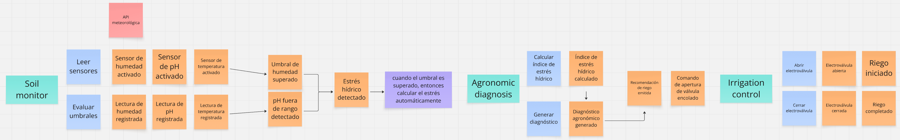

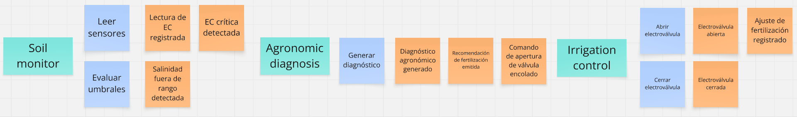

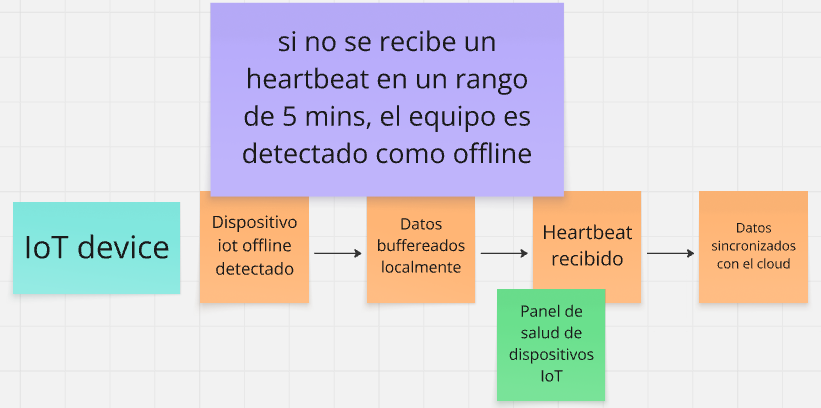

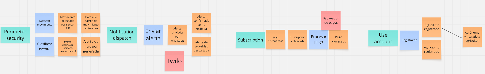

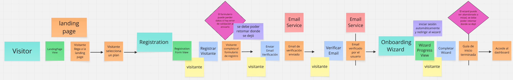

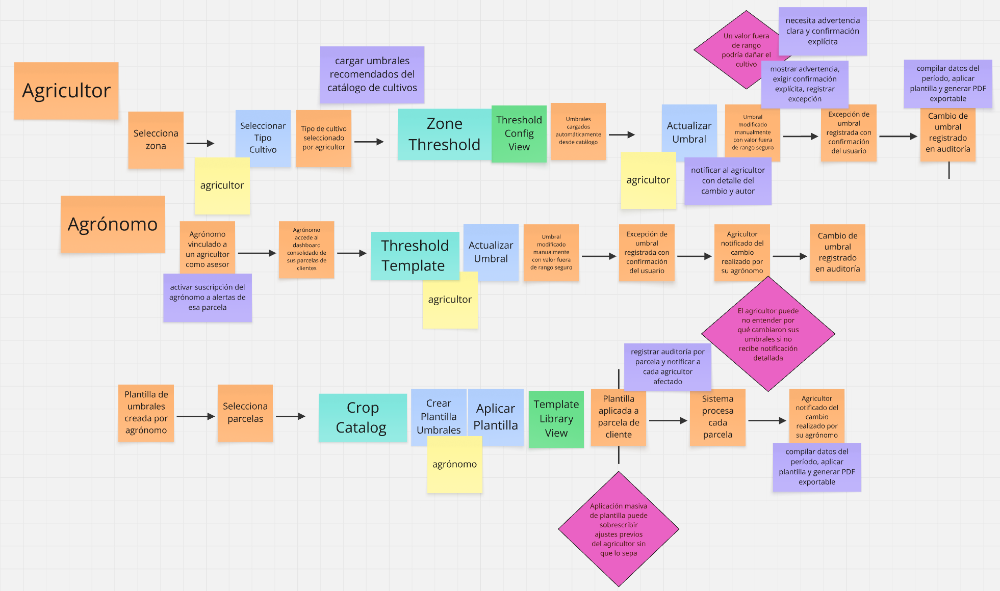

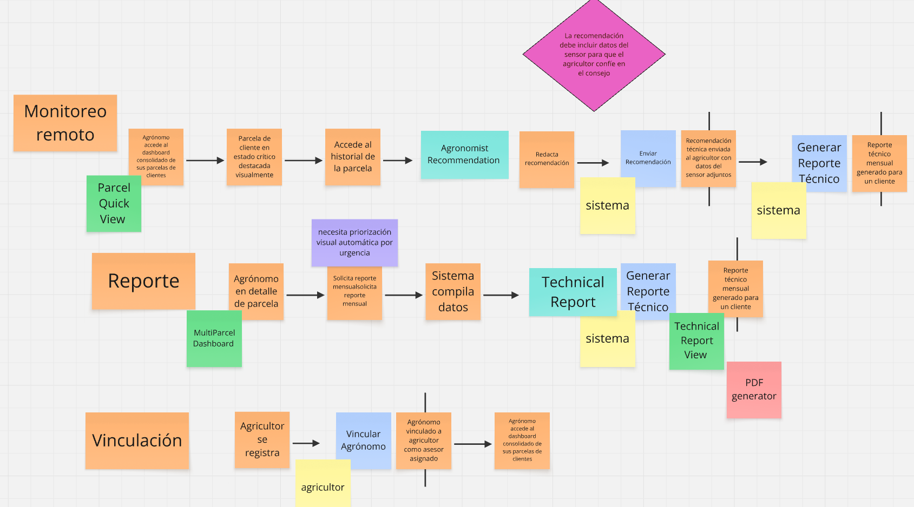

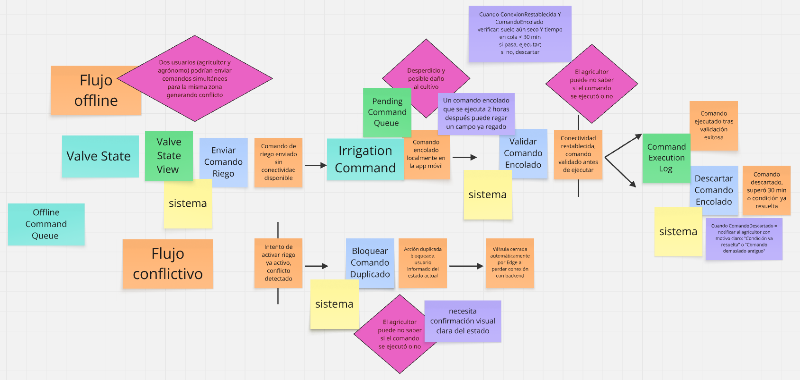

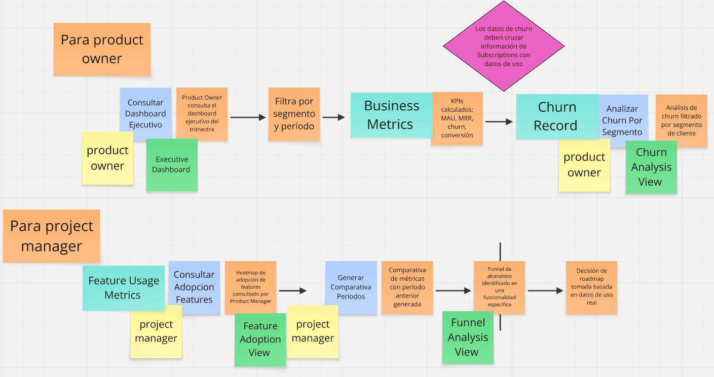

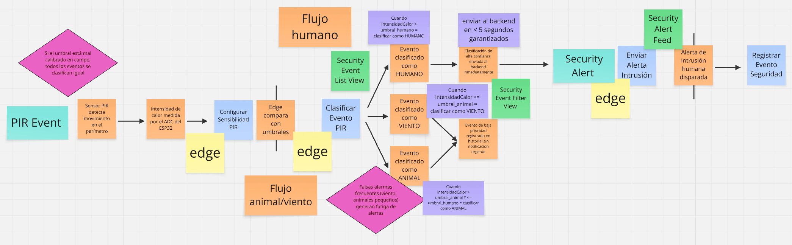

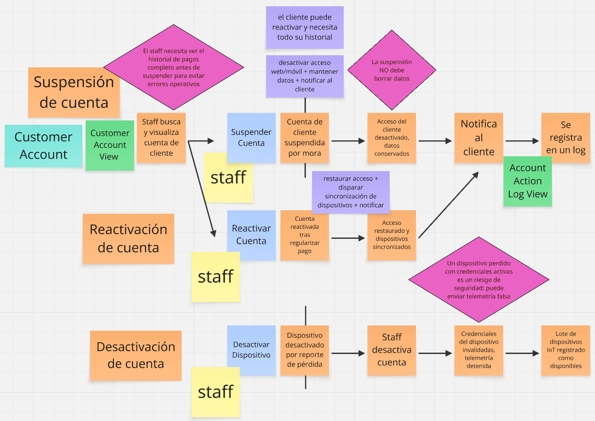

---

Ya por último y después de un análisis y discusión grupal, los siguientes Bounded Contexts fueron elegidos, siguiendo algunas condiciones, como la separación de responsabilidades de negocio, cambios de lenguaje ubicuo y las fronteras marcadas por los pivotal points. Por ello, al final se eligió estos Bounded Contexts:

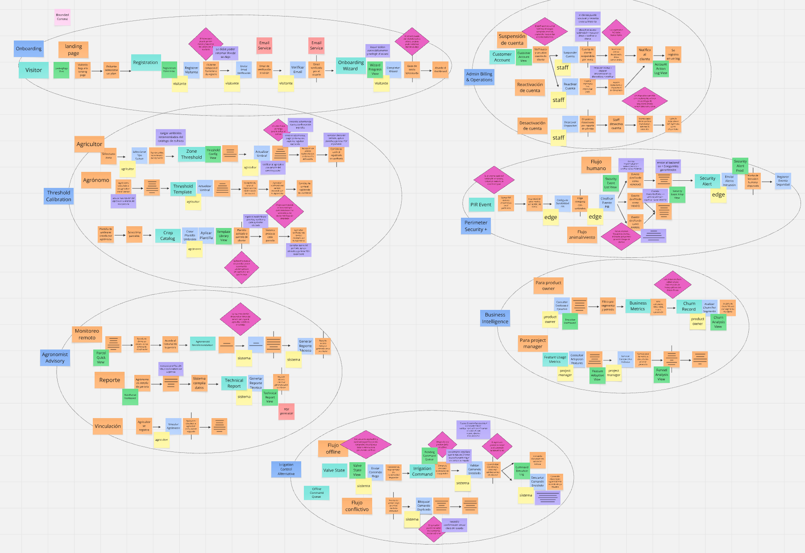

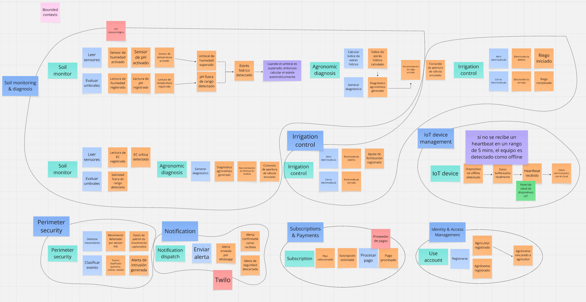

### 4.1.1.2 Domain Message Flows Modeling

En esta sección, el equipo explica y evidencia el proceso seguido para visualizar cómo deben colaborar los bounded contexts para resolver los casos que se presentan en el negocio para los usuarios del sistema. Para ello, aplicamos la técnica de visualización Domain Storytelling, la cual nos permite narrar las interacciones clave donde los mensajes y eventos cruzan las fronteras de los dominios.En esta sección, el equipo explica y evidencia el proceso seguido para visualizar cómo deben colaborar los bounded contexts para resolver los casos que se presentan en el negocio para los usuarios del sistema. Para ello, aplicamos la técnica de visualización Domain Storytelling, la cual nos permite narrar las interacciones clave donde los mensajes y eventos cruzan las fronteras de los dominios.

A continuación, se presentan los cuatro flujos de mensajería más relevantes para SATECHO, donde se evidencia la colaboración entre los contextos de Soil Monitor, Irrigation Control, Perimeter Security, Account Management y Agronomist Advisory.A continuación, se presentan los cuatro flujos de mensajería más relevantes para SATECHO, donde se evidencia la colaboración entre los contextos de Soil Monitor, Irrigation Control, Perimeter Security, Account Management y Agronomist Advisory.

#### 1. Riego Inteligente Automático

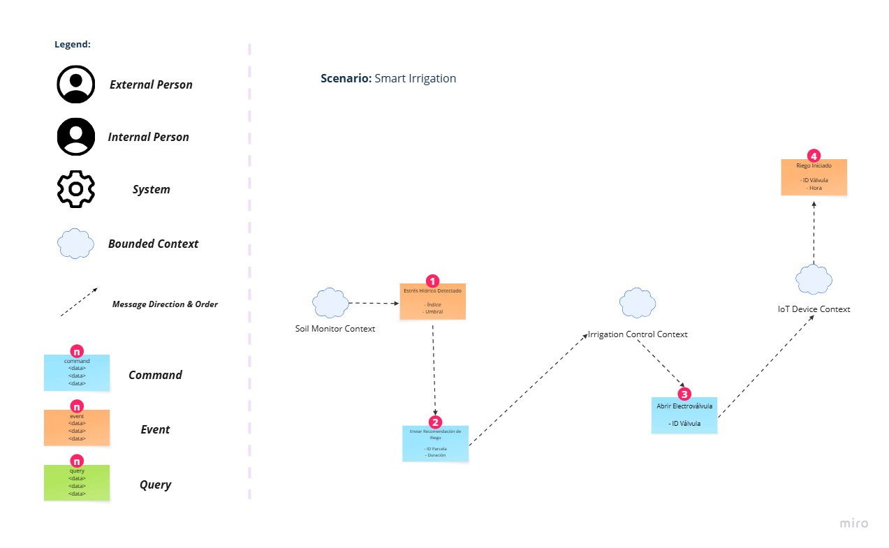

_Este flujo muestra cómo el contexto de Monitoreo de Suelo dispara acciones en el contexto de Control de Riego._

---

#### 2. Alerta de Seguridad Perimetral

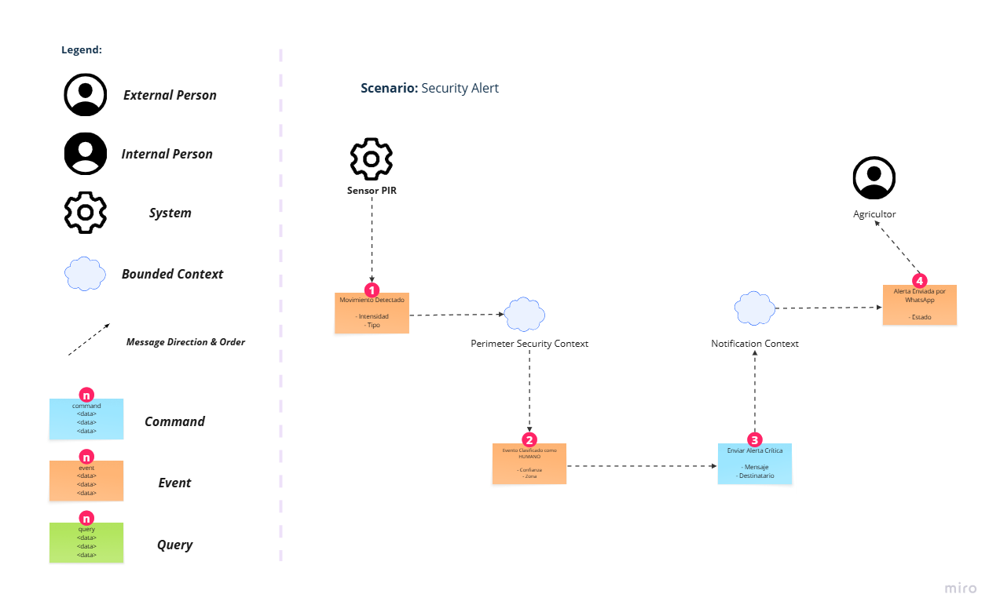

_Este flujo muestra la detección de un intruso y la notificación al agricultor._

---

#### 3. Suspensión de Cuenta por Mora

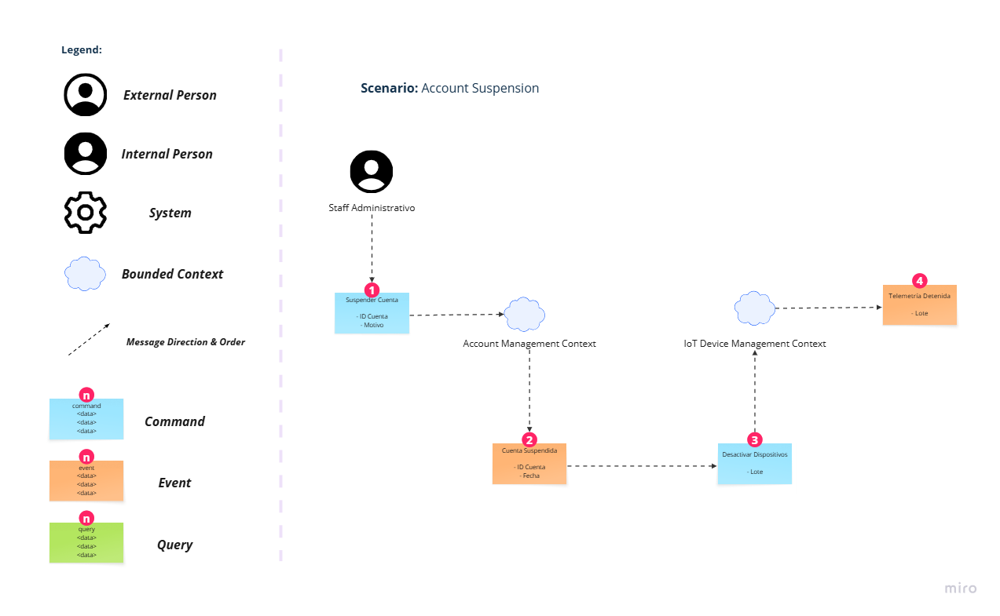

_Este flujo muestra cómo el negocio afecta la operación técnica._

---

#### 4. Asesoría Remota del Agrónomo

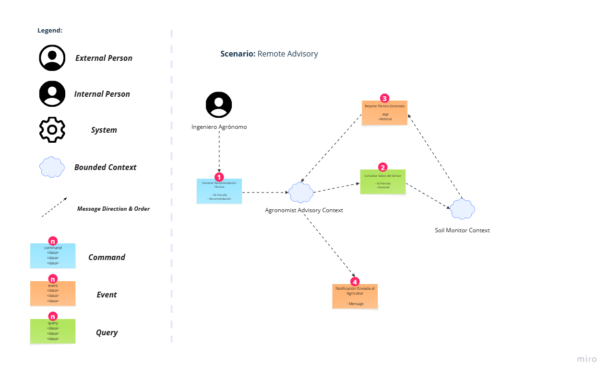

_Este flujo muestra cómo el agrónomo consume datos para ayudar al cliente._

### 4.1.1.3 Bounded Context Canvases

De acuerdo con los bounded contexts definidos en puntos anteriores, se crearon sus respectivos Canvases. El equipo seleccionó cada contexto por orden de importancia estratégica para el negocio SATECHO, aplicando un proceso iterativo de refinamiento. A continuación, se detalla el diseño de cada uno:De acuerdo con los bounded contexts definidos en puntos anteriores, se crearon sus respectivos Canvases. El equipo seleccionó cada contexto por orden de importancia estratégica para el negocio SATECHO, aplicando un proceso iterativo de refinamiento. A continuación, se detalla el diseño de cada uno:De acuerdo con los bounded contexts definidos en puntos anteriores, se crearon sus respectivos Canvases. El equipo seleccionó cada contexto por orden de importancia estratégica para el negocio SATECHO, aplicando un proceso iterativo de refinamiento. A continuación, se detalla el diseño de cada uno:

#### 1. Soil Monitoring & Agronomic Diagnosis Context

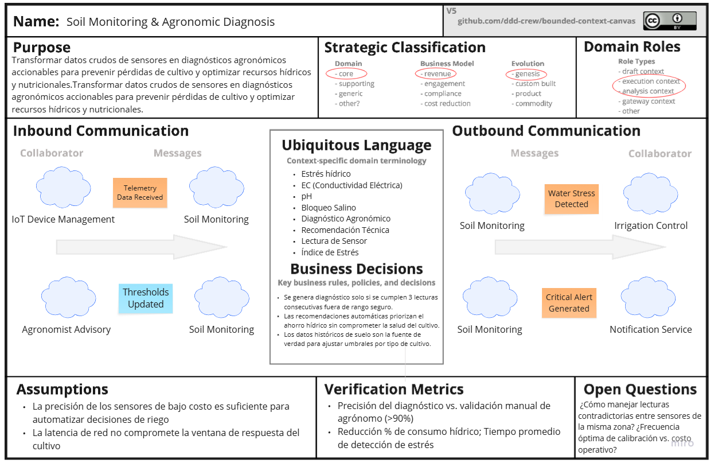

_Contexto Core: Es la razón de ser del negocio. Si esto falla, no hay valor._

---

#### 2. Irrigation & Actuator Control Context

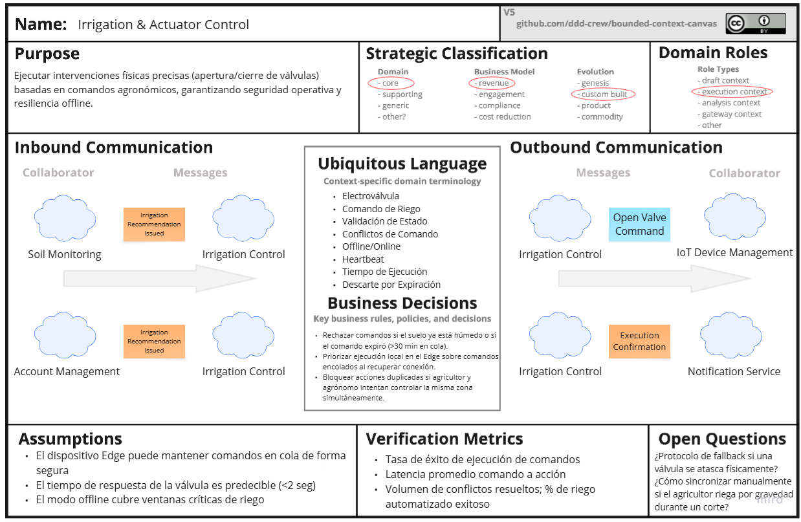

_Contexto Core: Ejecuta las decisiones físicas. Alto impacto en el campo._

---

#### 3. Perimeter Security & Classification Context

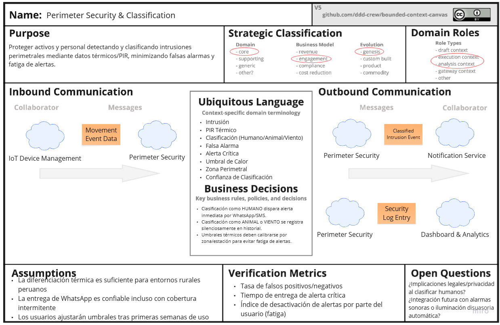

_Contexto Core: Diferenciador clave frente a la competencia._

---

#### 4. Account, Subscription & Billing Management Context

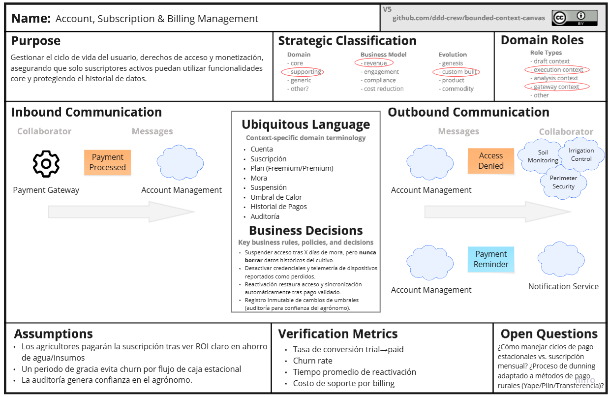

_Contexto Supporting: Esencial para el modelo de negocio SaaS._

---

#### 5. IoT Device & Edge Management Context

_Contexto Supporting/Generic: Mantiene el "cuerpo" del sistema._

### 4.1.2. Context Mapping

En esta sección, explicamos y evidenciamos nuestro proceso de elaboración de un conjunto de context maps, los cuales visualizan las relaciones estructurales entre los bounded contexts identificados en nuestro proyecto. Para ello, revisamos minuciosamente la información recolectada durante el Event Storming y la elaboración de los Bounded Context Canvases, utilizándola para producir y refinar diseños candidatos. Este análisis estructural nos permite entender y alinear claramente los contextos para alcanzar los objetivos del negocio de manera eficiente, minimizando el acoplamiento técnico y maximizando la autonomía de los equipos de desarrollo.

Durante el proceso de mapeo, el equipo aplicó un enfoque iterativo de cuestionamiento estratégico, planteando preguntas clave para evaluar alternativas de diseño antes de consolidar la arquitectura final:
- **¿Qué pasaría si movemos esta capability a otro bounded context?**
    
    Se evaluó mover la *clasificación de eventos perimetrales* al contexto de `Soil Monitoring`. Sin embargo, esto mezclaría el lenguaje ubicuo agronómico con el de seguridad física, rompiendo la cohesión del dominio. Se decidió mantenerlo en `Perimeter Security` para preservar la especialización y permitir evoluciones independientes de los algoritmos de detección térmica.

- **¿Qué pasaría si descomponemos esta capability y movemos uno de los sub-capabilities a otro bounded context?**

    Se analizó separar la *ingestión de telemetría* de la *gestión de firmware/OTA* dentro de `IoT Device Management`. Aunque viable a escala enterprise, para la fase MVP añadiría latencia y complejidad de red innecesaria. Se mantuvo unificado con interfaces internas claras, priorizando la simplicidad operativa en campo.

- **¿Qué pasaría si partimos el bounded context en múltiples bounded contexts?**

  Se consideró dividir `Account & Subscription Management` en `Identity` y `Billing`. Dado que la validación de suscripción y el control de acceso están fuertemente acoplados en el modelo de negocio SaaS (la mora detiene el acceso inmediatamente), partirlos generaría transacciones distribuidas complejas. Se mantuvo como un único contexto Supporting con responsabilidades bien delimitadas internamente.

- **¿Qué pasaría si tomamos esta capability de estos 3 contexts y lo usamos para formar un nuevo context?**

  Se revisó la duplicación de lógica de *notificaciones* (WhatsApp, SMS, Push) en Security, Soil y Account. En lugar de crear un contexto independiente prematuramente, se optó por un patrón de **Open Host Service** con un **Published Language** ligero, permitiendo que cada contexto core publique eventos estandarizados que un módulo de dispatching consume sin acoplarse a la lógica de origen.

- **¿Qué pasaría si duplicamos una funcionalidad para romper la dependencia?**

  Se evaluó duplicar el catálogo de *umbrales de cultivo* en `Irrigation Control` para evitar consultas a `Soil Monitoring`. Esto violaría el principio de única fuente de verdad. Se descartó la duplicación y se estableció un contrato síncrono/asíncrono claro, priorizando la consistencia agronómica sobre la optimización de red.

- **¿Qué pasaría si creamos un shared service para reducir la duplicación entre múltiples bounded contexts?**

  Se analizó un **Shared Kernel** para autenticación y gestión de roles entre todos los contextos. Dado que `Account Management` debe evolucionar según regulaciones de pagos y seguridad sin afectar la lógica core de riego o diagnóstico, se rechazó el Shared Kernel por el alto riesgo de acoplamiento y se adoptó un modelo **Conformist** con tokens estandarizados.

- **¿Qué pasaría si aislamos los core capabilities y movemos los otros a un context aparte?**

  Esta pregunta consolidó la arquitectura final. Se aislaron explícitamente los contextos Core (`Soil Monitoring`, `Irrigation Control`, `Perimeter Security`) de los Supporting/Generic (`Account Management`, `IoT Device Management`). Esto permite que el equipo priorice la innovación en la propuesta de valor diferencial, mientras los contextos de soporte pueden ser reemplazados o integrados con soluciones SaaS externas en el futuro sin impactar el núcleo del negocio.

- **¿Qué pasaría si partimos el bounded context en múltiples bounded contexts?**

  Se consideró dividir `Account & Subscription Management` en `Identity` y `Billing`. Dado que la validación de suscripción y el control de acceso están fuertemente acoplados en el modelo de negocio SaaS (la mora detiene el acceso inmediatamente), partirlos generaría transacciones distribuidas complejas. Se mantuvo como un único contexto Supporting con responsabilidades bien delimitadas internamente.

- **¿Qué pasaría si tomamos esta capability de estos 3 contexts y lo usamos para formar un nuevo context?**

  Se revisó la duplicación de lógica de *notificaciones* (WhatsApp, SMS, Push) en Security, Soil y Account. En lugar de crear un contexto independiente prematuramente, se optó por un patrón de **Open Host Service** con un **Published Language** ligero, permitiendo que cada contexto core publique eventos estandarizados que un módulo de dispatching consume sin acoplarse a la lógica de origen.

- **¿Qué pasaría si duplicamos una funcionalidad para romper la dependencia?**

  Se evaluó duplicar el catálogo de *umbrales de cultivo* en `Irrigation Control` para evitar consultas a `Soil Monitoring`. Esto violaría el principio de única fuente de verdad. Se descartó la duplicación y se estableció un contrato síncrono/asíncrono claro, priorizando la consistencia agronómica sobre la optimización de red.

- **¿Qué pasaría si creamos un shared service para reducir la duplicación entre múltiples bounded contexts?**

  Se analizó un **Shared Kernel** para autenticación y gestión de roles entre todos los contextos. Dado que `Account Management` debe evolucionar según regulaciones de pagos y seguridad sin afectar la lógica core de riego o diagnóstico, se rechazó el Shared Kernel por el alto riesgo de acoplamiento y se adoptó un modelo **Conformist** con tokens estandarizados.

- **¿Qué pasaría si aislamos los core capabilities y movemos los otros a un context aparte?**

  Esta pregunta consolidó la arquitectura final. Se aislaron explícitamente los contextos Core (`Soil Monitoring`, `Irrigation Control`, `Perimeter Security`) de los Supporting/Generic (`Account Management`, `IoT Device Management`). Esto permite que el equipo priorice la innovación en la propuesta de valor diferencial, mientras los contextos de soporte pueden ser reemplazados o integrados con soluciones SaaS externas en el futuro sin impactar el núcleo del negocio.

#### Discusión de alternativas y aproximación final

Tras evaluar las alternativas, el equipo concluyó que la mejor aproximación es un mapa de contextos descentralizado con contratos explícitos, donde los contextos Core actúan como proveedores de valor agronómico y los Supporting actúan como habilitadores operativos y comerciales. Se priorizaron los patrones Customer/Supplier, Open Host Service (OHS) con Published Language, y Conformist, evitando por completo el uso de Shared Kernels para garantizar la independencia de despliegue y evolución.

1. **IoT Device Management Context — Soil Monitoring Context**

   *Relación clave:* **Customer/Supplier** con **Published Language**.

   `IoT Device Management` actúa como *Upstream* (Supplier), normalizando datos crudos de hardware y publicándolos mediante un lenguaje estandarizado de telemetría. `Soil Monitoring` es el *Downstream* (Customer), consumiendo estos datos sin conocer los detalles de comunicación MQTT o protocolos del ESP32. Esta relación desacopla la evolución del firmware de la lógica agronómica.
    
    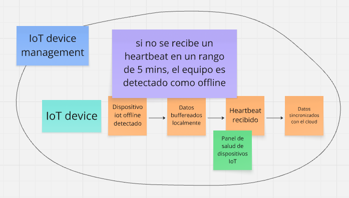

    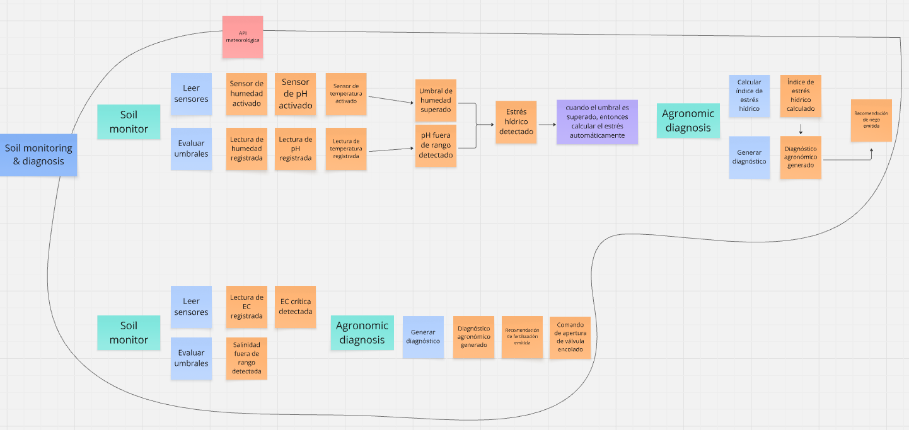

---

2. **Soil Monitoring Context — Irrigation & Actuator Control Context**

   *Relación clave:* **Customer/Supplier** con **Anti-Corruption Layer (ACL)**.

   `Soil Monitoring` es el *Upstream*, generando diagnósticos y recomendaciones de riego. `Irrigation Control` es el *Downstream*, responsable de la ejecución física. Dado que el contexto de riego debe protegerse de cambios frecuentes en los algoritmos de diagnóstico, se implementa un ACL que traduce las recomendaciones agronómicas a comandos de actuador válidos y seguros, garantizando que fallos en el análisis no deriven en acciones físicas peligrosas.

    

    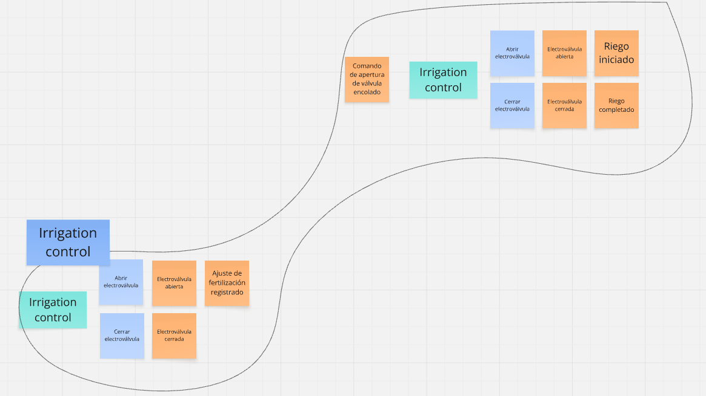

---

3. **Account & Subscription Management Context — Core Contexts (Soil, Irrigation, Security)**

   *Relación clave:* **Conformist** con **Open Host Service**.

   `Account Management` define las reglas de suscripción, acceso y facturación. Los contextos Core actúan como **Conformist**, adaptándose a las APIs y políticas expuestas por Account para validar permisos y estado de cuenta. Account expone un **Open Host Service** estable para consultas de suscripción, permitiendo que los contextos Core funcionen incluso si Account migra a un proveedor de billing externo en el futuro.

    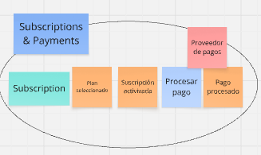

    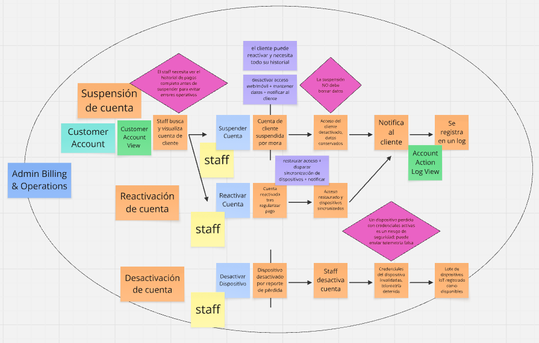

---

4. **Perimeter Security Context — Notification Dispatch**

   *Relación clave:* **Open Host Service** con **Published Language**.

   `Perimeter Security` publica eventos clasificados (`IntrusionDetected`, `FalseAlarmLogged`) mediante un contrato claro. El módulo de notificaciones se suscribe a estos eventos sin conocer la lógica de clasificación térmica. Esto permite escalar canales de alerta (WhatsApp, SMS, Email) sin modificar el código de seguridad.

    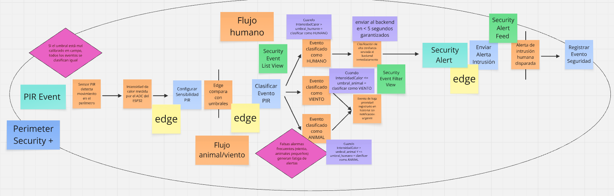

    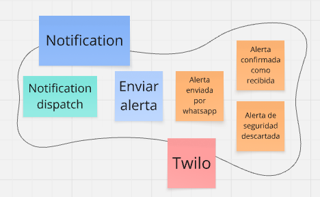

---

5. **IoT Device Management Context ↔ Account & Subscription Management Context**

   *Relación clave:* **Customer/Supplier**.

   `Account Management` (Upstream) emite comandos de suspensión/reactivación por mora o reporte de pérdida. `IoT Device Management` (Downstream) debe conformarse a estas órdenes para invalidar credenciales o detener telemetría, asegurando la integridad comercial y de seguridad del servicio.

    

    

    

### 4.1.3. Software Architecture

#### 4.1.3.1. Software Architecture System Landscape Diagram

Visión panorámica completa del ecosistema **SATECHO**: los tres actores (agricultor, agrónomo, staff), los nueve contenedores internos de la plataforma y los cuatro sistemas externos integrados (Stripe, Twilio, FCM, SendGrid). Muestra quién usa el sistema, qué lo compone y con qué servicios de terceros se comunica.

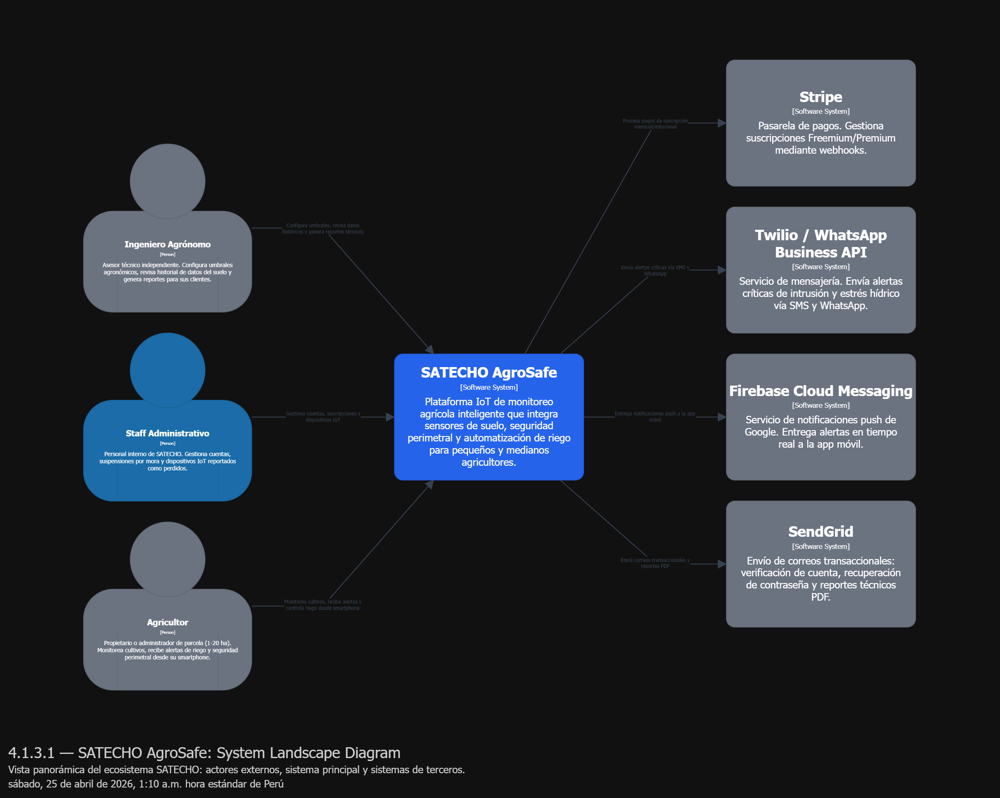

#### 4.1.3.2. Software Architecture Context Level Diagrams

SATECHO AgroSafe como caja negra dentro de su entorno operativo. Representa cómo el agricultor monitorea su cultivo, cómo el agrónomo configura umbrales y genera reportes, y cómo el staff gestiona cuentas. Enfatiza las integraciones con sistemas externos sin detalles de implementación interna.

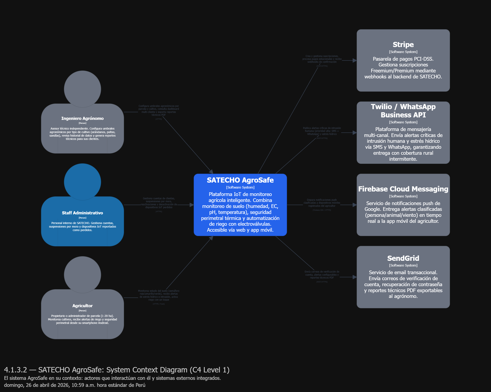

#### 4.1.3.2. Software Architecture Container Level Diagrams

Desglosa los nueve contenedores internos: Landing Page, Web App Vue.js, Mobile App Capacitor, Backend API con Spring Boot, Servicio de Análisis Python, Firestore, Firebase Auth, ESP32 y Electroválvula. Diagrama técnico de referencia que muestra la arquitectura interna y las dependencias entre componentes.

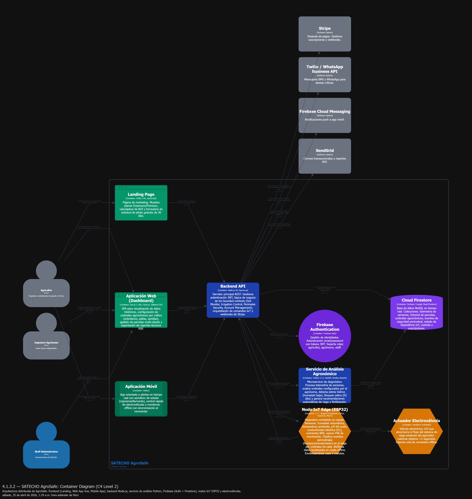

#### 4.1.3.3. Software Architecture Deployment Diagrams

Distribución de la solución sobre infraestructura real: nodos ESP32 alimentados por panel solar en campo, Google Cloud Platform (Cloud Run + Firebase), Firebase Hosting con CDN global, y servicios externos integrados mediante APIs REST. Referencia para planificación de despliegue y resiliencia ante conectividad rural intermitente.

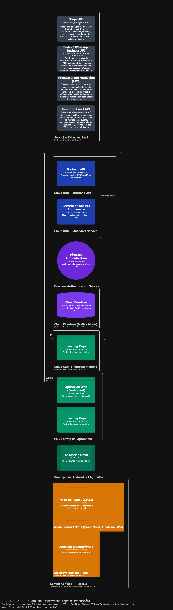

## 4.2. Strategic-Level Domain-Driven Design

### 4.2.1. Bounded Context: Onboarding

Este bounded context gestiona la experiencia del visitante desde que llega a la landing page hasta que completa el wizard de inicio y accede al dashboard. Su responsabilidad es guiar al usuario por el proceso de selección de plan, registro y configuración inicial, garantizando que si el wizard es abandonado a mitad pueda retomarse desde donde se dejó.

#### Diccionario de Clases

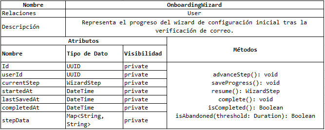

### 4.2.1.1. Domain Layer

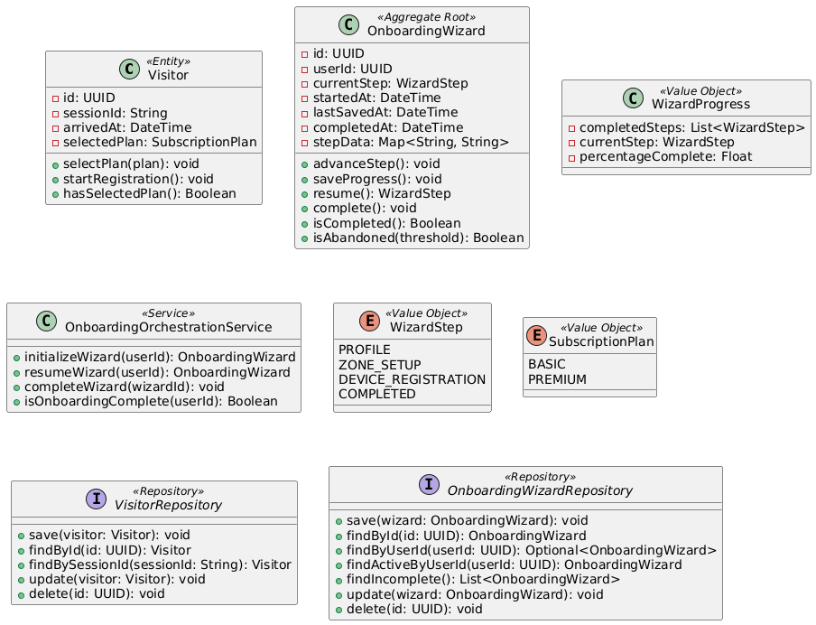

### 4.2.1.2. Interface Layer

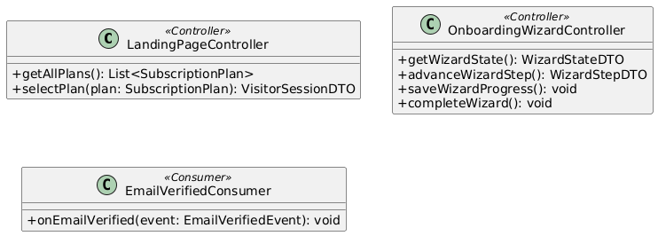

### 4.2.1.3. Application Layer

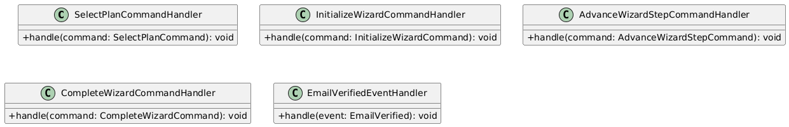

### 4.2.1.4. Infrastructure Layer

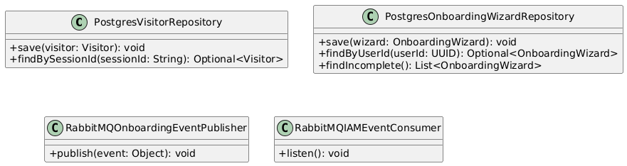

### 4.2.1.5. Bounded Context Software Architecture Component Level Diagrams

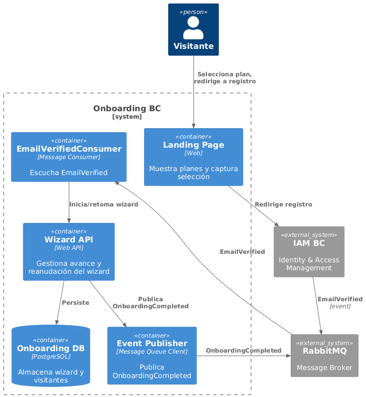

### 4.2.1.6 Bounded Context Software Architecture Code Level Diagrams

### 4.2.1.6.1 Bounded Context Domain Layer Class Diagrams

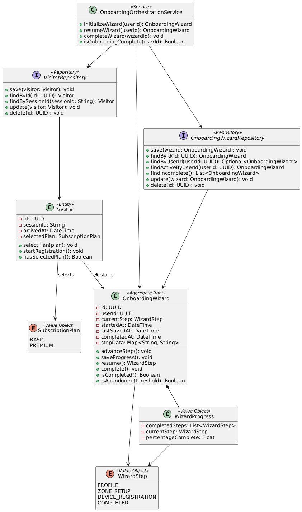

### 4.2.1.6.2 Bounded Context Database Design Diagram

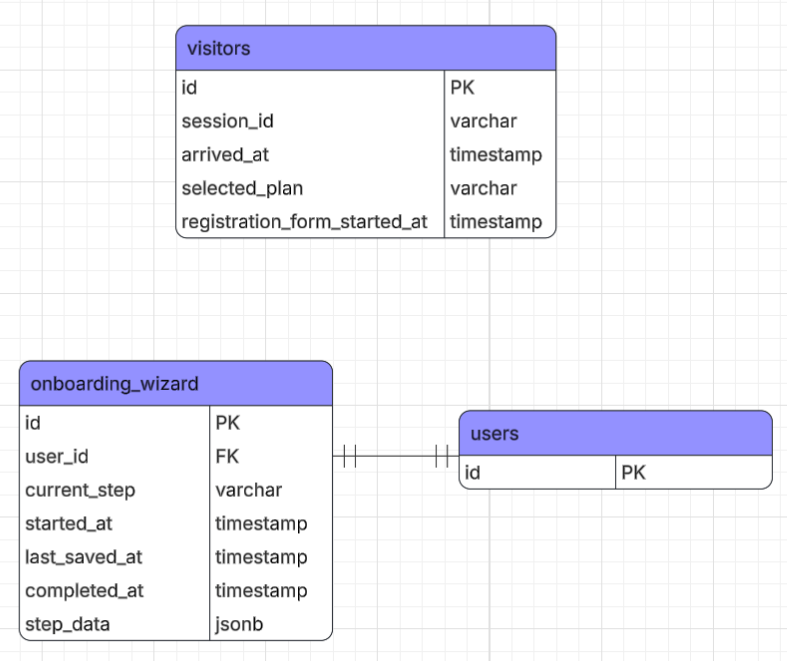

---

### 4.2.2. Bounded Context: Identity & Access Management

Gestiona el registro de usuarios (agricultores y agrónomos), autenticación, verificación de email, restablecimiento de contraseña, y los flujos de suspensión, reactivación y desactivación de cuentas gestionados por el staff.
#### Diccionario de Clases

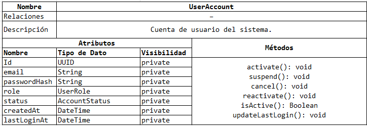

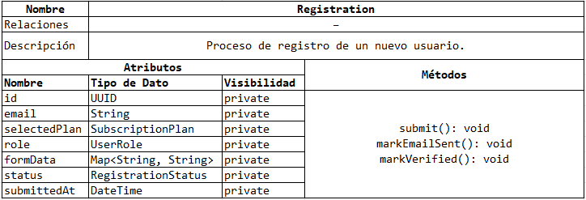

### 4.2.2.1. Domain Layer

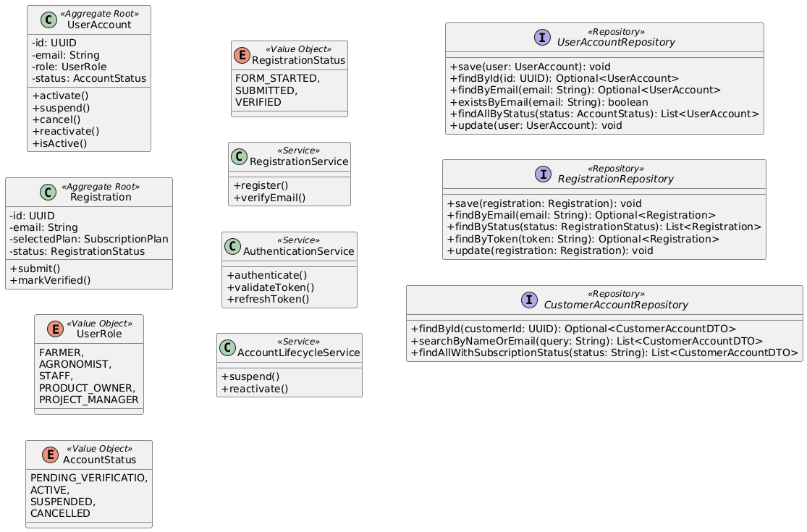

### 4.2.2.2. Interface Layer

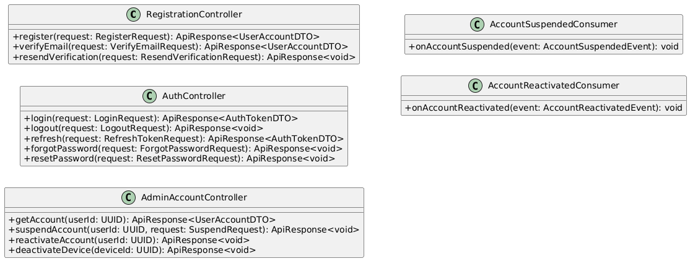

### 4.2.2.3. Application Layer

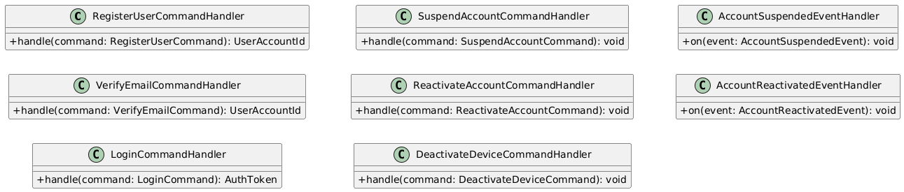

### 4.2.2.4. Infrastructure Layer

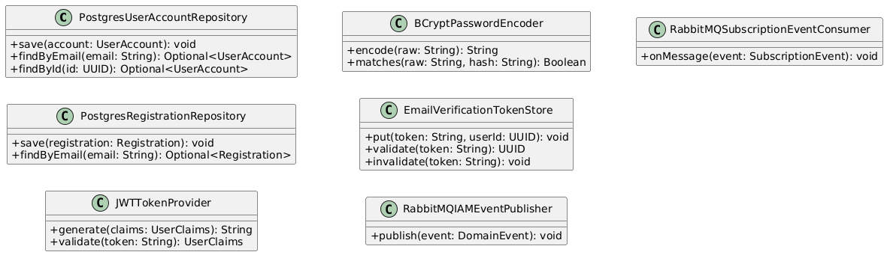

### 4.2.2.5. Bounded Context Software Architecture Component Level Diagrams

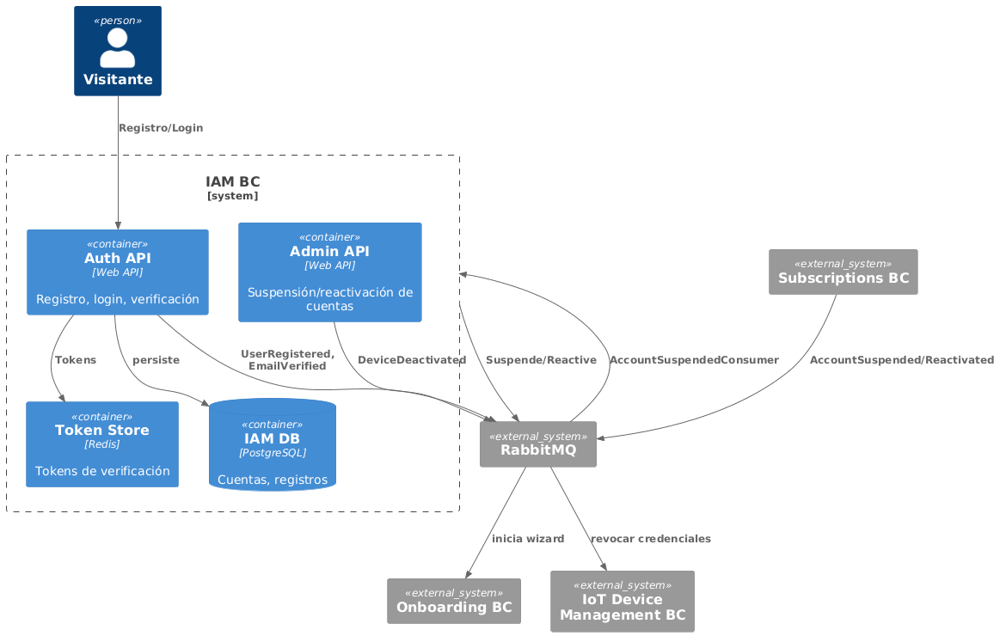

### 4.2.2.6 Bounded Context Software Architecture Code Level Diagrams

### 4.2.2.6.1 Bounded Context Domain Layer Class Diagrams

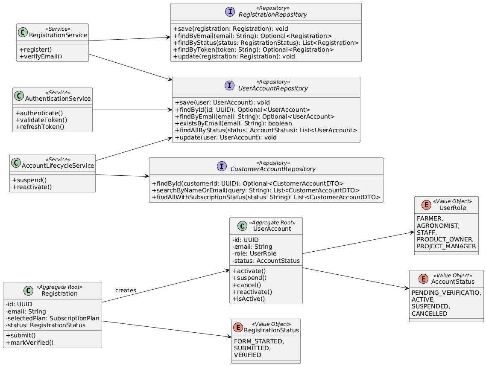

### 4.2.2.6.2 Bounded Context Database Design Diagram

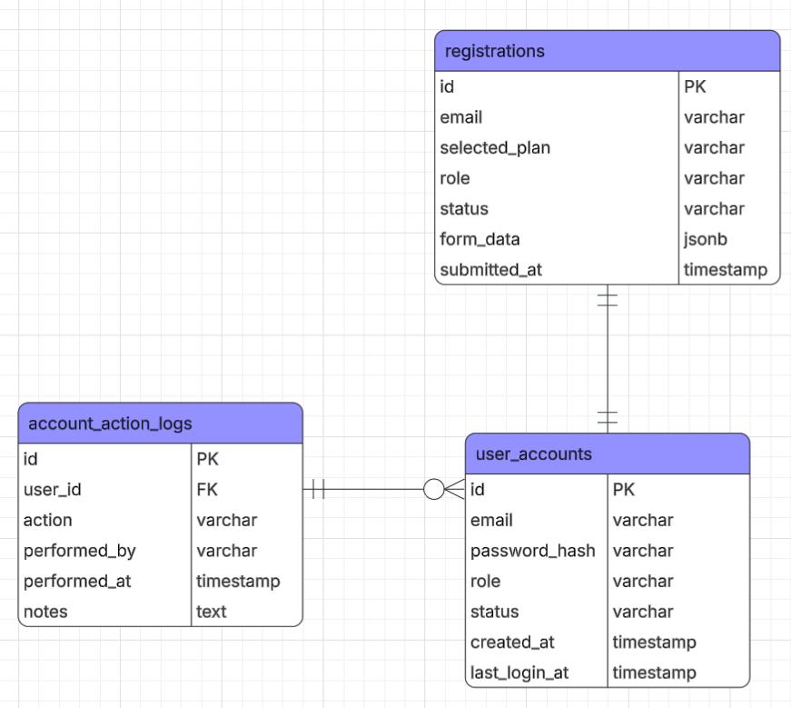

---

### 4.2.3. Bounded Context: Subscriptions & Payments

Gestiona los planes de suscripción, el procesamiento de pagos a través de un proveedor externo y los flujos de suspensión, reactivación y cancelación de cuentas por mora.

#### Diccionario de Clases

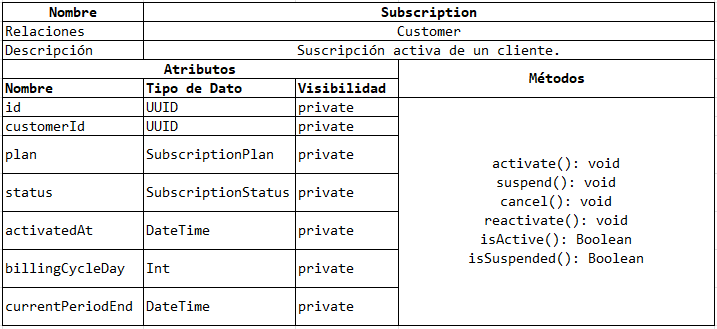


### 4.2.3.1. Domain Layer


### 4.2.3.2. Interface Layer


### 4.2.3.3. Application Layer


### 4.2.3.4. Infrastructure Layer


### 4.2.3.5. Bounded Context Software Architecture Component Level Diagrams


### 4.2.3.6 Bounded Context Software Architecture Code Level Diagrams

### 4.2.3.6.1 Bounded Context Domain Layer Class Diagrams


### 4.2.3.6.2 Bounded Context Database Design Diagram


---

### 4.2.4. Bounded Context: Communication

Este bounded context gestiona el despacho de alertas y notificaciones hacia los usuarios finales. Según tu Event Storming, los componentes clave son **Notification Dispatch**, **Enviar Alerta** y la integración con **Twilio** como sistema externo.

#### Diccionario de Clases


### 4.2.4.1. Domain Layer


### 4.2.4.2. Interface Layer


### 4.2.4.3. Application Layer


### 4.2.4.4. Infrastructure Layer


### 4.2.4.5. Bounded Context Software Architecture Component Level Diagrams


### 4.2.4.6 Bounded Context Software Architecture Code Level Diagrams

### 4.2.4.6.1 Bounded Context Domain Layer Class Diagrams


### 4.2.4.6.2 Bounded Context Database Design Diagram  


---

### 4.2.5. Bounded Context: IoT Device Management

Este bounded context gestiona el ciclo de vida completo de los dispositivos IoT físicos desplegados en campo. Según tu Event Storming, los agregados principales son **IoT Device** y el mecanismo de detección offline por heartbeat: si no se recibe un heartbeat en un rango de 5 minutos, el equipo es detectado como offline.

#### Diccionario de Clases


### 4.2.5.1. Domain Layer


### 4.2.5.2. Interface Layer


### 4.2.5.3. Application Layer


### 4.2.5.4. Infrastructure Layer


### 4.2.5.5. Bounded Context Software Architecture Component Level Diagrams


### 4.2.5.6 Bounded Context Software Architecture Code Level Diagrams

### 4.2.5.6.1 Bounded Context Domain Layer Class Diagrams


### 4.2.5.6.2 Bounded Context Database Design Diagram  


---

### 4.2.6. Bounded Context: Soil Monitoring & Diagnosis

Este bounded context gestiona la experiencia del visitante desde que llega a la landing page hasta que completa el wizard de inicio y accede al dashboard. Su responsabilidad es guiar al usuario por el proceso de selección de plan, registro y configuración inicial, garantizando que si el wizard es abandonado a mitad pueda retomarse desde donde se dejó.

#### Diccionario de Clases


### 4.2.6.1. Domain Layer


### 4.2.6.2. Interface Layer


### 4.2.6.3. Application Layer


### 4.2.6.4. Infrastructure Layer


### 4.2.6.5. Bounded Context Software Architecture Component Level Diagrams


### 4.2.6.6 Bounded Context Software Architecture Code Level Diagrams

### 4.2.6.6.1 Bounded Context Domain Layer Class Diagrams


### 4.2.5.6.2 Bounded Context Database Design Diagram


---

### 4.2.7. Bounded Context: Irrigation & Actuator Control

Este bounded context gestiona el control físico de las electroválvulas de riego. Según tu Event Storming, los agregados principales son **Valve State**, **Irrigation Command** y **Offline Command Queue**, con tres flujos claramente diferenciados: **Flujo online**, **Flujo offline** y **Flujo conflictivo**.

#### Diccionario de Clases


### 4.2.7.1. Domain Layer


### 4.2.7.2. Interface Layer


### 4.2.7.3. Application Layer


### 4.2.7.4. Infrastructure Layer


### 4.2.7.5. Bounded Context Software Architecture Component Level Diagrams


### 4.2.7.6 Bounded Context Software Architecture Code Level Diagrams

### 4.2.7.6.1 Bounded Context Domain Layer Class Diagrams


### 4.2.7.6.2 Bounded Context Database Design Diagram  


---

### 4.2.8. Bounded Context: Perimeter Security

Este bounded context gestiona la detección y clasificación de eventos perimetrales mediante el sensor PIR térmico del ESP32. Según tu Event Storming, los agregados principales son **PIR Event** y **Security Alert**, con tres flujos de clasificación claramente diferenciados: **Flujo humano**, **Flujo animal/viento** y la integración con el **Edge** para el procesamiento local de clasificación.

#### Diccionario de Clases


### 4.2.8.1. Domain Layer


### 4.2.8.2. Interface Layer


### 4.2.8.3. Application Layer


### 4.2.8.4. Infrastructure Layer


### 4.2.8.5. Bounded Context Software Architecture Component Level Diagrams


### 4.2.8.6 Bounded Context Software Architecture Code Level Diagrams

### 4.2.8.6.1 Bounded Context Domain Layer Class Diagrams


### 4.2.8.6.2 Bounded Context Database Design Diagram


---

### 4.2.9. Bounded Context: Business Intelligence

Este bounded context provee analítica estratégica para el Product Owner y el Project Manager. Según tu Event Storming, los agregados principales son **Business Metrics**, **Churn Record** y **Feature Usage Metrics**, con el pain point crítico de que los datos de churn deben cruzar información de Subscriptions con datos de uso.

#### Diccionario de Clases


### 4.2.9.1. Domain Layer


### 4.2.9.2. Interface Layer


### 4.2.9.3. Application Layer


### 4.2.9.4. Infrastructure Layer


### 4.2.9.5. Bounded Context Software Architecture Component Level Diagrams


### 4.2.9.6 Bounded Context Software Architecture Code Level Diagrams

### 4.2.9.6.1 Bounded Context Domain Layer Class Diagrams


### 4.2.9.6.2 Bounded Context Database Design Diagram


---

### 4.2.10. Bounded Context: Agronomist Advisory

Este bounded context gestiona las capacidades profesionales del ingeniero agrónomo. Según tu Event Storming, los agregados principales son **Agronomist Advisory** con sus flujos de **Monitoreo remoto**, **Reporte** y **Vinculación**, complementados por el aggregate **Technical Report** y la integración con el **PDF generator** como sistema externo.

#### Diccionario de Clases


### 4.2.10.1. Domain Layer


### 4.2.10.2. Interface Layer


### 4.2.10.3. Application Layer


### 4.2.10.4. Infrastructure Layer


### 4.2.10.5. Bounded Context Software Architecture Component Level Diagrams


### 4.2.10.6 Bounded Context Software Architecture Code Level Diagrams

### 4.2.10.6.1 Bounded Context Domain Layer Class Diagrams


### 4.2.10.6.2 Bounded Context Database Design Diagram

