# Capítulo IV - Solution Software Design

## 4.1. Strategic-Level Domain-Driven Design

El diseño estratégico de la plataforma AgroSafe se abordó mediante un proceso estructurado de Diseño Orientado al Dominio (DDD). El equipo empleó EventStorming como técnica fundamental para explorar, modelar y comprender el dominio del negocio, seguido de pasos de refinamiento progresivo para identificar contextos delimitados, visualizar flujos de mensajes, definir lienzos de contexto y establecer relaciones de mapeo de contexto.

### 4.1.1. Design-Level EventStorming
El proceso de Event Storming se realizó utilizando la herramienta MIRO como lienzo colaborativo infinito, siguiendo la metodología estandarizada de Domain-Driven Design para descubrir, validar y estructurar el comportamiento del dominio de AgroSafe. Este enfoque permitió al equipo trascender la visión técnica inicial y centrarse en el lenguaje ubicuo, la causalidad entre eventos y las fronteras naturales del negocio. El flujo de trabajo se estructuró en **10 pasos secuenciales**, cada uno con un objetivo específico y un artefacto de salida:

_Evidencia del desarrollo del primer paso del DDD._

1. **Exploración No Estructurada (Eventos de Dominio):** Lluvia de ideas divergente donde se plasman todos los hechos relevantes del dominio en notas naranjas (`EventName`), redactados en tiempo pasado y validados por relevancia, frecuencia e impacto.
2. **Ordenamiento Temporal (Timelines):** Organización cronológica de los eventos para construir narrativas causa-efecto. Se trazan flechas de dependencia y se agrupan en flujos de valor independientes.
3. **Identificación de Pain Points (Puntos Críticos):** Marcado con notas rosas de áreas de fricción, riesgo operativo o pérdida de valor que requieren mitigación técnica o de negocio.
4. **Detección de Pivotal Points (Puntos de Inflexión):** Identificación de eventos que marcan cambios irreversibles de estado o fronteras naturales entre contextos, usando notas lilas.
5. **Definición de Comandos:** Notas azules que representan intenciones de acción (`CommandName`) emitidas por usuarios o sistemas para detonar eventos de dominio.
6. **Formulación de Políticas:** Notas violetas que capturan reglas de negocio automatizadas o semiautomatizadas (`Si X entonces Y`), traduciendo lógica empresarial a comportamiento del sistema.
7. **Modelos de Lectura (Read Models):** Notas verdes que representan proyecciones optimizadas de datos para consultas, dashboards o reportes, desacopladas del modelo transaccional.
8. **Integración de Sistemas Externos:** Notas amarillas que delimitan servicios de terceros, hardware o APIs fuera del control del equipo, estableciendo límites de integración.
9. **Identificación de Agregados:** Agrupación de entidades y value objects que comparten ciclo de vida y consistencia transaccional, marcando raíces de agregado (`Aggregate Root`).
10. **Descubrimiento de Bounded Contexts:** Delimitación de fronteras funcionales basadas en lenguaje ubicuo, cohesión de responsabilidades y pivotal points, resultando en los módulos estratégicos del sistema.

---

#### Construcción y Explicación de los Timelines
Una vez capturados los eventos de dominio, el equipo procedió a la fase de **Timelines**, donde se organizó cronológicamente la narrativa del dominio para visualizar flujos de valor completos. Cada timeline representa un proceso de negocio autosuficiente, con un inicio claro, estados intermedios y un resultado observable.

A continuación, se describen los **Timelines** críticos identificados para AgroSafe, los cuales definen la lógica de operación del sistema:

#### Timeline 1: Onboarding y Registro de Usuarios

**Propósito:** Transformar a un visitante anónimo en un usuario autenticado y completamente configurado dentro de la plataforma AgroSafe, guiándolo a través de un proceso estructurado que incluye selección de plan, registro de identidad, verificación de credenciales y configuración inicial del entorno de trabajo.

**Narrativa del Flujo:** El proceso inicia cuando un `Visitante llega a la landing page` y explora la propuesta de valor del sistema. Tras identificar el beneficio, el `Visitante selecciona un plan` (Básico, Premium o Empresa), lo que genera el evento `Selected plan` y activa la lógica comercial correspondiente. Inmediatamente, se dispara el evento `Subscription activated`, reservando el plan y estableciendo las bases para la facturación recurrente.

Con el plan seleccionado, el `Visitor completes the registration form`, proporcionando información crítica de identidad: nombre, email, teléfono y credenciales de acceso. En este punto crítico, el flujo se bifurca según el rol del usuario:

**Rama A - Agricultor:** Si el usuario se registra como agricultor, se genera el evento `Registered Farmer`, creando su perfil con permisos operativos para gestionar parcelas, dispositivos y configuraciones de riego. Posteriormente, si decide trabajar con un asesor, se produce el evento `Agronomist linked`, estableciendo un vínculo profesional que permite al agrónomo acceder remotamente a los datos.

**Rama B - Agrónomo:** Si el usuario se registra como ingeniero agrónomo, se genera el evento `Registered Agronomist`, creando su perfil profesional con capacidades de asesoría y gestión multi-cliente. Este flujo no requiere vinculación inmediata, pero habilita la estructura para invitar agricultores posteriormente.

Ambas ramas convergen en el evento `Verification email sent`, donde el sistema dispara un correo electrónico con un enlace de verificación único y temporal. Cuando el usuario hace clic en el enlace, se produce el evento `Email verified by user`, marcando irreversiblemente la cuenta como "activa" y "verificada". Este es el punto de inflexión que separa la adquisición del acceso operativo.

Inmediatamente después, el sistema presenta el `Starter guide complete` (Wizard de configuración inicial), un asistente interactivo que guía al usuario en la delimitación de parcelas, registro de dispositivos IoT y configuración de preferencias. Finalmente, tras completar el wizard, se produce el evento `Access the dashboard`, redirigiendo al usuario al panel de control principal donde puede comenzar a operar.

**Eventos Clave del Timeline:**

1. `Visitor arrives at landing page` → Primer punto de contacto
2. `Visitor selects a plan` → Decisión comercial inicial
3. `Subscription activated` → Activación del modelo de negocio
4. `Visitor completes registration form` → Captura de identidad
5. `Registered Farmer` / `Registered Agronomist` → Bifurcación por rol (Rama A / Rama B)
6. `Agronomist linked` → Vinculación profesional (opcional, Rama A)
7. `Verification email sent` → Validación de identidad
8. `Email verified by user` → Transición irreversible de visitante a usuario activo
9. `Starter guide complete` → Configuración operativa finalizada
10. `Access the dashboard` → Usuario listo para generar valor

---

#### Timeline 2: Gestión de Suspensión y Reactivación de Cuenta por Impago

**Propósito:** Administrar el ciclo de vida de una cuenta cuando se detecta un fallo de pago recurrente, transitando desde la suspensión automática del acceso y la notificación al cliente, pasando por la intervención del personal de soporte que investiga el caso, hasta la reactivación completa tras la regularización del pago, garantizando en todo momento la retención segura de los datos y la restauración íntegra de la conectividad con los dispositivos IoT.

**Narrativa del Flujo:** El proceso se dispara internamente cuando el sistema de facturación, tras varios intentos fallidos de cobro, emite el evento `Customer account suspended due to non-payment`. Inmediatamente, de forma atómica, se produce el evento `Client access disabled, data retained`: el usuario pierde la capacidad de autenticarse en el dashboard y se detiene la ingesta de telemetría en tiempo real, pero todos los datos históricos, configuración de parcelas y registros de dispositivos permanecen inalterados dentro de su tenant.

En paralelo, el motor de comunicación se activa y se lanza el evento `Notify the customer`, que envía un correo electrónico transaccional y una notificación push al dispositivo móvil informando del bloqueo, el motivo exacto y las vías de regularización disponibles (portal de pagos o contacto con soporte). Toda esta actividad queda registrada de forma inmutable con el evento `It is recorded in a log`, poblando la pista de auditoría para trazabilidad financiera y futuras disputas.

El flujo puede bifurcarse a partir de aquí:

**Rama A – Autogestión:** Si el cliente efectúa el pago pendiente a través del portal de autoservicio, el sistema valida instantáneamente la transacción y procede directamente a la reactivación automática.

**Rama B – Intervención manual:** Si el cliente requiere asistencia o el pago se realiza por fuera de la plataforma, un miembro del staff de AgroSafe ejecuta el evento `Staff searches and views customer account` desde el backoffice. Allí verifica el historial de pagos, confirma el ingreso bancario y fuerza manualmente la reactivación.

Ambas ramas convergen en el evento `Account reactivated after payment was processed`, que desencadena la restauración de los privilegios del cliente. Justo a continuación se dispara el evento `Access restored and devices synchronized`: el usuario vuelve a tener acceso al dashboard y los dispositivos IoT que habían quedado inactivos sincronizan su buffer de datos atrasados con la plataforma, poniendo al día las series históricas sin pérdida de información.

**Eventos Clave del Timeline:**

1. `Customer account suspended due to non-payment` → Disparador por fallo de cobro recurrente.
2. `Client access disabled, data retained` → Bloqueo de acceso con preservación de datos.
3. `Notify the customer` → Comunicación proactiva del incidente.
4. `It is recorded in a log` → Registro inmutable para auditoría.
5. `Staff searches and views customer account` → Investigación por parte de soporte (Rama B).
6. `Account reactivated after payment was processed` → Transición a estado activo.
7. `Access restored and devices synchronized` → Restauración total del servicio y sincronización de dispositivos IoT.

---

#### Timeline 3: Gestión de Pérdida y Reaprovisionamiento de Dispositivos IoT

**Propósito:** Administrar de manera segura y controlada el ciclo de baja de un dispositivo IoT reportado como perdido o sustraído, asegurando la invalidación irreversible de sus credenciales, la detención inmediata del flujo de telemetría, y la posterior reposición de la capacidad operativa mediante el registro de un nuevo lote de dispositivos disponibles para ser reasignados a las parcelas activas.

**Narrativa del Flujo:** El detonante del proceso es la notificación de un incidente de seguridad física sobre un sensor. Cuando un agricultor informa la desaparición de un dispositivo, o el sistema de monitoreo detecta una desconexión anómala prolongada, se dispara el evento `Device deactivated due to loss report`. Este evento bloquea el dispositivo en primera instancia, pero requiere validación humana para evitar falsos positivos.

Acto seguido, un operador del equipo de soporte de AgroSafe accede a la consola de administración y confirma la baja definitiva mediante el evento `Staff deactivates account`. Esta acción administrativa inicia un proceso irreversible que desvincula el identificador único del dispositivo de la parcela y del agricultor. Como consecuencia inmediata, se producen dos eventos atómicos e inmutables: `Device credentials invalidated` (los certificados digitales y tokens de autenticación son revocados, haciendo imposible que el hardware se reconecte incluso si reapareciera) y `Telemetry stopped` (el stream de datos de humedad, temperatura y otros parámetros se cierra definitivamente, aunque todo el histórico se conserva intacto). A partir de este punto, el dispositivo queda marcado como “dado de baja por pérdida” en la pista de auditoría.

Para que la explotación agrícola no pierda capacidad de monitoreo, el sistema inicia automáticamente un proceso de reaprovisionamiento cuando las políticas de inventario lo permiten. Se origina así el evento `Batch of IoT devices registered as available`, donde un lote de sensores precertificados y preconfigurados se incorpora al pool de dispositivos listos para desplegar.

- Si el cliente posee un plan con reposición ágil, el sistema puede asignar directamente uno de estos dispositivos a la misma parcela, encadenándose con el timeline de “Configuración de parcela y vinculación de dispositivos”.
- De lo contrario, el agricultor recibe una notificación en su dashboard indicando que tiene nuevos dispositivos disponibles para instalar, y será él quien complete la vinculación manualmente.

De esta manera, el incidente de pérdida se transforma en una oportunidad para demostrar resiliencia operativa, minimizando el tiempo sin datos y manteniendo la integridad del ecosistema.

**Eventos Clave del Timeline:**

1. `Device deactivated due to loss report` → Disparador a partir de reporte o detección de anomalía.
2. `Staff deactivates account` → Confirmación manual de la baja por parte del equipo de operaciones.
3. `Device credentials invalidated, telemetry stopped` → Revocación de acceso y cese definitivo de ingesta de datos.
4. `Batch of IoT devices registered as available` → Reposición planificada de sensores listos para asignar.

---

#### Timeline 4: Gestión de Alertas de Seguridad en Tiempo Real

**Propósito:** Proporcionar un canal de comunicación inmediato y de alta confianza ante incidentes de seguridad que afecten a la cuenta de un usuario o a sus dispositivos IoT, permitiendo que el cliente reciba la alerta vía WhatsApp, confirme su recepción para detener automatismos de bloqueo preventivo y, tras verificar la situación, descarte la alerta si el incidente está bajo control, manteniendo la transparencia y la capacidad de reacción del usuario sobre su propia operación.

**Narrativa del Flujo:** El disparador del proceso es una detección anómala por parte del motor de seguridad de AgroSafe: puede tratarse de múltiples intentos fallidos de inicio de sesión desde una ubicación inusual, un acceso a datos de telemetría desde una IP sospechosa, o una señal de manipulación física reportada por un dispositivo IoT. En cuanto la anomalía supera el umbral de riesgo, el sistema lanza el evento `Alert sent via WhatsApp`, que entrega al agricultor o agrónomo titular un mensaje enriquecido con detalles del incidente (tipo, hora, dispositivo o cuenta afectada) y un botón de confirmación de lectura.

El flujo se divide inmediatamente en dos ramas temporales:

- **Rama A – Confirmación rápida:** Si el usuario pulsa el botón en los primeros minutos, se produce el evento `Alert confirmed as received`. Esta acción es crucial: detiene cualquier temporizador de escalado automático (como el bloqueo preventivo de cuenta), informa al centro de operaciones que el legítimo dueño está al tanto y desbloquea la opción de gestionar la alerta.
- **Rama B – Escalamiento por ausencia:** Si el usuario no confirma en el tiempo estipulado, el sistema inicia automáticamente una secuencia de protección más agresiva (bloqueo parcial de cuenta, notificación a soporte) que queda registrada en una pista de auditoría independiente.

Siguiendo la rama principal, el usuario revisa la actividad sospechosa desde su aplicación móvil o dashboard, tal vez consulta con su agrónomo vinculado o verifica físicamente el dispositivo. Si determina que es un falso positivo (por ejemplo, él mismo intentó acceder desde una red distinta) o que ya ha tomado medidas para contener la situación, decide descartar la alerta. Se dispara entonces el evento `Security alert dismissed`, que cierra irreversiblemente el incidente, devuelve la cuenta o el dispositivo a su estado operativo normal y genera un registro inmutable en el libro de seguridad.

Tras el descarte, el sistema puede opcionalmente reforzar la confianza con un mensaje de WhatsApp de cierre (“La alerta ha sido gestionada con éxito”), y todos los eventos involucrados quedan disponibles para futuras auditorías de cumplimiento.

**Eventos Clave del Timeline:**

1. `Alert sent via WhatsApp` → Notificación proactiva a través de un canal de alta disponibilidad.
2. `Alert confirmed as received` → Acuse de recibo que detiene contramedidas automáticas.
3. `Security alert dismissed` → Cierre explícito del incidente por parte del usuario, restaurando la normalidad.

---

#### Timeline 5: Activación y Puesta en Marcha de un Dispositivo IoT

**Propósito:** Transformar un sensor IoT recién registrado en el inventario de AgroSafe en un dispositivo plenamente operativo, listo para transmitir telemetría desde campo. El proceso abarca la generación de credenciales criptográficas únicas, la activación en primer encendido, la aplicación de la configuración específica de la parcela y la confirmación final de que el dispositivo ha alcanzado el estado `Ready for Operation`, integrándose de forma segura y fiable al gemelo digital de la explotación.

**Narrativa del Flujo:** El punto de partida es el evento `Device Registered`, que puede originarse desde dos fuentes: la recepción de un lote de dispositivos precertificados en el inventario (como vimos en el timeline de pérdida) o el registro manual de un nuevo sensor por parte del agricultor desde su dashboard. En este momento el dispositivo aparece en el sistema con su identificador de fábrica, pero no tiene aún los permisos para conectarse.

Inmediatamente, el motor de seguridad de AgroSafe dispara el evento `Credentials Generated`. El sistema crea un par de credenciales asimétricas (certificados X.509 o tokens JWT de largo plazo) y los asocia de forma exclusiva al dispositivo y al tenant del agricultor. Este paso garantiza que, cuando el hardware encienda, solo pueda autenticarse contra el endpoint de AgroSafe y que la comunicación esté cifrada de extremo a extremo.

Con las credenciales preinyectadas o descargadas, el dispositivo se enciende en campo. Al establecer su primer handshake exitoso con la plataforma, se produce el evento `Device Activated`. Este es un punto de no retorno: el backend registra la primera conexión, valida la identidad, crea los tópicos MQTT correspondientes y declara el dispositivo “vivo”. A partir de aquí ya puede recibir órdenes y empezar a transmitir datos crudos bajo una configuración por defecto.

Para optimizar el comportamiento del sensor según el cultivo, la zona o la estrategia de riego, el usuario (agricultor o agrónomo vinculado) aplica ajustes mediante el evento `Configuration Changed`: modifica la frecuencia de muestreo, los umbrales de alerta de humedad, la resolución de envío de datos o activa modos de ahorro de batería. El sistema valida y envía la nueva configuración al dispositivo, que la confirma con un ACK.

Finalmente, cuando la configuración ha sido aplicada y verificada, el dispositivo transita al estado `Ready for Operation`. Este evento consolida el alta operativa: la plataforma empieza a considerar sus datos como fiables para alimentar dashboards, disparar alertas y nutrir los modelos de recomendación agronómica. El sensor queda plenamente integrado en el mapa de la parcela y su telemetría se visualiza en tiempo real.

**Eventos Clave del Timeline:**

1. `Device Registered` → Ingreso del dispositivo al inventario o a la cuenta del agricultor.
2. `Credentials Generated` → Vinculación criptográfica irreversible entre el hardware y el tenant.
3. `Device Activated` → Primer handshake exitoso y validación de identidad del dispositivo.
4. `Configuration Changed` → Ajuste de parámetros operativos por parte del usuario autorizado.
5. `Ready for Operation` → Estado final que habilita el uso de la telemetría como fuente confiable.

---

#### Timeline 6: Ciclo de Telemetría, Comando y Sincronización de Dispositivos IoT

**Propósito:** Mantener la comunicación bidireccional, segura y confiable entre la plataforma AgroSafe y los dispositivos IoT desplegados en campo, garantizando que los latidos de salud y los datos de telemetría se reciban en tiempo real, que las órdenes enviadas desde el dashboard o los automatismos se encolen y ejecuten correctamente, y que el estado del dispositivo se sincronice de forma consistente tras cada operación, preservando la integridad del gemelo digital de la parcela.

**Narrativa del Flujo:** versión de firmware. La plataforma registra la marca de tiempo y actualiza el indicador de conectividad en el dashboard; si el heartbeat no se recibe dentro del umbral, el sistema puede disparar una alerta por desconexión.

En la misma ráfaga de comunicación, o inmediatamente después, el dispositivo transmite las lecturas acumuladas de los sensores, produciéndose el evento `Telemetry Received`. Humedad del suelo, temperatura, conductividad eléctrica y cualquier otra métrica configurada se ingieren en las series históricas, alimentando gráficos, reportes y motores de alerta.

El flujo puede continuar en dos direcciones en función de si existen instrucciones pendientes para el dispositivo:

- **Rama A – Operación pasiva:** Si no hay comandos en cola, el ciclo finaliza temporalmente hasta la próxima ventana de heartbeat, dejando el estado sincronizado por defecto.
- **Rama B – Intervención activa:** Cuando un agricultor, un agrónomo o una regla automatizada decide modificar el comportamiento del dispositivo (por ejemplo, cambiar la frecuencia de muestreo, abrir una electroválvula o iniciar una actualización de firmware OTA), se dispara el evento `Command Queued`. En este momento la instrucción se almacena en el buzón del dispositivo dentro de la plataforma, a la espera de ser consumida.

Durante el siguiente check-in del dispositivo, este recibe el comando pendiente y lo ejecuta sobre el hardware. El evento `Command Executed` registra la confirmación del sensor de que la acción fue llevada a cabo, incluyendo el resultado (éxito o fallo de ejecución). Inmediatamente después, para cerrar el ciclo de forma segura, el dispositivo envía su estado completo actualizado y la plataforma lo refleja en el gemelo digital a través del evento `Sync Completed`. Este evento reconcilia cualquier posible divergencia: consolida la nueva configuración aplicada, limpia el buzón de comandos pendientes y deja tanto al dispositivo como al dashboard exactamente con la misma foto operativa.

Este ciclo continuo de `Heartbeat → Telemetry → (opcional) Command Queued → Command Executed → Sync Completed` es el latido operativo que permite a AgroSafe reaccionar en tiempo real y mantener la confianza en los datos que soportan la toma de decisiones agronómicas.

**Eventos Clave del Timeline:**

1. `Heartbeat Received` → Señal periódica que confirma la conectividad y salud del dispositivo.
2. `Telemetry Received` → Ingesta de datos de sensores que nutren las series históricas.
3. `Command Queued` → Encapsulamiento de una instrucción para el dispositivo, originada por usuario o regla automatizada.
4. `Command Executed` → Confirmación de que el hardware realizó la acción solicitada.
5. `Sync Completed` → Cierre del ciclo con la reconciliación total del estado entre el dispositivo físico y su gemelo digital en la plataforma.

---

#### Timeline 7: Ciclo de Actualización de Firmware y Ajuste de Configuración de Dispositivos IoT

**Propósito:** Gestionar de forma segura y monitorizada el despliegue de nuevas versiones de firmware en los dispositivos IoT de campo, garantizando que la actualización se inicie bajo políticas controladas, se complete sin pérdida de integridad, y que cualquier cambio de configuración necesario tras el reinicio del firmware quede aplicado. El proceso incorpora la observabilidad del estado de salud del dispositivo, permitiendo detectar y registrar cualquier degradación temporal o persistente que surja como consecuencia de la intervención, activando los flujos de recuperación oportunos.

**Narrativa del Flujo:** El disparador del proceso puede ser una política automática de actualización masiva, una recomendación de seguridad del equipo de AgroSafe o la aceptación por parte del agricultor de una notificación de nuevo firmware. En cualquier caso, el primer evento que se registra es `Firmware Update Started`. En este momento la plataforma envía el paquete binario firmado al dispositivo, se marcan los streams de telemetría como “ventana de mantenimiento” y se suspende temporalmente la ejecución de comandos asíncronos.

Durante la transferencia o el reinicio del dispositivo, es esperable que los heartbeats se interrumpan y que los indicadores vitales fluctúen. Si la interrupción supera un umbral predefinido o se detectan reinicios no planificados, el sistema puede emitir el evento `Device Health Degraded`. Aunque se trate de una degradación transitoria asociada a la propia actualización, el evento queda registrado en el libro de salud del dispositivo y se refleja en el dashboard, activando alertas informativas para el usuario y, si la situación se prolonga, una escalación al equipo de soporte.

Una vez que el dispositivo completa la instalación y arranca con la nueva versión, se registra el evento `Firmware Update Completed`. El nuevo firmware ya está operativo, pero es posible que ciertos parámetros hayan cambiado o que los valores por defecto no sean los adecuados para la parcela.

Para alinear el comportamiento del sensor con la estrategia agronómica, el sistema (o el usuario) aplica el evento `Configuration Changed` justo después de la actualización. Esto puede implicar restaurar una configuración previa que era compatible, ajustar las frecuencias de muestreo activadas por nuevas funcionalidades o activar sensores recién expuestos. El dispositivo confirma la recepción y aplicación de la nueva configuración.

La aparición del evento `Device Health Degraded` en esta fase post-actualización puede responder a dos escenarios:

- **Rama A – Degradación transitoria** que se autocorrige tras unos minutos de estabilización: el sistema lo registra, pero la salud vuelve a verde por sí sola.
- **Rama B – Degradación persistente** que no se resuelve espontáneamente: puede deberse a una incompatibilidad entre la configuración aplicada y el nuevo firmware, un bug latente o un fallo de hardware. En este caso, el evento alimenta un flujo de diagnóstico que incluye la revisión por parte del equipo de operaciones, con posibilidad de revertir el firmware o restaurar la configuración anterior.

En ambos casos, el cierre completo del timeline ocurre cuando la salud se normaliza (o se determina la necesidad de una intervención correctiva). La trazabilidad completa (firmware anterior, nueva versión, configuración aplicada, ventana de degradación) queda inmutable para análisis posteriores y auditorías de cumplimiento.

**Eventos Clave del Timeline:**

1. `Firmware Update Started` → Inicio controlado del despliegue del nuevo firmware.
2. `Device Health Degraded` → Detección de pérdida temporal o persistente de indicadores de salud durante o tras la intervención.
3. `Firmware Update Completed` → Confirmación de que el dispositivo ya opera con la nueva versión de firmware.
4. `Configuration Changed` → Ajuste de parámetros post-actualización para mantener la compatibilidad operativa.

---

#### Timeline 8: Baja Definitiva y Desmantelamiento de un Dispositivo IoT

**Propósito:** Ejecutar de forma controlada e irreversible la eliminación operativa de un dispositivo IoT del ecosistema AgroSafe, asegurando que sus credenciales criptográficas sean revocadas primero para cortar cualquier posibilidad de reconexión, que el dispositivo pase a estado inactivo y que finalmente sea desmantelado del inventario digital, preservando la trazabilidad completa y liberando los recursos del tenant. Ejecutar de forma controlada e irreversible la eliminación operativa de un dispositivo IoT del ecosistema AgroSafe, asegurando que sus credenciales criptográficas sean revocadas primero para cortar cualquier posibilidad de reconexión, que el dispositivo pase a estado inactivo y que finalmente sea desmantelado del inventario digital, preservando la trazabilidad completa y liberando los recursos del tenant.

**Narrativa del Flujo:** El disparador de este proceso puede provenir de varias fuentes: una decisión administrativa por fin de vida útil del hardware, el reemplazo planificado tras una pérdida ya registrada, o la desvinculación definitiva de un agricultor de una parcela. En todos los casos, el primer evento contundente es `Credentials Revoked`, que invalida inmediatamente los certificados y tokens de autenticación del dispositivo, impidiendo cualquier nuevo intento de handshake con los brokers MQTT o las APIs de ingesta. Desde este instante, el dispositivo queda mudo para la plataforma.

Acto seguido, se registra el evento `Device Deactivated`. El estado del dispositivo cambia a "inactivo" en el gemelo digital: se detiene la escucha de su tópico, se archivan sus series de telemetría como históricos congelados y se elimina del panel de control del agricultor, aunque sus datos permanecen accesibles en modo consulta. Si el dispositivo intenta enviar un heartbeat, será rechazado con un código de autenticación inválida.

Finalmente, se produce el cierre administrativo con `Device Decommissioned`. Este evento implica la eliminación lógica del dispositivo del inventario activo, liberando su identificador único, desvinculándolo del tenant y dejándolo fuera de cualquier política de monitoreo o mantenimiento. Si el plan de reaprovisionamiento lo contempla, este paso puede enlazar con el registro de un nuevo lote de dispositivos disponibles (`Batch of IoT devices registered as available`), cerrando el ciclo de vida y abriendo la puerta a un reemplazo.

**Eventos Clave del Timeline:**

1. `Credentials Revoked` → Corte definitivo de la capacidad de autenticación del dispositivo.
2. `Device Deactivated` → Transición a estado inactivo con datos históricos preservados.
3. `Device Decommissioned` → Baja administrativa completa y liberación del activo digital.

---

#### Timeline 9: Gestión de Conectividad Intermitente y Sincronización de Dispositivos IoT

**Propósito:** Garantizar la resiliencia operativa de los dispositivos IoT desplegados en campo frente a interrupciones de conectividad inevitables (zonas de baja cobertura, condiciones climáticas adversas, interferencias), permitiendo que el sensor continúe recolectando datos de forma autónoma durante los períodos offline y que, al restaurarse la conexión, toda la telemetría acumulada se sincronice sin pérdidas con la plataforma AgroSafe, reconstruyendo la continuidad del gemelo digital y normalizando el ciclo de heartbeats.

**Narrativa del Flujo:** El proceso describe un ciclo que puede repetirse indefinidamente a lo largo de la vida útil del dispositivo. Comienza con el dispositivo en estado operativo normal: el evento `Device Online` refleja su presencia activa en la red, y acto seguido se recibe un `Heartbeat Received` que confirma conectividad y salud.

De forma repentina o progresiva, el sistema de monitoreo detecta que el dispositivo ha dejado de responder dentro de la ventana esperada. Se dispara entonces el evento `Device Offline Detected`, que puede aparecer duplicado en los registros cuando múltiples chequeos consecutivos fallan (la repetición del evento en la secuencia refleja precisamente esa insistencia del motor de monitoreo). La plataforma marca el dispositivo como "fuera de línea" en el dashboard y detiene la espera activa de telemetría en tiempo real.

Durante este período de desconexión, la inteligencia de borde del dispositivo toma el control. Se produce el evento `Device buffers data locally`: todas las lecturas de los sensores se almacenan en la memoria no volátil del hardware, con marcas de tiempo precisas, evitando cualquier pérdida de información. El agricultor puede visualizar un indicador de "datos pendientes de sincronización" aunque los gráficos muestren una interrupción momentánea.

Cuando las condiciones de red mejoran, el dispositivo logra reconectarse y se dispara el evento `Device online restored`. Inmediatamente, el firmware embebido inicia el volcado del buffer local hacia la plataforma, produciéndose `Device Sync Completed`. Este evento es crítico: la plataforma ingiere ordenadamente todas las lecturas atrasadas, las inserta en las series históricas en las posiciones temporales correctas, y reconcilia cualquier posible divergencia entre el estado físico y el gemelo digital.

Acto seguido, se retoma el flujo normal con `Telemetry Received` (los datos frescos ahora fluyen en tiempo real) y un nuevo `Heartbeat Received` que confirma la plena restauración del ciclo operativo. A partir de aquí, el sistema queda preparado para una eventual nueva iteración: `Device Offline Detected`, nuevo buffering, nueva restauración y sincronización, en un patrón resiliente que asegura que la información agronómica nunca se pierde.

**Eventos Clave del Timeline:**

1. `Device Online` → Estado de conectividad activa.
2. `Heartbeat Received` → Confirmación periódica de salud y enlace.
3. `Device Offline Detected` → Detección de pérdida de conectividad (puede repetirse en ráfagas de monitoreo).
4. `Device buffers data locally` → Almacenamiento autónomo de telemetría en el borde.
5. `Device online restored` → Restablecimiento de la conexión de red.
6. `Device Sync Completed` → Volcado y reconciliación de todos los datos acumulados durante la desconexión.
7. `Telemetry Received` → Reanudación del flujo normal de datos en tiempo real.

---

#### Timeline 10: Ejecución de Comandos con Fallo y Recuperación

**Propósito:** Garantizar que los comandos enviados desde la plataforma AgroSafe a los dispositivos IoT se gestionen con tolerancia a fallos, confiabilidad de entrega y recuperación automática. El flujo abarca el encolado, el envío al borde, la posible falla que provoca una degradación de salud, y el reintento que finalmente sincroniza el estado y reactiva el flujo de telemetría, manteniendo la coherencia entre el gemelo digital y el dispositivo físico.

**Narrativa del Flujo:** El proceso se inicia con la intención de modificar el comportamiento del dispositivo: un agrónomo, un agricultor o una regla automatizada dispara el evento `Command Queued`. La instrucción se almacena en el buzón digital del dispositivo, a la espera de la siguiente ventana de check‑in. Durante esa ventana, el sistema despacha el comando hacia el hardware mediante el evento `Command Sent to Edge`, estableciendo la comunicación y quedando a la espera de la confirmación de ejecución.

Sin embargo, en este caso la ejecución no llega a buen término. Puede suceder por múltiples razones: un error de checksum en el payload, una condición de hardware no cumplida (por ejemplo, intentar abrir una válvula ya abierta), o un reinicio inesperado durante la aplicación. Se registra entonces `Command Failed`, un evento que marca el fracaso de la operación puntual pero que no abandona el intento.

Como consecuencia directa de la falla, el sistema emite `Device Health Degraded`. Este evento refleja que la confiabilidad del canal de comandos ha disminuido temporalmente; el dashboard muestra una alerta amarilla, el dispositivo entra en una lista de vigilancia y se activa un temporizador de recuperación.

La resiliencia entra en juego inmediatamente: el motor de orquestación reintenta la operación. Se produce un nuevo `Command Queued` (idéntico en contenido, pero con un identificador de reintento) y nuevamente se ejecuta `Command Sent to Edge`. Esta vez el dispositivo recibe correctamente la instrucción, la procesa sin novedad y envía la confirmación de vuelta. El evento `Sync Completed` sella la operación: el estado se reconcilia, el buzón del dispositivo se limpia y la plataforma recupera la confianza en el canal.

Para confirmar la normalización, el flujo concluye con `Telemetry Received`, indicando que el dispositivo ha retomado su ciclo normal de reporte de datos y que la salud del sistema ha vuelto a verde. De esta manera, AgroSafe demuestra un comportamiento tolerante a fallos que minimiza la intervención manual y preserva la integridad operativa.

**Eventos Clave del Timeline:**

1. `Command Queued` → Instrucción almacenada a la espera de envío (primer intento).
2. `Command Sent to Edge` → Transmisión del comando hacia el dispositivo físico.
3. `Command Failed` → Fallo en la entrega o ejecución en el borde.
4. `Device Health Degraded` → Degradación de salud como efecto colateral del fallo.
5. `Command Queued` → Reintento automático, misma instrucción re-encolada.
6. `Command Sent to Edge` → Segundo envío al dispositivo.
7. `Sync Completed` → Confirmación de ejecución exitosa y reconciliación de estado.
8. `Telemetry Received` → Reactivación del flujo normal de datos y restauración de la salud operativa.

---

#### Timeline 11: Gestión Predictiva y Reemplazo de Batería de Dispositivos IoT

**Propósito:** Garantizar la continuidad operativa de los dispositivos IoT desplegados en campo mediante la detección temprana de niveles críticos de batería, la activación de una alerta que dispara una orden de mantenimiento programado, la ejecución del reemplazo físico y la restauración completa de la salud del dispositivo, minimizando las ventanas de indisponibilidad y evitando la pérdida de telemetría por agotamiento total.

**Narrativa del Flujo:** El ciclo se inicia dentro de un heartbeat de rutina. Junto con la señal de vida, el evento `Heartbeat Received` transporta las métricas de estado, entre ellas el voltaje actual de la batería. Cuando el nivel desciende por debajo del umbral de advertencia configurado (por ejemplo, 20 %), se dispara el evento `Low battery level`. En este momento el dispositivo sigue operando normalmente, pero se enciende un indicador amarillo en el dashboard y el sistema de monitoreo comienza a muestrear con mayor frecuencia.

Si la batería continúa su descenso y alcanza el umbral crítico (por ejemplo, 5-10 %), el evento `Battery Critical Alert` se emite de inmediato. Esta alerta abandona el canal meramente informativo: escala al agricultor mediante notificación push y WhatsApp, y se registra con prioridad alta en la consola de operaciones de AgroSafe. El dispositivo, aunque todavía activo, reduce su frecuencia de muestreo para preservar la carga restante.

La plataforma no espera a que la batería muera. Automáticamente, o con intervención del equipo de soporte, se genera el evento `Maintenance Scheduled`: se agenda una visita de un técnico de campo o se envía un kit de reemplazo al agricultor con instrucciones. La fecha queda visible en el dashboard y se congela cualquier actualización no esencial hasta la intervención.

El día programado, el técnico (o el propio agricultor capacitado) realiza el cambio físico del componente. Desde la aplicación móvil de AgroSafe se confirma la operación, produciendo el evento `Battery Replaced`. El dispositivo recibe alimentación renovada, rearranca y transmite su primer heartbeat con voltaje nominal.

El sistema evalúa entonces los indicadores de salud del dispositivo: voltaje estable, conectividad normal, telemetría fluyendo sin interrupciones. Se emite el evento `Device Health Restored`, que cierra el incidente. El dispositivo vuelve a su estado operativo pleno, se archiva el registro de mantenimiento para análisis de vida útil y el agricultor recibe una notificación reconfortante: “Tu sensor ha recuperado su salud y está operando al 100 %”.

**Eventos Clave del Timeline:**

1. `Heartbeat Received` → Señal de vida que incluye el nivel de batería.
2. `Low battery level` → Detección temprana de desgaste energético.
3. `Battery Critical Alert` → Escalamiento ante umbral mínimo de operación segura.
4. `Maintenance Scheduled` → Planificación de la visita o del envío de reemplazo.
5. `Battery Replaced` → Confirmación del cambio físico del componente.
6. `Device Health Restored` → Validación final y retorno a estado operativo normal.

---

#### Timeline 12: Suspensión Administrativa de Cuenta y Desactivación de Dispositivos Asociados

**Propósito:** Ejecutar de forma atómica y segura el bloqueo completo de un tenant cuando se detecta una falta grave que obliga a suspender la cuenta (impago prolongado, violación de términos de servicio, orden legal), asegurando que todas las credenciales de los dispositivos IoT vinculados sean revocadas, que se rechace cualquier ingesta de telemetría entrante y que los dispositivos pasen a estado inactivo, preservando los datos históricos pero cortando toda capacidad operativa del ecosistema.

**Narrativa del Flujo:** El disparador es una decisión administrativa o automática de alto nivel. El evento `Account Suspended` sella irreversiblemente la cuenta del agricultor o agrónomo: se bloquea el acceso al dashboard, se pausan las suscripciones activas y se congela la facturación. Pero la suspensión no se limita al usuario: el sistema debe asegurar que los dispositivos en campo también queden inertes.

Inmediatamente, se propaga en cascada el evento `Credentials Revoked` para cada dispositivo asociado al tenant. Los certificados X.509, tokens JWT y claves de sesión MQTT son invalidados, impidiendo que cualquier sensor se autentique de nuevo. Acto seguido, `Telemetry Rejected` sella el canal de ingesta: cualquier dato que intente llegar desde campo (incluso heartbeats residuales) es rechazado con código de autorización denegado, garantizando que la plataforma no procese información de una cuenta suspendida.

Como consecuencia final en la capa de inventario, se emite `Device Deactivated`. Cada dispositivo pasa al estado "inactivo", se congela su indicador de conectividad y se archivan sus series históricas como consultables pero no actualizables. El silencio operativo es total.

**Eventos Clave del Timeline:**

1. `Account Suspended` → Bloqueo administrativo de la cuenta y su ecosistema.
2. `Credentials Revoked` → Invalidación en lote de todas las credenciales de dispositivos vinculados.
3. `Telemetry Rejected` → Corte definitivo del canal de ingesta de datos.
4. `Device Deactivated` → Transición de los dispositivos a estado inactivo con datos preservados.

---

#### Timeline 13: Reporte de Pérdida, Desmantelamiento y Reemplazo de Dispositivo

**Propósito:** Gestionar el ciclo completo de baja de un dispositivo reportado como perdido o sustraído, desde la notificación del incidente hasta el reemplazo operativo, pasando por la revocación de credenciales como primera barrera de seguridad, la desactivación funcional, el desmantelamiento administrativo definitivo y el registro de un nuevo dispositivo que restaurará la capacidad de monitoreo en la parcela.

**Narrativa del Flujo:** Todo inicia con la notificación del agricultor o la detección de una anomalía grave de localización. Se dispara `Reported Lost`, marcando el dispositivo con un flag de seguridad y activando una alerta en la consola de operaciones. Este evento es el pistoletazo de salida para una secuencia de cierre controlada.

La primera acción es proteger la integridad del ecosistema: se emite `Credentials Revoked`. Los certificados y tokens son anulados incluso antes de que el dispositivo intente reconectarse, haciendo imposible que un tercero no autorizado envíe datos falsos o tome control del sensor. Inmediatamente después, `Device Deactivated` cambia el estado del dispositivo a inactivo en el gemelo digital, deteniendo su escucha y retirándolo del panel de control.

Sin posibilidad de recuperación y sin valor operativo, se procede al cierre administrativo con `Device Decommissioned`. El identificador único se libera, el activo se da de baja del inventario y se archiva su historial completo con la etiqueta "Desmantelado por pérdida".

Para cerrar el ciclo y minimizar la ventana sin datos en campo, el sistema o el equipo de operaciones) inicia el reaprovisionamiento con `Replacement Device Registered`. Un nuevo dispositivo, precertificado y listo para desplegar, queda vinculado a la misma parcela o al inventario del agricultor, reiniciando el ciclo de vida desde el evento `Device Registered` y restaurando la capacidad de monitoreo.

**Eventos Clave del Timeline:**

1. `Reported Lost` → Notificación del incidente de pérdida o sustracción.
2. `Credentials Revoked` → Invalidación inmediata de acceso para prevenir usos no autorizados.
3. `Device Deactivated` → Transición a estado inactivo con datos históricos preservados.
4. `Device Decommissioned` → Baja administrativa definitiva y liberación del activo.
5. `Replacement Device Registered` → Registro de un nuevo dispositivo que restaura la cobertura en campo.

---

#### Timeline 14: Configuración Colaborativa de Umbrales de Cultivo y Monitoreo Compartido

**Propósito:** Permitir que un agricultor configure de forma asistida las zonas de cultivo y los umbrales agronómicos para sus parcelas, aprovechando un catálogo precargado de valores seguros por tipo de cultivo. Cuando un agrónomo vinculado como asesor modifica dichos umbrales, especialmente si los ajusta fuera del rango recomendado, el sistema registra la excepción con confirmación explícita del usuario, audita el cambio y notifica al agricultor, garantizando transparencia y control. El timeline también abarca la consolidación de la vista del agrónomo sobre todas las parcelas de sus clientes.

**Narrativa del Flujo:** El proceso inicia cuando el agricultor accede al módulo de configuración de cultivos y ejecuta `Select zone` para delimitar la subparcela sobre la cual aplicará la estrategia. Una vez definida la zona, elige el tipo de cultivo: se dispara `Type of crop selected by farmer`. Esta selección activa una consulta al catálogo agronómico interno de AgroSafe, que contiene umbrales seguros validados para cada especie y estadio fenológico.

De forma automática, el sistema emite `Thresholds automatically loaded from catalog`: humedad, temperatura, conductividad y demás parámetros quedan precargados con los valores recomendados. El agricultor puede operar inmediatamente con esos umbrales, pero también puede decidir modificarlos. Si realiza un ajuste puntual, todo transcurre dentro de la normalidad. Sin embargo, si el agricultor o su agrónomo vinculado introducen un valor fuera del rango seguro (por ejemplo, una humedad mínima demasiado baja para el cultivo), se produce el evento `Threshold manually modified with a value outside the safe range`.

En ese instante, la plataforma no aplica el cambio sin más: lanza `Threshold exception logged with user confirmation`, mostrando un diálogo de advertencia que explica el riesgo agronómico y solicita confirmación explícita del usuario responsable. Tras la confirmación, el sistema registra el evento `Threshold recorded in audit`, dejando trazabilidad inmutable con el valor anterior, el nuevo, el usuario que lo cambió y la marca de tiempo. Esta pista de auditoría queda disponible para futuras revisiones de cumplimiento o análisis de decisiones.

El flujo incorpora la dimensión colaborativa. Previamente, o en cualquier momento, un `Agronomist linked to a farmer as an advisor` establece la relación profesional. A partir de ese vínculo, el agrónomo puede modificar los umbrales de sus clientes desde su propio acceso. Cuando lo hace, el agricultor recibe el evento `Farmer notified of the change made by their agronomist` a través de notificación push y en el dashboard, indicando qué parámetro cambió, cuál era el valor anterior y quién lo modificó. Esta transparencia evita sorpresas y fomenta la confianza.

Finalmente, para cerrar el flujo de supervisión profesional, el evento `Agronomist accesses the consolidated dashboard of his client plots` muestra cómo el asesor dispone de una vista unificada de todos los agricultores vinculados, pudiendo monitorizar el estado de cada parcela, sus umbrales y las alertas activas en un solo lugar.

**Eventos Clave del Timeline:**

1. `Select zone` → Delimitación de la subparcela de trabajo.
2. `Type of crop selected by farmer` → Elección del cultivo que activa el catálogo de umbrales.
3. `Thresholds automatically loaded from catalog` → Carga de valores seguros por defecto.
4. `Threshold manually modified with a value outside the safe range` → Ajuste de umbral fuera del rango recomendado.
5. `Threshold exception logged with user confirmation` → Validación explícita del cambio riesgoso.
6. `Threshold recorded in audit` → Registro inmutable de la modificación.
7. `Agronomist linked to a farmer as an advisor` → Establecimiento del vínculo colaborativo.
8. `Farmer notified of the change made by their agronomist` → Transparencia ante modificaciones del asesor.
9. `Agronomist accesses the consolidated dashboard of his client plots` → Vista unificada de la cartera de clientes.

---

#### Timeline 15: Creación y Aplicación Masiva de Plantillas de Umbrales por el Agrónomo

**Propósito:** Permitir que un ingeniero agrónomo con rol de asesor multiplique su conocimiento experto creando plantillas de umbrales reutilizables (valores seguros de humedad, temperatura, conductividad y demás parámetros adaptados a un cultivo o estrategia específica) y las despliegue de forma controlada sobre múltiples parcelas de sus clientes. El sistema procesa cada parcela individualmente, aplica la configuración, registra los cambios y notifica de forma transparente a cada agricultor afectado, manteniendo la confianza y la trazabilidad en la gestión colaborativa.

**Narrativa del Flujo:** El disparador es la intención del agrónomo de estandarizar o actualizar la estrategia agronómica de varios de sus clientes. Desde su dashboard consolidado, el asesor accede al módulo de plantillas y crea una nueva configuración maestra: define cultivo, estadio fenológico y los valores objetivo para cada sensor. Esta acción genera el evento `Threshold template created by agronomist`, que persiste la plantilla en el catálogo personal del profesional, lista para ser reutilizada.

Inmediatamente, el agrónomo necesita definir el alcance de la aplicación. Mediante el evento `Select plots`, elige del listado de sus clientes vinculados aquellas parcelas concretas en las que desea desplegar la plantilla. Puede seleccionar múltiples parcelas de diferentes agricultores, una sola, o incluso todas las que comparten el mismo cultivo.

Una vez confirmada la selección, el sistema inicia la operación masiva con `Template applied to client plot`. Aunque el comando es único, la aplicación real es atómica e individualizada: el evento siguiente, `System processes each parcel`, refleja que la plataforma itera sobre cada parcela seleccionada, validando compatibilidad (cultivo, zona, sensores disponibles), reemplazando los umbrales anteriores por los de la plantilla y registrando cada cambio en la pista de auditoría correspondiente.

Para cerrar el ciclo con transparencia, por cada parcela procesada se emite `Farmer notified of the change made by their agronomist`. Cada agricultor recibe una notificación push y un resumen en su dashboard: qué umbrales cambiaron, quién realizó el cambio (el agrónomo vinculado) y a qué valor se ajustaron. El agricultor puede aceptar los nuevos umbrales, revisarlos o, si lo considera necesario, ajustarlos manualmente (lo que enlazaría con eventos de excepción y auditoría del timeline anterior).

Este flujo permite al agrónomo gobernar buenas prácticas agronómicas a escala, reduciendo el tiempo de configuración manual parcela por parcela, mientras mantiene a cada agricultor informado y en control último de sus decisiones de cultivo.

**Eventos Clave del Timeline:**

1. `Threshold template created by agronomist` → Creación de la plantilla maestra de umbrales.
2. `Select plots` → Selección de las parcelas cliente donde aplicar la plantilla.
3. `Template applied to client plot` → Aplicación confirmada sobre el conjunto de parcelas.
4. `System processes each parcel` → Iteración atómica que actualiza cada parcela individualmente.
5. `Farmer notified of the change made by their agronomist` → Notificación transparente a cada agricultor afectado.

---

#### Timeline 16: Monitoreo de Suelo, Diagnóstico de Estrés Hídrico y Riego Correctivo Automatizado

**Propósito:** Permitir que la plataforma AgroSafe supervise en tiempo real las condiciones del suelo (humedad, pH y temperatura) mediante sensores IoT, detecte de forma temprana situaciones de estrés hídrico o desequilibrios de pH que amenacen el cultivo, genere un diagnóstico agronómico automatizado y ejecute un riego correctivo de precisión que restablezca los valores óptimos, normalizando los parámetros y sincronizando todos los datos en el gemelo digital de la parcela para trazabilidad y análisis posteriores.

**Narrativa del Flujo:** El ciclo de monitoreo arranca con la puesta en marcha de los sensores instalados en la zona de cultivo. Se disparan tres eventos en paralelo o secuencia cercana: `Humidity sensor activated`, `pH sensor activated` y `Temperature sensor activated`. A partir de este instante, la zona queda bajo vigilancia continua y los sensores comienzan a transmitir lecturas.

Los primeros datos útiles llegan con `Recorded humidity reading` y `pH reading recorded`, que alimentan las series históricas y refrescan los indicadores del dashboard. La plataforma evalúa cada lectura contra los umbrales configurados (ya sea los del catálogo por defecto o los definidos colaborativamente por agricultor y agrónomo). Si los valores se mantienen dentro de rango, el ciclo de monitoreo prosigue sin novedad; pero en este caso, las condiciones del suelo se deterioran.

Se dispara `Humidity threshold exceeded`, indicando que la humedad ha caído por debajo del mínimo seguro. Casi simultáneamente, `pH out of range detected` alerta de un desbalance en la acidez del suelo que puede afectar la absorción de nutrientes. Con dos variables fuera de rango, el motor de diagnóstico se activa.

La plataforma emite `Water stress detected`, confirmando que la combinación de baja humedad y condiciones ambientales está sometiendo al cultivo a un estrés que puede comprometer el rendimiento. Para cuantificar la severidad, se calcula y registra el evento `Calculated water stress index`, un valor sintético que incorpora humedad actual, temperatura, tipo de cultivo y estadio fenológico.

Con el índice en mano, el sistema genera `Agronomic diagnosis generated`, un informe breve que identifica la causa raíz (déficit hídrico y desviación de pH), recomienda la acción correctiva (riego con ajuste de pH) y la somete a validación si las reglas lo requieren. Aprobado el diagnóstico, se origina `Irrigation command`, la orden que inicia la cadena de actuación.

El comando viaja al borde: se producen los eventos `Glued valve open` y `Solenoid valve open`, abriendo las electroválvulas que controlan el flujo de agua hacia la zona afectada. Inmediatamente, `Irrigation started` confirma que el agua está fluyendo. Durante el riego, los sensores continúan monitoreando: `Normalized pH` indica que la corrección de acidez ha surtido efecto, y `Standardized humidity` señala que la humedad del suelo ha regresado al rango objetivo.

Cuando el índice de estrés hídrico se disipa y los umbrales vuelven a verde, el sistema emite `Solenoid valve closed`, cerrando el paso de agua. Con la válvula cerrada, `Irrigation completed` sella el evento de riego como finalizado, registrando el volumen aplicado y la duración.

Para cerrar el ciclo con integridad, el evento `Synchronized data` reconcilia todos los registros generados durante el proceso: lecturas anómalas, diagnóstico, comandos ejecutados y valores normalizados quedan alineados entre el gemelo digital y el histórico del dispositivo, disponibles para análisis agronómico y auditoría de decisiones automatizadas.

**Eventos Clave del Timeline:**

1. `Humidity sensor activated`/`pH sensor activated`/`Temperature sensor activated` → Activación de la capa de monitoreo.
2. `Recorded humidity reading`/`pH reading recorded` → Primeras lecturas del suelo.
3. `Humidity threshold exceeded`/`pH out of range detected` → Detección de anomalías.
4. `Water stress detected` → Confirmación de condición de estrés en el cultivo.
5. `Calculated water stress index` → Cuantificación de la severidad.
6. `Agronomic diagnosis generated` → Generación automatizada del diagnóstico y recomendación.
7. `Irrigation command` → Orden de actuación correctiva.
8. `Glued valve open`/`Solenoid valve open` → Apertura del sistema hidráulico.
9. `Irrigation started` → Confirmación de flujo de agua.
10. `Normalized pH`/`Standardized humidity` → Restauración de parámetros óptimos.
11. `Solenoid valve closed` → Cierre controlado de la electroválvula.
12. `Irrigation completed` → Cierre del evento de riego correctivo.
13. `Synchronized data` → Reconciliación total entre el gemelo digital y la realidad del campo.

---

#### Timeline 17: Supervisión Colaborativa, Recomendaciones Técnicas e Informes Periódicos

**Propósito:** Dotar al ingeniero agrónomo de un panel de control unificado desde el cual pueda monitorizar de forma proactiva el estado de todas las parcelas de sus clientes, identificar visualmente aquellas en condición crítica, profundizar en su historial, elaborar recomendaciones técnicas enriquecidas con datos de sensores y enviarlas directamente al agricultor. Asimismo, habilitar la generación, tanto a petición como programada, de informes técnicos mensuales que compilan y analizan los datos agronómicos consolidados, fomentando una relación de asesoría transparente, basada en evidencia y orientada a la acción.

**Narrativa del Flujo:** El proceso comienza cuando el `Agronomist accesses the consolidated dashboard of his client plots`, una vista de alto nivel donde cada parcela vinculada se presenta con indicadores de salud, estado de riego y alertas activas. Entre todas ellas, el sistema aplica una lógica de priorización basada en umbrales y tendencias, y genera el evento `Customer plot in critical condition visually highlighted`, que resalta de forma inequívoca aquella parcela que requiere atención inmediata (por ejemplo, un índice de estrés hídrico severo o una alerta de pH no resuelta).

Ante el resalte, el agrónomo decide investigar: hace clic y se dispara `Access the plot history`. Se despliega un timeline completo con las series de humedad, temperatura, pH, alertas previas, diagnósticos y riegos ejecutados. Con ese contexto, el profesional redacta su orientación experta en el evento `Write a recommendation`, donde puede explicar la situación, sugerir ajustes en la configuración o recomendar una intervención en campo.

Al confirmar el envío, el sistema adjunta automáticamente los datos de sensores relevantes que respaldan su análisis y se produce `Technical recommendation sent to the farmer with attached sensor data`. Este evento dispara una notificación push y un mensaje en el dashboard del agricultor, garantizando que la recomendación no solo sea un texto, sino un argumento fundamentado con evidencia.

Paralelamente, el sistema ofrece una funcionalidad periódica. Un agricultor, o el propio agrónomo, puede ejecutar `Request monthly report` para obtener un compendio analítico de un mes de operación. Al recibir la solicitud, se dispara `System compiles data`, donde la plataforma recolecta todas las lecturas, alertas, diagnósticos, riegos y recomendaciones aplicadas durante el período. Con los datos consolidados, se genera el evento `Monthly technical report generated for a client`, un documento estructurado (accesible en PDF o dashboard) con gráficos de evolución, estadísticas de estrés hídrico, eficiencia de riego y recomendaciones generales, que queda disponible tanto para el agricultor como para el agrónomo, y puede ser utilizado para auditoría, cumplimiento o simple mejora continua.

**Eventos Clave del Timeline:**

1. `Agronomist accesses the consolidated dashboard of his client plots` → Punto de partida de la supervisión experta.
2. `Customer plot in critical condition visually highlighted` → Priorización visual de la parcela en estado de alerta.
3. `Access the plot history` → Exploración detallada del historial de telemetría y eventos de la parcela.
4. `Write a recommendation` → Elaboración de la orientación técnica por parte del agrónomo.
5. `Technical recommendation sent to the farmer with attached sensor data` → Entrega de la recomendación con datos de respaldo.
6. `Request monthly report` → Solicitud explícita de un informe agronómico mensual.
7. `System compiles data` → Recolección y procesamiento de todas las fuentes de datos del período.
8. `Monthly technical report generated for a client` → Emisión del informe estructurado, listo para consulta y descarga.

---

#### Timeline 18: Vinculación Inicial Agricultor-Agrónomo y Acceso al Panel de Supervisión

**Propósito:** Establecer, desde el mismo momento del registro del agricultor en AgroSafe, una relación formal de asesoría con un ingeniero agrónomo asignado (por política de la plataforma, por cobertura zonal o por un plan específico que incluye asesoría). Esta vinculación temprana garantiza que el agricultor cuente con acompañamiento experto desde el arranque, y que el agrónomo disponga inmediatamente del perfil del nuevo cliente en su dashboard consolidado para iniciar la supervisión y la configuración colaborativa.

**Narrativa del Flujo:** El punto de partida es el registro exitoso de un agricultor. El evento `Farmer registers` marca la creación de su cuenta, perfil y parcela inicial (aún vacía o en fase básica de delimitación). En este instante, el agricultor ya ha completado la verificación de correo y ha accedido al dashboard, según lo establecido en el Timeline de Onboarding.

De forma automática (o tras una aceptación por parte del pool de agrónomos disponibles), el sistema ejecuta `Agronomist linked to farmer as assigned advisor`. Este evento crea el vínculo profesional entre ambos perfiles, estableciendo los permisos de visualización de datos del agricultor por parte del agrónomo y viceversa. A diferencia del Timeline 1, donde el agricultor debía buscar manualmente a un asesor, aquí la vinculación es proactiva: el agrónomo aparece inmediatamente en el espacio de trabajo del agricultor como "Asesor asignado".

El flujo se cierra con la perspectiva del agrónomo. Cuando este inicia sesión o refresca su vista principal, se dispara el evento `Agronomist accesses the consolidated dashboard of his client plots`. En este panel, el nuevo agricultor aparece listado junto con los demás clientes, con indicadores iniciales a cero y la posibilidad de comenzar a configurar umbrales, crear plantillas o enviar la primera recomendación. Esta visibilidad inmediata permite al agrónomo preparar la estrategia agronómica incluso antes de que el agricultor termine de desplegar sus dispositivos.

**Eventos Clave del Timeline:**

1. `Farmer registers` → Alta del agricultor y creación de su espacio de trabajo.
2. `Agronomist linked to farmer as assigned advisor` → Establecimiento automático del vínculo de asesoría.
3. `Agronomist accesses the consolidated dashboard of his client plots` → Toma de control del agrónomo sobre su cartera ampliada.

---

#### **Timeline 19: Ajuste y Ejecución de Fertirrigación Automatizada

**Propósito:** Permitir que la plataforma AgroSafe, tras un diagnóstico agronómico que identifica una deficiencia nutricional o la necesidad de una fertilización programada, ejecute un ciclo de fertirrigación de forma automatizada y segura. El proceso incluye la apertura y cierre controlado de la válvula solenoide, el ajuste registrado de la dosificación de fertilizante, la confirmación del evento de fertirrigación y el cierre definitivo del flujo, dejando trazabilidad completa del suministro de nutrientes.

**Narrativa del Flujo:** El punto de partida suele ser una transición desde un estado de reposo o desde un riego previo ya finalizado. Por ello, el evento inicial es `Solenoid valve closed`, que garantiza que el sistema hidráulico está en posición segura, sin flujo de agua hacia la parcela, antes de iniciar la inyección de fertilizante.

Inmediatamente, la plataforma activa el suministro de agua que servirá como vehículo para los nutrientes: se produce `Solenoid valve open`. El agua comienza a fluir por las líneas de riego presurizadas. Con el flujo estable, el dosificador de fertilizante recibe la instrucción de modificar la concentración o la proporción de nutrientes, disparando el evento `Fertilization adjustment recorded`. Este paso documenta el nuevo valor de dosificación (por ejemplo, cambio de NPK, hierro o microelementos) y registra quién o qué regla (agrónomo, diagnóstico automático, plan de cultivo) originó el cambio.

Con la mezcla ajustada, se ejecuta el evento central: `Event occurred`. En este contexto, este evento representa la confirmación del ciclo de fertirrigación completado exitosamente, registrando el volumen total aplicado, la duración y la concentración media de nutrientes. El sistema puede enviar una notificación al agricultor y al agrónomo vinculado informando que la fertilización programada ha sido ejecutada.

Finalmente, para cerrar el ciclo hidráulico, se emite nuevamente `Solenoid valve closed`. La válvula se cierra, cortando el suministro de agua y fertilizante. Los datos de la fertirrigación (volumen, dosis, tiempo) quedan sincronizados en el histórico de la parcela, listos para ser consultados en el panel de control, incorporados en futuros diagnósticos o reflejados en los informes mensuales.

**Eventos Clave del Timeline:**

1. `Solenoid valve closed` → Punto de partida: estado seguro del sistema hidráulico.
2. `Solenoid valve open` → Apertura del flujo de agua para la fertirrigación.
3. `Fertilization adjustment recorded` → Documentación del cambio de dosificación de nutrientes.
4. `Event occurred` → Confirmación del ciclo de fertirrigación ejecutado.
5. `Solenoid valve closed` → Cierre definitivo y retorno al estado de reposo.

---

#### **Timeline 20: Detección y Clasificación de Intrusión Perimetral con Respuesta Contextual

**Propósito:** Dotar a AgroSafe de una capa de seguridad perimetral inteligente que detecta movimiento en los límites de la parcela, mide la intensidad de calor para filtrar falsos positivos, clasifica en el borde los eventos como intrusión humana con un nivel de confianza, y envía esa clasificación al backend. Allí, una evaluación contextual determina la criticidad real del evento, permitiendo registrar intrusiones humanas confirmadas con baja prioridad cuando no representan una amenaza inminente, sin saturar al agricultor con notificaciones urgentes pero manteniendo la trazabilidad completa de cada incidente.

**Narrativa del Flujo:** El ciclo de vigilancia se activa cuando un sensor PIR instalado en el perímetro de la parcela capta una variación de infrarrojos. Se dispara el evento `PIR sensor detects movement at the perimeter`, indicando una posible presencia no autorizada. Para reducir falsos positivos (como animales pequeños o ráfagas de calor), un sensor de temperatura acoplado al ESP32 entra en acción inmediatamente: se registra `Heat intensity measured by the ESP32 ADC`, cuantificando la firma térmica del objeto en movimiento.

En el firmware del dispositivo de borde, el módulo de analítica embebida ejecuta `Edge compares with thresholds`, contrastando la intensidad de calor y el patrón temporal contra modelos preentrenados. Si la coincidencia supera el umbral para una presencia humana, se emite `Event classified as HUMAN`. La clasificación lleva asociado un nivel de confianza; en este caso es alto, produciéndose `High trust rating sent to the backend immediately`. Este envío ocurre en tiempo real, incluso si el dispositivo estuviera en modo de bajo consumo, garantizando que la información de seguridad llegue sin demora.

Una vez que el backend recibe la notificación con alta confianza, entra en juego la inteligencia contextual de AgroSafe. El sistema evalúa las condiciones de la parcela: ¿es horario laboral habitual? ¿La zona está cerca de un camino público? ¿Hay trabajadores con acceso autorizado registrados? Si el análisis determina que la intrusión, aunque confirmada como humana, no representa un riesgo inminente (por ejemplo, un operario que olvidó su identificación), el sistema decide no alarmar innecesariamente. Se genera entonces `Low priority event logged in history without urgent notification`, almacenando el incidente en el libro de seguridad con visibilidad en el dashboard pero sin push al móvil ni WhatsApp.

A pesar de la baja prioridad en la notificación, el protocolo de seguridad exige que toda intrusión humana confirmada quede registrada formalmente. Por ello, se dispara el evento `Human intrusion alert triggered`, que crea un registro imborrable en la bitácora de intrusiones con los metadatos completos: timestamp, ubicación, duración del evento y nivel de confianza. Este registro queda disponible para auditorías, informes de seguridad y, si en el futuro se repite un patrón, puede escalar automáticamente a un nivel superior de alerta.

Este diseño permite a AgroSafe equilibrar la sensibilidad de la detección perimetral con la tranquilidad del agricultor, evitando la fatiga por falsas alarmas sin sacrificar la trazabilidad de eventos reales de seguridad.

**Eventos Clave del Timeline:**

1. `PIR sensor detects movement at the perimeter` → Disparo inicial por detección infrarroja pasiva.
2. `Heat intensity measured by the ESP32 ADC` → Cuantificación de la firma térmica del objeto en movimiento.
3. `Edge compares with thresholds` → Clasificación embebida en el dispositivo de borde.
4. `Event classified as HUMAN` → Confirmación de que el movimiento corresponde a una persona.
5. `High trust rating sent to the backend immediately` → Notificación en tiempo real de la clasificación con alta confianza.
6. `Low priority event logged in history without urgent notification` → Registro histórico no intrusivo tras evaluación contextual.
7. `Human intrusion alert triggered` → Registro formal imborrable de la intrusión humana en la bitácora de seguridad.

---

#### **Timeline 21: Análisis Ejecutivo de Métricas y Priorización de Roadmap de Producto

**Propósito:** Permitir que los roles de Product Owner y Product Manager de AgroSafe consulten de forma periódica el rendimiento del negocio mediante un dashboard ejecutivo trimestral, segmenten los datos por tipo de cliente y período, monitoreen KPIs clave (MAU, MRR, churn, conversión trial‑a‑pago), analicen el churn por segmento, visualicen mapas de calor de adopción de funcionalidades, comparen métricas respecto al período anterior y detecten embudos de abandono. El objetivo final es que cada decisión de roadmap esté respaldada por datos de uso reales, alineando la evolución del producto con la salud del negocio y la retención de clientes.

**Narrativa del Flujo:** El proceso se desencadena cuando el `Product Owner consults the quarterly executive dashboard`, accediendo a una vista de alto nivel que condensa la salud del producto para el trimestre. Para enfocar el análisis, el dashboard ofrece controles de segmentación: se ejecuta `Filter by segment and period`, permitiendo seleccionar, por ejemplo, agricultores vs. agrónomos, o clientes de plan Básico vs. Premium, en una ventana de tiempo específica.

Con los filtros aplicados, el sistema despliega un panel de métricas calculadas bajo demanda. Se emite `Calculated KPIs: MAU, MRR, churn, trial—paid conversion`, que refleja los usuarios activos mensuales, los ingresos recurrentes, la tasa de cancelación y la conversión de pruebas gratuitas a suscripciones de pago. Esta foto cuantitativa enciende las primeras preguntas estratégicas, particularmente alrededor del churn.

Para profundizar, se dispara `Churn analysis filtered by customer segment`. El Product Manager aísla, por ejemplo, el segmento de agrónomos con plan Premium y examina las tasas de abandono específicas, buscando correlaciones con el uso de funcionalidades. A continuación, accede a una vista complementaria: `Feature adoption heatmap consulted by Product Manager`. Este mapa de calor muestra qué módulos (telemetría, riego automático, informes, alertas) concentran la actividad y cuáles permanecen infrautilizados.

Con los datos del trimestre actual en pantalla, el sistema genera automáticamente `Comparison of metrics with previous period generated`, mostrando variaciones porcentuales en adopción, churn y conversión frente al trimestre anterior. Esta comparación revela tendencias y confirma o descarta hipótesis.

El análisis en profundidad conduce a un descubrimiento: `Abandonment funnel identified in a specific feature`. El embudo revela que una funcionalidad reciente, por ejemplo la de generación de informes mensuales, presenta una alta tasa de abandono en los primeros pasos del flujo. El Product Manager documenta el hallazgo.

Finalmente, con todo el contexto reunido, el equipo de producto lleva a cabo el evento `Roadmap decision made based on actual usage data`. La decisión puede ser incrementar la inversión en una funcionalidad de alta adopción, rediseñar la experiencia de la funcionalidad con abandono crítico, o priorizar acciones para mitigar el churn en el segmento afectado. El ciclo cierra con la seguridad de que la dirección del producto está guiada por evidencia cuantitativa y cualitativa, y no por suposiciones.El proceso se desencadena cuando el `Product Owner consults the quarterly executive dashboard`, accediendo a una vista de alto nivel que condensa la salud del producto para el trimestre. Para enfocar el análisis, el dashboard ofrece controles de segmentación: se ejecuta `Filter by segment and period`, permitiendo seleccionar, por ejemplo, agricultores vs. agrónomos, o clientes de plan Básico vs. Premium, en una ventana de tiempo específica.

Con los filtros aplicados, el sistema despliega un panel de métricas calculadas bajo demanda. Se emite `Calculated KPIs: MAU, MRR, churn, trial—paid conversion`, que refleja los usuarios activos mensuales, los ingresos recurrentes, la tasa de cancelación y la conversión de pruebas gratuitas a suscripciones de pago. Esta foto cuantitativa enciende las primeras preguntas estratégicas, particularmente alrededor del churn.

Para profundizar, se dispara `Churn analysis filtered by customer segment`. El Product Manager aísla, por ejemplo, el segmento de agrónomos con plan Premium y examina las tasas de abandono específicas, buscando correlaciones con el uso de funcionalidades. A continuación, accede a una vista complementaria: `Feature adoption heatmap consulted by Product Manager`. Este mapa de calor muestra qué módulos (telemetría, riego automático, informes, alertas) concentran la actividad y cuáles permanecen infrautilizados.

Con los datos del trimestre actual en pantalla, el sistema genera automáticamente `Comparison of metrics with previous period generated`, mostrando variaciones porcentuales en adopción, churn y conversión frente al trimestre anterior. Esta comparación revela tendencias y confirma o descarta hipótesis.

El análisis en profundidad conduce a un descubrimiento: `Abandonment funnel identified in a specific feature`. El embudo revela que una funcionalidad reciente, por ejemplo la de generación de informes mensuales, presenta una alta tasa de abandono en los primeros pasos del flujo. El Product Manager documenta el hallazgo.

Finalmente, con todo el contexto reunido, el equipo de producto lleva a cabo el evento `Roadmap decision made based on actual usage data`. La decisión puede ser incrementar la inversión en una funcionalidad de alta adopción, rediseñar la experiencia de la funcionalidad con abandono crítico, o priorizar acciones para mitigar el churn en el segmento afectado. El ciclo cierra con la seguridad de que la dirección del producto está guiada por evidencia cuantitativa y cualitativa, y no por suposiciones.

**Eventos Clave del Timeline:**

1. `Product Owner consults the quarterly executive dashboard` → Punto de entrada al análisis de salud del producto.
2. `Filter by segment and period` → Segmentación del análisis por tipo de cliente y ventana temporal.
3. `Calculated KPIs: MAU, MRR, churn, trial—paid conversion` → Cálculo y visualización de métricas de negocio fundamentales.
4. `Churn analysis filtered by customer segment` → Profundización en la tasa de cancelación por segmento.
5. `Feature adoption heatmap consulted by Product Manager` → Visualización de patrones de uso de funcionalidades.
6. `Comparison of metrics with previous period generated` → Generación de comparativa interperíodo.
7. `Abandonment funnel identified in a specific feature` → Detección de un embudo de abandono en una funcionalidad concreta.
8. `Roadmap decision made based on actual usage data` → Toma de decisión de evolución del producto fundamentada en datos reales.

---

### 4.1.1.1 Candidate Context Discovery

La fase de Candidate Context Discovery tiene como objetivo transformar el modelo visual del Event Storming en fronteras arquitectónicas concretas. A continuación, se detalla cada paso aplicado, explicando su propósito metodológico, cómo se ejecutó en el taller colaborativo y qué evidencia aporta cada imagen del proceso.

#### Paso 3: Pain Points (Puntos Críticos)
**¿Qué es y cómo se hace?**  
Los *Pain Points* representan fricciones operativas, riesgos técnicos o pasos manuales que degradan la experiencia del usuario o la integridad del dominio. Se identifican marcando con notas rosas los eventos o transiciones donde existe alta probabilidad de fallo, latencia inaceptable, pérdida de datos o conflicto de estados. El equipo los valida preguntando: *"¿Qué pasa si este paso falla?"* o *"¿Dónde se pierde valor si no se automatiza?"*.

Perfecto, vamos a estructurar el primer **Pain Point** siguiendo la línea narrativa que ya estableciste.  
Lo presento como un bloque listo para insertar en tu documentación, con título, propósito y explicación detallada vinculada a los eventos del timeline de Onboarding y Registro.

#### Pain Point 1: Pérdida de datos del formulario por error de validación tardía

**Timeline asociado:** *Onboarding y Registro de Usuarios*

**Propósito del análisis:** Identificar que la validación de los campos del formulario de registro no ocurre en tiempo real durante el llenado, sino únicamente en el momento del envío (`Visitor completes the registration form`). Esto convierte al proceso en un cuello de botella de experiencia de usuario, porque si se produce un error de validación (correo duplicado, formato de contraseña incorrecto, campos obligatorios vacíos), el sistema descarta todos los datos ingresados y obliga al visitante a recomenzar desde cero.

**Narrativa del pain point:**  
El flujo inicia de manera fluida: `Visitor arrives at the landing page`, `Visitor selects a plan`, se genera el evento `Selected plan` y se activa la suscripción (`Subscription activated`). Hasta aquí la experiencia es ágil y sin fricción. Sin embargo, el punto crítico aparece cuando el `Visitor completes the registration form`.

Actualmente, toda la validación (unicidad de correo electrónico, fortaleza de contraseña, formato de teléfono, etc.) ocurre *después* de que el visitante pulsa el botón de envío. Si el servidor detecta un error (por ejemplo, un email ya registrado), se rechaza la petición y el formulario recarga completamente limpio. No existe persistencia local ni rellenado automático de los campos correctos. El evento esperado `Registered Farmer` (o `Registered Agronomist`) no se produce, y el flujo se rompe en un punto donde el usuario ya ha demostrado alta intención de conversión (plan seleccionado, suscripción activada).

La consecuencia directa es que el visitante debe reingresar toda su información, incluyendo campos largos como dirección, nombre de la parcela o datos de contacto. Esta fricción incrementa drásticamente la probabilidad de abandono antes de que ocurran los eventos críticos `Verified email sent` y `Email verified by user`. Además, si el error es ambiguo o el mensaje no es claro, el usuario puede interpretar que la plataforma es inestable y abandonar definitivamente, perdiéndose la conversión completa.

**Eventos involucrados:**
- `Visitor completes the registration form` (punto de quiebre)
- `Registered Farmer` / `Registered Agronomist` (no se alcanza si falla la validación)
- `Verified email sent` (nunca se dispara si el formulario no se procesa)

**Riesgo de negocio:**
- Aumento de la tasa de abandono en el paso de registro.
- Mala percepción de calidad del producto desde el primer contacto.
- Dispositivos IoT no vinculados, parcelas no creadas, retraso en la activación de suscripciones de pago.

---

#### Pain Point 2: Suspensión de cuenta sin revisión completa del historial de pagos

**Timeline asociado:** *Gestión de Suspensión y Reactivación de Cuenta por Impago*

**Propósito del análisis:** Evidenciar que el flujo actual permite que un miembro del staff suspenda una cuenta por impago (`Staff needs to suspend due to non-payment`) sin haber revisado previamente el historial completo de pagos del cliente. Esto introduce un riesgo operacional grave: una suspensión errónea sobre un cliente que ya regularizó su deuda por un canal alternativo, o que tiene un acuerdo de pago vigente, generando una interrupción innecesaria del servicio, la revocación masiva de credenciales de dispositivos IoT y una experiencia traumática para el agricultor.

**Narrativa del pain point:**  
El flujo de suspensión se dispara originalmente por un evento automático (`Customer account suspended due to non-payment`), pero en muchos casos reales la decisión final recae en un operador humano. El evento `Staff searches and views customer account` representa la consulta que el personal de soporte realiza desde el backoffice antes de tomar cualquier acción.

El pain point emerge aquí: la interfaz actual muestra un resumen limitado de la cuenta (último pago, saldo pendiente), pero no despliega de manera proactiva el historial completo de pagos, notas de acuerdos previos, promesas de pago registradas por otro operador, o tickets de soporte relacionados. Si el miembro del staff no navega manualmente a una sección separada para ver ese historial (o si esa información ni siquiera está unificada en una vista), procede directamente al evento `Staff needs to suspend due to non-payment` con una imagen incompleta del caso.

La consecuencia es que se ejecuta `Customer account suspended`, lo que desencadena en cascada `Client access disabled, data retained`, revocación de credenciales, detención de telemetría y notificación al cliente (`Notify the customer`). Si la suspensión fue errónea, el agricultor recibe un aviso de bloqueo que considera injusto, contacta a soporte indignado, y el staff debe revertir manualmente con `Account reactivated after payment was processed` y `Access restored and devices synchronized`, quedando el incidente registrado en el log (`It is recorded in a log`) como un error operativo.

**Causa raíz del dolor:**
- No hay una validación sistémica que obligue al staff a revisar el historial completo de pagos antes de habilitar el botón de suspensión.
- La vista de cuenta no consolida en un solo lugar los pagos, acuerdos y comunicaciones relevantes.

**Eventos involucrados:**
- `Staff searches and views customer account` (consulta sin historial completo)
- `Staff needs to suspend due to non-payment` (decisión tomada con datos incompletos)
- `Customer account suspended` (posible error operativo)
- `Client access disabled, data retained` (impacto directo sobre el agricultor)
- `Notify the customer` (notificación de una suspensión potencialmente injusta)
- `Account reactivated after payment was processed` (corrección reactiva)
- `Access restored and devices synchronized` (normalización tras el error)
- `It is recorded in a log` (registro del incidente)

**Riesgo de negocio:**
- Suspensiones erróneas que generan insatisfacción, llamadas a soporte y posible churn.
- Interrupción del monitoreo IoT en parcelas activas sin causa real.
- Desgaste del equipo de soporte corrigiendo decisiones apresuradas.
- Registro de auditoría manchado con eventos de suspensión injustificada.

---

#### Pain Point 3: Ventana de riesgo entre reporte de pérdida y revocación de credenciales

**Timeline asociado:** *Gestión de Pérdida y Reaprovisionamiento de Dispositivos IoT*

**Propósito del análisis:** Poner en evidencia que la existencia de un paso manual (`Staff deactivates account`) entre el reporte de pérdida y la invalidación efectiva de credenciales genera una ventana temporal de vulnerabilidad. Durante ese intervalo, un dispositivo reportado como perdido pero con credenciales aún activas representa un riesgo de seguridad crítica: un tercero no autorizado podría manipularlo para inyectar telemetría falsa, comprometiendo la integridad de los datos agronómicos y las decisiones de riego, fertilización o alertas.

**Narrativa del pain point:**  
El flujo se inicia correctamente con `Device deactivated due to loss report`, que congela el dispositivo a nivel lógico en el gemelo digital. Sin embargo, este evento no revoca por sí mismo los certificados y tokens que el hardware utilizaría para autenticarse. La seguridad de la plataforma depende del siguiente paso: un operador humano debe ejecutar `Staff deactivates account` desde el backoffice para disparar la cadena de invalidación real.

Aquí se abre el pain point. Si el staff tarda en actuar (por carga de trabajo, por falta de notificación inmediata del reporte, o porque simplemente no existe un SLA de respuesta), el dispositivo permanece con sus credenciales intactas en algún lugar desconocido. El propio dominio lo explicita: *"A lost device with active credentials is a security risk: it can send fake telemetry"*. Un atacante con acceso físico al sensor podría conectarlo a una red, autenticarse exitosamente contra los brokers de AgroSafe y empezar a publicar lecturas falsas de humedad, pH o temperatura.

La inyección de telemetría maliciosa no es un riesgo teórico. Podría provocar:
- Un falso diagnóstico de estrés hídrico que dispare un riego innecesario.
- Una lectura de pH falsa que active una fertirrigación que dañe el cultivo real.
- La contaminación de las series históricas, afectando la confianza del agricultor y del agrónomo en los datos de AgroSafe.

Solo cuando el staff completa la acción, se alcanza el evento `Device credentials invalidated, telemetry stopped`, cerrando la ventana de vulnerabilidad y deteniendo la ingesta. Pero el daño a la integridad de los datos ya podría haberse consumado. El flujo culmina con `Batch of IoT devices registered as available`, que repone el sensor, pero sin una política de respuesta inmediata, la plataforma queda expuesta en cada incidente de pérdida.

**Eventos involucrados:**
- `Device deactivated due to loss report` → Disparador, sin revocación inmediata.
- `Staff deactivates account` → Paso manual que introduce latencia.
- `Device credentials invalidated, telemetry stopped` → Cierre de la ventana de riesgo (tardío si hay demora).
- `Batch of IoT devices registered as available` → Reaprovisionamiento, sin relación directa con la vulnerabilidad.

**Riesgo de negocio:**
- Inyección de datos falsos que corrompen los históricos y los diagnósticos agronómicos.
- Decisiones de riego o fertilización incorrectas basadas en telemetría maliciosa, con posible pérdida de cultivo.
- Pérdida de confianza de los agricultores y agrónomos en la fiabilidad de AgroSafe.
- Daño reputacional si un incidente de seguridad se hace público.
- Responsabilidad legal si un ataque afecta la producción agrícola de un cliente.

---

#### Pain Point 4: Exposición de credenciales activas durante la ventana de configuración

**Timeline asociado:** *Activación y Puesta en Marcha de un Dispositivo IoT*

**Propósito del análisis:** Señalar que la generación de credenciales criptográficas para un dispositivo IoT nuevo ocurre de manera temprana en el flujo de alta (`Credentials Generated` y `Device Activated`), y que esas credenciales permanecen activas durante toda la fase de configuración (`Configuration Changed`) antes de que el dispositivo esté realmente listo para operar con seguridad (`Ready for Operation`). Si en esa ventana intermedia las credenciales quedan expuestas en tránsito sin cifrar, se almacenan en logs, se transfieren al firmware del dispositivo sin protección o son accesibles desde una interfaz web de configuración temporal sin autenticación, se abre un vector de ataque crítico.

**Narrativa del pain point:**  
El flujo normal de alta es rápido y funcional: `Device Registered`, `Credentials Generated`, `Device Activated` y `Configuration Changed`. Parece una secuencia inocua y sin fricción. Sin embargo, la superposición entre la creación temprana de credenciales y la configuración posterior introduce una ventana de riesgo que no se está gestionando explícitamente.

Tras `Credentials Generated`, el dispositivo ya posee un par de claves o un token que le permitiría autenticarse contra la plataforma AgroSafe. Tras `Device Activated`, esa autenticación se ha validado con un primer handshake exitoso. Para entonces, el dispositivo está técnicamente "vivo" desde la perspectiva del broker MQTT o de las APIs, aunque el usuario aún no lo haya configurado completamente para su parcela.

Durante el evento `Configuration Changed`, el agricultor o el agrónomo puede estar ajustando la frecuencia de muestreo, las sondas activas y las reglas de alerta. Si esa configuración se envía sin cifrar, si las credenciales se incluyen accidentalmente en los payloads de configuración, o si el dispositivo expone un portal web temporal para el emparejamiento, un atacante que esté escuchando el tráfico de la red local (o de la conexión inicial a internet) podría capturar las credenciales activas.

Las consecuencias son directas: el atacante podría hacerse pasar por el dispositivo legítimo incluso antes de que esté en `Ready for Operation`, enviar telemetría falsa desde ese momento, y comprometer la serie histórica desde su mismo origen. Además, la intrusión no sería evidente porque el dispositivo aún no aparece en los dashboards del agricultor, y las alertas de comportamiento anómalo no suelen activarse hasta que la configuración está completa.

**Eventos involucrados:**
- `Device Registered` → Punto de partida.
- `Credentials Generated` → Creación de los secretos de autenticación (inicio de la ventana de riesgo).
- `Device Activated` → Handshake exitoso (credenciales ya operativas).
- `Configuration Changed` → Fase de ajustes donde puede producirse la exposición.
- `Ready for Operation` → Estado final seguro, pero la exposición ya podría haberse consumado.

**Riesgo de negocio:**
- Suplantación de dispositivos IoT legítimos desde el instante mismo del alta.
- Inyección de datos falsos desde el primer ciclo de telemetría, contaminando las series históricas sin que se detecte a tiempo.
- Robo de credenciales que podría escalar a un acceso más amplio a la infraestructura IoT de AgroSafe.
- Necesidad de revocación masiva de credenciales si se descubre un patrón de ataque, impactando a múltiples agricultores.
- Responsabilidad legal y reputacional por no garantizar un entorno de activación de dispositivos seguro por diseño.

----

#### Pain Point 5: Ciclos repetitivos de desconexión que degradan la integridad de los datos sincronizados

**Timeline asociado:** *Gestión de Conectividad Intermitente y Sincronización de Dispositivos IoT*

**Propósito del análisis:** Visibilizar que la ocurrencia cíclica de eventos de pérdida y restauración de conectividad (`Device Offline Detected` → `Device Online Restored`), especialmente cuando se repite con alta frecuencia en una misma ventana de tiempo, puede provocar la degradación de la integridad de los datos recolectados y sincronizados. En cada ciclo, el dispositivo acumula telemetría en su buffer local y la vuelca al reconectarse, pero si las desconexiones son muy frecuentes o los períodos offline muy prolongados, el buffer puede saturarse, las marcas de tiempo pueden desalinearse y la reconciliación mediante `Device Sync Completed` puede volverse inconsistente o incompleta.

**Narrativa del pain point:**  
El flujo de conectividad intermitente está diseñado para un patrón eventual: un dispositivo se desconecta, almacena datos localmente y, al reconectarse, los sincroniza sin pérdida. Sin embargo, la secuencia revela un escenario más agresivo:

`Heartbeat Received` → `Device Offline Detected` → `Device Online Restored` → `Device Offline Detected` → `Device Online Restored` → `Device Sync Completed`

El dispositivo entra y sale de línea varias veces en un intervalo corto. Esto puede deberse a cobertura celular débil en zonas rurales, interferencias, batería degradada que reduce la potencia de transmisión, o firmware inestable. Cada transición `Device Offline Detected` fuerza al dispositivo a activar su buffer local, y cada `Device Online Restored` dispara un nuevo intento de sincronización. Si el ciclo es demasiado rápido, puede ocurrir que una sincronización no termine antes de que llegue la siguiente desconexión, generando colas parciales, duplicación de datos o incluso omisión de lecturas.

El evento `Device Sync Completed` debería cerrar el ciclo de forma limpia, pero en entornos de alta intermitencia es posible que llegue a procesarse con datos incompletos o con lecturas cuyo orden temporal ya no coincide con la realidad de campo. La plataforma confía en ese evento para dar por buenos los datos, sin una validación secundaria de integridad.

**Eventos involucrados:**
- `Heartbeat Received` → Señal de vida inicial.
- `Device Offline Detected` → Caída de conexión que activa el buffer local (se repite cíclicamente).
- `Device Online Restored` → Reconexión que dispara volcado (se repite cíclicamente).
- `Device Sync Completed` → Reconciliación final que puede ejecutarse sobre datos comprometidos.

**Riesgo de negocio:**
- Pérdida silenciosa de lecturas si el buffer local se sobrescribe o no alcanza a sincronizar completamente entre ciclos.
- Series históricas con huecos o con datos desordenados temporalmente, lo que afecta la precisión de diagnósticos agronómicos y modelos predictivos.
- Decisiones de riego o fertilización basadas en datos incompletos o desactualizados.
- Aumento de carga en la plataforma por sincronizaciones frecuentes y redundantes.
- Desconfianza del agricultor y del agrónomo al ver indicadores de conectividad erráticos en el dashboard.

---

#### Pain Point 6: Conflictos de comandos concurrentes que provocan degradación y reintentos

**Timeline asociado:** *Ejecución de Comandos con Fallo y Recuperación* (Timeline 10)

**Propósito del análisis:** Poner de manifiesto que la plataforma carece de un mecanismo robusto de resolución de conflictos cuando múltiples comandos (originados por el agricultor, el agrónomo, reglas automáticas o el sistema) se encolan para un mismo dispositivo en un intervalo muy corto. Estos conflictos pueden provocar fallos en la ejecución en el borde, forzar una degradación de la salud del dispositivo (`Device Health Degraded`) y desencadenar reintentos completos (`Command Queued` → `Command Sent to Edge` → `Sync Completed`) que añaden latencia operativa y exponen al cultivo a una ventana sin la acción correcta aplicada.

**Narrativa del pain point:**  
El proceso de envío de comandos está pensado para un flujo secuencial y ordenado: se encola un comando, se envía al borde, se ejecuta, se sincroniza y se retoma la telemetría. Sin embargo, en la realidad de una explotación agrícola conectada, pueden solaparse múltiples intenciones de actuación sobre el mismo actuador. Por ejemplo, un diagnóstico automático ordena abrir una válvula de riego mientras el agrónomo, desde su dashboard, solicita una fertirrigación que requiere un ajuste previo del mismo circuito hidráulico.

Cuando ambos comandos llegan al borde casi simultáneamente, se produce un conflicto no resuelto: el firmware del dispositivo no sabe cuál ejecutar primero si las precondiciones de uno invalidan al otro, o intenta una ejecución concurrente no soportada. El resultado es un fallo que dispara inmediatamente `Device Health Degraded`, indicando que el dispositivo ha entrado en un estado inconsistente.

A partir de ahí, la plataforma reacciona con un reintento ciego: `Command Queued` para reencolar la instrucción que falló, `Command Sent to Edge` para reenviarla, y eventualmente `Sync Completed` cuando se logra ejecutar de nuevo. Durante ese ciclo de degradación-reintento, el dispositivo ha dejado de ejecutar la acción original en el momento en que era necesaria. La telemetría se reanuda con `Telemetry Received`, pero el daño agronómico (un riego tardío, una válvula que no se abrió a tiempo) puede estar hecho.

**Causa raíz del dolor:**
- Inexistencia de un resolutor de conflictos de comandos en el borde o en el backend que serialice, priorice o rechace instrucciones incompatibles antes de enviarlas al dispositivo.
- El reintento automático no evalúa si la ventana de oportunidad para la acción sigue abierta; simplemente reintenta.

**Eventos involucrados:**
- `Device Health Degraded` → Consecuencia directa de un conflicto de comandos.
- `Command Queued` → Reintento del comando que falló.
- `Command Sent to Edge` → Reenvío al hardware.
- `Sync Completed` → Cierre del reintento, que puede ocultar la pérdida de la ventana de actuación.
- `Telemetry Received` → Vuelta a la normalidad, pero con la acción correctiva posiblemente tardía.

**Riesgo de negocio:**
- Retrasos en la ejecución de riegos, fertilizaciones o aperturas de válvulas, impactando la salud del cultivo.
- Desgaste innecesario de los actuadores por ciclos de apertura/cierre provocados por comandos conflictivos.
- Degradación frecuente de la salud del dispositivo, que puede enmascarar problemas reales de hardware.
- Experiencia del usuario (agricultor/agrónomo) inconsistente: ven que sus órdenes no se ejecutan a tiempo o reciben notificaciones de fallo sin explicación clara del conflicto.

---

#### Pain Point 7: Degradación silenciosa de batería y falta de trazabilidad en el mantenimiento

**Timeline asociado:** *Gestión Predictiva y Reemplazo de Batería de Dispositivos IoT* (Timeline 11)

**Propósito del análisis:** Evidenciar que el proceso actual de monitoreo de batería depende exclusivamente de los heartbeats periódicos para detectar niveles bajos, lo que abre la puerta a una **degradación silenciosa de batería** que no se manifiesta gradualmente en las lecturas sino como un desplome súbito. Además, una vez ejecutado el reemplazo (`Maintenance Replaced`), el sistema carece de un registro estructurado que capture quién hizo el cambio, qué batería se instaló, cuál era su voltaje inicial y si se siguieron los procedimientos de verificación post-intervención. Esta **falta de trazabilidad en el mantenimiento** impide correlacionar fallos posteriores con una intervención defectuosa y debilita la capacidad de auditoría del ecosistema.

**Narrativa del pain point:**  
El flujo de gestión de batería arranca de manera esperada con `Heartbeat Received`, que transporta entre sus métricas el voltaje actual del dispositivo. Sin embargo, no todas las baterías se degradan de forma lineal y predecible. El evento `Silent battery degradation` representa ese fenómeno donde la batería mantiene lecturas aparentemente normales durante semanas (incluso en el rango de "bajo") pero sufre un colapso interno que reduce la capacidad real a casi cero sin que el voltaje de superficie lo refleje con suficiente antelación.

Este comportamiento traicionero provoca que la transición de `Low battery level` a `Battery Critical Alert` sea abrupta y con poco margen de reacción. El agricultor y el equipo de soporte reciben la alerta crítica cuando el dispositivo está a minutos de apagarse, no cuando aún hay tiempo para programar una visita de mantenimiento sin urgencia. El evento `Maintenance Scheduled` se dispara bajo presión, lo que puede traducirse en desplazamientos no planificados del técnico, mayor costo operativo y, si la agenda está llena, una ventana de indisponibilidad del dispositivo que afecta el monitoreo de la parcela.

Cuando finalmente se ejecuta `Maintenance Replaced`, el alivio es momentáneo, pero emerge el segundo problema: la **falta de trazabilidad en el mantenimiento**. El sistema registra que la batería fue reemplazada, pero no captura metadatos esenciales como el identificador del técnico, el modelo y lote de la batería nueva, su voltaje inicial post-instalación, ni una confirmación de que el dispositivo pasó por una verificación funcional. Sin esta trazabilidad, si el dispositivo vuelve a degradarse prematuramente (`Device Health Degraded` en el futuro), el equipo de operaciones no puede determinar si la causa fue una batería defectuosa, una mala instalación o un problema de hardware preexistente.

El cierre con `Device Health Restored` sella la intervención como exitosa a nivel operativo, pero la laguna en el registro de mantenimiento permanece, impidiendo análisis de vida útil, gestión de garantías y mejora continua del proceso.

**Eventos involucrados:**
- `Heartbeat Received` → Fuente de datos de voltaje, insuficiente para detectar degradación silenciosa.
- `Silent battery degradation` → Colapso no lineal que escapa al monitoreo por voltaje superficial.
- `Low battery level` → Advertencia temprana que puede llegar demasiado tarde en casos de degradación silenciosa.
- `Battery Critical Alert` → Escalamiento urgente con margen de reacción mínimo.
- `Maintenance Scheduled` → Programación bajo presión, con posibles sobrecostos.
- `Maintenance Replaced` → Ejecución del cambio sin trazabilidad suficiente.
- `Lack of traceability in maintenance` → Carencia de registro estructurado de la intervención.
- `Device Health Restored` → Cierre operativo sin datos para análisis posteriores.

**Riesgo de negocio:**
- Apagones súbitos de dispositivos en campo por degradación de batería no anticipada, con pérdida de telemetría en momentos críticos del cultivo.
- Aumento de costos operativos por desplazamientos urgentes de técnicos.
- Imposibilidad de realizar análisis de vida útil real de baterías y de anticipar compras de repuestos.
- Falta de evidencias para reclamar garantías a proveedores de baterías por fallos prematuros.
- Dificultad para auditar procedimientos de mantenimiento en certificaciones de calidad o cumplimiento normativo.
- Riesgo de repetir errores de instalación si no se registra quién y cómo realizó el reemplazo.

---

#### Pain Point 8: Fallos recurrentes en actualizaciones de firmware sin diagnóstico de causa raíz

**Timeline asociado:** *Ciclo de Actualización de Firmware y Ajuste de Configuración de Dispositivos IoT* (Timeline 7) y *Ciclo de Vida Integral del Dispositivo IoT* (Timeline 2 consolidado)

**Propósito del análisis:** Visibilizar que cuando una actualización de firmware falla (`Firmware Update Failed`), el sistema ejecuta mecánicamente un protocolo de recuperación: restaurar la versión anterior (`Previous Version Restored`), registrar una degradación de salud (`Device Health Degraded`), notificar al staff (`Staff Notified`) y eventualmente reintentar, sin realizar un diagnóstico automatizado de la causa del fallo. Esta carencia provoca que el mismo firmware pueda reintentarse sin cambios y volver a fallar cíclicamente, sometiendo al dispositivo a reinicios repetidos (`Device Rebooted`), cambios de configuración forzados (`Configuration Changed`) y períodos prolongados con la salud degradada, mientras el staff recibe notificaciones sin herramientas para resolver de raíz.

**Narrativa del pain point:**  
El proceso inicia de manera controlada: `Firmware Update Available` aparece en el dashboard, y la plataforma o el usuario autorizan `Firmware Update Started`. Hasta aquí, todo sigue el flujo esperado. Sin embargo, durante la transferencia del binario o la instalación en el dispositivo, se produce `Firmware Update Failed`. Las causas pueden ser múltiples: espacio insuficiente en memoria flash, checksum corrupto, interrupción de conectividad durante la descarga, incompatibilidad con el hardware específico de ese lote de sensores, o un bug en el propio firmware.

Ante el fallo, el sistema activa automáticamente el protocolo de reversión: `Previous Version Restored` para devolver al dispositivo a un estado operativo conocido, y se emite `Device Health Degraded` porque la intervención no ha sido exitosa. El evento `Staff Notified` escala el problema al equipo de operaciones. Hasta este punto, la reacción es correcta y esperada.

El pain point emerge porque **el ciclo puede repetirse sin que nada cambie**. Si el firmware fallido sigue marcado como disponible en el catálogo, una nueva ventana de actualización automática volverá a disparar `Firmware Update Started`, y el dispositivo volverá a fallar, a reiniciarse (`Device Rebooted`), a requerir una reversión y a notificar al staff. Mientras tanto, el dispositivo (que debería estar generando telemetría) se encuentra atrapado en un bucle de actualización fallida, con `Heartbeat Received` intermitentes o ausentes. El evento `Configuration Changed` puede llegar a dispararse incluso sin necesidad real, si la reversión de firmware deja parámetros inconsistentes.

El staff, que recibe múltiples notificaciones (`Staff Notified`) del mismo dispositivo, carece de un panel de diagnóstico que correlacione los fallos por versión de firmware, modelo de hardware o patrón temporal. Sin esa información, la decisión puede ser pausar las actualizaciones manualmente, retrasando la adopción de mejoras de seguridad y funcionalidad en toda la flota.

**Eventos involucrados:**
- `Firmware Update Available` → Disponibilidad de nueva versión.
- `Firmware Update Started` → Inicio de la instalación.
- `Firmware Update Failed` → Fallo que detona el ciclo de recuperación.
- `Previous Version Restored` → Reversión segura, pero sin diagnóstico.
- `Device Health Degraded` → Degradación por intervención fallida.
- `Staff Notified` → Escalamiento sin herramientas de análisis de causa.
- `Device Rebooted` → Reinicio forzado como parte del ciclo fallido.
- `Heartbeat Received` → Retorno intermitente a conectividad.
- `Configuration Changed` → Ajuste de parámetros post-fallo, posiblemente innecesario.
- `Firmware Update Completed` → Estado que no se alcanza, rompiendo la expectativa del flujo.

**Riesgo de negocio:**
- Dispositivos atrapados en ciclos de fallo de firmware que los dejan indisponibles para monitoreo agronómico durante horas o días.
- Desgaste prematuro del hardware por reinicios repetidos y escrituras en memoria flash.
- Incapacidad de desplegar parches de seguridad críticos en dispositivos afectados, ampliando la superficie de ataque.
- Fatiga del staff de operaciones, que recibe notificaciones sin poder distinguir un fallo puntual de un problema sistémico.
- Inconsistencia de versiones de firmware en la flota, dificultando el soporte y la evolución de funcionalidades.
- Riesgo de que un agricultor pierda confianza al ver su dispositivo constantemente "en mantenimiento" en lugar de operativo.

---

#### Pain Point 9: Sobrescritura silenciosa de umbrales por aplicación masiva de plantillas y notificación insuficiente al agricultor

**Timeline asociado:** *Configuración Colaborativa de Umbrales de Cultivo y Monitoreo Compartido* (Timeline 14) y *Creación y Aplicación Masiva de Plantillas de Umbrales por el Agrónomo* (Timeline 15)

**Propósito del análisis:** Señalar que cuando un agrónomo vinculado como asesor crea una plantilla de umbrales (`Threshold template created by agronomist`) y la aplica de forma masiva sobre múltiples parcelas de sus clientes (`Template applied to client plot`), el sistema no solicita confirmación explícita del agricultor antes de sobrescribir sus configuraciones previas. Además, la notificación posterior (`Farmer notified of the change made by their agronomist`) carece del detalle suficiente para que el agricultor comprenda exactamente qué cambió, por qué cambió y qué implicaciones agronómicas tiene. Esta doble carencia (falta de consentimiento previo y notificación insuficiente)puede generar desconfianza en la relación de asesoría, decisiones de cultivo ejecutadas sobre umbrales que el agricultor no validó y una percepción de pérdida de control sobre su propia explotación.

**Narrativa del pain point:**  
El flujo de colaboración agrónomo-agricultor está diseñado para escalar el conocimiento experto. El Timeline 15 muestra la eficiencia: `Threshold template created by agronomist` → `Select plots` → `Template applied to client plot` → `System processes each parcel` → `Farmer notified of the change made by their agronomist`. Es rápido, masivo y reduce el trabajo manual del asesor.

Sin embargo, la eficiencia tiene un costo en transparencia. El evento `Template applied to client plot` es la acción que dispara la sobrescritura, pero antes de ejecutarla el sistema no interpone un paso de validación por parte del agricultor afectado. Si el agrónomo decide modificar el umbral de humedad mínima de un cultivo de 30 % a 22 % para un grupo de parcelas, ese cambio se aplica directamente. El problema se agrava porque la plantilla puede contener múltiples parámetros: humedad, temperatura, pH, conductividad. Todos ellos pisan los valores anteriores, que el agricultor pudo haber ajustado manualmente con mucho cuidado (`Threshold manually modified with a value outside the safe range` y `Threshold exception logged with user confirmation`, vistos en el Timeline 14), sin que el agricultor haya sido consultado.

Tras la aplicación masiva, el sistema emite `Farmer notified of the change made by their agronomist`. Pero aquí emerge el segundo punto de dolor: *"The farmer may not understand why his thresholds changed if he does not receive detailed notification"*. La notificación actual es genérica: indica que hubo un cambio y quién lo hizo, pero no desglosa parámetro por parámetro (valor anterior, valor nuevo, justificación agronómica, cultivo y zona afectada). Al agricultor le llega un aviso que dice algo similar a "Tu agrónomo ha modificado los umbrales de tu parcela", y si quiere entender el detalle debe navegar manualmente al histórico de auditoría (`Threshold change recorded in audit`), lo que requiere tiempo y conocimientos que no todos los agricultores poseen.

El riesgo de fondo es doble: un agricultor puede operar durante días o semanas con umbrales que no comprende o no comparte, y solo descubrirá el impacto cuando una alerta de riego no se dispare o cuando un diagnóstico agronómico le indique una corrección que él nunca autorizó. Esto erosiona la relación de confianza con el agrónomo y con la propia plataforma AgroSafe.

**Eventos involucrados:**
- `Threshold template created by agronomist` → Creación de la plantilla maestra.
- `Select plots` → Selección de las parcelas destino.
- `Template applied to client plot` → Punto crítico: sobrescritura sin consentimiento previo del agricultor.
- `System processes each parcel` → Aplicación masiva irreversible antes de notificar.
- `Farmer notified of the change made by their agronomist` → Notificación genérica que no desglosa los cambios ni los justifica.
- `Threshold change recorded in audit` → El detalle existe, pero no se expone proactivamente en la notificación.
- `Threshold manually modified with a value outside the safe range` y `Threshold exception logged with user confirmation` (del Timeline 14) → Configuraciones previas del agricultor que pueden ser sobrescritas sin que él lo sepa.

**Riesgo de negocio:**
- Pérdida de confianza del agricultor en el agrónomo y en AgroSafe como plataforma de asesoría transparente.
- Decisiones agronómicas (riegos, fertilizaciones, alertas) ejecutadas sobre umbrales que el agricultor no ha validado.
- Posible abandono de la funcionalidad de asesoría por parte de agricultores que sienten que pierden el control sobre sus parcelas.
- Conflictos entre agrónomo y agricultor si un cambio masivo produce un resultado adverso en el cultivo (por ejemplo, estrés hídrico por un umbral de humedad demasiado bajo).
- Riesgo de churn en el segmento de agricultores que valoran el control directo sobre sus configuraciones.
- Dificultad para auditar responsabilidades si una decisión agronómica cuestionada fue impuesta sin consentimiento explícito.

---

#### Pain Point 10: Recomendación técnica sin adjuntar datos de sensores que respalden el consejo

**Timeline asociado:** *Supervisión Colaborativa, Recomendaciones Técnicas e Informes Periódicos* (Timeline 17)

**Propósito del análisis:** Señalar que cuando un agrónomo escribe una recomendación técnica desde el dashboard consolidado (`Write a recommendation`) y la envía al agricultor, es crítico que el mensaje incluya de manera automática y visible los datos de sensores que fundamentan el consejo. Si la plataforma no adjunta esos datos, o lo hace de forma poco visible, la recomendación pierde su base de evidencia objetiva y se convierte en una opinión subjetiva. El agricultor, sin acceso inmediato a las lecturas que motivaron el consejo, puede desconfiar, ignorar la acción sugerida, o verse forzado a contrastar manualmente la información con el dashboard, generando fricción y erosionando la relación de asesoría.

**Narrativa del pain point:**  
El flujo de supervisión está diseñado para que el agrónomo actúe con rapidez: `Agronomist accesses the consolidated dashboard of his client plots`, identifica una `Customer plot in critical condition visually highlighted`, profundiza con `Access the plot history`, y redacta una orientación experta en `Write a recommendation`. Hasta ahí, el sistema está empoderando al asesor.

El punto de dolor se concentra en la transición hacia el agricultor. La nota que acompaña a la imagen es explícita: *"The recommendation should include sensor data so that the farmer can trust the advice."* Esto indica que no siempre se está cumpliendo, o que la forma en que se adjuntan los datos no es lo suficientemente clara. El evento `Technical recommendation sent to the farmer with attached sensor data` presupone que los datos se incluyen, pero en la realidad actual podrían estar ausentes, o enviarse como un enlace genérico al dashboard que el agricultor no revisa, o aparecer en un formato técnico incomprensible sin la contextualización necesaria.

La consecuencia es directa: el agricultor recibe una notificación que dice, por ejemplo, "Tu agrónomo recomienda aumentar el riego", pero sin ver la curva de humedad del suelo que muestra la tendencia a la baja, o el índice de estrés hídrico calculado. Sin esa evidencia, el agricultor puede interpretar que el agrónomo está adivinando, que la recomendación es una alarma innecesaria, o que él mismo conoce mejor su tierra. La confianza se resiente y la probabilidad de que el agricultor ejecute la acción recomendada disminuye drásticamente.

Este problema se agrava si la recomendación incluye acciones que implican costos (desplazamiento a campo, apertura de válvulas, ajuste de fertilización). Un agricultor que no ve los datos que justifican el gasto probablemente posponga o ignore la indicación, exponiendo el cultivo al riesgo que el agrónomo ya había detectado.

**Eventos involucrados:**
- `Agronomist accesses the consolidated dashboard of his client plots` → Inicio del análisis experto.
- `Customer plot in critical condition visually highlighted` → Detección de la parcela con problemas.
- `Access the plot history` → Consulta de datos históricos por el agrónomo.
- `Write a recommendation` → Redacción del consejo técnico.
- `Technical recommendation sent to the farmer with attached sensor data` → Punto crítico: los datos deben estar presentes, visibles y comprensibles.
- `Monthly technical report generated for a client` / `Request a monthly report` / `System compiles data` → Flujos paralelos que sí compilan datos, pero no sustituyen la inmediatez de una recomendación con evidencia.

**Riesgo de negocio:**
- Pérdida de confianza del agricultor en el agrónomo y en la plataforma como canal de asesoría profesional.
- Recomendaciones técnicas ignoradas, con el consiguiente deterioro evitable de las condiciones del cultivo (estrés hídrico, desbalance de pH, plagas no tratadas a tiempo).
- Agricultores que optan por desvincular al agrónomo al percibir que sus consejos no están fundamentados, reduciendo la retención de clientes en planes con asesoría incluida.
- Incremento de la carga de soporte: agricultores que contactan para preguntar "¿por qué mi agrónomo me pide que haga esto?", cuando la respuesta debería estar ya en la notificación.
- Desalineación entre el valor real del monitoreo IoT y la percepción del agricultor, que no ve el vínculo entre los datos que recolectan sus sensores y las recomendaciones que recibe.

---

#### Pain Point 11: Desperdicio de agua y daño potencial al cultivo por comandos de riego en entornos de conectividad inestable y concurrencia no controlada

**Timelines asociados:** *Ejecución de Comandos con Fallo y Recuperación* (Timeline 10), *Gestión de Conectividad Intermitente y Sincronización de Dispositivos IoT* (Timeline 9) y *Monitoreo de Suelo, Diagnóstico de Estrés Hídrico y Riego Correctivo Automatizado* (Timeline 16)

**Propósito del análisis:** Exponer que la combinación de conectividad intermitente en zonas rurales y la falta de un resolutor robusto de comandos concurrentes puede provocar desperdicio de agua, daños al cultivo y confusión operativa. Los escenarios identificados incluyen: comandos de riego enviados cuando no hay conectividad, comandos simultáneos de agricultor y agrónomo sobre la misma zona, intentos de activar un riego que ya está en curso, incertidumbre del agricultor sobre el estado real de ejecución, cierre automático de válvulas por el Edge ante pérdida de conexión con el backend, y comandos que pierden vigencia por ventana de tiempo superada o condición ya resuelta. Todos estos escenarios confluyen en un mismo riesgo de negocio: insumos desperdiciados y cultivo comprometido.

**Narrativa del pain point:**

**Escenario 1: Comando enviado sin conectividad disponible**  
Un agricultor, desde la aplicación móvil en una zona de baja cobertura, solicita un riego manual. El evento `Irrigation command` se genera, pero no puede ser enviado al backend. El sistema lo encola localmente (`Command queued locally in the mobile app`) a la espera de reconexión. Sin embargo, el agricultor no recibe una confirmación clara de si el comando se envió o está pendiente. La nota lo explicita: *"The farmer may not know whether the command was executed or not"*. Mientras tanto, con `Connectivity restored, command validated before execution`, el backend recibe el comando diferido y debe decidir si aún es válido.

**Escenario 2: Comandos simultáneos de agricultor y agrónomo**  
Sobre la misma válvula o zona de riego, dos usuarios con permisos (el agricultor y su agrónomo vinculado) pueden enviar comandos casi al mismo tiempo. El sistema carece de un mecanismo de bloqueo o priorización previa. El resultado es un conflicto: *"Two users (farmer and agronomist) could send simultaneous commands for the same area, generating conflict"*. Si uno ordena abrir la válvula y el otro ordena cerrarla o modificar el caudal, el dispositivo de borde recibe instrucciones contradictorias. La mitigación actual (`Duplicate action blocked, user informed of current status`) actúa después del hecho, cuando el conflicto ya se ha detectado.

**Escenario 3: Intento de activar un riego ya en curso**  
Una regla automatizada, basada en diagnóstico de estrés hídrico, ordena abrir la válvula. Simultáneamente, el agricultor, sin saberlo, presiona el botón de riego manual. Se produce el evento `Attempt to activate already active irrigation, conflict detected`. El sistema bloquea la acción duplicada e informa al usuario del estado actual, pero el agricultor puede interpretar que su comando falló y reintentarlo, generando ciclos de bloqueo-información que deterioran la experiencia.

**Escenario 4: Cierre automático de válvula por el Edge ante pérdida de backend**  
Como medida de seguridad, el firmware del dispositivo de borde está programado para cerrar automáticamente la válvula si detecta que la conexión con el backend se ha perdido (`Valve automatically closed by Edge when connection with backend is lost`). Esta protección evita riegos indefinidos, pero introduce un nuevo problema: un riego legítimo, en curso, se interrumpe bruscamente por una caída de conectividad que nada tiene que ver con las condiciones del suelo. El cultivo puede quedar con un riego incompleto, y el agricultor ni siquiera lo sabe hasta que revisa el dashboard o recibe una alerta de humedad aún baja.

**Escenario 5: Comando descartado por ventana de tiempo superada**  
Un comando encolado durante un período offline prolongado puede llegar al backend cuando la condición que lo motivó ya se resolvió (por ejemplo, ya llovió, o el diagnóstico automático ya ejecutó otro riego). La regla actual dicta: `Command discarded, exceeded 30 min or condition already resolved`. Esto es correcto como protección, pero el agricultor nunca recibe confirmación de que su orden fue descartada. La aplicación móvil puede seguir mostrando el comando como "pendiente" o, peor aún, desaparecer sin explicación.

**Escenario 6: Comando ejecutado tras validación exitosa**  
El flujo positivo también existe: `Command executed after successful validation`. Pero incluso en este caso, si el comando viajó con retraso, el riego se aplica fuera de la ventana óptima (por ejemplo, en las horas de mayor evaporación en lugar de al amanecer), desperdiciando agua y reduciendo la eficiencia.

**Consecuencia agronómica global:**  
La suma de estos escenarios se traduce en el título del pain point: *Waste and potential damage to the crop*. El agua se aplica de más (solapamiento de comandos, riego fuera de hora), se interrumpe sin completar (desconexión), o nunca se aplica a tiempo (comando descartado). El cultivo sufre estrés por exceso o defecto, y el agricultor percibe que la automatización no es confiable.

**Eventos involucrados:**
- `Irrigation command` / `Command Queued` → Origen del comando.
- `Command queued locally in the mobile app` → Encolado sin conectividad.
- `Attempt to activate already active irrigation, conflict detected` → Conflicto de duplicación.
- `Duplicate action blocked, user informed of current status` → Bloqueo reactivo.
- `Connectivity restored, command validated before execution` → Revalidación post-reconexión.
- `Command executed after successful validation` → Ejecución efectiva.
- `Valve automatically closed by Edge when connection with backend is lost` → Cierre de seguridad.
- `Command discarded, exceeded 30 min or condition already resolved` → Descarte por ventana.
- `Device Offline Detected` / `Device Online Restored` / `Sync Completed` → Ciclo de conectividad subyacente.

**Riesgo de negocio:**
- Desperdicio de agua, un recurso crítico y costoso, por riegos solapados, incompletos o fuera de ventana óptima.
- Daño al cultivo: estrés hídrico por riego insuficiente (si el comando se descarta o la válvula se cierra prematuramente) o excesivo (si no se detecta un riego ya activo).
- Pérdida de confianza en la automatización y en la app móvil; el agricultor puede optar por operar las válvulas manualmente, renunciando al valor diferencial de AgroSafe.
- Conflictos entre agrónomo y agricultor si la plataforma no distingue quién originó el comando fallido o conflictivo.
- Incremento de tickets de soporte preguntando "¿se regó o no se regó?" o "¿por qué mi válvula se cerró sola?".

---

#### Pain Point 12: Calibración incorrecta de umbrales en el borde que provoca clasificación errónea y fatiga de alertas

**Timeline asociado:** *Detección y Clasificación de Intrusión Perimetral con Respuesta Contextual* (Timeline 20)

**Propósito del análisis:** Visibilizar que la clasificación de eventos de intrusión perimetral depende críticamente de los umbrales configurados en el firmware del dispositivo de borde para distinguir entre viento, animales pequeños y presencia humana real. Si estos umbrales se calibran de forma incorrecta en campo (por ejemplo, usando valores genéricos que no se ajustan a las condiciones ambientales específicas de la parcela), todos los eventos pueden clasificarse de manera uniforme (todo como `WIND`, todo como `ANIMAL`, o todo como `HUMAN`). Esta distorsión produce, por un lado, frecuentes falsas alarmas que llevan a la fatiga de alertas del agricultor y del equipo de seguridad; y por otro, el riesgo opuesto de que intrusiones humanas reales sean clasificadas erróneamente como inocuas y no se notifiquen a tiempo.

**Narrativa del pain point:**

El flujo de detección perimetral está diseñado para una clasificación inteligente en el borde: `PIR sensor detects movement at the perimeter` → `Heat intensity measured by the ESP32 ADC` → `Edge compares with thresholds` → `Event classified as WIND`, `Event classified as ANIMAL` o `Event classified as HUMAN`. Esta arquitectura es eficiente porque descarga la decisión al hardware local, reduciendo latencia y tráfico al backend.

Sin embargo, la nota que abre la imagen es contundente: *"If the threshold is incorrectly calibrated in the field, all events are classified the same."* Esto revela un punto frágil del diseño. Los umbrales que utiliza el Edge para comparar la intensidad de calor y el patrón de movimiento no son universales: dependen de la temperatura ambiente de la zona, la presencia de fauna local, la vegetación circundante y la distancia a la que se espera detectar intrusos. Si el instalador utiliza una configuración por defecto sin ajustarla a la parcela concreta, el firmware aplica criterios que pueden no corresponder a la realidad.

Esta mala calibración produce dos escenarios de fallo:

**Escenario A – Todo clasificado como WIND o ANIMAL:** Si el umbral de calor para presencia humana se ajusta demasiado alto, incluso una persona que camina cerca del perímetro puede clasificarse como viento o animal pequeño. Los eventos humanos reales nunca alcanzan el estado `Event classified as HUMAN`, nunca se envía un `High trust rating sent to the backend immediately`, y nunca se dispara `Human intrusion alert triggered`. El intruso real queda registrado, como mucho, como un `Low priority event logged in history without urgent notification`, invisible para el agricultor en tiempo real. El riesgo de seguridad es crítico: la parcela está ciega a intrusiones humanas.

**Escenario B – Todo clasificado como HUMAN:** Si el umbral se ajusta demasiado bajo, cada ráfaga de viento que mueve la vegetación, cada animal pequeño que cruza el perímetro, genera un `Event classified as HUMAN`. El backend recibe una avalancha de eventos con `High trust rating`, y el sistema dispara repetidamente `Human intrusion alert triggered`. La nota lo explicita con claridad: *"Frequent false alarms (wind, small animals) lead to alert fatigue."* El agricultor, que inicialmente reaccionaba a cada alerta, empieza a ignorarlas. Cuando ocurre una intrusión real, la notificación se pierde en un mar de falsas alarmas, y el agricultor no actúa.

La fatiga de alertas es un problema bien documentado en sistemas de seguridad: el usuario pierde confianza en el sistema, puede llegar a silenciar las notificaciones de la app, y la inversión en sensores perimetrales queda devaluada. Además, el backend recibe una carga innecesaria de eventos de baja calidad, lo que puede degradar el rendimiento del sistema de notificaciones para todos los clientes.

**Eventos involucrados:**
- `PIR sensor detects movement at the perimeter` → Disparo inicial.
- `Heat intensity measured by the ESP32 ADC` → Medición que alimenta la comparación.
- `Edge compares with thresholds` → Punto crítico: si los umbrales están mal calibrados, todo el flujo se distorsiona.
- `Event classified as WIND` → Falso negativo si el evento real era humano.
- `Event classified as ANIMAL` → Falso negativo o falso positivo según la calibración.
- `Event classified as HUMAN` → Falso positivo masivo que genera fatiga de alertas.
- `High trust rating sent to the backend immediately` → Envío de evento clasificado como humano, potencialmente falso.
- `Low priority event logged in history without urgent notification` → Registro de eventos clasificados como viento o animal, que podrían esconder intrusiones reales.
- `Human intrusion alert triggered` → Alerta final, devaluada si se dispara con demasiada frecuencia.

**Riesgo de negocio:**
- Intrusiones humanas reales no detectadas por umbrales demasiado restrictivos, con riesgo de robo de equipos, sabotaje de cultivos o vandalismo.
- Fatiga de alertas que lleva al agricultor a ignorar notificaciones de seguridad, incluyendo las genuinas.
- Desinstalación o desconexión de sensores perimetrales por parte de clientes que los consideran inútiles debido a las falsas alarmas constantes.
- Experiencia de usuario degradada: la aplicación móvil se convierte en una fuente de molestia, no de seguridad.
- Desperdicio de recursos de backend y de ancho de banda por procesamiento de eventos mal clasificados.
- Responsabilidad legal si un incidente de seguridad real (robo, intrusión) no fue notificado adecuadamente y el cliente sufre pérdidas económicas.

---

#### Pain Point 13: Análisis de churn no correlacionado con datos de suscripción y uso

**Timeline asociado:** *Análisis Ejecutivo de Métricas y Priorización de Roadmap de Producto* (Timeline 21)

**Propósito del análisis:** Evidenciar que el dashboard ejecutivo actual calcula y presenta los KPIs fundamentales (MAU, MRR, churn, conversión trial-a-pago) y permite segmentar el análisis de churn por tipo de cliente, pero no cruza de forma automática y visible los datos de cancelación con la información detallada de suscripciones (plan, antigüedad, ciclo de facturación, método de pago) ni con los datos de uso real de la plataforma (funcionalidades utilizadas, frecuencia de acceso, adopción de features específicas). Esta carencia obliga al Product Owner y al Product Manager a realizar correlaciones manuales fuera de la herramienta, ralentiza la identificación de las causas raíz del churn y puede conducir a decisiones de roadmap basadas en intuiciones en lugar de en evidencia cruzada.

**Narrativa del pain point:**

El flujo de análisis ejecutivo es completo en su secuencia: `Product Owner consults the quarterly executive dashboard` → `Filter by segment and period` → `Calculated KPIs: MAU, MRR, churn, trial—paid conversion` → `Churn analysis filtered by customer segment`. Hasta aquí, el Product Owner dispone de una foto clara de cuántos clientes se están perdiendo en cada segmento (agricultores Básico, agricultores Premium, agrónomos).

Sin embargo, la nota que acompaña la imagen es una señal de alarma: *"Churn data should be cross-referenced with subscriptions information and usage data."* Esta afirmación revela una carencia actual del sistema. El dashboard muestra el número de cancelaciones y la tasa de churn, pero no responde preguntas críticas como:

- ¿Los clientes que cancelan estaban en plan mensual o anual?
- ¿Cancelan más los que pagaban con tarjeta o por transferencia?
- ¿Cuántos días antes de cancelar dejaron de usar la plataforma?
- ¿Qué funcionalidades usaban (o nunca llegaron a usar) los que se dieron de baja?
- ¿Existe correlación entre no completar el wizard de configuración inicial y el churn a los 30 días?

Actualmente, para obtener esas respuestas, el Product Manager debe exportar manualmente los datos del módulo de suscripciones, los logs de uso y el mapa de adopción de funcionalidades (`Feature adoption heatmap consulted by Product Manager`), y cruzarlos en una hoja de cálculo externa. Este proceso es lento, propenso a errores y rara vez se hace con la frecuencia necesaria.

Mientras tanto, el equipo observa eventos como `Abandonment funnel identified in a specific feature` y `Comparison of metrics with previous period generated`, pero no puede determinar si el embudo de abandono en una funcionalidad concreta es el causante directo del churn en un segmento específico. La decisión final (`Roadmap decision made based on actual usage data`) se toma con datos de uso, sí, pero sin la correlación con los datos de suscripción y cancelación. El riesgo es que se priorice una funcionalidad con alta adopción pero sin impacto real en retención, mientras se ignora otra cuyo bajo uso está directamente vinculado a las cancelaciones.

**Eventos involucrados:**
- `Product Owner consults the quarterly executive dashboard` → Punto de entrada al análisis.
- `Filter by segment and period` → Segmentación que aísla el churn por tipo de cliente.
- `Calculated KPIs: MAU, MRR, churn, trial—paid conversion` → Cálculo de métricas que no incluye correlación con uso.
- `Churn analysis filtered by customer segment` → Análisis de cancelaciones sin datos de suscripción ni de uso en la misma vista.
- `Feature adoption heatmap consulted by Product Manager` → Datos de adopción disponibles pero no correlacionados con churn.
- `Abandonment funnel identified in a specific feature` → Hallazgo de abandono que no puede vincularse automáticamente a cancelaciones.
- `Comparison of metrics with previous period generated` → Comparativa temporal sin correlación de factores causales.
- `Roadmap decision made based on actual usage data` → Decisión final que puede ser subóptima por falta de correlación con churn y suscripciones.

**Riesgo de negocio:**
- Decisiones de roadmap que no atacan las verdaderas causas de cancelación, perpetuando tasas de churn que podrían reducirse.
- Inversión en funcionalidades que muestran abandono en el embudo pero que no son el factor determinante de la pérdida de clientes.
- Incapacidad de identificar segmentos de clientes en riesgo antes de que cancelen (por ejemplo, clientes que no usan features clave de su plan).
- Lentitud en el ciclo de análisis: el equipo de producto reacciona con meses de retraso a patrones de cancelación que podrían haberse detectado en tiempo real.
- Posible conflicto entre las áreas de Producto y Negocio si las decisiones de roadmap no se alinean con las métricas de retención y revenue.
- Desperdicio de esfuerzo de desarrollo en iniciativas que no impactan la métrica más crítica del negocio: la retención de clientes.

---

Después, continuamos con el cuarto paso del DDD llamado Pivotal Points, donde identificamos puntos o eventos comerciales importantes que indicaban un cambio drástico en el contexto, el estado del sistema o la fase del proceso. Estos eventos marcan fronteras naturales entre bounded contexts.

En el flujo de Onboarding e Identidad, el evento Email verificado por el usuario actúa como pivotal point. Marca el cambio irreversible de un visitante anónimo a un usuario autenticado, separando el contexto de adquisición del contexto de gestión de identidad y acceso.

---

En el flujo de Monitoreo y Diagnóstico, el evento Estrés hídrico detectado es pivotal. Indica que el sistema ha pasado de solo recolectar datos brutos (Lectura de humedad) a interpretar el estado fisiológico del cultivo, separando el monitoreo de suelo del diagnóstico agronómico.

En el flujo de Control de Riego, el evento Diagnóstico agronómico generado y posteriormente Riego iniciado son pivotes críticos. El primero separa la capa de análisis de la capa de ejecución; el segundo marca la transición del dominio de software al dominio físico (IoT Device/Actuator), donde una acción en el mundo real es irreversible.

---

En el flujo de Seguridad, el evento Evento clasificado como HUMANO es pivotal. Cambia el contexto de monitoreo pasivo a alerta crítica inmediata, disparando notificaciones externas y requiriendo una política de prioridad alta.

---

En el flujo de Gestión de Cuentas, los eventos Cuenta de cliente suspendida por mora y Cuenta reactivada tras regularizar pago son pivotes de estado de negocio. Condicionan el acceso a funcionalidades premium y la sincronización de dispositivos IoT.

---

En el flujo de Dispositivos IoT, el evento Dispositivo iot offline detectado (o falta de heartbeat en 5 min) es pivotal. Cambia el contexto de operación normal a estado de fallo, requiriendo políticas de caché local, encolamiento de comandos y notificación de soporte.

---

Con todo ello, comenzamos el paso de Commands, donde escribimos el desencadenante de ciertos eventos del dominio, así como el actor encargado.

---

Después proseguimos con el paso 6, Policies, donde identificamos eventos que debían ejecutarse en automático o necesitaban alguna política de negocio.

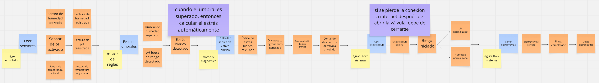

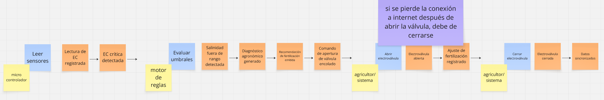

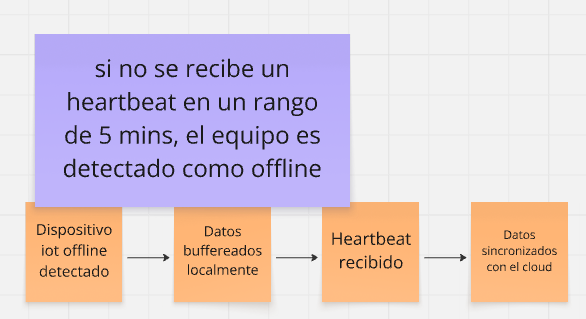

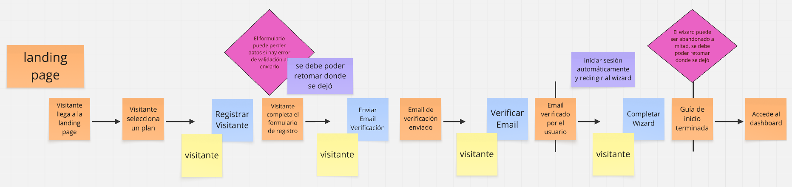

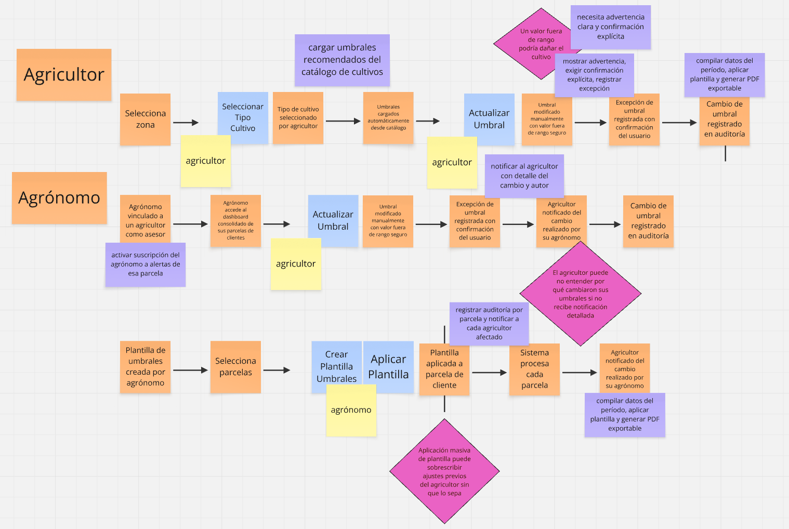

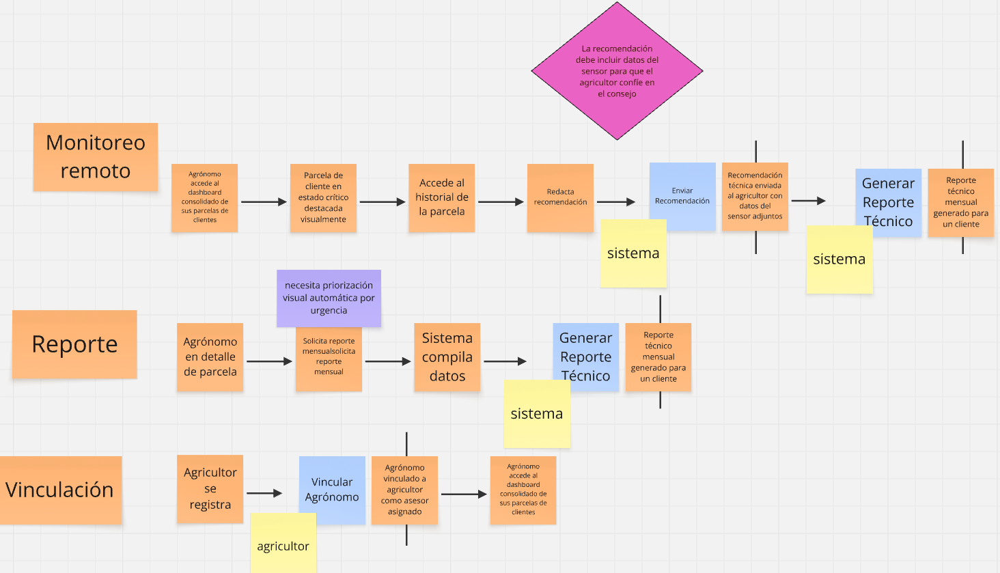

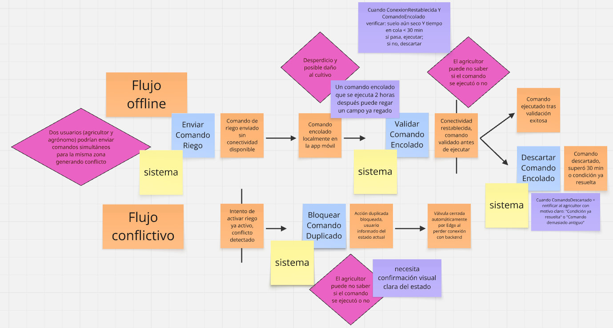

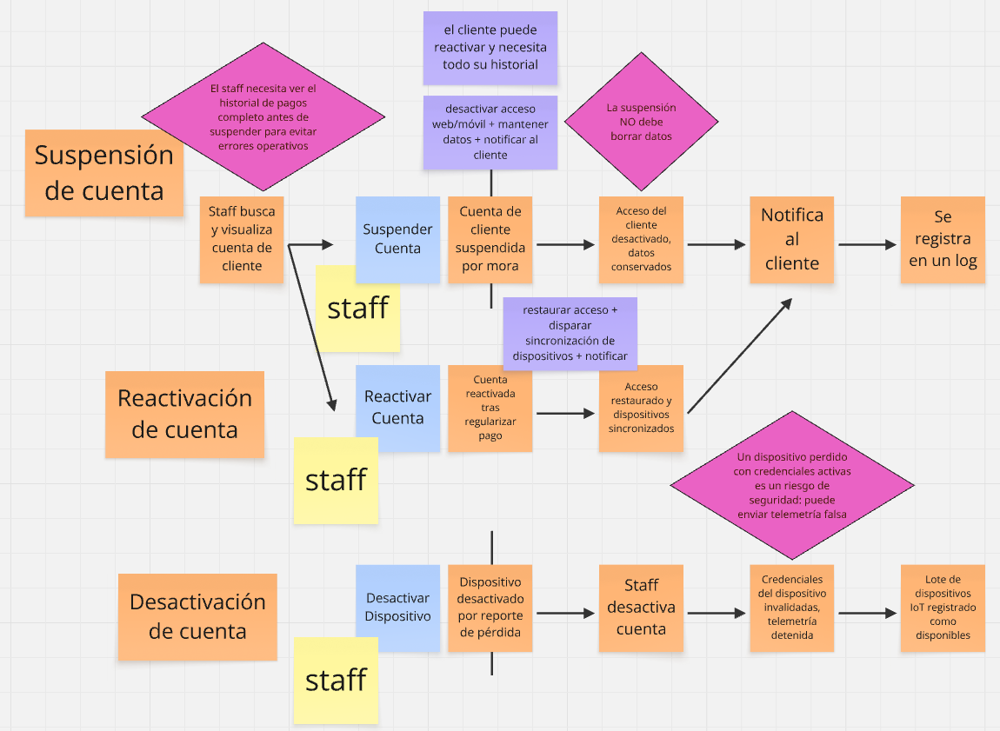

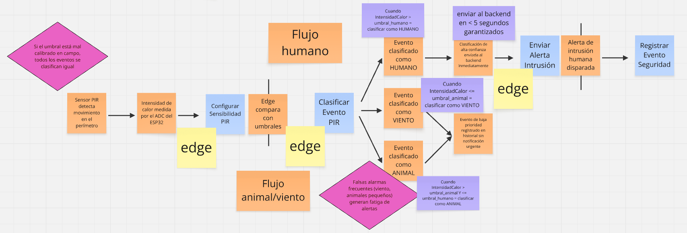

---

Con ello procedemos a discutir los Read Models, es decir, representaciones visuales que comprenden el flujo del dominio y sirven como proyecciones optimizadas para consultas.

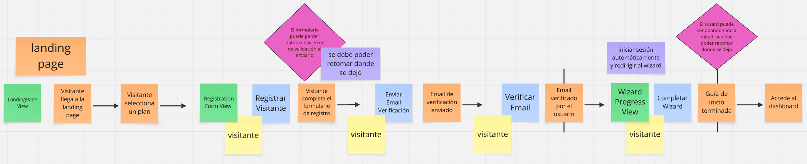

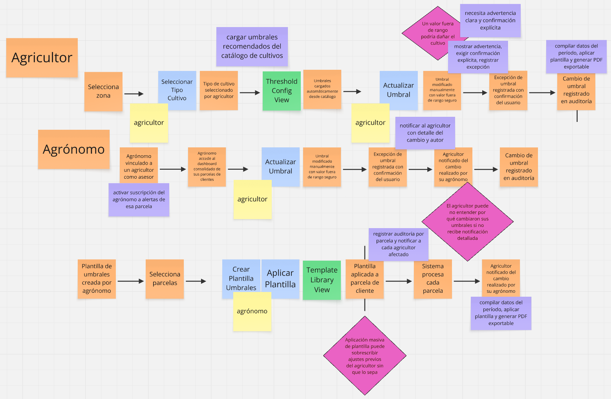

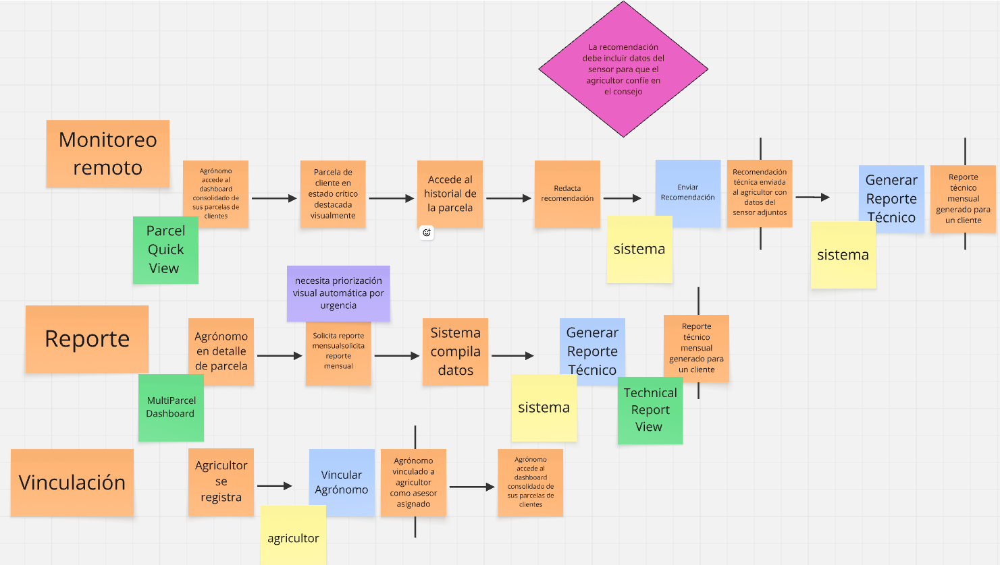

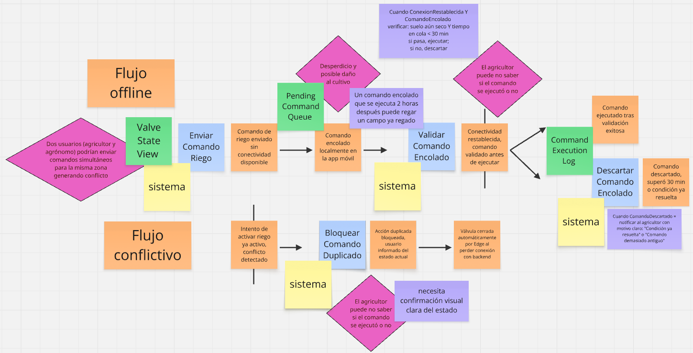

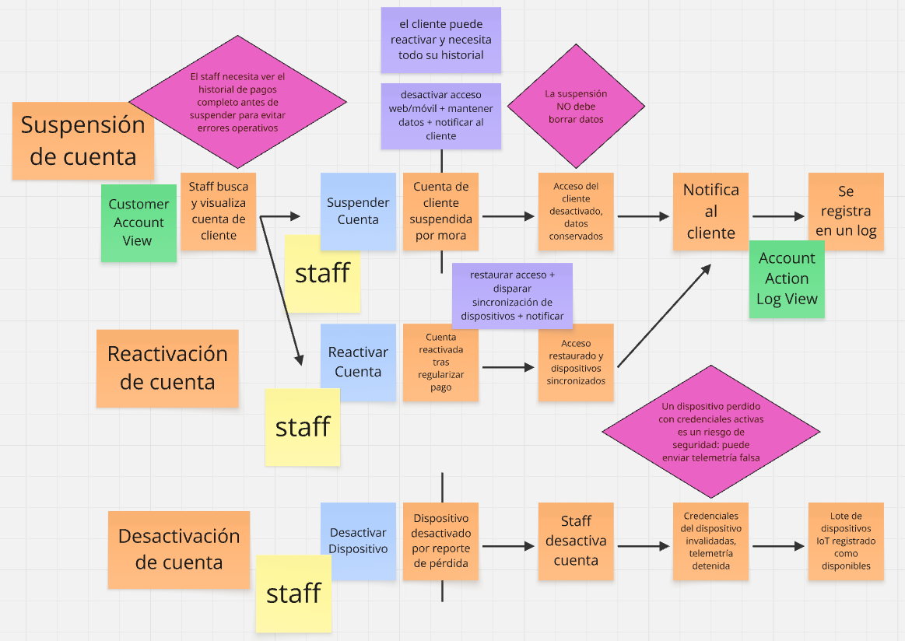

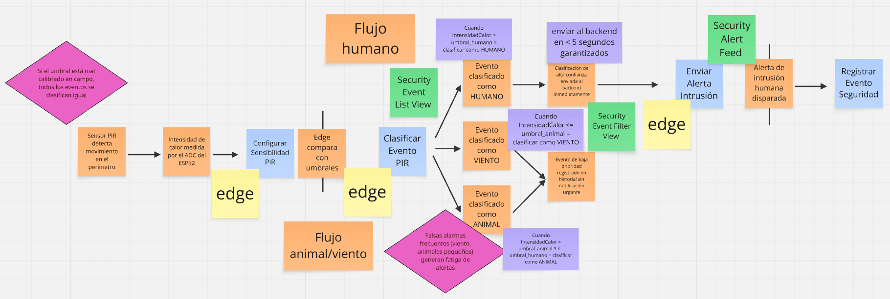

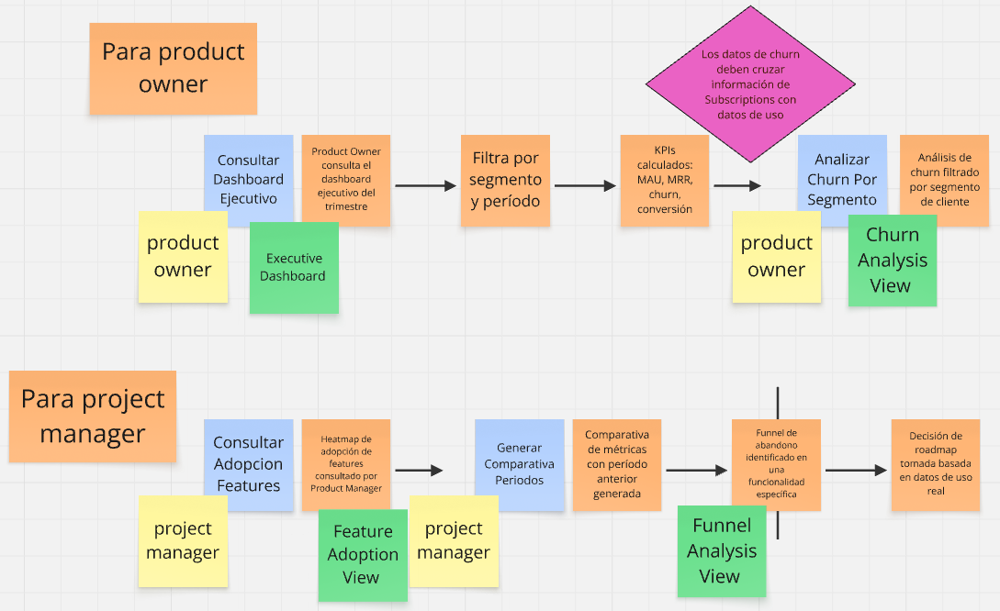

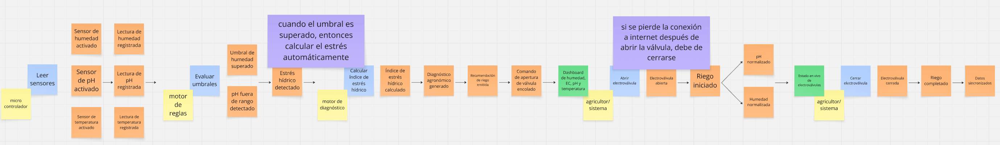

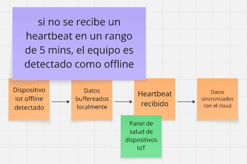

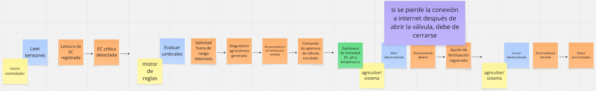

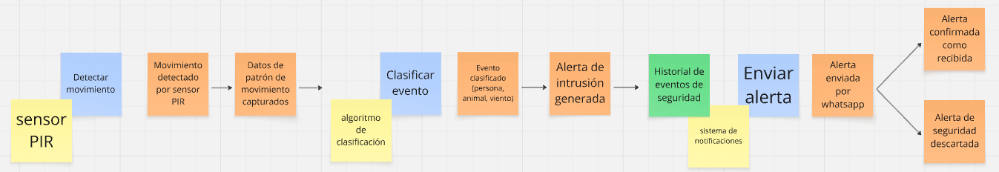

---

También empezamos a discutir el uso de Sistemas Externos, donde únicamente se encontró necesario en los siguientes servicios.

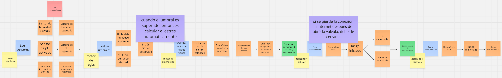

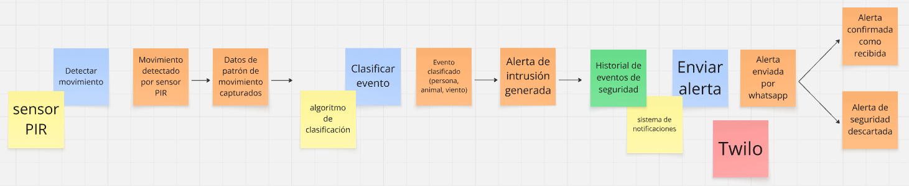

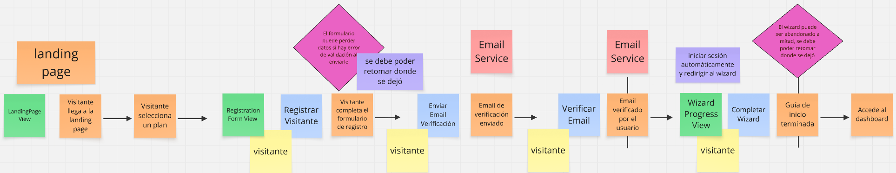

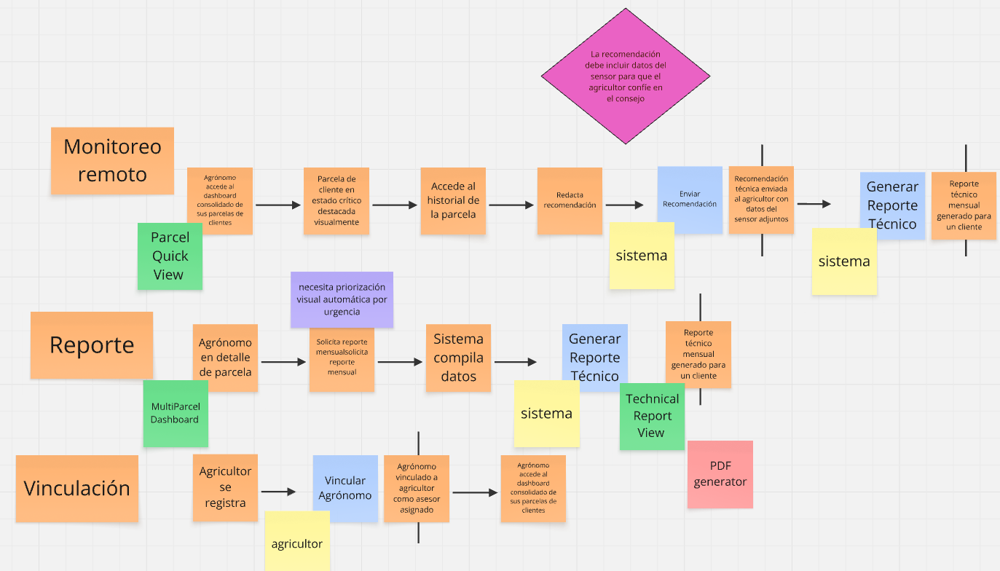

---

Después, se comenzó con la identificación de los Aggregates, para ello, tomamos criterios como granularidad, consistencia transaccional y estabilidad del ciclo de vida. Con esos criterios, se procedió a elegir los Aggregates principales.

---

Ya por último y después de un análisis y discusión grupal, los siguientes Bounded Contexts fueron elegidos, siguiendo algunas condiciones, como la separación de responsabilidades de negocio, cambios de lenguaje ubicuo y las fronteras marcadas por los pivotal points. Por ello, al final se eligió estos Bounded Contexts:

### 4.1.1.2 Domain Message Flows Modeling

En esta sección, el equipo explica y evidencia el proceso seguido para visualizar cómo deben colaborar los bounded contexts para resolver los casos que se presentan en el negocio para los usuarios del sistema. Para ello, aplicamos la técnica de visualización Domain Storytelling, la cual nos permite narrar las interacciones clave donde los mensajes y eventos cruzan las fronteras de los dominios.En esta sección, el equipo explica y evidencia el proceso seguido para visualizar cómo deben colaborar los bounded contexts para resolver los casos que se presentan en el negocio para los usuarios del sistema. Para ello, aplicamos la técnica de visualización Domain Storytelling, la cual nos permite narrar las interacciones clave donde los mensajes y eventos cruzan las fronteras de los dominios.

A continuación, se presentan los cuatro flujos de mensajería más relevantes para SATECHO, donde se evidencia la colaboración entre los contextos de Soil Monitor, Irrigation Control, Perimeter Security, Account Management y Agronomist Advisory.A continuación, se presentan los cuatro flujos de mensajería más relevantes para SATECHO, donde se evidencia la colaboración entre los contextos de Soil Monitor, Irrigation Control, Perimeter Security, Account Management y Agronomist Advisory.

#### 1. Riego Inteligente Automático

_Este flujo muestra cómo el contexto de Monitoreo de Suelo dispara acciones en el contexto de Control de Riego._

---

#### 2. Alerta de Seguridad Perimetral

_Este flujo muestra la detección de un intruso y la notificación al agricultor._

---

#### 3. Suspensión de Cuenta por Mora

_Este flujo muestra cómo el negocio afecta la operación técnica._

---

#### 4. Asesoría Remota del Agrónomo

_Este flujo muestra cómo el agrónomo consume datos para ayudar al cliente._

### 4.1.1.3 Bounded Context Canvases

De acuerdo con los bounded contexts definidos en puntos anteriores, se crearon sus respectivos Canvases. El equipo seleccionó cada contexto por orden de importancia estratégica para el negocio SATECHO, aplicando un proceso iterativo de refinamiento. A continuación, se detalla el diseño de cada uno:De acuerdo con los bounded contexts definidos en puntos anteriores, se crearon sus respectivos Canvases. El equipo seleccionó cada contexto por orden de importancia estratégica para el negocio SATECHO, aplicando un proceso iterativo de refinamiento. A continuación, se detalla el diseño de cada uno:De acuerdo con los bounded contexts definidos en puntos anteriores, se crearon sus respectivos Canvases. El equipo seleccionó cada contexto por orden de importancia estratégica para el negocio SATECHO, aplicando un proceso iterativo de refinamiento. A continuación, se detalla el diseño de cada uno:

#### 1. Soil Monitoring & Agronomic Diagnosis Context

_Contexto Core: Es la razón de ser del negocio. Si esto falla, no hay valor._

---

#### 2. Irrigation & Actuator Control Context

_Contexto Core: Ejecuta las decisiones físicas. Alto impacto en el campo._

---

#### 3. Perimeter Security & Classification Context

_Contexto Core: Diferenciador clave frente a la competencia._

---

#### 4. Account, Subscription & Billing Management Context

_Contexto Supporting: Esencial para el modelo de negocio SaaS._

---

#### 5. IoT Device & Edge Management Context

_Contexto Supporting/Generic: Mantiene el "cuerpo" del sistema._

### 4.1.2. Context Mapping

En esta sección, explicamos y evidenciamos nuestro proceso de elaboración de un conjunto de context maps, los cuales visualizan las relaciones estructurales entre los bounded contexts identificados en nuestro proyecto. Para ello, revisamos minuciosamente la información recolectada durante el Event Storming y la elaboración de los Bounded Context Canvases, utilizándola para producir y refinar diseños candidatos. Este análisis estructural nos permite entender y alinear claramente los contextos para alcanzar los objetivos del negocio de manera eficiente, minimizando el acoplamiento técnico y maximizando la autonomía de los equipos de desarrollo.

Durante el proceso de mapeo, el equipo aplicó un enfoque iterativo de cuestionamiento estratégico, planteando preguntas clave para evaluar alternativas de diseño antes de consolidar la arquitectura final:
- **¿Qué pasaría si movemos esta capability a otro bounded context?**
    
    Se evaluó mover la *clasificación de eventos perimetrales* al contexto de `Soil Monitoring`. Sin embargo, esto mezclaría el lenguaje ubicuo agronómico con el de seguridad física, rompiendo la cohesión del dominio. Se decidió mantenerlo en `Perimeter Security` para preservar la especialización y permitir evoluciones independientes de los algoritmos de detección térmica.

- **¿Qué pasaría si descomponemos esta capability y movemos uno de los sub-capabilities a otro bounded context?**

    Se analizó separar la *ingestión de telemetría* de la *gestión de firmware/OTA* dentro de `IoT Device Management`. Aunque viable a escala enterprise, para la fase MVP añadiría latencia y complejidad de red innecesaria. Se mantuvo unificado con interfaces internas claras, priorizando la simplicidad operativa en campo.

- **¿Qué pasaría si partimos el bounded context en múltiples bounded contexts?**

  Se consideró dividir `Account & Subscription Management` en `Identity` y `Billing`. Dado que la validación de suscripción y el control de acceso están fuertemente acoplados en el modelo de negocio SaaS (la mora detiene el acceso inmediatamente), partirlos generaría transacciones distribuidas complejas. Se mantuvo como un único contexto Supporting con responsabilidades bien delimitadas internamente.

- **¿Qué pasaría si tomamos esta capability de estos 3 contexts y lo usamos para formar un nuevo context?**

  Se revisó la duplicación de lógica de *notificaciones* (WhatsApp, SMS, Push) en Security, Soil y Account. En lugar de crear un contexto independiente prematuramente, se optó por un patrón de **Open Host Service** con un **Published Language** ligero, permitiendo que cada contexto core publique eventos estandarizados que un módulo de dispatching consume sin acoplarse a la lógica de origen.

- **¿Qué pasaría si duplicamos una funcionalidad para romper la dependencia?**

  Se evaluó duplicar el catálogo de *umbrales de cultivo* en `Irrigation Control` para evitar consultas a `Soil Monitoring`. Esto violaría el principio de única fuente de verdad. Se descartó la duplicación y se estableció un contrato síncrono/asíncrono claro, priorizando la consistencia agronómica sobre la optimización de red.

- **¿Qué pasaría si creamos un shared service para reducir la duplicación entre múltiples bounded contexts?**

  Se analizó un **Shared Kernel** para autenticación y gestión de roles entre todos los contextos. Dado que `Account Management` debe evolucionar según regulaciones de pagos y seguridad sin afectar la lógica core de riego o diagnóstico, se rechazó el Shared Kernel por el alto riesgo de acoplamiento y se adoptó un modelo **Conformist** con tokens estandarizados.

- **¿Qué pasaría si aislamos los core capabilities y movemos los otros a un context aparte?**

  Esta pregunta consolidó la arquitectura final. Se aislaron explícitamente los contextos Core (`Soil Monitoring`, `Irrigation Control`, `Perimeter Security`) de los Supporting/Generic (`Account Management`, `IoT Device Management`). Esto permite que el equipo priorice la innovación en la propuesta de valor diferencial, mientras los contextos de soporte pueden ser reemplazados o integrados con soluciones SaaS externas en el futuro sin impactar el núcleo del negocio.

- **¿Qué pasaría si partimos el bounded context en múltiples bounded contexts?**

  Se consideró dividir `Account & Subscription Management` en `Identity` y `Billing`. Dado que la validación de suscripción y el control de acceso están fuertemente acoplados en el modelo de negocio SaaS (la mora detiene el acceso inmediatamente), partirlos generaría transacciones distribuidas complejas. Se mantuvo como un único contexto Supporting con responsabilidades bien delimitadas internamente.

- **¿Qué pasaría si tomamos esta capability de estos 3 contexts y lo usamos para formar un nuevo context?**

  Se revisó la duplicación de lógica de *notificaciones* (WhatsApp, SMS, Push) en Security, Soil y Account. En lugar de crear un contexto independiente prematuramente, se optó por un patrón de **Open Host Service** con un **Published Language** ligero, permitiendo que cada contexto core publique eventos estandarizados que un módulo de dispatching consume sin acoplarse a la lógica de origen.

- **¿Qué pasaría si duplicamos una funcionalidad para romper la dependencia?**

  Se evaluó duplicar el catálogo de *umbrales de cultivo* en `Irrigation Control` para evitar consultas a `Soil Monitoring`. Esto violaría el principio de única fuente de verdad. Se descartó la duplicación y se estableció un contrato síncrono/asíncrono claro, priorizando la consistencia agronómica sobre la optimización de red.

- **¿Qué pasaría si creamos un shared service para reducir la duplicación entre múltiples bounded contexts?**

  Se analizó un **Shared Kernel** para autenticación y gestión de roles entre todos los contextos. Dado que `Account Management` debe evolucionar según regulaciones de pagos y seguridad sin afectar la lógica core de riego o diagnóstico, se rechazó el Shared Kernel por el alto riesgo de acoplamiento y se adoptó un modelo **Conformist** con tokens estandarizados.

- **¿Qué pasaría si aislamos los core capabilities y movemos los otros a un context aparte?**

  Esta pregunta consolidó la arquitectura final. Se aislaron explícitamente los contextos Core (`Soil Monitoring`, `Irrigation Control`, `Perimeter Security`) de los Supporting/Generic (`Account Management`, `IoT Device Management`). Esto permite que el equipo priorice la innovación en la propuesta de valor diferencial, mientras los contextos de soporte pueden ser reemplazados o integrados con soluciones SaaS externas en el futuro sin impactar el núcleo del negocio.

#### Discusión de alternativas y aproximación final

Tras evaluar las alternativas, el equipo concluyó que la mejor aproximación es un mapa de contextos descentralizado con contratos explícitos, donde los contextos Core actúan como proveedores de valor agronómico y los Supporting actúan como habilitadores operativos y comerciales. Se priorizaron los patrones Customer/Supplier, Open Host Service (OHS) con Published Language, y Conformist, evitando por completo el uso de Shared Kernels para garantizar la independencia de despliegue y evolución.

1. **IoT Device Management Context — Soil Monitoring Context**

   *Relación clave:* **Customer/Supplier** con **Published Language**.

   `IoT Device Management` actúa como *Upstream* (Supplier), normalizando datos crudos de hardware y publicándolos mediante un lenguaje estandarizado de telemetría. `Soil Monitoring` es el *Downstream* (Customer), consumiendo estos datos sin conocer los detalles de comunicación MQTT o protocolos del ESP32. Esta relación desacopla la evolución del firmware de la lógica agronómica.
    
    

    

---

2. **Soil Monitoring Context — Irrigation & Actuator Control Context**

   *Relación clave:* **Customer/Supplier** con **Anti-Corruption Layer (ACL)**.

   `Soil Monitoring` es el *Upstream*, generando diagnósticos y recomendaciones de riego. `Irrigation Control` es el *Downstream*, responsable de la ejecución física. Dado que el contexto de riego debe protegerse de cambios frecuentes en los algoritmos de diagnóstico, se implementa un ACL que traduce las recomendaciones agronómicas a comandos de actuador válidos y seguros, garantizando que fallos en el análisis no deriven en acciones físicas peligrosas.

    

    

---

3. **Account & Subscription Management Context — Core Contexts (Soil, Irrigation, Security)**

   *Relación clave:* **Conformist** con **Open Host Service**.

   `Account Management` define las reglas de suscripción, acceso y facturación. Los contextos Core actúan como **Conformist**, adaptándose a las APIs y políticas expuestas por Account para validar permisos y estado de cuenta. Account expone un **Open Host Service** estable para consultas de suscripción, permitiendo que los contextos Core funcionen incluso si Account migra a un proveedor de billing externo en el futuro.

    

    

---

4. **Perimeter Security Context — Notification Dispatch**

   *Relación clave:* **Open Host Service** con **Published Language**.

   `Perimeter Security` publica eventos clasificados (`IntrusionDetected`, `FalseAlarmLogged`) mediante un contrato claro. El módulo de notificaciones se suscribe a estos eventos sin conocer la lógica de clasificación térmica. Esto permite escalar canales de alerta (WhatsApp, SMS, Email) sin modificar el código de seguridad.

    

    

---

5. **IoT Device Management Context ↔ Account & Subscription Management Context**

   *Relación clave:* **Customer/Supplier**.

   `Account Management` (Upstream) emite comandos de suspensión/reactivación por mora o reporte de pérdida. `IoT Device Management` (Downstream) debe conformarse a estas órdenes para invalidar credenciales o detener telemetría, asegurando la integridad comercial y de seguridad del servicio.

    

    

    

### 4.1.3. Software Architecture

#### 4.1.3.1. Software Architecture System Landscape Diagram

Visión panorámica completa del ecosistema **SATECHO**: los tres actores (agricultor, agrónomo, staff), los nueve contenedores internos de la plataforma y los cuatro sistemas externos integrados (Stripe, Twilio, FCM, SendGrid). Muestra quién usa el sistema, qué lo compone y con qué servicios de terceros se comunica.

#### 4.1.3.2. Software Architecture Context Level Diagrams

SATECHO AgroSafe como caja negra dentro de su entorno operativo. Representa cómo el agricultor monitorea su cultivo, cómo el agrónomo configura umbrales y genera reportes, y cómo el staff gestiona cuentas. Enfatiza las integraciones con sistemas externos sin detalles de implementación interna.

#### 4.1.3.2. Software Architecture Container Level Diagrams

Desglosa los nueve contenedores internos: Landing Page, Web App Vue.js, Mobile App Capacitor, Backend API con Spring Boot, Servicio de Análisis Python, Firestore, Firebase Auth, ESP32 y Electroválvula. Diagrama técnico de referencia que muestra la arquitectura interna y las dependencias entre componentes.

#### 4.1.3.3. Software Architecture Deployment Diagrams

Distribución de la solución sobre infraestructura real: nodos ESP32 alimentados por panel solar en campo, Google Cloud Platform (Cloud Run + Firebase), Firebase Hosting con CDN global, y servicios externos integrados mediante APIs REST. Referencia para planificación de despliegue y resiliencia ante conectividad rural intermitente.

## 4.2. Strategic-Level Domain-Driven Design

### 4.2.1. Bounded Context: Onboarding

Este bounded context gestiona la experiencia del visitante desde que llega a la landing page hasta que completa el wizard de inicio y accede al dashboard. Su responsabilidad es guiar al usuario por el proceso de selección de plan, registro y configuración inicial, garantizando que si el wizard es abandonado a mitad pueda retomarse desde donde se dejó.

#### Diccionario de Clases

### 4.2.1.1. Domain Layer

### 4.2.1.2. Interface Layer

### 4.2.1.3. Application Layer

### 4.2.1.4. Infrastructure Layer

### 4.2.1.5. Bounded Context Software Architecture Component Level Diagrams

### 4.2.1.6 Bounded Context Software Architecture Code Level Diagrams

### 4.2.1.6.1 Bounded Context Domain Layer Class Diagrams

### 4.2.1.6.2 Bounded Context Database Design Diagram

---

### 4.2.2. Bounded Context: Identity & Access Management

Gestiona el registro de usuarios (agricultores y agrónomos), autenticación, verificación de email, restablecimiento de contraseña, y los flujos de suspensión, reactivación y desactivación de cuentas gestionados por el staff.
#### Diccionario de Clases

### 4.2.2.1. Domain Layer

### 4.2.2.2. Interface Layer

### 4.2.2.3. Application Layer

### 4.2.2.4. Infrastructure Layer

### 4.2.2.5. Bounded Context Software Architecture Component Level Diagrams

### 4.2.2.6 Bounded Context Software Architecture Code Level Diagrams

### 4.2.2.6.1 Bounded Context Domain Layer Class Diagrams

### 4.2.2.6.2 Bounded Context Database Design Diagram

---

### 4.2.3. Bounded Context: Subscriptions & Payments

Gestiona los planes de suscripción, el procesamiento de pagos a través de un proveedor externo y los flujos de suspensión, reactivación y cancelación de cuentas por mora.

#### Diccionario de Clases

### 4.2.3.1. Domain Layer

### 4.2.3.2. Interface Layer

### 4.2.3.3. Application Layer

### 4.2.3.4. Infrastructure Layer

### 4.2.3.5. Bounded Context Software Architecture Component Level Diagrams

### 4.2.3.6 Bounded Context Software Architecture Code Level Diagrams

### 4.2.3.6.1 Bounded Context Domain Layer Class Diagrams

### 4.2.3.6.2 Bounded Context Database Design Diagram

---

### 4.2.4. Bounded Context: Communication

Este bounded context gestiona el despacho de alertas y notificaciones hacia los usuarios finales. Según tu Event Storming, los componentes clave son **Notification Dispatch**, **Enviar Alerta** y la integración con **Twilio** como sistema externo.

#### Diccionario de Clases

### 4.2.4.1. Domain Layer

### 4.2.4.2. Interface Layer

### 4.2.4.3. Application Layer

### 4.2.4.4. Infrastructure Layer

### 4.2.4.5. Bounded Context Software Architecture Component Level Diagrams

### 4.2.4.6 Bounded Context Software Architecture Code Level Diagrams

### 4.2.4.6.1 Bounded Context Domain Layer Class Diagrams

### 4.2.4.6.2 Bounded Context Database Design Diagram  

---

### 4.2.5. Bounded Context: IoT Device Management

Este bounded context gestiona el ciclo de vida completo de los dispositivos IoT físicos desplegados en campo. Según tu Event Storming, los agregados principales son **IoT Device** y el mecanismo de detección offline por heartbeat: si no se recibe un heartbeat en un rango de 5 minutos, el equipo es detectado como offline.

#### Diccionario de Clases

### 4.2.5.1. Domain Layer

### 4.2.5.2. Interface Layer

### 4.2.5.3. Application Layer

### 4.2.5.4. Infrastructure Layer

### 4.2.5.5. Bounded Context Software Architecture Component Level Diagrams

### 4.2.5.6 Bounded Context Software Architecture Code Level Diagrams

### 4.2.5.6.1 Bounded Context Domain Layer Class Diagrams

### 4.2.5.6.2 Bounded Context Database Design Diagram  

---

### 4.2.6. Bounded Context: Soil Monitoring & Diagnosis

Este bounded context gestiona la experiencia del visitante desde que llega a la landing page hasta que completa el wizard de inicio y accede al dashboard. Su responsabilidad es guiar al usuario por el proceso de selección de plan, registro y configuración inicial, garantizando que si el wizard es abandonado a mitad pueda retomarse desde donde se dejó.

#### Diccionario de Clases

### 4.2.6.1. Domain Layer

### 4.2.6.2. Interface Layer

### 4.2.6.3. Application Layer

### 4.2.6.4. Infrastructure Layer

### 4.2.6.5. Bounded Context Software Architecture Component Level Diagrams

### 4.2.6.6 Bounded Context Software Architecture Code Level Diagrams

### 4.2.6.6.1 Bounded Context Domain Layer Class Diagrams

### 4.2.5.6.2 Bounded Context Database Design Diagram

---

### 4.2.7. Bounded Context: Irrigation & Actuator Control

Este bounded context gestiona el control físico de las electroválvulas de riego. Según tu Event Storming, los agregados principales son **Valve State**, **Irrigation Command** y **Offline Command Queue**, con tres flujos claramente diferenciados: **Flujo online**, **Flujo offline** y **Flujo conflictivo**.

#### Diccionario de Clases

### 4.2.7.1. Domain Layer

### 4.2.7.2. Interface Layer

### 4.2.7.3. Application Layer

### 4.2.7.4. Infrastructure Layer

### 4.2.7.5. Bounded Context Software Architecture Component Level Diagrams

### 4.2.7.6 Bounded Context Software Architecture Code Level Diagrams

### 4.2.7.6.1 Bounded Context Domain Layer Class Diagrams

### 4.2.7.6.2 Bounded Context Database Design Diagram  

---

### 4.2.8. Bounded Context: Perimeter Security

Este bounded context gestiona la detección y clasificación de eventos perimetrales mediante el sensor PIR térmico del ESP32. Según tu Event Storming, los agregados principales son **PIR Event** y **Security Alert**, con tres flujos de clasificación claramente diferenciados: **Flujo humano**, **Flujo animal/viento** y la integración con el **Edge** para el procesamiento local de clasificación.

#### Diccionario de Clases

### 4.2.8.1. Domain Layer

### 4.2.8.2. Interface Layer

### 4.2.8.3. Application Layer

### 4.2.8.4. Infrastructure Layer

### 4.2.8.5. Bounded Context Software Architecture Component Level Diagrams

### 4.2.8.6 Bounded Context Software Architecture Code Level Diagrams

### 4.2.8.6.1 Bounded Context Domain Layer Class Diagrams

### 4.2.8.6.2 Bounded Context Database Design Diagram

---

### 4.2.9. Bounded Context: Business Intelligence

Este bounded context provee analítica estratégica para el Product Owner y el Project Manager. Según tu Event Storming, los agregados principales son **Business Metrics**, **Churn Record** y **Feature Usage Metrics**, con el pain point crítico de que los datos de churn deben cruzar información de Subscriptions con datos de uso.

#### Diccionario de Clases

### 4.2.9.1. Domain Layer

### 4.2.9.2. Interface Layer

### 4.2.9.3. Application Layer

### 4.2.9.4. Infrastructure Layer

### 4.2.9.5. Bounded Context Software Architecture Component Level Diagrams

### 4.2.9.6 Bounded Context Software Architecture Code Level Diagrams

### 4.2.9.6.1 Bounded Context Domain Layer Class Diagrams

### 4.2.9.6.2 Bounded Context Database Design Diagram

---

### 4.2.10. Bounded Context: Agronomist Advisory

Este bounded context gestiona las capacidades profesionales del ingeniero agrónomo. Según tu Event Storming, los agregados principales son **Agronomist Advisory** con sus flujos de **Monitoreo remoto**, **Reporte** y **Vinculación**, complementados por el aggregate **Technical Report** y la integración con el **PDF generator** como sistema externo.

#### Diccionario de Clases

### 4.2.10.1. Domain Layer

### 4.2.10.2. Interface Layer

### 4.2.10.3. Application Layer

### 4.2.10.4. Infrastructure Layer

### 4.2.10.5. Bounded Context Software Architecture Component Level Diagrams

### 4.2.10.6 Bounded Context Software Architecture Code Level Diagrams

### 4.2.10.6.1 Bounded Context Domain Layer Class Diagrams

### 4.2.10.6.2 Bounded Context Database Design Diagram

