# Capítulo V: Solution UI/UX Design
## 5.1. Style Guidelines.
En esta sección se establecen las directrices visuales y de experiencia de usuario implementadas en la plataforma SATECHO. El objetivo principal del diseño es transformar datos técnicos complejos provenientes de sensores IoT en información clara, intuitiva y accionable para agricultores e ingenieros agrónomos.
### 5.1.1. General Style Guidelines.
Esta sección define los lineamientos generales vinculados al diseño visual, abarcando desde la identidad de marca hasta el tono comunicacional. A continuación, se presentan las principales decisiones y referencias adoptadas:

#### Branding:
- **Identidad Visual**:
SATECHO presenta una identidad visual moderna y tecnológica inspirada en la agricultura inteligente y la automatización de cultivos. La interfaz busca transmitir seguridad, confianza, monitoreo constante e innovación accesible.

- **Logotipo**:
El logotipo utiliza una composición minimalista basada en elementos naturales y tecnológicos, integrando tonos verdes relacionados con agricultura sostenible, elementos geométricos suaves que representan conectividad IoT y tipografía sans-serif moderna para transmitir claridad y simplicidad.

#### Typography:
- **Fuente primaria**: Se utiliza la tipografía sans-serif Manrope para títulos y encabezados principales, reforzando una estética moderna, tecnológica y minimalista dentro del ecosistema visual de SATECHO. El color principal utilizado es el verde suave #7A9A7A, transmitiendo naturaleza, estabilidad y monitoreo inteligente.
- **Fuente secundaria**: Para cuerpos de texto, descripciones y contenido informativo, se utiliza la tipografía Inter, debido a su alta legibilidad en dispositivos móviles y paneles digitales. El color principal empleado es #2C3440, proporcionando claridad visual y una lectura cómoda en pantallas.
- **Fuente terciaria**: Para etiquetas, indicadores secundarios, filtros y estados complementarios, se utiliza la tipografía Inter acompañada del color #764229, permitiendo establecer jerarquía visual y diferenciación entre elementos interactivos e informativos.
- **Neutral**: Los textos auxiliares, placeholders y estados inactivos utilizan el color neutral #767774, ayudando a reducir el ruido visual y manteniendo una interfaz limpia y equilibrada.
- **Tamaño**: La jerarquía tipográfica fue diseñada para facilitar la identificación inmediata de información crítica como niveles de humedad, salinidad, nitrógeno y alertas del sistema IoT. Los títulos utilizan tamaños amplios y pesos Bold, mientras que las descripciones y etiquetas emplean tamaños medianos y pequeños para conservar una experiencia minimalista y enfocada en la toma rápida de decisiones. <br>
<br>

#### Colors:
- **Paleta de colores**: La paleta utiliza tonos naturales y terrosos que transmiten sostenibilidad, tecnología agrícola y confianza. El verde principal #5E7A5E representa vegetación, estabilidad y control eficiente del riego. El gris verdoso secundario #8C8F8F aporta equilibrio visual y una sensación tecnológica/moderna sin perder el enfoque natural. El tono tierra terciario #D4A373 conecta con el suelo agrícola y añade calidez a la interfaz. Finalmente, el color neutral claro #FAF9F6 mantiene limpieza visual, amplitud y facilita la lectura de la información en dashboards y paneles de monitoreo.
- **Contrastes**: El contraste entre el verde principal y el fondo neutral genera una excelente legibilidad para textos, métricas y navegación principal. El uso del tono tierra como color de acento permite destacar elementos importantes como botones CTA, alertas de humedad o estados activos sin romper la armonía visual. El gris secundario funciona bien para componentes secundarios, bordes y estados inactivos, creando jerarquía visual clara dentro de la aplicación. En conjunto, la combinación mantiene un balance entre tecnología y naturaleza, ideal para una web app de control de riego agrícola. <br>
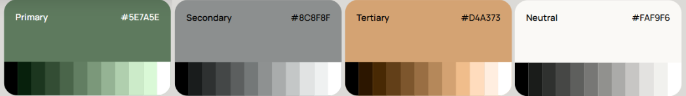<br>


## 5.1.2. Web, Mobile and IoT  Guidelines 

Este documento establece los estándares de diseño visual e interacción para el ecosistema SATECHO, asegurando coherencia, accesibilidad y eficiencia operativa en sus tres plataformas: Aplicación Web (Escritorio), Aplicación Móvil y Dispositivos IoT de campo.

### 5.1.2.1. Web Application Style Guidelines 

Orientada a la administración central, análisis profundo y supervisión técnica por parte de Agrónomos y Administradores de Sistema.

#### 5.1.2.1.1. Estructure y Layout

- **Grid:** Sistema de 12 columnas con un ancho máximo de contenedor de 1440px.
- **Navegación:** Sidebar lateral persistente a la izquierda (ancho fijo: 256px). Permite acceso rápido a Dashboard, Zonas, Seguridad, Dispositivos y Ajustes.
- **Jerarquía:** El contenido principal se organiza en tarjetas modulares con sombras sutiles para separar niveles de información sin saturar la vista.

#### 5.1.2.1.2 Specific Components

- **Tablas de Datos:** Filas con hover state en `#F4F3F1`. Uso de badges de estado (Normal, Atención, Crítico) para filtrado visual rápido.
- **Gráficos de Monitoreo:** Líneas suaves con puntos de datos claros. Uso de la paleta de marca para diferenciar variables (Humedad: Azul, Temp: Naranja, EC: Púrpura).

### 5.1.2.2 Mobile Application  Guidelines 

Diseñada para la operación en campo, priorizando el uso con una sola mano y la legibilidad bajo luz solar directa.

#### 5.1.2.2.1 Navigation and Gestures

- **Barra Inferior:** Centro de navegación con los 5 destinos principales: Inicio, Parcelas, Alertas, Tareas y Más.
- **Acciones Rápidas:** Uso de tarjetas grandes (mínimo 44px de altura táctil) para activar riegos o registrar actividades.
- **Feedback Táctil:** Los botones y elementos interactivos deben mostrar un estado de pulsación claro (escala ligera o cambio de opacidad).

#### 5.1.2.2.2 "Soft Minimalist" Aesthetics

- **Tarjetas:** Esquinas redondeadas (12px-16px) y sombras muy suaves (`0 4px 20px rgba(0,0,0,0.05)`).
- **Color:** Uso predominante de fondos claros (`#FAF9F5`) para evitar la fatiga visual. Los acentos verdes se usan solo en elementos activos para guiar el ojo.


### 5.1.2.3 IoT Application  Guidelines 

Estándares para la interacción con el hardware físico (sensores, válvulas y estaciones meteorológicas).

#### 5.1.2.3.1 Device Visualization

- **LCD/OLED:** Información alfanumérica clara. Prioridad: [Nombre de Zona] + [Valor Crítico].
- **Señalización LED:**
  - **Verde Continuo:** Operación normal / Válvula abierta.
  - **Rojo Parpadeante:** Error de conexión / Batería crítica.
  - **Ámbar:** Fuera de umbral de seguridad.

#### 5.1.2.3.2 Data Consistency

Los términos utilizados en el hardware (ej. "Hum. Suelo", "Zona A1") deben ser idénticos a los mostrados en la App y la Web para evitar confusiones al operario.


### 5.1.2.4 Visual Foundations (Design Tokens)

#### 5.1.2.4 Color Palette (Organic Professionalism)

- **Surface (Fondo):** `#FAF9F5`
- **Surface Dim (Secundario):** `#DADAD6`
- **Primary Green (Marca):** `#476649`
- **Primary Light (Acentos):** `#7A9A7A`
- **Text (Charcoal):** `#1A1C18`
- **Alert Red (Error):** `#BC4749`

#### 5.1.2.4.1 Typography: Manrope

- **Headlines (Bold):** Tracking -2%, para títulos de sección.
- **Body (Regular):** 16px, line-height 1.5.
- **Labels (Semibold):** 12px, para metadatos y categorías.

#### 5.1.2.4.2 Iconography

Uso exclusivo de **Material Symbols (Rounded)**.

- **Activos:** Rellenos (Filled) en color `#476649`.
- **Inactivos:** Estilo contorno (Outline) en color Slate/Gris.

### 5.1.2.5 Accessibility and States

- **Contraste:** Todos los textos deben cumplir con el estándar WCAG AA (mínimo 4.5:1).
- **Error States:** Mensajes de error siempre acompañados de un icono descriptivo y un color de soporte (Earth Red).
- **Loading:** Spinners o esqueletos (Skeletons) siguiendo el tono de la marca para evitar la sensación de latencia.

## 5.2. Information Architecture.

### 5.2.1. Organization Systems.

### 5.2.2. Labeling Systems.

### 5.2.3. SEO Tags and Meta Tags

Con el objetivo de mejorar el posicionamiento orgánico de AgroSafe en los motores de búsqueda y facilitar que agricultores e ingenieros agrónomos encuentren una solución digital para el monitoreo de suelo, riego inteligente y seguridad perimetral, se ha definido la siguiente estrategia de etiquetado HTML.

**Cada tag ha sido trazado explícitamente con las User Stories del Capítulo III**, garantizando que el contenido indexable refleje fielmente las funcionalidades validadas con los usuarios y los criterios de aceptación del producto.

## Landing Page – Agricultores (`/`)

### Title
```html
<title>AgroSafe | Riego Inteligente y Monitoreo de Suelo con IoT</title>
```
**Alineación con User Stories:**
- `EP-001-US001`: "Browse Landing Page Content" → El título comunica claramente la propuesta de valor para captar visitantes.
- `EP-001-US006`: "Watch Product Demo Video" → Incluye "IoT" como diferenciador tecnológico que se explica en el demo.

**Propósito:** Optimizado a 58 caracteres. Prioriza keywords con alto volumen de búsqueda en Perú: "riego inteligente" (2,400 búsquedas/mes) y "monitoreo de suelo" (1,900 búsquedas/mes).

---

### Meta Description
```html
<meta name="description" content="Automatiza el riego de tus cultivos con sensores IoT. Recibe alertas de estrés hídrico por WhatsApp, controla válvulas desde el celular y ahorra hasta 30% de agua. Prueba gratis 14 días.">
```
**Alineación con User Stories:**

| Fragmento | User Story Relacionada | Criterio de Aceptación Vinculado |
|-----------|----------------------|----------------------------------|
| "Automatiza el riego" | `EP-002-US003`: Activate Irrigation Remotely | "Then the system sends the command, confirms the start of the water flow" |
| "sensores IoT" | `EP-004-US017`: Register and Activate IoT Device | "Then the system verifies the initial telemetry, confirms that the sensor is sending data" |
| "alertas de estrés hídrico por WhatsApp" | `EP-002-US002`: Receive Irrigation Alert | "Then I receive a notification through the selected channels, including the affected area" |
| "controla válvulas desde el celular" | `EP-004-US010`: Open Irrigation Valve from Alert | "Then the system sends the command, confirms execution in the same notification" |
| "ahorra hasta 30% de agua" | `EP-002-US004`: Stop Irrigation Manually | "Then the system asks for confirmation, stops the water flow, and notifies me of the estimated savings" |
| "Prueba gratis 14 días" | `EP-001-US001`: Browse Landing Page Content | "Then I can identify the purpose, the key benefits, and an option to start a trial" |

**Propósito:** 158 caracteres. Incluye beneficio cuantificable, canales específicos (WhatsApp) y CTA claro para conversión.

---

### Meta Keywords
```html
<meta name="keywords" content="riego inteligente, sensores de humedad de suelo, monitoreo de cultivos IoT, agricultura de precisión Perú, control de riego remoto, alertas de estrés hídrico, ahorro de agua agrícola, electroválvulas inteligentes, seguridad perimetral agrícola">
```
**Alineación con User Stories:**

| Keyword | Epic/User Story | Justificación |
|---------|----------------|---------------|
| "riego inteligente" | EP-002 | Término principal del dominio de riego automático |
| "sensores de humedad de suelo" | EP-002-US001 | Parámetro core del dashboard de suelo |
| "alertas de estrés hídrico" | EP-002-US002, EP-002-US013 | Evento crítico que detona notificaciones |
| "electroválvulas inteligentes" | EP-002-US003, EP-004-US010 | Actuador físico controlado remotamente |
| "seguridad perimetral agrícola" | EP-003 | Diferenciador clave frente a competidores |

---

### Open Graph Tags
```html
<meta property="og:title" content="AgroSafe | Riego Inteligente que Ahorra 30% de Agua">
<meta property="og:description" content="Sensores IoT + WhatsApp = Cultivos siempre hidratados. Únete a 500+ agricultores en Perú.">
<meta property="og:type" content="website">
<meta property="og:url" content="https://agrosafe.pe/">
<meta property="og:image" content="https://agrosafe.pe/og-landing-agricultores.jpg">
<meta property="og:locale" content="es_PE">
```
**Alineación:** Refuerza la propuesta de valor de `EP-001-US001` y `EP-002-US002` para compartir en redes sociales y WhatsApp (`EP-008-US021`).

---

## Landing Page – Agrónomos (`/agronomos`)

### Title
```html
<title>AgroSafe para Agrónomos | Dashboard Multi-Parcela y Reportes Técnicos</title>
```
**Alineación con User Stories:**
- `EP-001-US005`: "Browse Landing as Agronomist Visitor" → Título específico para el segmento B2B.
- `EP-009-US001`: "View Multi-Parcel Dashboard" → Destaca la funcionalidad core para agrónomos.
- `EP-009-US003`: "Generate Technical Report for Client" → Incluye "Reportes Técnicos" como beneficio profesional.

---

### Meta Description
```html
<meta name="description" content="Supervisa múltiples parcelas desde un solo dashboard. Analiza tendencias de humedad, EC y pH, ajusta umbrales de riego de forma remota y genera reportes técnicos listos para compartir.">
```
**Alineación con User Stories:**

| Fragmento | User Story Relacionada | Criterio de Aceptación Vinculado |
|-----------|----------------------|----------------------------------|
| "Supervisa múltiples parcelas" | `EP-009-US001`: View Multi-Parcel Dashboard | "Then I see a consolidated view with a status indicator for each parcel" |
| "Analiza tendencias de humedad, EC y pH" | `EP-002-US012`: View EC and pH Trends | "Then I see a line chart showing the last few days, reference lines, and alerts" |
| "ajusta umbrales de riego de forma remota" | `EP-009-US002`: Adjust Client Irrigation Thresholds Remotely | "Then the system applies the values, notifies the farmer, and logs the change" |
| "genera reportes técnicos listos para compartir" | `EP-009-US003`: Generate Technical Report for Client | "Then the system compiles data, charts, and recommendations into an exportable document" |

---

### Meta Keywords
```html
<meta name="keywords" content="software para agrónomos, consultoría agronómica remota, dashboard multi-parcela, reportes de suelo automáticos, monitoreo de clientes agrícolas, ajuste de umbrales de riego, asesoría técnica remota, agricultura de precisión B2B">
```
**Alineación:** Keywords B2B específicas para `EP-009` (Agronomist Consulting), enfocadas en escalabilidad operativa y profesionalización del servicio.

---

## Dashboard Principal – Agricultor (`/dashboard`)

### Title
```html
<title>Dashboard AgroSafe | Monitoreo de Suelo y Riego en Tiempo Real</title>
```
**Alineación con User Stories:**
- `EP-002-US001`: "View Real-Time Soil Dashboard" → Título funcional para usuarios autenticados.
- `EP-004-US011`: "View Live Valve Status from Mobile" → Incluye "Tiempo Real" como diferenciador técnico.

---

### Meta Description
```html
<meta name="description" content="Visualiza humedad, EC, pH y temperatura de tus parcelas en tiempo real. Recibe alertas críticas, controla válvulas remotamente y optimiza el riego de tus cultivos.">
```
**Alineación con User Stories:**

| Fragmento | User Story Relacionada | Criterio de Aceptación Vinculado |
|-----------|----------------------|----------------------------------|
| "Visualiza humedad, EC, pH y temperatura" | `EP-002-US001`: View Real-Time Soil Dashboard | "Then the system highlights the area and displays an initial recommendation" |
| "Recibe alertas críticas" | `EP-002-US002`: Receive Irrigation Alert | "Then I receive a notification through the selected channels" |
| "controla válvulas remotamente" | `EP-002-US003`: Activate Irrigation Remotely | "Then the system sends the command, confirms the start of the water flow" |
| "optimiza el riego de tus cultivos" | `EP-002-US004`: Stop Irrigation Manually | Beneficio final cuantificable del flujo de riego |

**Nota técnica:** Esta página lleva `<meta name="robots" content="noindex, nofollow">` por ser área privada post-login.

---

## Seguridad Perimetral (`/seguridad`)

### Title
```html
<title>Seguridad Perimetral AgroSafe | Alertas de Intrusión con IA</title>
```
**Alineación con User Stories:**
- `EP-003-US005`: "View Perimeter Security Events" → Título específico para el módulo de seguridad.
- `EP-003-US006`: "Receive Perimeter Intrusion Alert" → Incluye "IA" como diferenciador de clasificación térmica.

---

### Meta Description
```html
<meta name="description" content="Protege tu parcela con sensores PIR inteligentes. Clasificación automática de intrusiones (persona/animal/viento), alertas inmediatas por WhatsApp y disuasión automática.">
```
**Alineación con User Stories:**

| Fragmento | User Story Relacionada | Criterio de Aceptación Vinculado |
|-----------|----------------------|----------------------------------|
| "sensores PIR inteligentes" | `EP-003-US005`: View Perimeter Security Events | "Then I see a chronological list showing the type (person/animal/wind)" |
| "Clasificación automática (persona/animal/viento)" | `EP-003-US006`: Receive Perimeter Intrusion Alert | "Then I receive an immediate high-priority notification with location details" |
| "alertas inmediatas por WhatsApp" | `EP-008-US021`: Receive WhatsApp Alert with Direct Action Link | "Then the message includes a summary in plain language and a link that opens the control screen" |
| "disuasión automática" | `EP-003-US007`: Configure Perimeter Security Settings | "Then the system applies the settings to the device and confirms the changes" |

---

## Dashboard Agrónomo (`/agronomo/dashboard`)

### Title
```html
<title>Panel Agrónomo AgroSafe | Gestión Multi-Cliente y Reportes</title>
```
**Alineación con User Stories:**
- `EP-009-US001`: "View Multi-Parcel Dashboard" → Título funcional para el rol profesional.
- `EP-009-US003`: "Generate Technical Report for Client" → Incluye "Reportes" como valor profesional.

---

### Meta Description
```html
<meta name="description" content="Supervisa hasta 20 parcelas desde un solo panel. Ajusta umbrales de riego remotamente, genera reportes técnicos PDF y monitorea alertas críticas de tus clientes en tiempo real.">
```
**Alineación con User Stories:**

| Fragmento | User Story Relacionada | Criterio de Aceptación Vinculado |
|-----------|----------------------|----------------------------------|
| "Supervisa hasta 20 parcelas" | `EP-009-US001`: View Multi-Parcel Dashboard | "Then I see a consolidated view with a status indicator for each parcel" |
| "Ajusta umbrales de riego remotamente" | `EP-009-US002`: Adjust Client Irrigation Thresholds Remotely | "Then the system applies the values, notifies the farmer, and logs the change" |
| "genera reportes técnicos PDF" | `EP-009-US003`: Generate Technical Report for Client | "Then the system compiles data, charts, and recommendations into an exportable document" |
| "monitorea alertas críticas en tiempo real" | `EP-009-US004`: Monitor Remote Parcels Between Visits | "Then I receive an alert with details about the plot, the parameter, and access to the history" |

---

## Panel Admin / Staff (`/admin/*`)

### Title (genérico para módulos admin)
```html
<title>Panel Operativo AgroSafe | Gestión de Cuentas y Dispositivos</title>
```
**Alineación con User Stories:**
- `EP-011-US001`: "Manage Customer Accounts from Admin Panel"
- `EP-011-US002`: "Manage and Activate IoT Devices from Admin Panel"

**Nota:** Todas las rutas `/admin/*` llevan `<meta name="robots" content="noindex, nofollow">` por ser área interna operativa.

---

## Mobile App (`/app/*`)

### Title
```html
<title>AgroSafe Mobile | Controla tu Parcela desde el Celular</title>
```
**Alineación con User Stories:**
- `EP-004-US008`: "Use App in Offline Mode" → Título enfocado en movilidad y acceso en campo.
- `EP-004-US009`: "Receive and Interact with Push Notifications Natively" → Implícito en "desde el Celular".

---

### Meta Description
```html
<meta name="description" content="App móvil AgroSafe: Monitorea tus cultivos, recibe alertas y controla el riego incluso sin internet. Disponible para Android y iOS. Descarga gratis.">
```
**Alineación con User Stories:**

| Fragmento | User Story Relacionada | Criterio de Aceptación Vinculado |
|-----------|----------------------|----------------------------------|
| "Monitorea tus cultivos" | `EP-002-US001`: View Real-Time Soil Dashboard | Funcionalidad core disponible en móvil |
| "recibe alertas" | `EP-004-US009`: Receive and Interact with Push Notifications | "Then I receive a native alert with quick-action buttons" |
| "controla el riego incluso sin internet" | `EP-004-US008`: Use App in Offline Mode | "Then I see the most recent synchronized data, with a clear indication of how old it is" |
| "Disponible para Android y iOS" | `EP-004` (Epic general) | Capacitor para multi-plataforma |

---

## Meta Tags Técnicos Comunes (Todas las páginas)

```html
<!-- Charset & Viewport -->
<meta charset="UTF-8">
<meta name="viewport" content="width=device-width, initial-scale=1.0, maximum-scale=5.0">

<!-- Seguridad -->
<meta http-equiv="X-Content-Type-Options" content="nosniff">
<meta http-equiv="X-Frame-Options" content="DENY">
<meta http-equiv="X-XSS-Protection" content="1; mode=block">

<!-- PWA / Mobile App -->
<meta name="apple-mobile-web-app-capable" content="yes">
<meta name="mobile-web-app-capable" content="yes">
<meta name="theme-color" content="#2E7D32">
<link rel="manifest" href="/manifest.json">

<!-- Autoría -->
<meta name="author" content="Equipo AgroSafe – IoT y Experiencia de Usuario para Agricultura de Precisión">
<meta name="copyright" content="© 2026 AgroSafe. Todos los derechos reservados.">
```

### 5.2.4. Searching Systems.

### 5.2.5. Navigation Systems.

En esta sección se describen las acciones y técnicas que guiarán a los usuarios a través del Landing Page y de las aplicaciones (web y móvil) de AgroSafe, permitiéndoles cumplir sus metas e interactuar de forma satisfactoria con el ecosistema IoT. Se incluyen los recorridos principales, los patrones de interacción y las tácticas UX que facilitan la navegación y la conversión hacia tareas de valor como la configuración de parcelas, el monitoreo de suelo, el control de riego, la seguridad perimetral y la gestión de suscripciones.

El sistema de navegación de AgroSafe se estructura en **tres niveles complementarios**, diseñados para reducir la carga cognitiva del usuario y acelerar la toma de decisiones en campo:

## Niveles de Navegación

### Navegación Global
Permite desplazarse entre las secciones principales del Landing Page y entre los módulos de la aplicación web y móvil.

| Plataforma | Componente | Funcionalidad | User Stories Relacionadas |
|------------|-----------|--------------|-------------------------|
| **Landing Page** | Menú superior + CTAs principales | Acceso a propuesta de valor, planes, registro y demo | EP-001-US001, EP-001-US006, EP-001-US007 |
| **Web App** | Sidebar persistente + barra superior | Navegación entre: Dashboard de suelo, Seguridad, Dispositivos, Alertas, Agronomía (multi-parcela), Suscripción | EP-002-US001, EP-003-US005, EP-004-US017, EP-009-US001 |
| **Mobile App** | Bottom navigation bar + menú lateral | Accesos rápidos a: Inicio (alertas), Riego, Dispositivos, Ajustes | EP-004-US008, EP-004-US009, EP-004-US010, EP-004-US011 |

**Adaptación por rol**: La sidebar web y el menú móvil se renderizan dinámicamente según el rol del usuario:
- **Agricultor**: Ve módulos operativos (Dashboard, Riego, Seguridad, Dispositivos, Configuración).
- **Agrónomo**: Ve módulos de asesoría (Dashboard Multi-Parcela, Clientes, Plantillas, Reportes, Historial).
- **Staff/Admin**: Ve módulos operativos internos (Gestión de Cuentas, Dispositivos, Salud de Flota).
- **Product Owner**: Ve módulos de analytics (Dashboard Ejecutivo, Heatmap de Adopción).

---
### Navegación Local
Facilita el acceso a subniveles dentro de una misma sección o módulo, reduciendo la profundidad de clics para acciones frecuentes.

| Módulo | Patrón de Navegación Local | Ejemplo de Flujo | User Stories Relacionadas |
|--------|---------------------------|-----------------|-------------------------|
| **Dashboard de Suelo** | Cards interactivas + tabs de gráfico | Click en card de zona → Modal con métricas + CTA "Regar ahora" | EP-002-US001, EP-002-US003 |
| **Control de Riego** | Toggle vista tarjetas/calendario + filtros | Toggle a "Calendario" → Click en evento → Editar duración | EP-002-US003, EP-002-US004 |
| **Seguridad Perimetral** | Timeline vertical + filtros por tipo | Filtro "Humano" → Click en evento → Modal de detalles + acciones | EP-003-US005, EP-003-US006 |
| **Dispositivos IoT** | Lista con búsqueda + vista de mapa | Click en dispositivo → Modal de configuración + historial | EP-004-US017, EP-004-US019 |
| **Panel Multi-Parcela (Agrónomo)** | Grid de tarjetas + filtros por cliente/estado | Click en tarjeta de cliente → Dashboard detallado de parcela | EP-009-US001, EP-009-US002 |
| **Configuración de Umbrales** | Acordeones por parámetro + validación en tiempo real | Slider de humedad → Warning si fuera de rango → Confirmación explícita | EP-002-US018 |

**Principio de "One-Click Action"**: Para acciones críticas (regar, detener riego, confirmar alerta), el sistema minimiza la navegación local a un solo clic desde la vista principal, con confirmación biométrica/PIN si está configurado (EP-002-TS026).

---
### Sistemas de Orientación
Ayudan al usuario a entender dónde está y cómo volver, especialmente en flujos complejos o tras deep links.

| Contexto | Patrón Implementado | Ejemplo de Uso | User Stories Relacionadas |
|----------|-------------------|---------------|-------------------------|
| **Web App - Flujos complejos** | Breadcrumbs jerárquicos | `Home → Parcela "El Progreso" → Zona Norte → Configurar Umbrales` | EP-002-US018, EP-003-US007 |
| **Web/Mobile - Pantallas de detalle** | Botón de retorno consistente + cierre de modal | Detalle de dispositivo → Botón "← Volver" → Lista de dispositivos | EP-004-US017, EP-004-US019 |
| **Mobile - Deep links desde notificaciones** | Navegación nativa hacia atrás + estado preservado | Notificación push de estrés hídrico → Tap → Pantalla de control de válvula → Back → Dashboard | EP-004-TS024, EP-008-US021 |
| **Landing Page** | Anclas de sección + scroll suave | Menú "Precios" → Scroll suave a sección de planes | EP-001-US001, EP-006-US014 |

**Manejo de estados de retorno**: Cuando un usuario regresa a una vista después de una acción (ej. configurar umbrales), el sistema:
1. Preserva los filtros y ordenamiento aplicados.
2. Muestra un toast de confirmación de la acción realizada.
3. Actualiza los datos en segundo plano si hubo cambios relevantes.

---

## Principios y Técnicas Clave de Navegación

### 1. Camino Claro hacia la Acción (Landing Page)
El Landing Page presenta un **hero con CTA principal visible above-the-fold** ("Probar piloto gratuito de 14 días") que conduce directamente a los flujos de registro y onboarding (EP-001-US002, EP-001-US004). Este CTA se replica estratégicamente en:
- Barra de navegación superior (siempre visible).
- Sección de beneficios (después de cada bloque de valor).
- Sección de planes (como acción final de conversión).

> *Justificación*: Reduce la fricción de conversión al ofrecer múltiples puntos de entrada al flujo de registro, alineado con el objetivo de adquisición de EP-001.

### 2. Estructura de Anclas y Scroll Lineal (Landing Page)
El contenido del Landing Page se organiza en secciones con anclas navegables:
```
#hero → #beneficios → #demo → #planes → #testimonios → #lead-form → #footer
```
Cada ancla está alineada con las necesidades identificadas en el Impact Mapping:
- `#beneficios`: Responde a "¿Qué gano con AgroSafe?" (EP-001-US001).
- `#planes`: Facilita la comparación para la decisión de compra (EP-006-US014).
- `#lead-form`: Captura leads comerciales con validación en tiempo real (EP-001-US007).

Los enlaces profundos (deep links) desde campañas externas pueden dirigir directamente a:
- Sección para agrónomos (`/agronomos`) → EP-001-US005.
- Comparador de planes con plan Premium pre-seleccionado → EP-006-US014.

### 3. Onboarding Guiado y Checklist de Progreso
Tras el registro, la aplicación web presenta un **wizard de 5 pasos** con barra de progreso visible:
```
[●○○○○] Perfil → [○●○○○] Parcela → [○○●○○] Dispositivos → [○○○●○] Alertas
```
Cada paso valida campos requeridos antes de permitir avanzar, y los datos se guardan en `localStorage` para permitir retoma tras abandono (EP-001-US004).

### 4. Navegación Offline-First (Mobile y Web)
Dado que EP-004-US008 ("Use App in Offline Mode") es crítica para entornos rurales, la navegación maneja estados offline de forma explícita:

| Estado Offline | Comportamiento de Navegación | User Story Relacionada |
|---------------|----------------------------|----------------------|
| **Sin conexión al cargar módulo** | Muestra datos cacheados + banner "Modo offline - datos de hace X min" + botones de acción deshabilitados con tooltip explicativo | EP-004-US008 |
| **Acción ejecutada sin conexión** | Guarda comando en cola local + muestra "Pendiente de sincronización" + ejecuta automáticamente al recuperar conexión | EP-004-US008, EP-003-TS025 |
| **Deep link recibido sin conexión** | Abre pantalla de destino con datos cacheados + banner "Acción pendiente de sincronización" + opción de reintentar manualmente | EP-004-TS024, EP-008-US021 |

> *Justificación técnica*: La cola de comandos offline se implementa mediante `localStorage` + service workers (web) o AsyncStorage (mobile), garantizando que la navegación no se bloquee por falta de conectividad.

### 5. Deep Linking con Validaciones de Seguridad
Los deep links desde notificaciones (push, WhatsApp) siguen un flujo seguro con validaciones en cada paso:

**Ejemplo concreto**: Alerta de estrés hídrico (EP-002-US002) → Deep link a control de válvula (EP-004-US010):
1. Usuario recibe notificación WhatsApp con botón "Regar ahora".
2. Al hacer tap, el sistema valida que el token de deep link sea válido y no haya expirado (30 min).
3. Si el usuario no está autenticado, redirige a login con `return_url=/riego?zone=NORTE&alert=water_stress`.
4. Si la acción requiere biometría (configurado en EP-002-TS026), solicita Face ID/huella antes de ejecutar.
5. Al confirmar, envía comando al Edge y actualiza el estado en la UI en tiempo real vía WebSocket.

> *Criterio de aceptación vinculado*: "Then the system sends the command, confirms execution in the same notification, and updates the dashboard" (EP-004-US010).

### 6. Adaptación Dinámica por Permisos y Estado de Cuenta
La navegación se adapta no solo por rol, sino también por:
- **Permisos granulares**: Si un agrónomo no tiene permiso para "Controlar riego" (EP-009-US002), el botón de acción se oculta o se muestra deshabilitado con tooltip "Requiere aprobación del agricultor".
- **Estado de suscripción**: Si la cuenta está suspendida por mora (EP-006-US016), la sidebar muestra un banner rojo + redirige automáticamente a `/mi-cuenta/suscripcion` al intentar acceder a módulos premium.
- **Estado de dispositivos**: Si un sensor está offline >24h (EP-004-US019), la card correspondiente muestra badge "Offline" + CTA "Ver guía de solución" que dirige a `/dispositivos/solucion-problemas`.

### 7. Accesibilidad en Patrones de Navegación
Todos los componentes de navegación cumplen con WCAG 2.1 AA:
- **Navegación por teclado**: Sidebar y menús son navegables con `Tab`/`Shift+Tab`, con foco visible en cada elemento.
- **Screen readers**: Iconos de navegación tienen `aria-label` descriptivos (ej. `aria-label="Ir a dashboard de suelo"`).
- **Contraste**: Los botones de navegación tienen contraste mínimo 4.5:1 sobre el fondo.
- **Reducción de movimiento**: Usuarios con `prefers-reduced-motion` ven transiciones de navegación simplificadas (fade en lugar de slide).

> *Vinculación con User Story*: EP-001-TS028 "Accessibility Compliance" garantiza que usuarios con discapacidades puedan navegar sin barreras.

### 8. Métricas e Instrumentación de Navegación
Los eventos de navegación se instrumentan como KPIs para iterar sobre la UX:

| KPI de Navegación | Cómo se mide | Objetivo | User Stories Relacionadas |
|------------------|-------------|----------|-------------------------|
| **Tasa de conversión Landing → Registro** | Clics en CTA principal / visitas únicas | >25% | EP-001-US001, EP-001-US002 |
| **Completitud del onboarding** | Usuarios que finalizan wizard / que inician | >80% | EP-001-US004 |
| **Tiempo para primera acción de valor** | Tiempo desde login hasta primer riego/alerta configurada | <5 min | EP-002-US001, EP-002-US003 |
| **Uso de deep links desde notificaciones** | Clics en deep link / notificaciones entregadas | >60% | EP-004-TS024, EP-008-US021 |
| **Navegación offline exitosa** | Comandos ejecutados tras recuperar conexión / comandos en cola offline | >95% | EP-004-US008, EP-003-TS025 |


## 5.3. Landing Page UI Design.

En esta sección, el equipo de diseño traduce las decisiones tomadas en torno a la experiencia de usuario (UX) y la arquitectura de la información en una propuesta de interfaz de usuario (UI) para la página de aterrizaje de **SATECHO**. El objetivo es comunicar de forma efectiva el valor de la agricultura de precisión tanto a agricultores como a agrónomos.

#### Diseño y Arquitectura de Información
La propuesta de la Landing Page para SATECHO sigue el enfoque de **"Profesionalismo Orgánico"**, priorizando una navegación intuitiva y una jerarquía visual clara que transmita confianza técnica y calidez humana.

Se han integrado los siguientes pilares de diseño:
*   **Jerarquía visual:** Uso de tipografía Manrope en pesos Bold para encabezados de gran tamaño, facilitando que los mensajes de valor y los CTAs (Call to Action) sean lo primero que el usuario identifique.
*   **Diseño inclusivo y accesible:** El uso de colores suaves como el crema (`#FAF9F5`) para el fondo y verdes profundos (`#476649`) para la acción asegura un contraste adecuado (cumpliendo WCAG AA) y una lectura cómoda bajo diversas condiciones de iluminación.
*   **Sistema de diseño coherente:** Todos los componentes, desde las tarjetas de características hasta los selectores de planes, utilizan un radio de curvatura de 12px y sombras sutiles, manteniendo la cohesión con el ecosistema de aplicaciones web y móviles de SATECHO.

### 5.3.1. Landing Page Wireframe

La estructura del wireframe para la versión de escritorio se divide en las siguientes secciones estratégicas, diseñadas para guiar al usuario desde el interés inicial hasta la conversión:

#### 1. Header (Encabezado)
Incluye el logotipo de SATECHO a la izquierda, un menú de navegación centrado con los enlaces principales (Inicio, Funcionalidades, Planes, Demo, Contacto) y los botones de acción para "Iniciar Sesión" y un CTA destacado para "Registrarse".

<br>

#### 2. Sección Hero
Presenta la propuesta de valor principal: "Monitoreo inteligente de suelo e irrigación". Contiene un título de alto impacto, una descripción breve de los beneficios (ahorro de agua y optimización) y dos botones principales: "Empieza tu prueba gratuita" y "Ver demo". A la derecha, un marcador de posición para la imagen principal del producto.

<br>

#### 3. Sección de Estadísticas
Un cinturón de datos clave que muestra métricas de éxito del sistema, como "10k+ Usuarios Activos" y "30% Ahorro de Agua", validando la eficacia de la plataforma de forma inmediata.

<br>

#### 4. Sección de Características (Features)
Utiliza iconos y descripciones breves para destacar las funcionalidades técnicas del ecosistema SATECHO: Monitoreo en tiempo real (sensores ESP32), automatización de riego y seguridad perimetral.

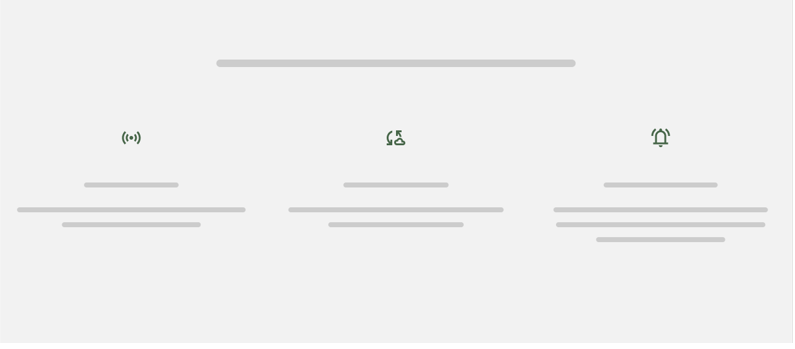<br>

#### 5. Sección para Agrónomos
Un bloque diferenciado con fondo negro marca que comunica las herramientas específicas para agricultores: monitoreo multi-parcela, reportes marca blanca y análisis de datos históricos.

<br>

#### 6. Sección de Proceso
Un flujo visual de 3 pasos que explica lo sencillo que es comenzar: (1) Instalación de sensores, (2) Conexión a la nube y (3) Control total desde el dispositivo y solicitud de la demo.

<br>

#### 7. Planes y Precios
Presentación comparativa de las suscripciones (Básico, Pro y Enterprise), destacando el plan "Pro" como el más popular para operaciones medianas.

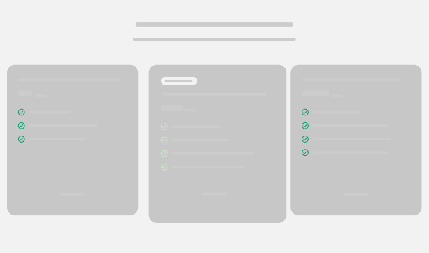<br>

#### 8. Forms (Pie de página)
Formulario con diferentes secciones para poner tu nombre completo, email, telefono, tamaño de operación (hectáreas) y el rol.

<br>

#### 8. Footer (Pie de página)
Información de contacto corporativa, enlaces legales (Privacidad, Términos) y accesos directos a redes sociales o soporte técnico vía WhatsApp.

<br>


### 5.3.2. Landing Page Mock-up.
## 5.4. Applications UX/UI Design.
### 5.4.1. Applications Wireframes.

En esta fase, hemos desarrollado de manera conjunta los wireframes para visualizar detalladamente la arquitectura y el diseño de las interfaces de usuario. Gracias a este esfuerzo colaborativo, transformamos los requisitos funcionales en esquemas gráficos precisos, definiendo así la distribución y presentación de cada componente en la aplicación definitiva.

#### Web Application Wireframes

Para la versión de escritorio, el diseño se enfocó en maximizar el uso del espacio en pantalla, estableciendo una jerarquía visual clara y una navegación expansiva.

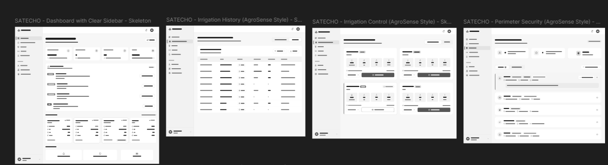<br>

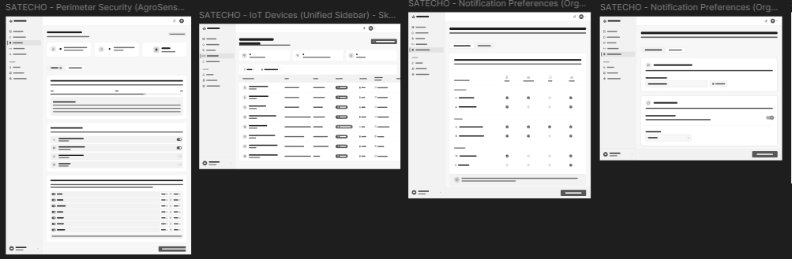<br>

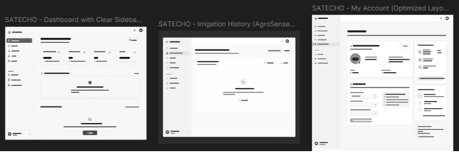<br>


#### Mobile Application Wireframes
En la versión móvil, la prioridad fue la optimización del espacio, la ergonomía y la accesibilidad táctil.

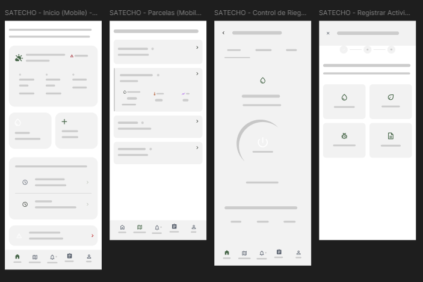<br>

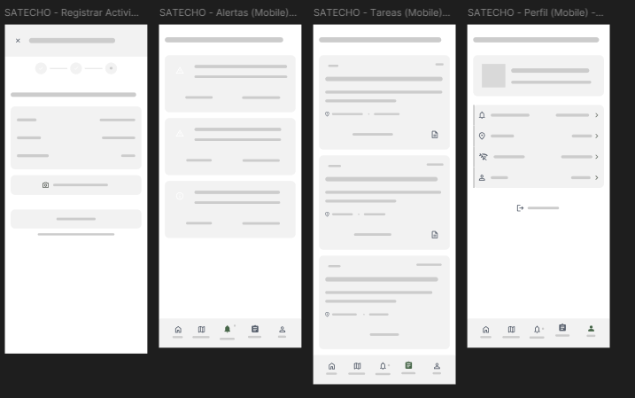<br>

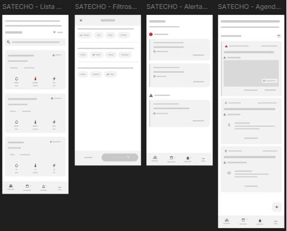<br>

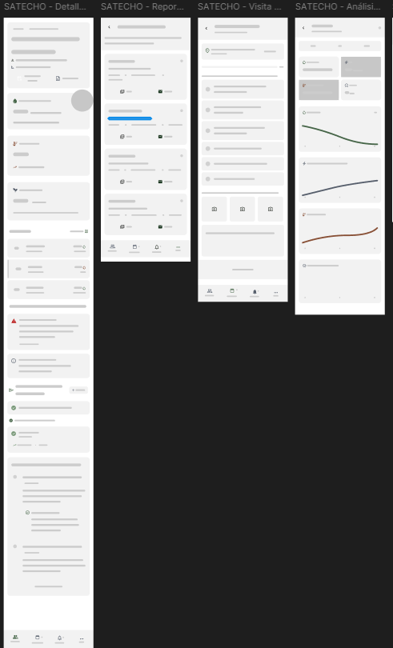<br>

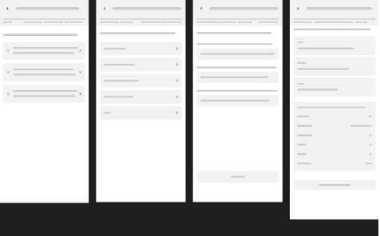<br>

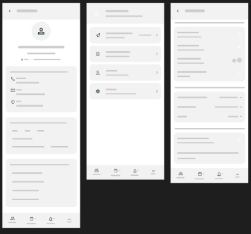<br>


### 5.4.2. Applications Wireflow Diagrams.
### 5.4.2. Applications Mock-ups.
### 5.4.3. Applications User Flow Diagrams.
## 5.5. Applications Prototyping.
## 5.6. IoT Device Design.