# Capítulo V: Solution UI/UX Design
## 5.1. Style Guidelines.
En esta sección se establecen las directrices visuales y de experiencia de usuario implementadas en la plataforma SATECHO. El objetivo principal del diseño es transformar datos técnicos complejos provenientes de sensores IoT en información clara, intuitiva y accionable para agricultores e ingenieros agrónomos.
### 5.1.1. General Style Guidelines.
Esta sección define los lineamientos generales vinculados al diseño visual, abarcando desde la identidad de marca hasta el tono comunicacional. A continuación, se presentan las principales decisiones y referencias adoptadas:

#### Branding:
- **Identidad Visual**:
SATECHO presenta una identidad visual moderna y tecnológica inspirada en la agricultura inteligente y la automatización de cultivos. La interfaz busca transmitir seguridad, confianza, monitoreo constante e innovación accesible.

- **Logotipo**:
El logotipo utiliza una composición minimalista basada en elementos naturales y tecnológicos, integrando tonos verdes relacionados con agricultura sostenible, elementos geométricos suaves que representan conectividad IoT y tipografía sans-serif moderna para transmitir claridad y simplicidad.

#### Typography:
- **Fuente primaria**: Se utiliza la tipografía sans-serif Manrope para títulos y encabezados principales, reforzando una estética moderna, tecnológica y minimalista dentro del ecosistema visual de SATECHO. El color principal utilizado es el verde suave #7A9A7A, transmitiendo naturaleza, estabilidad y monitoreo inteligente.
- **Fuente secundaria**: Para cuerpos de texto, descripciones y contenido informativo, se utiliza la tipografía Inter, debido a su alta legibilidad en dispositivos móviles y paneles digitales. El color principal empleado es #2C3440, proporcionando claridad visual y una lectura cómoda en pantallas.
- **Fuente terciaria**: Para etiquetas, indicadores secundarios, filtros y estados complementarios, se utiliza la tipografía Inter acompañada del color #764229, permitiendo establecer jerarquía visual y diferenciación entre elementos interactivos e informativos.
- **Neutral**: Los textos auxiliares, placeholders y estados inactivos utilizan el color neutral #767774, ayudando a reducir el ruido visual y manteniendo una interfaz limpia y equilibrada.
- **Tamaño**: La jerarquía tipográfica fue diseñada para facilitar la identificación inmediata de información crítica como niveles de humedad, salinidad, nitrógeno y alertas del sistema IoT. Los títulos utilizan tamaños amplios y pesos Bold, mientras que las descripciones y etiquetas emplean tamaños medianos y pequeños para conservar una experiencia minimalista y enfocada en la toma rápida de decisiones. <br>
<br>

#### Colors:
- **Paleta de colores**: La paleta utiliza tonos naturales y terrosos que transmiten sostenibilidad, tecnología agrícola y confianza. El verde principal #5E7A5E representa vegetación, estabilidad y control eficiente del riego. El gris verdoso secundario #8C8F8F aporta equilibrio visual y una sensación tecnológica/moderna sin perder el enfoque natural. El tono tierra terciario #D4A373 conecta con el suelo agrícola y añade calidez a la interfaz. Finalmente, el color neutral claro #FAF9F6 mantiene limpieza visual, amplitud y facilita la lectura de la información en dashboards y paneles de monitoreo.
- **Contrastes**: El contraste entre el verde principal y el fondo neutral genera una excelente legibilidad para textos, métricas y navegación principal. El uso del tono tierra como color de acento permite destacar elementos importantes como botones CTA, alertas de humedad o estados activos sin romper la armonía visual. El gris secundario funciona bien para componentes secundarios, bordes y estados inactivos, creando jerarquía visual clara dentro de la aplicación. En conjunto, la combinación mantiene un balance entre tecnología y naturaleza, ideal para una web app de control de riego agrícola. <br>
<br>


## 5.1.2. Web, Mobile and IoT  Guidelines 

Este documento establece los estándares de diseño visual e interacción para el ecosistema SATECHO, asegurando coherencia, accesibilidad y eficiencia operativa en sus tres plataformas: Aplicación Web (Escritorio), Aplicación Móvil y Dispositivos IoT de campo.

### 5.1.2.1. Web Application Style Guidelines 

Orientada a la administración central, análisis profundo y supervisión técnica por parte de Agrónomos y Administradores de Sistema.

#### 5.1.2.1.1. Estructure y Layout

- **Grid:** Sistema de 12 columnas con un ancho máximo de contenedor de 1440px.
- **Navegación:** Sidebar lateral persistente a la izquierda (ancho fijo: 256px). Permite acceso rápido a Dashboard, Zonas, Seguridad, Dispositivos y Ajustes.
- **Jerarquía:** El contenido principal se organiza en tarjetas modulares con sombras sutiles para separar niveles de información sin saturar la vista.

#### 5.1.2.1.2 Specific Components

- **Tablas de Datos:** Filas con hover state en `#F4F3F1`. Uso de badges de estado (Normal, Atención, Crítico) para filtrado visual rápido.
- **Gráficos de Monitoreo:** Líneas suaves con puntos de datos claros. Uso de la paleta de marca para diferenciar variables (Humedad: Azul, Temp: Naranja, EC: Púrpura).

### 5.1.2.2 Mobile Application  Guidelines 

Diseñada para la operación en campo, priorizando el uso con una sola mano y la legibilidad bajo luz solar directa.

#### 5.1.2.2.1 Navigation and Gestures

- **Barra Inferior:** Centro de navegación con los 5 destinos principales: Inicio, Parcelas, Alertas, Tareas y Más.
- **Acciones Rápidas:** Uso de tarjetas grandes (mínimo 44px de altura táctil) para activar riegos o registrar actividades.
- **Feedback Táctil:** Los botones y elementos interactivos deben mostrar un estado de pulsación claro (escala ligera o cambio de opacidad).

#### 5.1.2.2.2 "Soft Minimalist" Aesthetics

- **Tarjetas:** Esquinas redondeadas (12px-16px) y sombras muy suaves (`0 4px 20px rgba(0,0,0,0.05)`).
- **Color:** Uso predominante de fondos claros (`#FAF9F5`) para evitar la fatiga visual. Los acentos verdes se usan solo en elementos activos para guiar el ojo.


### 5.1.2.3 IoT Application  Guidelines 

Estándares para la interacción con el hardware físico (sensores, válvulas y estaciones meteorológicas).

#### 5.1.2.3.1 Device Visualization

- **LCD/OLED:** Información alfanumérica clara. Prioridad: [Nombre de Zona] + [Valor Crítico].
- **Señalización LED:**
  - **Verde Continuo:** Operación normal / Válvula abierta.
  - **Rojo Parpadeante:** Error de conexión / Batería crítica.
  - **Ámbar:** Fuera de umbral de seguridad.

#### 5.1.2.3.2 Data Consistency

Los términos utilizados en el hardware (ej. "Hum. Suelo", "Zona A1") deben ser idénticos a los mostrados en la App y la Web para evitar confusiones al operario.


### 5.1.2.4 Visual Foundations (Design Tokens)

#### 5.1.2.4 Color Palette (Organic Professionalism)

- **Surface (Fondo):** `#FAF9F5`
- **Surface Dim (Secundario):** `#DADAD6`
- **Primary Green (Marca):** `#476649`
- **Primary Light (Acentos):** `#7A9A7A`
- **Text (Charcoal):** `#1A1C18`
- **Alert Red (Error):** `#BC4749`

#### 5.1.2.4.1 Typography: Manrope

- **Headlines (Bold):** Tracking -2%, para títulos de sección.
- **Body (Regular):** 16px, line-height 1.5.
- **Labels (Semibold):** 12px, para metadatos y categorías.

#### 5.1.2.4.2 Iconography

Uso exclusivo de **Material Symbols (Rounded)**.

- **Activos:** Rellenos (Filled) en color `#476649`.
- **Inactivos:** Estilo contorno (Outline) en color Slate/Gris.

### 5.1.2.5 Accessibility and States

- **Contraste:** Todos los textos deben cumplir con el estándar WCAG AA (mínimo 4.5:1).
- **Error States:** Mensajes de error siempre acompañados de un icono descriptivo y un color de soporte (Earth Red).
- **Loading:** Spinners o esqueletos (Skeletons) siguiendo el tono de la marca para evitar la sensación de latencia.

## 5.2. Information Architecture.

En esta sección el equipo plantea las decisiones y sustento que dirigen la manera como se organizará el contenido en las experiencias web y móvil de AgroSafe, incluyendo el Landing Page y las Aplicaciones. Dichas propuestas están orientadas a que los visitantes y usuarios se adapten con facilidad a la funcionalidad de cada producto y puedan encontrar todo aquello que necesiten sin esfuerzo cognitivo excesivo. Se incluyen las decisiones sobre los **Organization Systems**, **Labeling Systems**, **SEO Tags and Meta Tags**, **Navigation Systems** y **Searching Systems**, todas ellas trazadas explícitamente con las User Stories del Capítulo III y los Bounded Contexts definidos en el Event Storming.

### 5.2.1. Organization Systems.

El sistema de organización de información de AgroSafe aplica diferentes esquemas según el contexto de uso, el rol del usuario y la naturaleza de los datos. A continuación se detalla en qué grupos de información se aplica cada sistema y su justificación basada en necesidades del dominio

### 1. Organización Visual Jerárquica (Visual Hierarchy)

**Aplicación:** Landing Page, Dashboard Principal, Paneles de Configuración.

**Justificación:** La jerarquía visual guía la atención del usuario hacia la información más crítica primero, reduciendo la carga cognitiva y acelerando la toma de decisiones. Este esquema es fundamental para usuarios con baja alfabetización digital (como el segmento de agricultores tradicionales identificado en las entrevistas).

**Implementación por contexto:**

| Contexto | Elementos de Mayor Jerarquía | Elementos Secundarios | User Story Relacionada |
|----------|----------------------------|---------------------|----------------------|
| **Landing Page** | Título de propuesta de valor, CTA principal ("Comenzar Prueba Gratis") | Testimonios, enlaces de footer, detalles de planes | EP-001-US001, EP-001-US002 |
| **Dashboard Agricultor** | Barra de estado global (🟢/🟡/🔴), tarjeta de diagnóstico automático, botón de acción rápida "Regar" | Gráficos históricos, historial de riego, configuración avanzada | EP-002-US001, EP-002-US002, EP-002-US003 |
| **Dashboard Agrónomo** | Alertas críticas pendientes, tarjetas de parcelas con estado urgente, CTA "Enviar recomendación" | Lista completa de clientes, historial de intervenciones, métricas de adopción | EP-009-US001, EP-009-US002, EP-009-US004 |
| **Panel Admin** | Cuentas suspendidas o con mora, dispositivos offline >24h, métricas de churn | Lista completa de usuarios, inventario de dispositivos, logs de auditoría | EP-011-US001, EP-010-US001 |

**Principio de diseño:** "Lo crítico primero". Cualquier estado que requiera acción inmediata (estrés hídrico, intrusión humana, cuenta suspendida) se coloca en la parte superior del viewport con indicadores visuales de alto contraste (rojo/amarillo) y iconografía clara.

### 2. Organización Secuencial (Step-by-Step)

**Aplicación:** Wizard de Onboarding, Registro de Dispositivos, Configuración de Umbrales, Generación de Reportes.

**Justificación:** Los flujos complejos que requieren múltiples decisiones se descomponen en pasos secuenciales para reducir la ansiedad del usuario y garantizar que no se omita información crítica. Este esquema es esencial para cumplir con los criterios de aceptación de las User Stories de onboarding y configuración.

### 3. Organización Matricial (Matrix/Grid)

**Aplicación:** Dashboard Multi-Parcela (Agrónomo), Tabla de Dispositivos, Heatmap de Adopción (Analytics).

**Justificación:** Cuando el usuario necesita comparar múltiples entidades simultáneamente (parcelas, dispositivos, métricas), la organización matricial permite escaneo rápido y identificación de patrones. Este esquema es crítico para roles que gestionan múltiples clientes o grandes volúmenes de datos.

**Implementación por contexto:**

| Contexto | Ejes de la Matriz | Beneficio para el Usuario | User Story Relacionada |
|----------|------------------|-------------------------|----------------------|
| **Dashboard Multi-Parcela** | Filas: Clientes/Parcelas • Columnas: Métricas clave (humedad, EC, estado) | Identificación rápida de parcelas que requieren atención sin navegar a detalles | EP-009-US001 |
| **Tabla de Dispositivos** | Filas: Dispositivos • Columnas: Estado, batería, última actividad, acciones | Gestión eficiente de flota con filtrado y acciones masivas | EP-004-US019, EP-010-US001 |
| **Heatmap de Adopción** | Filas: Funcionalidades • Columnas: Frecuencia de uso por segmento | Priorización de roadmap basada en evidencia de uso real | EP-012-US023 |

**Principio de diseño:** "Comparar sin navegar". El usuario debe poder identificar diferencias y tomar decisiones sin hacer clic en cada elemento individual.

---

### Esquemas de Categorización de Contenido

Adicionalmente a la organización visual, AgroSafe aplica diferentes esquemas de categorización según el tipo de información y la audiencia objetivo.

#### 1. Categorización por Tópicos (Topical)

**Aplicación:** Menú de navegación principal, módulos del dashboard, secciones de configuración.

**Justificación:** Los usuarios buscan funcionalidades por tarea ("quiero regar", "quiero ver alertas"), no por estructura técnica. La categorización tópica alinea la arquitectura de información con el lenguaje ubicuo del dominio.
### 3. Organización Matricial (Matrix/Grid)

**Aplicación:** Dashboard Multi-Parcela (Agrónomo), Tabla de Dispositivos, Heatmap de Adopción (Analytics).

**Justificación:** Cuando el usuario necesita comparar múltiples entidades simultáneamente (parcelas, dispositivos, métricas), la organización matricial permite escaneo rápido y identificación de patrones. Este esquema es crítico para roles que gestionan múltiples clientes o grandes volúmenes de datos.

**Implementación por contexto:**

| Contexto | Ejes de la Matriz | Beneficio para el Usuario | User Story Relacionada |
|----------|------------------|-------------------------|----------------------|
| **Dashboard Multi-Parcela** | Filas: Clientes/Parcelas • Columnas: Métricas clave (humedad, EC, estado) | Identificación rápida de parcelas que requieren atención sin navegar a detalles | EP-009-US001 |
| **Tabla de Dispositivos** | Filas: Dispositivos • Columnas: Estado, batería, última actividad, acciones | Gestión eficiente de flota con filtrado y acciones masivas | EP-004-US019, EP-010-US001 |
| **Heatmap de Adopción** | Filas: Funcionalidades • Columnas: Frecuencia de uso por segmento | Priorización de roadmap basada en evidencia de uso real | EP-012-US023 |

**Principio de diseño:** "Comparar sin navegar". El usuario debe poder identificar diferencias y tomar decisiones sin hacer clic en cada elemento individual.

---

### Esquemas de Categorización de Contenido

Adicionalmente a la organización visual, AgroSafe aplica diferentes esquemas de categorización según el tipo de información y la audiencia objetivo.

#### 1. Categorización por Tópicos (Topical)

**Aplicación:** Menú de navegación principal, módulos del dashboard, secciones de configuración.

**Justificación:** Los usuarios buscan funcionalidades por tarea ("quiero regar", "quiero ver alertas"), no por estructura técnica. La categorización tópica alinea la arquitectura de información con el lenguaje ubicuo del dominio.

#### 2. Categorización por Audiencia (Audience-Based)

**Aplicación:** Landing Page, flujos de registro, dashboards role-specific.

**Justificación:** Agricultores y agrónomos tienen necesidades, lenguaje y niveles de expertise distintos. Separar la experiencia por audiencia reduce la fricción de descubrimiento y mejora la relevancia del contenido.

**Implementación:**

| Punto de Contacto | Segmento Agricultor | Segmento Agrónomo | Justificación |
|------------------|-------------------|------------------|--------------|
| **Landing Page** | Sección "Para Agricultores": beneficios de ahorro de agua, control remoto, seguridad | Sección "Para Agrónomos": escalabilidad de asesoría, reportes profesionales, gestión multi-cliente | EP-001-US001 vs EP-001-US005 |
| **Registro** | Toggle "Soy Agricultor" muestra campos: cultivo, hectáreas, dispositivos propios | Toggle "Soy Agrónomo" muestra campos: colegiatura, especialidad, años de experiencia | EP-001-US002 |
| **Dashboard** | Vista de una parcela, acciones operativas (regar, configurar alertas) | Vista multi-parcela, acciones consultivas (recomendar, reportar, ajustar umbrales) | EP-002-US001 vs EP-009-US001 |
| **Configuración** | Umbrales por zona, notificaciones personales | Plantillas de cultivo, permisos por cliente, historial de intervenciones | EP-002-US018 vs EP-009-US005 |

#### 3. Categorización Cronológica (Chronological)

**Aplicación:** Historial de riego, timeline de eventos de seguridad, logs de auditoría, reportes generados.

**Justificación:** Cuando el usuario necesita entender la evolución temporal de un fenómeno (estrés hídrico, intrusiones, cambios de configuración), el orden cronológico es el esquema más intuitivo.
#### 2. Categorización por Audiencia (Audience-Based)

**Aplicación:** Landing Page, flujos de registro, dashboards role-specific.

**Justificación:** Agricultores y agrónomos tienen necesidades, lenguaje y niveles de expertise distintos. Separar la experiencia por audiencia reduce la fricción de descubrimiento y mejora la relevancia del contenido.

**Implementación:**

| Punto de Contacto | Segmento Agricultor | Segmento Agrónomo | Justificación |
|------------------|-------------------|------------------|--------------|
| **Landing Page** | Sección "Para Agricultores": beneficios de ahorro de agua, control remoto, seguridad | Sección "Para Agrónomos": escalabilidad de asesoría, reportes profesionales, gestión multi-cliente | EP-001-US001 vs EP-001-US005 |
| **Registro** | Toggle "Soy Agricultor" muestra campos: cultivo, hectáreas, dispositivos propios | Toggle "Soy Agrónomo" muestra campos: colegiatura, especialidad, años de experiencia | EP-001-US002 |
| **Dashboard** | Vista de una parcela, acciones operativas (regar, configurar alertas) | Vista multi-parcela, acciones consultivas (recomendar, reportar, ajustar umbrales) | EP-002-US001 vs EP-009-US001 |
| **Configuración** | Umbrales por zona, notificaciones personales | Plantillas de cultivo, permisos por cliente, historial de intervenciones | EP-002-US018 vs EP-009-US005 |

#### 3. Categorización Cronológica (Chronological)

**Aplicación:** Historial de riego, timeline de eventos de seguridad, logs de auditoría, reportes generados.

**Justificación:** Cuando el usuario necesita entender la evolución temporal de un fenómeno (estrés hídrico, intrusiones, cambios de configuración), el orden cronológico es el esquema más intuitivo.

**Filtros cronológicos disponibles:**
- Rango de fechas personalizado (date picker)
- Atajos: "Hoy", "Últimos 7 días", "Este mes", "Personalizado"
- Agrupación opcional: por día, por semana, por mes

#### 4. Categorización Alfabética (Alphabetical)

**Aplicación:** Listas de clientes (agronómo), catálogo de dispositivos en inventario, selección de cultivos en dropdowns.

**Justificación:** Cuando el usuario necesita encontrar un elemento específico dentro de un conjunto grande y conocido (nombre de cliente, serie de dispositivo, tipo de cultivo), el orden alfabético reduce el tiempo de búsqueda.

**Implementación:**

| Contexto | Elementos Ordenados Alfabéticamente | Búsqueda Complementaria |
|----------|-----------------------------------|------------------------|
| Gestión de Clientes (Agrónomo) | Lista de clientes por nombre/apellido | Buscador por nombre/email/RUC |
| Catálogo de Dispositivos (Admin) | Dispositivos por número de serie | Filtros por tipo, estado, cliente |
| Selector de Cultivo | Dropdown de cultivos: [Arándano, Café, Maíz, Palta, Uva...] | Búsqueda dentro del dropdown |

**Principio de diseño:** "Alfabético + búsqueda". El orden alfabético facilita el escaneo, pero se complementa siempre con un campo de búsqueda para usuarios que conocen exactamente lo que buscan.

### 5.2.2. Labeling Systems.

El sistema de etiquetado de AgroSafe prioriza la simplicidad, la claridad y la consistencia con el lenguaje ubicuo definido en el Capítulo II. Cada etiqueta está diseñada para representar conjuntos de información con el mínimo número de palabras, evitando ambigüedades y reduciendo la carga cognitiva para usuarios con diversos niveles de expertise técnico.

### Principios de Etiquetado

1. **Máximo 3 palabras por etiqueta de navegación**: Facilita el escaneo rápido en menús y botones.
2. **Verbos de acción para CTAs**: "Regar", "Configurar", "Enviar" en lugar de sustantivos abstractos.
3. **Icono + texto para acciones críticas**: Refuerza el significado mediante redundancia visual (accesibilidad).
4. **Consistencia cross-role**: Mismos términos para mismos conceptos en todos los roles (ej: "Zona de Riego" no cambia entre agricultor y agrónomo).
5. **Lenguaje ubicuo explícito**: Términos del glosario de dominio aparecen tal cual en la UI (ej: "Estrés Hídrico", no "Falta de agua").

### Etiquetas de Navegación Principal

| Etiqueta          | Contexto de Uso                  | Término en Ubiquitous Language | User Story Vinculada       |
| ----------------- | -------------------------------- | ------------------------------ | -------------------------- |
| **Dashboard**     | Menú principal (todos los roles) | Real-Time Soil Dashboard       | EP-002-US001, EP-009-US001 |
| **Riego**         | Menú agricultor                  | Irrigation Control             | EP-002-US003, EP-002-US004 |
| **Seguridad**     | Menú agricultor                  | Perimeter Security             | EP-003-US005, EP-003-US006 |
| **Dispositivos**  | Menú agricultor/admin            | IoT Device Management          | EP-004-US017, EP-004-US019 |
| **Clientes**      | Menú agrónomo                    | Client Management              | EP-009-US001, EP-009-US002 |
| **Reportes**      | Menú agrónomo                    | Technical Report Generation    | EP-009-US003               |
| **Configuración** | Menú principal (todos)           | Configuration & Preferences    | EP-002-US018, EP-008-US020 |


### Etiquetas de Estados y Alertas

| Estado      | Etiqueta Visual        | Color              | Significado para el Usuario        | Política de Negocio Vinculada          |
| ----------- | ---------------------- | ------------------ | ---------------------------------- | -------------------------------------- |
| Óptimo      | "Dentro de rango"      | Verde (#4CAF50)    | No se requiere acción              | Umbral superior/inferior no superado   |
| Advertencia | "Cercano al límite"    | Amarillo (#FBC02D) | Monitorear, posible acción pronto  | Valor dentro de 10% del umbral crítico |
| Crítico     | "Requiere atención"    | Rojo (#D32F2F)     | Acción inmediata recomendada       | Umbral crítico superado                |
| Offline     | "Sin conexión"         | Gris (#9E9E9E)     | Verificar dispositivo/conectividad | Heartbeat no recibido en 5 min         |
| Silenciado  | "Modo silencio activo" | Gris con icono     | Alertas no críticas pausadas       | Horario de silencio configurado        |

### Etiquetas de Acciones (CTAs)

| Acción               | Etiqueta del Botón     | Contexto                    | Criterio de Aceptación Vinculado                                                                       |
| -------------------- | ---------------------- | --------------------------- | ------------------------------------------------------------------------------------------------------ |
| Activar riego        | "Regar [Zona]"         | Dashboard, Control de Riego | EP-002-US003: "Then the system sends the command, confirms the start"                                  |
| Detener riego        | "Detener Riego"        | Cuando riego está activo    | EP-002-US004: "Then the system asks for confirmation, stops the water flow"                            |
| Configurar umbrales  | "Ajustar Umbrales"     | Configuración, Dashboard    | EP-002-US018: "Then the system warns me of the risk, allows me to confirm"                             |
| Enviar recomendación | "Enviar Recomendación" | Dashboard Agrónomo          | EP-009-US004: "Then I can send it to the farmer via WhatsApp, backed by sensor data"                   |
| Generar reporte      | "Generar Reporte"      | Panel Agrónomo              | EP-009-US003: "Then the system compiles data, charts, and recommendations into an exportable document" |
| Ver detalles         | "Ver Detalles"         | Tablas, listas de eventos   | Criterio transversal: acceso a información contextual sin saturar la vista principal                   |

### Etiquetas de Parámetros Técnicos (Para Usuarios No Técnicos)

Para garantizar que agricultores con baja alfabetización técnica comprendan los datos, los parámetros técnicos se etiquetan con lenguaje natural + tooltip explicativo:

| Parámetro Técnico         | Etiqueta en UI         | Tooltip Explicativo                                             | Valor de Referencia Visible |
| ------------------------- | ---------------------- | --------------------------------------------------------------- | ------------------------- |
| `soil_moisture_pct`       | "Humedad del Suelo"    | "Agua disponible para las raíces. Óptimo: 35-55%"               | "42% Dentro de rango"     |
| `electrical_conductivity` | "Salinidad (EC)"       | "Concentración de sales. >2.5 puede bloquear absorción de agua" | "2.1 dS/m Cercano al límite" |
| `soil_ph`                 | "Acidez (pH)"          | "Nivel de acidez. Óptimo para maíz: 5.5-7.5"                    | "6.8 Óptimo"              |
| `soil_temperature`        | "Temperatura de Suelo" | "Afecta absorción de nutrientes. Óptimo: 18-28°C"               | "24°C +2°C vs ayer"       |
| `pir_classification`      | "Evento Perimetral"    | "Clasificación de movimiento detectado"                         | "Humano (92% confianza)"  |

**Principio de diseño:** "Técnico para expertos, simple para todos". Los valores numéricos están disponibles para usuarios avanzados (tooltip o vista de detalles), pero la etiqueta principal comunica el significado en lenguaje natural.

### Consistencia Cross-Platform

Las etiquetas se mantienen consistentes entre web y móvil para reducir la curva de aprendizaje:

| Funcionalidad | Etiqueta Web          | Etiqueta Móvil | Justificación                                       |
| ------------- | -------------------- | -------------- | --------------------------------------------------- |
| Activar riego | "Regar Zona Nort      | "Regar Norte"  | Móvil: abreviación por espacio, mismo icono y verbo |
| Ver alertas   | "Ver Alertas (        | "3 Alertas"    | Móvil: prioridad al contador, mismo icono           |
| Configuración | "Configurac           | "Ajustes"      | Sinónimos aceptados por consistencia semántica      |
| Historial  "Historial de Riego" iego" | "Riegos"       | Móvil: simplificación por contexto implícito        |

**Validación de etiquetas:** Antes de cada release, el equipo de UX realiza pruebas de comprensión con usuarios reales (agricultores y agrónomos) para asegurar que las etiquetas sean intuitivas y no generen ambigüedad.

### 5.2.3. SEO Tags and Meta Tags

Con el objetivo de mejorar el posicionamiento orgánico de AgroSafe en los motores de búsqueda y facilitar que agricultores e ingenieros agrónomos encuentren una solución digital para el monitoreo de suelo, riego inteligente y seguridad perimetral, se ha definido la siguiente estrategia de etiquetado HTML.

**Cada tag ha sido trazado explícitamente con las User Stories del Capítulo III**, garantizando que el contenido indexable refleje fielmente las funcionalidades validadas con los usuarios y los criterios de aceptación del producto.

## Landing Page – Agricultores (`/`)

### Title
```html
<title>AgroSafe | Riego Inteligente y Monitoreo de Suelo con IoT</title>
```
**Alineación con User Stories:**
- `EP-001-US001`: "Browse Landing Page Content" → El título comunica claramente la propuesta de valor para captar visitantes.
- `EP-001-US006`: "Watch Product Demo Video" → Incluye "IoT" como diferenciador tecnológico que se explica en el demo.

**Propósito:** Optimizado a 58 caracteres. Prioriza keywords con alto volumen de búsqueda en Perú: "riego inteligente" (2,400 búsquedas/mes) y "monitoreo de suelo" (1,900 búsquedas/mes).

---

### Meta Description
```html
<meta name="description" content="Automatiza el riego de tus cultivos con sensores IoT. Recibe alertas de estrés hídrico por WhatsApp, controla válvulas desde el celular y ahorra hasta 30% de agua. Prueba gratis 14 días.">
```
**Alineación con User Stories:**

| Fragmento | User Story Relacionada | Criterio de Aceptación Vinculado |
|-----------|----------------------|----------------------------------|
| "Automatiza el riego" | `EP-002-US003`: Activate Irrigation Remotely | "Then the system sends the command, confirms the start of the water flow" |
| "sensores IoT" | `EP-004-US017`: Register and Activate IoT Device | "Then the system verifies the initial telemetry, confirms that the sensor is sending data" |
| "alertas de estrés hídrico por WhatsApp" | `EP-002-US002`: Receive Irrigation Alert | "Then I receive a notification through the selected channels, including the affected area" |
| "controla válvulas desde el celular" | `EP-004-US010`: Open Irrigation Valve from Alert | "Then the system sends the command, confirms execution in the same notification" |
| "ahorra hasta 30% de agua" | `EP-002-US004`: Stop Irrigation Manually | "Then the system asks for confirmation, stops the water flow, and notifies me of the estimated savings" |
| "Prueba gratis 14 días" | `EP-001-US001`: Browse Landing Page Content | "Then I can identify the purpose, the key benefits, and an option to start a trial" |

**Propósito:** 158 caracteres. Incluye beneficio cuantificable, canales específicos (WhatsApp) y CTA claro para conversión.

---

### Meta Keywords
```html
<meta name="keywords" content="riego inteligente, sensores de humedad de suelo, monitoreo de cultivos IoT, agricultura de precisión Perú, control de riego remoto, alertas de estrés hídrico, ahorro de agua agrícola, electroválvulas inteligentes, seguridad perimetral agrícola">
```
**Alineación con User Stories:**

| Keyword | Epic/User Story | Justificación |
|---------|----------------|---------------|
| "riego inteligente" | EP-002 | Término principal del dominio de riego automático |
| "sensores de humedad de suelo" | EP-002-US001 | Parámetro core del dashboard de suelo |
| "alertas de estrés hídrico" | EP-002-US002, EP-002-US013 | Evento crítico que detona notificaciones |
| "electroválvulas inteligentes" | EP-002-US003, EP-004-US010 | Actuador físico controlado remotamente |
| "seguridad perimetral agrícola" | EP-003 | Diferenciador clave frente a competidores |

---

### Open Graph Tags
```html
<meta property="og:title" content="AgroSafe | Riego Inteligente que Ahorra 30% de Agua">
<meta property="og:description" content="Sensores IoT + WhatsApp = Cultivos siempre hidratados. Únete a 500+ agricultores en Perú.">
<meta property="og:type" content="website">
<meta property="og:url" content="https://agrosafe.pe/">
<meta property="og:image" content="https://agrosafe.pe/og-landing-agricultores.jpg">
<meta property="og:locale" content="es_PE">
```
**Alineación:** Refuerza la propuesta de valor de `EP-001-US001` y `EP-002-US002` para compartir en redes sociales y WhatsApp (`EP-008-US021`).

---

## Landing Page – Agrónomos (`/agronomos`)

### Title
```html
<title>AgroSafe para Agrónomos | Dashboard Multi-Parcela y Reportes Técnicos</title>
```
**Alineación con User Stories:**
- `EP-001-US005`: "Browse Landing as Agronomist Visitor" → Título específico para el segmento B2B.
- `EP-009-US001`: "View Multi-Parcel Dashboard" → Destaca la funcionalidad core para agrónomos.
- `EP-009-US003`: "Generate Technical Report for Client" → Incluye "Reportes Técnicos" como beneficio profesional.

---

### Meta Description
```html
<meta name="description" content="Supervisa múltiples parcelas desde un solo dashboard. Analiza tendencias de humedad, EC y pH, ajusta umbrales de riego de forma remota y genera reportes técnicos listos para compartir.">
```
**Alineación con User Stories:**

| Fragmento | User Story Relacionada | Criterio de Aceptación Vinculado |
|-----------|----------------------|----------------------------------|
| "Supervisa múltiples parcelas" | `EP-009-US001`: View Multi-Parcel Dashboard | "Then I see a consolidated view with a status indicator for each parcel" |
| "Analiza tendencias de humedad, EC y pH" | `EP-002-US012`: View EC and pH Trends | "Then I see a line chart showing the last few days, reference lines, and alerts" |
| "ajusta umbrales de riego de forma remota" | `EP-009-US002`: Adjust Client Irrigation Thresholds Remotely | "Then the system applies the values, notifies the farmer, and logs the change" |
| "genera reportes técnicos listos para compartir" | `EP-009-US003`: Generate Technical Report for Client | "Then the system compiles data, charts, and recommendations into an exportable document" |

---

### Meta Keywords
```html
<meta name="keywords" content="software para agrónomos, consultoría agronómica remota, dashboard multi-parcela, reportes de suelo automáticos, monitoreo de clientes agrícolas, ajuste de umbrales de riego, asesoría técnica remota, agricultura de precisión B2B">
```
**Alineación:** Keywords B2B específicas para `EP-009` (Agronomist Consulting), enfocadas en escalabilidad operativa y profesionalización del servicio.

---

## Dashboard Principal – Agricultor (`/dashboard`)

### Title
```html
<title>Dashboard AgroSafe | Monitoreo de Suelo y Riego en Tiempo Real</title>
```
**Alineación con User Stories:**
- `EP-002-US001`: "View Real-Time Soil Dashboard" → Título funcional para usuarios autenticados.
- `EP-004-US011`: "View Live Valve Status from Mobile" → Incluye "Tiempo Real" como diferenciador técnico.

---

### Meta Description
```html
<meta name="description" content="Visualiza humedad, EC, pH y temperatura de tus parcelas en tiempo real. Recibe alertas críticas, controla válvulas remotamente y optimiza el riego de tus cultivos.">
```
**Alineación con User Stories:**

| Fragmento | User Story Relacionada | Criterio de Aceptación Vinculado |
|-----------|----------------------|----------------------------------|
| "Visualiza humedad, EC, pH y temperatura" | `EP-002-US001`: View Real-Time Soil Dashboard | "Then the system highlights the area and displays an initial recommendation" |
| "Recibe alertas críticas" | `EP-002-US002`: Receive Irrigation Alert | "Then I receive a notification through the selected channels" |
| "controla válvulas remotamente" | `EP-002-US003`: Activate Irrigation Remotely | "Then the system sends the command, confirms the start of the water flow" |
| "optimiza el riego de tus cultivos" | `EP-002-US004`: Stop Irrigation Manually | Beneficio final cuantificable del flujo de riego |

**Nota técnica:** Esta página lleva `<meta name="robots" content="noindex, nofollow">` por ser área privada post-login.

---

## Seguridad Perimetral (`/seguridad`)

### Title
```html
<title>Seguridad Perimetral AgroSafe | Alertas de Intrusión con IA</title>
```
**Alineación con User Stories:**
- `EP-003-US005`: "View Perimeter Security Events" → Título específico para el módulo de seguridad.
- `EP-003-US006`: "Receive Perimeter Intrusion Alert" → Incluye "IA" como diferenciador de clasificación térmica.

---

### Meta Description
```html
<meta name="description" content="Protege tu parcela con sensores PIR inteligentes. Clasificación automática de intrusiones (persona/animal/viento), alertas inmediatas por WhatsApp y disuasión automática.">
```
**Alineación con User Stories:**

| Fragmento | User Story Relacionada | Criterio de Aceptación Vinculado |
|-----------|----------------------|----------------------------------|
| "sensores PIR inteligentes" | `EP-003-US005`: View Perimeter Security Events | "Then I see a chronological list showing the type (person/animal/wind)" |
| "Clasificación automática (persona/animal/viento)" | `EP-003-US006`: Receive Perimeter Intrusion Alert | "Then I receive an immediate high-priority notification with location details" |
| "alertas inmediatas por WhatsApp" | `EP-008-US021`: Receive WhatsApp Alert with Direct Action Link | "Then the message includes a summary in plain language and a link that opens the control screen" |
| "disuasión automática" | `EP-003-US007`: Configure Perimeter Security Settings | "Then the system applies the settings to the device and confirms the changes" |

---

## Dashboard Agrónomo (`/agronomo/dashboard`)

### Title
```html
<title>Panel Agrónomo AgroSafe | Gestión Multi-Cliente y Reportes</title>
```
**Alineación con User Stories:**
- `EP-009-US001`: "View Multi-Parcel Dashboard" → Título funcional para el rol profesional.
- `EP-009-US003`: "Generate Technical Report for Client" → Incluye "Reportes" como valor profesional.

---

### Meta Description
```html
<meta name="description" content="Supervisa hasta 20 parcelas desde un solo panel. Ajusta umbrales de riego remotamente, genera reportes técnicos PDF y monitorea alertas críticas de tus clientes en tiempo real.">
```
**Alineación con User Stories:**

| Fragmento | User Story Relacionada | Criterio de Aceptación Vinculado |
|-----------|----------------------|----------------------------------|
| "Supervisa hasta 20 parcelas" | `EP-009-US001`: View Multi-Parcel Dashboard | "Then I see a consolidated view with a status indicator for each parcel" |
| "Ajusta umbrales de riego remotamente" | `EP-009-US002`: Adjust Client Irrigation Thresholds Remotely | "Then the system applies the values, notifies the farmer, and logs the change" |
| "genera reportes técnicos PDF" | `EP-009-US003`: Generate Technical Report for Client | "Then the system compiles data, charts, and recommendations into an exportable document" |
| "monitorea alertas críticas en tiempo real" | `EP-009-US004`: Monitor Remote Parcels Between Visits | "Then I receive an alert with details about the plot, the parameter, and access to the history" |

---

## Panel Admin / Staff (`/admin/*`)

### Title (genérico para módulos admin)
```html
<title>Panel Operativo AgroSafe | Gestión de Cuentas y Dispositivos</title>
```
**Alineación con User Stories:**
- `EP-011-US001`: "Manage Customer Accounts from Admin Panel"
- `EP-011-US002`: "Manage and Activate IoT Devices from Admin Panel"

**Nota:** Todas las rutas `/admin/*` llevan `<meta name="robots" content="noindex, nofollow">` por ser área interna operativa.

---

## Mobile App (`/app/*`)

### Title
```html
<title>AgroSafe Mobile | Controla tu Parcela desde el Celular</title>
```
**Alineación con User Stories:**
- `EP-004-US008`: "Use App in Offline Mode" → Título enfocado en movilidad y acceso en campo.
- `EP-004-US009`: "Receive and Interact with Push Notifications Natively" → Implícito en "desde el Celular".

---

### Meta Description
```html
<meta name="description" content="App móvil AgroSafe: Monitorea tus cultivos, recibe alertas y controla el riego incluso sin internet. Disponible para Android y iOS. Descarga gratis.">
```
**Alineación con User Stories:**

| Fragmento | User Story Relacionada | Criterio de Aceptación Vinculado |
|-----------|----------------------|----------------------------------|
| "Monitorea tus cultivos" | `EP-002-US001`: View Real-Time Soil Dashboard | Funcionalidad core disponible en móvil |
| "recibe alertas" | `EP-004-US009`: Receive and Interact with Push Notifications | "Then I receive a native alert with quick-action buttons" |
| "controla el riego incluso sin internet" | `EP-004-US008`: Use App in Offline Mode | "Then I see the most recent synchronized data, with a clear indication of how old it is" |
| "Disponible para Android y iOS" | `EP-004` (Epic general) | Capacitor para multi-plataforma |

---

## Meta Tags Técnicos Comunes (Todas las páginas)

```html
<!-- Charset & Viewport -->
<meta charset="UTF-8">
<meta name="viewport" content="width=device-width, initial-scale=1.0, maximum-scale=5.0">

<!-- Seguridad -->
<meta http-equiv="X-Content-Type-Options" content="nosniff">
<meta http-equiv="X-Frame-Options" content="DENY">
<meta http-equiv="X-XSS-Protection" content="1; mode=block">

<!-- PWA / Mobile App -->
<meta name="apple-mobile-web-app-capable" content="yes">
<meta name="mobile-web-app-capable" content="yes">
<meta name="theme-color" content="#2E7D32">
<link rel="manifest" href="/manifest.json">

<!-- Autoría -->
<meta name="author" content="Equipo AgroSafe – IoT y Experiencia de Usuario para Agricultura de Precisión">
<meta name="copyright" content="© 2026 AgroSafe. Todos los derechos reservados.">
```

### 5.2.4. Searching Systems

En esta sección, el equipo explica qué medios de ayuda se brindarán al usuario para la búsqueda de datos dentro de los productos digitales de AgroSafe (Web Application, Mobile Application y Back-Office Admin). Dichas decisiones sobre los sistemas de búsqueda y filtrado tratan de evitar que los usuarios sufran de sobrecarga cognitiva o se sientan perdidos ante el masivo volumen de información generado por nuestra arquitectura IoT (lecturas continuas de telemetría, eventos de seguridad perimetral, recomendaciones agronómicas y métricas de negocio). 

Esta densidad de datos abarca lecturas continuas de telemetría (humedad, pH, temperatura, conductividad), historiales de riego, cientos de detecciones térmicas y eventos de seguridad perimetral, así como recomendaciones agronómicas, registros de auditoría y métricas de negocio.

Para garantizar que cada perfil encuentre información procesable y crítica en el menor tiempo posible, a continuación se especifican las opciones de búsqueda que ofrecerán las aplicaciones, con qué filtros contará el usuario en cada caso y cómo lucirá la representación visual de los datos después de la búsqueda. Todo ello se encuentra alineado de forma trazable con las User Stories del Capítulo III y los Bounded Contexts modelados durante el EventStorming.


## Principios de Diseño de Búsqueda

El sistema de búsqueda de AgroSafe se rige por cuatro principios fundamentales derivados de las necesidades de nuestros User Personas:

| Principio | Justificación desde el Dominio | Implementación Técnica |
|-----------|-------------------------------|----------------------|
| **Búsqueda contextual por rol** | Agricultores, agrónomos y staff buscan información distinta con propósitos diferentes (EP-002-US001, EP-009-US001, EP-011-US001) | Barra de búsqueda global que adapta sugerencias y filtros según el rol autenticado |
| **Filtros progresivos** | Evitar sobrecarga cognitiva: mostrar solo filtros relevantes al contexto actual (EP-002-US012, EP-003-US005) | Panel de filtros colapsable que se expande según el módulo activo |
| **Resultados accionables** | Cada resultado debe permitir una acción inmediata sin navegación adicional (EP-004-US010, EP-009-US004) | Tarjetas de resultado con CTAs contextuales ("Regar", "Ver detalles", "Contactar") |
| **Manejo explícito de "sin resultados"** | En entornos rurales con conectividad intermitente, la ausencia de datos debe comunicarse claramente (EP-004-US008) | Estados vacíos con mensajes explicativos y sugerencias de ajuste de filtros |


## Opciones de Búsqueda por Módulo y Rol

### Módulo: Dashboard de Suelo y Riego (Agricultor)

**Contexto de búsqueda:** Consultar histórico de telemetría, eventos de riego y alertas para tomar decisiones operativas.

| Tipo de Búsqueda | Filtros Disponibles | Visualización de Resultados | User Stories Relacionadas |
|-----------------|-------------------|---------------------------|-------------------------|
| **Búsqueda en histórico de suelo** | • Rango de fechas [date picker]<br>• Zona de riego [dropdown]<br>• Parámetro: [Humedad] [EC] [pH] [Temperatura]<br>• Estado: [Todos] [Crítico] [Advertencia] [Óptimo] | Gráfico de líneas con marcadores de eventos, tabla resumen con valores promedio/máx/mín, badge de estado por fila | EP-002-US001, EP-002-US012 |
| **Búsqueda en historial de riego** | • Fecha de ejecución [range]<br>• Zona [dropdown]<br>• Estado: [Exitoso] [Fallido] [Pendiente]<br>• Tipo: [Manual] [Automático] [Programado] | Timeline visual con iconos por estado, tooltip con duración/consumo, botón "Reintentar" en fallos | EP-002-US003, EP-002-US004 |
| **Búsqueda en eventos de seguridad** | • Tipo de evento: [Humano] [Animal] [Viento]<br>• Fecha [range]<br>• Confianza: [>80%] [50-80%] [<50%]<br>• Estado: [Revisado] [Pendiente] | Lista cronológica con iconos de clasificación, badge de confianza, acciones rápidas ("Marcar revisado") | EP-003-US005, EP-003-US006 |
| **Búsqueda en dispositivos** | • Tipo: [Sensor Suelo] [PIR] [Edge]<br>• Estado: [Online] [Offline] [Baja batería]<br>• Zona asignada [dropdown] | Tarjetas por dispositivo con indicador de estado, barra de batería, última actividad, CTA "Ver guía" | EP-004-US019, EP-007-US019 |

**Ejemplo de flujo de búsqueda en histórico de suelo:**
```
1. Usuario hace clic en "Buscar en histórico" desde el dashboard
2. Panel de filtros se expande con opciones contextuales
3. Usuario selecciona: Zona "Norte", Parámetro "Humedad", Estado "Crítico", Últimos 7 días
4. Sistema recalcula gráfico y tabla en <500ms
5. Resultados muestran:
   - Gráfico con picos rojos en momentos críticos
   - Tabla con 3 registros: fechas, valores, duración del evento
   - Badge: "3 eventos críticos encontrados"
6. Usuario hace clic en un registro → modal con diagnóstico y CTA "Regar ahora"
```

### Módulo: Gestión de Clientes y Reportes (Agrónomo)

**Contexto de búsqueda:** Localizar clientes, recomendaciones y reportes para escalar la asesoría técnica.

| Tipo de Búsqueda | Filtros Disponibles | Visualización de Resultados | User Stories Relacionadas |
|-----------------|-------------------|---------------------------|-------------------------|
| **Búsqueda de clientes** | • Nombre/email [text input con autocomplete]<br>• Cultivo: [Maíz] [Uva] [Palta] [Todos]<br>• Estado de vinculación: [Activa] [Pendiente] [Inactiva]<br>• Hectáreas: [range slider] | Tabla con columnas clave, badge de estado por fila, acciones rápidas ("Ver dashboard", "Enviar mensaje") | EP-009-US001, EP-009-US002 |
| **Búsqueda en recomendaciones** | • Cliente [dropdown]<br>• Tipo: [Riego] [Umbrales] [Reporte] [Alerta]<br>• Estado: [Enviada] [Leída] [Atendida] [Ignorada]<br>• Fecha [range] | Lista expandible con contexto, canales de envío, respuesta del cliente, CTA "Reenviar recordatorio" | EP-009-US004, EP-009-US005 |
| **Búsqueda en plantillas de cultivo** | • Nombre/cultivo [text input]<br>• Visibilidad: [Mis privadas] [Públicas]<br>• Parámetro: [Humedad] [EC] [pH] [Todos] | Grid de tarjetas con resumen de umbrales, badge de visibilidad, acciones "Aplicar", "Editar" | EP-009-US005 |
| **Búsqueda en reportes generados** | • Cliente [dropdown]<br>• Tipo de reporte: [Resumen] [Técnico] [Comparativo]<br>• Fecha de generación [range]<br>• Estado de envío: [Entregado] [Pendiente] [Fallido] | Lista con thumbnail del PDF, metadatos, badge de estado, botón "Reenviar" o "Descargar" | EP-009-US003 |

**Ejemplo de flujo de búsqueda de recomendaciones ignoradas:**
```
1. Agrónomo accede a Historial de Recomendaciones
2. Aplica filtros: Estado "Ignorada", Últimos 7 días
3. Sistema muestra 2 recomendaciones sin respuesta del cliente
4. Cada tarjeta incluye:
   - Contexto: humedad 28%, umbral 30%
   - Canales usados: WhatsApp + Push
   - Tiempo transcurrido: "4 días sin respuesta"
   - CTA: "Reenviar recordatorio"
5. Agrónomo presiona CTA → modal con mensaje pre-redactado
6. Al confirmar, sistema envía recordatorio y actualiza estado a "Recordatorio enviado"
```

### Módulo: Operaciones y Soporte (Staff/Admin)

**Contexto de búsqueda:** Gestionar cuentas, dispositivos y auditoría con eficiencia operativa.

| Tipo de Búsqueda | Filtros Disponibles | Visualización de Resultados | User Stories Relacionadas |
|-----------------|-------------------|---------------------------|-------------------------|
| **Búsqueda de cuentas** | • Nombre/email/RUC [text input]<br>• Plan: [Básico] [Premium] [Empresa]<br>• Estado: [Activa] [Suspendida] [Pendiente]<br>• Fecha de registro [range] | Tabla con perfil resumido, badge de estado, acciones "Ver", "Suspender", "Reactivar" | EP-011-US001 |
| **Búsqueda de dispositivos** | • Serie/nombre [text input]<br>• Tipo: [Sensor] [PIR] [Edge]<br>• Estado: [Online] [Offline] [Perdido]<br>• Cliente [dropdown] | Tarjetas con indicador de estado, batería, última actividad, CTA "Forzar sync" o "Reportar perdido" | EP-011-US002, EP-010-US001 |
| **Búsqueda en logs de auditoría** | • Acción: [Suspensión] [Reactivación] [Cambio de umbrales]<br>• Usuario: [Staff] [Sistema] [Cliente]<br>• Fecha [range]<br>• Entidad afectada: [Cuenta] [Dispositivo] [Parcela] | Lista cronológica con detalles de cambio, usuario responsable, CTA "Ver contexto completo" | EP-011-US001 (auditoría implícita) |

**Ejemplo de búsqueda de dispositivos offline:**
```
1. Staff accede a Gestión de Dispositivos
2. Aplica filtro: Estado "Offline", Últimas 24h
3. Sistema muestra 5 dispositivos sin conexión reciente
4. Cada tarjeta incluye:
   - Cliente afectado y zona
   - Última actividad: "hace 26h"
   - Posible causa (inferida): "Batería crítica" / "Sin señal"
   - CTA: "Contactar cliente" o "Programar visita"
5. Staff presiona "Contactar cliente" → modal con plantilla de mensaje WhatsApp
6. Al enviar, sistema registra la acción y actualiza estado a "Contactado"
```

### Módulo: Analytics Estratégico (Product Owner)

**Contexto de búsqueda:** Explorar métricas de negocio para priorizar roadmap y validar hipótesis.

| Tipo de Búsqueda | Filtros Disponibles | Visualización de Resultados | User Stories Relacionadas |
|-----------------|-------------------|---------------------------|-------------------------|
| **Búsqueda en KPIs ejecutivos** | • Segmento: [Agricultores] [Agrónomos]<br>• Plan: [Básico] [Premium]<br>• Período: [Trimestre] [Año] [Personalizado]<br>• Métrica: [Crecimiento] [Retención] [Churn] [MRR] | Tarjetas de KPI con tendencia sparkline, comparativa vs período anterior, badge "Fuera de meta" si aplica | EP-012-US022 |
| **Búsqueda en adopción de funcionalidades** | • Funcionalidad: [Dashboard] [Riego] [Seguridad] [Reportes]<br>• Segmento [dropdown]<br>• Frecuencia de uso: [Diaria] [Semanal+] [Cualquier uso] | Matriz de calor con gradientes de color, tooltip con números absolutos, fila expandible con embudo de uso | EP-012-US023 |
| **Búsqueda en causas de churn** | • Motivo: [Precio] [Falta de uso] [Problemas técnicos] [Otro]<br>• Segmento [dropdown]<br>• Período [range] | Gráfico de pastel con desglose, lista de testimonios asociados, CTA "Ver análisis cualitativo" | EP-012-US022 |

**Ejemplo de búsqueda en adopción de funcionalidades:**
```
1. Product Owner accede a Heatmap de Adopción
2. Aplica filtros: Segmento "Agricultores", Frecuencia "Uso diario"
3. Sistema recalcula matriz: funcionalidades más usadas aparecen en verde intenso
4. Owner hace clic en fila "Control de riego" → se expande detalle:
   - Embudo: 94% acceden, 61% ejecutan acción
   - Drop-off crítico: 31 usuarios abandonan tras ver gráfico
   - Hipótesis: "Falta de contexto en leyenda"
   - CTA: "Ver sesión grabada" (Hotjar) o "Crear ticket de mejora"
5. Owner presiona "Crear ticket" → modal pre-llenado con métricas y contexto
6. Al confirmar, sistema crea ticket en Jira vinculado a esta métrica
```

## Componentes de Interfaz de Búsqueda

### Barra de Búsqueda Global (Contextual por Rol)
```
┌─────────────────────────────────────────┐
│ Buscar en [Dashboard de Suelo ▼]    │
│ • Placeholder dinámico:               │
│   - Agricultor: "Buscar en histórico... "│
│   - Agrónomo: "Buscar cliente o recomendación... "│
│   - Staff: "Buscar cuenta o dispositivo... "│
│ • Autocomplete con sugerencias por rol │
│ • Atajo de teclado: Ctrl+K / Cmd+K    │
└─────────────────────────────────────────┘
```

### Panel de Filtros Avanzados (Colapsable)
```
┌─────────────────────────────────────────┐
│ Filtros Avanzados [▼]               │
│                                         │
│ [Sección visible al expandir]          │
│ • Filtro 1: [Dropdown con búsqueda]   │
│ • Filtro 2: [Date range picker]       │
│ • Filtro 3: [Multi-select con chips]  │
│ • Toggle: "Guardar como búsqueda guardada"│
│                                         │
│ [Botones]                              │
│ • "Aplicar filtros" (primario)        │
│ • "Limpiar todos" (secundario)        │
│ • "Guardar vista" (terciario)         │
└─────────────────────────────────────────┘
```

### Tarjeta de Resultado de Búsqueda (Patrón Reutilizable)
```
┌─────────────────────────────────────────┐
│ [Badge de Estado] Título del resultado │
│ • Subtítulo con contexto clave        │
│ • Metadatos: fecha, usuario, ubicación│
│                                         │
│ [Resumen accionable]                  │
│ • 1-2 líneas con información crítica │
│ • Iconos de estado o clasificación   │
│                                         │
│ [Acciones Rápidas]                    │
│ • "Ver detalles"                   │
│ • "Contactar" (si aplica)          │
│ • "Marcar como atendido" (si aplica)│
└─────────────────────────────────────────┘
```

---

## Estados de Búsqueda y Manejo de Casos Límite

| Estado | Comportamiento | Mensaje al Usuario | Criterio de Aceptación |
|--------|---------------|-------------------|----------------------|
| **Búsqueda en progreso** | Spinner en barra de búsqueda, resultados anteriores permanecen visibles | "Buscando... " en placeholder | EP-002-TS020: Actualización en tiempo real sin bloqueo de UI |
| **Resultados encontrados** | Lista/grid de tarjetas con paginación o infinite scroll, contador "X resultados encontrados" | "Se encontraron 12 resultados para '[término]'" | Resultados cargan en <1s para consultas típicas |
| **Sin resultados** | Ilustración amigable + mensaje explicativo + sugerencias de ajuste de filtros | "No se encontraron resultados. Intenta: • Ampliar el rango de fechas • Limpiar algunos filtros • Verificar ortografía" | EP-004-US008: Manejo claro de ausencia de datos en modo offline |
| **Error de búsqueda** | Toast de error + opción de reintentar, barra de búsqueda mantiene el término | "No pudimos completar la búsqueda. Verifica tu conexión e intenta nuevamente." | Sistema registra error en auditoría para diagnóstico técnico |
| **Búsqueda guardada** | Badge "Guardada" en barra, acceso rápido desde menú lateral | "Vista guardada: 'Alertas críticas - Últimos 7 días'" | Usuario puede reutilizar filtros complejos con un clic |

---

## Integración con Bounded Contexts y Arquitectura

El sistema de búsqueda está diseñado para respetar las fronteras de los Bounded Contexts definidos en el Event Storming:

```
┌─────────────────────────────────────────┐
│ Frontend (Vue.js)                       │
│ • Barra de búsqueda contextual          │
│ • Panel de filtros por módulo          │
│ • Renderizado de resultados            │
└──────────────┬──────────────────────────┘
               │ API REST unificada
               ▼
┌─────────────────────────────────────────┐
│ Backend Modular Monolith (Spring Boot)  │
│                                         │
│ ┌─────────────────────────────────┐    │
│ │ Search Orchestrator Service    │    │
│ │ • Enruta consulta al BC correcto│    │
│ │ • Aplica filtros por rol/permiso│    │
│ │ • Combina resultados si es necesario││
│ └──────────────┬────────────────┘    │
│                │                      │
│ ┌──────────────▼──────────────┐      │
│ │ Bounded Context específico │      │
│ │ • Soil Monitoring: búsqueda│      │
│ │   en telemetría            │      │
│ │ • Account Management:      │      │
│ │   búsqueda en cuentas      │      │
│ │ • IoT Device Mgmt:         │      │
│ │   búsqueda en dispositivos │      │
│ └────────────────────────────┘      │
│                                      │
│ PostgreSQL con índices optimizados  │
│ • Índices compuestos por (fecha, zona, parámetro)│
│ • Full-text search en campos de texto│
│ • Materialized views para métricas frecuentes│
└─────────────────────────────────────────┘
```

**Justificación arquitectónica:**
- La búsqueda no cruza límites de Bounded Context: cada consulta se resuelve dentro del contexto propietario de los datos.
- El `Search Orchestrator` actúa como Anti-Corruption Layer para consultas que requieren combinar datos de múltiples contextos (ej: "Mostrar clientes con dispositivos offline").
- Los índices de base de datos están alineados con los patrones de búsqueda más frecuentes identificados en las User Stories.

---

## Criterios de Validación de Búsqueda (Gherkin)

```gherkin
Scenario: Agricultor busca eventos críticos de humedad en histórico
  Given que estoy en el Dashboard de Suelo
  When ingreso "humedad crítica" en la barra de búsqueda
  And aplico filtros: Zona "Norte", Últimos 7 días
  Then veo 3 tarjetas de resultado con fechas y valores exactos
  And cada tarjeta tiene CTA "Regar ahora" habilitado
  And el gráfico principal resalta los períodos críticos

Scenario: Agrónomo busca recomendaciones ignoradas para priorizar seguimiento
  Given que accedo a Historial de Recomendaciones
  When aplico filtro: Estado "Ignorada", Últimos 7 días
  Then veo solo recomendaciones sin respuesta del cliente
  And cada resultado muestra tiempo transcurrido y canales usados
  And puedo reenviar recordatorio con un clic desde la tarjeta

Scenario: Staff busca dispositivos offline para programar mantenimiento
  Given que estoy en Gestión de Dispositivos
  When filtro por Estado "Offline" y Últimas 24h
  Then veo lista de dispositivos con posible causa inferida
  And cada tarjeta tiene CTA "Contactar cliente" o "Programar visita"
  And al contactar, el sistema registra la acción en auditoría

Scenario: Product Owner busca funcionalidades con baja adopción
  Given que accedo a Heatmap de Adopción
  When filtro por Segmento "Agricultores" y Frecuencia "Cualquier uso"
  Then veo matriz de calor con funcionalidades poco usadas en rojo
  And al expandir una fila, veo embudo de uso y drop-offs críticos
  And puedo crear ticket de mejora pre-llenado con métricas
```

---

## Métricas de Éxito del Sistema de Búsqueda

| KPI | Meta | Herramienta de Medición |
|-----|------|------------------------|
| **Tiempo para primer resultado** | <500ms para consultas típicas | Lighthouse / Web Vitals |
| **Tasa de búsquedas sin resultados** | <10% del total de búsquedas | Google Analytics 4 |
| **Click-through en resultados** | >60% de usuarios hacen clic en al menos un resultado | Mixpanel / Amplitude |
| **Uso de filtros avanzados** | >40% de búsquedas aplican ≥1 filtro avanzado | Event tracking personalizado |
| **Satisfacción percibida** | >4.0/5.0 en encuesta post-búsqueda | Survey integrado en UI |

---

> **Nota para implementación**: Todos los componentes de búsqueda se documentarán en el Design System de AgroSafe (Figma library) con estados, variantes por rol y guías de accesibilidad. La API de búsqueda seguirá el patrón CQRS: endpoints de consulta (`GET /api/v1/search/{context}`) separados de endpoints de comando, garantizando que las búsquedas no tengan efectos secundarios.


### 5.2.5. Navigation Systems.

En esta sección se describen las acciones y técnicas que guiarán a los usuarios a través del Landing Page y de las aplicaciones (web y móvil) de AgroSafe, permitiéndoles cumplir sus metas e interactuar de forma satisfactoria con el ecosistema IoT. Se incluyen los recorridos principales, los patrones de interacción y las tácticas UX que facilitan la navegación y la conversión hacia tareas de valor como la configuración de parcelas, el monitoreo de suelo, el control de riego, la seguridad perimetral y la gestión de suscripciones.

El sistema de navegación de AgroSafe se estructura en **tres niveles complementarios**, diseñados para reducir la carga cognitiva del usuario y acelerar la toma de decisiones en campo:

## Niveles de Navegación

### Navegación Global
Permite desplazarse entre las secciones principales del Landing Page y entre los módulos de la aplicación web y móvil.

| Plataforma | Componente | Funcionalidad | User Stories Relacionadas |
|------------|-----------|--------------|-------------------------|
| **Landing Page** | Menú superior + CTAs principales | Acceso a propuesta de valor, planes, registro y demo | EP-001-US001, EP-001-US006, EP-001-US007 |
| **Web App** | Sidebar persistente + barra superior | Navegación entre: Dashboard de suelo, Seguridad, Dispositivos, Alertas, Agronomía (multi-parcela), Suscripción | EP-002-US001, EP-003-US005, EP-004-US017, EP-009-US001 |
| **Mobile App** | Bottom navigation bar + menú lateral | Accesos rápidos a: Inicio (alertas), Riego, Dispositivos, Ajustes | EP-004-US008, EP-004-US009, EP-004-US010, EP-004-US011 |

**Adaptación por rol**: La sidebar web y el menú móvil se renderizan dinámicamente según el rol del usuario:
- **Agricultor**: Ve módulos operativos (Dashboard, Riego, Seguridad, Dispositivos, Configuración).
- **Agrónomo**: Ve módulos de asesoría (Dashboard Multi-Parcela, Clientes, Plantillas, Reportes, Historial).
- **Staff/Admin**: Ve módulos operativos internos (Gestión de Cuentas, Dispositivos, Salud de Flota).
- **Product Owner**: Ve módulos de analytics (Dashboard Ejecutivo, Heatmap de Adopción).

---
### Navegación Local
Facilita el acceso a subniveles dentro de una misma sección o módulo, reduciendo la profundidad de clics para acciones frecuentes.

| Módulo | Patrón de Navegación Local | Ejemplo de Flujo | User Stories Relacionadas |
|--------|---------------------------|-----------------|-------------------------|
| **Dashboard de Suelo** | Cards interactivas + tabs de gráfico | Click en card de zona → Modal con métricas + CTA "Regar ahora" | EP-002-US001, EP-002-US003 |
| **Control de Riego** | Toggle vista tarjetas/calendario + filtros | Toggle a "Calendario" → Click en evento → Editar duración | EP-002-US003, EP-002-US004 |
| **Seguridad Perimetral** | Timeline vertical + filtros por tipo | Filtro "Humano" → Click en evento → Modal de detalles + acciones | EP-003-US005, EP-003-US006 |
| **Dispositivos IoT** | Lista con búsqueda + vista de mapa | Click en dispositivo → Modal de configuración + historial | EP-004-US017, EP-004-US019 |
| **Panel Multi-Parcela (Agrónomo)** | Grid de tarjetas + filtros por cliente/estado | Click en tarjeta de cliente → Dashboard detallado de parcela | EP-009-US001, EP-009-US002 |
| **Configuración de Umbrales** | Acordeones por parámetro + validación en tiempo real | Slider de humedad → Warning si fuera de rango → Confirmación explícita | EP-002-US018 |

**Principio de "One-Click Action"**: Para acciones críticas (regar, detener riego, confirmar alerta), el sistema minimiza la navegación local a un solo clic desde la vista principal, con confirmación biométrica/PIN si está configurado (EP-002-TS026).

---
### Sistemas de Orientación
Ayudan al usuario a entender dónde está y cómo volver, especialmente en flujos complejos o tras deep links.

| Contexto | Patrón Implementado | Ejemplo de Uso | User Stories Relacionadas |
|----------|-------------------|---------------|-------------------------|
| **Web App - Flujos complejos** | Breadcrumbs jerárquicos | `Home → Parcela "El Progreso" → Zona Norte → Configurar Umbrales` | EP-002-US018, EP-003-US007 |
| **Web/Mobile - Pantallas de detalle** | Botón de retorno consistente + cierre de modal | Detalle de dispositivo → Botón "← Volver" → Lista de dispositivos | EP-004-US017, EP-004-US019 |
| **Mobile - Deep links desde notificaciones** | Navegación nativa hacia atrás + estado preservado | Notificación push de estrés hídrico → Tap → Pantalla de control de válvula → Back → Dashboard | EP-004-TS024, EP-008-US021 |
| **Landing Page** | Anclas de sección + scroll suave | Menú "Precios" → Scroll suave a sección de planes | EP-001-US001, EP-006-US014 |

**Manejo de estados de retorno**: Cuando un usuario regresa a una vista después de una acción (ej. configurar umbrales), el sistema:
1. Preserva los filtros y ordenamiento aplicados.
2. Muestra un toast de confirmación de la acción realizada.
3. Actualiza los datos en segundo plano si hubo cambios relevantes.

---

## Principios y Técnicas Clave de Navegación

### 1. Camino Claro hacia la Acción (Landing Page)
El Landing Page presenta un **hero con CTA principal visible above-the-fold** ("Probar piloto gratuito de 14 días") que conduce directamente a los flujos de registro y onboarding (EP-001-US002, EP-001-US004). Este CTA se replica estratégicamente en:
- Barra de navegación superior (siempre visible).
- Sección de beneficios (después de cada bloque de valor).
- Sección de planes (como acción final de conversión).

> *Justificación*: Reduce la fricción de conversión al ofrecer múltiples puntos de entrada al flujo de registro, alineado con el objetivo de adquisición de EP-001.

### 2. Estructura de Anclas y Scroll Lineal (Landing Page)
El contenido del Landing Page se organiza en secciones con anclas navegables:
```
#hero → #beneficios → #demo → #planes → #testimonios → #lead-form → #footer
```
Cada ancla está alineada con las necesidades identificadas en el Impact Mapping:
- `#beneficios`: Responde a "¿Qué gano con AgroSafe?" (EP-001-US001).
- `#planes`: Facilita la comparación para la decisión de compra (EP-006-US014).
- `#lead-form`: Captura leads comerciales con validación en tiempo real (EP-001-US007).

Los enlaces profundos (deep links) desde campañas externas pueden dirigir directamente a:
- Sección para agrónomos (`/agronomos`) → EP-001-US005.
- Comparador de planes con plan Premium pre-seleccionado → EP-006-US014.

### 3. Onboarding Guiado y Checklist de Progreso
Tras el registro, la aplicación web presenta un **wizard de 5 pasos** con barra de progreso visible:
```
[●○○○○] Perfil → [○●○○○] Parcela → [○○●○○] Dispositivos → [○○○●○] Alertas
```
Cada paso valida campos requeridos antes de permitir avanzar, y los datos se guardan en `localStorage` para permitir retoma tras abandono (EP-001-US004).

### 4. Navegación Offline-First (Mobile y Web)
Dado que EP-004-US008 ("Use App in Offline Mode") es crítica para entornos rurales, la navegación maneja estados offline de forma explícita:

| Estado Offline | Comportamiento de Navegación | User Story Relacionada |
|---------------|----------------------------|----------------------|
| **Sin conexión al cargar módulo** | Muestra datos cacheados + banner "Modo offline - datos de hace X min" + botones de acción deshabilitados con tooltip explicativo | EP-004-US008 |
| **Acción ejecutada sin conexión** | Guarda comando en cola local + muestra "Pendiente de sincronización" + ejecuta automáticamente al recuperar conexión | EP-004-US008, EP-003-TS025 |
| **Deep link recibido sin conexión** | Abre pantalla de destino con datos cacheados + banner "Acción pendiente de sincronización" + opción de reintentar manualmente | EP-004-TS024, EP-008-US021 |

> *Justificación técnica*: La cola de comandos offline se implementa mediante `localStorage` + service workers (web) o AsyncStorage (mobile), garantizando que la navegación no se bloquee por falta de conectividad.

### 5. Deep Linking con Validaciones de Seguridad
Los deep links desde notificaciones (push, WhatsApp) siguen un flujo seguro con validaciones en cada paso:

**Ejemplo concreto**: Alerta de estrés hídrico (EP-002-US002) → Deep link a control de válvula (EP-004-US010):
1. Usuario recibe notificación WhatsApp con botón "Regar ahora".
2. Al hacer tap, el sistema valida que el token de deep link sea válido y no haya expirado (30 min).
3. Si el usuario no está autenticado, redirige a login con `return_url=/riego?zone=NORTE&alert=water_stress`.
4. Si la acción requiere biometría (configurado en EP-002-TS026), solicita Face ID/huella antes de ejecutar.
5. Al confirmar, envía comando al Edge y actualiza el estado en la UI en tiempo real vía WebSocket.

> *Criterio de aceptación vinculado*: "Then the system sends the command, confirms execution in the same notification, and updates the dashboard" (EP-004-US010).

### 6. Adaptación Dinámica por Permisos y Estado de Cuenta
La navegación se adapta no solo por rol, sino también por:
- **Permisos granulares**: Si un agrónomo no tiene permiso para "Controlar riego" (EP-009-US002), el botón de acción se oculta o se muestra deshabilitado con tooltip "Requiere aprobación del agricultor".
- **Estado de suscripción**: Si la cuenta está suspendida por mora (EP-006-US016), la sidebar muestra un banner rojo + redirige automáticamente a `/mi-cuenta/suscripcion` al intentar acceder a módulos premium.
- **Estado de dispositivos**: Si un sensor está offline >24h (EP-004-US019), la card correspondiente muestra badge "Offline" + CTA "Ver guía de solución" que dirige a `/dispositivos/solucion-problemas`.

### 7. Accesibilidad en Patrones de Navegación
Todos los componentes de navegación cumplen con WCAG 2.1 AA:
- **Navegación por teclado**: Sidebar y menús son navegables con `Tab`/`Shift+Tab`, con foco visible en cada elemento.
- **Screen readers**: Iconos de navegación tienen `aria-label` descriptivos (ej. `aria-label="Ir a dashboard de suelo"`).
- **Contraste**: Los botones de navegación tienen contraste mínimo 4.5:1 sobre el fondo.
- **Reducción de movimiento**: Usuarios con `prefers-reduced-motion` ven transiciones de navegación simplificadas (fade en lugar de slide).

> *Vinculación con User Story*: EP-001-TS028 "Accessibility Compliance" garantiza que usuarios con discapacidades puedan navegar sin barreras.

### 8. Métricas e Instrumentación de Navegación
Los eventos de navegación se instrumentan como KPIs para iterar sobre la UX:

| KPI de Navegación | Cómo se mide | Objetivo | User Stories Relacionadas |
|------------------|-------------|----------|-------------------------|
| **Tasa de conversión Landing → Registro** | Clics en CTA principal / visitas únicas | >25% | EP-001-US001, EP-001-US002 |
| **Completitud del onboarding** | Usuarios que finalizan wizard / que inician | >80% | EP-001-US004 |
| **Tiempo para primera acción de valor** | Tiempo desde login hasta primer riego/alerta configurada | <5 min | EP-002-US001, EP-002-US003 |
| **Uso de deep links desde notificaciones** | Clics en deep link / notificaciones entregadas | >60% | EP-004-TS024, EP-008-US021 |
| **Navegación offline exitosa** | Comandos ejecutados tras recuperar conexión / comandos en cola offline | >95% | EP-004-US008, EP-003-TS025 |


## 5.3. Landing Page UI Design.

En esta sección, el equipo de diseño traduce las decisiones tomadas en torno a la experiencia de usuario (UX) y la arquitectura de la información en una propuesta de interfaz de usuario (UI) para la página de aterrizaje de **SATECHO**. El objetivo es comunicar de forma efectiva el valor de la agricultura de precisión tanto a agricultores como a agrónomos.

#### Diseño y Arquitectura de Información
La propuesta de la Landing Page para SATECHO sigue el enfoque de **"Profesionalismo Orgánico"**, priorizando una navegación intuitiva y una jerarquía visual clara que transmita confianza técnica y calidez humana.

Se han integrado los siguientes pilares de diseño:
*   **Jerarquía visual:** Uso de tipografía Manrope en pesos Bold para encabezados de gran tamaño, facilitando que los mensajes de valor y los CTAs (Call to Action) sean lo primero que el usuario identifique.
*   **Diseño inclusivo y accesible:** El uso de colores suaves como el crema (`#FAF9F5`) para el fondo y verdes profundos (`#476649`) para la acción asegura un contraste adecuado (cumpliendo WCAG AA) y una lectura cómoda bajo diversas condiciones de iluminación.
*   **Sistema de diseño coherente:** Todos los componentes, desde las tarjetas de características hasta los selectores de planes, utilizan un radio de curvatura de 12px y sombras sutiles, manteniendo la cohesión con el ecosistema de aplicaciones web y móviles de SATECHO.

### 5.3.1. Landing Page Wireframe

La estructura del wireframe para la versión de escritorio se divide en las siguientes secciones estratégicas, diseñadas para guiar al usuario desde el interés inicial hasta la conversión:

#### 1. Header (Encabezado)
Incluye el logotipo de SATECHO a la izquierda, un menú de navegación centrado con los enlaces principales (Inicio, Funcionalidades, Planes, Demo, Contacto) y los botones de acción para "Iniciar Sesión" y un CTA destacado para "Registrarse".

<br>

#### 2. Sección Hero
Presenta la propuesta de valor principal: "Monitoreo inteligente de suelo e irrigación". Contiene un título de alto impacto, una descripción breve de los beneficios (ahorro de agua y optimización) y dos botones principales: "Empieza tu prueba gratuita" y "Ver demo". A la derecha, un marcador de posición para la imagen principal del producto.

<br>

#### 3. Sección de Estadísticas
Un cinturón de datos clave que muestra métricas de éxito del sistema, como "10k+ Usuarios Activos" y "30% Ahorro de Agua", validando la eficacia de la plataforma de forma inmediata.

<br>

#### 4. Sección de Características (Features)
Utiliza iconos y descripciones breves para destacar las funcionalidades técnicas del ecosistema SATECHO: Monitoreo en tiempo real (sensores ESP32), automatización de riego y seguridad perimetral.

<br>

#### 5. Sección para Agrónomos
Un bloque diferenciado con fondo negro marca que comunica las herramientas específicas para agricultores: monitoreo multi-parcela, reportes marca blanca y análisis de datos históricos.

<br>

#### 6. Sección de Proceso
Un flujo visual de 3 pasos que explica lo sencillo que es comenzar: (1) Instalación de sensores, (2) Conexión a la nube y (3) Control total desde el dispositivo y solicitud de la demo.

<br>

#### 7. Planes y Precios
Presentación comparativa de las suscripciones (Básico, Pro y Enterprise), destacando el plan "Pro" como el más popular para operaciones medianas.

<br>

#### 8. Forms (Pie de página)
Formulario con diferentes secciones para poner tu nombre completo, email, telefono, tamaño de operación (hectáreas) y el rol.

<br>

#### 8. Footer (Pie de página)
Información de contacto corporativa, enlaces legales (Privacidad, Términos) y accesos directos a redes sociales o soporte técnico vía WhatsApp.

<br>


### 5.3.2. Landing Page Mock-up.

En esta sección se presentan y explican los *Mock-ups* de alta fidelidad del *Landing Page* de SATECHO, desarrollados en sus versiones para *Desktop Web Browser* y *Mobile Web Browser*. La propuesta visual expuesta a continuación evidencia la aplicación estricta de nuestros principios visuales, elementos de diseño, criterios de diseño inclusivo (*Accessibility*) y decisiones de arquitectura de la información, construyéndose íntegramente sobre el *Design System* establecido para el ecosistema de productos digitales de AgroSafe.

A continuación, se detalla cómo las decisiones de diseño se materializan en las interfaces finales y se presentan las distintas secciones que componen el *Scroll Lineal* del Landing Page, evidenciando la transformación de los *Wireframes* hacia un diseño de alta fidelidad basado en nuestro enfoque de "Profesionalismo Orgánico":

**1. Hero Section y Propuesta de Valor**

*Figura 1: Landing Page Mock-up - Sección Principal.*
*   **Descripción de UI/UX:** Esta vista inicial captura la atención del usuario en los primeros segundos (*above-the-fold*). Se emplea la tipografía *Manrope* en alto peso (Bold) para el titular principal, asegurando máxima legibilidad. El diseño utiliza el color fondo crema (`#FAF9F5`) para dar respiro visual, contrastando fuertemente con el botón de *Call to Action* (CTA) en nuestro *Primary Green* (`#476649`). Esto crea un "Camino Claro hacia la Acción", invitando al visitante a explorar la solución, alineado directamente con la User Story **EP-001-US001 (Browse Landing Page Content)**.

**2. Información del Producto y Características (Features)**

*Figura 2: Landing Page Mock-up - Información del Producto y Características.*
*   **Descripción de UI/UX:** En esta sección se desglosan los pilares tecnológicos de AgroSafe (monitoreo IoT, automatización de riego y seguridad perimetral). Se aplica una organización visual matricial (*Grid*) mediante tarjetas con estética *Soft Minimalist* (bordes redondeados de 12px y sombras tenues). La iconografía lineal (estilo *Outline* de *Material Symbols*) reduce la carga cognitiva, permitiendo que tanto agricultores como agrónomos comprendan los beneficios funcionales con un simple escaneo visual.

**3. Product Demo y Solicitud Comercial**

*Figura 3: Landing Page Mock-up - Sección de Demo y Solicitud Comercial.*
*   **Descripción de UI/UX:** Para facilitar la conversión B2B, esta sección integra un reproductor de video embebido y un formulario comercial de contacto. El *layout* de dos columnas divide eficientemente el contenido audiovisual del formulario de captura de datos. Cumpliendo con **EP-001-US006 (Watch Product Demo Video)** y **EP-001-US007 (Request Commercial Demo)**, el diseño de los *inputs* del formulario mantiene bordes sutiles y etiquetas claras (Labeling System), garantizando accesibilidad (a11y) y previniendo errores durante la introducción de datos de fincas o empresas.

**4. Planes de Suscripción (Pricing)**

*Figura : Landing Page Mock-up - Comparativa de Planes de Suscripción.*
*   **Descripción de UI/UX:** Respondiendo al principio de "Comparar sin navegar", esta sección expone los *tiers* de suscripción (Básico, Pro/Premium, Enterprise). El diseño emplea tarjetas elevadas con listas de verificación (*checkmarks*) que contrastan las funcionalidades incluidas. Se destaca visualmente el plan intermedio (estrategia de *Pricing Decoy* en UX) utilizando el color verde primario, guiando sutilmente la decisión de compra del agricultor o agrónomo, tal como se mapea en **EP-006-US014**.

**5. Formulario de Registro Principal (Lead Onboarding)**

*Figura 5: Landing Page Mock-up - Formulario para creación de cuenta.*
*   **Descripción de UI/UX:** Esta vista representa el embudo final de conversión (EP-001-US002). El formulario de registro solicita datos estratégicos mediante una interfaz limpia y libre de distracciones. Se incluye un *dropdown* para seleccionar el rol ("Agricultor" o "Agrónomo"), el cual determinará dinámicamente la experiencia del usuario post-registro. Se mantienen consistentes los *Error States* y las validaciones de campos (marcados explícitamente como "obligatorio" u "opcional") para respetar las heurísticas de prevención de errores.

**6. Footer Corporativo**

*Figura 6: Landing Page Mock-up - Pie de página (Footer).*
*   **Descripción de UI/UX:** El pie de página adopta una organización tópica estructurada en cuatro columnas (Empresa, Legal, Contacto y Redes/Idioma). Utiliza la tipografía secundaria *Inter* en un tamaño menor para optimizar el espacio sin perder legibilidad. Esta sección otorga soporte secundario y transparencia corporativa, alojando enlaces mandatorios como los términos de servicio, políticas de privacidad e información directa de contacto (teléfono y correo), asegurando una experiencia de usuario confiable y profesional.


## 5.4. Applications UX/UI Design.
### 5.4.1. Applications Wireframes.

En esta fase, hemos desarrollado de manera conjunta los wireframes para visualizar detalladamente la arquitectura y el diseño de las interfaces de usuario. Gracias a este esfuerzo colaborativo, transformamos los requisitos funcionales en esquemas gráficos precisos, definiendo así la distribución y presentación de cada componente en la aplicación definitiva.

#### Web Application Wireframes

Para la versión de escritorio, el diseño se enfocó en maximizar el uso del espacio en pantalla, estableciendo una jerarquía visual clara y una navegación expansiva.

<br>

<br>

<br>


#### Mobile Application Wireframes
En la versión móvil, la prioridad fue la optimización del espacio, la ergonomía y la accesibilidad táctil.

<br>

<br>

<br>

<br>

<br>

<br>


### 5.4.2. Applications Wireflow Diagrams.
### 5.4.2. Applications Mock-ups.
En esta sección, nos hemos enfocado en desarrollar mock-ups de nuestra solución con el propósito de representar de manera visual el diseño y la experiencia de las interfaces de usuario. Mediante este proceso, convertimos las ideas y requerimientos del proyecto en representaciones gráficas detalladas y cercanas al resultado final de la aplicación. Estos mock-ups nos permitieron definir con precisión la apariencia visual del sistema, abarcando aspectos como la estructura de la interfaz, la paleta de colores, la tipografía y los distintos elementos gráficos.

**Web Application Mock-ups**
<p align="center">
   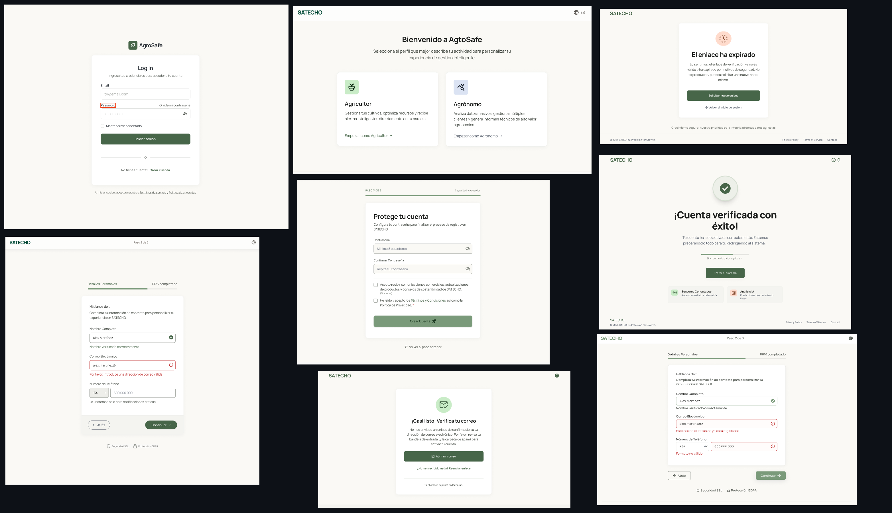
    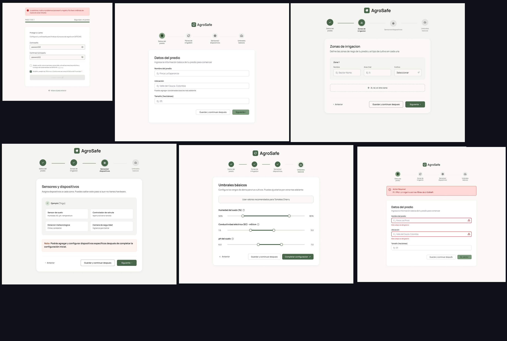
    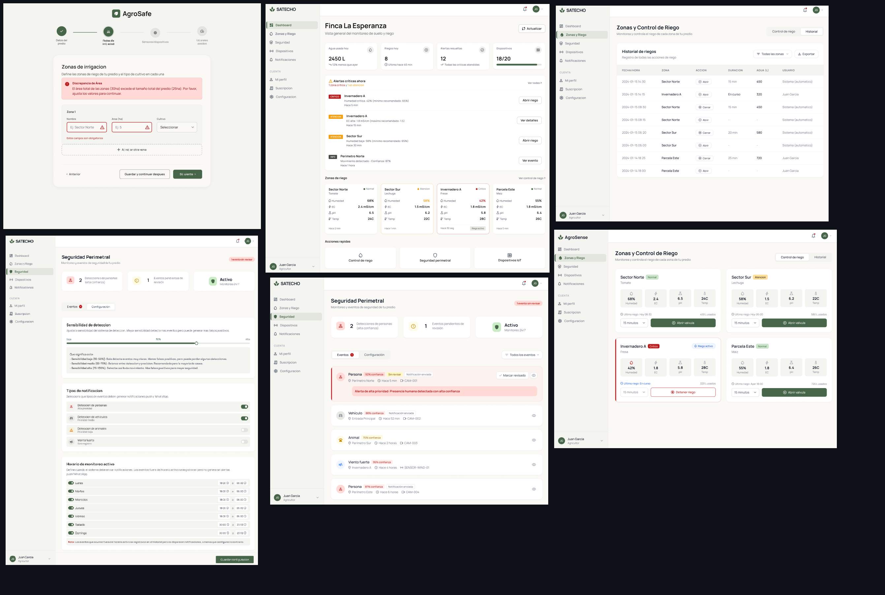
    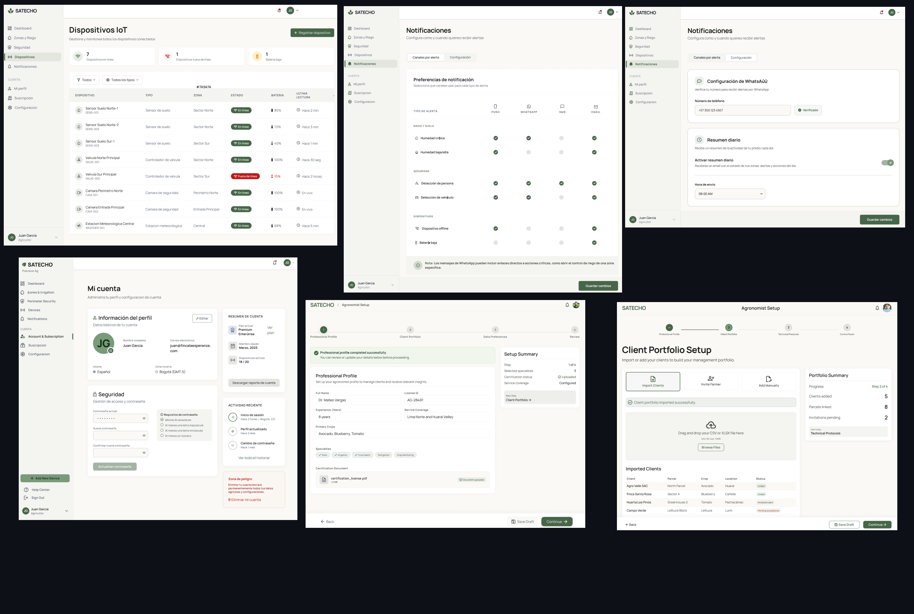
    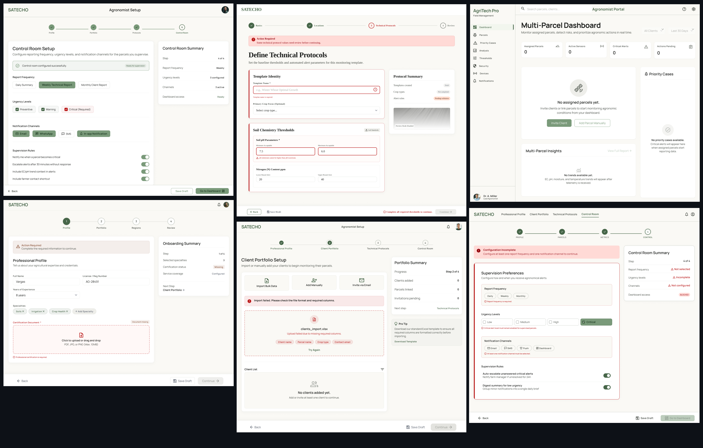
    
    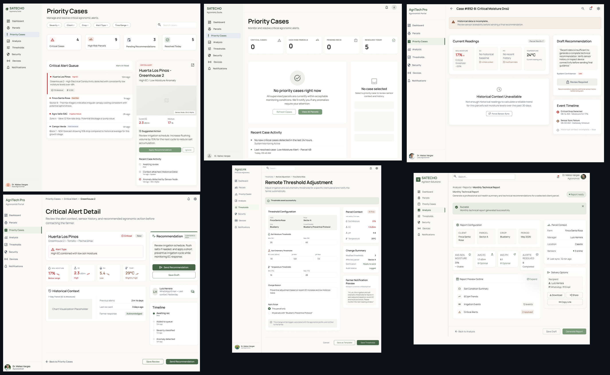
    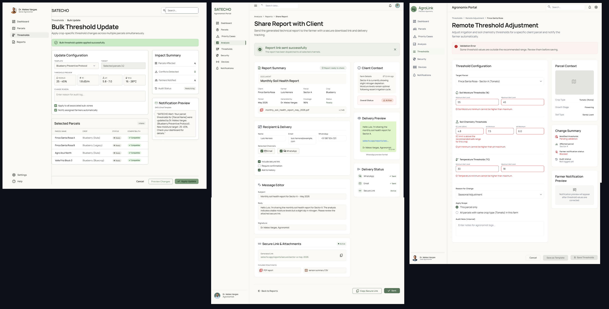
    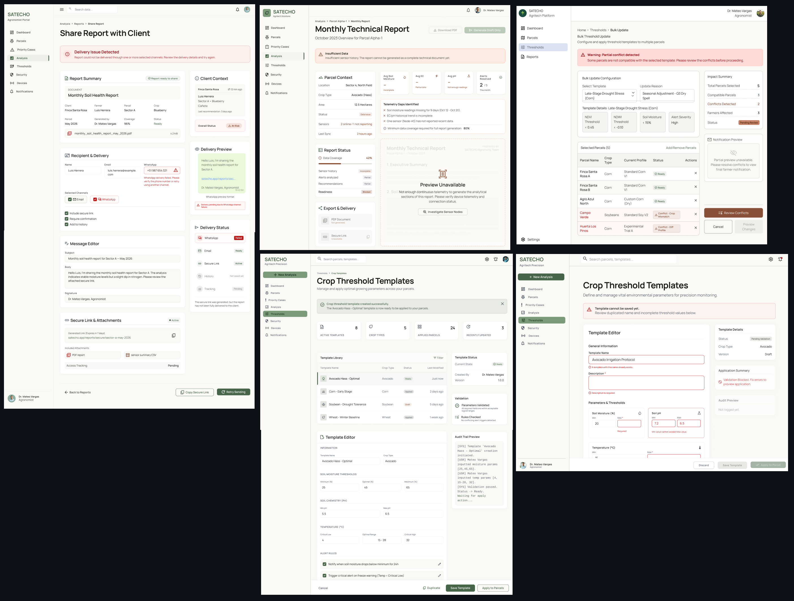
    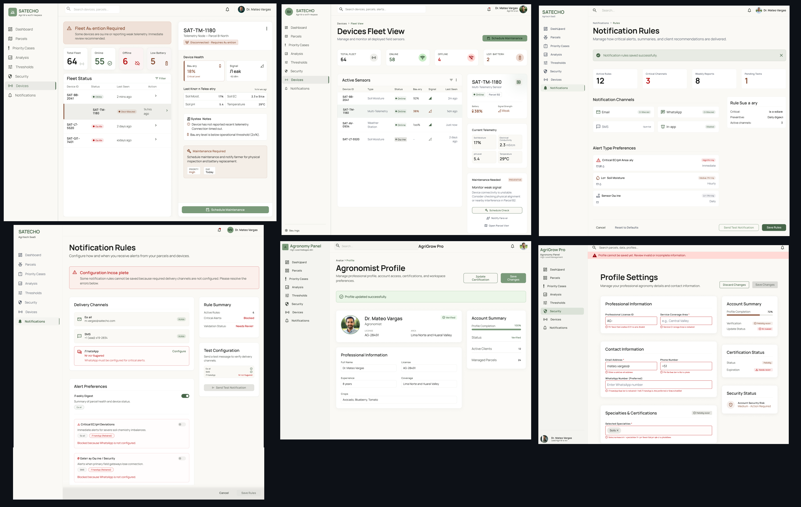
    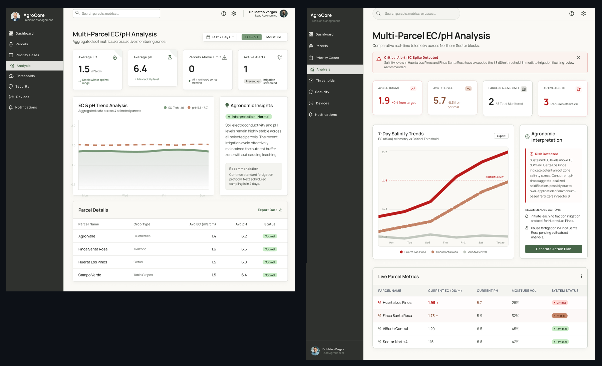
</p>

Link del Figma: https://www.figma.com/design/qC5bkfY7zL1A1EGWeWPWR4/AgroSafe?node-id=79-10117&t=xO8wagJEELxWIC7s-1 

**Mobile Application Mock-ups**
<p align="center">
   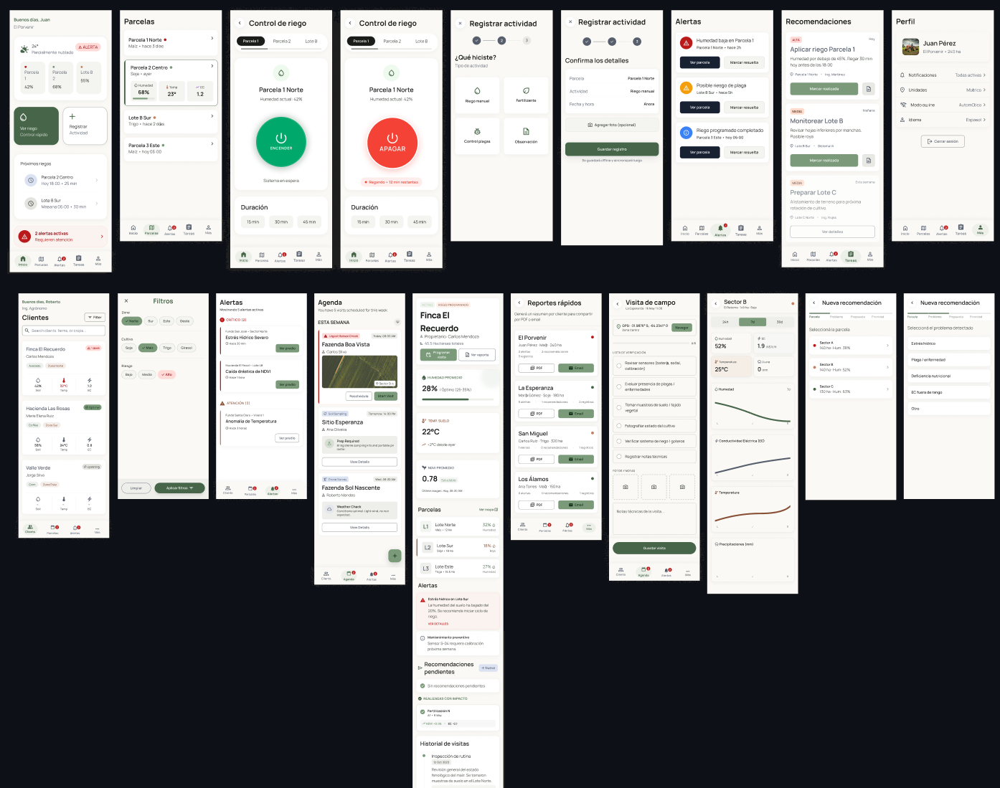
   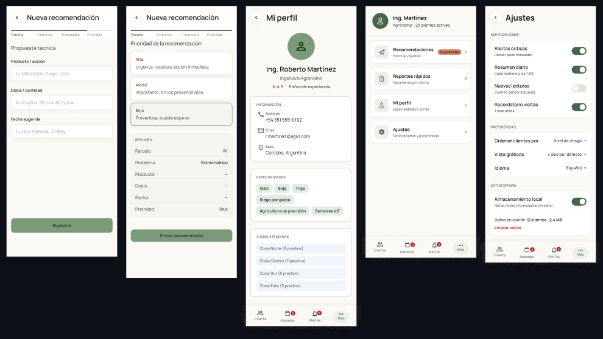
</p>

Link del Figma: [https://www.figma.com/design/qC5bkfY7zL1A1EGWeWPWR4/AgroSafe?node-id=62-3&t=xO8wagJEELxWIC7s-1](https://www.figma.com/design/qC5bkfY7zL1A1EGWeWPWR4/AgroSafe?node-id=62-3&t=xO8wagJEELxWIC7s-1)

### 5.4.3. Applications User Flow Diagrams.

#### User flow 1: Registro y Onboarding

 **User Goal:** Como visitante, quiero registrarme en la plataforma, escoger mi rol y comenzar a gestionar mi parcela

**Happy Path**

Inicia cuando el usuario ingresa a la pantalla de inicio de sesión y selecciona la opción “Create Account”. Luego, el sistema le permite escoger el tipo de usuario, ya sea “Farmer” o “Agronomist”, para continuar con el proceso de registro. Después, el usuario completa sus datos personales y crea su cuenta exitosamente. Una vez registrada, la plataforma envía un correo de verificación y el usuario accede a su email para confirmar su cuenta. Tras la verificación exitosa, el sistema redirige nuevamente al login, donde el usuario inicia sesión. Posteriormente, comienza un proceso de configuración inicial guiado mediante varios pasos: primero registra los datos de su propiedad agrícola, luego define las zonas de irrigación, después configura sensores y dispositivos conectados, y finalmente establece los umbrales básicos de monitoreo, como temperatura, humedad y pH. Al completar todos los pasos, la cuenta queda configurada correctamente y el usuario accede al dashboard principal de la plataforma, donde puede visualizar y gestionar toda la información de su sistema agrícola inteligente.

<div align="center"> 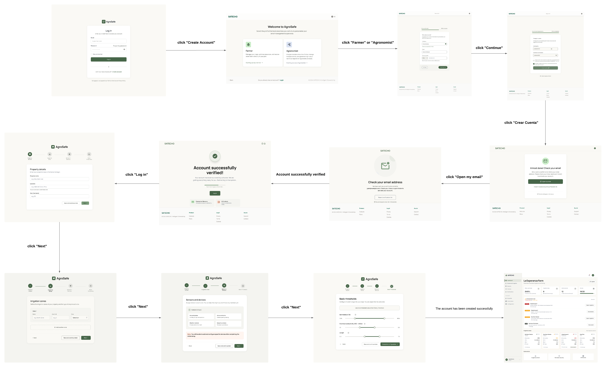 </div>

<br>

**Unhappy Path**

El visitante ingresa de datos que son incorrectos o invalidos. Además, el server no respondió el request de la imagen. Para después ver que hay discrepancia entre las zonas que ha esocogido.

<div align="center"> 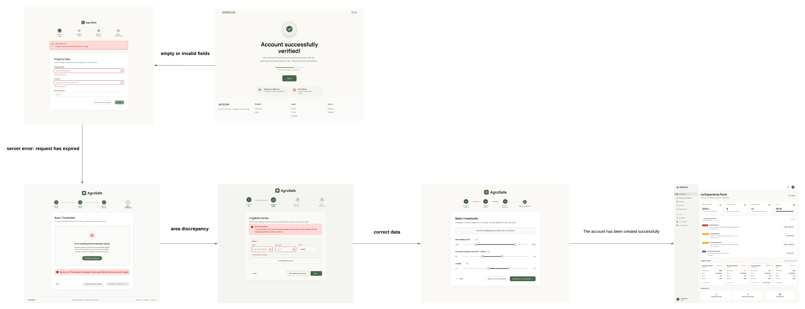 </div>

<br>

#### User flow 2: Login

 **User Goal:** Como visitante, acceder a la plataforma y visualizar el dashboard de mi parcela

**Happy Path**

Inicia cuando el usuario ingresa a la pantalla de inicio de sesión, escribe sus credenciales correctamente e ingrea al dashboard correspondiente.

<div align="center"> 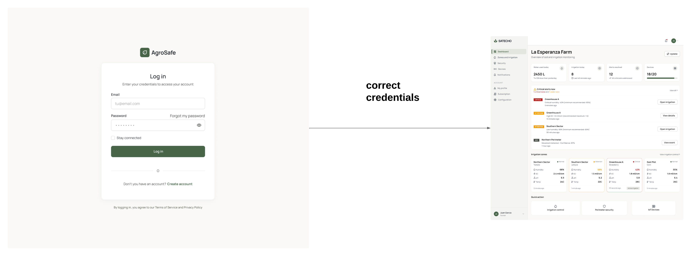 </div>

<br>

**Unhappy Path**

El visitante ingresa de datos que son incorrectos o están vacíos lo que detendrá el avance al dashboard hasta que se escriba los datos correctos.

<div align="center"> 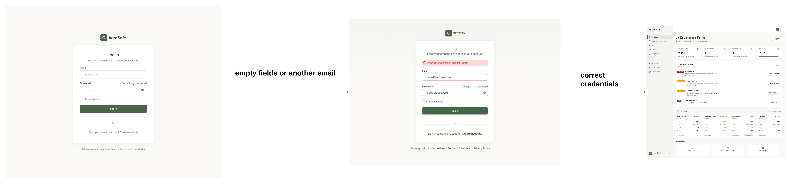 </div>

<br>

## 5.5. Applications Prototyping.

## 5.6. IoT Device Design.

### Diseño del dispositivo IoT
Además del diseño de experiencia e interfaces de las aplicaciones web y móviles, es necesario detallar el diseño del dispositivo IoT encargado del monitoreo ambiental y agrícola mediante sensores de humedad de suelo, temperatura, humedad ambiental y detección de movimiento.

Por un lado, se utiliza la metodología de diseño de dispositivos IoT en 12 pasos propuesta por Eulalia Balestrieri et al., la cual permite estructurar la arquitectura física, lógica y de procesamiento del sistema considerando restricciones de energía, latencia y procesamiento distribuido.

<div align="center"> 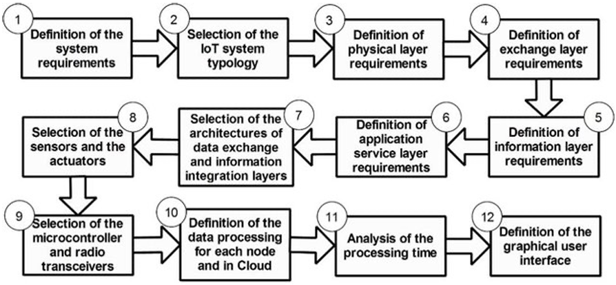 </div>

### Paso 1: Definición de los requisitos del sistema
En este paso se consideran los requisitos generales del sistema IoT relacionados con la capacidad de suministro energético y las restricciones de tiempo de respuesta del dispositivo. Estos requisitos permiten definir posteriormente la arquitectura física, lógica y de comunicación del sistema.

<table>
  <tr>
    <th>Criterio</th>
    <th>Detalle</th>
  </tr>

  <tr>
    <td rowspan="3"><strong>Capacidades de suministro de energía</strong></td>
    <td>
      <strong>Centro de operación:</strong>
      El sistema operará en entornos cerrados (más específicamente, en almacenes) de las tiendas retail y restaurantes donde se dispone de acceso constante a la red eléctrica comercial.
    </td>
  </tr>

  <tr>
    <td>
      <strong>Entrada de alimentación:</strong>
      Se requiere una entrada de alimentación estándar (enchufe) que proporcione <strong>5V DC</strong> con una capacidad de corriente mínima de <strong>2 A</strong> para cubrir el consumo del microcontrolador y los sensores periféricos.
    </td>
  </tr>

  <tr>
    <td>
      <strong>Limitaciones:</strong>
      No se contempla el uso de baterías ni sistemas de recolección de energía (harvesting).
    </td>
  </tr>

  <tr>
    <td rowspan="4"><strong>Restricciones de time-delay</strong></td>
    <td>
      <strong>Sistema basado en eventos:</strong>
      El sistema operará bajo un modelo de programación reactiva (event-driven) para optimizar la eficiencia del procesamiento en el borde (Edge Analytics).
    </td>
  </tr>

  <tr>
    <td>
      <strong>Reacción ante cambios físicos:</strong>
      La detección de cambios físicos (cambios de peso ≥ 5–10 g) deberá activar una notificación inmediata con un tiempo de respuesta en el nodo no mayor a 300 ms.
    </td>
  </tr>

  <tr>
    <td>
      <strong>Lectura de estado de salud:</strong>
      Para garantizar la calidad de servicio (QoS) y la detección de fallos de red, el sistema enviará un mensaje de estado ("heartbeat") cada 60 segundos en ausencia de eventos.
    </td>
  </tr>

  <tr>
    <td>
      <strong>Reacción ante eventos críticos:</strong>
      Ante un evento crítico (discrepancia detectada o temperatura fuera de rango), el sistema priorizará este paquete sobre el tráfico normal, garantizando una latencia end-to-end (sensor a nube) menor a 2 segundos para permitir una toma de decisiones en tiempo casi real por parte del administrador.
    </td>
  </tr>
</table>

### Paso 2: Elección de la tipología de sistema IoT

En este paso se identifica la tipología adecuada del sistema IoT considerando las capacidades de alimentación energética y las restricciones de retardo temporal definidas previamente. Esto permite establecer el comportamiento operativo del sistema y orientar las decisiones arquitectónicas de los siguientes pasos.

<table>
  <tr>
    <th>Parámetro de clasificación</th>
    <th>Estructura definida</th>
    <th>Justificación técnica</th>
  </tr>

  <tr>
    <td><strong>Capacidades de suministro de energía</strong></td>
    <td>System alimentado por red eléctrica (Network-powered IoT System)</td>
    <td>
      El nodo IoT basado en ESP32 operará conectado a una fuente de alimentación estable de 5V DC mediante adaptador externo, debido a que el sistema requiere conectividad WiFi continua, procesamiento local y operación simultánea de múltiples sensores ambientales.
    </td>
  </tr>

  <tr>
    <td><strong>Restricción de retardo (time-delay)</strong></td>
    <td>Low Delay / Near Real-Time System</td>
    <td>
      El sistema debe responder rápidamente ante eventos críticos, especialmente en la detección de movimiento mediante el sensor PIR HC-SR501, donde la notificación y procesamiento deberán ocurrir en un tiempo menor a 2 segundos. Asimismo, las interrupciones permiten minimizar la latencia en la captura de eventos físicos.
    </td>
  </tr>

  <tr>
    <td><strong>Modelo de procesamiento</strong></td>
    <td>Edge Computing</td>
    <td>
      El procesamiento preliminar de datos se realiza localmente en el ESP32 mediante filtros, validación y priorización de eventos antes de transmitir la información al backend monolítico, reduciendo tráfico de red y tiempos de respuesta.
    </td>
  </tr>

  <tr>
    <td><strong>Modelo de operación</strong></td>
    <td>Event-Driven + Time-Triggered Hybrid System</td>
    <td>
      El sistema combina eventos por interrupciones para sensores críticos (PIR) y temporizadores programados para lecturas periódicas de sensores ambientales como DHT11, YL-69, DS18B20 y HR202L.
    </td>
  </tr>

  <tr>
    <td><strong>Tipología final</strong></td>
    <td>Network-powered Edge-based IIoT Monitoring System</td>
    <td>
      La solución corresponde a un sistema IoT industrial/agroambiental alimentado por red eléctrica, con capacidades de Edge Computing y procesamiento híbrido basado en interrupciones y tareas temporizadas.
    </td>
  </tr>
</table>

### Paso 3: Definición de requisitos para la capa física

En este paso se definen los nodos, sensores, actuadores y requerimientos físicos del sistema IoT. Asimismo, se establecen los niveles de precisión esperados, el tipo de señales utilizadas y la capacidad de procesamiento necesaria en el nodo Edge basado en ESP32.

<table>
  <tr>
    <th>Parámetro</th>
    <th>Definición</th>
  </tr>

  <tr>
    <td><strong>Número y tipos de nodos, sensores y actuadores</strong></td>
    <td>
      - Se requiere 1 nodo IoT principal basado en ESP32 para el monitoreo ambiental y agrícola.<br><br>
      - Sensores:<br>
      • 1 sensor de humedad de suelo YL-69<br>
      • 1 sensor DHT11 para temperatura y humedad ambiental<br>
      • 1 sensor PIR HC-SR501 para detección de movimiento<br>
      • 1 sensor DS18B20 impermeable para temperatura exterior/líquidos<br>
      • 1 sensor HR202L para humedad ambiental resistiva<br><br>
      - Actuadores:<br>
      • 1 LED RGB para alertas visuales y estado del sistema
    </td>
  </tr>

  <tr>
    <td><strong>Target uncertainty relacionada con las cantidades físicas medidas por cada sensor</strong></td>
    <td>
      - Sensor YL-69: precisión aproximada de ±5% en humedad de suelo.<br>
      - Sensor DHT11: precisión de ±2 °C para temperatura y ±5% HR para humedad relativa.<br>
      - Sensor DS18B20: precisión máxima de ±0.5 °C en el rango operacional.<br>
      - Sensor HR202L: precisión aproximada de ±3% HR.<br>
      - Sensor PIR HC-SR501: detección de movimiento con alcance aproximado de 7 metros y ángulo de 120°.
    </td>
  </tr>

  <tr>
    <td><strong>Target accuracy and precision de los actuadores</strong></td>
    <td>
      - El LED RGB deberá reflejar correctamente el estado del sistema y las alertas críticas en tiempo real.<br>
      - El cambio de estado visual deberá ejecutarse con una latencia menor a 1 segundo desde la detección del evento.
    </td>
  </tr>

  <tr>
    <td><strong>Interfaces físicas y señales utilizadas</strong></td>
    <td>
      - Señales analógicas: YL-69 y HR202L mediante ADC del ESP32.<br>
      - Señales digitales: DHT11 y HC-SR501.<br>
      - Comunicación One-Wire: DS18B20.<br>
      - Señales PWM: LED RGB para notificaciones visuales.
    </td>
  </tr>

  <tr>
    <td><strong>Processing Power para los algoritmos de procesamiento implementados en el nodo</strong></td>
    <td>
      - El nodo deberá disponer de al menos 520 KB de SRAM para manejo de buffers, tareas FreeRTOS y conectividad WiFi.<br><br>
      - Se implementarán algoritmos de procesamiento Edge tales como:<br>
      1) Filtro de media móvil para estabilización de lecturas.<br>
      2) Validación y descarte de outliers.<br>
      3) Priorización de eventos mediante interrupciones.<br>
      4) Compensación de lecturas usando calibración basada en temperatura.
    </td>
  </tr>

  <tr>
    <td><strong>Requerimientos eléctricos</strong></td>
    <td>
      - Alimentación principal de 5V DC.<br>
      - Voltaje operativo del ESP32: 3.3V.<br>
      - Consumo máximo estimado: 500 mA durante transmisión WiFi.<br>
      - Regulador de voltaje AMS1117-3.3V para estabilización energética.
    </td>
  </tr>
</table>

### Paso 4: Definición de requisitos para la capa de intercambio de datos

En este paso se define la forma en la que los datos son transportados desde el nodo IoT hacia la infraestructura backend. Asimismo, se establecen restricciones de latencia, protocolos de comunicación, topología de red y mecanismos de seguridad para garantizar una transmisión confiable y segura.

<table>
  <tr>
    <th>Parámetro</th>
    <th>Definición</th>
  </tr>

  <tr>
    <td><strong>Máximo time-delay permitido</strong></td>
    <td>
      El tiempo máximo de transmisión desde el nodo ESP32 hacia el backend no deberá exceder los 2 segundos para eventos críticos como detección de movimiento o alertas ambientales, permitiendo una respuesta en tiempo casi real.
    </td>
  </tr>

  <tr>
    <td><strong>Tipología de comunicación</strong></td>
    <td>
      Se requiere comunicación inalámbrica (wireless) mediante WiFi, debido a la necesidad de flexibilidad de instalación, facilidad de despliegue y transmisión continua de datos ambientales sin depender de cableado físico.
    </td>
  </tr>

  <tr>
    <td><strong>Tipología de la red</strong></td>
    <td>
      Topología estrella (Star Topology), donde el nodo ESP32 se comunica directamente con un router o punto de acceso central conectado al backend monolítico.
    </td>
  </tr>

  <tr>
    <td><strong>Distancias de comunicación</strong></td>
    <td>
      El sistema deberá operar en rangos aproximados de 30 a 50 metros en interiores y hasta 150 metros en exteriores abiertos, dependiendo de obstáculos físicos y condiciones de señal WiFi.
    </td>
  </tr>

  <tr>
    <td><strong>Protocolo de transporte y aplicación</strong></td>
    <td>
      - Transporte inalámbrico: WiFi IEEE 802.11 b/g/n (2.4 GHz).<br>
      - Protocolo de aplicación: HTTPS REST API.<br>
      - Método principal de transmisión: HTTP POST.<br>
      - Formato de intercambio de datos: JSON.
    </td>
  </tr>

  <tr>
    <td><strong>Consumo de potencia máximo en comunicación</strong></td>
    <td>
      El módulo WiFi del ESP32 podrá alcanzar consumos de hasta 500 mA durante ráfagas de transmisión activa (Tx/Rx). Debido a que el sistema es alimentado por red eléctrica, este consumo se considera aceptable para garantizar estabilidad y disponibilidad de comunicación.
    </td>
  </tr>

  <tr>
    <td><strong>Calidad de servicio (QoS)</strong></td>
    <td>
      - Eventos críticos como detección de movimiento tendrán prioridad alta y entrega inmediata.<br>
      - Sensores ambientales utilizarán transmisión periódica con tolerancia moderada a retrasos.<br>
      - El sistema implementará reintentos automáticos ante pérdida de conectividad.
    </td>
  </tr>

  <tr>
    <td><strong>Tipo de criptografía y seguridad de datos</strong></td>
    <td>
      - Comunicación segura mediante TLS 1.2/1.3.<br>
      - Compatibilidad con WPA2/WPA3 para autenticación WiFi.<br>
      - Cifrado de datos mediante HTTPS para proteger la integridad y confidencialidad de la telemetría enviada al backend.
    </td>
  </tr>
</table>

### Paso 5: Definición de requisitos para la capa de información

En este paso se definen los usuarios finales del sistema IoT, los servicios requeridos por cada uno y la información necesaria para satisfacer dichos servicios. Asimismo, se establece cómo será distribuido el procesamiento entre el nodo Edge (ESP32) y la nube, considerando la arquitectura basada en interrupciones y adaptación de Domain-Driven Design (DDD).

<table>
  <tr>
    <th>Criterios</th>
    <th>Especificación</th>
  </tr>

  <tr>
    <td rowspan="2"><strong>Definición de usuarios finales</strong></td>
    <td>
      <strong>Operador del sistema:</strong>
      responsable de la supervisión técnica, mantenimiento del nodo ESP32, conectividad y estado general de sensores y servicios IoT.
    </td>
  </tr>

  <tr>
    <td>
      <strong>Administrador o usuario de monitoreo ambiental:</strong>
      encargado de visualizar variables ambientales, recibir alertas y supervisar condiciones de humedad, temperatura y eventos críticos detectados por el sistema.
    </td>
  </tr>

  <tr>
    <td rowspan="2"><strong>Servicios por usuario final identificado</strong></td>
    <td>
      <strong>Operador del sistema:</strong>
      monitoreo del estado del nodo, conectividad WiFi, disponibilidad del sistema, intensidad de señal (RSSI) y funcionamiento de sensores.
    </td>
  </tr>

  <tr>
    <td>
      <strong>Administrador o usuario de monitoreo:</strong>
      visualización de datos ambientales en tiempo real, acceso al histórico de mediciones, configuración de umbrales y recepción de alertas por condiciones críticas.
    </td>
  </tr>

  <tr>
    <td rowspan="5"><strong>Necesidades de información para satisfacer cada servicio identificado</strong></td>
    <td>
      <strong>Supervisión del estado del dispositivo:</strong>
      se requieren datos de uptime, intensidad de señal WiFi (RSSI), estado de conexión y nivel de estabilidad energética del nodo.
    </td>
  </tr>

  <tr>
    <td>
      <strong>Monitoreo ambiental:</strong>
      se requieren lecturas periódicas de humedad de suelo, temperatura ambiental, humedad relativa y temperatura exterior/líquidos.
    </td>
  </tr>

  <tr>
    <td>
      <strong>Detección de eventos críticos:</strong>
      se requieren datos inmediatos provenientes del sensor PIR HC-SR501 y evaluación de umbrales definidos para temperatura y humedad.
    </td>
  </tr>

  <tr>
    <td>
      <strong>Gestión de alertas:</strong>
      se necesitan configuraciones de límites críticos definidos por el usuario para activar notificaciones automáticas.
    </td>
  </tr>

  <tr>
    <td>
      <strong>Análisis histórico:</strong>
      se requiere almacenamiento de registros temporales de sensores para generar tendencias y reportes históricos.
    </td>
  </tr>

  <tr>
    <td rowspan="2"><strong>Arquitectura de procesamiento (Nodo vs. Nube)</strong></td>
    <td>
      <strong>En el nodo ESP32 (Edge):</strong>
      adquisición de datos mediante interrupciones y temporizadores, filtrado de ruido, validación de lecturas, descarte de valores atípicos y priorización de eventos críticos.
    </td>
  </tr>

  <tr>
    <td>
      <strong>En la nube (Backend monolítico):</strong>
      almacenamiento histórico, agregación de datos, análisis estadístico, generación de reportes y administración de alertas y usuarios.
    </td>
  </tr>

  <tr>
    <td rowspan="2"><strong>Evaluación de complejidad computacional</strong></td>
    <td>
      <strong>Nodo ESP32:</strong>
      complejidad baja-media debido al uso de filtros simples, validaciones y procesamiento basado en interrupciones.
    </td>
  </tr>

  <tr>
    <td>
      <strong>Backend Cloud:</strong>
      complejidad media por procesamiento de datos históricos, consultas en base de datos y administración de notificaciones en tiempo real.
    </td>
  </tr>

  <tr>
    <td rowspan="2"><strong>Tiempo de procesamiento requerido</strong></td>
    <td>
      <strong>Procesamiento de sensores ambientales:</strong>
      generación y validación de datos en menos de 1 segundo antes de transmisión.
    </td>
  </tr>

  <tr>
    <td>
      <strong>Eventos críticos y alertas:</strong>
      detección, procesamiento y notificación en menos de 2 segundos desde la ocurrencia del evento físico.
    </td>
  </tr>

  <tr>
    <td><strong>Modelo de información (DDD adaptado)</strong></td>
    <td>
      El sistema implementa una adaptación de Domain-Driven Design (DDD) en el software embebido. Cada sensor se representa mediante clases desacopladas responsables de adquisición, validación, calibración y publicación de eventos, eliminando la dependencia de un <code>loop()</code> tradicional y favoreciendo una arquitectura basada en interrupciones y eventos.
    </td>
  </tr>
</table>

### Paso 6: Definición de requisitos para la capa de servicios de aplicación

Luego de definir la información y los usuarios del sistema, en este paso se especifican los servicios de aplicación responsables de coordinar la lógica de negocio, la comunicación entre capas y la interacción con las interfaces del sistema IoT. Asimismo, se determina la complejidad computacional asociada a cada servicio.

<table>
  <tr>
    <th>Requisitos</th>
    <th>Especificación de requisitos asociados</th>
    <th>Complejidad de algoritmos en dispositivo/usuario</th>
  </tr>

  <tr>
    <td><strong>Servicio de monitoreo ambiental en tiempo real</strong></td>
    <td>
      - Visualización en dashboard web de humedad de suelo, temperatura y humedad ambiental.<br>
      - Actualización periódica de métricas provenientes del ESP32.<br>
      - Visualización del estado de sensores y conectividad del nodo.
    </td>
    <td>
      Baja: renderizado de datos y actualización dinámica de métricas en tiempo real.
    </td>
  </tr>

  <tr>
    <td><strong>Servicio de recolección y procesamiento de datos</strong></td>
    <td>
      - Captura de datos mediante interrupciones y temporizadores programados.<br>
      - Aplicación de filtros de media móvil y validación de lecturas.<br>
      - Priorización de eventos críticos antes de transmisión.
    </td>
    <td>
      Media: procesamiento Edge local utilizando tareas desacopladas y colas de eventos.
    </td>
  </tr>

  <tr>
    <td><strong>Servicio de alertas y eventos críticos</strong></td>
    <td>
      - Generación de alertas por humedad baja, temperatura elevada o detección de movimiento.<br>
      - Envío de notificaciones en tiempo real hacia la aplicación web.<br>
      - Priorización de paquetes críticos sobre tráfico normal.
    </td>
    <td>
      Baja: evaluación de reglas y disparadores basados en umbrales.
    </td>
  </tr>

  <tr>
    <td><strong>Servicio de conectividad y sincronización</strong></td>
    <td>
      - Gestión de conexión WiFi y reconexión automática.<br>
      - Almacenamiento temporal local cuando no existe conectividad.<br>
      - Sincronización diferida con el backend cuando la conexión es restaurada.
    </td>
    <td>
      Media: manejo de estados de red, colas de sincronización y control de errores.
    </td>
  </tr>

  <tr>
    <td><strong>Servicio de gestión energética</strong></td>
    <td>
      - Control de modos Deep Sleep del ESP32.<br>
      - Activación mediante RTC timers e interrupciones externas.<br>
      - Desactivación de periféricos no utilizados para reducir consumo energético.
    </td>
    <td>
      Baja: programación de temporizadores y control de periféricos.
    </td>
  </tr>

  <tr>
    <td><strong>Servicio de visualización histórica y analítica</strong></td>
    <td>
      - Gráficos históricos de temperatura, humedad y eventos detectados.<br>
      - Consulta de registros almacenados en la nube.<br>
      - Generación de reportes y tendencias ambientales.
    </td>
    <td>
      Media: procesamiento de datos históricos y renderizado de gráficos dinámicos.
    </td>
  </tr>

  <tr>
    <td><strong>Servicio de mantenimiento y supervisión del nodo</strong></td>
    <td>
      - Supervisión de estado de sensores y disponibilidad del ESP32.<br>
      - Generación de alertas por desconexión o fallos de sensores.<br>
      - Monitoreo de RSSI y uptime del dispositivo.
    </td>
    <td>
      Baja: verificación periódica de estados y envío de notificaciones.
    </td>
  </tr>
</table>

#### Reglas de negocio implementadas
- Si la humedad del suelo es menor al 30%, se genera una alerta de riego.
- Si el sensor PIR detecta movimiento, se genera una alerta de seguridad.
- Si la temperatura supera los 40 °C, se genera una alerta crítica.
- Si un sensor deja de responder o entrega valores inválidos, se genera una alerta de mantenimiento.
- Los eventos críticos tendrán prioridad de transmisión sobre las lecturas periódicas ambientales.

### Paso 7: Selección de la arquitectura de intercambio de datos e integración de información

Con los requisitos definidos en los pasos anteriores, se selecciona la arquitectura final para las capas de intercambio de datos e integración de información del sistema IoT agrícola.
Asimismo, se evalúan los tiempos de comunicación para verificar que el sistema cumpla con las restricciones de latencia definidas previamente.

<table>
  <tr>
    <th>Capa</th>
    <th>Arquitectura seleccionada</th>
    <th>Justificación técnica</th>
  </tr>

  <tr>
    <td><strong>Intercambio de Datos</strong></td>
    <td>Arquitectura basada en eventos (Event-Driven)</td>
    <td>
      El sistema utiliza una arquitectura orientada a eventos debido a la naturaleza reactiva de los sensores críticos como el PIR HC-SR501. La comunicación entre el nodo ESP32 y el backend se realiza mediante HTTPS sobre WiFi, permitiendo el envío inmediato de eventos críticos y telemetría ambiental. Además, el uso de interrupciones y temporizadores evita el uso de un <code>loop()</code> tradicional, optimizando el rendimiento del procesamiento Edge.
    </td>
  </tr>

  <tr>
    <td><strong>Integración de Información</strong></td>
    <td>Arquitectura Monolítica Modular</td>
    <td>
      Se selecciona un backend monolítico modular para centralizar la lógica de negocio, autenticación, almacenamiento y procesamiento de datos ambientales. Esta arquitectura simplifica el despliegue inicial, facilita el mantenimiento del sistema y permite integrar servicios de alertas, análisis histórico y visualización de datos dentro de una única plataforma.
    </td>
  </tr>
</table>

#### Arquitectura lógica del dispositivo

```text
┌─────────────────────────────────────┐
│ Presentation Layer (REST/HTTPS)     │
├─────────────────────────────────────┤
│ Application Services Layer          │
│ (Interrupt Manager + Services)      │
├─────────────────────────────────────┤
│ Domain Layer (DDD Adaptation)       │
│ Entities + Aggregates + Rules       │
├─────────────────────────────────────┤
│ Infrastructure Layer                │
│ GPIO + ADC + WiFi + Timers          │
└─────────────────────────────────────┘
```

#### Patrón de integración

<table>
  <tr>
    <th>Componente</th>
    <th>Tecnología seleccionada</th>
  </tr>

  <tr>
    <td><strong>Backend</strong></td>
    <td>Arquitectura monolítica modular</td>
  </tr>

  <tr>
    <td><strong>Comunicación</strong></td>
    <td>HTTPS REST</td>
  </tr>

  <tr>
    <td><strong>Base de datos</strong></td>
    <td>PostgreSQL + TimescaleDB</td>
  </tr>

  <tr>
    <td><strong>Comunicación en tiempo real</strong></td>
    <td>WebSocket</td>
  </tr>

  <tr>
    <td><strong>Proxy / API Gateway</strong></td>
    <td>Nginx</td>
  </tr>
</table>


#### Análisis de retardo en la comunicación

<table>
  <tr>
    <th>Segmento del flujo de datos</th>
    <th>Acción técnica</th>
    <th>Retardo estimado (ms)</th>
    <th>Justificación</th>
  </tr>

  <tr>
    <td><strong>Sensor → ESP32</strong></td>
    <td>Lectura mediante interrupciones o temporizadores</td>
    <td>10 – 50 ms</td>
    <td>
      Las lecturas de sensores ambientales se realizan mediante timers, mientras que el PIR utiliza interrupciones GPIO para respuesta inmediata.
    </td>
  </tr>

  <tr>
    <td><strong>ESP32 → Backend</strong></td>
    <td>Envío HTTPS vía WiFi</td>
    <td>100 – 500 ms</td>
    <td>
      El ESP32 transmite paquetes JSON hacia el backend utilizando WiFi 802.11 b/g/n y HTTPS con TLS 1.2.
    </td>
  </tr>

  <tr>
    <td><strong>Backend → Base de Datos</strong></td>
    <td>Persistencia y validación de datos</td>
    <td>50 – 100 ms</td>
    <td>
      El backend procesa la información recibida y la almacena en PostgreSQL y TimescaleDB para análisis histórico.
    </td>
  </tr>

  <tr>
    <td><strong>Backend → Dashboard Web</strong></td>
    <td>Actualización vía WebSocket</td>
    <td>100 – 300 ms</td>
    <td>
      Las alertas y datos en tiempo real se transmiten inmediatamente hacia la interfaz web del usuario.
    </td>
  </tr>

  <tr>
    <td><strong>Total Estimado (End-to-End)</strong></td>
    <td>Latencia total del sistema</td>
    <td>&lt; 2 s</td>
    <td>
      La latencia total estimada cumple con el límite máximo definido en los requisitos de QoS del sistema.
    </td>
  </tr>
</table>

### Paso 8: Selección de sensores y actuadores

Al tener definida la arquitectura del sistema y los requisitos de comunicación y procesamiento, se seleccionan los sensores y actuadores que cumplen con las necesidades funcionales, eléctricas y de precisión del sistema IoT agrícola.

<table>
  <tr>
    <th>Sensor o actuador identificado</th>
    <th>Modelo elegido</th>
    <th>Justificación técnica</th>
  </tr>

  <tr>
    <td><strong>Medición de humedad de suelo</strong></td>
    <td>Sensor YL-69 + módulo YL-38</td>
    <td>
      El sensor YL-69 permite medir niveles de humedad del suelo mediante salida analógica y digital. Se selecciona por su bajo costo, facilidad de integración con ESP32 y compatibilidad con sistemas de monitoreo agrícola y riego automático. El módulo YL-38 incorpora un comparador LM393 que facilita la calibración y detección de umbrales.
    </td>
  </tr>

  <tr>
    <td><strong>Medición de temperatura y humedad ambiental</strong></td>
    <td>Sensor digital DHT11</td>
    <td>
      El DHT11 permite medir simultáneamente temperatura y humedad ambiental utilizando un único pin digital. Se selecciona por su simplicidad de integración, bajo consumo energético y suficiente precisión para aplicaciones de monitoreo ambiental básico.
    </td>
  </tr>

  <tr>
    <td><strong>Detección de movimiento</strong></td>
    <td>Sensor PIR HC-SR501</td>
    <td>
      El HC-SR501 detecta movimiento mediante radiación infrarroja pasiva (PIR), siendo ideal para sistemas de seguridad y monitoreo. Además, permite trabajar mediante interrupciones GPIO del ESP32, reduciendo el consumo energético y mejorando la capacidad de respuesta del sistema.
    </td>
  </tr>

  <tr>
    <td><strong>Medición de temperatura en líquidos y exteriores</strong></td>
    <td>Sensor DS18B20 Waterproof</td>
    <td>
      El DS18B20 proporciona mediciones digitales de temperatura con una precisión aproximada de ±0.5°C. Su encapsulado impermeable permite operar en ambientes húmedos, exteriores o contacto con líquidos. Asimismo, utiliza protocolo 1-Wire, reduciendo el uso de pines del microcontrolador.
    </td>
  </tr>

  <tr>
    <td><strong>Medición resistiva de humedad ambiental</strong></td>
    <td>Sensor HR202L</td>
    <td>
      El HR202L funciona mediante variación resistiva de humedad relativa ambiental. Se utiliza como complemento del DHT11 para realizar comparaciones y validación cruzada de lecturas ambientales.
    </td>
  </tr>

  <tr>
    <td><strong>Indicador visual del sistema (Actuador)</strong></td>
    <td>LED RGB</td>
    <td>
      El LED RGB permite indicar visualmente el estado operativo del sistema, alertas críticas y conectividad WiFi. Además, presenta bajo consumo energético y fácil integración mediante señales PWM del ESP32.
    </td>
  </tr>
</table>

### Paso 9: Selección del microcontrolador y transceptores de radio

Luego de seleccionar los sensores y actuadores del sistema, se define el microcontrolador encargado del procesamiento local y el transceptor de radio utilizado para la comunicación inalámbrica con la infraestructura backend.

<table>
  <tr>
    <th>Nodo asignado</th>
    <th>Modelo seleccionado</th>
    <th>Transceptor de radio</th>
    <th>Justificación técnica</th>
  </tr>

  <tr>
    <td><strong>Nodo IoT principal</strong></td>
    <td>ESP32-WROOM-32 / ESP32 DevKit V1</td>
    <td>WiFi 802.11 b/g/n integrado</td>
    <td>
      El ESP32 fue seleccionado debido a su capacidad de procesamiento dual-core de 240 MHz, conectividad WiFi integrada y soporte para múltiples periféricos analógicos y digitales. Además, permite implementar arquitecturas basadas en interrupciones, temporizadores RTC y multitarea mediante FreeRTOS, eliminando la necesidad de un <code>loop()</code> tradicional. Cuenta con suficientes GPIO para la integración simultánea de sensores analógicos, digitales y actuadores visuales.
    </td>
  </tr>

  <tr>
    <td><strong>Comunicación inalámbrica</strong></td>
    <td>WiFi integrado ESP32</td>
    <td>IEEE 802.11 b/g/n (2.4 GHz)</td>
    <td>
      La conectividad WiFi integrada permite la transmisión directa de datos hacia el backend monolítico mediante HTTPS, evitando el uso de módulos externos adicionales. Asimismo, soporta protocolos de seguridad WPA2/WPA3 y cifrado TLS para garantizar la protección de la información transmitida.
    </td>
  </tr>
</table>

#### Especificaciones principales del ESP32

<table>
  <tr>
    <th>Parámetro</th>
    <th>Valor</th>
  </tr>

  <tr>
    <td><strong>CPU</strong></td>
    <td>Dual-core Tensilica LX6 @ 240 MHz</td>
  </tr>

  <tr>
    <td><strong>Memoria RAM</strong></td>
    <td>520 KB SRAM</td>
  </tr>

  <tr>
    <td><strong>Memoria Flash</strong></td>
    <td>4 MB</td>
  </tr>

  <tr>
    <td><strong>ADC</strong></td>
    <td>12 bits</td>
  </tr>

  <tr>
    <td><strong>GPIO disponibles</strong></td>
    <td>34 pines</td>
  </tr>

  <tr>
    <td><strong>Conectividad WiFi</strong></td>
    <td>2.4 GHz IEEE 802.11 b/g/n</td>
  </tr>

  <tr>
    <td><strong>Bluetooth</strong></td>
    <td>BLE 4.2</td>
  </tr>

  <tr>
    <td><strong>Consumo en Deep Sleep</strong></td>
    <td>~10 μA</td>
  </tr>
</table>

#### Justificación técnica adicional
El ESP32 permite implementar las siguientes capacidades necesarias para el sistema IoT agrícola:

- procesamiento concurrente mediante FreeRTOS
- interrupciones externas para eventos críticos
- temporizadores RTC para tareas periódicas
- comunicación segura mediante HTTPS/TLS
- procesamiento Edge local
- arquitectura híbrida Event-Driven + Time-Triggered

Asimismo, posee suficiente capacidad computacional para ejecutar filtros de suavizado, validación de lecturas, gestión de colas de eventos y lógica de dominio basada en una adaptación de Domain-Driven Design (DDD) para sistemas embebidos.

### Paso 10: Definición del procesamiento de datos en cada nodo y en la nube

En esta etapa se definen los algoritmos responsables del procesamiento de datos dentro del ecosistema IoT agrícola.
Los algoritmos se distribuyen entre el nodo ESP32 (Edge Computing) y el backend monolítico en la nube, permitiendo optimizar el rendimiento, reducir la latencia y mejorar la calidad de la información procesada.

<table>
  <tr>
    <th>Algoritmo a implementar</th>
    <th>Responsabilidad</th>
    <th>Ubicación</th>
  </tr>

  <tr>
    <td><strong>Algoritmo de filtrado de ruido</strong></td>
    <td>
      Aplica filtros de promedio móvil y suavizado para estabilizar las lecturas analógicas provenientes de los sensores YL-69 y HR202L, reduciendo fluctuaciones eléctricas y ruido ambiental.
    </td>
    <td>En el Nodo IoT (ESP32)</td>
  </tr>

  <tr>
    <td><strong>Algoritmo de validación de datos</strong></td>
    <td>
      Verifica que las lecturas obtenidas se encuentren dentro de rangos válidos previamente definidos, descartando valores atípicos o inconsistentes.
    </td>
    <td>En el Nodo IoT (ESP32)</td>
  </tr>

  <tr>
    <td><strong>Algoritmo de compensación térmica</strong></td>
    <td>
      Compensa las variaciones del sensor de humedad de suelo YL-69 utilizando la temperatura obtenida desde el sensor DS18B20 para mejorar la estabilidad de la medición.
    </td>
    <td>En el Nodo IoT (ESP32)</td>
  </tr>

  <tr>
    <td><strong>Algoritmo de priorización de eventos</strong></td>
    <td>
      Gestiona la prioridad de procesamiento y transmisión de eventos críticos, otorgando máxima prioridad a detección de movimiento y alertas ambientales.
    </td>
    <td>En el Nodo IoT (ESP32)</td>
  </tr>

  <tr>
    <td><strong>Algoritmo de compresión de datos</strong></td>
    <td>
      Reduce el tamaño del payload JSON mediante técnicas simples de compactación y eliminación de redundancia antes de la transmisión inalámbrica.
    </td>
    <td>En el Nodo IoT (ESP32)</td>
  </tr>

  <tr>
    <td><strong>Algoritmo de gestión por interrupciones</strong></td>
    <td>
      Administra la ejecución de tareas mediante interrupciones GPIO y temporizadores RTC, evitando el uso de un <code>loop()</code> tradicional y optimizando el procesamiento Edge.
    </td>
    <td>En el Nodo IoT (ESP32)</td>
  </tr>

  <tr>
    <td><strong>Algoritmo de validación de payload</strong></td>
    <td>
      Verifica la estructura y consistencia de los datos JSON recibidos desde los nodos IoT antes de almacenarlos en la base de datos.
    </td>
    <td>En la nube (Backend)</td>
  </tr>

  <tr>
    <td><strong>Algoritmo de agregación histórica</strong></td>
    <td>
      Genera promedios y estadísticas horarias, diarias y semanales para análisis histórico y visualización en dashboards.
    </td>
    <td>En la nube (Backend)</td>
  </tr>

  <tr>
    <td><strong>Algoritmo de generación de alertas</strong></td>
    <td>
      Evalúa reglas de negocio relacionadas con humedad, temperatura, conectividad y movimiento para emitir alertas en tiempo real.
    </td>
    <td>En la nube (Backend)</td>
  </tr>

  <tr>
    <td><strong>Algoritmo de actualización en tiempo real</strong></td>
    <td>
      Publica eventos y actualizaciones hacia el dashboard web utilizando WebSocket para mantener sincronización inmediata con los usuarios conectados.
    </td>
    <td>En la nube (Backend)</td>
  </tr>

  <tr>
    <td><strong>Algoritmo de generación de reportes</strong></td>
    <td>
      Procesa información histórica almacenada para generar reportes ambientales y estadísticas exportables en formatos CSV y PDF.
    </td>
    <td>En la nube (Backend)</td>
  </tr>
</table>

### Paso 11: Análisis del tiempo de procesamiento

Luego de definir los algoritmos implementados tanto en el nodo ESP32 como en el backend, se analiza el esfuerzo computacional asociado considerando complejidad algorítmica, uso de memoria y tiempo de ejecución estimado.

<table>
  <tr>
    <th>Algoritmo implementado</th>
    <th>Complejidad (Big O)</th>
    <th>Uso en memoria</th>
    <th>Tiempo estimado</th>
    <th>Ubicación</th>
  </tr>

  <tr>
    <td><strong>Filtrado de ruido (promedio móvil)</strong></td>
    <td>O(N)</td>
    <td>Bajo (~2 KB)</td>
    <td>50 ms</td>
    <td>Nodo ESP32</td>
  </tr>

  <tr>
    <td><strong>Validación de datos</strong></td>
    <td>O(1)</td>
    <td>Mínimo (Bytes)</td>
    <td>10 ms</td>
    <td>Nodo ESP32</td>
  </tr>

  <tr>
    <td><strong>Compensación térmica</strong></td>
    <td>O(1)</td>
    <td>Bajo (&lt; 1 KB)</td>
    <td>20 ms</td>
    <td>Nodo ESP32</td>
  </tr>

  <tr>
    <td><strong>Priorización de eventos</strong></td>
    <td>O(1)</td>
    <td>Bajo (&lt; 1 KB)</td>
    <td>&lt; 1 ms</td>
    <td>Nodo ESP32</td>
  </tr>

  <tr>
    <td><strong>Compresión de datos</strong></td>
    <td>O(N)</td>
    <td>Bajo (~2 KB)</td>
    <td>30 ms</td>
    <td>Nodo ESP32</td>
  </tr>

  <tr>
    <td><strong>Validación de payload JSON</strong></td>
    <td>O(N)</td>
    <td>Moderado (~5 KB)</td>
    <td>40 ms</td>
    <td>Backend Monolítico</td>
  </tr>

  <tr>
    <td><strong>Persistencia de datos históricos</strong></td>
    <td>O(log N)</td>
    <td>Moderado (~10 KB)</td>
    <td>100 ms</td>
    <td>Backend Monolítico</td>
  </tr>

  <tr>
    <td><strong>Generación de alertas</strong></td>
    <td>O(1)</td>
    <td>Bajo (&lt; 1 KB)</td>
    <td>20 ms</td>
    <td>Backend Monolítico</td>
  </tr>

  <tr>
    <td><strong>Actualización de dashboard en tiempo real</strong></td>
    <td>O(1)</td>
    <td>Moderado (~5 KB)</td>
    <td>50 ms</td>
    <td>Backend Monolítico</td>
  </tr>
</table>

#### Justificación técnica de los parámetros

1. Complejidad computacional
- Los algoritmos de filtrado y compresión presentan complejidad **O(N)** debido a que procesan múltiples muestras antes de generar una salida estabilizada.  
- Los algoritmos de validación, compensación y priorización utilizan operaciones aritméticas simples y comparaciones directas, por lo que operan en tiempo constante **O(1)**.  
- La persistencia histórica en base de datos utiliza índices temporales, por ello se estima una complejidad aproximada de **O(log N)**.  

2. Tiempo de ejecución
- El **ESP32** funcionando a 240 MHz permite ejecutar operaciones de validación y eventos críticos en pocos milisegundos.  
- La detección **PIR** mediante interrupciones posee prioridad máxima y tiempo de respuesta menor a **1 ms**.  
- La lectura del sensor **DS18B20** es la operación más lenta debido al protocolo One-Wire y al tiempo interno de conversión térmica.  

3. Uso de memoria
- El procesamiento local utiliza buffers pequeños y estructuras livianas compatibles con los **520 KB de SRAM** del ESP32.  
- El backend monolítico requiere mayor memoria debido al manejo de conexiones HTTP, persistencia y actualización en tiempo real del dashboard.  

4. Impacto en la QoS del sistema <br>
La suma de tiempos de procesamiento y transmisión se mantiene dentro del límite de latencia definido previamente.  
- **Eventos críticos:** menor a 2 segundos end-to-end.  
- **Lecturas periódicas:** transmisión asíncrona optimizada mediante procesamiento local y priorización de eventos.

---
### Paso 12: Definición de la interfaz gráfica de usuario

En esta etapa final se definen los módulos visuales que permitirán a los usuarios supervisar el estado ambiental, visualizar datos históricos, administrar alertas y monitorear el funcionamiento del sistema IoT.

<table>
  <tr>
    <th>Servicio/Módulo</th>
    <th>Plataforma</th>
    <th>Elementos clave</th>
    <th>Justificación funcional</th>
  </tr>

  <tr>
    <td><strong>Dashboard principal</strong></td>
    <td>Web</td>
    <td>
      Visualización de humedad de suelo, temperatura, humedad ambiental, movimiento detectado y estado general del sistema.
    </td>
    <td>
      Permite supervisar en tiempo real las variables ambientales recolectadas por los sensores del nodo ESP32.
    </td>
  </tr>

  <tr>
    <td><strong>Monitoreo histórico</strong></td>
    <td>Web</td>
    <td>
      Gráficas de tendencias ambientales, registros históricos y estadísticas por sensor.
    </td>
    <td>
      Facilita el análisis de comportamiento ambiental y la toma de decisiones basada en datos históricos almacenados en la nube.
    </td>
  </tr>

  <tr>
    <td><strong>Gestión de alertas</strong></td>
    <td>Web</td>
    <td>
      Configuración de umbrales críticos, reglas de negocio y visualización de alertas activas.
    </td>
    <td>
      Permite personalizar condiciones de monitoreo y reaccionar rápidamente ante eventos críticos detectados por el sistema.
    </td>
  </tr>

  <tr>
    <td><strong>Estado de dispositivos</strong></td>
    <td>Web</td>
    <td>
      Indicadores de conectividad WiFi, uptime, intensidad de señal (RSSI) y estado de sensores.
    </td>
    <td>
      Facilita la supervisión técnica del nodo IoT y la detección temprana de fallos de conectividad o hardware.
    </td>
  </tr>

  <tr>
    <td><strong>Notificaciones en tiempo real</strong></td>
    <td>Web / Mobile (futuro)</td>
    <td>
      Alertas visuales y notificaciones push para eventos críticos.
    </td>
    <td>
      Cumple con los requisitos de QoS definidos previamente para eventos que requieren atención inmediata.
    </td>
  </tr>
</table>

#### Tecnologías utilizadas para la interfaz

<table>
  <tr>
    <th>Componente</th>
    <th>Tecnología seleccionada</th>
  </tr>

  <tr>
    <td><strong>Frontend Web</strong></td>
    <td>Vue.js + Vite</td>
  </tr>

  <tr>
    <td><strong>Visualización gráfica</strong></td>
    <td>Chart.js</td>
  </tr>

  <tr>
    <td><strong>Comunicación en tiempo real</strong></td>
    <td>WebSocket</td>
  </tr>

  <tr>
    <td><strong>Mapas y localización</strong></td>
    <td>Leaflet</td>
  </tr>
</table>

#### Funcionalidades principales de la interfaz
- Visualización de humedad del suelo en tiempo real.
- Monitoreo de temperatura ambiental y temperatura exterior.
- Visualización de humedad ambiental.
- Registro histórico de datos ambientales.
- Configuración de umbrales y reglas de alertas.
- Estado de conectividad del ESP32.
- Visualización de eventos detectados por el sensor PIR.
- Exportación de reportes históricos.
- Actualización de datos en tiempo real mediante WebSocket.

#### Resumen general de arquitectura
```
Sensores
   ↓
ESP32 (Interrupciones + DDD Adaptado)
   ↓
HTTPS REST API
   ↓
Backend Monolítico
   ↓
PostgreSQL + TimescaleDB
   ↓
Frontend Web (Vue.js)
```

#### Diseño físico y flujo de interacción del dispositivo IoT
El dispositivo IoT estará compuesto por un nodo central ESP32 conectado a sensores ambientales y de movimiento mediante entradas analógicas, digitales e interrupciones externas.
El flujo de interacción del sistema será el siguiente:

```
Sensores → ESP32 → Procesamiento local →
Validación y filtrado →
Transmisión HTTPS →
Backend →
Base de datos →
Dashboard Web
```
La arquitectura implementa un modelo híbrido:

- Event-driven: para eventos críticos como movimiento detectado.
- Time-triggered: para lecturas periódicas ambientales.

Además, el sistema evita el uso de `loop()` continuo, utilizando interrupciones, timers RTC y servicios desacoplados para optimizar procesamiento y consumo energético.

<div align="center">
  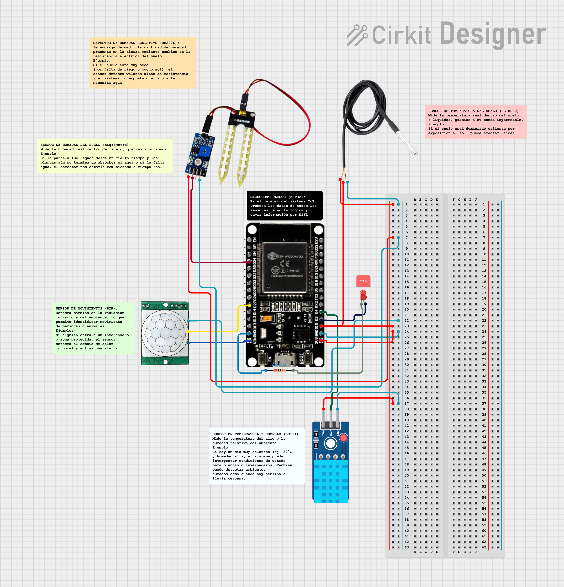
</div>