# Capítulo VI: Product Implementation, Validation & Deployment

## 6.1. Software Configuration Management

Esta sección detalla el marco normativo y técnico para la Gestión de Configuración de Software de **SATECHO**, estableciendo las directrices fundamentales que aseguran la consistencia operativa durante todo el ciclo de vida del desarrollo. Al abarcar la administración estructurada del código fuente, la configuración estandarizada de los entornos de trabajo y la orquestación de los procesos de despliegue, este marco metodológico busca salvaguardar la integridad, la seguridad y la trazabilidad de nuestra solución tecnológica; es por ello que, con la implementación de estas convenciones estratégicas, garantizamos una colaboración altamente eficiente y sincronizada entre todos los miembros del equipo, consolidando así un ecosistema de desarrollo robusto que minimiza los riesgos, facilita la resolución de conflictos y potencia la entrega continua de valor bajo los más exigentes estándares de calidad

### 6.1.1. Software Development Environment Configuration

Se especifican y describen las herramientas y productos de software que los miembros del equipo deben utilizar durante el ciclo de vida del desarrollo de **Agrosafe**, para garantizar la colaboración eficiente y la consistencia en el proyecto. Estas herramientas cubren todas las áreas clave, incluyendo la gestión del proyecto, el diseño UX/UI, el desarrollo, las pruebas y el despliegue.

| Actividad               | Herramienta / Guía                                     | Propósito                                                                          | Tipo de acceso / Ruta                                                                                                            |
| ----------------------- | ------------------------------------------------------ | ---------------------------------------------------------------------------------- | ------------------------------------------------------------------------------------------------------------------------------------- |
| Project Management      | Jira                                                   | Seguimiento de backlog, tareas, sprints y desempeño del equipo.  | [https://www.atlassian.com/es/software/jira](https://www.atlassian.com/es/software/jira)                                                                                               |
| Requirements Management | Gherkin Conventions                                    | Escritura de historias de usuario y criterios de aceptación en formato Given/When/Then.                       | [https://cucumber.io/docs/gherkin/](https://cucumber.io/docs/gherkin/)                                                                   |
| Product Design          | Structurizr C4                                         | Modelado de la arquitectura del sistema mediante diagramas de contexto, contenedores y componentes.                 | [https://playground.structurizr.com/](https://playground.structurizr.com/)                                                           |
| Product Design          | PlantUML                                               | Creación de diagramas de secuencia y de clases mediante código.             | [https://plantuml.com/](https://plantuml.com/)                                                           |
| Product Design          | Figma                                                  | Diseño de interfaces (UI) y prototipado de experiencia de usuario (UX) para web y móvil.                 | [https://figma.com](https://figma.com)                                                                                            |
| Product Design          | Cirkit Designer                                                  | Simulación y diseño de circuitos para los dispositivos IoT (ESP32).                                           | [https://app.cirkitdesigner.com](https://app.cirkitdesigner.com)                                                                                            |
| Software Development    | HTML5, CSS y JavaScript / Visual Studio Code                     | Desarrollo y maquetación del sitio web estático de la organización.                                              | [https://code.visualstudio.com](https://code.visualstudio.com)                        |
| Software Development    | Flutter y Dart / Android Studio                        | Desarrollo de la aplicación móvil multiplataforma.                                               | [https://developer.android.com/studio?hl=es-419](https://developer.android.com/studio?hl=es-419)                                                               |
| Software Development    | VueJS / Visual Studio Code                        | Desarrollo de la interfaz de la aplicación web principal.                                                  | [https://code.visualstudio.com](https://code.visualstudio.com)                                                         |
| Software Development    | Java y Spring Boot / IntelliJ IDEA                     | Desarrollo de la lógica de negocio y servicios del REST API.                                      | [https://www.jetbrains.com/idea/](https://www.jetbrains.com/idea/)                                                         |
| Software Development    | Python y Flask / Visual Studio Code                               | Desarrollo de la capa Edge para el procesamiento de datos IoT.                                    | [https://code.visualstudio.com](https://code.visualstudio.com/)                                    
| Software Development    | C++ / Arduino IDE                                      | Programación de firmware y lógica embebida para sensores y actuadores.                       | [https://www.arduino.cc/en/software](https://www.arduino.cc/en/software)                                                         ||
| Software Development    | Git + GitHub                                           | Control de versiones distribuido y gestión colaborativa del código.                                           | [https://github.com](https://github.com)                                                                                          |
| Software Testing        | JUnit5 & Mockito                                         | Pruebas unitarias, de integración y creación de dobles de prueba para el backend.                             | [https://junit.org/](https://junit.org/) / [https://site.mockito.org/](https://site.mockito.org/)           |
| Software Testing        | pytest                                                 | Automatización de pruebas unitarias para los servicios en Python (Edge).                                                | [https://docs.pytest.org/](https://docs.pytest.org/)   |
| Software Deployment     | Github Pages                                                | Hosting y despliegue del sitio web estático informativo.                                       | [https://docs.github.com/es/pages](https://docs.github.com/es/pages)                                                |
| Software Deployment     | Vercel                                                 | Plataforma de despliegue continuo para la aplicación web (Vue.js).                                          | [https://vercel.com/](https://vercel.com/)                                                |
| Software Deployment     | Firebase App Distribution                              | Distribución de versiones beta de la aplicación móvil para testing.                                        | [https://firebase.google.com/docs/app-distribution](https://firebase.google.com/docs/app-distribution)                                                |
| Software Deployment     | Azure App Service                                                | Alojamiento y escalado del REST API en la nube.                                          | [https://azure.microsoft.com/es-es/products/app-service/web](https://azure.microsoft.com/es-es/products/app-service/web)                                                | 
| Software Documentation  | Swagger                                                | Documentación interactiva de los endpoints y contratos del API.                      | [https://swagger.io/](https://swagger.io/)                                               |  

### 6.1.2. Source Code Management

En esta sección se define el marco de gobernanza para la gestión del código fuente de SATECHO, utilizando GitHub como plataforma centralizada de control de versiones. El equipo implementa una estrategia de ramificación estructurada y estándares de comunicación que garantizan la trazabilidad, la integridad y la calidad del software en cada etapa del ciclo de vida.

**Ecosistema de Repositorios**

La solución SATECHO se descompone en repositorios modulares para facilitar el mantenimiento y el despliegue independiente de sus componentes.

#### Repositorios de productos de software

| Producto de software | URL del repositorio                         | 
| -------------------- | --------------------------------------------| 
| Landing Page         | [https://github.com/S-A-T-E-C-H-O/Landing-Page-SATECHO](https://github.com/S-A-T-E-C-H-O/Landing-Page-SATECHO)                                            | 
| Web Application      | [https://github.com/S-A-T-E-C-H-O/Web-Application-SATECHO](https://github.com/S-A-T-E-C-H-O/Web-Application-SATECHO)                                            |
| Mobile Application   | [https://github.com/S-A-T-E-C-H-O/Mobile-Application-SATECHO](https://github.com/S-A-T-E-C-H-O/Mobile-Application-SATECHO)                                            |
| REST Services API    | [https://github.com/S-A-T-E-C-H-O/Web-API-Service-SATECHO](https://github.com/S-A-T-E-C-H-O/Web-API-Service-SATECHO)                                            |
| Edge Services API    | [https://github.com/S-A-T-E-C-H-O/Edge-API-Service-SATECHO](https://github.com/S-A-T-E-C-H-O/Edge-API-Service-SATECHO)                                            |
| Embedded Application | [https://github.com/S-A-T-E-C-H-O/Embedded-Application-Satecho](https://github.com/S-A-T-E-C-H-O/Embedded-Application-Satecho)                                            |

**GitFlow Workflow**

Se adopta el modelo GitFlow para gestionar el flujo de trabajo colaborativo, permitiendo un desarrollo paralelo organizado y lanzamientos controlados.

- main: Rama productiva que contiene exclusivamente código estable y verificado.

- develop: Rama de integración principal donde convergen las nuevas funcionalidades.

- deployment: Rama dedicada a la orquestación de despliegues en entornos de staging y pre-producción.

**Ramas de Apoyo:**

- Feature Branches (feature/): Utilizadas para el desarrollo de nuevas funcionalidades. Se originan y finalizan en develop.
  - Ejemplo: `feature/sensor-humidity-integration`

- Release Branches (release/): Ramas de estabilización para preparar un nuevo lanzamiento oficial
  - Ejemplo: `release/v1.0.0`

- Hotfix Branches (hotfix/): Ramas de emergencia para corregir errores críticos en main. Se sincronizan con main y develop.
  - Ejemplo: `hotfix/api-connection-timeout`

**Semantic Versioning**

Para el control de versiones del software, se aplica el estándar Semantic Versioning (SemVer) bajo el formato `vX.Y.Z`:

- X (Major): Cambios estructurales o de ruptura (breaking changes).

- Y (Minor): Incorporación de nuevas funcionalidades compatibles con versiones anteriores.

- Z (Patch): Correcciones menores, parches de seguridad y optimizaciones.

**Conventional Commits**

En SATECHO, el historial de Git no es simplemente un registro de cambios, sino la narrativa técnica de la evolución de nuestro producto; por lo tanto, para garantizar que cada contribución sea legible, rastreable y automatizable, adoptamos el estándar de *Conventional Commits*. Este marco transforma cada "commit" en una unidad de información con significado semántico inmediato.

```bash
<type>[optional scope]: <description>
```

**I. Taxonomía de Cambios (Types)**

Definimos las siguientes categorías para clasificar la intención de cada intervención en el ecosistema:

- feat: Introducción de una nueva capacidad o funcionalidad (asociada a ramas feature/).

- fix: Resolución de bugs, errores de lógica o fallos técnicos detectados.

- docs: Modificaciones en la documentación técnica del producto (archivos README, guías de arquitectura o comentarios de código).

- refactor: Mejoras en la estructura del código que no alteran el comportamiento externo (limpieza, legibilidad o deuda técnica).

- chore: Tareas de mantenimiento, actualización de dependencias o configuraciones de entorno (ej. initial commit).

- test: Creación, actualización o reparación de pruebas unitarias, de integración o de carga.

**II. El Componente de Contexto (Scope)**

El scope es fundamental para identificar qué módulo está siendo intervenido. Debe escribirse entre paréntesis y referenciar de forma precisa el componente afectado (ej. iot, api, ui-web, auth).

**III. Semántica de la Descripción**

La descripción es el núcleo del mensaje y debe cumplir rigurosamente con los siguientes estándares de calidad:

- Idioma: Debe redactarse exclusivamente en inglés, como lengua estándar de la industria.

- Modo Imperativo: El mensaje debe leerse como una orden al código (ej. "add", no "added" o "adds").

- Formato: Escritura en minúsculas y finalización obligatoria con un punto final (.).

- Concisión: Debe ser un resumen directo del impacto del cambio, evitando detalles extensos que pertenecen a la sección opcional del body.

**IV. Anatomía de un Commit de Excelencia**

Un mensaje que cumple con nuestro estándar de ingeniería se visualiza de la siguiente manera:

```bash
feat(iot): implement soil moisture sensor calibration logic
```

**Proceso de Code Review**

Todo cambio propuesto debe someterse a un proceso de revisión riguroso mediante Pull Requests (PRs) antes de ser integrado en las ramas de jerarquía superior (develop o main).

- **Requisito de Aprobación:** Al menos un revisor debe validar el código para asegurar el cumplimiento de los estándares de arquitectura, seguridad y mantenibilidad.

- **Validación:** El proceso busca mitigar la introducción de bugs y garantizar que la nueva contribución se alinee con el diseño sistémico de SATECHO.

### 6.1.3. Source Code Style Guide & Conventions

En **SATECHO**, el código no solo debe ser funcional, sino también legible, mantenible y estéticamente profesional. Esta guía establece el "lenguaje común" para nuestro equipo multidisciplinario, asegurando que cualquier desarrollador pueda navegar por el ecosistema del proyecto con total claridad.

**Fundamentos Globales de Nomenclatura**

Independientemente del lenguaje de programación, aplicamos tres reglas inquebrantables:

1. **Código en Inglés:** Todo el léxico técnico (variables, métodos, clases, comentarios técnicos y nombres de archivos) se redactará exclusivamente en inglés para mantener la compatibilidad con estándares globales de la industria.

2. **Significado sobre Brevedad:** Preferimos nombres descriptivos como sensorReadingInterval sobre abreviaturas ambiguas como sri.

3. **Consistencia de Casos:**

- camelCase: Utilizado para variables, funciones y métodos. (Ej: getSoilMoisture()).

- PascalCase: Reservado para clases, interfaces, tipos y componentes. (Ej: AuthService).

- snake_case: Exclusivo para nombres de archivos y recursos físicos. (Ej: main_navigation.dart).

- kebab-case: Utilizado en clases CSS y selectores HTML. (Ej: btn-primary).

**Estándares por Tecnología**

#### Capa Web (HTML5 & CSS3)

Nos regimos por la [Google HTML/CSS Style Guide.](https://google.github.io/styleguide/htmlcssguide.html)

- **Semántica:** Uso obligatorio de etiquetas main, section, article y nav.

- **CSS BEM (Block Element Modifier):** Estructuramos las clases para evitar colisiones de estilos
  - Bloque: `.card`
  - Elemento: `.card__title`
  - Modificador: `.card__title--highlighted`

```html
<!-- Ejemplo de implementación semántica y BEM -->
<section class="crop-status">
  <h2 class="crop-status__title">Niveles de Humedad</h2>
  <button class="btn btn--success">Actualizar</button>
</section>
```

#### Lógica de Interacción (JavaScript ES6+)

Basado en la [Google JavaScript Style Guide.](https://google.github.io/styleguide/jsguide.html)

- **Inmutabilidad:** Priorizamos const sobre let. El uso de var queda estrictamente prohibido.

- **Programación Funcional:** Preferencia por funciones flecha (`=>`) y métodos de array (`map`, `filter`, `reduce`).

```javascript
const formatSensorData = (data) => {
  return data.map(reading => reading.toFixed(2));
};
```

#### Backend Robusto (Java & Spring Boot)

Seguimos los estándares de Clean Code y la guía de Google para Java.

- **Encapsulamiento:** Todo atributo de clase debe ser `private` y el acceso a métodos debe ser explícito (`public`, `protected`).

- **Inyección de Dependencias:** Preferimos la inyección por constructor sobre el uso de `@Autowired` en campos.

```java
public class SensorController {
    private final SensorService sensorService;

    public SensorController(SensorService sensorService) {
        this.sensorService = sensorService;
    }

    public ResponseEntity<String> getHumidity(Long id) {
        return ResponseEntity.ok("Reading: " + sensorService.getById(id));
    }
}
```

#### Desarrollo Móvil (Dart & Flutter)

Aplicamos las directrices de [Effective Dart.](https://dart.dev/effective-dart)

- **Tipado Fuerte:** Se debe declarar explícitamente el tipo de dato para evitar errores en tiempo de ejecución.

- **Widgets:** Dividir las interfaces en widgets pequeños y reutilizables.

```dart
class MoistureDisplay extends StatelessWidget {
  final double value;

  const MoistureDisplay({required this.value});

  @override
  Widget build(BuildContext context) {
    return Text('Humedad: $value%');
  }
}
```

**Comunicación del Negocio (Gherkin)**

Para nuestras pruebas de aceptación, utilizamos el lenguaje **Gherkin** con el fin de que los stakeholders entiendan el comportamiento del sistema sin leer código fuente.

- **Claridad:** Los archivos `.feature` deben describir procesos de negocio, no interacciones de UI (ej: usar "Inicia sesión" en lugar de "Hace click en el botón azul").

```gherkin
Feature: Monitoreo de Cultivos
  As a farmer
  I want to receive an alert when the soil is dry
  So that I can irrigate my crops on time

  Scenario: Detección de humedad baja
    Given the humidity sensor is active
    When the moisture level drops below 20%
    Then the system sends a notification to the mobile app
```

#### 6.1.4. Software Deployment Configuration

Para esta sección, el despliegue no es el final del camino, sino el inicio de la entrega de valor. Esta sección describe los protocolos y plataformas utilizados para transformar nuestro código fuente en productos digitales accesibles y funcionales. Hemos diseñado un ecosistema de despliegue híbrido que aprovecha lo mejor de cada proveedor de nube para garantizar alta disponibilidad y rendimiento.

#### Landing Page (GitHub Pages)

Nuestro portal informativo se despliega como un sitio estático optimizado, garantizando tiempos de carga mínimos y seguridad total.

- **Plataforma:** GitHub Pages.

- **Proceso de Despliegue:**

1. **Preparación: **Asegurar que el archivo principal sea un index.html en la raíz del repositorio SATECHO-static.

2. **Configuración de Origen:** Acceder a los Settings del repositorio en GitHub y navegar a la sección Pages.

3. **Activación:** Seleccionar la rama main como fuente de despliegue.

4. **Automatización:** GitHub generará automáticamente una URL bajo el dominio github.io. Cada push a la rama main actualizará el sitio en tiempo real.

#### Web Application (Vercel)

La aplicación administrativa de SATECHO, desarrollada en Vue.js, requiere un entorno ágil que soporte el renderizado moderno y despliegues atómicos.

- **Plataforma:** Vercel.

- Guía Detallada de Despliegue:

1. **Vinculación:** Iniciar sesión en Vercel e importar el repositorio `SATECHO-WebApp`.

2. **Configuración de Framework:** Vercel detectará automáticamente que se trata de un proyecto Vue.js. Validar que el comando de build sea `npm run build` y el directorio de salida sea `dist`.

3. **Variables de Entorno:** Configurar las variables `VUE_APP_API_URL` para apuntar a nuestro backend en Azure.

4. **Deployment:** Ejecutar el despliegue inicial. Vercel proporcionará una URL de previsualización para cada Pull Request y una URL productiva para la rama main.

#### Web Services - Backend (Azure App Service)

El corazón lógico de SATECHO, construido en Java con Spring Boot, se aloja en un entorno empresarial que garantiza escalabilidad y seguridad de datos.

- **Plataforma:** Azure App Service.

- **Proceso de Despliegue:**

1. **Instancia de Servicio:** Se crea un Web App en Azure seleccionando el stack de ejecución Java 17+ y el servidor web embebido.

2. **Pipeline de CI/CD:** Configuramos un archivo de flujo de trabajo en GitHub Actions que compile el proyecto usando Maven (mvn clean package).

3. **Publicación:** El artefacto .jar generado se envía automáticamente a Azure App Service mediante el perfil de publicación configurado en los Secrets de GitHub.

4. **Monitoreo:** Se habilita Application Insights para rastrear el rendimiento de los endpoints y posibles excepciones en tiempo real.

#### Mobile Application (Firebase App Distribution)

Para nuestra fase de prototipado y validación con usuarios clave, utilizamos un canal de distribución ágil antes del lanzamiento en tiendas oficiales.

- **Plataforma:** Firebase App Distribution.

- **Proceso de Despliegue:**

1. **Compilación:** Generar el paquete binario de la aplicación (.apk para Android o .ipa para iOS) desde el entorno de Flutter.

2. **Carga en Firebase:** Subir el binario a la consola de Firebase en la sección de App Distribution.

3. **Gestión de Testers:** Definir los correos electrónicos de los usuarios de prueba en SATECHO.

4. **Instalación:** Los usuarios reciben una invitación por correo para descargar la aplicación de forma segura a través de la app App Tester.

#### Embedded IoT Application (Firmware Over-The-Air)

El despliegue en hardware requiere un enfoque de actualización remota para evitar la intervención física en cada sensor instalado en el campo.

- **Método:** Actualización remota de firmware (OTA) y Flasheo Serial inicial.

- **Proceso de Despliegue:**

1. **Flasheo Inicial:** Durante la fabricación, se carga la versión estable mediante el Arduino IDE o PlatformIO.

2. **Preparación de Binarios:** Las nuevas versiones se compilan en archivos `.bin.`

3. **Almacenamiento de Updates:** Los binarios se cargan en Azure Blob Storage, el cual actúa como nuestro repositorio de firmware.

4. **Sincronización:** Los dispositivos ESP32 están programados para consultar periódicamente un endpoint de control. Si detectan una versión superior, descargan el binario de forma segura y reinician el sistema con el nuevo firmware.

<div class="page"></div>

## 6.2. Landing Page, Services & Applications Implementation

Tras consolidar los cimientos estratégicos del proyecto —trasladando los requisitos de negocio hacia un diseño de arquitectura robusto (C4 y diagramas de clase) y validando la experiencia de usuario (UX) mediante prototipos de alta fidelidad— entramos en la fase de materialización digital. En este apartado, la abstracción se convierte en ejecución: cada componente de la solución, desde la lógica embebida en los sensores hasta la interfaz de gestión en la nube, se desarrolla bajo un estándar de ingeniería de software de alto nivel.

El ecosistema de SATECHO se despliega a través de una suite de productos interconectados que comprenden:

- **Interfaces de Usuario:** Landing Page (captación), Aplicación Web (administración) y Aplicación Móvil (monitoreo en campo).

- **Núcleo de Datos:** REST API (procesamiento central) y Edge Services (gestión de latencia).

- **Hardware Layer:** Aplicación embebida para el control y lectura de sensores en tiempo real.

Para garantizar una entrega continua y controlada, la implementación se ha orquestado en tres ciclos iterativos (Sprints). Cada Sprint actúa como un hito evolutivo donde los objetivos definen el alcance técnico, permitiendo que la solución crezca de forma modular, segura y, sobre todo, alineada con las necesidades reales del sector agrícola.

### 6.2.1. Sprint 1

Dentro de este primer sprint, detallamos el proceso completo de implementación, pruebas, documentación y despliegue de los distintos componentes que conforman la solución SATECHO. Esto incluye el desarrollo de nuestra Landing Page, que sirve como punto de entrada y presentación de nuestro producto al público general, así como la implementación de los Servicios Web, Aplicaciones Web, Aplicaciones Móviles y Aplicaciones Embebidas que constituyen el núcleo funcional de nuestra propuesta.

A lo largo de esta sección, explicamos cómo hemos abordado cada fase del ciclo de vida del desarrollo de software para estos componentes, desde la planificación inicial y el diseño, hasta la ejecución de pruebas y el despliegue en entornos de producción. Detallamos las tecnologías utilizadas, los desafíos enfrentados y las soluciones implementadas para asegurar que cada componente cumpla con los requisitos establecidos y proporcione una experiencia de usuario óptima.

#### 6.2.1.1. Sprint Planning 1

<table>
  <tr>
    <td>Sprint #</td>
    <td>Sprint 1</td>
  </tr>
  <tr>
    <td colspan="2"><strong>Sprint Planning Background</strong></td>
  </tr>
  <tr>
    <td>Date</td>
    <td>2026-05-06</td>
  </tr>
  <tr>
    <td>Time</td>
    <td>21:35 p.m (GMT-5)</td>
  </tr>
  <tr>
    <td>Location</td>
    <td>Remoto, mediante la plataforma de reuniones Discord</td>
  </tr>
  <tr>
    <td>Prepared By</td>
    <td>Huamani Sánchez, José Diego</td>
  </tr>
  <tr>
    <td>Attendees (to planning meeting)</td>
    <td>Estrada Cajamune, Abraham Andrés / Gamio Upiachihua, Brenda Lucía / Quispe Erasmo, Raul Ronaldo / Palacios, Yasser Renteria </td>
  </tr>
  <tr>
    <td colspan="2"><strong>Sprint Goal & User Stories</strong></td>
  </tr>
  <tr>
    <td>Sprint 1 Goal</td>
    <td>
<strong>Nuestro objetivo</strong> es establecer la identidad digital de SATECHO y validar el flujo de interacción principal de la plataforma. <br>
<strong>Creemos que esto</strong> genera confianza inicial en el mercado y proporciona a nuestros clientes del sector agrícola capacidades para la toma de decisiones basadas en datos. <br>
<strong>Esto se confirmará cuando</strong> los clientes potenciales interactúen con la propuesta de valor en nuestra página de inicio y los usuarios internos puedan autenticarse de forma segura y visualizar los datos preliminares de los sensores a través del panel de control.
    </td>
  </tr>
  <tr>
    <td>Sprint 1 Velocity</td>
    <td>41</td>
  </tr>
  <tr>
    <td>Sum of Story Points</td>
    <td>41</td>
  </tr>
</table>

#### 6.2.1.2. Aspect Leaders and Collaborations

Iniciamos nuestra trayectoria transformando la complejidad en orden. Durante este Sprint 1, definimos los pilares estratégicos del proyecto mediante una arquitectura de contextos delimitados, blindando la lógica de negocio desde la seguridad hasta el monitoreo operativo en los exigentes entornos de retail y restaurantes. Esta visión se traduce en acción a través de nuestra Matriz LACX, una brújula de colaboración que asigna responsabilidades claras para garantizar la cohesión del producto. Bajo este esquema de trabajo, el equipo ha convergido para dar vida a 41 puntos de historia, asegurando que cada funcionalidad no sea solo un requisito cumplido, sino una pieza clave de una infraestructura escalable y resiliente.

| Team Member (Last Name, First Name) |  GitHub Username  |     IAM     |     OnBoarding    | i18n | Dashboard |
| :---------------------------------- | :----------------: | :---------: | :---------: | :-------------------: | :--------------: 
| Huamani Sánchez, José Diego       |  `ProgramadorHuamani`  | **L** |            |           C           |                  |
| Estrada Cajamune, Abraham Andrés        |     `Abraham0310`     |            |      **L**      |           C           |        C        |
| Gamio Upiachihua, Brenda Lucía         |     `B-Gamio`     |            |      C      |                      |          **L**        |
| Quispe Erasmo, Raul Ronaldo      |    `Raul-QE`   |      C      |            |                      |        C        |
| Palacios, Yasser Renteria        |      `Mitos20`     |            |      C      |      **L**      |                  |

#### 6.2.1.3. Sprint Backlog 1

Alineado con los objetivos estratégicos definidos en nuestra planificación, este backlog constituye la hoja de ruta técnica diseñada para materializar el primer incremento funcional de la plataforma. El propósito central de este ciclo se divide en dos frentes críticos: en primer lugar, el despliegue de una Landing Page de alto impacto orientada a proyectar el valor de negocio del ecosistema; en segundo lugar, la construcción de la interfaz frontend de la Aplicación Web. Esta última habilitará las capacidades esenciales que permitirán a los administradores de restaurantes y tiendas retail gestionar perfiles, autenticarse de manera segura, controlar existencias en inventario, administrar dispositivos IoT y registrar transacciones comerciales de forma intuitiva.

Para transformar esta visión en un desarrollo ágil y ejecutable, el equipo realizó una deconstrucción de los requisitos de negocio en Historias de Usuario, las cuales fueron posteriormente atomizadas en tareas técnicas específicas de implementación y pruebas. Todo este flujo de trabajo, junto con la medición de la velocidad del equipo y el cumplimiento de los puntos de historia, se gestiona y audita centralizadamente a través de Jira, garantizando una trazabilidad absoluta y visibilidad del progreso en tiempo real para toda la organización.

**Proyecto en Jira:** [https://satecho.atlassian.net/jira/software/projects/SCRUM/boards/1](https://satecho.atlassian.net/jira/software/projects/SCRUM/boards/1)


A continuación, se presenta la tabla con las tareas designadas junto con cada uno de los miembros del equipo para que se sean completados de manera satisfactoria durante este primer sprint.

# Sprint 1 – Sprint Backlog
 
| Sprint 1 | Sprint Backlog 1 | | | | | | |
|----------|-----------------|----------------|-------|-------------|-------------------|-------------|--------|
| **User Story** | **Title** | **Work Item/Task** | **Title** | **Description** | **Estimation (SP)** | **Assigned to** | **Status** |
| EP-001-US008 | US-01: Browse Landing Page as Farmer Visitor | EP-001-US008-T01 | Design the main structure and content of the landing page | As a farmer visitor, I want to browse landing page content so that I can understand AgroSafe's value proposition and available plans. | 2 | Jose Huamani | Done |
| | | EP-001-US008-T02 | Implement the plans and value proposition section | | | Yasser Palacios | Done |
| EP-001-US009 | US-02: Browse Landing Page as Agronomist Visitor | EP-001-US009-T01 | Develop the benefits section for agronomist consultants | As an agronomist visitor, I want to browse the landing page so that I can see the benefits tailored to consultants. | 1 | Brenda Gamio | Done |
| *(sin US equivalente en §3.1)* | US-03: Watch Product Demo Video | EP-001-EXT01-T01 | Integrate and configure the product demo video player | As a visitor, I want to watch the product demo video so that I can understand real-world use cases before signing up. | 1 | Abraham Estrada | Done |
| *(sin US equivalente en §3.1)* | US-04: Request Commercial Demo | EP-001-EXT02-T01 | Develop the commercial demo request form | As a visitor, I want to request a commercial demo so that a representative can contact me to evaluate the solution. | 2 | Raul Quispe | Done |
| | | EP-001-EXT02-T02 | Implement request notification and confirmation | | | Jose Huamani | Done |
| EP-001-US001 | US-05: Farmer Registration | EP-001-US001-T01 | Develop account creation logic for new users | As a visitor, I want to register on the platform with my personal data so that I can access the monitoring features. | 3 | Yasser Palacios | Done |
| | | EP-001-US001-T02 | Implement security validations on the registration form | | | Abraham Estrada | Done |
| | | EP-001-US001-T03 | Redirect the user to the onboarding flow after successful registration | | | Raul Quispe | Done |
| EP-001-US002 | US-06: Account Email Verification | EP-001-US002-T01 | Implement verification email dispatch with token | As a newly registered farmer, I want to verify my account via email so that I can activate it and access the system. | 3 | Brenda Gamio | Done |
| | | EP-001-US002-T02 | Develop account validation and activation flow | | | Jose Huamani | Done |
| | | EP-001-US002-T03 | Handle token expiration and verification email resend | | | Yasser Palacios | In-Progress |
| EP-001-US005 | US-07: Register Farm and First Parcel | EP-001-US005-T01 | Design and implement the initial setup wizard | As a farmer, I want to register my farm and first parcel during onboarding so that I can start monitoring my crops. | 5 | Abraham Estrada | Done |
| | | EP-001-US005-T02 | Develop the plot configuration and crop data step | | | Raul Quispe | Done |
| | | EP-001-US005-T03 | Implement irrigation zone configuration in the wizard | | | Brenda Gamio | In-Progress |
| | | EP-001-US005-T04 | Integrate welcome screen and platform end guide | | | Jose Huamani | To-Do |
| EP-002-US001 | US-08: View Soil Monitoring Dashboard | EP-002-US001-T01 | Implement real-time soil moisture and temperature visualization | As a farmer, I want to view the current state of my soil sensors on the dashboard so that I can monitor my crops in real time. | 8 | Yasser Palacios | In-Progress |
| | | EP-002-US001-T02 | Develop EC and ambient temperature widgets with real-time updates | | | Abraham Estrada | In-Progress |
| | | EP-002-US001-T03 | Implement parcel selector on the dashboard | | | Raul Quispe | To-Do |
| | | EP-002-US001-T04 | Integrate visual alerts for out-of-range values | | | Brenda Gamio | To-Do |
| | | EP-002-US001-T05 | Perform dashboard performance testing with real-time data | | | Jose Huamani | To-Do |
| *(sin TS equivalente en §3.1)* | TS-01: Implement Lazy Loading and Code Splitting for Dashboard Modules | EP-001-EXT03-T01 | Configure lazy loading for dashboard modules | As a Developer, I want the system to implement lazy loading of dashboard modules so that the initial load time is reduced. | 5 | Yasser Palacios | To-Do |
| | | EP-001-EXT03-T02 | Implement code splitting by routes and critical components | | | Abraham Estrada | To-Do |
| | | EP-001-EXT03-T03 | Measure and document improvement in initial load times | | | Raul Quispe | To-Do |
| *(sin TS equivalente en §3.1)* | TS-02: Implement Global State Management for Dashboard | EP-001-EXT04-T01 | Select and integrate a global state manager in the web frontend | As a Developer, I want to implement a global state manager on the web frontend so that sensor data, alerts, and configuration are synchronized between components without redundant API calls. | 5 | Brenda Gamio | To-Do |
| | | EP-001-EXT04-T02 | Centralize sensor data and alerts state | | | Jose Huamani | To-Do |
| | | EP-001-EXT04-T03 | Eliminate redundant API calls through shared state | | | Yasser Palacios | To-Do |
| *(sin TS equivalente en §3.1)* | TS-03: Internationalization Support | EP-001-EXT05-T01 | Configure the internationalization library (i18n) in the project | As a Developer, I want the system to support internationalization so that the platform can be used comfortably without language barriers. | 3 | Abraham Estrada | To-Do |
| | | EP-001-EXT05-T02 | Implement dynamic language switching and translation files | | | Raul Quispe | To-Do |
| *(sin TS equivalente en §3.1)* | TS-04: Accessibility Compliance | EP-001-EXT06-T01 | Implement ARIA labels across all interface components | As a Developer, I want the system to comply with accessibility standards so that users with disabilities can access all features without barriers. | 3 | Brenda Gamio | To-Do |

*Nota de alineación: los IDs de User Story de esta tabla fueron corregidos para coincidir con el backlog vigente de la sección 3.1. Las filas marcadas "(sin US/TS equivalente en §3.1)" corresponden a trabajo efectivamente entregado en este sprint (video demo, formulario de demo comercial, lazy loading, i18n, accesibilidad) que no tiene una historia formal correspondiente en el backlog actual — se conservan como evidencia histórica de implementación bajo IDs internos `EP-001-EXTxx`.*

#### 6.2.1.4. Development Evidence for Sprint Review

Este apartado constituye el compendio de evidencia técnica y operativa que respalda los hitos alcanzados durante este primer ciclo de desarrollo, donde la materialización del software se ha concentrado en desplegar las versiones iniciales de la Landing Page y la Aplicación Web para sentar las bases de interacción y gobernanza de la plataforma. En ese sentido, el esfuerzo del equipo se distribuyó estratégicamente de manera simultánea; por un lado, se consolidó la Landing Page como una vitrina digital de alto impacto con diseño internacionalizado y contenido visual que integra con éxito los módulos de beneficios, planes de suscripción y redirecciones interactivas, mientras que, por otro lado, se desarrolló la Aplicación Web bajo un riguroso enfoque de Domain-Driven Design (DDD) validado provisionalmente mediante la simulación de servicios con Beeceptor, desplegando las interfaces críticas. Finalmente, como garantía de transparencia, rigor de ingeniería y control de configuración, este bloque sirve de antesala para el registro cronológico de _commits_ que certifica la autoría, el propósito y la evolución del código fuente integrado satisfactoriamente en este sprint.

*Nota de evidencia: la tabla de commits de Landing_Page-SATECHO fue corregida. Los SHAs citados previamente (2392bd0, d3b8b7d, d78a3f6, 7216027, e0b8e0f, 0fbd062) no existen en el repositorio actual — su historial real solo comienza el 27/05/26, después del cierre formal de este sprint (15/05/26). El repositorio fue reiniciado en algún punto entre la demo de Sprint 1 y este cierre de documentación; las secciones visuales mostradas en la demo (Hero, Beneficios, Planes) se construyeron sobre una copia de trabajo cuyo historial de commits original ya no es recuperable. A continuación se listan los únicos commits reales trazables para esta ventana, que corresponden al reinicio del repositorio, no a las features completas descritas en el video de la demo:*

| Repository              | Branch                   | Commit Id                                | Commit Message                                                                                                 | Commited On |
|-------------------------|--------------------------|------------------------------------------|----------------------------------------------------------------------------------------------------------------|-------------|
| Landing_Page-SATECHO   | main                   | e4639f8 | Initial commit.                                                                                         | 27/05/26    |
| Landing_Page-SATECHO   | main              | b5ce321 | chore(configuration): add the metadata about the SATECHO landing page.                    | 29/05/26    |
| Web-Application-SATECHO    | main                   | 14a4ba0 | Initial commit        | 13/05/26    |
| Web-Application-SATECHO    | feature/initial-config                 | 8941169 | feat: complete initial frontend configuration        | 13/05/26    |
| Web-Application-SATECHO    | feature/auth                   | 695ff43 | refactor(auth): componentize registration flow and improve verification viewsstadistics-benefits-section        | 14/05/26    |
| Web-Application-SATECHO    | feature/auth                    | 72267da | feat: connect auth flow to beeceptor   | 14/05/26    |
| Web-Application-SATECHO    | feature/auth                    | f6d23c6 | docs: document beeceptor auth mock    | 14/05/26    |
| Web-Application-SATECHO    | feature/auth                    | 8b8be32 | chore: add pnpm-lock.yaml    | 14/05/26    |
| Web-Application-SATECHO    | feature/onboarding                   | dfa4f78 | add onboarding flow    | 15/05/26    |
| Web-Application-SATECHO    | feature/dashboards                  | d600b13 | feat: add agricultural dashboard    | 15/05/26    |
| Web-Application-SATECHO    | feature/dashboards                  | d600b13 | fix: improve dashboard interactions | 15/05/26    |
| Web-Application-SATECHO    | feature/auth-onboarding-dashboard-sync         | 7544e70 | feat: sync auth onboarding data with dashboard | 15/05/26    |
| Web-Application-SATECHO    | feature/i18n       | 6cc792c | feat(web-app): implement i18n support for english and spanish translations | 15/05/26    |
| Web-Application-SATECHO    | feature/deploy       | ee046e3 | build(web-app): execute initial deployment of the dashboard to firebase | 15/05/26    |

#### 6.2.1.5. Testing Suite Evidence for Sprint Review

Dado el carácter de este primer sprint, enfocado en el despliegue visual de la **Landing Page** y la validación de interfaces mediante una API simulada (Beeceptor), no se han estructurado scripts de testing automatizado en este ciclo. Al priorizar la arquitectura base y la experiencia UX sobre lógica persistente, la suite de pruebas se posterga estratégicamente para los próximos sprints, colindando con la integración de los servicios reales.

#### 6.2.1.6. Execution Evidence for Sprint Review

En este apartado, se presenta la ejecución de los productos digitales desarrollados en esta primer sprint junto con su evidencia de despliegue para el acceso desde cualquier dispositivo y por cualquier usuario.

Es de esta manea que se se muestran las capturas de pantalla y enlaces de acceso a cada producto implementado para reflejar el resultado y el recorrido relacionado a la usabilidad que el usuario tengan dentro de las mismas.

#### Landing Page

En primera instancia, se evidencia la ejecución oficial alcanzanda del desarrollo de la Landing Page para este Sprint 1, consolidando sus objetivos en habilitar secciones clave para que los visitantes a la página puedan comprender el giro del negocio, la propuesta de valor ofrecida y la infomración asociada a los grandes resultados que lograron otros clientes al utilizar nuestro servicio.

A continuación, se presenta el vídeo de demostración donde se evidencia la navegación y los flujos implementados en la interación de los cuales vienen a ser:

- **Acerca de nosotros:** Sección que muestra información sobre la startup SATECHO.
- **Beneficios:** Sección que presenta los beneficios que ofrece la plataforma para cada segmento objetivo.
- **Planes de pagos:** Sección que muestra los diferentes planes de pago con los diversos beneficios que ofrece para el monitoreo/sewguimiento del cultivo.

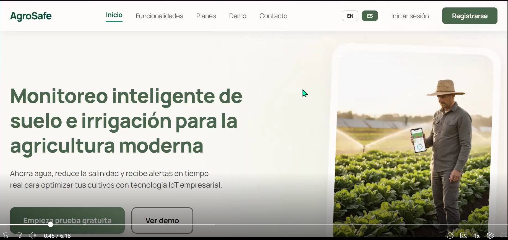

**Landing Page - SATECHO:** [Landing Page - Video](https://upcedupe-my.sharepoint.com/:v:/g/personal/u202110458_upc_edu_pe/IQAzgRZhyeACQ7t-xSswqGFuAROOoE3IEV-bGoTvCeJOn-M?e=hGWKTQ&nav=eyJyZWZlcnJhbEluZm8iOnsicmVmZXJyYWxBcHAiOiJTdHJlYW1XZWJBcHAiLCJyZWZlcnJhbFZpZXciOiJTaGFyZURpYWxvZy1MaW5rIiwicmVmZXJyYWxBcHBQbGF0Zm9ybSI6IldlYiIsInJlZmVycmFsTW9kZSI6InZpZXcifX0%3D)

**Sección Hero**

Introduce la propuesta de valor central de la plataforma mediante un mensaje de impacto y un llamado a la acción diseñado para cautivar a agricultores y agrónomos desde el primer segundo.

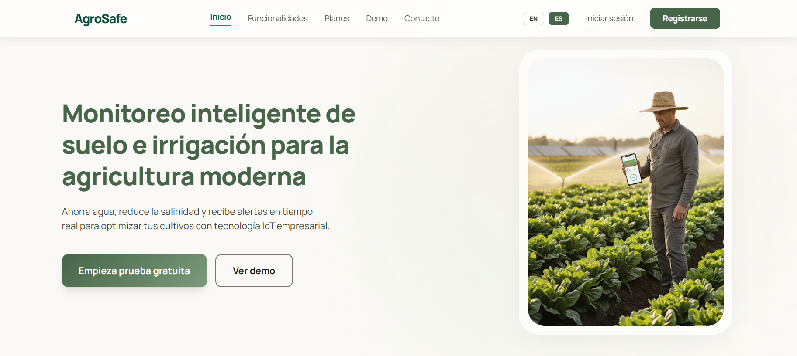

**Beneficios**

Detalla de forma visual y analítica las ventajas competitivas del sistema, destacando la eliminación de suposiciones empíricas gracias al monitoreo automatizado de variables críticas en tiempo real.

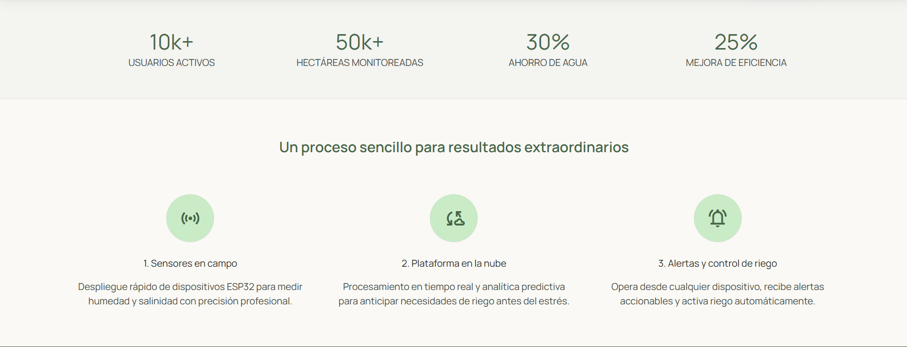

**Registro - Segmento Objetivo Agrónomo**

Punto de conversión estratégico diseñado para captar perfiles técnicos agrícolas, permitiéndoles registrarse para acceder a un ecosistema optimizado de toma de decisiones basada en datos veraces.


**Demo Promocional**

Espacio audiovisual interactivo que evidencia el funcionamiento práctico de nuestras interfaces web y móviles, validando la navegación del ecosistema automatizado ante potenciales clientes.


**Planes de Pago**

Matriz comercial transparente que desglosa las opciones de suscripción, adaptando los servicios de monitoreo a las necesidades operativas de pequeños productores y grandes empresas agrícolas.

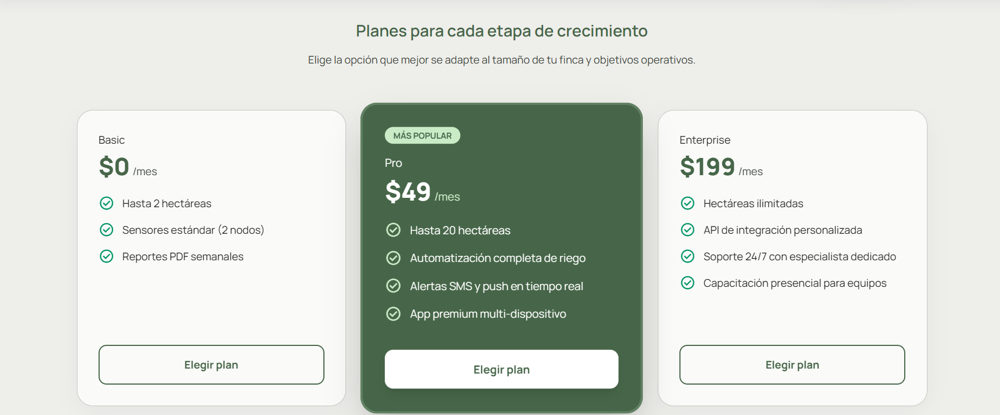

**Formulario de Contacto**

Canal de comunicación directa diseñado para resolver consultas personalizadas, facilitando un puente directo entre el equipo de soporte técnico y los usuarios interesados en la tecnología.

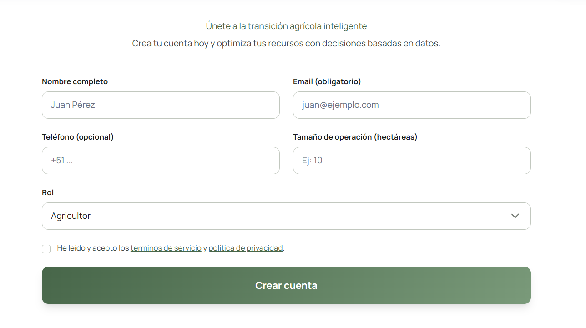

**Footer**

Cierre institucional que consolida los enlaces de navegación rápida, políticas legales, redes sociales y derechos reservados, reafirmando la identidad corporativa y seriedad de la organización.

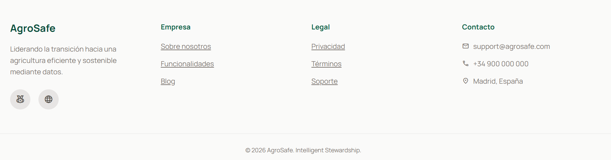

#### Web Application

Por consiguiente, la sección sobre el **Web Application** evidencia el desarrollo para la navegación e interacción del usuario - comenzando por el registro de su cuenta, hasta la visualización de cada uno de los módulos para el monitoreo y configuración tanto de su perfil de usuario como las hectáreas que está realizando seguimiento. 

Mediante el siguiente vídeo, se evidencias los flujos implementados de los cuales podemos apreciar los siguientes:

[Referential Video - Web Application](./assets/images/sprint-1/Web-Application-Execution-Evidence.png)

**Landing Page - SATECHO:** [Web Application - Video](https://upcedupe-my.sharepoint.com/:v:/g/personal/u202110458_upc_edu_pe/IQChu96vm6jCSLCSP2Y-AbjgAZ4_lsSfu0sH6sJZoUdHH9g?e=9Dnaaf&nav=eyJyZWZlcnJhbEluZm8iOnsicmVmZXJyYWxBcHAiOiJTdHJlYW1XZWJBcHAiLCJyZWZlcnJhbFZpZXciOiJTaGFyZURpYWxvZy1MaW5rIiwicmVmZXJyYWxBcHBQbGF0Zm9ybSI6IldlYiIsInJlZmVycmFsTW9kZSI6InZpZXcifX0%3D)

**Login**

Interfaz de acceso seguro que valida las credenciales del usuario, garantizando un ingreso protegido al ecosistema de monitoreo de la plataforma.

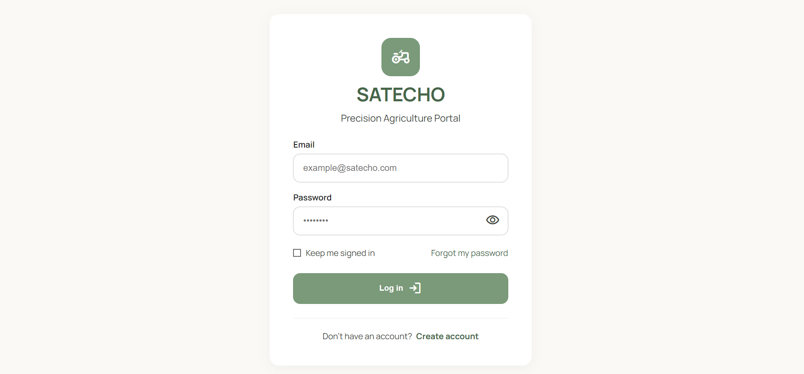

**Create Account**

Formulario de registro inicial estructurado para recopilar los datos esenciales e iniciar el flujo de alta en el sistema.

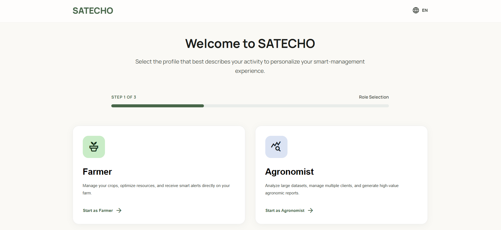

**User Account**

Sección de tipificación donde se define la identidad y el rol específico del usuario dentro de la infraestructura de control.

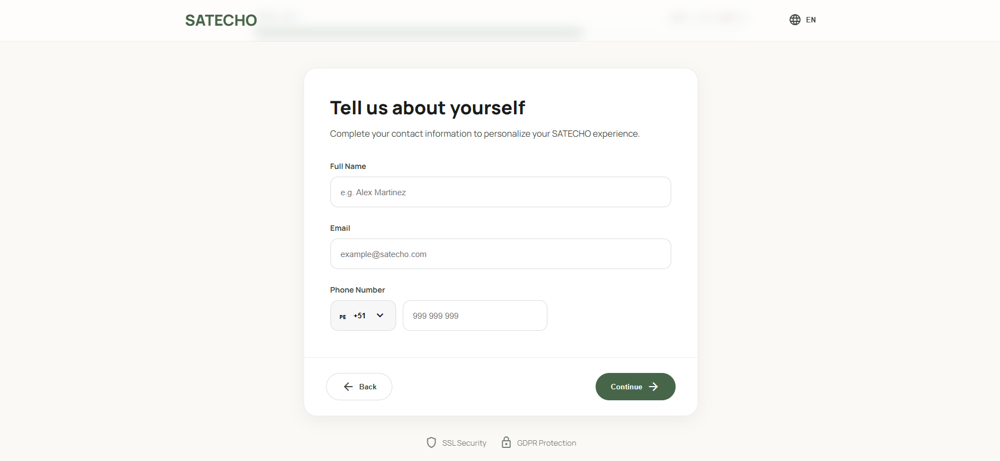

**Password**

Módulo de seguridad dedicado a la creación y validación de contraseñas robustas bajo criterios exigentes de protección de datos.

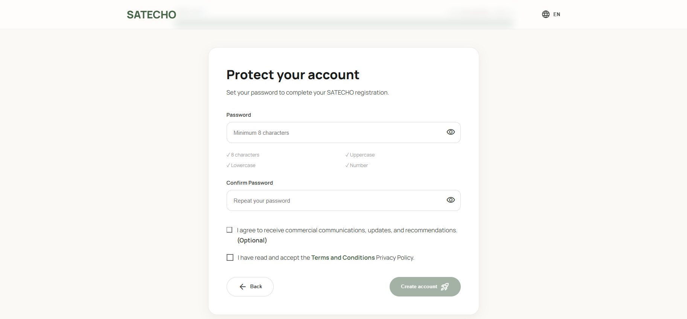

**Succesfully Creation Account**

Pantalla de confirmación y éxito que valida la correcta persistencia del nuevo perfil antes de avanzar a la configuración operativa.


**Configuration Profile**

Asistente secuencial de parametrización donde el usuario configura sus datos, establece umbrales de riego y pre-selecciona los dispositivos IoT a vincular.

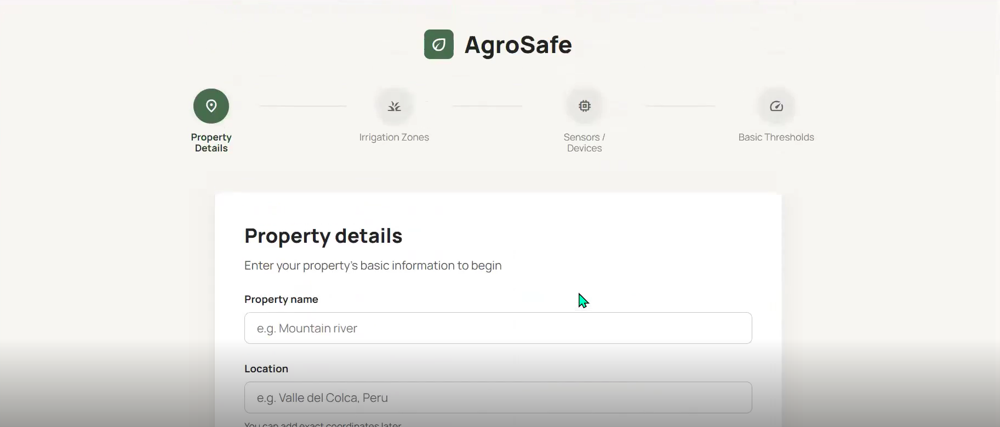

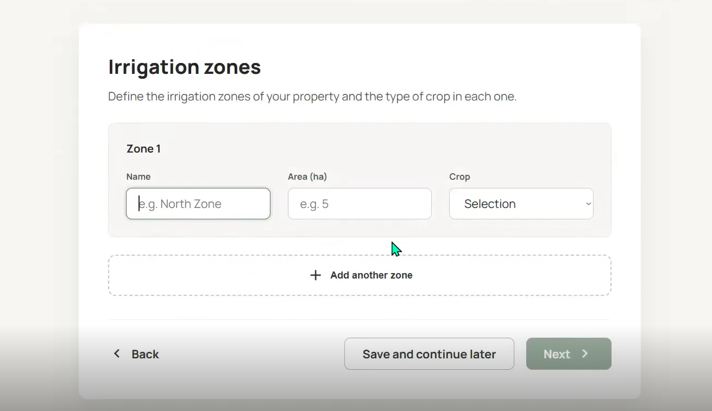

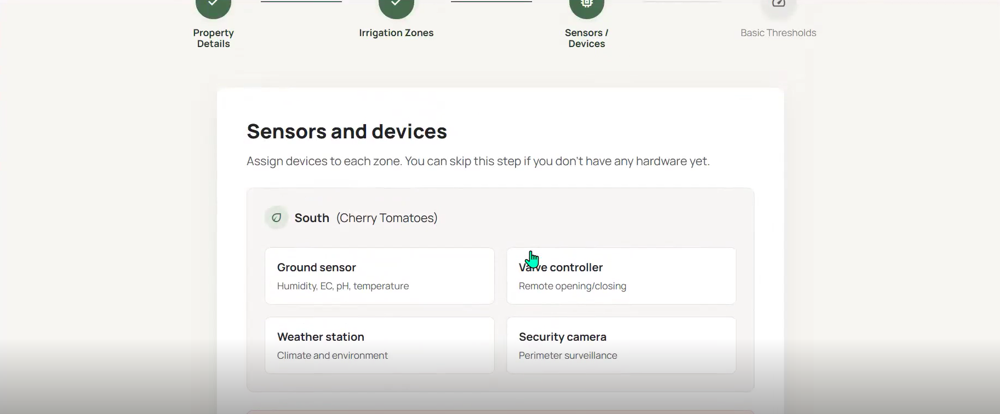

**Dashboard**

Centro de control principal que unifica y visualiza las métricas críticas en tiempo real, eliminando suposiciones mediante gráficos predictivos y claros.

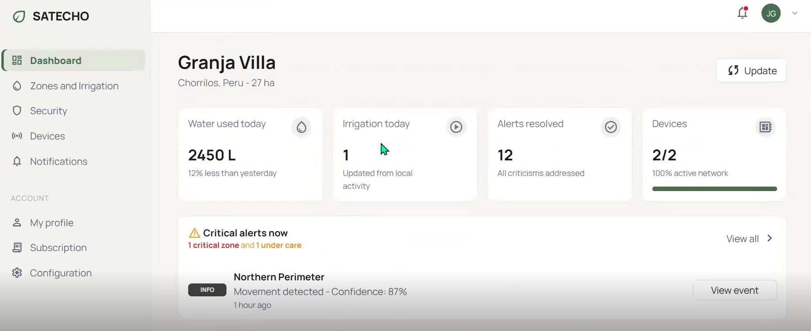

**Security**

Panel de gobernanza técnica diseñado para administrar credenciales, tokens de acceso y la seguridad general de la cuenta del usuario.

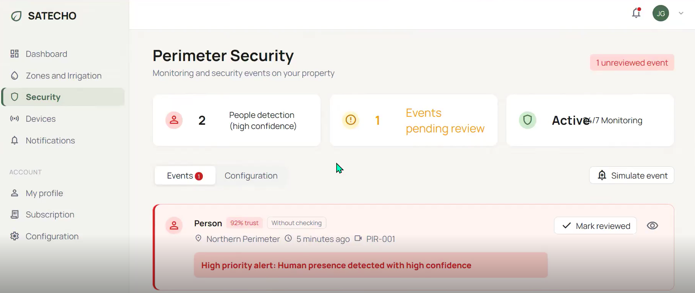

**Notification**

Módulo de alertas tempranas encargado de reflejar las notificaciones críticas del sistema ante cualquier alteración en las variables del cultivo.

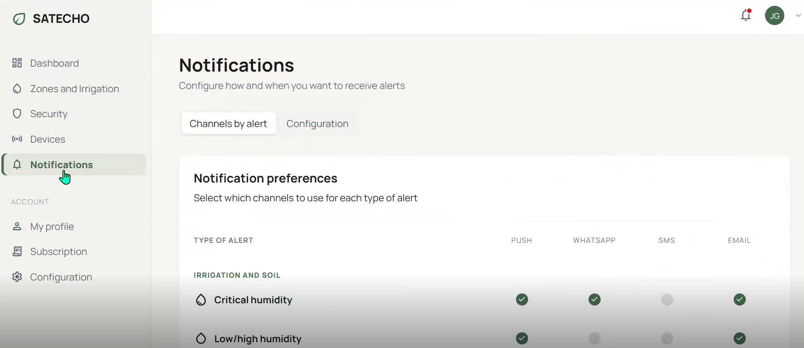

**Suscription**

Interfaz comercial que permite gestionar el estado de los planes de pago actuales y escalar los servicios según las necesidades del terreno.

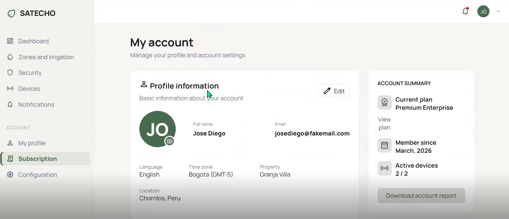

**IoT Devices Section**

Inventario operativo dedicado a listar, monitorear el estado de conexión y administrar de forma centralizada cada hardware (ESP32) desplegado.

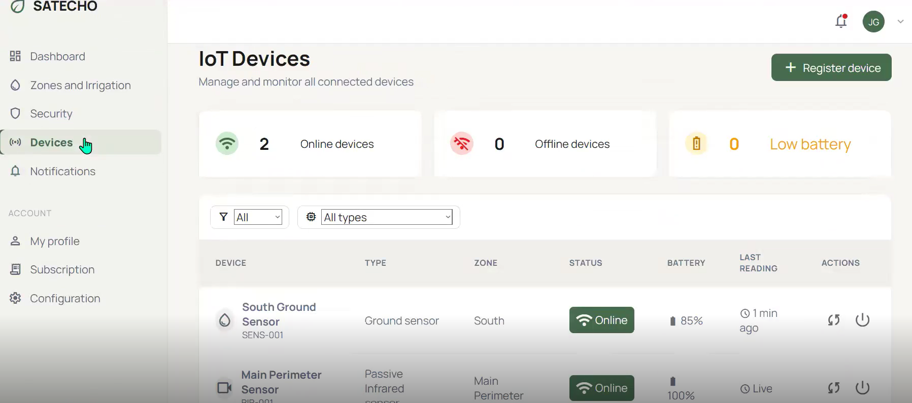

#### 6.2.1.7. Services Documentation Evidence for Sprint Review

Esta sección expone el estado de la documentación y los contratos de interfaz establecidos para los servicios de la plataforma durante el Sprint 1. Con el objetivo de garantizar el desacoplamiento técnico y permitir que el equipo de desarrollo frontend avanzara sin dependencias del backend definitivo, se implementó una estrategia táctica de emulación de servicios (API Mocking) utilizando la plataforma Beeceptor. Esta aproximación metodológica permitió modelar los esquemas de datos y validar el comportamiento de la solución web de forma idéntica a un entorno productivo.

Para esta entrega inicial, se diseñaron, estructuraron y documentaron cuatro endpoints críticos que simulan las operaciones esenciales del sistema (abarcando flujos de autenticación, gestión de perfiles, métricas del Dashboard y aprovisionamiento de hardware IoT). Aunque en este ciclo las respuestas consisten en cargas útiles fijas (JSON estáticos), estos servicios actúan como el contrato formal y la arquitectura base sobre la cual se desplegará el REST API real en Java con Spring Boot y su documentación definitiva con OpenAPI/Swagger en los sprints subsecuentes.

A continuación, se mencionan los _endpoints_ simulados para esta fase de validación de experiencia de usuario:

- https://satecho-auth.free.beeceptor.com
- https://satecho-onboarding.free.beeceptor.com
- https://satecho-farm.free.beeceptor.com
- https://satecho-operations.free.beeceptor.com

#### 6.2.1.8. Software Deployment Evidence for Sprint Review

El viaje hacia la nube comienza en la terminal de comandos dentro del directorio raíz del proyecto local. El primer paso crítico es "despertar" las capacidades de Firebase en nuestra carpeta de trabajo y vincularla con un proyecto en la consola de Google.

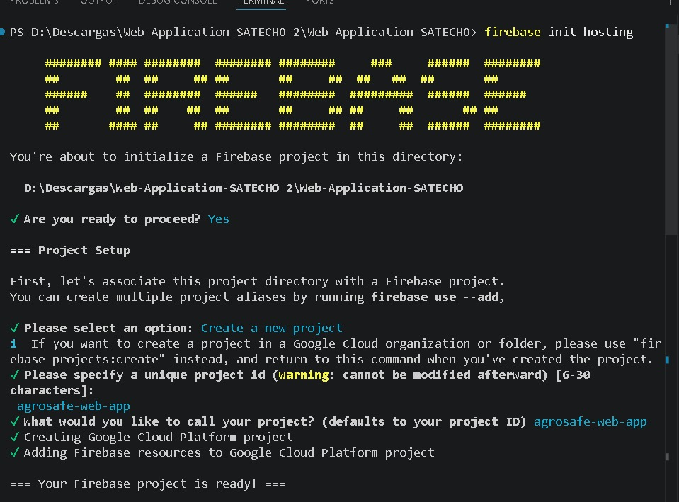

Como se observa en la Figura, el ingeniero ejecuta el comando firebase init hosting. Tras confirmar el inicio del proceso, la herramienta nos guía por un asistente visual. En este escenario, hemos optado por la opción "Create a new project" (Crear un nuevo proyecto). Es aquí donde definimos la identidad única de nuestra aplicación en la nube; para este ejemplo, hemos establecido tanto el ID como el nombre del proyecto como agrosafe-web-app. Una vez que la herramienta confirma con éxito la creación de los recursos en Google Cloud Platform, estamos listos para la configuración operativa.

**Fase 2: Parametrización del Entorno de Hosting**

Con el proyecto creado en la nube, debemos indicarle a Firebase qué archivos locales debe subir y cómo debe comportarse el servidor al recibirlos. Este paso es crucial para asegurar que la arquitectura de nuestra aplicación (ya sea una página estática o una Single Page Application bajo DDD) funcione correctamente.

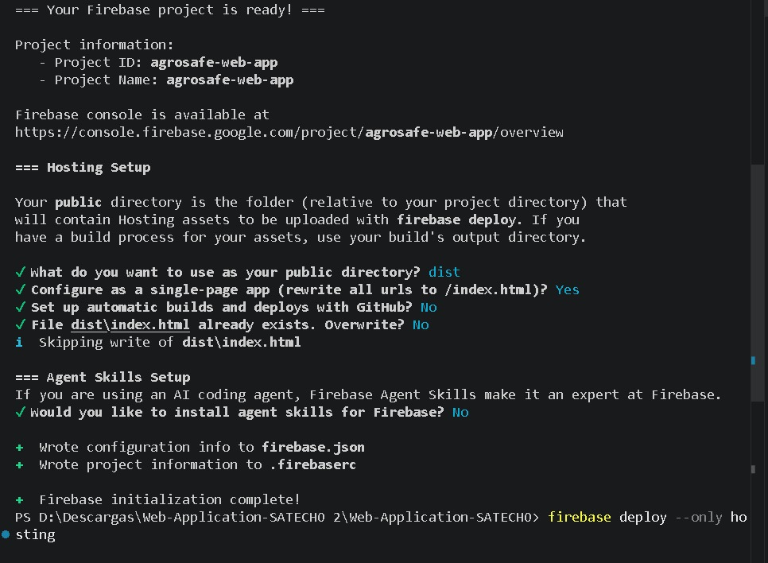

Dicha figura ilustra esta fase de parametrización. El asistente nos formula preguntas clave:

Directorio Público: Definimos dist como la carpeta que contiene los archivos finales listos para producción (resultado de nuestro proceso de construcción o build).

Single-Page App: Respondemos "Yes" para configurar las reglas de reescritura de URL, asegurando que todas las rutas apunten a index.html, vital para la navegación fluida de nuestra Web App.

Automatización: Para este hito inicial, hemos declinado la configuración de builds automáticos con GitHub Actions ("No") para mantener el despliegue bajo control manual directo.

Al finalizar este asistente, Firebase confirma la creación de los archivos de configuración .firebaserc y firebase.json, marcando el éxito de la inicialización.

**Fase 3: Ejecución del Despliegue (The Push to Cloud)**

Este es el momento de la verdad. Con todo configurado, procedemos a transferir nuestros archivos locales desde la carpeta dist hacia los servidores globales de Firebase.

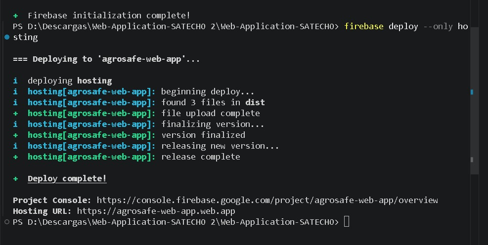

Como se muestra en la Figura Z (image_3.png), el ingeniero ejecuta el comando final: firebase deploy --only hosting. La terminal actúa como un diario de bitácora en tiempo real: vemos cómo Firebase inicia el proceso, detecta los archivos en la carpeta dist (en este caso, 3 archivos), realiza la carga completa, finaliza la versión y, finalmente, libera la nueva actualización. La confirmación "+ Deploy complete!" es el indicador del éxito, proporcionándonos de inmediato la URL pública operativa (ej. https://agrosafe-web-app.web.app) y el enlace directo a la consola de administración.

**Fase 4: Verificación en la Consola de Administración**

El proceso no termina hasta que verificamos el estado del despliegue en el panel de control oficial. Esto nos da la certeza absoluta de que la versión productiva corresponde a lo ejecutado.

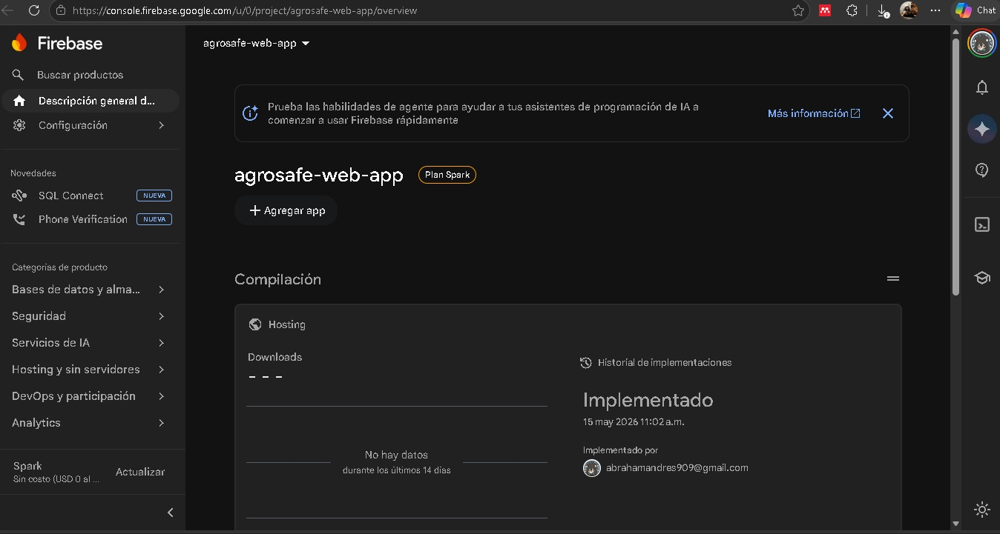

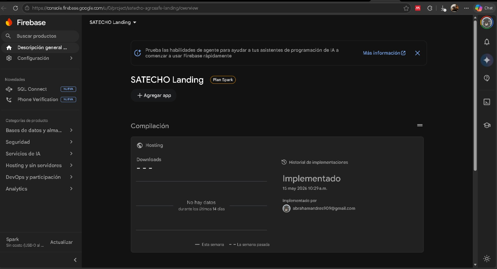

Finalmente, nos muestra la vista de la consola web de Firebase para el proyecto agrosafe-web-app. En la sección de "Hosting", podemos confirmar visualmente el "Historial de implementaciones". El panel ratifica que la versión ha sido "Implementada" exitosamente (en este ejemplo, el 15 de mayo de 2026 a las 11:02 a.m.) e identifica al miembro del equipo responsable de dicha acción. Esta trazabilidad garantiza el control de configuración requerido para el Spring Review.

#### 6.2.1.9. Team Collaborations Insights during Sprint

**Landing Page**

Con el objetivo de consolidar una _Landing Page_ que no solo informe, sino que proyecte legitimidad y capture el interés del segmento objetivo, el equipo sustituyó el desarrollo lineal por un flujo de trabajo paralelo y coordinado. Esta estrategia de co-creación se fundamentó en una descomposición modular de la interfaz, donde las responsabilidades fueron asignadas por bloques específicos (Hero, Funcionalidades, Beneficios, Planes de Pago y Formulario de Contacto), permitiendo a cada desarrollador operar con autonomía sin generar fricciones en el código base.

La integridad del repositorio se salvaguardó mediante la adopción estricta de un protocolo de comunicación atómica en Git. Cada miembro ejecutó contribuciones frecuentes y acotadas, documentadas bajo reglas semánticas claras, lo que simplificó los procesos de auditoría interna y trazabilidad de cambios. Asimismo, la integración de código se rigió bajo un modelo de calidad estricto: ninguna funcionalidad fue fusionada directamente en la rama central de integración (develop); en su lugar, se canalizaron a través de **Pull Requests** (PRs) donde un responsable o responsables del equipo evaluan la conformidad de la misma para su aprobación o su rechazo junto con comentarios para que se puedan levantar estas observaciones. Este esfuerzo técnico se complementó con un control de calidad estético (QA Visual) enfocado en la responsividad multi-dispositivo y en una rigurosa estandarización del árbol de directorios para los recursos estáticos (src/public/assets/images), asegurando un proyecto limpio y escalable.

Las métricas e indicadores visuales presentados a continuación —extraídos directamente de los insights analíticos de GitHub— certifican el ritmo de trabajo, la distribución del esfuerzo y la madurez colaborativa del equipo en este ciclo inicial:

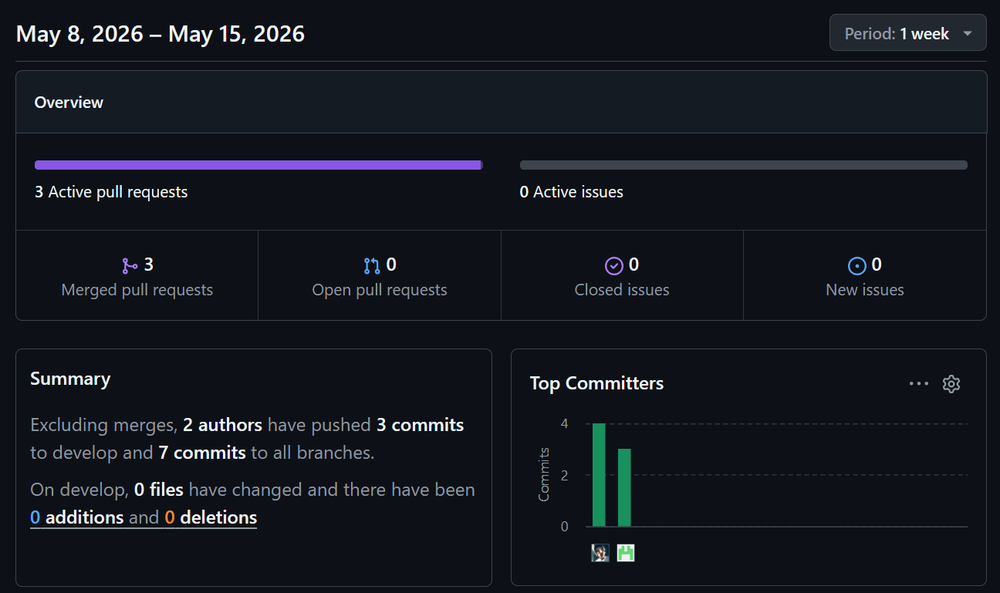

**Web Application**

De manera simultánea a los esfuerzos de maquetación comercial, el Sprint 1 albergó funcionalidad de la Aplicación Web, un hito de alta complejidad técnica que abarcó el despliegue de las interfaces críticas para la operación del negocio, tales como la sección de Dashboard, Seguridad, Gestión de los Dispositivos IoT y las notificaciones. Para mitigar la entropía y el riesgo de colisiones en el código fuente ante un volumen tan robusto de entregables, el equipo adoptó una estrategia de desarrollo altamente coordinada basada en los principios de **Domain-Driven Design (DDD)**. Esta aproximación arquitectónica nos permitió segmentar la lógica y las vistas en contextos delimitados bien definidos, asegurando que la responsabilidad de cada componente estuviera aislada y permitiendo adoptar un desarrollo en paralelo con una comprensión nítida del dominio del sistema.

Asimismo, ante la ausencia temporal de servicios backend productivos, el equipo implementó una estrategia de desacoplamiento temprano mediante la emulación de respuestas con un **Fake API** (Beeceptor); este enfoque de simulación permitió inyectar datos estáticos fijos y modelar los contratos de consumo de manera idéntica a una infraestructura real, desbloqueando las pruebas de experiencia de usuario de forma inmediata. Finalmente, el rigor metodológico se consolidó mediante una política de trazabilidad absoluta, donde cada _commit_ regular incorporó metadatos estructurados que enlazaban directamente el cambio de código con su respectiva tarea y punto de historia dentro de la planificación de Jira, blindando el ciclo de auditoría del proyecto.

El comportamiento analítico de estas interacciones se ven respaldados a continuación por las métricas de colaboración provistas por los insights de GitHub:

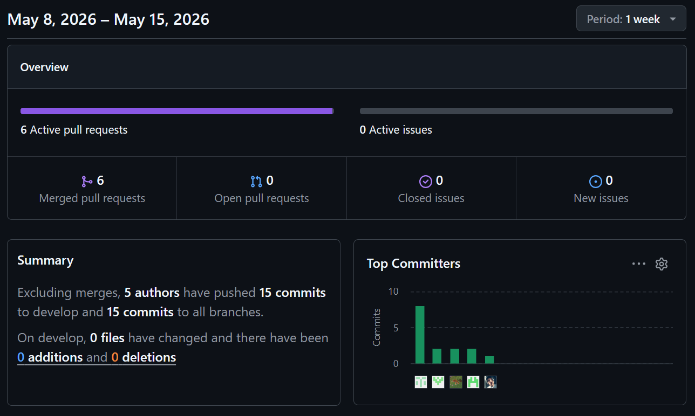

### 6.2.2. Sprint 2

En este apartado se detalla cada uno de los progresos y mejoras alcazandos por el equipo durante el desarrollo del segundo sprint del proyecto **AgroSafe**, destacando para el lado del _Landing Page_, la implementación de las secciones del video _"about-the-Product"_, la sección de integrantes del equipo de desarrollo de la startup **Satecho** y la eliminación de interacciones y secciones dedicadas a ofrecer planes _freemium_ (esto con el objetivo de que **Satecho**, al utilizar tecnología IoT, necesita solvencia monetaria para seguir progresando e innovando en su solución). Por otro lado, en relación al **Web Application**, se corrigió las vistas asociadas a la autenticación - debido a que, una cuenta registrada en la aplicación, debía configurar su perfil "agregando por su cuenta" el tipo de sensor y dispositivo IoT que utilizará en su escenario.

Luego de precisar las mejoras implementadas, adicionalmente, se priorizó el desarrollo de las nuevas funcionalidades dedicadas para el **Web Application** agregando las vistas de asociadas al monitoreo y el dashboard; por consiguiente, se elaboró las primeras versiones de los nuevos productos tales como el **RESTFUL API**, **Embedded** (para la recolección de los datos del ambiente mediante los sensores de tierra y humedad), el **Edge API** y el **Mobile Application** - orientadas a las funcionalidades de Dashboard, Parcerlas, Control de Riesgo y Registro de Actividad para el Agricultor; por otro lado, para el ingeniero agrónomo, se desarrollará las funcionalidades respecto al seguimiento de clientes, alertas y agenda.

#### 6.2.2.1. Sprint Planning 2

<table>
  <tr>
    <td>Sprint #</td>
    <td>Sprint 2</td>
  </tr>
  <tr>
    <td colspan="2"><strong>Sprint Planning Background</strong></td>
  </tr>
  <tr>
    <td>Date</td>
    <td>2026-05-25</td>
  </tr>
  <tr>
    <td>Time</td>
    <td>23:00 p.m (GMT-5)</td>
  </tr>
  <tr>
    <td>Location</td>
    <td>Asynchronous session organized within the Discord communication platform</td>
  </tr>
  <tr>
    <td>Prepared By</td>
    <td>Huamani Sánchez, José Diego</td>
  </tr>
  <tr>
    <td>Attendees (to planning meeting)</td>
    <td>Estrada Cajamune, Abraham Andrés / Gamio Upiachihua, Brenda Lucía / Quispe Erasmo, Raul Ronaldo / Palacios, Yasser Renteria</td>
  </tr>
  <tr>
    <td>Sprint 1 Review Summary</td>
    <td>During the previous sprint, the team implemented the sections associated with the startup description, solution overview, benefits, payment plans, and contact form — with the purpose of communicating SATECHO's commitment to its proposed solution to <em>leads</em> on the Landing Page. Additionally, the team implemented key sections related to indicator monitoring, Security, Notifications, Subscription, and the IoT section for the web application; this progress allowed the team to complete the vast majority of the core features planned for the application.</td>
  </tr>
  <tr>
    <td>Sprint 1 Retrospective Summary</td>
    <td>According to the retrospective session held with the entire SATECHO team, we highlighted the proactivity and planned coordination among all team members to align the expected progress for Sprint 1 and successfully present a first version to our stakeholders. However, we unanimously identified as areas for improvement that, given the large number of deliverables within a very limited timeframe, progress dependency became centralized on individual contributors — since members tended to work independently, the sheer magnitude of development caused delays and created bottlenecks for continuing both the report and the implementation of digital artifacts. As a result of these issues, the team restructured its work planning approach by experimentally adopting the <q>Team Software Process</q> framework to measure team-level delivery maturity and agility, identify gaps, and track improvements in collaboration and deliverable metrics through measurable outcomes.</td>
  </tr>
  <tr>
    <td colspan="2"><strong>Sprint Goal & User Stories</strong></td>
  </tr>
  <tr>
    <td>Sprint 2 Goal</td>
    <td>
<strong>Our focus is on</strong> delivering a complete agricultural monitoring experience with real-time IoT sensor data to independent farmers and agronomists, accessible from the Web Application and their mobile devices, backed by a premium value proposition visible on the Landing Page. <br>
<strong>We believe it delivers</strong> faster soil-evidence-based irrigation and agronomic decision-making to farmers and agronomists on the platform, and greater product confidence to agricultural sector visitors evaluating the premium subscription plan. <br>
<strong>This will be confirmed when</strong> farmers can view the hydric status of their parcels in real time and remotely activate irrigation from both the Web Application and the Mobile Application; when agronomists can supervise assigned client parcels and send agronomic recommendations through the platform; and when Landing Page visitors can evaluate SATECHO's premium value proposition and initiate the registration process without team intervention.
    </td>
  </tr>
  <tr>
    <td>Sprint 2 Velocity</td>
    <td>81</td>
  </tr>
  <tr>
    <td>Sum of Story Points</td>
    <td>81</td>
  </tr>
</table>

#### 6.2.2.2. Aspect Leaders and Collaborations

Durante el Sprint 2, la complejidad de la entrega se multiplicó exponencialmente al incorporar seis productos de software de forma simultánea: la segunda versión de la Landing Page, la versión final de la Aplicación Web, la primera versión del RESTful API, la primera versión de la Aplicación Móvil, la primera versión del Edge API y la primera versión de la Aplicación Embebida. Para gestionar este desafío de forma ordenada, el equipo adoptó el marco de trabajo **Team Software Process (TSP)**, que define con precisión los líderes de cada aspecto y sus colaboradores, reduciendo la ambigüedad en la toma de decisiones y eliminando las colas de espera que afectaron la velocidad del sprint anterior.

| Team Member (Last Name, First Name) |  GitHub Username  | Landing Page v2 | Web App v2 | REST API | Mobile App | Edge API | Embedded |
| :---------------------------------- | :----------------: | :---------: | :---------: | :---------: | :---------: | :---------: | :---------: |
| Huamani Sánchez, José Diego       |  `ProgramadorHuamani`  | C | C | **L** | C | | |
| Estrada Cajamune, Abraham Andrés        |     `Abraham0310`     | C | C | C | **L** | | C |
| Gamio Upiachihua, Brenda Lucía         |     `B-Gamio`     | **L** | **L** | C | C | | |
| Quispe Erasmo, Raul Ronaldo      |    `Raul-QE`   | | C | C | | **L** | C |
| Palacios, Yasser Renteria        |      `Mitos20`     | C | C | C | C | C | **L** |

#### 6.2.2.3. Sprint Backlog 2

Este segundo sprint representa el hito de mayor densidad técnica del proyecto, con la integración vertical completa del ecosistema SATECHO: desde el firmware embebido en los sensores ESP32 hasta las interfaces web y móviles que consumen los datos en tiempo real. El backlog fue diseñado para cubrir simultáneamente seis productos de software bajo el principio de entrega de valor continua, priorizando la arquitectura de extremo a extremo (E2E) sobre funcionalidades aisladas.

**Proyecto en Jira:** [https://satecho.atlassian.net/jira/software/projects/SCRUM/boards/1](https://satecho.atlassian.net/jira/software/projects/SCRUM/boards/1)

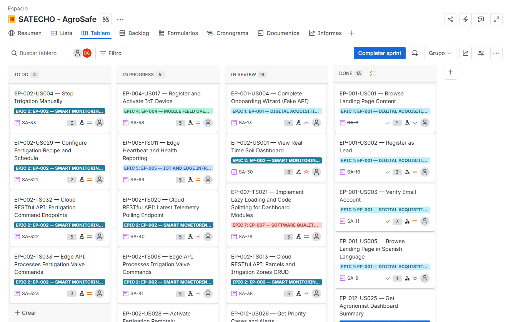

# Sprint 2 – Sprint Backlog

| Sprint 2 | Sprint Backlog 2 | | | | | | |
|----------|-----------------|----------------|-------|-------------|-------------------|-------------|--------|
| **User Story** | **Title** | **Work Item/Task** | **Title** | **Description** | **Estimation (SP)** | **Assigned to** | **Status** |
| *(sin US equivalente en §3.1)* | US-08: View About-the-Product Video | EP-002-EXT07-T01 | Integrate product demo video section in landing page | As a visitor, I want to watch an explanatory video about SATECHO's product so that I can understand how the solution works before contacting a representative. | 2 | Brenda Gamio | Done |
| *(sin US equivalente en §3.1)* | US-09: View Startup Team Members | EP-002-EXT08-T01 | Design and implement the team members section | As a visitor, I want to see the startup team members section so that I can know who is behind the product and build trust in the organization. | 2 | Brenda Gamio | Done |
| *(sin US equivalente en §3.1)* | US-10: Browse Premium-Only Plans | EP-002-EXT09-T01 | Remove freemium tiers and update pricing section to premium model | As a visitor, I want to browse the available premium subscription plans so that I can evaluate the commercial offer before contacting the SATECHO team. | 1 | Yasser Palacios | Done |
| EP-001-US005 | US-11: Register Farm and First Parcel (Fix) | EP-001-US005-T05 | Implement irrigation zone removal with minimum zone validation | As a newly registered user, I want to remove an irrigation zone during onboarding so that I can correct my initial configuration before activating the system. | 2 | Abraham Estrada | Done |
| | | EP-001-US005-T06 | Add removable protocol templates to onboarding wizard | | | Brenda Gamio | Done |
| | | EP-001-US005-T07 | Validate personal data fields before proceeding to step 3 of onboarding | | | Brenda Gamio | Done |
| *(bundle: EP-009-US003, EP-009-US006, EP-010-US001, EP-002-US004)* | US-12: View Agronomist Analysis Dashboard | EP-002-EXT10-T01 | Implement analysis and soil thresholds management views for agronomist | As an agronomist, I want to view analysis dashboards and configure soil thresholds so that I can monitor critical crop parameters remotely. | 5 | Brenda Gamio | Done |
| | | EP-002-EXT10-T02 | Develop account management and device monitoring views for agronomist | | | Brenda Gamio | Done |
| | | EP-002-EXT10-T03 | Implement irrigation control and perimeter security views for agronomist dashboard | | | Brenda Gamio | Done |
| *(bundle: EP-001-US004; sin plan de suscripción para agrónomo en §3.1)* | US-13: Manage Agronomist Profile and Plans | EP-002-EXT11-T01 | Implement profile management and notification settings for agronomist | As an agronomist, I want to manage my professional profile and notification preferences so that I receive relevant alerts from my assigned clients. | 3 | Brenda Gamio | Done |
| | | EP-002-EXT11-T02 | Implement plan system view for agronomist account | | | Brenda Gamio | Done |
| EP-009-US005 | US-14: View Priority Cases | EP-009-US005-T01 | Develop priority cases queue and critical alert detail views for agronomist | As an agronomist, I want to view a priority cases panel so that I can attend to the most critical situations among my clients first. | 3 | Brenda Gamio | Done |
| *(bundle: EP-002-US001 enhancement + EP-003-US002)* | US-15: View Real-Time Telemetry Dashboard | EP-002-EXT12-T01 | Implement telemetry dashboard with salinity chart and security event log | As a farmer, I want to view real-time telemetry data including salinity and security events so that I have a complete picture of my field conditions. | 5 | Abraham Estrada | Done |
| | | EP-002-EXT12-T02 | Add telemetry route and integrate TelemetryDashboardView into navigation | | | Abraham Estrada | Done |
| EP-010-US001 | US-16: View Device Inventory | EP-010-US001-T01 | Implement DeviceFleetView with fleet monitoring, telemetry metrics, device actions and maintenance management | As a fleet administrator, I want to view all registered devices and their real-time status so that I can manage the hardware fleet. | 5 | Abraham Estrada | Done |
| | | EP-010-US001-T02 | Develop NotificationsRulesView for configuring alert thresholds per device | | | Abraham Estrada | Done |
| EP-001-TS001 | TS-05: Implement IAM Bounded Context - REST API | EP-001-TS001-T01 | Implement domain model entities and rules for identity management | As a Developer, I want to implement the identity and access management module with JWT authentication so that all endpoints are protected. | 8 | José Huamani | Done |
| | | EP-001-TS001-T02 | Implement authentication and user use cases in application layer | | | José Huamani | Done |
| | | EP-001-TS001-T03 | Implement persistence repositories and security configuration in infrastructure layer | | | José Huamani | Done |
| | | EP-001-TS001-T04 | Expose REST API endpoints and request/response resources | | | José Huamani | Done |
| | | EP-001-TS001-T05 | Add account verification and resend verification commands and endpoints | | | José Huamani | Done |
| EP-001-TS002 | TS-06: Implement Onboarding Bounded Context - REST API | EP-001-TS002-T01 | Add domain layer commands, queries and events for farm and zone management | As a Developer, I want to implement the registration, email verification, and farm/parcel creation endpoints so that the onboarding flow is fully supported. | 5 | José Huamani | Done |
| | | EP-001-TS002-T02 | Implement infrastructure persistence layer for Farm and IrrigationZone entities | | | Raul Quispe | Done |
| | | EP-001-TS002-T03 | Implement command and query services for Farm and Zone management | | | Raul Quispe | Done |
| | | EP-001-TS002-T04 | Add resources and command assemblers for farm and zone REST endpoints | | | José Huamani | Done |
| EP-002-TS001 | TS-07: Implement MQTT Integration and BI Bounded Context - REST API (bundle: EP-002-TS003) | EP-002-TS001-T01 | Add MQTT actuator publisher and integrate with irrigation session commands | As a Developer, I want to implement the REST endpoint for receiving and storing telemetry readings from the Edge so that sensor data is persisted in the cloud. | 8 | José Huamani | Done |
| | | EP-002-TS001-T02 | Implement SoilTelemetryMqttListener to consume telemetry from ESP32 devices | | | José Huamani | Done |
| | | EP-002-TS001-T03 | Add query and resource models for fleet health, irrigation and notifications | | | Raul Quispe | Done |
| EP-004-TS001 | US-17: Scaffold Farmer Mobile App (Flutter DDD Architecture) | EP-004-TS001-T01 | Create initial Flutter project with feature-based bounded context architecture | As a Developer, I want to implement a DDD architecture in Flutter with role-based routing and dependency injection so that multiple user profiles are fully supported. | 5 | Abraham Estrada | Done |
| | | EP-004-TS001-T02 | Implement role-based navigation and login flow | | | Abraham Estrada | Done |
| *(bundle: EP-004-US001, EP-004-US002)* | US-18: Monitor Irrigation and Soil in Real-Time (Mobile) | EP-002-EXT13-T01 | Implement DeviceStatusList with 15-second polling for irrigation status | As a farmer, I want to see real-time status of my devices and active irrigation sessions on my mobile app so that I can make timely decisions in the field. | 8 | Abraham Estrada | Done |
| | | EP-002-EXT13-T02 | Integrate real-time updates for irrigation sessions and sensor metrics | | | Abraham Estrada | Done |
| | | EP-002-EXT13-T03 | Fix responsive layout and overflow issues across mobile screens | | | Abraham Estrada | Done |
| *(bundle: EP-009-US008; sin shell de agrónomo equivalente en EP-004 §3.1)* | US-19: Access Agronomist Workspace (Mobile) | EP-002-EXT14-T01 | Implement agronomist workspace features: client tracking, alerts and schedule | As an agronomist, I want to access a dedicated workspace on the mobile app so that I can manage my clients, view critical alerts and organize my schedule. | 5 | Abraham Estrada | Done |
| | | EP-002-EXT14-T02 | Connect mobile application to real REST API infrastructure | | | Abraham Estrada | Done |
| EP-005-TS002 | TS-08: Implement Device Authentication - Edge API | EP-005-TS002-T01 | Define device entity and repository interface in domain layer | As a Developer, I want to implement device authentication on the Edge using device_id and MAC address as an API key so that only authorized devices can communicate. | 3 | Raul Quispe | Done |
| | | EP-005-TS002-T02 | Implement authentication service and infrastructure persistence layer | | | Raul Quispe | Done |
| | | EP-005-TS002-T03 | Expose device registration and authentication REST endpoints | | | Raul Quispe | Done |
| EP-005-TS003 | TS-09: Implement Soil Data Capture - Edge API | EP-005-TS003-T01 | Define soil reading entity and domain service with boundary validation | As a Developer, I want to implement the Edge soil endpoint that supports both native ESP32 and legacy field names so that firmware versions are interoperable. | 5 | Raul Quispe | Done |
| | | EP-005-TS003-T02 | Implement MQTT publisher for soil readings and cloud sync service with heartbeat | | | Raul Quispe | Done |
| | | EP-005-TS003-T03 | Expose soil monitoring REST endpoint with API key authentication | | | Raul Quispe | Done |
| EP-003-TS001 | TS-10: Implement PIR Movement Classification - Edge API | EP-003-TS001-T01 | Define PIR event entity, classification domain service and repository | As a Developer, I want to implement the PIR classification algorithm on the Edge so that events are categorized before being persisted. | 3 | Raul Quispe | Done |
| | | EP-003-TS001-T02 | Implement MQTT publisher for PIR events and REST endpoint | | | Raul Quispe | Done |
| *(sin TS equivalente en §3.1 — cobertura de pruebas Edge no está en el backlog vigente)* | TS-11: Implement Testing Suite - Edge API | EP-002-EXT15-T01 | Add unit tests for SoilReadingService domain boundaries and PIR classification service | As a Developer, I want a comprehensive test suite for the Edge API so that regressions are detected automatically before each deployment. | 3 | Raul Quispe | Done |
| | | EP-002-EXT15-T02 | Add integration tests for soil reading application service using SQLite | | | Raul Quispe | Done |
| | | EP-002-EXT15-T03 | Add acceptance tests for device registration and soil monitoring REST endpoints | | | Raul Quispe | Done |
| *(bundle: EP-002-MS001–MS006, EP-003-MS001, EP-010-MS001 — ID de épica EP-006 era incorrecto, no corresponde a Embedded)* | TS-12: Implement ESP32 Firmware - Event-Driven Architecture | EP-002-EXT16-T01 | Implement sensor abstraction layer with FC28, HR202L, DHT11 and DS18B20 drivers | As a Developer, I want the ESP32 firmware to read all soil and ambient sensors in a FreeRTOS event-driven architecture so that no CPU cycles are wasted in polling loops. | 5 | Yasser Palacios | Done |
| | | EP-002-EXT16-T02 | Implement connectivity management and MQTT telemetry serialization | | | Yasser Palacios | Done |
| | | EP-002-EXT16-T03 | Implement actuator control module for irrigation valve management | | | Yasser Palacios | Done |
| | | EP-002-EXT16-T04 | Add safety mechanisms and watchdog timers for fault tolerance | | | Yasser Palacios | Done |
| | | EP-002-EXT16-T05 | Implement MAC address capture for device authentication with Edge API | | | Yasser Palacios | Done |

*Nota de alineación: los IDs de esta tabla fueron corregidos para coincidir con el backlog vigente de la sección 3.1. El Epic EP-003 cambió de alcance entre revisiones del backlog — en esta iteración representaba "scaffolding de la Mobile App", y en la sección 3.1 vigente representa el dominio de seguridad PIR — por eso las historias EP-003-US001/002/003 originales fueron remapeadas a sus equivalentes reales (EP-004-TS001, bundle EP-004-US001/US002, bundle EP-009-US008) y no al EP-003 actual. Las filas marcadas "(sin equivalente en §3.1)" o "(bundle: ...)" corresponden a trabajo entregado en este sprint sin una historia formal 1:1 en el backlog vigente, o que cubre varias historias actuales a la vez; se conservan bajo IDs internos `EP-002-EXTxx` como evidencia histórica.*

#### 6.2.2.4. Development Evidence for Sprint Review

En este Sprint 2, el alcance del desarrollo se expandió significativamente para cubrir la integración vertical completa del ecosistema SATECHO. Se materializaron las primeras versiones funcionales de los seis productos de software que conforman la solución: la versión actualizada de la Landing Page y la Aplicación Web, el RESTful API con sus primeros contextos acotados funcionales, la Aplicación Móvil con roles diferenciados para agricultor y agrónomo, el Edge API con procesamiento local de telemetría, y el firmware embebido para el ESP32 con arquitectura orientada a eventos. A continuación, se presenta el registro cronológico de commits que certifica la autoría, el propósito y la evolución del código fuente integrado satisfactoriamente en este sprint.

*Nota de evidencia: las filas de Landing_Page-SATECHO fueron corregidas — la tabla original tenía el mensaje de commit desplazado a la columna "Commit Id" (sin SHA real) y fechas (26-27/05/26) que no coinciden con el historial real del repositorio. No se encontró en el historial real un commit específico para "remove freemium tiers"; esa fila se retira por no ser verificable.*

| Repository | Branch | Commit Id | Commit Message | Committed On |
|---|---|---|---|---|
| Landing_Page-SATECHO | feature/hero | c3cae67 | feat(header): add the navigation and header section about the AgroSafe landing page. | 16/06/26 |
| Landing_Page-SATECHO | feature/about-us | 9469b17 | feat(about-us): add the about-us section explaining the product's value proposition for farmers and leads. | 16/06/26 |
| Landing_Page-SATECHO | feature/about-the-team | 2bd028b | feat(about-the-team): add the about-the-team section including the video with team member profiles. | 16/06/26 |
| Landing_Page-SATECHO | main | c3430fc | feat: add video about the team and about the product. | 22/06/26 |
| Web-Application-SATECHO | feature/error-pages | e2d08a8 | feat(error-pages): add styled 404 page and wildcard route handling. | 26/05/26 |
| Web-Application-SATECHO | feature/onboarding | 6c89776 | feat(onboarding): add irrigation zone removal with minimum zone validation. | 26/05/26 |
| Web-Application-SATECHO | feature/onboarding | 9b09c91 | feat(feature/onboarding): add removable protocol templates. | 28/05/26 |
| Web-Application-SATECHO | feature/dashboard-agronomo | 99ed4fc | feat(feature/dashboard-agronomo): implement analysis and thresholds management views. | 28/05/26 |
| Web-Application-SATECHO | feature/auth | 3ea9754 | fix(feature/auth): validate personal data before proceeding to step 3. | 28/05/26 |
| Web-Application-SATECHO | feature/dashboard-agronomo | ccbede2 | feat(dashboard-agronomist): add priority cases queue and critical alert detail views. | 09/06/26 |
| Web-Application-SATECHO | feature/dashboard-agronomo | 5d3a7d7 | feat(feature/dashboard-agronomo): implement account management, device monitoring and irrigation/security improvements. | 09/06/26 |
| Web-Application-SATECHO | feature/dashboard-agronomo | ff10bef | feat(feature/dashboard-agronomo): implement profile management, plan system and notification settings. | 10/06/26 |
| Web-Application-SATECHO | feature/dashboard | cc69724 | feat: add telemetry dashboard with salinity chart and security event log. | 15/06/26 |
| Web-Application-SATECHO | feature/dashboard | 206a626 | feat: add telemetry route and import TelemetryDashboardView. | 15/06/26 |
| Web-Application-SATECHO | feature/dashboard | f410c43 | feat(feature/dashboard): add DeviceFleetView with fleet monitoring, telemetry metrics, device actions, maintenance management and responsive UI. | 18/06/26 |
| Web-Application-SATECHO | feature/dashboard | 4925205 | feat(feature/dashboard): add NotificationsRulesView with script, template and css. | 18/06/26 |
| Web-Application-SATECHO | main | 334ce29 | chore: update deployed connection. | 20/06/26 |
| Web-API-Service-SATECHO | main | d8d4491 | build: rename artifact to com.satecho.agrosafe.platform. | 26/05/26 |
| Web-API-Service-SATECHO | feature/shared | dba183a | feat(shared): add domain event and exception handling infrastructure with RabbitMQ integration. | 27/05/26 |
| Web-API-Service-SATECHO | feature/shared | 2911ef1 | feat(shared): add security configuration for API with CSRF disabled and Swagger access. | 27/05/26 |
| Web-API-Service-SATECHO | feature/bc-iam | 2990c3b | feature/bc-iam(domain): core domain model entities and rules for identity management. | 29/05/26 |
| Web-API-Service-SATECHO | feature/bc-iam | 470c49a | feature/bc-iam(application): implement authentication and user use cases. | 29/05/26 |
| Web-API-Service-SATECHO | feature/bc-iam | 26c0193 | feature/bc-iam(interfaces): expose rest api endpoints and request/response resources. | 29/05/26 |
| Web-API-Service-SATECHO | feature/bc-iam | 0db5b61 | feat(iam): enhance security and persistence layers with role and user entities, update logging practices. | 03/06/26 |
| Web-API-Service-SATECHO | feature/bc-iam | 04206cd | feat(iam): refactor controllers to use application services and improve response handling. | 03/06/26 |
| Web-API-Service-SATECHO | feature/onboarding | 0da1be3 | feat(onboarding): add domain layer with commands, queries and events classes for farm and zone management. | 09/06/26 |
| Web-API-Service-SATECHO | feature/onboarding | d48de1a | feat(onboarding): implement infrastructure persistence layer for Farm and IrrigationZone entities with corresponding assemblers and repositories. | 09/06/26 |
| Web-API-Service-SATECHO | feature/onboarding | 2dbbcf7 | feat(onboarding): implement command and query services for Farm and Zone management. | 09/06/26 |
| Web-API-Service-SATECHO | feature/onboarding | a3062ac | feat(onboarding): add resources and command assemblers for farm and zone management. | 09/06/26 |
| Web-API-Service-SATECHO | feature/bc-iam | ce68c91 | feat(iam): add commands for account verification and user role management. | 10/06/26 |
| Web-API-Service-SATECHO | feature/bc-iam | 6c671e4 | feat(iam): implement user and role persistence layers with corresponding assemblers and repositories. | 10/06/26 |
| Web-API-Service-SATECHO | feature/bc-iam | a98637c | feat(iam): integrate resend email service and update user verification logic. | 10/06/26 |
| Web-API-Service-SATECHO | feature/bi | d025614 | feat(bi): add MQTT actuator publisher and integrate with irrigation session commands. | 15/06/26 |
| Web-API-Service-SATECHO | feature/bi | 3fdc3f5 | feat(bi): add SoilTelemetryMqttListener and SoilTelemetry handling via MQTT. | 15/06/26 |
| Web-API-Service-SATECHO | feature/bi | 03d4f9c | feat(bi): update MQTT actuator commands and add edge API key configuration. | 15/06/26 |
| Web-API-Service-SATECHO | main | 879addd | fix(merge): resolve conflict markers in IAM and Onboarding files. | 16/06/26 |
| Mobile-Application-SATECHO | main | e2e08f5 | first commit. | 30/05/26 |
| Mobile-Application-SATECHO | feature/farmer | e45c3f1 | feat: scaffold farmer mobile app. | 30/05/26 |
| Mobile-Application-SATECHO | feature/agronomist | f59f88c | feat: add agronomist workspace features. | 08/06/26 |
| Mobile-Application-SATECHO | feature/auth | e1fdb74 | feat: add mock login and role selection. | 08/06/26 |
| Mobile-Application-SATECHO | feature/auth | a761b89 | feat: add role based navigation smoke tests. | 08/06/26 |
| Mobile-Application-SATECHO | develop | ca29d07 | merge(develop): integrate agronomist workspace features and real API infrastructure. | 12/06/26 |
| Mobile-Application-SATECHO | feature/devices | 1836328 | feat(devices, irrigation): DeviceStatusList + 15s polling for irrigation status. | 12/06/26 |
| Mobile-Application-SATECHO | feature/ui | 66bcf26 | fix(ui): responsive layout — fix overflows and adaptive padding. | 12/06/26 |
| Mobile-Application-SATECHO | feature/irrigation | 9a0f91f | feat(irrigation): integrate real-time updates for irrigation sessions and sensor metrics. | 15/06/26 |
| Mobile-Application-SATECHO | develop | d6b834e | refactor(structure): reorganize to feature-based bounded contexts. | 20/06/26 |
| Edge-API-SATECHO | main | 908bfdc | first commit. | 15/06/26 |
| Edge-API-SATECHO | develop | 5017544 | add initial main function and entry point. | 15/06/26 |
| Edge-API-SATECHO | feature/chore-shared-infrastructure | ba75fed | feat(shared): implement cloud sync service with telemetry and heartbeat functionality. | 16/06/26 |
| Edge-API-SATECHO | feature/soil-data-capture | dd99912 | feat(soil): add soil reading entity, repository, and MQTT publisher. | 16/06/26 |
| Edge-API-SATECHO | feature/device-authentication | da894e1 | feat(iam): add device entity, repository, and authentication service. | 16/06/26 |
| Edge-API-SATECHO | feature/movement-classification | f83d65c | feat(pir): add PIR event handling, define entities, models, and services for event classification and MQTT publishing. | 16/06/26 |
| Edge-API-SATECHO | feature/unit-tests | 9019e7f | feat(tests): add unit tests for PIR and soil reading services. | 21/06/26 |
| Edge-API-SATECHO | feature/integration-tests | b15921f | feat(tests): add integration tests for soil reading application service. | 21/06/26 |
| Edge-API-SATECHO | feature/acceptance-tests | 1bd047c | test: add unit tests for device registration and soil monitoring APIs. | 21/06/26 |
| Embedded-Application-SATECHO | main | 0da17ab | feat: add connectivity management, safety mechanisms, sensor abstraction, and telemetry serialization. | 15/06/26 |
| Embedded-Application-SATECHO | main | 1f65733 | refactor: sensor and telemetry modules for event-driven architecture. | 15/06/26 |
| Embedded-Application-SATECHO | main | 75cc57b | refactor: actuator control and telemetry for event-driven architecture. | 15/06/26 |
| Embedded-Application-SATECHO | main | d6538be | feat: update capturing mac address. | 21/06/26 |

#### 6.2.2.5. Testing Suite Evidence for Sprint Review

Durante este segundo sprint, el equipo consolidó su primera suite de pruebas automatizadas centrada en el **Edge API**, el componente más crítico de la cadena de ingesta de datos, dado que actúa como filtro y validador de toda la telemetría proveniente del hardware embebido antes de ser sincronizada con la nube. La decisión de priorizar el Edge para las pruebas responde a que cualquier error en la validación de rangos o en la autenticación de dispositivos se propaga hacia todos los sistemas superiores. Las pruebas se implementaron con **pytest** bajo tres capas:

**Capa 1 - Pruebas Unitarias de Dominio (Domain Layer)**

Validan las reglas de negocio del servicio `SoilReadingService`, asegurando que ningún valor de sensor fuera de rango pueda persistirse en el sistema.

| Archivo de Test | Escenario de Prueba | Resultado Esperado |
|---|---|---|
| `tests/domain/test_soil_reading_service.py` | Lectura con todos los campos válidos | Entidad creada con `is_valid = True` |
| `tests/domain/test_soil_reading_service.py` | Humedad en límites [0%, 100%] | Sin excepción |
| `tests/domain/test_soil_reading_service.py` | Humedad fuera de rango (-0.1, 100.1) | `ValueError` con mensaje "moisture" |
| `tests/domain/test_soil_reading_service.py` | Conductividad eléctrica en límites [0, 20 dS/m] | Sin excepción |
| `tests/domain/test_soil_reading_service.py` | Conductividad fuera de rango (-1, 20.1) | `ValueError` con mensaje "ec" |
| `tests/domain/test_soil_reading_service.py` | pH en límites [0, 14] | Sin excepción |
| `tests/domain/test_soil_reading_service.py` | pH fuera de rango (-0.1, 14.1) | `ValueError` con mensaje "ph" |
| `tests/domain/test_soil_reading_service.py` | Temperatura en límites [-10°C, 60°C] | Sin excepción |
| `tests/domain/test_soil_reading_service.py` | Valores no numéricos en campos de sensor | `ValueError` con mensaje "Sensor values must be numeric" |
| `tests/domain/test_soil_reading_service.py` | `recorded_at` como string ISO 8601 | Campo parseado correctamente con timezone UTC |
| `tests/domain/test_soil_reading_service.py` | `recorded_at` nulo | Asignación automática de timestamp UTC actual |
| `tests/domain/test_pir_classification_service.py` | Clasificación de eventos PIR por tipo | Evento clasificado correctamente (intrusión vs movimiento normal) |

**Capa 2 - Pruebas de Integración (Application Layer)**

Validan la interacción entre el servicio de aplicación y la capa de persistencia con una base de datos SQLite de prueba, verificando el ciclo completo de almacenamiento y recuperación.

| Archivo de Test | Escenario de Prueba | Resultado Esperado |
|---|---|---|
| `tests/application/test_soil_reading_application_service.py` | Registrar una lectura válida y recuperarla por ID | Lectura persistida con todos los campos correctos |
| `tests/application/test_soil_reading_application_service.py` | Consultar lecturas por `device_id` | Lista de lecturas filtradas correctamente |

**Capa 3 - Pruebas de Aceptación de API (Interfaces Layer)**

Validan el comportamiento del cliente HTTP contra los endpoints REST del Edge API, cubriendo los escenarios de autenticación, validación de payload y respuestas de error.

| Archivo de Test | Escenario de Prueba | Código HTTP Esperado |
|---|---|---|
| `tests/interfaces/test_soil_api.py` | POST `/api/v1/soil-monitoring/readings` sin API Key | `401 Unauthorized` |
| `tests/interfaces/test_soil_api.py` | POST sin `device_id` en header | `401 Unauthorized` |
| `tests/interfaces/test_soil_api.py` | POST sin `farm_id` en body | `400 Bad Request` |
| `tests/interfaces/test_soil_api.py` | POST con campos ESP32 válidos (`humidity_fc28`, `salinity_hr202l`, `soil_temp_ds18b20`) | `201 Created` con respuesta JSON completa |
| `tests/interfaces/test_soil_api.py` | POST con campos legacy válidos (`moisture`, `ec`, `temperature`) | `201 Created` |
| `tests/interfaces/test_soil_api.py` | POST con valor de sensor fuera de rango (moisture=999) | `400 Bad Request` con mensaje "moisture" |
| `tests/interfaces/test_iam_api.py` | POST `/api/v1/iam/devices` para registrar nuevo dispositivo | `201 Created` con `device_id` y `api_key` |
| `tests/interfaces/test_iam_api.py` | GET `/api/v1/iam/devices` para listar dispositivos registrados | `200 OK` con lista de dispositivos |

#### 6.2.2.6. Execution Evidence for Sprint Review

Esta sección consolida la evidencia de ejecución de todos los productos digitales entregados en el Sprint 2, presentando capturas de pantalla representativas de los flujos implementados en cada componente de la solución SATECHO.

#### Landing Page (v2)

La segunda versión de la Landing Page incorpora tres cambios estratégicos: la sección de video demostrativo del producto, la sección del equipo de la startup y la migración completa al modelo comercial premium (eliminando las opciones freemium). Estos cambios consolidan la propuesta de valor y la transparencia organizacional ante los potenciales clientes.

**Planes Premium**

Versión actualizada de la sección de planes de pago, exclusivamente con opciones premium que reflejan la inversión en hardware IoT y soporte técnico especializado requeridos por el modelo de negocio.

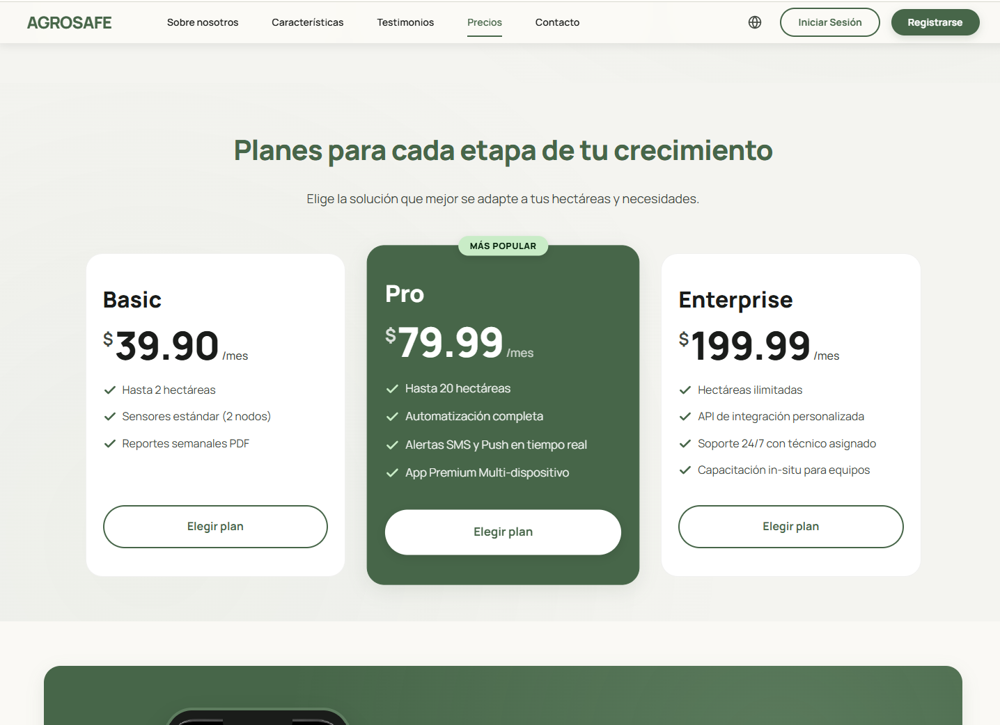

#### Web Application (v2)

La versión final de la Aplicación Web amplía significativamente el alcance funcional con vistas especializadas para ambos segmentos objetivo: el agricultor y el agrónomo.

**Dashboard Agrónomo - Análisis y Umbrales**

Vista especializada para el ingeniero agrónomo que permite monitorear análisis de suelo y configurar umbrales críticos por cultivo, habilitando alertas automáticas ante condiciones adversas.

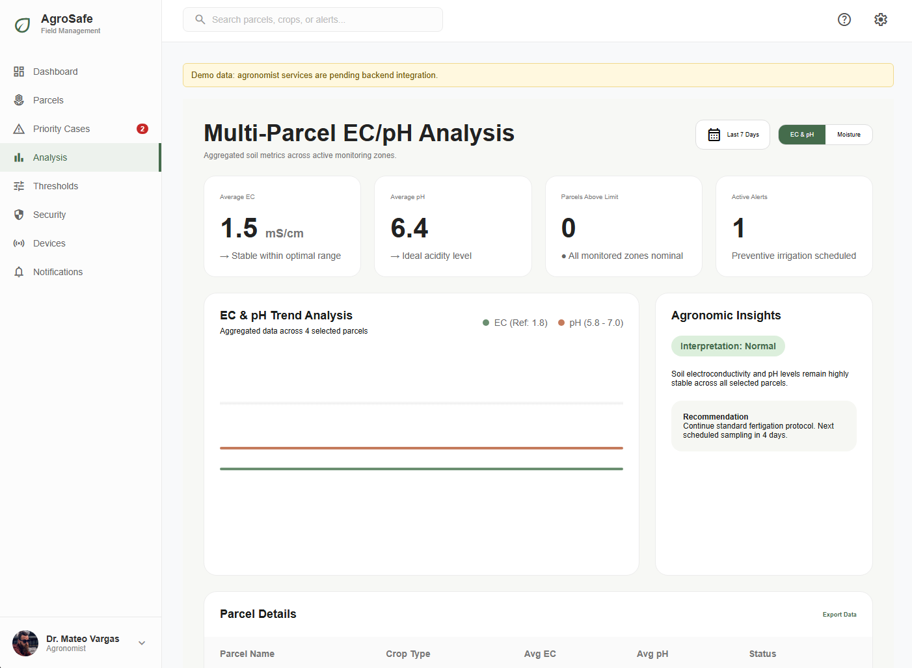

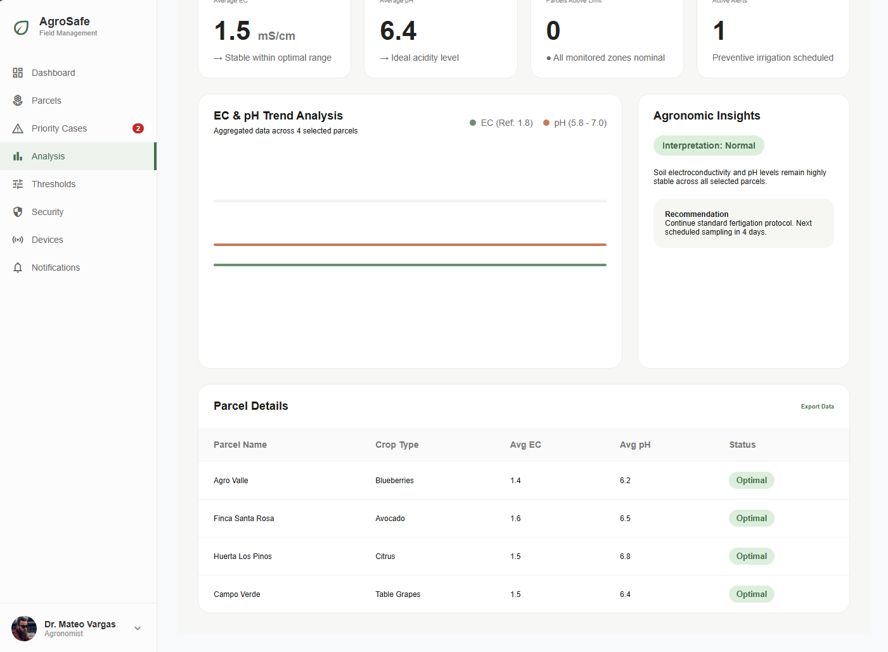

**Dashboard Agrónomo - Gestión de Cuenta y Dispositivos**

Panel de administración que centraliza la gestión de cuenta del agrónomo, el monitoreo de dispositivos IoT de sus clientes asignados y el control de sesiones de riego activas.

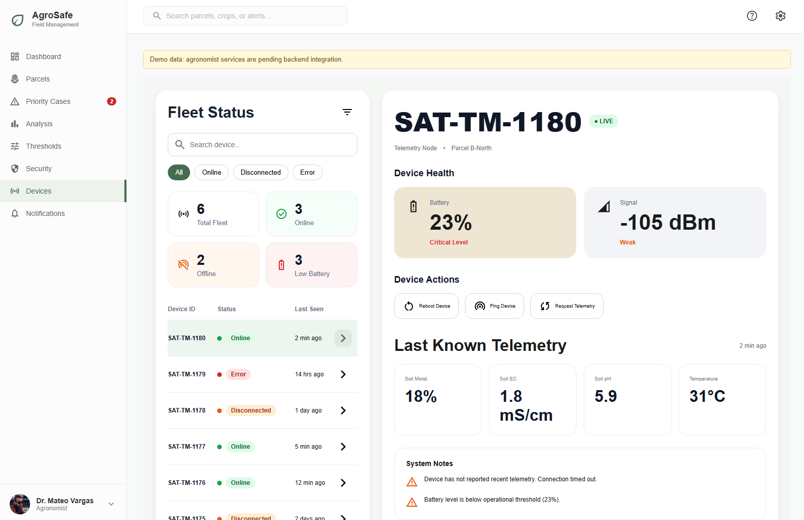

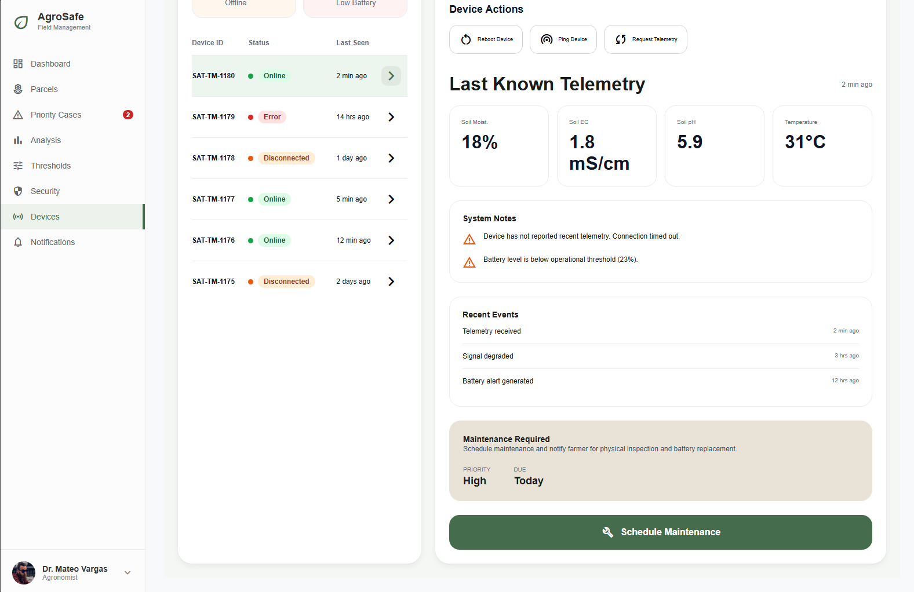

**Dashboard Agrónomo - Cola de Casos Prioritarios**

Vista de gestión de urgencias que organiza las alertas críticas de todos los clientes del agrónomo en una cola priorizada, con acceso directo al detalle de cada incidente.

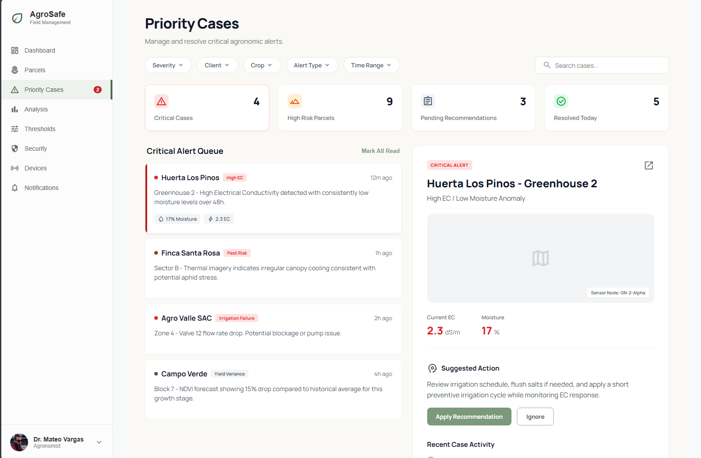

**Dashboard Agricultor - Telemetría en Tiempo Real**

Vista de monitoreo continuo con gráficos de salinidad del suelo y registro histórico de eventos de seguridad perimetral, consolidando las métricas más críticas para la toma de decisiones.

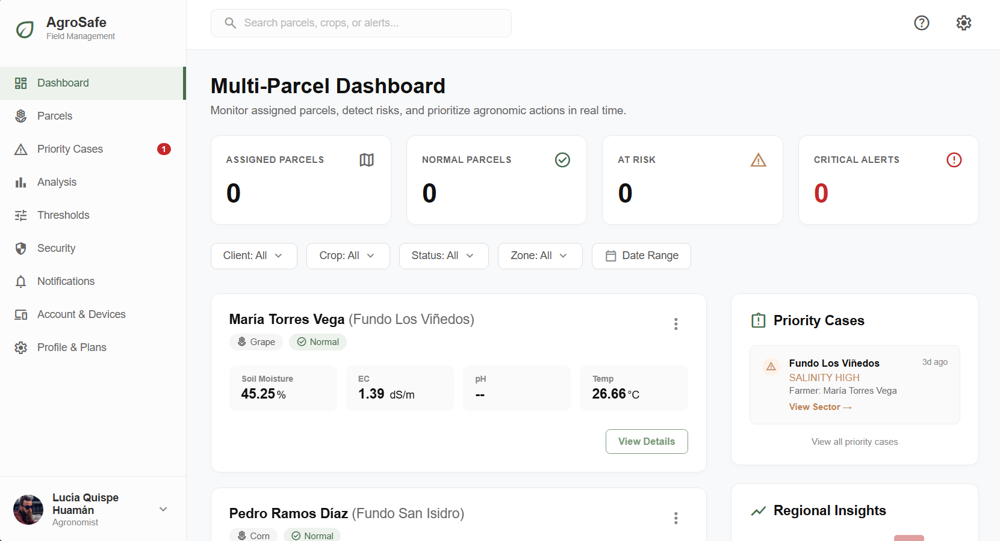

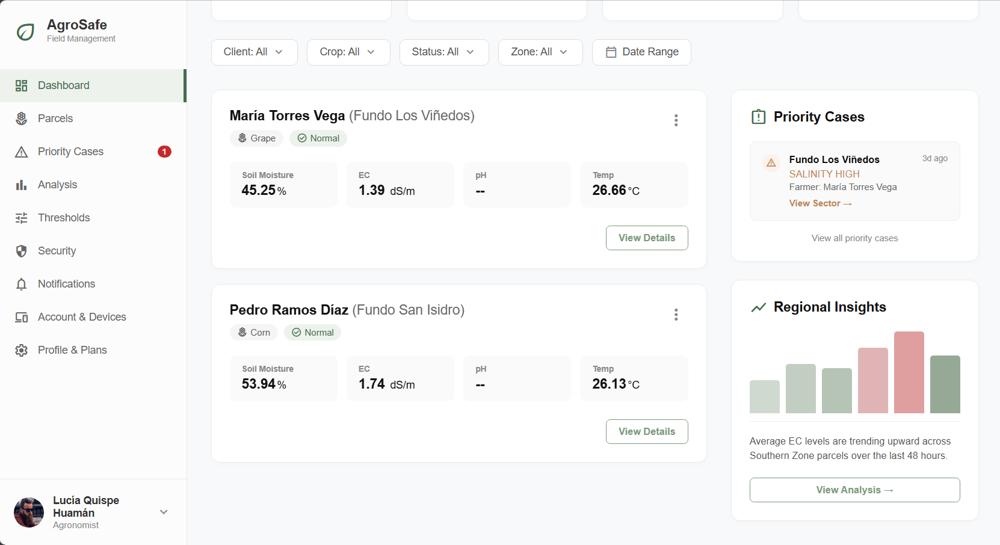

**Dashboard Agricultor - Flota de Dispositivos IoT**

Vista de inventario operativo que centraliza el estado de conexión, las métricas de telemetría, las acciones disponibles y el historial de mantenimiento de toda la flota ESP32 desplegada en el campo.

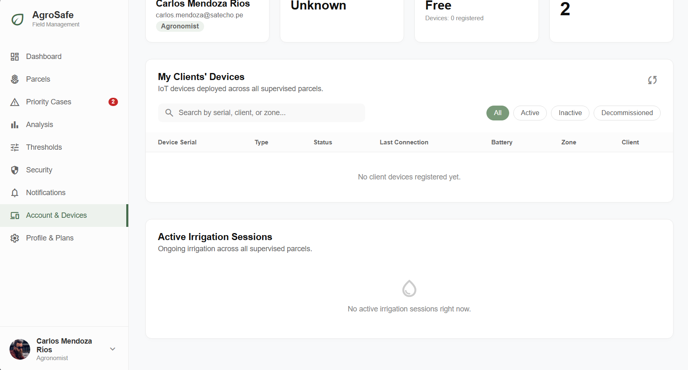

**Reglas de Notificación**

Vista de configuración de alertas que permite al agricultor definir umbrales personalizados por dispositivo y tipo de métrica, determinando qué condiciones disparan notificaciones al móvil.

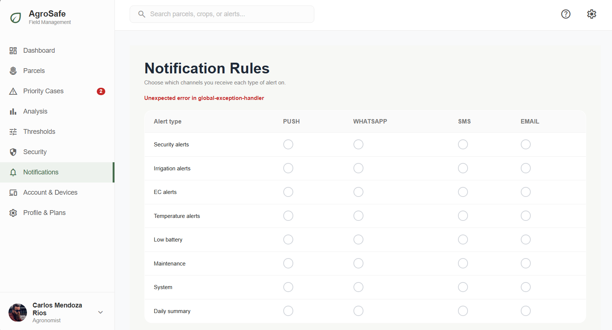

#### Mobile Application

La primera versión de la Aplicación Móvil implementa los flujos principales para ambos roles de usuario, con arquitectura Clean Architecture orientada a funcionalidades (feature-based bounded contexts) y conexión al REST API real.

**Login y Selección de Rol**

Pantalla de autenticación con selección de rol (agricultor / agrónomo) que redirige al usuario al workspace correspondiente según sus permisos asignados en el backend.


**Dashboard del Agricultor**

Centro de control móvil que muestra el estado de las parcelas, las métricas de telemetría del suelo en tiempo real y las sesiones de riego activas con actualización automática cada 15 segundos.


**Estado de Dispositivos e Irrigación**

Lista de dispositivos IoT con indicadores de conectividad en tiempo real y controles directos para iniciar o detener sesiones de riego de forma remota desde el campo.


**Workspace del Agrónomo**

Vista de seguimiento de clientes, gestión de alertas críticas asignadas y agenda de visitas técnicas, optimizando la operativa diaria del consultor agrícola desde su dispositivo móvil.


#### Edge API

La primera versión del Edge API implementa tres módulos bajo Clean Architecture: autenticación de dispositivos (IAM), captura de telemetría del suelo (Soil) y clasificación de eventos de seguridad perimetral (PIR).


#### Embedded Application (ESP32)

La primera versión del firmware SATECHO implementa una arquitectura FreeRTOS completamente orientada a eventos (0% bucles de polling), con cuatro sensores activos: FC28 (humedad de suelo, GPIO33), HR202L (salinidad/CE, GPIO14/32), DHT11 (temperatura ambiente, GPIO26) y DS18B20 (temperatura de suelo, GPIO25), junto con un sensor PIR de seguridad perimetral (GPIO27).


#### 6.2.2.7. Services Documentation Evidence for Sprint Review

Durante este Sprint 2, se desplegó la primera versión funcional del **RESTful API** de SATECHO, construida en Java con Spring Boot bajo una arquitectura de Domain-Driven Design (DDD) con Clean Architecture. La documentación interactiva de los endpoints se expone mediante **Swagger UI / OpenAPI 3.0**, accesible en la instancia de Azure App Service.

Los contextos acotados implementados en este sprint y sus endpoints principales son los siguientes:

**Bounded Context: IAM (Identity & Access Management)**

| Método | Endpoint | Descripción |
|---|---|---|
| POST | `/api/v1/authentication/sign-up` | Registro de nuevo usuario (agricultor o agrónomo) |
| POST | `/api/v1/authentication/sign-in` | Autenticación y obtención de JWT token |
| POST | `/api/v1/authentication/verify-account` | Verificación de cuenta mediante token de email |
| POST | `/api/v1/authentication/resend-verification` | Reenvío del email de verificación |
| GET | `/api/v1/users/{id}` | Consulta de datos del usuario autenticado |

**Bounded Context: Onboarding**

| Método | Endpoint | Descripción |
|---|---|---|
| POST | `/api/v1/farms` | Creación de una nueva granja/parcela para el agricultor |
| GET | `/api/v1/farms/{farmId}` | Consulta de datos de una granja específica |
| GET | `/api/v1/farms/user/{userId}` | Listado de todas las granjas de un usuario |
| POST | `/api/v1/farms/{farmId}/irrigation-zones` | Creación de zona de riego dentro de una granja |
| GET | `/api/v1/farms/{farmId}/irrigation-zones` | Listado de zonas de riego de una granja |
| DELETE | `/api/v1/farms/{farmId}/irrigation-zones/{zoneId}` | Eliminación de una zona de riego |

**Bounded Context: BI (Business Intelligence / MQTT Integration)**

| Método | Endpoint | Descripción |
|---|---|---|
| GET | `/api/v1/fleet/health` | Estado de salud general de la flota de dispositivos IoT |
| GET | `/api/v1/irrigation/sessions/active` | Sesiones de riego activas en tiempo real |
| GET | `/api/v1/notifications/critical` | Alertas críticas pendientes de revisión |
| POST | `/api/v1/irrigation/sessions/{sessionId}/command` | Envío de comando de actuador vía MQTT (start/stop irrigación) |

La documentación interactiva de los endpoints se expone mediante Swagger UI, permitiendo a los desarrolladores del frontend y del equipo de QA probar los contratos directamente desde el navegador sin necesidad de herramientas adicionales.

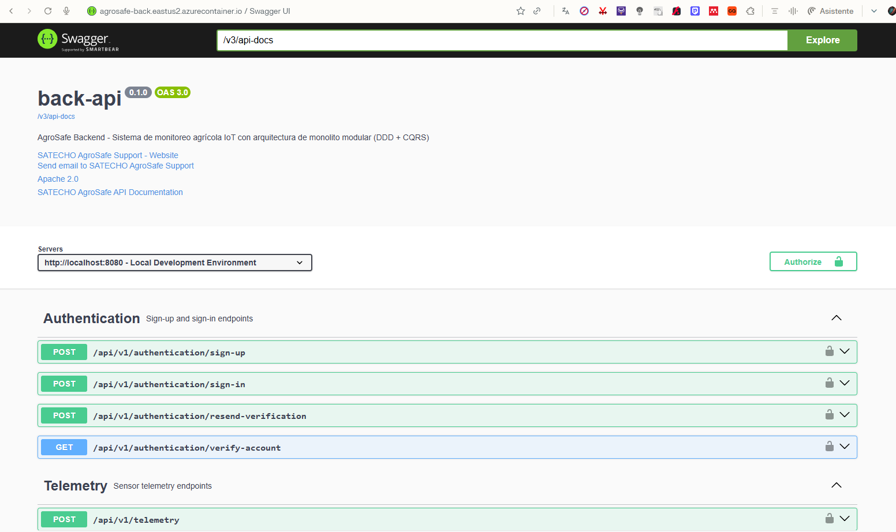

Adicionalmente, el **Edge API** expone los siguientes endpoints REST consumidos directamente por el firmware ESP32 y por el backend para sincronización de telemetría:

| Método | Endpoint | Descripción |
|---|---|---|
| POST | `/api/v1/iam/devices` | Registro de nuevo dispositivo ESP32 (obtención de API key) |
| GET | `/api/v1/iam/devices` | Listado de dispositivos registrados |
| POST | `/api/v1/soil-monitoring/readings` | Ingesta de lectura de telemetría de suelo desde ESP32 (autenticado por `X-API-Key`) |
| POST | `/api/v1/security/pir-events` | Registro de evento de seguridad perimetral detectado por sensor PIR |

#### 6.2.2.8. Software Deployment Evidence for Sprint Review

En este sprint, el despliegue se extendió a cuatro plataformas adicionales para dar soporte a los nuevos componentes de la solución.

**Backend REST API (Azure App Service)**

El RESTful API construido en Java con Spring Boot se desplegó en Azure App Service mediante un proceso de empaquetado con Maven y publicación automática desde GitHub Actions.

1. **Empaquetado:** Ejecución de `mvn clean package -DskipTests` para generar el artefacto `.jar` optimizado.

2. **Pipeline de CI/CD:** Configuración del workflow de GitHub Actions que detecta cambios en la rama `main` y dispara el build y despliegue automático.

3. **Publicación en Azure:** El artefacto `.jar` se envía a Azure App Service mediante el perfil de publicación configurado en los Secrets del repositorio.

4. **Verificación:** Confirmación del despliegue exitoso mediante el endpoint `/actuator/health` de Spring Boot Actuator.

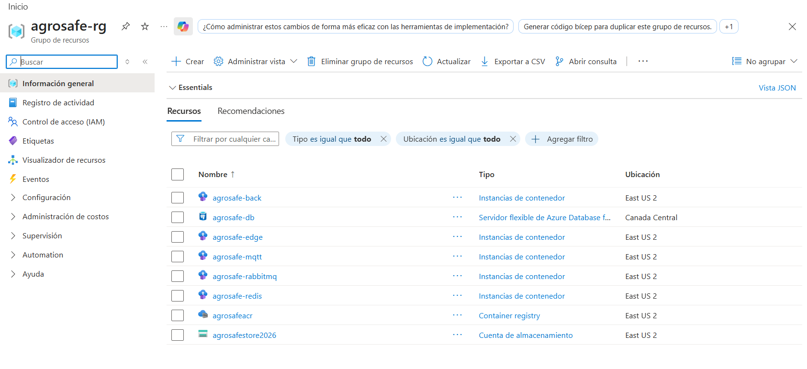

**Mobile Application (Firebase App Distribution)**

La primera versión de la aplicación Flutter fue compilada y distribuida a los usuarios de prueba mediante Firebase App Distribution.

1. **Compilación:** Generación del paquete `.apk` desde Android Studio con `flutter build apk --release`.

2. **Carga en Firebase:** Subida del binario a la consola de Firebase en la sección App Distribution.

3. **Distribución:** Envío de invitaciones a los testers del equipo para validación del flujo completo en dispositivos reales.


**Web Application (Vercel)**

La versión v2 de la Aplicación Web mantuvo el despliegue continuo en Vercel, con actualización automática de la URL productiva al integrarse cambios en la rama `main`.


**Landing Page (GitHub Pages)**

La versión v2 de la Landing Page fue publicada automáticamente en GitHub Pages al realizar el merge de los cambios a la rama `main` del repositorio correspondiente.


#### 6.2.2.9. Team Collaborations Insights during Sprint

**Visión General del Sprint**

El Sprint 2 representó el mayor desafío colaborativo del proyecto al requerir la coordinación simultánea de seis repositorios con interdependencias técnicas directas. Para gestionar esta complejidad sin generar bloqueos, el equipo implementó una sesión de kickoff asíncrona donde se definieron los contratos de API (payloads JSON) entre el Edge API, el backend y las aplicaciones cliente antes de comenzar cualquier implementación. Este enfoque de "contract-first" permitió que los cinco desarrolladores trabajaran en paralelo sin necesidad de esperar por servicios reales.

**Landing Page v2 y Web Application v2**

El trabajo sobre los dos productos frontales del ciclo continuó bajo el modelo de ramas de funcionalidad atomizadas con Pull Requests obligatorios. El mayor volumen de commits en este periodo se concentró en la expansión del dashboard para el rol de agrónomo, que requirió múltiples iteraciones de feedback entre el líder de aspecto y los colaboradores para asegurar la coherencia visual y funcional entre las vistas.

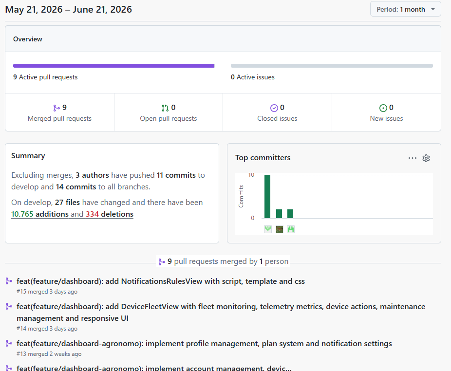

**REST API (Backend)**

El backend comenzó su desarrollo en paralelo desde la primera semana del sprint, arrancando con los bounded contexts de IAM y Onboarding. La metodología de trabajo adoptó el patrón de "feature branches por contexto acotado", lo que permitió que cada capa (dominio, aplicación, infraestructura, interfaces) fuera desarrollada e integrada secuencialmente dentro de la misma rama, manteniendo el ciclo de feedback corto y los Pull Requests manejables en tamaño.

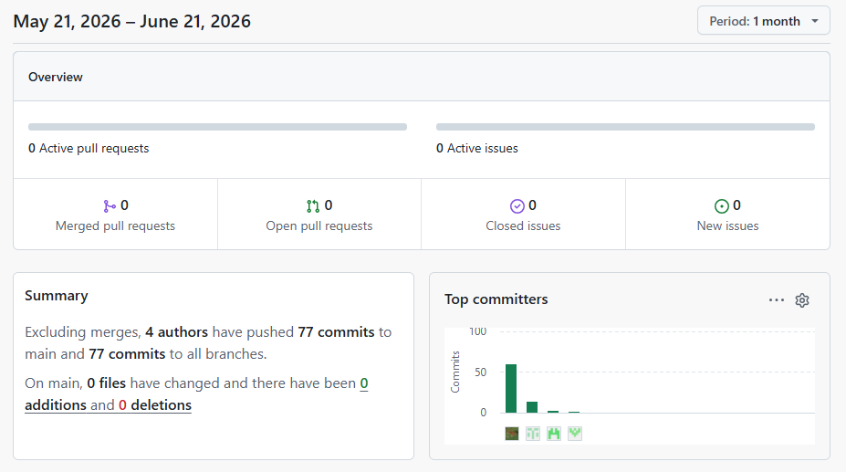

**Mobile Application**

El equipo de la aplicación móvil arrancó desde cero con un scaffold inicial que estableció la arquitectura base (feature-based bounded contexts con Clean Architecture), sobre la cual se construyeron los flujos de agricultor y agrónomo de forma incremental. La decisión de utilizar el mock de roles antes de conectar el API real permitió validar la experiencia de usuario antes de que el backend estuviera disponible, reduciendo el tiempo de integración final.

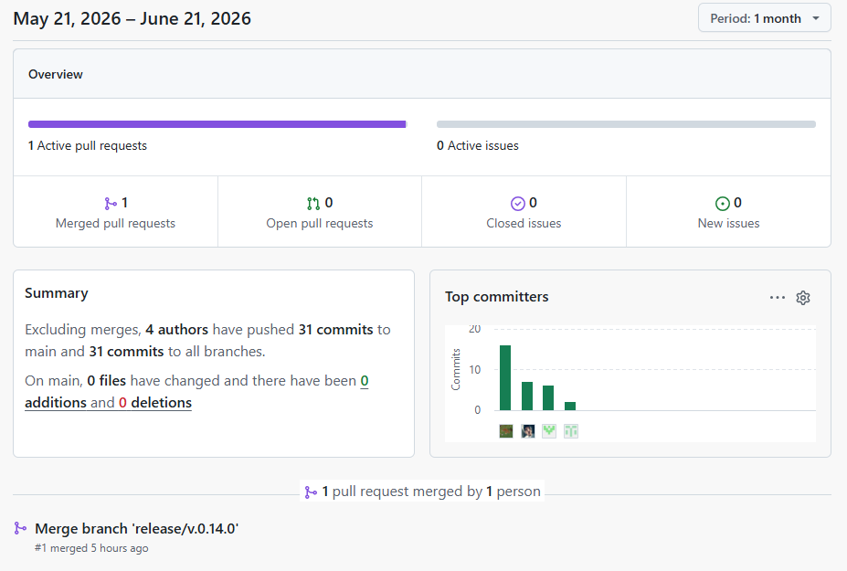

**Edge API**

El Edge API fue el repositorio con el proceso de desarrollo más estructurado del sprint, dado que siguió el ciclo completo de TDD (Test-Driven Development) para las tres capas de prueba: unitaria, integración y aceptación. Esta disciplina, aunque más lenta al inicio, garantizó que cada endpoint entregado tuviera cobertura de pruebas verificable antes de ser integrado al pipeline de comunicación con el firmware ESP32.

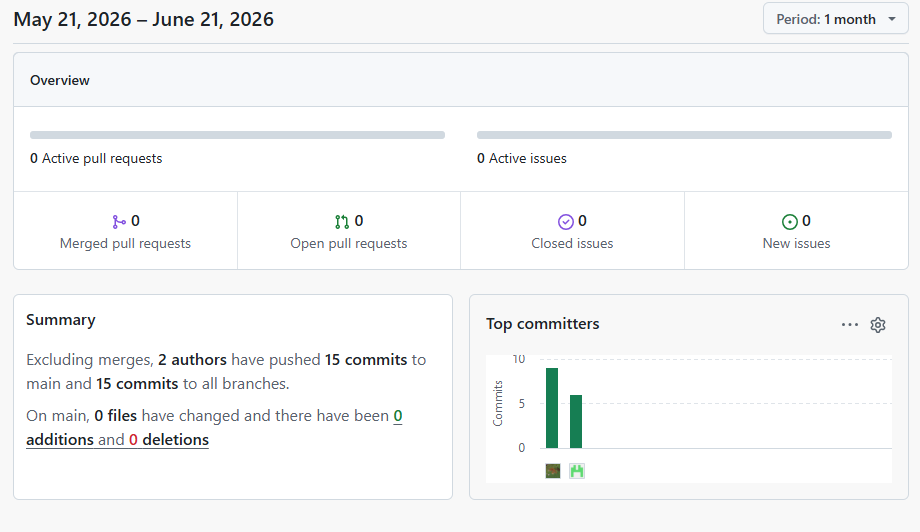

**Embedded Application**

### 6.2.3. Sprint 3

Este tercer sprint cierra el ciclo de valor del MVP SATECHO completando la cadena de alerta proactiva de extremo a extremo: desde la detección de movimiento en el ESP32 y la superación de umbrales de suelo en el Edge API, hasta la entrega de notificaciones push en el dispositivo móvil del agricultor. El sprint integra el motor de alertas de suelo (salinity, temperatura, estrés hídrico), el servicio de notificaciones push vía FCM, la sincronización de eventos PIR con el cloud, la autenticación biométrica y la integración MQTT en tiempo real en la Mobile Application.

#### 6.2.3.1. Sprint Planning 3

<table>
  <tr>
    <td>Sprint #</td>
    <td>Sprint 3</td>
  </tr>
  <tr>
    <td colspan="2"><strong>Sprint Planning Background</strong></td>
  </tr>
  <tr>
    <td>Date</td>
    <td>2026-06-23</td>
  </tr>
  <tr>
    <td>Time</td>
    <td>22:00 p.m (GMT-5)</td>
  </tr>
  <tr>
    <td>Location</td>
    <td>Asynchronous session organized within the Discord communication platform</td>
  </tr>
  <tr>
    <td>Prepared By</td>
    <td>Huamani Sánchez, José Diego</td>
  </tr>
  <tr>
    <td>Attendees (to planning meeting)</td>
    <td>Estrada Cajamune, Abraham Andrés / Gamio Upiachihua, Brenda Lucía / Quispe Erasmo, Raul Ronaldo / Palacios, Yasser Renteria</td>
  </tr>
  <tr>
    <td>Sprint 2 Review Summary</td>
    <td>During Sprint 2, the team completed the full vertical integration of the SATECHO ecosystem across six simultaneous software products: Landing Page v2 (product demo video, team section, premium-only plans), Web Application v2 (agronomist dashboards, real-time telemetry and device fleet views for farmers), REST API v1 (IAM, Onboarding, and BI bounded contexts with MQTT integration), Mobile Application v1 (farmer and agronomist workspaces with role-based navigation and real API connectivity), Edge API v1 (device authentication, soil telemetry ingestion, PIR event classification, and a full three-layer test suite), and Embedded Firmware v1 (FreeRTOS event-driven architecture with FC28, HR202L, DS18B20, DHT11, and PIR sensors, plus irrigation valve control).</td>
  </tr>
  <tr>
    <td>Sprint 2 Retrospective Summary</td>
    <td>The adoption of the Team Software Process (TSP) framework in Sprint 2 proved effective in reducing bottlenecks by clarifying aspect leadership across six repositories, enabling five contributors to work in parallel. The contract-first API approach — agreeing on JSON payloads before implementation — was identified as the key enabler for parallel development without integration delays. For Sprint 3, the team maintains the TSP structure and redirects its focus toward closing the alert pipeline end-to-end rather than introducing new product scopes, keeping the sprint goal tightly bounded to observable farmer outcomes.</td>
  </tr>
  <tr>
    <td colspan="2"><strong>Sprint Goal & User Stories</strong></td>
  </tr>
  <tr>
    <td>Sprint 3 Goal</td>
    <td>
<strong>Our focus is on</strong> completing the proactive alert pipeline — delivering PIR perimeter intrusion detection with push notifications, critical soil alerts (salinity and temperature), and real-time MQTT updates to the Mobile Application. <br>
<strong>We believe it delivers</strong> immediate, eyes-free awareness to independent farmers who need to respond to field threats and crop-damage risks without actively monitoring any screen, protecting crops and property around the clock. <br>
<strong>This will be confirmed when</strong> a farmer receives a push notification on their mobile device within 30 seconds of a PIR person-detection event on their parcel; when a farmer receives a critical salinity or temperature push notification within 30 seconds of a threshold breach; and when farmers can review the full classified security event history, configure active surveillance zones, and authenticate irrigation commands with biometrics from the Mobile Application.
    </td>
  </tr>
  <tr>
    <td>Sprint 3 Velocity</td>
    <td>67</td>
  </tr>
  <tr>
    <td>Sum of Story Points</td>
    <td>67</td>
  </tr>
</table>

#### 6.2.3.2. Aspect Leaders and Collaborations

Sprint 3 consolidates the alert and notification pipeline across the REST API, Mobile Application, Edge API, and Embedded layers. The TSP structure is maintained from Sprint 2, with the same aspect leaders redirecting their focus toward the remaining components required for MVP closure. No Landing Page changes are scoped for this sprint.

| Team Member (Last Name, First Name) | GitHub Username | Web App v3 | REST API v2 | Mobile App v2 | Edge API v2 | Embedded v2 |
| :---------------------------------- | :----------------: | :---------: |:-----------:| :---------: | :---------: | :---------: |
| Huamani Sánchez, José Diego | `ProgramadorHuamani` | C |    **L**    | | | |
| Estrada Cajamune, Abraham Andrés | `Abraham0310` | C |      C      | **L** | | |
| Gamio Upiachihua, Brenda Lucía | `B-Gamio` | **L** |      C      | C | | |
| Quispe Erasmo, Raul Ronaldo | `Raul-QE` | |      C      | | **L** | |
| Palacios, Yasser Renteria | `Mitos20` | |             | C | C | **L** |

#### 6.2.3.3. Sprint Backlog 3

Este tercer sprint prioriza la integración del motor de alertas de suelo (EP-002-TS002), el servicio de notificaciones push (EP-008-TS001), la sincronización de eventos PIR hacia el cloud (EP-003-TS002, EP-005-TS005), el subscriber de actuador con buffer offline (EP-005-TS007), y las mejoras clave de la Mobile Application: autenticación biométrica (EP-002-TS004), integración MQTT en tiempo real (EP-004-TS002) y visualización de eventos de seguridad.

**Proyecto en Jira:** [https://satecho.atlassian.net/jira/software/projects/SCRUM/boards/1](https://satecho.atlassian.net/jira/software/projects/SCRUM/boards/1)


# Sprint 3 – Sprint Backlog

| Sprint 3 | Sprint Backlog 3 | | | | | | |
|---|---|---|---|---|---|---|---|
| **User Story** | **Title** | **Work Item/Task** | **Title** | **Description** | **Estimation (SP)** | **Assigned to** | **Status** |
| EP-002-TS002 | TS-01: Implement Soil Alert Engine (Backend) | EP-002-TS002-T01 | Implement AlertEngineService consuming SoilReadingCreated events from RabbitMQ | As a Developer, I want an engine that evaluates each soil reading against configurable thresholds and generates typed alerts automatically so that critical conditions trigger timely notifications. | 8 | José Huamani | Done |
| | | EP-002-TS002-T02 | Implement ThresholdRepository with default thresholds per sensor type (moisture, EC, temperature) | | | José Huamani | Done |
| | | EP-002-TS002-T03 | Implement hysteresis logic and automatic RESOLVED transition when values return to safe range | | | José Huamani | Done |
| EP-008-TS001 | TS-02: Implement Push Notification Service (Backend) | EP-008-TS001-T01 | Implement NotificationApplicationService with @RabbitListener for AlertCreated events | As a Developer, I want a service that processes alert events and sends push notifications via FCM so that farmers are notified in real time. | 5 | José Huamani | Done |
| | | EP-008-TS001-T02 | Integrate Firebase Admin SDK and implement FCM device token storage and dispatch logic | | | José Huamani | Done |
| EP-003-TS003 | TS-03: Implement PIR Debounce and Filtering (Embedded) | EP-003-TS003-T01 | Add PIR_DEBOUNCE_MS=3000 to satecho_config.h and debounce check to mqttCommandTask using millis() | As a Developer, I want the ESP32 to discard duplicate PIR triggers within 3000ms so that a single physical motion event does not generate multiple alerts. | 3 | Yasser Palacios | Done |
| EP-003-TS002 | TS-04: Implement Edge PIR API + Cloud Sync | EP-003-TS002-T01 | Implement _sync_pir_once() calling cloud_client.post_security_event() per PIR event with synced=False | As a Developer, I want the Edge to synchronize classified PIR events to the cloud backend individually via periodic sync so that security data is reliably propagated. | 5 | Raul Quispe | Done |
| | | EP-003-TS002-T02 | Integrate PIR sync into _run_loop() alongside soil sync using asyncio.gather() | | | Raul Quispe | Done |
| EP-005-TS005 | TS-05: Implement Edge PIR Cloud Sync | EP-005-TS005-T01 | Verify _sync_pir_once() marks events synced=True on 2xx response and retains synced=False on failure | As a Developer, I want PIR events with synced=False to be individually sent to the cloud in each 60-second sync cycle so that no security events are lost. | 3 | Raul Quispe | Done |
| EP-005-TS007 | TS-06: Implement Edge Actuator Command Subscriber with Offline Buffer | EP-005-TS007-T01 | Implement actuator_command_subscriber.py with MQTT subscription on agrosafe/+/devices/+/actuator/command | As a Developer, I want the Edge to forward actuator commands to the ESP32 when online and buffer them when the device is temporarily disconnected so that commands are not lost. | 5 | Raul Quispe | Done |
| | | EP-005-TS007-T02 | Implement device_tracker.py with mark_seen(), is_online() (ONLINE_WINDOW_SECONDS=60), and buffer drain on reconnect | | | Raul Quispe | Done |
| EP-008-US020 | US-01: Critical Alert Push Notifications | EP-008-US020-T01 | Implement FCM token registration endpoint and token persistence from Mobile App on login | As a farmer, I want to receive push notifications when critical alerts are detected so that I can act quickly even when the app is closed. | 5 | Abraham Estrada | Done |
| | | EP-008-US020-T02 | Validate end-to-end push delivery: soil threshold breach → AlertCreated → FCM → device notification | | | Abraham Estrada | Done |
| EP-008-US021 | US-02: In-App Notification Center | EP-008-US021-T01 | Implement NotificationsScreen in Flutter with chronological list, mark-as-read action, and badge decrement on navigation bar | As a farmer, I want to view a history of all received alerts and mark them as read so that I can review them at my convenience. | 3 | Abraham Estrada | Done |
| EP-002-US005 | US-03: Receive Critical Salinity Alerts | EP-002-US005-T01 | Wire EC > 5 dS/m threshold into AlertEngineService and confirm AlertCreated event triggers FCM push with message "Critical salinity in parcel [name]" | As a farmer, I want to receive alerts when the electrical conductivity of my soil exceeds the critical threshold so that I can prevent crop damage. | 3 | José Huamani | Done |
| EP-002-US006 | US-04: Receive Critical Temperature Alerts | EP-002-US006-T01 | Wire soil temperature > 40°C threshold into AlertEngineService and confirm AlertCreated event triggers FCM push notification | As a farmer, I want to be alerted if soil temperature exceeds dangerous levels so that I can protect my crops. | 3 | José Huamani | Done |
| EP-003-US001 | US-05: Receive Intrusion Alerts | EP-003-US001-T01 | Implement SecurityAlert creation on PERSON classification received from cloud PIR sync, publish to RabbitMQ for FCM dispatch with message "Person detected in [parcel name]" | As a farmer, I want to receive an alert when the PIR sensor detects a person on my parcel so that I can protect my crops. | 5 | Brenda Gamio | Done |
| EP-003-US002 | US-06: View Security Event History | EP-003-US002-T01 | Implement security history table in Web App with PERSON/ANIMAL/WIND classification filter, pulse duration, frequency per minute, and CSV export | As a farmer, I want to view the history of classified PIR events so that I can understand the activity on my parcels. | 3 | Brenda Gamio | Done |
| EP-003-US003 | US-07: Configure Security Zones | EP-003-US003-T01 | Implement zone enable/disable toggle bound to zone_id; suppress alert generation for disabled zones | As a farmer, I want to configure which zones of my farm have active PIR monitoring so that I can customize surveillance coverage. | 3 | Brenda Gamio | Done |
| EP-004-US007 | US-08: View Security Events in Mobile App | EP-004-US007-T01 | Implement SecurityScreen in Flutter with event classification list (PERSON/ANIMAL/WIND), timestamp, and pulse duration; ensure push notification is delivered via FCM when app is closed | As a farmer, I want to review PIR events from the mobile app and receive intrusion push notifications even when the app is not open. | 3 | Abraham Estrada | Done |
| EP-002-TS004 | TS-07: Biometric Authentication (Mobile App) | EP-002-TS004-T01 | Integrate local_auth package for fingerprint/Face ID; store and retrieve JWT via FlutterSecureStorage on successful biometric verification | As a Developer, I want to integrate biometric authentication in the Flutter app so that critical irrigation actions require secure identity confirmation. | 5 | Abraham Estrada | Done |
| | | EP-002-TS004-T02 | Handle biometrics unavailable (disable option) and 3-consecutive-failure fallback to password login | | | Abraham Estrada | Done |
| EP-004-TS002 | TS-08: MQTT Mobile Integration (Real Time) | EP-004-TS002-T01 | Implement MqttService singleton using mqtt_client package; subscribe to agrosafe/{farmId}/devices/{deviceId}/status and update SensorBloc via event | As a Developer, I want to integrate MQTT in the Flutter app so that real-time sensor state updates are received without polling every 15 seconds. | 5 | Abraham Estrada | Done |
| | | EP-004-TS002-T02 | Implement exponential backoff reconnection with up to 5 retry attempts on MQTT connection loss | | | Abraham Estrada | Done |

El firmware del ESP32 fue desarrollado de forma completamente independiente al inicio, adoptando una arquitectura FreeRTOS orientada a eventos que elimina los bucles de polling. La integración con el Edge API se realizó en la fase final del sprint mediante la implementación del módulo de captura de dirección MAC para la autenticación y la configuración del cliente MQTT para la publicación de telemetría hacia el broker Mosquitto del Edge.

#### 6.2.3.4. Development Evidence for Sprint Review

En este Sprint 3, el alcance del desarrollo se enfocó en completar la cadena de alerta proactiva de extremo a extremo, integrando el motor de alertas de suelo, el servicio de notificaciones push vía FCM, la sincronización de eventos PIR con el cloud, la autenticación biométrica y la integración MQTT en tiempo real en la Mobile Application. A continuación, se presenta el registro cronológico de commits que certifica la autoría, el propósito y la evolución del código fuente integrado satisfactoriamente en este sprint.

| Repository | Branch | Commit Id | Commit Message | Committed On |
|---|---|---|---|---|
| **Web-Service-SATECHO** | feature/advisory | 4f02fd5 | feat(advisory): add domain models and commands for visit scheduling and recommendations | 01/07/26 |
| Web-Service-SATECHO | feature/bi | 6dd3421 | feat(bi): add domain models and resources for fleet health, user suspension, and analytics queries | 01/07/26 |
| Web-Service-SATECHO | feature/subscriptions | ef5d163 | feat(subscriptions): add domain models and resources for billing cycles, invoice statuses, and subscription management | 01/07/26 |
| Web-Service-SATECHO | release/v0.15.0 | 293e1e6 | chore: merge branch 'feature/subscriptions' into develop | 01/07/26 |
| Web-Service-SATECHO | feature/alert-service | 770e6f7 | feat(alerts): implement alert management system with domain models, services, and REST endpoints | 01/07/26 |
| Web-Service-SATECHO | release/v0.16.0 | fbb56fa | chore: merge branch 'feature/alert-service' into develop | 01/07/26 |
| Web-Service-SATECHO | feature/device-notification | daaa771 | feat(notification): implement device token registration and alert notification handling | 01/07/26 |
| Web-Service-SATECHO | release/v0.17.0 | 238c3b7 | chore: merge branch 'feature/device-notification' into develop | 01/07/26 |
| Web-Service-SATECHO | feature/telemetry-test | fbe589c | feat(tests): add unit tests for AlertCommandServiceImpl to evaluate telemetry readings | 01/07/26 |
| Web-Service-SATECHO | release/v0.18.0 | 6d63abd | chore: merge branch 'release/v0.18.0' | 01/07/26 |
| Web-Service-SATECHO | feature/agonomist-advisory | b72d8ea | feat(alerts): enhance alert evaluation and management with telemetry reading handling and access control | 02/07/26 |
| Web-Service-SATECHO | release/v0.19.0 | 0cbfa2e | chore: merge branch 'feature/agonomist-advisory' into develop | 02/07/26 |
| Web-Service-SATECHO | feature/client-management | af717fe | feat(client-management): implement client assignment and field visit management with associated resources and commands | 02/07/26 |
| Web-Service-SATECHO | release/v0.20.0 | 0268b1f | chore: merge branch 'feature/client-management' into develop | 02/07/26 |
| Web-Service-SATECHO | feature/dashboard-resume | 0a3711c | feat(analytics): implement farmer dashboard and parcel comparison endpoints with associated services and resources | 02/07/26 |
| Web-Service-SATECHO | release/v0.21.0 | c939ea5 | chore: merge branch 'feature/dashboard-resume' into develop | 02/07/26 |
| Web-Service-SATECHO | feature/subsscription-plans | 2d393d4 | feat(subscription): implement subscription management with billing and invoicing functionality | 02/07/26 |
| Web-Service-SATECHO | release/v0.22.0 | 3ad79f8 | chore: merge branch 'feature/subsscription-plans' into develop | 02/07/26 |
| Web-Service-SATECHO | feature/device-management | 968944a | feat(notification): enhance notification handling with user authorization checks and refactor code structure | 02/07/26 |
| Web-Service-SATECHO | release/v0.23.0 | 99918e6 | chore: merge branch 'feature/device-management' into develop | 02/07/26 |
| Web-Service-SATECHO | feature/forgot-password-management | 766cd27 | feat(forgot-password): implement password reset functionality with email notifications and user commands | 02/07/26 |
| Web-Service-SATECHO | release/v0.24.0 | 3815db3 | chore: merge branch 'feature/forgot-password-management' into develop | 02/07/26 |
| Web-Service-SATECHO | feature/device-management | 8efbfad | feat(device-management): update device registration to enforce plan limits and refactor command handling | 02/07/26 |
| Web-Service-SATECHO | release/v0.25.0 | be6836f | chore: merge branch 'feature/device-management' into develop | 02/07/26 |
| Web-Service-SATECHO | feature/zone-detection | 5ac0c72 | feat(security): implement zone detection toggle functionality and enhance ownership checks | 02/07/26 |
| Web-Service-SATECHO | release/v0.26.0 | d0452cb | chore: merge branch 'feature/zone-detection' into develop | 02/07/26 |
| Web-Service-SATECHO | feature/testing-endpoints | 50c0744 | feat(tests): add unit tests for ClientCommandServiceImpl and ParcelComparisonQueryServiceImpl | 02/07/26 |
| Web-Service-SATECHO | release/v0.27.0 | 4afd4c1 | chore: merge branch 'feature/testing-endpoints' into develop | 02/07/26 |
| Web-Service-SATECHO | feature/activity-log | 72f6d44 | feat(activity-log): implement activity log service and controller for farm events | 02/07/26 |
| Web-Service-SATECHO | release/v0.28.0 | 8ff7573 | chore: merge branch 'feature/activity-log' into develop | 02/07/26 |
| Web-Service-SATECHO | feature/dashboard-admin | d2e15a8 | feat(admin-dashboard): enhance metrics and registrations trend endpoints with new data and calculations | 02/07/26 |
| Web-Service-SATECHO | release/v0.29.0 | 3b27a71 | chore: merge branch 'feature/dashboard-admin' into develop | 02/07/26 |
| Web-Service-SATECHO | feature/irrigation-start | 73447c5 | feat(irrigation): enhance actuator actions and add event publishing for irrigation commands | 02/07/26 |
| Web-Service-SATECHO | release/v0.30.0 | 6ffa2da | chore: merge branch 'release/v0.30.0' | 02/07/26 |
| Web-Application-SATECHO | feature/simplify-farmer-onboarding | f69e5b5 | feat: simplify farmer onboarding | 22/06/26 |
| Web-Application-SATECHO | feature/real-backend-integration | 0f675fa | feat: connect frontend to Azure backend | 23/06/26 |
| Web-Application-SATECHO | feature/real-data-farmer-dashboard | e2bf9a4 | feat: use real data in farmer dashboard | 23/06/26 |
| Web-Application-SATECHO | feature/admin-view | 3ac4650 | feat(admin): implement user and farm management API and store | 04/07/26 |
| Web-Application-SATECHO | feature/subscriptions-view | b983aba | feat(billing): implement billing API and store for subscription management | 04/07/26 |
| Web-Application-SATECHO | codex/connect-containerapps-backend | f401a19 | chore: connect frontend to container apps backend | 04/07/26 |
| Web-Application-SATECHO | codex/local-env-containerapps-backend | d870230 | docs: use container apps backend for local env | 04/07/26 |
| Web-Application-SATECHO | feature/kpis-implementations | d715de3 | feat(dashboard): add farmer KPIs and update dashboard state management | 05/07/26 |
| Mobile-Application-SATECHO | develop | 2c73b45 | fix(auth): block navigation when sign-in fails | 22/06/26 |
| Mobile-Application-SATECHO | main | ccba995 | feat(android): use SATECHO leaf launcher icon | 22/06/26 |
| Mobile-Application-SATECHO | main | 4bbc9ce | fix(android): allow release builds to reach HTTP backend | 22/06/26 |
| Mobile-Application-SATECHO | feature/initial-configuration-onboarding | a3cbd43 | chore: merge branch 'feature/initial-configuration-onboarding' into develop. Related to EP-012-US027 | 03/07/26 |
| Mobile-Application-SATECHO | feature/configuration-perimeter-security | 68aaeb4 | chore: merge branch 'feature/configuration-perimeter-security' into develop. Related to EP-003-US002 | 03/07/26 |
| Mobile-Application-SATECHO | feature/configuration-quick-reports | 2364a3a | chore: merge branch 'feature/configuration-quick-reports' into develop. Related to EP-004-US007 | 03/07/26 |
| Mobile-Application-SATECHO | feature/visualization-soil-monitoring | 6d51848 | chore: merge branch 'feature/visualization-soil-monitoring' into develop. Related to EP-001-US004 | 03/07/26 |
| Mobile-Application-SATECHO | feature/formulation-zones | e5d4c99 | chores: merge branch 'feature/formulation-zones' into develop. Related to EP-004-US005 | 03/07/26 |
| Mobile-Application-SATECHO | develop | 857a632 | feat: add edit profile functionality with name and password update | 03/07/26 |
| Mobile-Application-SATECHO | develop | cbf18b5 | chore: sync final mobile source | 04/07/26 |
| Mobile-Application-SATECHO | develop | bf1f08a | chore: point mobile app to new backend | 04/07/26 |
| Mobile-Application-SATECHO | main | a9cde0f | chore: merge develop into main | 04/07/26 |
| Edge-API-SATECHO | feature/iam | ecf9b4a | feat(application): add the entities to define the headers to the table to save the data | 02/07/26 |
| Edge-API-SATECHO | feature/iam | 80adc1b | refactor(interfaces): overwrite the endpoints expose to the client | 02/07/26 |
| Edge-API-SATECHO | release/1.1.0 | 43f56f3 | Merge branch 'release/1.1.0'. Related to EP-003-TS001/002 | 03/07/26 |
| Edge-API-SATECHO | release/1.1.0 | d97aefa | chore(shared): add the uses cases and parameters to define the shared logic about cloud client | 03/07/26 |
| Edge-API-SATECHO | release/1.1.0 | 922b413 | feat(shared): add the async services communication and ingest data | 03/07/26 |
| Edge-API-SATECHO | release/1.2.0 | 85675c0 | feat(shared): add the Actuator command subscriber with an offline buffer | 03/07/26 |
| Edge-API-SATECHO | release/1.2.0 | c6e093c | feat(test): add the unit test to validate the software | 03/07/26 |
| Embedded-Application-SATECHO | todo | 267e783 | refactor: Remove heartbeat timer and update telemetry to publish raw data via MQTT | 02/07/26 |
| Embedded-Application-SATECHO | todo | 6ac0b07 | refactor(esp32): migrate to compact driver scheme + coherent MQTT->edge path | 02/07/26 |

#### 6.2.3.5. Testing Suite Evidence for Sprint Review

Durante el Sprint 3, el equipo amplió significativamente la cobertura de pruebas automatizadas, abarcando tanto el backend REST API como el Edge API.

**Backend (Java / Spring Boot - JUnit5 & Mockito)**

Se implementaron pruebas unitarias para los nuevos servicios y controladores desarrollados en este sprint, asegurando que las reglas de negocio del motor de alertas, la gestión de notificaciones, la administración de clientes y las comparaciones de parcelas funcionen correctamente.

| Archivo de Test / Clase | Escenario de Prueba | Resultado Esperado |
|---|---|---|
| AlertCommandServiceImplTest | Evaluación de lectura de telemetría contra umbrales | Alerta generada correctamente cuando excede el umbral |
| AlertCommandServiceImplTest | Lectura de telemetría dentro de rango seguro | No se genera alerta |
| AlertCommandServiceImplTest | Transición automática a estado RESOLVED | Estado de alerta actualizado a RESOLVED |
| ClientCommandServiceImplTest | Asignación de cliente a ingeniero agrónomo | Cliente asignado con validación de duplicados |
| ParcelComparisonQueryServiceImplTest | Comparación de parcelas por métricas de suelo | Resultados correctos con datos históricos |

**Edge API (Python / pytest)**

Se añadieron nuevas pruebas unitarias que validan la lógica de sincronización de eventos PIR y el subscriber de comandos de actuador con buffer offline.

| Archivo de Test | Escenario de Prueba | Resultado Esperado |
|---|---|---|
| tests/domain/test_pir_sync_service.py | Sincronización individual de evento PIR con synced=False | Evento marcado synced=True tras respuesta 2xx |
| tests/domain/test_pir_sync_service.py | Sincronización fallida (error de red) | Evento retiene synced=False para reintento |
| tests/domain/test_actuator_subscriber.py | Comando de actuador recibido con dispositivo online | Comando reenviado inmediatamente al ESP32 |
| tests/domain/test_actuator_subscriber.py | Comando recibido con dispositivo offline | Comando almacenado en buffer para entrega diferida |
| tests/domain/test_device_tracker.py | Dispositivo reporta actividad dentro de 60s | is_online() retorna True |
| tests/domain/test_device_tracker.py | Sin actividad por más de 60 segundos | is_online() retorna False |

#### 6.2.3.6. Execution Evidence for Sprint Review

Esta sección consolida la evidencia de ejecución de todos los productos digitales entregados en el Sprint 3.

#### Web Application (v3)

La versión final de la Aplicación Web incorpora la gestión administrativa de usuarios y fincas, la visualización de suscripciones y facturación, la integración con el backend real en Azure Container Apps, y los KPIs del agricultor en el dashboard.

**Suscripciones y Facturación** - Vista de gestión de suscripciones con planes activos, historial de facturación y estado de pagos.

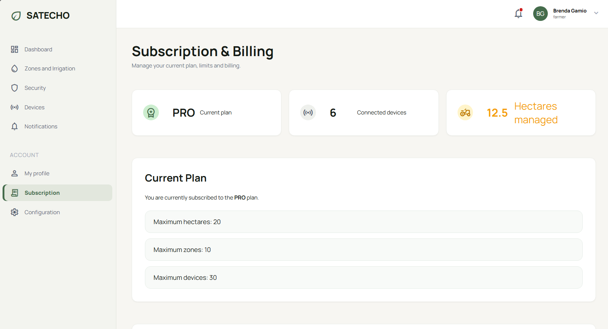

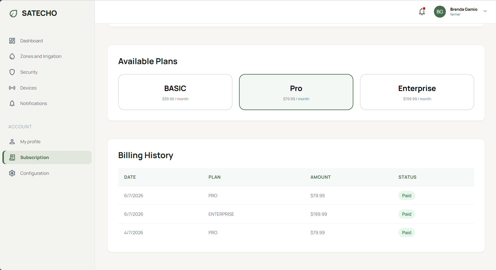

#### Mobile Application (v2)

La segunda versión de la App Móvil incorpora monitoreo de suelo, formulación de zonas de riego, reportes rápidos, seguridad perimetral, edición de perfil y onboarding inicial.

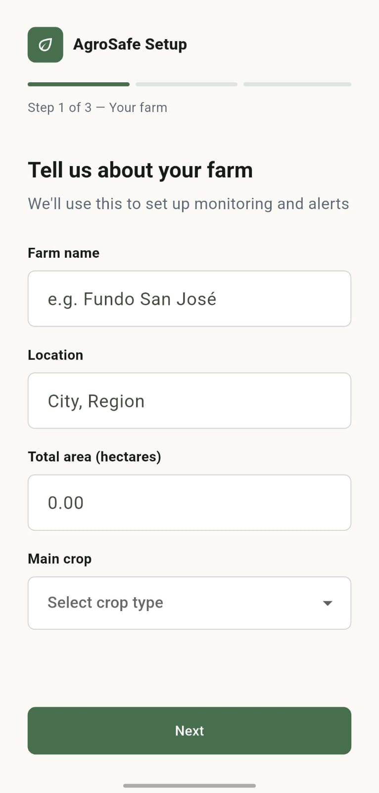

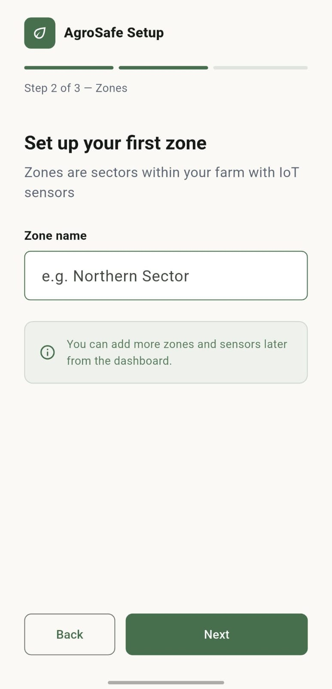

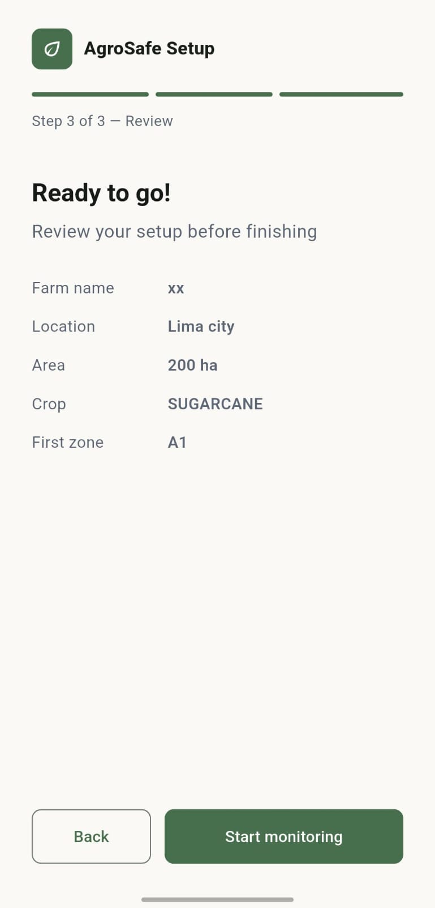

**Onboarding Inicial** - Asistente de configuración inicial para nuevos usuarios.


**Monitoreo de Suelo** - Métricas de suelo en tiempo real (humedad, temperatura, conductividad eléctrica).


**Seguridad Perimetral** - Configuración de zonas de seguridad con sensor PIR y activación/desactivación por zona.


**Formulación de Zonas de Riego** - Configuración avanzada de zonas de riego por cultivo y tipo de suelo.


**Reportes Rápidos** - Reportes ejecutivos con métricas clave del estado de los cultivos.


**Edición de Perfil** - Configuración de cuenta para actualizar nombre, contraseña y preferencias.


#### Edge API (v2) - Sincronización de eventos PIR hacia el cloud, comunicación asíncrona y subscriber de comandos con buffer offline.


#### Embedded Application (ESP32 v2) - Migración a drivers compactos con ruta MQTT->Edge coherente, eliminando heartbeat timer.


#### 6.2.3.7. Services Documentation Evidence for Sprint Review

Durante el Sprint 3, el REST API expandió significativamente su superficie de exposición con nuevos bounded contexts. Documentación interactiva disponible mediante Swagger UI / OpenAPI 3.0 en Azure.

**Bounded Context: Advisory (Agronomist Advisory)**

| Método | Endpoint | Descripción |
|---|---|---|
| POST | /api/v1/advisory/visits | Programación de visita técnica de agrónomo |
| GET | /api/v1/advisory/visits/{visitId} | Detalle de visita programada |
| GET | /api/v1/advisory/visits/agronomist/{id} | Visitas asignadas a un agrónomo |
| POST | /api/v1/advisory/recommendations | Envío de recomendación agronómica |

**Bounded Context: Alerts (Alert Management)**

| Método | Endpoint | Descripción |
|---|---|---|
| POST | /api/v1/alerts/evaluate | Evaluación de telemetría contra umbrales |
| GET | /api/v1/alerts/{alertId} | Detalle de alerta generada |
| GET | /api/v1/alerts/farm/{farmId} | Alertas activas e históricas de una finca |
| PATCH | /api/v1/alerts/{alertId}/resolve | Resolución manual de alerta |

**Bounded Context: Notifications (Push Notifications)**

| Método | Endpoint | Descripción |
|---|---|---|
| POST | /api/v1/notifications/device-token | Registro de token FCM para dispositivo móvil |
| POST | /api/v1/notifications/send | Envío manual de notificación push |
| GET | /api/v1/notifications/user/{userId} | Historial de notificaciones enviadas |
| PATCH | /api/v1/notifications/{id}/read | Marcado de notificación como leída |

**Bounded Context: Subscription Management**

| Método | Endpoint | Descripción |
|---|---|---|
| POST | /api/v1/subscriptions | Creación de suscripción |
| GET | /api/v1/subscriptions/{id} | Detalle de suscripción |
| GET | /api/v1/subscriptions/user/{userId} | Suscripciones de un usuario |
| POST | /api/v1/billing/invoices | Generación de factura |
| GET | /api/v1/billing/invoices/{id} | Detalle de factura |

**Bounded Context: Zone Detection & Security**

| Método | Endpoint | Descripción |
|---|---|---|
| POST | /api/v1/security/zones/{zoneId}/toggle | Activar/desactivar zona de detección |
| GET | /api/v1/security/zones/farm/{farmId} | Zonas de seguridad configuradas |
| POST | /api/v1/security/zones | Crear nueva zona de seguridad |

**Bounded Context: Activity Log**

| Método | Endpoint | Descripción |
|---|---|---|
| GET | /api/v1/activity-log/farm/{farmId} | Historial de eventos de una finca |
| GET | /api/v1/activity-log/user/{userId} | Historial de actividad de un usuario |

**Bounded Context: Admin Dashboard**

| Método | Endpoint | Descripción |
|---|---|---|
| GET | /api/v1/admin/metrics | Métricas globales (usuarios, fincas, dispositivos) |
| GET | /api/v1/admin/registrations/trend | Tendencia de registros de nuevos usuarios |
| GET | /api/v1/admin/users | Listado paginado de usuarios registrados |

**Bounded Context: Irrigation Control (Enhanced)**

| Método | Endpoint | Descripción |
|---|---|---|
| POST | /api/v1/irrigation/sessions/{id}/start | Inicio de riego con evento de actuador |
| POST | /api/v1/irrigation/sessions/{id}/stop | Detención de sesión de riego |
| GET | /api/v1/irrigation/sessions/farm/{farmId} | Historial de sesiones de riego |

**Edge API (v2) - Nuevos endpoints**

| Método | Endpoint | Descripción |
|---|---|---|
| POST | /api/v1/security/pir-events | Registro de evento PIR desde ESP32 |
| GET | /api/v1/security/pir-events/unsynced | Eventos PIR pendientes de sincronización |
| POST | /api/v1/actuator/command | Comando de actuador con buffer offline |
| GET | /api/v1/devices/{deviceId}/status | Estado online/offline del dispositivo |

#### 6.2.3.8. Software Deployment Evidence for Sprint Review

En este Sprint 3, el despliegue se consolidó para todos los componentes, con énfasis en la migración del backend a Azure Container Apps.

**Backend REST API (Azure App Service -> Azure Container Apps)**

El RESTful API migró a Azure Container Apps para mejor escalabilidad y gestión de contenedores.

1. **Containerización:** Se actualizó el Dockerfile para crear imagen Docker optimizada con el .jar de Maven.
2. **Azure Container Registry:** La imagen se publicó en ACR.
3. **Azure Container Apps:** Se configuró el entorno con revisiones automáticas y escalado horizontal.
4. **CI/CD Pipeline:** El workflow de GitHub Actions construye, publica en ACR y despliega automáticamente.

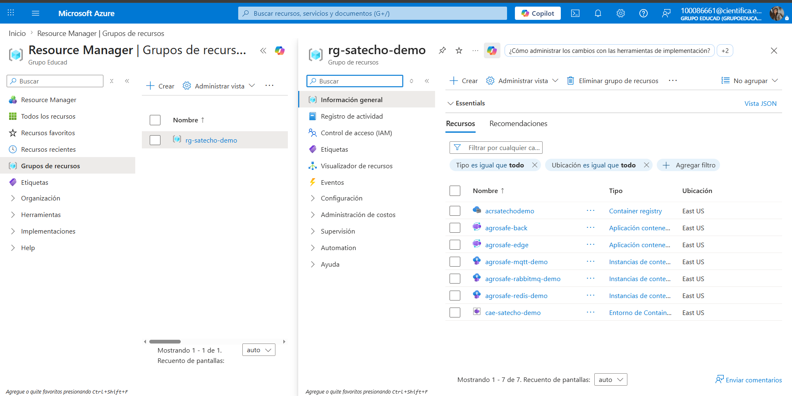

**Web Application (Vercel - Continuous Deployment)**

La versión v3 mantuvo el despliegue continuo en Vercel desde la rama main.

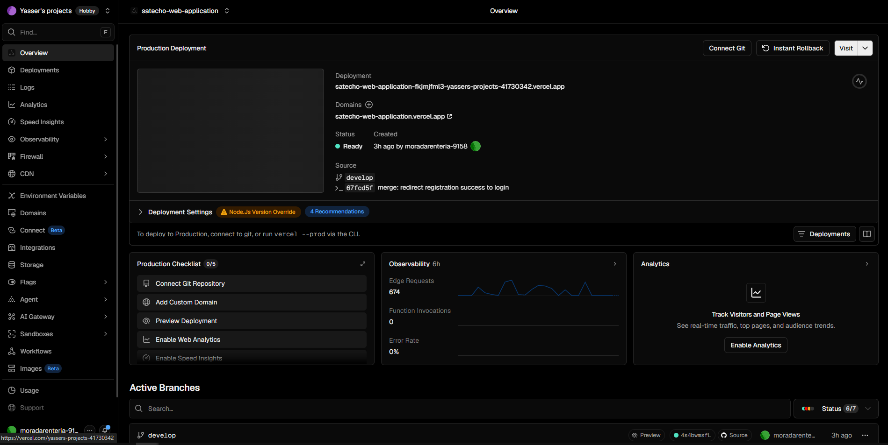

**Mobile Application (Firebase App Distribution - v2)**

La segunda versión de la app Flutter se distribuyó mediante Firebase App Distribution, apuntando al nuevo backend.

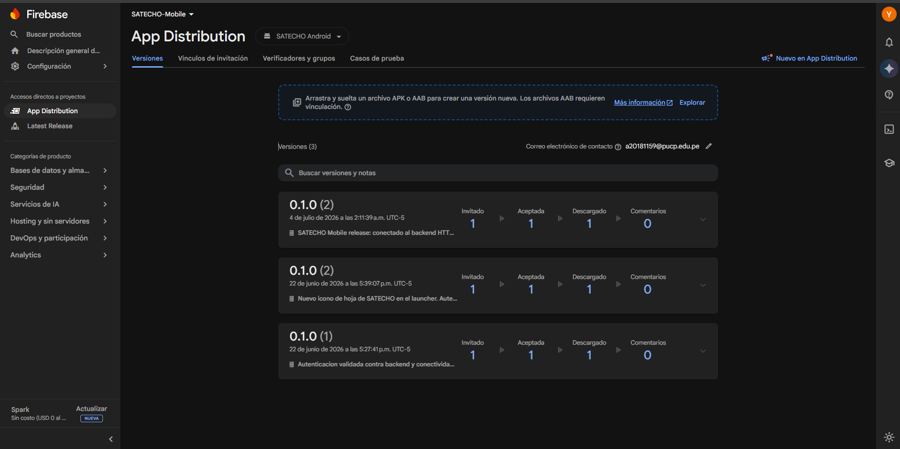

#### 6.2.3.9. Team Collaborations Insights during Sprint

**Visión General**

El Sprint 3 cerró el ciclo de desarrollo del MVP de SATECHO, consolidando las funcionalidades de los seis productos. El equipo mantuvo la estructura TSP con líderes de aspecto definidos y enfoque contract-first.

**Web Application v3** - Yasser Palacios (Mitos20) integró la conexión con el backend real en Azure y Container Apps; Brenda Gamio (B-Gamio) implementó vistas administrativas, facturación y KPIs del dashboard.


**REST API (Backend v2)** - 18 releases (v0.13.0 a v0.30.0) en 48 horas por Brenda Gamio (B-Gamio): Advisory, BI, Subscriptions, Alert Service, Device Notifications, Telemetry Tests, Client Management, Dashboard Resume, Subscription Plans, Forgot Password, Zone Detection, Activity Log, Admin Dashboard e Irrigation Start.


**Mobile Application v2** - Abraham Estrada (Abraham0310) lideró el desarrollo integrando feature branches de monitoreo de suelo, seguridad perimetral, zonas de riego y reportes rápidos. Yasser Palacios realizó la sincronización final.


**Edge API v2** - Raul Quispe (Raul-QE) implementó sincronización PIR cloud, comunicación asíncrona y subscriber de actuador con buffer offline. Versiones v1.1.0 y v1.2.0 con pruebas unitarias.


**Embedded Application v2** - Brenda Gamio (B-Gamio) actualizó el firmware a drivers compactos con ruta MQTT->Edge coherente, eliminando el heartbeat timer.


## 6.3. Validation Interviews

En este espacio se consolidan cada una de las preguntas dirigidas a nuestros segmentos objetivos como vienen a ser los **Agricultores** como los **Ingenieros Agrónomos**, así como la evidencia preliminar de cada opnión recopilada en relación a la usabilidad y experiencia del mismo usuario utilizando cada una de las aplicaciones centradas en agilizar de manera digital su operatividad manual en el cuidado de las plantas. Cada opinión esta dimensionada por _frags_ de videos con su indicativo de _timing_ para dar mayor veracidad y enfoque en los puntos objetivos y ciertas observaciones que nos dejaron como oportunidades de mejora.

### 6.3.1. Diseño de Entrevistas

Antes de realizar las entrevistas, consideramos necesario realizar un análisis previo que nos permita entender mejor a nuestros públicos objetivo. Para ello, hemos diseñado una serie de preguntas específicas para cada segmento (ingenieros agrónomos y agricultores independientes), con el fin de orientar nuestras entrevistas de manera más eficiente y alineada a sus realidades operativas y profesionales.

En particular, previo a entrevistar a nuestros usuarios, consideramos importante contar con el prototipo funcional interconectado de nuestra solución. Este prototipo será probado por usuarios reales de ambos segmentos, y en ese contexto proponemos una batería de preguntas cualitativas orientadas a observar el uso de la solución (lectura de telemetría de suelo, control remoto de riego, configuración de umbrales, visualización de alertas y seguridad perimetral), identificar posibles puntos de fricción y validar nuestras suposiciones de diseño y valor agronómico.  

**Segmento 1 — Ingenieros Agrónomos**

1) **Primera impresión y Landing Page B2B**
   
- ¿Cómo describirías tu experiencia inicial al navegar por la Landing Page diseñada especialmente para asesores técnicos y cooperativas?
  
- ¿La propuesta de valor sobre cómo Agrosafe te ayudará a reducir viajes por carretera y optimizar tus consultorías quedó clara desde el primer vistazo?
  
- ¿Qué elementos visuales de la página web te transmitieron profesionalismo científico y cuáles te generaron dudas?

2) **Inicio de sesión y Dashboard Multi-cliente (Pantalla Principal)**
   
- Al iniciar sesión en la aplicación web, ¿qué fue lo primero que capturó tu atención en el panel resumen de flotas/parcelas de tus clientes?
- 
- ¿Pudiste identificar con rapidez y mediante los códigos visuales cuáles parcelas se encontraban en estado crítico o bajo estrés hídrico/salino urgente hoy mismo?
- 
- ¿Qué mejoras sugerirías en la pantalla principal para priorizar tus rutas de asesoría o tus recomendaciones del día?

3) **Navegación general en la Web App**
   
- ¿Lograste moverte a través del sistema web sin asistencia previa? ¿Hubo alguna sección donde la secuencia de clics se sintiera confusa?
  
- ¿Qué tan intuitivo fue encontrar las secciones de Historiales de Telemetría, Gestión de Clientes, Plantillas de Umbrales y Reportes Técnicos?
  
- ¿El acceso al centro de ayuda o documentación técnica del software fue fácil de localizar dentro de la interfaz web?

4) **Configuración colaborativa de cultivos y umbrales avanzados**
   
- ¿Cómo fue tu experiencia al interactuar con el panel de configuración de umbrales personalizados de humedad (%), conductividad eléctrica (dS/m), temperatura (°C) y pH?
  
- ¿Te resultó claro el flujo para crear una "Plantilla Maestra" de umbrales según el tipo de cultivo (arándanos, paltas, sandías) y desplegarla masivamente en las parcelas de tus clientes?
  
- ¿Qué datos o variables agronómicas añadirías o eliminarías de este panel web para agilizar tu toma de decisiones técnicas?
  
5) **Auditoría técnica, reportes y confirmaciones**
   
- ¿El flujo para redactar y enviar una recomendación técnica adjuntando gráficos históricos automáticos hacia el celular del agricultor fue evidente y confiable?
  
- ¿Te genera confianza el registro de actividad (log) que te permite auditar con precisión las horas exactas y la duración del encendido/apagado de las electroválvulas por parte del agricultor?
  
- ¿Los mensajes informativos y de confirmación del sistema web son lo suficientemente claros para validar que tus cambios ya se propagaron al dispositivo físico?

6) **Usabilidad y apariencia visual**
   
- ¿La aplicación web se percibe rápida y fluida al renderizar grandes volúmenes de datos históricos en los gráficos de líneas?

- ¿En qué momento sentiste lentitud en la carga?
  
- ¿Qué opinas de la paleta de colores, tipografía y distribución del panel web?
  
- ¿Sientes que la interfaz web reduce tu fatiga visual durante el análisis prolongado de datos?

7) **Seguridad, transparencia y "Caja Negra"**

- Al configurar umbrales que salen del rango seguro del catálogo, el sistema te solicita una confirmación explícita. ¿Este mecanismo te transmite seguridad o lo percibes como una interrupción en el flujo de trabajo?
  
- ¿Qué te haría sentir mayor respaldo profesional al usar el software (transparencia en las fórmulas de los índices de estrés, registros de auditoría de datos, mTLS entre el borde y la nube)?

8) **Interés y adopción profesional futura**
   
- ¿Consideras que esta aplicación web enriquecerá tu reputación científica y te permitirá duplicar tu cartera de clientes asesorados de forma remota? ¿Por qué?
  
- ¿Qué integraciones clave (p. ej., con APIs meteorológicas globales o sistemas de facturación estacional) harían que esta herramienta web sea imprescindible para tu consultoría independiente?
  
**Segmento 2 — Agricultores Independientes**

1) **Primera impresión, Landing Page y Registro**

- ¿Cómo describirías tu experiencia inicial al ingresar a la Landing Page de Agrosafe desde tu smartphone?
  
- ¿El mensaje sobre el ahorro de agua (20%) y la protección contra intrusos mediante detección térmica te resultó fácil de entender y convincente?
  
- Al realizar el registro inicial y el wizard de bienvenida (onboarding), ¿el flujo para ingresar los datos de tu primera parcela y cultivo fue claro desde el teléfono?

2) **Inicio de sesión y pantalla principal (Dashboard Móvil)**

- Al iniciar sesión en la app móvil, ¿pudiste identificar de inmediato el estado actual de tu cultivo a través de las tarjetas con la interfaz de colores tipo "semáforo" (rojo, amarillo, verde)?
  
- ¿Las alertas sobre las condiciones críticas del suelo (estrés hídrico, alta salinidad) o alertas perimetrales se entienden de un solo vistazo en la pantalla de inicio?
  
- ¿Qué reordenarías en el tablero principal de tu celular para que puedas ver lo que te interesa más rápido apenas entras a la aplicación?
 
3) **Navegación general en smartphone**

- ¿Pudiste moverte por las secciones de la aplicación móvil (Monitoreo, Alertas, Seguridad, Facturación) sin necesidad de recibir asistencia externa? ¿En qué pantalla te sentiste confundido?
  
- ¿Qué tan fácil y evidente fue localizar la sección de configuración de preferencias de notificaciones dentro del menú de tu perfil?
 
4) **Control remoto y formularios operativos**

- ¿Cómo fue tu experiencia interactuando con el botón para activar o detener la electroválvula de riego a distancia desde tu teléfono?El sistema solicita confirmación biométrica (huella digital o Face ID) antes de enviar la orden de riego.

- ¿Este paso te dio tranquilidad o te pareció una traba innecesaria para operar en el día a día?¿Qué opinas de la sección para revisar tu historial de consumo hídrico y reportes de riego semanales en la pantalla móvil?
 
5) **Gestión de Alertas y Canales de Comunicación**

- ¿El flujo para recibir las alertas críticas directamente en tu WhatsApp te resultó útil y oportuno? 
  
- ¿Qué comentarios tienes sobre la redacción y claridad del mensaje?
  
- Cuando el sensor térmico perimetral detectó movimiento, ¿la notificación te ayudó a diferenciar de inmediato si se trataba de una persona, un animal o una falsa alarma provocada por el viento?¿Qué tanto valor aporta a tu tranquilidad saber que el sistema te enviará una alerta de emergencia a tu WhatsApp o celular solo en las horas críticas que tú mismo programaste en el Modo Vigilancia Nocturna?Usabilidad en ruta y Resiliencia (Modo Offline)
  
- Dado que la señal en los campos de cultivo suele ser inestable, ¿cómo percibiste el rendimiento de la aplicación móvil cuando simulamos una pérdida de conexión (uso del Modo Offline)?
  
- ¿El indicador visual en la pantalla que te avisa que estás trabajando sin internet te dio la seguridad de que tus datos de humedad estaban protegidos localmente y se enviarían después?
  
- ¿Qué simplificarías en el diseño visual de la interfaz móvil para que sea más cómodo de operar bajo la luz directa del sol en pleno campo?

6) **Seguridad, Facturación y Confianza**

- Al interactuar con las pantallas de gestión de planes (Básico vs. Premium) e historial de facturas, ¿los precios y límites de dispositivos permitidos por tu plan fueron totalmente transparentes?
  
- ¿Qué tan seguro te sientes sabiendo que la aplicación nunca guarda tus datos bancarios ni números de tarjeta en sus bases de datos propias?

7) **Interés, Retorno de Inversión y Uso Futuro**

- Sientes que delegar el monitoreo continuo a estos sensores y automatizar el riego te permitirá ahorrar tiempo físico y reducir los costos de agua y fertilizantes en tu campaña? ¿Por qué?
  
- ¿Qué requerimiento o certificación técnica adicional (por ejemplo, validación de una universidad agraria local) necesitarías ver en la plataforma para tomar la decisión definitiva de pagar la suscripción mensual de Agrosafe?

### 6.3.2. Registro de Entrevistas


<table>
  <tr>
    <th colspan="2" style="text-align:center;">Entrevista #1</th>
  </tr>
  <tr>
    <td><strong>Nombre completo</strong></td>
    <td>Adrián Valerio</td>
  </tr>
  <tr>
    <td><strong>Edad</strong></td>
    <td>25</td>
  </tr>
  <tr>
    <td><strong>Distrito</strong></td>
    <td>Surco</td>
  </tr>
  
  <tr>
    <td><strong>Fecha de entrevista</strong></td>
    <td>6 de julio de 2026</td>
  </tr>
  <tr>
    <td><strong>Evidencia</strong></td>
    <td>
      <div align="center">
        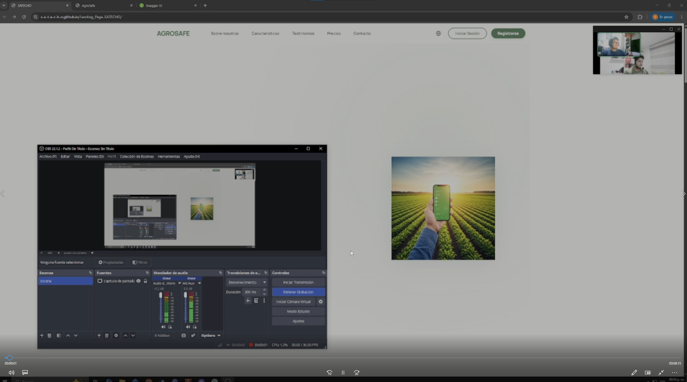
      </div>
    </td>
  </tr>
  <tr>
 <td><strong>Link</strong></td>
    <td><a href="https://acortar.link/XrMIfO">https://acortar.link/XrMIfO</a></td>
  </tr>
  <tr>
    <td><strong>Timing donde inicia la entrevista</strong></td>
    <td>0:03 min</td>
  </tr>
  <tr>
    <td><strong>Duración de la entrevista</strong></td>
    <td>5 minutos y 34 segundos</td>
  </tr>
  <tr>
    <td><strong>Resumen</strong></td>
    <td>La entrevista de validación se realizó con Adrián Valerio para evaluar *AgroSafe*, una solución de monitoreo inteligente de suelo con proyección a riego automatizado e irrigación.

Durante la demostración se presentó la *landing page, donde se explica la propuesta de valor, misión, visión, características principales, planes de suscripción y opciones para descargar la aplicación o registrarse. También se mostró el flujo de registro como **farmer*, incluyendo la creación de cuenta, configuración de propiedad agrícola, zona de irrigación, tipo de cultivo y visualización del dashboard.

En la plataforma web se evidenciaron funciones como el monitoreo de humedad, conductividad eléctrica, pH y temperatura, además del control de válvulas, historial de irrigación, gestión de zonas, seguridad perimetral, dispositivos IoT, notificaciones, perfil y suscripción. También se mencionó que el backend está desarrollado con endpoints REST en Swagger y que la base de datos ya se encuentra desplegada.

Además, se presentó la aplicación móvil, donde el usuario puede registrarse, configurar su cultivo y acceder a un dashboard reducido para revisar zonas de irrigación, dispositivos IoT, alertas, recomendaciones y perfil.

Adrián valoró positivamente el proyecto, destacando que los *colores y fuentes* son adecuados para la identidad de la startup y el tipo de servicio ofrecido. También resaltó que la página web está bien estructurada, no está sobrecargada de información y muestra solo lo necesario para el usuario. Respecto a la app móvil, indicó que mantiene una versión más compacta y funcional, adecuada para su formato. Finalmente, señaló que no tenía comentarios negativos, ya que considera que el producto cumple con las necesidades de un usuario interesado en el servicio.</td>
  </tr>
</table>

<table>
  <tr>
    <th colspan="2" style="text-align:center;">Entrevista #2</th>
  </tr>
  <tr>
    <td><strong>Nombre completo</strong></td>
    <td>Paolo Carrillo</td>
  </tr>
  <tr>
    <td><strong>Edad</strong></td>
    <td>27</td>
  </tr>
  <tr>
    <td><strong>Distrito</strong></td>
    <td>Cercado de Lima</td>
  </tr>

  <tr>
    <td><strong>Fecha de entrevista</strong></td>
    <td>6 de julio de 2026</td>
  </tr>
  <tr>
    <td><strong>Evidencia</strong></td>
    <td>
      <div align="center">
        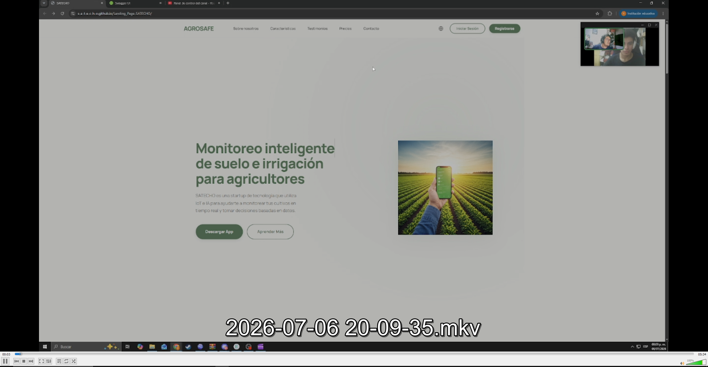
      </div>
    </td>
  </tr>
  <tr>
     <td><strong>Link</strong></td>
    <td><a href="https://acortar.link/gDSQWj">https://acortar.link/gDSQWj</a></td>
  </tr>
  <tr>
    <td><strong>Timing donde inicia la entrevista</strong></td>
    <td>0:01 min</td>
  </tr>
  <tr>
    <td><strong>Duración de la entrevista</strong></td>
    <td>8 minutos y 15 segundos</td>
  </tr>
  <tr>
    <td><strong>Resumen</strong></td>
    <td>La entrevista de validación se realizó con *Paolo Carrillo* para evaluar *AgroSafe, producto del grupo **Desatecho*, enfocado en el monitoreo inteligente del suelo e irrigación para agricultores.

Durante la demostración se presentó la *landing page, donde se explican secciones como “Sobre nosotros”, propuesta de valor, misión, visión, video del equipo, características de la aplicación, planes de suscripción y descarga para Play Store y App Store. También se mostró el flujo de registro como **farmer*, incluyendo la creación de cuenta, inicio de sesión, registro de propiedad agrícola, ubicación, cantidad de hectáreas, zona de irrigación y tipo de cultivo.

Luego se explicó el *dashboard web*, donde el agricultor puede visualizar un resumen de su zona de cultivo, consumo de agua, necesidad de riego, pH, sensores, dispositivos, alertas críticas y zonas de irrigación registradas. También se presentaron funciones como monitoreo de humedad, conductividad eléctrica, pH, temperatura, seguridad perimetral, gestión de dispositivos IoT, estado de batería, conexión online/offline y configuración de notificaciones.

Además, se mencionó que el sistema cuenta con una *base de datos integrada* a la aplicación web y se mostró la versión móvil, que mantiene funciones similares a la web, como visualización de zonas de irrigación, estado de dispositivos, alertas y tareas.

Paolo valoró positivamente el proyecto, destacando que le pareció *interesante, útil y ordenado*. Señaló que la interfaz es intuitiva, fácil de manejar y que la aplicación móvil está bien adaptada para celular. Finalmente, indicó que, si necesitara una herramienta de este tipo, sí la descargaría porque le parece una solución útil para agricultores.</td>
  </tr>
</table>

<table>
  <tr>
    <th colspan="2" style="text-align:center;">Entrevista #3</th>
  </tr>
  <tr>
    <td><strong>Nombre completo</strong></td>
    <td>Mauricio Torres</td>
  </tr>
  <tr>
    <td><strong>Edad</strong></td>
    <td>32</td>
  </tr>
  <tr>
    <td><strong>Distrito</strong></td>
    <td>Pucusana</td>
  </tr>
  <tr>
    <td><strong>Fecha de entrevista</strong></td>
    <td>6 de julio de 2026</td>
  </tr>
  <tr>
    <td><strong>Evidencia</strong></td>
    <td>
      <div align="center">
        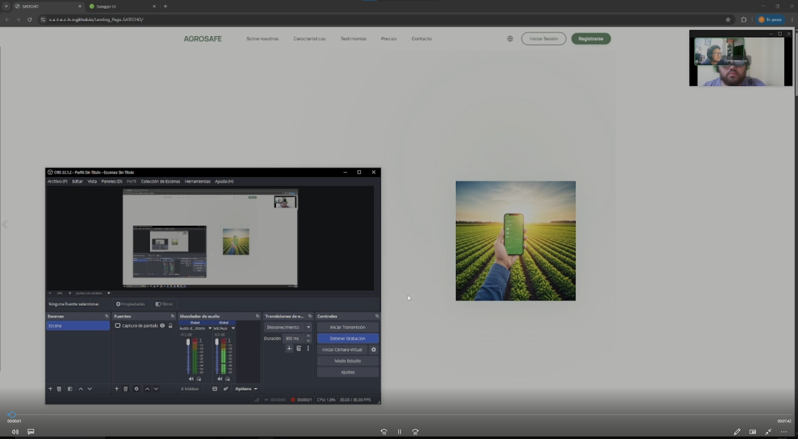
      </div>
    </td>
  </tr>
  <tr>
    <td><strong>Link</strong></td>
    <td><a href="https://acortar.link/guLygb">https://acortar.link/guLygb</a></td>
  </tr>
  <tr>
    <td><strong>Timing donde inicia la entrevista</strong></td>
    <td>0:01 min</td>
  </tr>
  <tr>
    <td><strong>Duración de la entrevista</strong></td>
    <td>7 minutos y 42 segundos</td>
  </tr>
  <tr>
    <td><strong>Resumen</strong></td>
    <td>La entrevista de validación se realizó con *Mauricio* para evaluar *AgroSafe*, una solución de monitoreo inteligente de suelos e irrigación para agricultores.

Durante la demostración se presentó la *landing page, donde se explica qué es AgroSafe, la sección “Sobre nosotros”, propuesta de valor, misión, visión, video del equipo, características principales, testimonios, planes de suscripción y opciones para descargar la aplicación en Play Store y App Store. También se mostraron los botones de acción para **registrarse* e *iniciar sesión*.

Luego se explicó el flujo de registro como *farmer*, donde el usuario ingresa sus datos personales, crea una cuenta, inicia sesión y completa un formulario con información de su parcela, ubicación, cantidad de hectáreas, zona de irrigación y tipo de cultivo.

Después se presentó el *dashboard web*, en el que el agricultor puede visualizar información resumida sobre sus hectáreas, consumo de agua, ciclos de irrigación, monitoreo del suelo, dispositivos conectados y zonas de irrigación. También se mostró la posibilidad de agregar nuevas zonas de cultivo, como zona norte o sur, y asociarlas a diferentes productos agrícolas.

Asimismo, se explicaron funciones adicionales como la *seguridad perimetral*, que permitiría detectar personas o animales mediante dispositivos IoT, la gestión de sensores para humedad, pH, minerales u otros indicadores, y la configuración de notificaciones. También se mencionó que la base de datos está conectada con la aplicación web.

Finalmente, se presentó la *aplicación móvil*, descrita como una adaptación de la versión web, pero con la información más resumida y organizada para celulares. En ella se pueden visualizar zonas, dispositivos, alertas y datos principales de la parcela.

Mauricio valoró positivamente el proyecto, destacando que la aplicación tiene una *interfaz bonita, clara y bien organizada*. También resaltó que la información se presenta de manera resumida, pero sin perder detalle. Además, consideró importante el uso de notificaciones dentro de la aplicación y concluyó que AgroSafe le parece una muy buena aplicación y un buen desarrollo web.
</td>
  </tr>
</table>

### 6.3.3. Evaluaciones según heurísticas

Esta sección contiene el proceso de evaluación de las sesiones de validación basado en heurísticas, considerando principios de usabilidad, arquitectura de información e inclusive design aplicados a la experiencia propuesta para AgroSafe. Los hallazgos se elaboraron a partir de las pantallas observadas durante la validación y de la información recopilada en las entrevistas registradas previamente.

**UX Heuristics & Principles Evaluation**  
**Usability - Inclusive Design - Information Architecture**

|                      |                                                               |
| -------------------- | ------------------------------------------------------------- |
| **CARRERA**          | Ingeniería de Software                                        |
| **CURSO**            | Desarrollo de Soluciones IoT                                  |
| **SECCIÓN**          | 17757                                                         |
| **PROFESORES**       | Todos                                                         |
| **AUDITOR**          | UI-Topic                                                      |
| **CLIENTE(S)**       | Adrián Valerio, Paolo Carrillo y Mauricio Torres              |

---

**SITE o APP A EVALUAR:** AgroSafe - Landing Page, Aplicación Web y Aplicación Móvil

---

**TAREAS A EVALUAR:**

El alcance de esta evaluación incluye la revisión de la usabilidad de las siguientes tareas:

1. Registro e inicio de sesión de un usuario nuevo.
2. Configuración inicial de la propiedad agrícola.
3. Registro de zonas de irrigación y tipo de cultivo.
4. Consulta del dashboard web con indicadores del cultivo.
5. Revisión del módulo de seguridad perimetral.
6. Gestión de dispositivos IoT y configuración de notificaciones.
7. Gestión del perfil de usuario y datos de cuenta.
8. Consulta del resumen de plan, dispositivos activos y reporte de cuenta.

No están incluidas en esta versión de la evaluación las siguientes tareas:

1. Integración física con sensores IoT en campo.
2. Activación real de electroválvulas desde hardware.
3. Validación de pagos o suscripciones en producción.
4. Recepción de notificaciones push o WhatsApp en dispositivos reales.

---

**ESCALA DE SEVERIDAD:**

Los errores serán puntuados tomando en cuenta la siguiente escala de severidad:

| Nivel | Descripción |
| ----- | ----------- |
| 1 | Problema superficial: puede ser fácilmente superado por el usuario o ocurre con muy poca frecuencia. No necesita ser arreglado a no ser que exista disponibilidad de tiempo. |
| 2 | Problema menor: puede ocurrir un poco más frecuentemente o es un poco más difícil de superar para el usuario. Se le debería asignar una prioridad baja resolverlo de cara al siguiente release. |
| 3 | Problema mayor: ocurre frecuentemente o los usuarios no son capaces de resolverlo. Es importante que sea corregido y se le debe asignar una prioridad alta. |
| 4 | Problema muy grave: un error de gran impacto que impide al usuario continuar con el uso de la herramienta. Es imperativo que sea corregido antes del lanzamiento. |

---

**TABLA RESUMEN:**

| # | Problema | Escala de severidad | Heurística/Principio violada(o) |
| - | -------- | ------------------- | ------------------------------- |
| 1 | Inconsistencia de idioma en acciones críticas de acceso | 2 | Inclusive Design - Lenguaje claro y consistente / Usability - Coincidencia con el mundo real |
| 2 | Jerarquía insuficiente entre acciones de guardado y finalización de configuración | 2 | Usability - Prevención de errores / Information Architecture - Is it understandable? |
| 3 | Superposición de textos en tarjetas de seguridad perimetral | 3 | Usability - Visibilidad del estado del sistema / Inclusive Design - Legibilidad |
| 4 | Datos incompletos o placeholders visibles en el perfil de cuenta | 3 | Usability - Visibilidad del estado del sistema / Information Architecture - Is it trustworthy? |
| 5 | Información de actividad reciente presentada con baja legibilidad | 2 | Inclusive Design - Legibilidad y accesibilidad / Information Architecture - Findability |

---

**DESCRIPCIÓN DE PROBLEMAS:**

Los siguientes hallazgos provienen de la inspección heurística de la aplicación web desplegada y de las pantallas usadas durante las entrevistas de validación. Cada problema incluye la captura que ilustra la observación, así como una recomendación aplicable para el siguiente ciclo de mejora.

**PROBLEMA #1:** Inconsistencia de idioma en acciones críticas de acceso

Severidad: 2  
Heurística violada: Inclusive Design - Lenguaje claro y consistente / Usability - Coincidencia con el mundo real

Problema:

En la pantalla de inicio de sesión se muestran textos en inglés como "Keep me signed in", "Forgot my password", "Log in" y "Create account". Considerando que los usuarios entrevistados pertenecen al contexto local peruano y que AgroSafe está orientado a agricultores, esta mezcla de idioma puede generar fricción inicial, especialmente en acciones sensibles como mantener sesión iniciada, recuperar contraseña o crear una cuenta. El problema no bloquea el acceso, pero reduce la familiaridad y claridad de la experiencia.

<p align="center">
  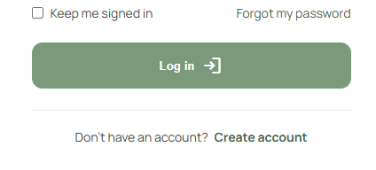
</p>

Recomendación:

Unificar el idioma de la interfaz de autenticación al español para el público objetivo principal. Además, usar textos directos como "Mantener sesión iniciada", "Olvidé mi contraseña", "Iniciar sesión" y "Crear cuenta", manteniendo consistencia con el resto de la plataforma.

---

**PROBLEMA #2:** Jerarquía insuficiente entre acciones de guardado y finalización de configuración

Severidad: 2  
Heurística violada: Usability - Prevención de errores / Information Architecture - Is it understandable?

Problema:

En la pantalla "Irrigation zones", el usuario puede elegir entre "Save and continue later" y "Complete configuration". Aunque la acción final aparece en verde, ambas opciones se encuentran en la misma zona inferior y tienen tamaños similares, lo que puede generar dudas sobre la diferencia entre guardar temporalmente y cerrar definitivamente la configuración. En el contexto de registro de parcelas y zonas de cultivo, esto puede provocar que el usuario complete el flujo sin haber añadido todas sus zonas de riego.

<p align="center">
  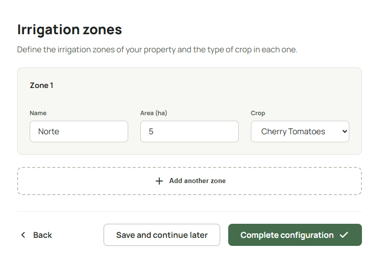
</p>

Recomendación:

Agregar una confirmación previa antes de completar la configuración, indicando cuántas zonas han sido registradas y permitiendo volver a editar si falta información. También se recomienda reforzar la diferencia visual entre "Guardar y continuar después" y "Completar configuración", dejando la acción final como primaria solo cuando los datos mínimos esperados estén completos.

---

**PROBLEMA #3:** Superposición de textos en tarjetas de seguridad perimetral

Severidad: 3  
Heurística violada: Usability - Visibilidad del estado del sistema / Inclusive Design - Legibilidad

Problema:

En el módulo "Perimeter Security", la tarjeta de estado muestra textos superpuestos entre "Configured", "Settings loaded" y "from Azure". Esta superposición impide leer correctamente el estado real del sistema y afecta una sección crítica para el usuario: la seguridad de su propiedad. La pantalla también muestra "0 unreviewed event" y "No perimeter events have been reported yet", pero la tarjeta de configuración no comunica con claridad si el módulo está realmente listo para operar.

<p align="center">
  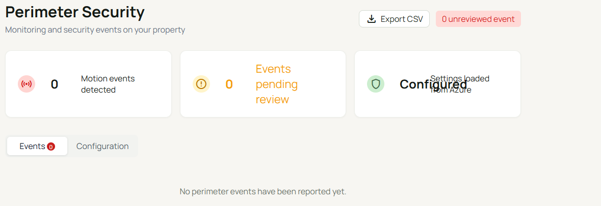
</p>

Recomendación:

Revisar el layout responsivo de las tarjetas para evitar colisiones entre número, título y descripción. Se recomienda definir alturas mínimas, separar el estado principal de la descripción secundaria y validar la pantalla en anchos intermedios. Para un módulo crítico, el estado debe ser legible con mensajes como "Configurado correctamente" y "Ajustes cargados desde Azure" en líneas claramente diferenciadas.

---

**PROBLEMA #4:** Datos incompletos o placeholders visibles en el perfil de cuenta

Severidad: 3  
Heurística violada: Usability - Visibilidad del estado del sistema / Information Architecture - Is it trustworthy?

Problema:

En la pantalla "My account", el resumen de cuenta muestra valores incompletos como "Member since Unknown" y el panel de actividad reciente indica "Account activity history is not available from the backend yet". Estos mensajes exponen detalles técnicos o estados no resueltos del sistema al usuario final, lo que puede reducir la confianza en la plataforma. Para agricultores que evalúan una herramienta de monitoreo y seguridad, la percepción de estabilidad y confiabilidad es especialmente importante.

<p align="center">
  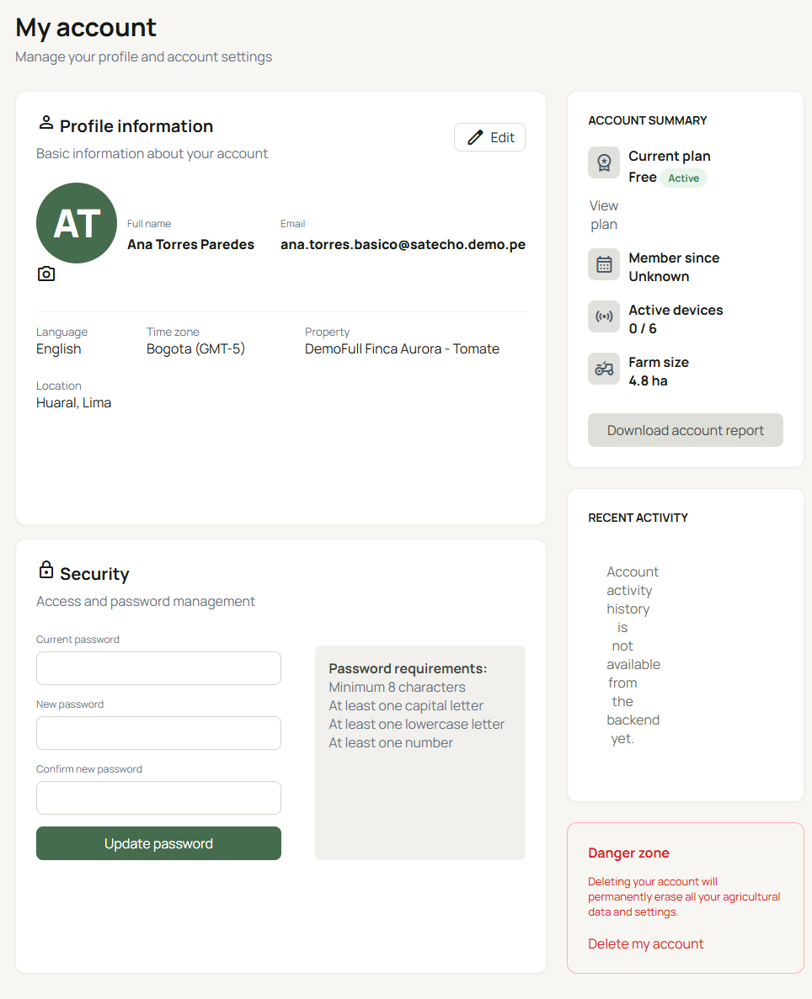
</p>

Recomendación:

Reemplazar placeholders técnicos por estados orientados al usuario. Por ejemplo, mostrar "Fecha de registro no disponible" con una breve explicación o esconder el campo hasta que el backend entregue el dato. Para actividad reciente, usar un estado vacío controlado como "Aún no hay actividad registrada en tu cuenta" en lugar de mencionar limitaciones internas del backend.

---

**PROBLEMA #5:** Información de actividad reciente presentada con baja legibilidad

Severidad: 2  
Heurística violada: Inclusive Design - Legibilidad y accesibilidad / Information Architecture - Findability

Problema:

En el panel "Recent activity" de la pantalla de cuenta, el texto aparece distribuido en líneas muy estrechas, haciendo que una frase corta se fragmente palabra por palabra. Esto dificulta la lectura rápida y hace que el usuario perciba la sección como poco cuidada. Además, la pantalla combina información relevante de perfil, plan, seguridad, actividad y zona de peligro en una misma vista, por lo que una mala legibilidad reduce la capacidad del usuario para encontrar información importante.

<p align="center">
  
</p>

Recomendación:

Aumentar el ancho útil del contenido dentro del panel o reemplazar el texto largo por un estado vacío más breve. También se recomienda revisar el grid lateral para que las tarjetas secundarias no obliguen a textos excesivamente angostos. Un mensaje como "Aún no hay actividad reciente" sería más claro, más breve y más fácil de escanear.

## 6.4. Video About-the-Product

El video institucional About-the-Product ha sido estructurado con el objetivo estratégico de consolidar y exhibir la propuesta de valor integral de SATECHO, ofreciendo un recorrido técnico y funcional que demuestra la sinergia de su ecosistema tecnológico a través de una landing page optimizada para el posicionamiento en el mercado, una plataforma web administrativa desarrollada en Vue.js para la gestión inteligente del sector agrícola, y un ecosistema móvil que combina una solución nativa de alto rendimiento con un aplicativo multiplataforma en Flutter para el monitoreo analítico en tiempo real. Esta narrativa audiovisual guía al espectador a través del user journey principal de la plataforma, evidenciando cómo la automatización y la captura de datos mediante sensores resuelven problemáticas críticas en la gestión de insumos agrícolas, para finalmente validar el impacto real del proyecto mediante la integración del feedback cualitativo y los testimonios clave recopilados de los usuarios finales durante las sesiones de validación.

**Información del Video:**

- **Nombre del archivo:** upc pre 202610 1asi0572 17757 SATECHO about the product sprint 3
- **Duración:** 00:08:09
- **Plataforma Multimedia:** YouTube
- **Enlaces de acceso:** [https://youtu.be/7N3unkg6OP0](https://youtu.be/7N3unkg6OP0)

**Evidencia de Publicación:**

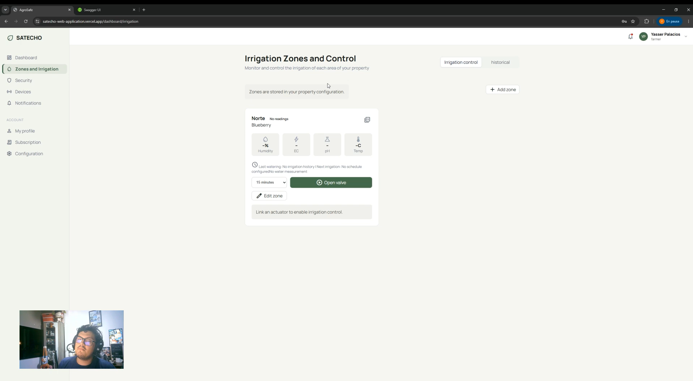
