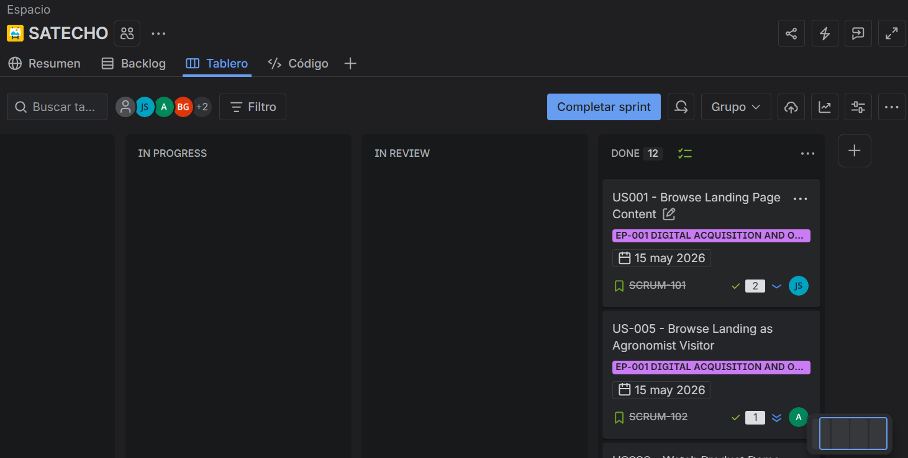

# Capítulo VI: Product Implementation, Validation & Deployment

## 6.1. Software Configuration Management

Esta sección detalla el marco normativo y técnico para la Gestión de Configuración de Software de **SATECHO**, estableciendo las directrices fundamentales que aseguran la consistencia operativa durante todo el ciclo de vida del desarrollo. Al abarcar la administración estructurada del código fuente, la configuración estandarizada de los entornos de trabajo y la orquestación de los procesos de despliegue, este marco metodológico busca salvaguardar la integridad, la seguridad y la trazabilidad de nuestra solución tecnológica; es por ello que, con la implementación de estas convenciones estratégicas, garantizamos una colaboración altamente eficiente y sincronizada entre todos los miembros del equipo, consolidando así un ecosistema de desarrollo robusto que minimiza los riesgos, facilita la resolución de conflictos y potencia la entrega continua de valor bajo los más exigentes estándares de calidad

### 6.1.1. Software Development Environment Configuration

Se especifican y describen las herramientas y productos de software que los miembros del equipo deben utilizar durante el ciclo de vida del desarrollo de **Agrosafe**, para garantizar la colaboración eficiente y la consistencia en el proyecto. Estas herramientas cubren todas las áreas clave, incluyendo la gestión del proyecto, el diseño UX/UI, el desarrollo, las pruebas y el despliegue.

| Actividad               | Herramienta / Guía                                     | Propósito                                                                          | Tipo de acceso / Ruta                                                                                                            |
| ----------------------- | ------------------------------------------------------ | ---------------------------------------------------------------------------------- | ------------------------------------------------------------------------------------------------------------------------------------- |
| Project Management      | Jira                                                   | Seguimiento de backlog, tareas, sprints y desempeño del equipo.  | [https://www.atlassian.com/es/software/jira](https://www.atlassian.com/es/software/jira)                                                                                               |
| Requirements Management | Gherkin Conventions                                    | Escritura de historias de usuario y criterios de aceptación en formato Given/When/Then.                       | [https://cucumber.io/docs/gherkin/](https://cucumber.io/docs/gherkin/)                                                                   |
| Product Design          | Structurizr C4                                         | Modelado de la arquitectura del sistema mediante diagramas de contexto, contenedores y componentes.                 | [https://playground.structurizr.com/](https://playground.structurizr.com/)                                                           |
| Product Design          | PlantUML                                               | Creación de diagramas de secuencia y de clases mediante código.             | [https://plantuml.com/](https://plantuml.com/)                                                           |
| Product Design          | Figma                                                  | Diseño de interfaces (UI) y prototipado de experiencia de usuario (UX) para web y móvil.                 | [https://figma.com](https://figma.com)                                                                                            |
| Product Design          | Cirkit Designer                                                  | Simulación y diseño de circuitos para los dispositivos IoT (ESP32).                                           | [https://app.cirkitdesigner.com](https://app.cirkitdesigner.com)                                                                                            |
| Software Development    | HTML5, CSS y JavaScript / Visual Studio Code                     | Desarrollo y maquetación del sitio web estático de la organización.                                              | [https://code.visualstudio.com](https://code.visualstudio.com)                        |
| Software Development    | Flutter y Dart / Android Studio                        | Desarrollo de la aplicación móvil multiplataforma.                                               | [https://developer.android.com/studio?hl=es-419](https://developer.android.com/studio?hl=es-419)                                                               |
| Software Development    | VueJS / Visual Studio Code                        | Desarrollo de la interfaz de la aplicación web principal.                                                  | [https://code.visualstudio.com](https://code.visualstudio.com)                                                         |
| Software Development    | Java y Spring Boot / IntelliJ IDEA                     | Desarrollo de la lógica de negocio y servicios del REST API.                                      | [https://www.jetbrains.com/idea/](https://www.jetbrains.com/idea/)                                                         |
| Software Development    | Python y Flask / Visual Studio Code                               | Desarrollo de la capa Edge para el procesamiento de datos IoT.                                    | [https://code.visualstudio.com](https://code.visualstudio.com/)                                    
| Software Development    | C++ / Arduino IDE                                      | Programación de firmware y lógica embebida para sensores y actuadores.                       | [https://www.arduino.cc/en/software](https://www.arduino.cc/en/software)                                                         ||
| Software Development    | Git + GitHub                                           | Control de versiones distribuido y gestión colaborativa del código.                                           | [https://github.com](https://github.com)                                                                                          |
| Software Testing        | JUnit5 & Mockito                                         | Pruebas unitarias, de integración y creación de dobles de prueba para el backend.                             | [https://junit.org/](https://junit.org/) / [https://site.mockito.org/](https://site.mockito.org/)           |
| Software Testing        | pytest                                                 | Automatización de pruebas unitarias para los servicios en Python (Edge).                                                | [https://docs.pytest.org/](https://docs.pytest.org/)   |
| Software Deployment     | Github Pages                                                | Hosting y despliegue del sitio web estático informativo.                                       | [https://docs.github.com/es/pages](https://docs.github.com/es/pages)                                                |
| Software Deployment     | Vercel                                                 | Plataforma de despliegue continuo para la aplicación web (Vue.js).                                          | [https://vercel.com/](https://vercel.com/)                                                |
| Software Deployment     | Firebase App Distribution                              | Distribución de versiones beta de la aplicación móvil para testing.                                        | [https://firebase.google.com/docs/app-distribution](https://firebase.google.com/docs/app-distribution)                                                |
| Software Deployment     | Azure App Service                                                | Alojamiento y escalado del REST API en la nube.                                          | [https://azure.microsoft.com/es-es/products/app-service/web](https://azure.microsoft.com/es-es/products/app-service/web)                                                | 
| Software Documentation  | Swagger                                                | Documentación interactiva de los endpoints y contratos del API.                      | [https://swagger.io/](https://swagger.io/)                                               |  

### 6.1.2. Source Code Management

En esta sección se define el marco de gobernanza para la gestión del código fuente de SATECHO, utilizando GitHub como plataforma centralizada de control de versiones. El equipo implementa una estrategia de ramificación estructurada y estándares de comunicación que garantizan la trazabilidad, la integridad y la calidad del software en cada etapa del ciclo de vida.

**Ecosistema de Repositorios**

La solución SATECHO se descompone en repositorios modulares para facilitar el mantenimiento y el despliegue independiente de sus componentes.

#### Repositorios de productos de software

| Producto de software | URL del repositorio                         | 
| -------------------- | --------------------------------------------| 
| Landing Page         | [https://github.com/S-A-T-E-C-H-O/Landing-Page-SATECHO](https://github.com/S-A-T-E-C-H-O/Landing-Page-SATECHO)                                            | 
| Web Application      | [https://github.com/S-A-T-E-C-H-O/Web-Application-SATECHO](https://github.com/S-A-T-E-C-H-O/Web-Application-SATECHO)                                            |
| Mobile Application   |                                             |
| REST Services API    | [https://github.com/S-A-T-E-C-H-O/Web-API-Service-SATECHO](https://github.com/S-A-T-E-C-H-O/Web-API-Service-SATECHO)                                            |
| Edge Services API    |                                             |
| Embedded Application |                                             |

**GitFlow Workflow**

Se adopta el modelo GitFlow para gestionar el flujo de trabajo colaborativo, permitiendo un desarrollo paralelo organizado y lanzamientos controlados.

- main: Rama productiva que contiene exclusivamente código estable y verificado.

- develop: Rama de integración principal donde convergen las nuevas funcionalidades.

- deployment: Rama dedicada a la orquestación de despliegues en entornos de staging y pre-producción.

**Ramas de Apoyo:**

- Feature Branches (feature/): Utilizadas para el desarrollo de nuevas funcionalidades. Se originan y finalizan en develop.
  - Ejemplo: `feature/sensor-humidity-integration`

- Release Branches (release/): Ramas de estabilización para preparar un nuevo lanzamiento oficial
  - Ejemplo: `release/v1.0.0`

- Hotfix Branches (hotfix/): Ramas de emergencia para corregir errores críticos en main. Se sincronizan con main y develop.
  - Ejemplo: `hotfix/api-connection-timeout`

**Semantic Versioning**

Para el control de versiones del software, se aplica el estándar Semantic Versioning (SemVer) bajo el formato `vX.Y.Z`:

- X (Major): Cambios estructurales o de ruptura (breaking changes).

- Y (Minor): Incorporación de nuevas funcionalidades compatibles con versiones anteriores.

- Z (Patch): Correcciones menores, parches de seguridad y optimizaciones.

**Conventional Commits**

En SATECHO, el historial de Git no es simplemente un registro de cambios, sino la narrativa técnica de la evolución de nuestro producto; por lo tanto, para garantizar que cada contribución sea legible, rastreable y automatizable, adoptamos el estándar de *Conventional Commits*. Este marco transforma cada "commit" en una unidad de información con significado semántico inmediato.

```bash
<type>[optional scope]: <description>
```

**I. Taxonomía de Cambios (Types)**

Definimos las siguientes categorías para clasificar la intención de cada intervención en el ecosistema:

- feat: Introducción de una nueva capacidad o funcionalidad (asociada a ramas feature/).

- fix: Resolución de bugs, errores de lógica o fallos técnicos detectados.

- docs: Modificaciones en la documentación técnica del producto (archivos README, guías de arquitectura o comentarios de código).

- refactor: Mejoras en la estructura del código que no alteran el comportamiento externo (limpieza, legibilidad o deuda técnica).

- chore: Tareas de mantenimiento, actualización de dependencias o configuraciones de entorno (ej. initial commit).

- test: Creación, actualización o reparación de pruebas unitarias, de integración o de carga.

**II. El Componente de Contexto (Scope)**

El scope es fundamental para identificar qué módulo está siendo intervenido. Debe escribirse entre paréntesis y referenciar de forma precisa el componente afectado (ej. iot, api, ui-web, auth).

**III. Semántica de la Descripción**

La descripción es el núcleo del mensaje y debe cumplir rigurosamente con los siguientes estándares de calidad:

- Idioma: Debe redactarse exclusivamente en inglés, como lengua estándar de la industria.

- Modo Imperativo: El mensaje debe leerse como una orden al código (ej. "add", no "added" o "adds").

- Formato: Escritura en minúsculas y finalización obligatoria con un punto final (.).

- Concisión: Debe ser un resumen directo del impacto del cambio, evitando detalles extensos que pertenecen a la sección opcional del body.

**IV. Anatomía de un Commit de Excelencia**

Un mensaje que cumple con nuestro estándar de ingeniería se visualiza de la siguiente manera:

```bash
feat(iot): implement soil moisture sensor calibration logic
```

**Proceso de Code Review**

Todo cambio propuesto debe someterse a un proceso de revisión riguroso mediante Pull Requests (PRs) antes de ser integrado en las ramas de jerarquía superior (develop o main).

- **Requisito de Aprobación:** Al menos un revisor debe validar el código para asegurar el cumplimiento de los estándares de arquitectura, seguridad y mantenibilidad.

- **Validación:** El proceso busca mitigar la introducción de bugs y garantizar que la nueva contribución se alinee con el diseño sistémico de SATECHO.

### 6.1.3. Source Code Style Guide & Conventions

En **SATECHO**, el código no solo debe ser funcional, sino también legible, mantenible y estéticamente profesional. Esta guía establece el "lenguaje común" para nuestro equipo multidisciplinario, asegurando que cualquier desarrollador pueda navegar por el ecosistema del proyecto con total claridad.

**Fundamentos Globales de Nomenclatura**

Independientemente del lenguaje de programación, aplicamos tres reglas inquebrantables:

1. **Código en Inglés:** Todo el léxico técnico (variables, métodos, clases, comentarios técnicos y nombres de archivos) se redactará exclusivamente en inglés para mantener la compatibilidad con estándares globales de la industria.

2. **Significado sobre Brevedad:** Preferimos nombres descriptivos como sensorReadingInterval sobre abreviaturas ambiguas como sri.

3. **Consistencia de Casos:**

- camelCase: Utilizado para variables, funciones y métodos. (Ej: getSoilMoisture()).

- PascalCase: Reservado para clases, interfaces, tipos y componentes. (Ej: AuthService).

- snake_case: Exclusivo para nombres de archivos y recursos físicos. (Ej: main_navigation.dart).

- kebab-case: Utilizado en clases CSS y selectores HTML. (Ej: btn-primary).

**Estándares por Tecnología**

#### Capa Web (HTML5 & CSS3)

Nos regimos por la [Google HTML/CSS Style Guide.](https://google.github.io/styleguide/htmlcssguide.html)

- **Semántica:** Uso obligatorio de etiquetas main, section, article y nav.

- **CSS BEM (Block Element Modifier):** Estructuramos las clases para evitar colisiones de estilos
  - Bloque: `.card`
  - Elemento: `.card__title`
  - Modificador: `.card__title--highlighted`

```html
<!-- Ejemplo de implementación semántica y BEM -->
<section class="crop-status">
  <h2 class="crop-status__title">Niveles de Humedad</h2>
  <button class="btn btn--success">Actualizar</button>
</section>
```

#### Lógica de Interacción (JavaScript ES6+)

Basado en la [Google JavaScript Style Guide.](https://google.github.io/styleguide/jsguide.html)

- **Inmutabilidad:** Priorizamos const sobre let. El uso de var queda estrictamente prohibido.

- **Programación Funcional:** Preferencia por funciones flecha (`=>`) y métodos de array (`map`, `filter`, `reduce`).

```javascript
const formatSensorData = (data) => {
  return data.map(reading => reading.toFixed(2));
};
```

#### Backend Robusto (Java & Spring Boot)

Seguimos los estándares de Clean Code y la guía de Google para Java.

- **Encapsulamiento:** Todo atributo de clase debe ser `private` y el acceso a métodos debe ser explícito (`public`, `protected`).

- **Inyección de Dependencias:** Preferimos la inyección por constructor sobre el uso de `@Autowired` en campos.

```java
public class SensorController {
    private final SensorService sensorService;

    public SensorController(SensorService sensorService) {
        this.sensorService = sensorService;
    }

    public ResponseEntity<String> getHumidity(Long id) {
        return ResponseEntity.ok("Reading: " + sensorService.getById(id));
    }
}
```

#### Desarrollo Móvil (Dart & Flutter)

Aplicamos las directrices de [Effective Dart.](https://dart.dev/effective-dart)

- **Tipado Fuerte:** Se debe declarar explícitamente el tipo de dato para evitar errores en tiempo de ejecución.

- **Widgets:** Dividir las interfaces en widgets pequeños y reutilizables.

```dart
class MoistureDisplay extends StatelessWidget {
  final double value;

  const MoistureDisplay({required this.value});

  @override
  Widget build(BuildContext context) {
    return Text('Humedad: $value%');
  }
}
```

**Comunicación del Negocio (Gherkin)**

Para nuestras pruebas de aceptación, utilizamos el lenguaje **Gherkin** con el fin de que los stakeholders entiendan el comportamiento del sistema sin leer código fuente.

- **Claridad:** Los archivos `.feature` deben describir procesos de negocio, no interacciones de UI (ej: usar "Inicia sesión" en lugar de "Hace click en el botón azul").

```gherkin
Feature: Monitoreo de Cultivos
  As a farmer
  I want to receive an alert when the soil is dry
  So that I can irrigate my crops on time

  Scenario: Detección de humedad baja
    Given the humidity sensor is active
    When the moisture level drops below 20%
    Then the system sends a notification to the mobile app
```

#### 6.1.4. Software Deployment Configuration

Para esta sección, el despliegue no es el final del camino, sino el inicio de la entrega de valor. Esta sección describe los protocolos y plataformas utilizados para transformar nuestro código fuente en productos digitales accesibles y funcionales. Hemos diseñado un ecosistema de despliegue híbrido que aprovecha lo mejor de cada proveedor de nube para garantizar alta disponibilidad y rendimiento.

#### Landing Page (GitHub Pages)

Nuestro portal informativo se despliega como un sitio estático optimizado, garantizando tiempos de carga mínimos y seguridad total.

- **Plataforma:** GitHub Pages.

- **Proceso de Despliegue:**

1. **Preparación: **Asegurar que el archivo principal sea un index.html en la raíz del repositorio SATECHO-static.

2. **Configuración de Origen:** Acceder a los Settings del repositorio en GitHub y navegar a la sección Pages.

3. **Activación:** Seleccionar la rama main como fuente de despliegue.

4. **Automatización:** GitHub generará automáticamente una URL bajo el dominio github.io. Cada push a la rama main actualizará el sitio en tiempo real.

#### Web Application (Vercel)

La aplicación administrativa de SATECHO, desarrollada en Vue.js, requiere un entorno ágil que soporte el renderizado moderno y despliegues atómicos.

- **Plataforma:** Vercel.

- Guía Detallada de Despliegue:

1. **Vinculación:** Iniciar sesión en Vercel e importar el repositorio `SATECHO-WebApp`.

2. **Configuración de Framework:** Vercel detectará automáticamente que se trata de un proyecto Vue.js. Validar que el comando de build sea `npm run build` y el directorio de salida sea `dist`.

3. **Variables de Entorno:** Configurar las variables `VUE_APP_API_URL` para apuntar a nuestro backend en Azure.

4. **Deployment:** Ejecutar el despliegue inicial. Vercel proporcionará una URL de previsualización para cada Pull Request y una URL productiva para la rama main.

#### Web Services - Backend (Azure App Service)

El corazón lógico de SATECHO, construido en Java con Spring Boot, se aloja en un entorno empresarial que garantiza escalabilidad y seguridad de datos.

- **Plataforma:** Azure App Service.

- **Proceso de Despliegue:**

1. **Instancia de Servicio:** Se crea un Web App en Azure seleccionando el stack de ejecución Java 17+ y el servidor web embebido.

2. **Pipeline de CI/CD:** Configuramos un archivo de flujo de trabajo en GitHub Actions que compile el proyecto usando Maven (mvn clean package).

3. **Publicación:** El artefacto .jar generado se envía automáticamente a Azure App Service mediante el perfil de publicación configurado en los Secrets de GitHub.

4. **Monitoreo:** Se habilita Application Insights para rastrear el rendimiento de los endpoints y posibles excepciones en tiempo real.

#### Mobile Application (Firebase App Distribution)

Para nuestra fase de prototipado y validación con usuarios clave, utilizamos un canal de distribución ágil antes del lanzamiento en tiendas oficiales.

- **Plataforma:** Firebase App Distribution.

- **Proceso de Despliegue:**

1. **Compilación:** Generar el paquete binario de la aplicación (.apk para Android o .ipa para iOS) desde el entorno de Flutter.

2. **Carga en Firebase:** Subir el binario a la consola de Firebase en la sección de App Distribution.

3. **Gestión de Testers:** Definir los correos electrónicos de los usuarios de prueba en SATECHO.

4. **Instalación:** Los usuarios reciben una invitación por correo para descargar la aplicación de forma segura a través de la app App Tester.

#### Embedded IoT Application (Firmware Over-The-Air)

El despliegue en hardware requiere un enfoque de actualización remota para evitar la intervención física en cada sensor instalado en el campo.

- **Método:** Actualización remota de firmware (OTA) y Flasheo Serial inicial.

- **Proceso de Despliegue:**

1. **Flasheo Inicial:** Durante la fabricación, se carga la versión estable mediante el Arduino IDE o PlatformIO.

2. **Preparación de Binarios:** Las nuevas versiones se compilan en archivos `.bin.`

3. **Almacenamiento de Updates:** Los binarios se cargan en Azure Blob Storage, el cual actúa como nuestro repositorio de firmware.

4. **Sincronización:** Los dispositivos ESP32 están programados para consultar periódicamente un endpoint de control. Si detectan una versión superior, descargan el binario de forma segura y reinician el sistema con el nuevo firmware.

## 6.2. Landing Page, Services & Applications Implementation

Tras consolidar los cimientos estratégicos del proyecto —trasladando los requisitos de negocio hacia un diseño de arquitectura robusto (C4 y diagramas de clase) y validando la experiencia de usuario (UX) mediante prototipos de alta fidelidad— entramos en la fase de materialización digital. En este apartado, la abstracción se convierte en ejecución: cada componente de la solución, desde la lógica embebida en los sensores hasta la interfaz de gestión en la nube, se desarrolla bajo un estándar de ingeniería de software de alto nivel.

El ecosistema de SATECHO se despliega a través de una suite de productos interconectados que comprenden:

- **Interfaces de Usuario:** Landing Page (captación), Aplicación Web (administración) y Aplicación Móvil (monitoreo en campo).

- **Núcleo de Datos:** REST API (procesamiento central) y Edge Services (gestión de latencia).

- **Hardware Layer:** Aplicación embebida para el control y lectura de sensores en tiempo real.

Para garantizar una entrega continua y controlada, la implementación se ha orquestado en tres ciclos iterativos (Sprints). Cada Sprint actúa como un hito evolutivo donde los objetivos definen el alcance técnico, permitiendo que la solución crezca de forma modular, segura y, sobre todo, alineada con las necesidades reales del sector agrícola.

### 6.2.1. Sprint 1

Dentro de este primer sprint, detallamos el proceso completo de implementación, pruebas, documentación y despliegue de los distintos componentes que conforman la solución DittoBox. Esto incluye el desarrollo de nuestra Landing Page, que sirve como punto de entrada y presentación de nuestro producto al público general, así como la implementación de los Servicios Web, Aplicaciones Web, Aplicaciones Móviles y Aplicaciones Embebidas que constituyen el núcleo funcional de nuestra propuesta.

A lo largo de esta sección, explicamos cómo hemos abordado cada fase del ciclo de vida del desarrollo de software para estos componentes, desde la planificación inicial y el diseño, hasta la ejecución de pruebas y el despliegue en entornos de producción. Detallamos las tecnologías utilizadas, los desafíos enfrentados y las soluciones implementadas para asegurar que cada componente cumpla con los requisitos establecidos y proporcione una experiencia de usuario óptima.

#### 6.2.1.1. Sprint Planning 1

<table>
  <tr>
    <td>Sprint #</td>
    <td>Sprint 1</td>
  </tr>
  <tr>
    <td colspan="2"><strong>Sprint Planning Background</strong></td>
  </tr>
  <tr>
    <td>Date</td>
    <td>2026-05-06</td>
  </tr>
  <tr>
    <td>Time</td>
    <td>21:35 p.m (GMT-5)</td>
  </tr>
  <tr>
    <td>Location</td>
    <td>Remoto, mediante la plataforma de reuniones Discord</td>
  </tr>
  <tr>
    <td>Prepared By</td>
    <td>Huamani Sánchez, José Diego</td>
  </tr>
  <tr>
    <td>Attendees (to planning meeting)</td>
    <td>Estrada Cajamune, Abraham Andrés / Gamio Upiachihua, Brenda Lucía / Quispe Erasmo, Raul Ronaldo / Palacios, Yasser Renteria </td>
  </tr>
  <tr>
    <td colspan="2"><strong>Sprint Goal & User Stories</strong></td>
  </tr>
  <tr>
    <td>Sprint 1 Goal</td>
    <td>
El objetivo de este primer Sprint es establecer la base de identidad digital y la arquitectura funcional inicial de SATECHO, centrándose en el despliegue de una Landing Page de alto impacto orientada a captar clientes potenciales del sector agrícola y agrónomos interesados en la integridad de datos. Nos enfocaremos en proyectar nuestra solución como el fin de las suposiciones empíricas sobre el riego y la iluminación, sustituyéndolas por un monitoreo automatizado y veraz. <br> Simultáneamente, desarrollaremos el núcleo de la Web Application, implementando un sistema de Authentication Management y un Dashboard preliminar mediante un Fake API para validar la navegación, las reglas de acceso y la visualización de datos. <br> Con este avance, buscamos confirmar la viabilidad del flujo de usuario y la solidez de la interfaz, asegurando que nuestra infraestructura sea capaz de transformar la incertidumbre del campo en decisiones precisas y seguras desde cualquier dispositivo inteligente.
    </td>
  </tr>
  <tr>
    <td>Sprint 1 Velocity</td>
    <td>41</td>
  </tr>
  <tr>
    <td>Sum of Story Points</td>
    <td>41</td>
  </tr>
</table>

#### 6.2.1.2. Aspect Leaders and Collaborations

Iniciamos nuestra trayectoria transformando la complejidad en orden. Durante este Sprint 1, definimos los pilares estratégicos del proyecto mediante una arquitectura de contextos delimitados, blindando la lógica de negocio desde la seguridad hasta el monitoreo operativo en los exigentes entornos de retail y restaurantes. Esta visión se traduce en acción a través de nuestra Matriz LACX, una brújula de colaboración que asigna responsabilidades claras para garantizar la cohesión del producto. Bajo este esquema de trabajo, el equipo ha convergido para dar vida a 41 puntos de historia, asegurando que cada funcionalidad no sea solo un requisito cumplido, sino una pieza clave de una infraestructura escalable y resiliente.

| Team Member (Last Name, First Name) |  GitHub Username  |     IAM     |     OnBoarding    | i18n | Dashboard |
| :---------------------------------- | :----------------: | :---------: | :---------: | :-------------------: | :--------------: 
| Huamani Sánchez, José Diego       |  `ProgramadorHuamani`  | **L** |            |           C           |                  |
| Estrada Cajamune, Abraham Andrés        |     `Abraham0310`     |            |      **L**      |           C           |        C        |
| Gamio Upiachihua, Brenda Lucía         |     `B-Gamio`     |            |      C      |                      |          **L**        |
| Quispe Erasmo, Raul Ronaldo      |    `Raul-QE`   |      C      |            |                      |        C        |
| Palacios, Yasser Renteria        |      `Mitos20`     |            |      C      |      **L**      |                  |

#### 6.2.1.3. Sprint Backlog 3

Alineado con los objetivos estratégicos definidos en nuestra planificación, este backlog constituye la hoja de ruta técnica diseñada para materializar el primer incremento funcional de la plataforma. El propósito central de este ciclo se divide en dos frentes críticos: en primer lugar, el despliegue de una Landing Page de alto impacto orientada a proyectar el valor de negocio del ecosistema; en segundo lugar, la construcción de la interfaz frontend de la Aplicación Web. Esta última habilitará las capacidades esenciales que permitirán a los administradores de restaurantes y tiendas retail gestionar perfiles, autenticarse de manera segura, controlar existencias en inventario, administrar dispositivos IoT y registrar transacciones comerciales de forma intuitiva.

Para transformar esta visión en un desarrollo ágil y ejecutable, el equipo realizó una deconstrucción de los requisitos de negocio en Historias de Usuario, las cuales fueron posteriormente atomizadas en tareas técnicas específicas de implementación y pruebas. Todo este flujo de trabajo, junto con la medición de la velocidad del equipo y el cumplimiento de los puntos de historia, se gestiona y audita centralizadamente a través de Jira, garantizando una trazabilidad absoluta y visibilidad del progreso en tiempo real para toda la organización.

**Proyecto en Jira:** [https://satecho.atlassian.net/jira/software/projects/SCRUM/boards/1](https://satecho.atlassian.net/jira/software/projects/SCRUM/boards/1)




A continuación, se presenta la tabla con las tareas designadas junto con cada uno de los miembros del equipo para que se sean completados de manera satisfactoria durante este primer sprint.

| Sprint 1 | Sprint Backlog 1 | | | | | | |
|----------|-----------------|----------------|-------|-------------|-------------------|-------------|--------|
| **User Story** | **Título** | **Work Item/Task** | **Título** | **Descripción** | **Estimation (SP)** | **Assigned to** | **Status** |
| UTI-439 | US-11: Gestión de perfil | UTI-592 | Desarrollar la visualización de la información del perfil | Como usuario de la plataforma, quiero gestionar la información de mi perfil, para asegurar que mi información sea la correcta. | 0.5 | José Jahaziel Guerra Perez | Done |
| | | UTI-593 | Implementar la edición de datos básicos | | | Gabriela Nicole Shapiama Rivera | Done |
| | | UTI-595 | Configurar preferencias del sistema | | | Matias D. | Done |
| UTI-429 | US-01: Conocer el valor de negocio de la plataforma | UTI-526 | Desarrollar la sección de beneficios | Como visitante del sitio web estático, quiero determinar el valor de negocio, para tomar la decisión de convertirme en usuario de la plataforma. | 0.4 | Julio Castro Alejos | Done |
| | | UTI-527 | Crear y estructurar la sección de preguntas frecuentes | | | Matias D. | Done |
| | | UTI-542 | Implementar Media Queries en el CSS | | | Matias D. | Done |
| | | UTI-545 | Implementar etiquetas ARIA  | | | Gabriela Nicole Shapiama Rivera | Done |
| | | UTI-548 | Permitir el cambio dinámico de idioma | | | Julio Castro Alejos | Done |
| UTI-430 | US-02: Aumento de confianza sobre la plataforma | UTI-528 | Implementar la sección de testimonios | Como visitante, quiero conocer sobre el producto y quienes fueron los creadores, para aumentar la confianza sobre el uso de la plataforma. | 0.5 | Matias D. | Done |
| | | UTI-529 | Crear la sección de términos y condiciones | | | Gabriela Nicole Shapiama Rivera | Done |
| | | UTI-538 | Crear la sección de políticas de privacidad | | | Julio Castro Alejos | Done |
| | | UTI-543 | Implementar Media Queries en el CSS | | | Matias D. | Done |
| | | UTI-546 | Implementar etiquetas ARIA (Accesibilidad) | | | Gabriela Nicole Shapiama Rivera | Done |
| | | UTI-549 | Permitir el cambio dinámico de idioma | | | Julio Castro Alejos | Done |
| UTI-431 | US-03: Acceso a las aplicaciones | UTI-531 | Implementar el flujo de redirección a la app móvil | Como visitante, quiero acceder o descargar la aplicación, para empezar a usarla en mis operaciones de negocio. | 0.4 | Julio Castro Alejos | Done |
| | | UTI-532 | Implementar el flujo de acceso a la plataforma web | | | Gabriela Nicole Shapiama Rivera | Done |
| | | UTI-533 | Diseñar la interfaz de selección entre plataformas | | | Matias D. | Done |
| | | UTI-544 | Implementar Media Queries en el CSS | | | Matias D. | Done |
| | | UTI-547 | Implementar etiquetas ARIA (Accesibilidad) | | | Gabriela Nicole Shapiama Rivera | Done |
| UTI-432 | US-04: Registro de usuario | UTI-534 | Desarrollar lógica de creación de cuenta | Como visitante, quiero registrarme como administrador de una tienda retail, para acceder a las funcionalidades de la aplicación. | 0.5 | Matias D. | Done |
| | | UTI-535 | Integrar verificación de seguridad de contraseña | | | Antonio Navarro | Done |
| | | UTI-536 | Redirigir al usuario tras registro exitoso | | | Matias D. | Done |
| | | UTI-537 | Desarrollar un registro del negocio del usuario | | | Antonio Navarro | Done |
| UTI-445 | US-17: Control y ajuste de stock en lotes | UTI-554 | Implementar la funcionalidad de registro de ingreso de mercadería | Como administrador del negocio, quiero registrar los movimientos de entrada y salida de suministros, así como definir sus niveles de reserva, para garantizar que el inventario esté siempre actualizado. | 0.3 | Julio Castro Alejos | Done |
| | | UTI-556 | Implementar validaciones para el registro de movimientos | | | Julio Castro Alejos | Done |
| | | UTI-557 | Registrar historial de movimientos y ajustes de stock | | | Gabriela Nicole Shapiama Rivera | In-Progress |
| UTI-460 | US-32: Gestionar y consultar las ventas del negocio | UTI-578 | Implementar la funcionalidad de registro de ventas | Como administrador del negocio, quiero registrar y consultar las ventas de productos o combos, para mantener actualizado el inventario y hacer seguimiento al desempeño comercial. | 0.5 | Nicolás Juárez | Done |
| | | UTI-579 | Implementar la funcionalidad de consulta de ventas | | | Farid Coronel | To-Review |
| | | UTI-580 | Visualizar el detalle de una venta | | | José Jahaziel Guerra Perez | Done |
| UTI-449 | US-21: Administrar dispositivos y sus parámetros de abastecimiento | UTI-562 | Implementar la configuración y almacenamiento de parámetros de abastecimiento | Como administrador, quiero administrar los dispositivos y sus límites de reposición, para organizar el stock en tienda y evitar discrepancias de inventario. | 0.5 | Farid Coronel | Done |
| | | UTI-564 | Diseñar la interfaz de administración de dispositivos | | | Gabriela Nicole Shapiama Rivera | In-Progress |
| | | UTI-565 | Desarrollar la edición de dispositivos | | | Nicolás Juárez | Done |

#### 6.2.1.4. Development Evidence for Sprint Review

Este apartado constituye el compendio de evidencia técnica y operativa que respalda los hitos alcanzados durante este primer ciclo de desarrollo, donde la materialización del software se ha concentrado en desplegar las versiones iniciales de la Landing Page y la Aplicación Web para sentar las bases de interacción y gobernanza de la plataforma. En ese sentido, el esfuerzo del equipo se distribuyó estratégicamente de manera simultánea; por un lado, se consolidó la Landing Page como una vitrina digital de alto impacto con diseño internacionalizado y contenido visual que integra con éxito los módulos de beneficios, planes de suscripción y redirecciones interactivas, mientras que, por otro lado, se desarrolló la Aplicación Web bajo un riguroso enfoque de Domain-Driven Design (DDD) validado provisionalmente mediante la simulación de servicios con Beeceptor, desplegando las interfaces críticas. Finalmente, como garantía de transparencia, rigor de ingeniería y control de configuración, este bloque sirve de antesala para el registro cronológico de _commits_ que certifica la autoría, el propósito y la evolución del código fuente integrado satisfactoriamente en este sprint.

| Repository              | Branch                   | Commit Id                                | Commit Message                                                                                                 | Commited On |
|-------------------------|--------------------------|------------------------------------------|----------------------------------------------------------------------------------------------------------------|-------------|
| Landing-Page-SATECHO   | main                   | 2392bd0 | chore: initial commit.                                                                                         | 12/05/26    |
| Landing-Page-SATECHO   | feature/navigation-bar              | d3b8b7d | feat(navigation): add the navigation bar about the differents section into the landing page that the visitors can watch commit.                                                    | 12/05/26    |
| Landing-Page-SATECHO   | feature/hero-section           | d78a3f6 | feat(hero): add the main content about the phareses and a little description about the SATECHO product commit.                                  | 12/05/26    |
| Landing-Page-SATECHO   | feature/stadistics-benefits-section      | 7216027 | feat(stadistics): add the quantitative values about the benefits to use the SATECHO Solution representing into these section commit.                                                                                         | 12/05/26    |
| Landing-Page-SATECHO   | feature/information-architecture                   | e0b8e0f | Merge pull request #3 from S-A-T-E-C-H-O/feature/stadistics-benefits-section                                                          | 12/05/26    |
| Landing-Page-SATECHO   | develop                   | 0fbd062 | Build(hosting): execute initial deployment of landing.                             | 14/05/26    |
| Web-Application-SATECHO    | main                   | 14a4ba0 | Initial commit        | 13/05/26    |
| Web-Application-SATECHO    | feature/initial-config                 | 8941169 | feat: complete initial frontend configuration        | 13/05/26    |
| Web-Application-SATECHO    | feature/auth                   | 695ff43 | refactor(auth): componentize registration flow and improve verification viewsstadistics-benefits-section        | 14/05/26    |
| Web-Application-SATECHO    | feature/auth                    | 72267da | feat: connect auth flow to beeceptor   | 14/05/26    |
| Web-Application-SATECHO    | feature/auth                    | f6d23c6 | docs: document beeceptor auth mock    | 14/05/26    |
| Web-Application-SATECHO    | feature/auth                    | 8b8be32 | chore: add pnpm-lock.yaml    | 14/05/26    |
| Web-Application-SATECHO    | feature/onboarding                   | dfa4f78 | add onboarding flow    | 15/05/26    |
| Web-Application-SATECHO    | feature/dashboards                  | d600b13 | feat: add agricultural dashboard    | 15/05/26    |
| Web-Application-SATECHO    | feature/dashboards                  | d600b13 | fix: improve dashboard interactions | 15/05/26    |
| Web-Application-SATECHO    | feature/auth-onboarding-dashboard-sync         | 7544e70 | feat: sync auth onboarding data with dashboard | 15/05/26    |
| Web-Application-SATECHO    | feature/i18n       | 6cc792c | feat(web-app): implement i18n support for english and spanish translations | 15/05/26    |
| Web-Application-SATECHO    | feature/deploy       | ee046e3 | build(web-app): execute initial deployment of the dashboard to firebase | 15/05/26    |

#### 6.2.1.5. Testing Suite Evidence for Sprint Review

Dado el carácter de este primer sprint, enfocado en el despliegue visual de la **Landing Page** y la validación de interfaces mediante una API simulada (Beeceptor), no se han estructurado scripts de testing automatizado en este ciclo. Al priorizar la arquitectura base y la experiencia UX sobre lógica persistente, la suite de pruebas se posterga estratégicamente para los próximos sprints, colindando con la integración de los servicios reales.

#### 6.2.1.6. Execution Evidence for Sprint Review

#### 6.2.1.7. Services Documentation Evidence for Sprint Review

#### 6.2.1.8. Software Deployment Evidence for Sprint Review

#### 6.2.1.9. Team Collaborations Insights during Sprint